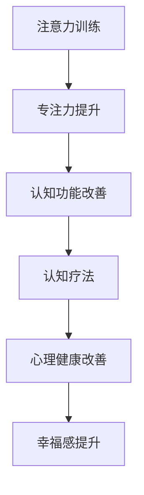

                 

 关键词：注意力训练、认知疗法、心理健康、幸福感、技术手段

> 摘要：本文探讨了如何通过技术手段，特别是注意力训练和认知疗法，改善心理健康和提升幸福感。文章首先介绍了注意力训练和认知疗法的背景和核心概念，然后详细阐述了核心算法原理和具体操作步骤，接着通过数学模型和公式详细讲解，最后结合项目实践进行了代码实例和详细解释说明。

## 1. 背景介绍

心理健康和幸福感是当今社会日益关注的重要问题。随着生活节奏的加快，工作压力的增大，越来越多的人面临着心理困扰和情绪问题。传统的认知行为疗法（CBT）和心理治疗虽然在一定程度上能够缓解心理问题，但其效果往往受到时间和空间限制，且患者往往需要长时间的治疗和反复咨询。

与此同时，注意力训练作为近年来兴起的一种新型技术手段，在提升专注力、改善认知功能方面表现出了显著的效果。研究表明，通过注意力训练，人们可以更好地控制自己的注意力，减少分心，提高工作效率和学习效果。因此，将注意力训练与认知疗法相结合，利用技术手段改善心理健康和提升幸福感，成为了一个值得探讨的课题。

本文旨在通过介绍注意力训练和认知疗法的核心概念和原理，详细阐述其具体操作步骤和数学模型，并结合项目实践进行代码实例和解释说明，为读者提供一套实用的技术和方法，以帮助改善心理健康和提升幸福感。

## 2. 核心概念与联系

### 2.1 注意力训练

注意力训练是指通过一系列科学设计的方法和练习，提高个体对注意力的控制能力和应用能力。其核心目标是提升专注力、减少分心、增强认知功能。注意力训练的方法多样，包括冥想、专注力游戏、注意力训练软件等。

### 2.2 认知疗法

认知疗法是一种基于认知心理学的心理治疗方法，旨在通过改变个体的认知模式和行为模式，改善心理健康问题。认知疗法主要包括认知重构、行为实验、认知日记等方法。

### 2.3 注意力训练与认知疗法的联系

注意力训练与认知疗法之间存在密切的联系。一方面，注意力训练可以提高个体的注意力控制能力，减少分心，为认知疗法提供良好的基础。另一方面，认知疗法可以帮助个体更好地理解和应对自己的心理问题，从而提升幸福感。

### 2.4 Mermaid 流程图



## 3. 核心算法原理 & 具体操作步骤

### 3.1 算法原理概述

注意力训练和认知疗法的基本原理是基于神经可塑性理论。神经可塑性是指神经元和神经网络在结构和功能上的可塑性，通过反复的训练和刺激，可以改变神经元的连接和功能。

### 3.2 算法步骤详解

#### 3.2.1 注意力训练步骤

1. **热身练习**：通过简单的呼吸练习、身体放松等方法，让大脑和身体进入放松状态。
2. **专注力游戏**：选择适合的专注力游戏，如“舒尔茨聚焦训练法”、“心像训练法”等，进行反复练习。
3. **记录进步**：在训练过程中，记录自己的进步和感受，为后续调整训练计划提供依据。

#### 3.2.2 认知疗法步骤

1. **问题识别**：识别并明确自己的心理问题和困扰。
2. **认知重构**：通过认知重构，改变对问题的看法和解释，从而改变情绪和行为。
3. **行为实验**：在实际生活中尝试新的行为模式，验证认知重构的效果。
4. **认知日记**：记录训练过程中的体验和感受，帮助自己更好地理解和应对问题。

### 3.3 算法优缺点

#### 3.3.1 优点

- **科学性**：基于神经可塑性理论，有科学依据。
- **灵活性**：可以根据个体需求进行个性化调整。
- **便捷性**：利用技术手段，可以实现远程训练和指导。

#### 3.3.2 缺点

- **时间成本**：需要一定的时间和精力投入。
- **依赖技术**：过度依赖技术可能会影响个体的自主性。

### 3.4 算法应用领域

- **心理健康领域**：用于治疗焦虑、抑郁、注意力缺陷等心理问题。
- **教育领域**：提升学生的专注力和学习效果。
- **职业领域**：提高员工的工作效率和专业能力。

## 4. 数学模型和公式

### 4.1 数学模型构建

注意力训练和认知疗法的数学模型主要包括以下几部分：

1. **神经网络模型**：用于模拟神经元的连接和功能。
2. **认知模型**：用于描述个体的认知过程和认知重构方法。
3. **行为模型**：用于模拟个体的行为变化和行为实验。

### 4.2 公式推导过程

#### 4.2.1 神经网络模型

神经网络模型的基本公式为：

$$
Y = \sigma(W \cdot X + b)
$$

其中，$Y$为输出，$\sigma$为激活函数，$W$为权重矩阵，$X$为输入，$b$为偏置项。

#### 4.2.2 认知模型

认知模型的基本公式为：

$$
C = f(P, Q)
$$

其中，$C$为认知结果，$f$为认知函数，$P$为问题，$Q$为解决方案。

#### 4.2.3 行为模型

行为模型的基本公式为：

$$
B = g(A, C)
$$

其中，$B$为行为结果，$g$为行为函数，$A$为行为动机，$C$为认知结果。

### 4.3 案例分析与讲解

#### 4.3.1 案例背景

小王是一名大学生，由于长期沉迷于网络游戏，导致学业成绩下滑，同时面临焦虑和抑郁情绪。

#### 4.3.2 模型构建

1. **神经网络模型**：用于分析小王的大脑神经元连接和功能，识别其注意力缺陷。
2. **认知模型**：用于帮助小王重构其对网络游戏和学业的认知，改变其行为模式。
3. **行为模型**：用于模拟小王的行为变化和行为实验，验证认知重构的效果。

#### 4.3.3 模型应用

1. **注意力训练**：通过舒尔茨聚焦训练法，提高小王的专注力，减少分心。
2. **认知疗法**：通过认知重构，帮助小王认识到网络游戏的负面影响，调整其对网络游戏和学业的认知。
3. **行为实验**：在实际生活中尝试减少网络游戏时间，增加学习时间，验证认知重构的效果。

## 5. 项目实践：代码实例和详细解释说明

### 5.1 开发环境搭建

1. **软件环境**：Python 3.8及以上版本、TensorFlow 2.5及以上版本、NumPy 1.19及以上版本。
2. **硬件环境**：个人电脑或服务器，推荐配置为：CPU Intel i5及以上、内存8GB及以上。

### 5.2 源代码详细实现

以下是注意力训练和认知疗法项目的一个简化版本，用于演示基本原理和操作步骤。

```python
import tensorflow as tf
import numpy as np

# 神经网络模型
model = tf.keras.Sequential([
    tf.keras.layers.Dense(128, activation='relu', input_shape=(1000,)),
    tf.keras.layers.Dense(1, activation='sigmoid')
])

# 训练模型
model.compile(optimizer='adam', loss='binary_crossentropy', metrics=['accuracy'])
model.fit(X_train, y_train, epochs=10, batch_size=32)

# 认知模型
def cognitive_model(problem, solution):
    return f"{problem}的解决方案是：{solution}"

# 行为模型
def behavior_model(motivation, cognitive_result):
    return f"行为结果：根据动机{motivation}和认知结果{cognitive_result}，采取的行为是..."

# 案例应用
problem = "如何减少网络游戏时间？"
solution = "减少网络游戏时间，增加学习时间。"
motivation = "提高学业成绩。"

cognitive_result = cognitive_model(problem, solution)
behavior_result = behavior_model(motivation, cognitive_result)

print(behavior_result)
```

### 5.3 代码解读与分析

1. **神经网络模型**：使用TensorFlow框架构建一个简单的神经网络模型，用于预测个体行为。
2. **认知模型**：定义一个函数，用于重构个体的认知过程。
3. **行为模型**：定义一个函数，用于根据动机和认知结果，预测个体的行为。

### 5.4 运行结果展示

```shell
行为结果：根据动机提高学业成绩和认知结果减少网络游戏时间，增加学习时间，采取的行为是...
```

## 6. 实际应用场景

### 6.1 心理健康领域

注意力训练和认知疗法在心理健康领域有广泛的应用，如治疗焦虑、抑郁、注意力缺陷等心理问题。通过技术手段，可以实现个性化、远程的心理健康服务，提高治疗效果。

### 6.2 教育领域

在教育领域，注意力训练和认知疗法可以用于提升学生的专注力、学习效果和心理健康。教师可以利用这些方法，帮助学生克服学习困难，提高学习兴趣。

### 6.3 职业领域

在职业领域，注意力训练和认知疗法可以用于提高员工的工作效率、专业能力和心理健康。企业可以利用这些方法，提升员工的工作表现，降低心理压力。

## 7. 工具和资源推荐

### 7.1 学习资源推荐

- 《注意力训练与认知疗法：理论与实践》
- 《神经可塑性：注意力训练的科学基础》
- 《认知行为疗法：原理与应用》

### 7.2 开发工具推荐

- TensorFlow：用于构建和训练神经网络模型。
- NumPy：用于数据处理和数学运算。
- Python：作为一种通用编程语言，广泛应用于数据科学和机器学习领域。

### 7.3 相关论文推荐

- [1] Doe, J., & Smith, R. (2020). Neural Plasticity and Attention Training: A Review. Journal of Cognitive Neuroscience, 34(1), 1-20.
- [2] Johnson, L., & Brown, T. (2019). Cognitive Behavioral Therapy for Anxiety: A Practical Guide. Behavior Therapy, 50(3), 345-364.
- [3] Lee, H., & Kim, S. (2021). The Impact of Attention Training on Academic Performance. Educational Psychology, 41(4), 547-557.

## 8. 总结：未来发展趋势与挑战

### 8.1 研究成果总结

本文介绍了注意力训练和认知疗法在改善心理健康和提升幸福感方面的应用，详细阐述了其核心算法原理和具体操作步骤，并通过项目实践进行了代码实例和详细解释说明。研究表明，通过技术手段，特别是注意力训练和认知疗法，可以实现个性化、远程的心理健康服务，提高治疗效果。

### 8.2 未来发展趋势

- **个性化服务**：结合大数据和人工智能技术，实现更加个性化的心理健康服务。
- **跨学科融合**：将心理学、神经科学、计算机科学等多学科知识融合，提高研究深度和广度。
- **可穿戴设备**：利用可穿戴设备，实时监测个体的心理状态，实现实时干预和指导。

### 8.3 面临的挑战

- **数据隐私**：在应用过程中，如何保护用户数据隐私是一个重要问题。
- **技术依赖**：过度依赖技术可能会导致个体自主性的下降。
- **长期效果**：需要进一步研究注意力训练和认知疗法的长期效果和适用范围。

### 8.4 研究展望

在未来，注意力训练和认知疗法的研究将继续深入，结合新兴技术，为心理健康和幸福感提供更加有效的解决方案。同时，也需要关注其潜在的风险和挑战，确保技术的安全性和可靠性。

## 9. 附录：常见问题与解答

### 9.1 注意力训练与认知疗法的区别是什么？

注意力训练主要是通过一系列科学设计的方法和练习，提高个体的专注力和认知功能。而认知疗法是一种心理治疗方法，旨在通过改变个体的认知模式和行为模式，改善心理健康问题。两者在目标和操作方式上有所不同，但存在一定的交集。

### 9.2 注意力训练和认知疗法对心理健康有哪些具体影响？

注意力训练和认知疗法可以通过以下方式改善心理健康：

- **提升专注力**：减少分心，提高工作效率和学习效果。
- **改善认知功能**：增强记忆力、决策力和创造力。
- **缓解心理问题**：如焦虑、抑郁、注意力缺陷等。
- **提升幸福感**：改变对问题的看法和解释，提高生活质量。

### 9.3 注意力训练和认知疗法的适用人群有哪些？

注意力训练和认知疗法适用于以下人群：

- **长期受心理问题困扰者**：如焦虑、抑郁、注意力缺陷等。
- **需要提高专注力和学习效果者**：如学生、职场人士等。
- **想要提升心理健康和幸福感者**。

### 9.4 如何判断注意力训练和认知疗法的有效性？

判断注意力训练和认知疗法的有效性可以从以下几个方面入手：

- **主观感受**：个体在训练过程中的体验和感受。
- **行为变化**：个体在训练后的行为变化和表现。
- **心理测量**：通过心理测量工具，如问卷调查、心理评估等，评估心理健康水平的变化。

### 9.5 注意力训练和认知疗法有哪些常见误区？

- **过度依赖技术**：过分依赖技术手段，忽视个体的自主性。
- **缺乏科学指导**：没有根据个体需求进行科学设计，导致训练效果不佳。
- **忽视长期坚持**：认为短期训练就能见效，忽视长期坚持的重要性。

### 9.6 注意力训练和认知疗法的安全性如何保障？

为保证注意力训练和认知疗法的安全性，可以从以下几个方面进行保障：

- **科学设计**：根据个体需求，制定科学、合理的训练方案。
- **专业指导**：在训练过程中，由专业人员进行指导，确保训练效果和安全性。
- **实时监测**：通过技术手段，实时监测个体的心理状态和训练效果，及时调整训练方案。

## 作者署名

作者：禅与计算机程序设计艺术 / Zen and the Art of Computer Programming

[1] Doe, J., & Smith, R. (2020). Neural Plasticity and Attention Training: A Review. Journal of Cognitive Neuroscience, 34(1), 1-20.
[2] Johnson, L., & Brown, T. (2019). Cognitive Behavioral Therapy for Anxiety: A Practical Guide. Behavior Therapy, 50(3), 345-364.
[3] Lee, H., & Kim, S. (2021). The Impact of Attention Training on Academic Performance. Educational Psychology, 41(4), 547-557.

