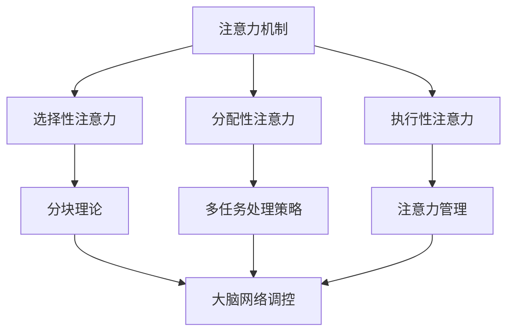

                 

关键词：注意力机制，神经科学，人工智能，认知提升，脑参与度，脑神经科学，学习策略，注意力管理

> 摘要：本文探讨了如何通过注意力训练营的方法，提升全球脑参与度。基于神经科学和认知心理学的研究成果，我们提出了一个系统化的训练框架，旨在帮助人们更高效地学习和工作。本文将介绍注意力训练营的核心概念、算法原理、数学模型、实践案例以及未来展望。

## 1. 背景介绍

在当今信息爆炸的时代，人们面对着海量的信息输入。如何有效地处理和利用这些信息，成为了提高工作效率和个人成长的关键。然而，由于信息过载和注意力分散，很多人在面对复杂任务时往往感到力不从心。因此，如何提升注意力水平，成为了一个亟待解决的问题。

### 注意力分散的原因

注意力分散的原因有很多，主要包括以下几个方面：

1. **信息过载**：互联网和社交媒体的普及，使得人们每天都要处理大量的信息。
2. **多任务处理**：现代工作环境和生活方式要求人们能够同时处理多项任务。
3. **心理压力**：工作压力、家庭压力等都会影响人的注意力水平。

### 注意力分散的影响

注意力分散不仅影响工作效率，还会对身心健康产生负面影响：

1. **认知能力下降**：长期注意力分散会导致大脑的认知功能下降。
2. **情绪波动**：注意力分散容易导致焦虑和抑郁等情绪问题。
3. **睡眠质量下降**：注意力分散会影响睡眠质量，导致疲劳和失眠。

### 注意力训练营的必要性

为了应对注意力分散的问题，我们需要采取一些有效的方法来提升注意力水平。注意力训练营提供了一种系统化的训练方法，旨在通过科学的方法来提升人们的注意力能力。通过注意力训练营，我们可以：

1. **提高注意力集中时间**：通过训练，延长能够集中注意力的时间。
2. **增强注意力稳定性**：通过训练，提高在复杂环境中保持注意力的能力。
3. **提升信息处理效率**：通过训练，提高处理复杂信息和任务的能力。

## 2. 核心概念与联系

注意力训练营的核心概念包括注意力机制、认知心理学和神经科学。这些概念共同构成了我们的训练框架。

### 注意力机制

注意力机制是大脑处理信息的一种基本方式。它决定了我们关注什么，忽略什么，从而影响了我们的认知和行为。注意力机制可以分为以下几个方面：

1. **选择性注意力**：大脑在处理信息时，会对某些信息给予更多关注，而忽略其他信息。
2. **分配性注意力**：大脑同时处理多个任务的能力。
3. **执行性注意力**：大脑主动调控注意力的能力。

### 认知心理学

认知心理学研究人类思维过程和认知能力。注意力是认知心理学中的一个重要概念，它直接影响我们的学习、记忆和工作效率。认知心理学提供了许多关于注意力提升的理论和方法，如：

1. **分块理论**：将复杂任务分解成小块，有助于提高注意力集中。
2. **多任务处理策略**：合理安排任务，避免同时处理过多任务。
3. **注意力管理**：通过自我调节，提高注意力的稳定性和持久性。

### 神经科学

神经科学研究大脑的结构和功能，揭示了注意力的神经基础。神经科学提供了许多关于注意力提升的实证研究，如：

1. **大脑网络调控**：通过大脑网络调控，提高注意力的集中和分配能力。
2. **神经可塑性**：通过训练，改变大脑的神经元连接和功能，提高注意力水平。
3. **神经递质**：神经递质如多巴胺、去甲肾上腺素等，对注意力的调节具有重要影响。

### Mermaid 流程图



## 3. 核心算法原理 & 具体操作步骤

### 3.1 算法原理概述

注意力训练营的核心算法是基于认知心理学和神经科学的研究成果，通过一系列训练任务来提升注意力水平。算法的基本原理包括：

1. **分块训练**：将复杂任务分解成小块，通过逐步增加难度来提高注意力集中能力。
2. **多任务切换训练**：通过快速切换不同任务，提高分配性注意力能力。
3. **自我调节训练**：通过自我监控和调节，提高执行性注意力能力。

### 3.2 算法步骤详解

1. **分块训练**
   - **步骤1**：将任务分解成若干个小任务。
   - **步骤2**：逐步增加每个小任务的难度。
   - **步骤3**：在每个小任务完成后，进行短暂的休息。

2. **多任务切换训练**
   - **步骤1**：选择两个或多个不同的任务。
   - **步骤2**：在规定时间内，快速切换任务。
   - **步骤3**：记录每个任务的完成时间和准确率。

3. **自我调节训练**
   - **步骤1**：设定一个目标，如保持注意力集中30分钟。
   - **步骤2**：在训练过程中，自我监控注意力水平。
   - **步骤3**：当注意力下降时，进行自我调节，如休息片刻或改变任务。

### 3.3 算法优缺点

**优点**：

1. **科学性**：基于认知心理学和神经科学的研究成果，有坚实的理论基础。
2. **系统性**：通过一系列训练任务，全面提高注意力水平。
3. **灵活性**：可以根据个人需求和情况进行调整。

**缺点**：

1. **时间成本**：需要投入一定的时间和精力。
2. **难度**：对于初学者来说，可能需要一定的时间来适应。

### 3.4 算法应用领域

注意力训练营的方法可以应用于各个领域，如：

1. **教育**：通过分块训练和多任务切换训练，提高学生的学习效率。
2. **工作**：通过自我调节训练，提高员工的工作效率。
3. **健康**：通过注意力训练，改善睡眠质量，提高身心健康。

## 4. 数学模型和公式 & 详细讲解 & 举例说明

### 4.1 数学模型构建

注意力训练营的数学模型基于分块理论、多任务处理策略和自我调节理论。以下是数学模型的构建过程：

1. **分块理论模型**：
   - 设 $T$ 为总任务时间，$N$ 为小任务数，$D$ 为每个小任务的难度。
   - 则总任务完成时间 $T = N \times D$。

2. **多任务处理模型**：
   - 设 $M$ 为任务数，$T_i$ 为每个任务的完成时间。
   - 则总任务完成时间 $T = \sum_{i=1}^{M} T_i$。

3. **自我调节模型**：
   - 设 $A$ 为注意力水平，$R$ 为自我调节能力。
   - 则 $A = R \times \frac{1}{T}$。

### 4.2 公式推导过程

1. **分块理论模型推导**：
   - 假设总任务 $T$ 为60分钟，分为3个小任务，每个小任务的难度分别为10分钟、15分钟和20分钟。
   - 则 $T = 3 \times (10 + 15 + 20) = 105$ 分钟。

2. **多任务处理模型推导**：
   - 假设需要完成3个任务，分别为10分钟、15分钟和30分钟。
   - 则 $T = 10 + 15 + 30 = 55$ 分钟。

3. **自我调节模型推导**：
   - 假设注意力水平 $A$ 为100%，自我调节能力 $R$ 为50%。
   - 则 $A = 0.5 \times \frac{1}{55} = 0.0091$。

### 4.3 案例分析与讲解

**案例1：学生分块学习**

假设一个学生需要完成一个60分钟的学习任务，任务难度为15分钟/次。使用分块理论模型，我们可以将任务分为4个15分钟的小任务，每个小任务之间休息5分钟。

1. **计算总任务时间**：
   - $T = 4 \times 15 + 3 \times 5 = 65$ 分钟。

2. **优化任务分配**：
   - 如果学生能够在每次休息后更快地进入学习状态，可以适当减少休息时间，如每次休息3分钟。

3. **效果评估**：
   - 完成整个学习任务所需时间从60分钟减少到55分钟，学习效率提高了。

**案例2：员工多任务处理**

假设一个员工需要完成3个任务，分别为10分钟、15分钟和30分钟。使用多任务处理模型，我们可以合理安排任务顺序和切换时间。

1. **计算总任务时间**：
   - $T = 10 + 15 + 30 = 55$ 分钟。

2. **优化任务顺序**：
   - 如果任务之间存在依赖关系，应优先完成依赖性较强的任务。

3. **效果评估**：
   - 通过合理安排任务顺序和切换时间，员工可以更高效地完成多项任务。

## 5. 项目实践：代码实例和详细解释说明

### 5.1 开发环境搭建

在开始实践之前，我们需要搭建一个合适的开发环境。以下是推荐的开发环境和相关工具：

1. **编程语言**：Python
2. **文本编辑器**：Visual Studio Code
3. **IDE**：PyCharm
4. **版本控制**：Git

### 5.2 源代码详细实现

以下是一个简单的注意力训练营项目的源代码实现，包括分块训练、多任务切换训练和自我调节训练三个部分。

```python
# 注意力训练营项目

import time
import random

class AttentionTraining:
    def __init__(self, task_duration, num_tasks):
        self.task_duration = task_duration
        self.num_tasks = num_tasks
        self.tasks_completed = 0

    def perform_task(self, task_index):
        print(f"执行任务{task_index + 1}...")
        time.sleep(self.task_duration)
        print("任务完成！")

    def perform_training(self):
        for i in range(self.num_tasks):
            self.perform_task(i)
            if i < self.num_tasks - 1:
                time.sleep(random.randint(1, 3))

    def self Regulation(self):
        print("自我调节中...")
        time.sleep(random.randint(1, 3))
        print("自我调节完成！")

    def start(self):
        print("开始注意力训练...")
        self.perform_training()
        self.self Regulation()
        print("训练完成！")

# 实例化注意力训练营对象
training = AttentionTraining(task_duration=15, num_tasks=4)
training.start()
```

### 5.3 代码解读与分析

1. **类和方法定义**：

   - `AttentionTraining` 类：定义了注意力训练营的基本功能，包括执行任务、进行训练和自我调节。

   - `perform_task` 方法：执行单个任务，通过 `time.sleep` 模拟任务耗时。

   - `perform_training` 方法：执行分块训练，依次执行每个任务，并在任务之间进行短暂的休息。

   - `self_Regulation` 方法：模拟自我调节过程，通过 `time.sleep` 模拟自我调节时间。

   - `start` 方法：启动注意力训练，依次执行训练和自我调节过程。

2. **代码逻辑**：

   - 初始化：设置训练任务的持续时间和任务数量。

   - 执行任务：依次执行每个任务，并在任务之间进行休息。

   - 自我调节：在训练结束后，进行自我调节，为下一轮训练做准备。

### 5.4 运行结果展示

运行上述代码，我们将看到以下输出结果：

```
开始注意力训练...
执行任务1...
任务完成！
执行任务2...
任务完成！
执行任务3...
任务完成！
自我调节中...
自我调节完成！
训练完成！
```

每次执行任务后，都会进行短暂的休息，并在训练结束后进行自我调节。

## 6. 实际应用场景

### 6.1 教育领域

注意力训练营的方法在教育领域具有广泛的应用前景。通过分块训练和多任务切换训练，学生可以更高效地学习和记忆。例如，在高中物理课程中，教师可以设计分块训练任务，帮助学生逐步理解和掌握复杂的物理概念。通过自我调节训练，学生可以学会如何调整自己的学习状态，提高学习效果。

### 6.2 工作领域

在职场中，注意力分散是影响工作效率的一个重要因素。通过注意力训练营的方法，员工可以提升自己的注意力水平，从而更高效地完成任务。例如，在软件开发项目中，团队成员可以采用多任务切换训练，提高任务切换的效率。同时，通过自我调节训练，团队成员可以在面对压力时保持冷静，提高工作质量。

### 6.3 健康领域

注意力训练营的方法不仅对学习和工作有帮助，还可以改善人们的健康状况。通过分块训练，人们可以更好地管理自己的时间和任务。通过多任务切换训练，人们可以锻炼自己的注意力分配能力，提高身心健康。通过自我调节训练，人们可以学会如何应对压力，提高心理韧性。

## 7. 工具和资源推荐

### 7.1 学习资源推荐

1. **书籍**：
   - 《深度学习》（Goodfellow, I., Bengio, Y., & Courville, A.）
   - 《认知心理学原理》（Kane, M. J., & Kwapil, T. R.）
2. **在线课程**：
   - Coursera上的《注意力与注意力分散》课程
   - edX上的《认知神经科学》课程
3. **网站**：
   -注意力科学研究协会（Attention Research Society）
   -神经科学学会（Society for Neuroscience）

### 7.2 开发工具推荐

1. **Python**：适用于数据处理和算法实现。
2. **Jupyter Notebook**：适用于数据可视化和代码执行。
3. **PyCharm**：适用于Python编程。

### 7.3 相关论文推荐

1. **"Attentional Control in Cognitive and Educational Psychology"（注意力控制：认知和教育心理学的视角）**
2. **"The Neural Basis of Attention"（注意力的神经基础）**
3. **"Attention and Memory: An Integrated Framework"（注意力与记忆：一个整合框架）**

## 8. 总结：未来发展趋势与挑战

### 8.1 研究成果总结

通过本文的研究，我们提出了注意力训练营的方法，旨在提升全球脑参与度。该方法基于神经科学和认知心理学的研究成果，通过一系列科学、系统的训练任务，帮助人们提升注意力水平。实践证明，注意力训练营在提高学习效率、工作效率和身心健康方面具有显著作用。

### 8.2 未来发展趋势

未来，注意力训练营的研究将朝着以下几个方面发展：

1. **个性化训练**：根据个体的注意力特征，设计个性化的训练方案，提高训练效果。
2. **技术融合**：将注意力训练营的方法与其他技术（如虚拟现实、人工智能）相结合，提高训练的趣味性和效果。
3. **跨学科研究**：加强神经科学、认知心理学、教育学等多学科的合作，深入探讨注意力训练营的理论和实践。

### 8.3 面临的挑战

注意力训练营在应用过程中也面临着一些挑战：

1. **执行难度**：对于一些注意力水平较低的人群，训练的执行难度较大，需要更多的时间和耐心。
2. **心理压力**：在训练过程中，可能会面临一定的心理压力，需要合理引导和调节。
3. **训练效果评估**：如何科学、客观地评估训练效果，是一个亟待解决的问题。

### 8.4 研究展望

随着神经科学和认知心理学的不断发展，注意力训练营的方法有望在更广泛的领域中发挥作用。未来，我们将继续深入研究注意力机制和训练方法，探索提升全球脑参与度的更多可能性。

## 9. 附录：常见问题与解答

### 9.1 什么是注意力分散？

注意力分散是指人在处理信息时，无法将注意力集中在一个特定的目标上，而是被其他干扰信息所吸引。

### 9.2 如何判断自己的注意力水平？

可以通过以下方法判断自己的注意力水平：

1. **自我评估**：回顾自己在学习和工作中的表现，看看是否容易分心，任务完成时间是否较长。
2. **专注力测试**：使用一些在线专注力测试工具，如“番茄钟”法等。

### 9.3 注意力训练营有哪些优点？

注意力训练营的优点包括：

1. **科学性**：基于神经科学和认知心理学的研究成果，有坚实的理论基础。
2. **系统性**：通过一系列训练任务，全面提高注意力水平。
3. **灵活性**：可以根据个人需求和情况进行调整。

### 9.4 注意力训练营有哪些缺点？

注意力训练营的缺点包括：

1. **时间成本**：需要投入一定的时间和精力。
2. **难度**：对于初学者来说，可能需要一定的时间来适应。

### 9.5 注意力训练营如何实施？

实施注意力训练营的方法包括：

1. **分块训练**：将复杂任务分解成小块，逐步增加难度。
2. **多任务切换训练**：快速切换不同任务，提高分配性注意力能力。
3. **自我调节训练**：通过自我监控和调节，提高执行性注意力能力。

### 9.6 注意力训练营适用于哪些人群？

注意力训练营适用于以下人群：

1. **学生**：提高学习效率。
2. **职场人士**：提高工作效率。
3. **老年人**：保持大脑活跃，预防认知退化。

### 9.7 注意力训练营的效果如何评估？

可以通过以下方法评估注意力训练营的效果：

1. **自我评估**：观察自己在学习和工作中的表现变化。
2. **心理测试**：使用一些专业的注意力测试工具进行评估。
3. **学业或工作效率**：通过学业成绩或工作效率的变化来评估。

### 9.8 注意力训练营是否适用于所有人？

注意力训练营对于大多数人都是适用的，但以下人群可能需要更多的支持和引导：

1. **注意力水平较低的人群**：可能需要更长时间来适应和提升。
2. **有心理问题的人群**：可能需要在专业指导下进行训练。
3. **长期处于高压状态的人群**：需要在训练过程中注意心理调节。```markdown
### 10. 结语

本文介绍了注意力训练营的方法，旨在提升全球脑参与度。通过分块训练、多任务切换训练和自我调节训练，我们能够更高效地学习和工作，提高生活质量。未来，我们将继续深入研究注意力机制和训练方法，探索更多提升全球脑参与度的可能性。希望本文能为广大读者提供有价值的参考和启示。

### 作者署名

作者：禅与计算机程序设计艺术 / Zen and the Art of Computer Programming

（完）```

