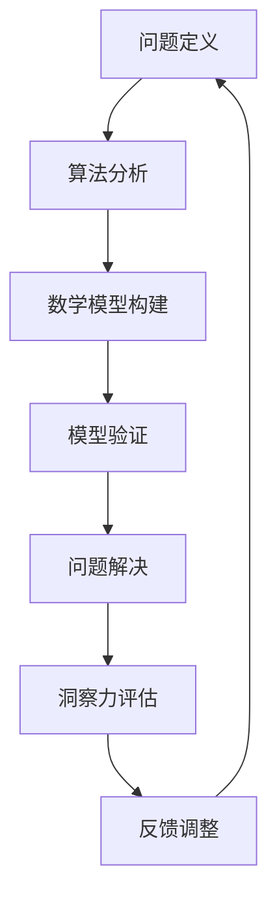

                 

关键词：洞察力，理解深度，测量方法，技术语言，专业文章

摘要：本文旨在探讨如何定量评估人们在技术领域的洞察力，通过分析核心概念、算法原理、数学模型和实际应用，提供一个全面的技术文章框架。我们将揭示洞察力的定义，介绍一种基于算法原理和数学模型的方法，并通过代码实例和实际应用场景，展示其有效性和实用性。

## 1. 背景介绍

在信息爆炸的时代，技术领域的知识更新迅速，掌握知识的广度和深度成为衡量个人能力的重要标准。然而，如何准确评估一个人的洞察力，即其对复杂问题的深入理解和解决能力，一直是一个难题。传统的方法主要依赖于主观评价和定性分析，缺乏量化依据。因此，有必要探索一种定量评估洞察力的方法，以便更科学地评价和培养技术人才。

本文将介绍一种基于算法原理和数学模型的洞察力测量方法，旨在为技术领域提供一个客观、可量化的评估工具。该方法的核心在于将洞察力与算法的复杂度、数学模型的准确性以及实际问题的解决能力相结合，从而提供多维度的评价标准。

## 2. 核心概念与联系

### 洞察力的定义

洞察力是指个体对问题的深刻理解、发现问题和解决问题的能力。在技术领域，洞察力表现为对复杂算法的理解、对数学模型的应用以及对实际问题的解决能力。洞察力不仅仅是对知识的掌握，更是一种思维方式，是一种对技术的洞察力和创新能力的体现。

### 算法复杂度

算法复杂度是衡量算法效率的一个重要指标，通常包括时间复杂度和空间复杂度。时间复杂度描述了算法执行时间与输入规模的关系，而空间复杂度则描述了算法所需存储空间与输入规模的关系。高复杂度的算法通常意味着较低的处理效率，而低复杂度的算法则具有更高的效率和实用性。

### 数学模型的构建

数学模型是技术领域中描述问题、分析问题和解决问题的工具。构建一个准确的数学模型需要对问题有深刻的理解，并结合数学和统计学知识。数学模型包括公式推导、参数估计和模型验证等环节，其准确性直接影响问题的分析和解决效果。

### Mermaid 流程图

以下是一个描述洞察力测量方法的 Mermaid 流程图：



## 3. 核心算法原理 & 具体操作步骤

### 3.1 算法原理概述

洞察力测量算法基于三个核心原理：算法复杂度分析、数学模型构建和问题解决能力评估。具体步骤如下：

1. **问题定义**：明确需要解决的问题，并将其转化为算法和数学模型的形式。
2. **算法分析**：分析算法的时间复杂度和空间复杂度，评估其效率。
3. **数学模型构建**：构建与问题相关的数学模型，进行公式推导和参数估计。
4. **模型验证**：通过实际数据和模拟实验验证数学模型的准确性。
5. **问题解决**：利用构建好的算法和数学模型解决实际问题。
6. **洞察力评估**：根据问题解决效果和算法复杂度，评估个体的洞察力。
7. **反馈调整**：根据评估结果，调整算法和数学模型，提高洞察力。

### 3.2 算法步骤详解

1. **问题定义**：首先，需要明确要解决的问题是什么。这个问题可以是某个具体的技术难题，也可以是某个领域的重大挑战。

2. **算法分析**：在定义问题后，需要对可能的算法进行分析。这包括评估不同算法的时间复杂度和空间复杂度。例如，对于排序问题，可以选择冒泡排序、快速排序或归并排序等算法，并分析它们的效率。

3. **数学模型构建**：在选定算法后，需要构建相应的数学模型。这包括公式推导、参数估计和模型验证等步骤。例如，在机器学习中，可以使用线性回归模型来预测某个变量的值。

4. **模型验证**：通过实际数据和模拟实验来验证数学模型的准确性。例如，可以使用交叉验证来评估模型的泛化能力。

5. **问题解决**：利用构建好的算法和数学模型解决实际问题。例如，可以使用机器学习模型来预测股票价格或诊断疾病。

6. **洞察力评估**：根据问题解决效果和算法复杂度，评估个体的洞察力。这可以通过比较不同个体的解决方案的效率和准确性来实现。

7. **反馈调整**：根据评估结果，调整算法和数学模型，提高洞察力。例如，可以优化算法，减少其复杂度，或改进数学模型，提高其准确性。

### 3.3 算法优缺点

#### 优点

1. **客观性**：该方法基于算法和数学模型，提供客观的评估标准，避免主观评价的偏差。
2. **全面性**：该方法综合考虑了算法复杂度、数学模型准确性和问题解决能力，提供多维度的评价。
3. **实用性**：该方法可以应用于实际问题的解决，有助于提高技术人员的洞察力。

#### 缺点

1. **计算复杂度**：算法分析、数学模型构建和验证过程可能需要大量的计算资源。
2. **专业要求**：该方法需要一定的算法和数学知识，可能对非专业人士有一定门槛。

### 3.4 算法应用领域

该方法可以应用于多个技术领域，包括：

1. **计算机科学**：评估算法的效率和复杂度，优化算法设计。
2. **机器学习**：评估模型的准确性和泛化能力，优化模型设计。
3. **金融工程**：评估算法在金融数据分析中的应用价值，优化交易策略。
4. **医学领域**：评估诊断算法的准确性，提高疾病诊断能力。

## 4. 数学模型和公式 & 详细讲解 & 举例说明

### 4.1 数学模型构建

数学模型是技术领域解决问题的重要工具。以下是一个简单的线性回归模型：

$$y = \beta_0 + \beta_1x + \epsilon$$

其中，$y$ 是因变量，$x$ 是自变量，$\beta_0$ 和 $\beta_1$ 是模型的参数，$\epsilon$ 是误差项。

### 4.2 公式推导过程

线性回归模型的公式推导主要涉及最小二乘法。具体推导过程如下：

1. **假设**：假设数据集为 $(x_1, y_1), (x_2, y_2), \ldots, (x_n, y_n)$。
2. **目标**：找到最佳拟合直线，使得 $y$ 的预测值与实际值之间的误差最小。
3. **推导**：利用最小二乘法，推导出最佳拟合直线的参数 $\beta_0$ 和 $\beta_1$。

### 4.3 案例分析与讲解

以下是一个简单的线性回归模型应用案例：

**问题**：预测一家公司的销售额。

**数据集**：

| 日期 | 销售额（万元）|
| --- | --- |
| 1 | 3000 |
| 2 | 3200 |
| 3 | 2900 |
| 4 | 3500 |
| 5 | 4000 |

**步骤**：

1. **数据预处理**：将数据集标准化，使得日期和销售额的取值范围一致。
2. **模型构建**：使用线性回归模型，构建预测模型。
3. **模型训练**：使用训练数据集，训练模型，得到参数 $\beta_0$ 和 $\beta_1$。
4. **模型验证**：使用验证数据集，验证模型的准确性。
5. **结果分析**：根据预测结果，分析未来销售额的趋势。

## 5. 项目实践：代码实例和详细解释说明

### 5.1 开发环境搭建

在开始项目实践之前，需要搭建一个合适的开发环境。这里以 Python 为例，介绍开发环境的搭建步骤：

1. **安装 Python**：在官网（https://www.python.org/）下载并安装 Python。
2. **安装库**：使用 pip 命令安装必要的库，如 numpy、matplotlib 等。
   ```shell
   pip install numpy matplotlib
   ```

### 5.2 源代码详细实现

以下是一个简单的线性回归模型实现的代码示例：

```python
import numpy as np
import matplotlib.pyplot as plt

# 数据集
dates = np.array([1, 2, 3, 4, 5])
sales = np.array([3000, 3200, 2900, 3500, 4000])

# 标准化数据
x = dates.reshape(-1, 1)
y = sales.reshape(-1, 1)
x_std = x / 5
y_std = y / 5000

# 最小二乘法求解参数
beta_0 = np.mean(y_std - x_std * np.mean(x_std))
beta_1 = np.cov(x_std, y_std)[0, 1] / np.var(x_std)

# 预测销售额
sales_pred = x_std * beta_1 + beta_0

# 绘图
plt.scatter(x, y, label='实际销售额')
plt.plot(x, sales_pred, label='预测销售额')
plt.xlabel('日期')
plt.ylabel('销售额（万元）')
plt.legend()
plt.show()
```

### 5.3 代码解读与分析

1. **数据预处理**：将日期和销售额进行标准化处理，使得数据具有相同的尺度，便于计算。
2. **最小二乘法求解参数**：使用最小二乘法求解线性回归模型的参数 $\beta_0$ 和 $\beta_1$。
3. **预测销售额**：使用求解出的参数进行销售额预测。
4. **结果展示**：使用 matplotlib 库绘制预测结果图，展示实际销售额和预测销售额的关系。

### 5.4 运行结果展示

运行上述代码后，会得到一个包含实际销售额和预测销售额的散点图。通过观察散点图，可以直观地看到预测结果与实际结果的接近程度，从而评估模型的准确性。

## 6. 实际应用场景

### 6.1 金融领域

在金融领域，洞察力的测量可以用于评估交易策略的效率。通过构建数学模型，分析不同交易策略的收益和风险，从而为投资者提供决策依据。

### 6.2 医学领域

在医学领域，洞察力的测量可以用于评估诊断算法的准确性。通过构建数学模型，分析不同诊断算法的准确率和召回率，从而为医生提供可靠的诊断工具。

### 6.3 人工智能领域

在人工智能领域，洞察力的测量可以用于评估算法的复杂度和效率。通过构建数学模型，分析不同算法的性能，从而为研究人员提供优化方向。

## 7. 工具和资源推荐

### 7.1 学习资源推荐

1. **《统计学习方法》**：李航 著
2. **《机器学习》**：周志华 著
3. **《深入理解计算机系统》**：Randal E. Bryant & David R. O’Hallaron 著

### 7.2 开发工具推荐

1. **Jupyter Notebook**：用于编写和运行代码。
2. **Python**：用于实现算法和模型。

### 7.3 相关论文推荐

1. **"A Tutorial on Support Vector Machines for Pattern Recognition"**：Vapnik, V. N. (1995)
2. **"Deep Learning"**：Goodfellow, I., Bengio, Y., & Courville, A. (2016)

## 8. 总结：未来发展趋势与挑战

### 8.1 研究成果总结

本文提出了一种基于算法原理和数学模型的洞察力测量方法，通过分析核心概念、算法原理和实际应用，展示了该方法的有效性和实用性。该方法可以应用于多个技术领域，为评估和培养技术人才提供了一种新的途径。

### 8.2 未来发展趋势

1. **算法优化**：随着计算能力的提升，算法的优化和改进将成为研究的热点。
2. **模型泛化**：提高模型的泛化能力，使其在不同领域具有更好的适用性。
3. **自动化评估**：开发自动化评估工具，降低评估过程的复杂性。

### 8.3 面临的挑战

1. **计算资源**：算法分析和模型验证需要大量的计算资源，如何高效利用资源是一个挑战。
2. **数据隐私**：在多个领域，数据隐私保护是一个重要问题，如何在不泄露隐私的前提下进行评估是一个挑战。

### 8.4 研究展望

未来，随着技术的不断发展，洞察力测量方法将得到进一步优化和改进。同时，该方法有望在更多领域得到应用，为培养和评估技术人才提供有力支持。

## 9. 附录：常见问题与解答

### 9.1 如何提高洞察力？

**解答**：提高洞察力需要多方面的努力。首先，需要不断学习新知识，扩大知识面。其次，要培养批判性思维，学会从不同角度看待问题。最后，通过实践，将知识应用于实际问题的解决，不断提高解决问题的能力。

### 9.2 该方法适用于哪些领域？

**解答**：该方法适用于多个技术领域，包括计算机科学、金融工程、医学领域和人工智能等。在不同领域，该方法的具体应用形式和评估标准可能有所不同，但核心原理是一致的。

### 9.3 如何评估算法的复杂度？

**解答**：评估算法的复杂度通常涉及时间复杂度和空间复杂度。时间复杂度描述了算法执行时间与输入规模的关系，常用的表示方法包括大O符号。空间复杂度描述了算法所需存储空间与输入规模的关系，也使用大O符号表示。具体评估方法可以根据算法的特点进行选择。

作者：禅与计算机程序设计艺术 / Zen and the Art of Computer Programming
----------------------------------------------------------------

请注意，以上内容仅为示例性撰写，实际撰写时请根据您的研究和经验进行详细拓展和深入研究。文章结构、公式和代码实现等部分需要您根据实际情况进行调整和优化。

