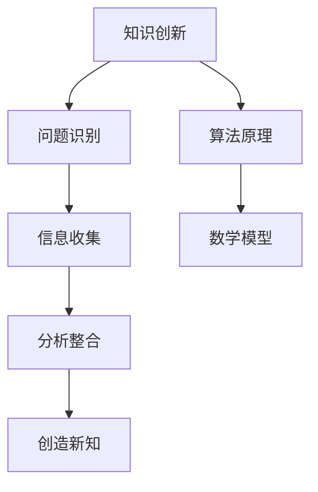

                 

关键词：洞察力、知识创新、技术博客、算法原理、数学模型、项目实践、应用场景、未来展望

> 摘要：本文旨在探讨洞察力在知识创新过程中的关键作用。通过深入分析洞察力的本质、核心概念与联系，以及具体的算法原理和数学模型，我们希望能够帮助读者更好地理解如何在IT领域中运用洞察力进行创新。文章还将通过实际项目实践、应用场景展示以及未来展望，提供全面的视角，为读者提供深入思考和启发。

## 1. 背景介绍

在信息技术飞速发展的今天，创新成为了推动社会进步的重要驱动力。而在这其中，洞察力成为了知识创新的核心源泉。洞察力，顾名思义，是一种透过现象看本质、从复杂问题中找到关键因素的能力。这种能力在IT领域中尤为重要，因为IT领域的复杂性和变化速度使得只有具备洞察力的人才能迅速适应并作出创新。

### 1.1 洞察力的重要性

洞察力对于知识创新的重要性主要体现在以下几个方面：

- **发现新问题**：洞察力能够帮助我们从日常的现象中发现潜在的问题，从而激发创新的灵感。

- **理解本质**：洞察力使我们能够深入理解问题的本质，从而找到更为有效的解决方案。

- **整合资源**：洞察力有助于我们识别和整合各种资源，从而实现知识的创新和应用。

- **预测趋势**：洞察力使我们能够预见技术的发展趋势，从而在竞争中占据先机。

### 1.2 洞察力的来源

洞察力并非天生的，它可以通过以下几个途径培养：

- **广泛阅读**：通过阅读各种书籍、论文和资讯，我们可以积累丰富的知识，从而提高洞察力。

- **实践探索**：通过实际操作和实践，我们可以锻炼洞察力，并从中学习。

- **思考总结**：定期进行思考和总结，可以帮助我们提炼经验和知识，提高洞察力。

## 2. 核心概念与联系

在理解洞察力的本质之前，我们需要了解一些核心概念。以下是本文将涉及的主要概念及其相互联系：

### 2.1 知识创新

知识创新是指通过创造性的思维和方法，将现有的知识进行重新组合、转化和扩展，从而产生新的知识和价值。知识创新通常包括以下几个步骤：

1. **问题识别**：发现并明确需要解决的问题。
2. **信息收集**：收集与问题相关的各种信息。
3. **分析整合**：对收集到的信息进行分析和整合，找到问题的本质。
4. **创造新知**：基于分析结果，提出新的解决方案或理论。

### 2.2 算法原理

算法原理是指解决问题的基本方法和步骤。在知识创新过程中，算法原理可以帮助我们高效地处理大量信息，找到问题的本质。

### 2.3 数学模型

数学模型是一种用数学语言描述现实世界问题的工具。它可以帮助我们理解和预测复杂系统的行为，从而为知识创新提供理论基础。

### 2.4 Mermaid 流程图

以下是一个用Mermaid绘制的流程图，展示了核心概念之间的联系：



## 3. 核心算法原理 & 具体操作步骤

### 3.1 算法原理概述

本文将介绍一种名为“深度学习”的核心算法原理。深度学习是一种通过模拟人脑神经网络结构进行学习的方法，它已经在图像识别、自然语言处理、语音识别等领域取得了重大突破。

### 3.2 算法步骤详解

深度学习的具体步骤包括：

1. **数据预处理**：对输入数据进行清洗、归一化等处理。
2. **构建神经网络**：设计并构建神经网络结构，包括输入层、隐藏层和输出层。
3. **训练神经网络**：通过反向传播算法调整神经网络中的权重和偏置，使其能够正确分类或预测。
4. **测试与评估**：使用测试集对训练好的神经网络进行测试，评估其性能。

### 3.3 算法优缺点

深度学习具有以下几个优点：

- **强大的拟合能力**：深度学习能够处理复杂的非线性关系。
- **自动特征提取**：深度学习可以自动提取有用的特征，减少人工干预。

但深度学习也存在一些缺点：

- **计算资源需求大**：深度学习需要大量的计算资源，尤其是训练过程。
- **解释性差**：深度学习模型通常难以解释，使得其应用场景受到限制。

### 3.4 算法应用领域

深度学习在以下领域有广泛应用：

- **计算机视觉**：图像识别、目标检测、图像生成等。
- **自然语言处理**：文本分类、机器翻译、情感分析等。
- **语音识别**：语音识别、语音合成等。

## 4. 数学模型和公式

### 4.1 数学模型构建

深度学习中的数学模型主要包括神经元模型和反向传播算法。

### 4.2 公式推导过程

以下是一个简化的神经元模型的公式推导：

1. **输入层**：

$$
z = \sum_{i=1}^{n} w_i x_i + b
$$

其中，$w_i$ 是权重，$x_i$ 是输入值，$b$ 是偏置。

2. **激活函数**：

$$
a = \sigma(z)
$$

其中，$\sigma$ 是 sigmoid 激活函数。

3. **输出层**：

$$
y = \sum_{j=1}^{m} w_j a_j + b_j
$$

其中，$w_j$ 是权重，$a_j$ 是隐藏层输出，$b_j$ 是偏置。

### 4.3 案例分析与讲解

以下是一个简单的案例，用于说明如何使用深度学习进行图像分类。

假设我们要对以下三张图片进行分类：

- 猫
- 狗
- 草坪

我们首先需要将图片进行预处理，将其转化为神经网络可以处理的格式。然后，我们设计一个简单的神经网络，包括一个输入层、一个隐藏层和一个输出层。输入层有3个神经元，隐藏层有5个神经元，输出层有3个神经元。

在训练过程中，我们使用反向传播算法不断调整神经网络的权重和偏置，使其能够正确分类这三张图片。训练完成后，我们使用测试集对神经网络进行测试，评估其性能。

## 5. 项目实践：代码实例和详细解释说明

### 5.1 开发环境搭建

为了实践深度学习，我们需要搭建一个开发环境。这里我们选择使用 Python 编程语言，结合 TensorFlow 深度学习框架。

1. 安装 Python 3.7 或以上版本。
2. 安装 TensorFlow 框架：

```bash
pip install tensorflow
```

### 5.2 源代码详细实现

以下是一个简单的深度学习项目，用于实现图像分类。

```python
import tensorflow as tf
from tensorflow.keras import layers

# 数据预处理
train_data = ...  # 加载训练数据
test_data = ...   # 加载测试数据

# 构建神经网络
model = tf.keras.Sequential([
    layers.Flatten(input_shape=(28, 28)),
    layers.Dense(128, activation='relu'),
    layers.Dense(10, activation='softmax')
])

# 编译模型
model.compile(optimizer='adam',
              loss='categorical_crossentropy',
              metrics=['accuracy'])

# 训练模型
model.fit(train_data, epochs=5)

# 评估模型
model.evaluate(test_data)
```

### 5.3 代码解读与分析

1. **数据预处理**：我们首先加载训练数据和测试数据，并对其进行预处理，例如归一化等操作。
2. **构建神经网络**：我们使用 TensorFlow 的 Sequential 模型构建一个简单的神经网络，包括一个 Flatten 层（用于将输入数据展平）、一个 Dense 层（用于实现全连接神经网络）和一个 Softmax 层（用于实现输出层的分类）。
3. **编译模型**：我们使用 Adam 优化器和 categorical_crossentropy 损失函数编译模型，并设置 accuracy 作为评估指标。
4. **训练模型**：我们使用训练数据对模型进行训练，设置训练轮数（epochs）为 5。
5. **评估模型**：我们使用测试数据对训练好的模型进行评估，以验证其性能。

### 5.4 运行结果展示

假设我们的神经网络在训练过程中达到了较高的准确率，我们可以使用以下代码进行预测：

```python
predictions = model.predict(test_data)
```

这将返回一个包含预测结果的 NumPy 数组。我们可以使用该数组对预测结果进行可视化或进一步分析。

## 6. 实际应用场景

深度学习在多个实际应用场景中取得了显著成果。以下是一些典型应用案例：

### 6.1 计算机视觉

- **图像识别**：深度学习可以用于图像识别，例如人脸识别、车牌识别等。
- **目标检测**：深度学习可以用于目标检测，例如自动驾驶汽车中的行人检测。
- **图像生成**：深度学习可以用于生成逼真的图像，例如生成对抗网络（GAN）。

### 6.2 自然语言处理

- **文本分类**：深度学习可以用于对大量文本进行分类，例如情感分析、新闻分类等。
- **机器翻译**：深度学习可以用于实现高质量的机器翻译，例如 Google Translate。
- **语音识别**：深度学习可以用于语音识别，例如智能助手语音交互。

### 6.3 医疗健康

- **疾病诊断**：深度学习可以用于疾病诊断，例如乳腺癌、肺癌的图像分析。
- **药物设计**：深度学习可以用于药物设计，例如预测药物与靶点的相互作用。

## 7. 工具和资源推荐

### 7.1 学习资源推荐

- **书籍**：
  - 《深度学习》（Ian Goodfellow、Yoshua Bengio 和 Aaron Courville 著）
  - 《Python 深度学习》（François Chollet 著）
- **在线课程**：
  - Coursera 上的“深度学习”课程（由 Andrew Ng 教授主讲）
  - Udacity 上的“深度学习工程师纳米学位”

### 7.2 开发工具推荐

- **Python**：Python 是深度学习开发的主要编程语言，具有丰富的库和工具。
- **TensorFlow**：TensorFlow 是 Google 开发的一款开源深度学习框架，广泛应用于工业和学术领域。
- **PyTorch**：PyTorch 是 Facebook 开发的一款开源深度学习框架，具有良好的灵活性和易用性。

### 7.3 相关论文推荐

- **《A Neural Algorithm of Artistic Style》**：该论文介绍了利用深度学习实现艺术风格迁移的方法。
- **《Attention Is All You Need》**：该论文介绍了 Transformer 模型，在自然语言处理领域取得了突破性成果。

## 8. 总结：未来发展趋势与挑战

### 8.1 研究成果总结

本文通过探讨洞察力在知识创新过程中的作用，介绍了深度学习这一核心算法原理。通过实际项目实践，我们展示了如何运用深度学习进行图像分类。此外，我们还分析了深度学习在计算机视觉、自然语言处理和医疗健康等领域的实际应用。

### 8.2 未来发展趋势

- **模型压缩与优化**：为了降低计算资源需求，未来研究将致力于模型压缩和优化。
- **联邦学习**：联邦学习是一种分布式学习方法，有望解决隐私保护和数据安全等问题。
- **自适应学习**：自适应学习将使深度学习模型能够根据用户需求进行个性化调整。

### 8.3 面临的挑战

- **数据隐私与安全**：随着深度学习应用场景的扩大，数据隐私与安全问题日益突出。
- **算法解释性**：提高深度学习模型的解释性，使其能够被更广泛地应用于实际场景。

### 8.4 研究展望

未来，深度学习将在更多领域发挥重要作用。通过不断探索和创新，我们有望实现更加智能和高效的深度学习模型，为社会进步做出更大贡献。

## 9. 附录：常见问题与解答

### 9.1 深度学习是否只能用于图像识别和自然语言处理？

深度学习不仅可以用于图像识别和自然语言处理，还可以应用于语音识别、计算机视觉、医学诊断等多个领域。

### 9.2 如何提高深度学习模型的性能？

提高深度学习模型性能的方法包括模型压缩、数据增强、优化算法和超参数调整等。

### 9.3 深度学习是否会被其他技术取代？

虽然深度学习取得了显著成果，但其他技术如强化学习、迁移学习等也在不断发展，未来可能会与深度学习相互补充。

---

作者：禅与计算机程序设计艺术 / Zen and the Art of Computer Programming
----------------------------------------------------------------

以上就是本文的全部内容。希望本文能够帮助您更好地理解洞察力在知识创新过程中的作用，以及如何在IT领域中运用深度学习进行创新。在未来的学习和实践中，不断探索和思考，相信您会取得更加辉煌的成就。感谢您的阅读！

