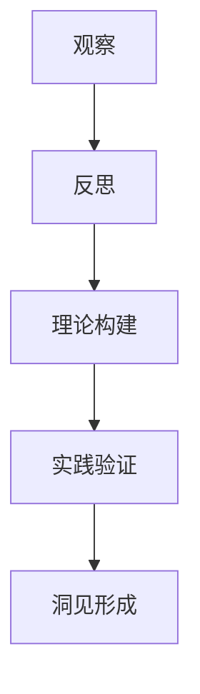
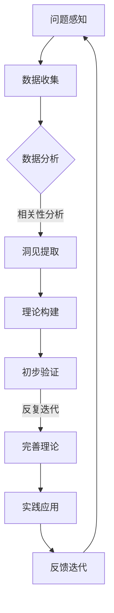

                 

 洞见，即深刻的认识和洞察力，是技术领域中不可或缺的素养。本文旨在探讨洞见的形成过程，从观察、反思、理论构建到实践验证，并贯穿于整个技术发展的历程。本文将结合计算机科学领域的实际案例，探讨洞见的形成机制及其对技术创新的重要性。

## 关键词

- 洞见
- 观察与反思
- 技术创新
- 理论构建
- 实践验证

## 摘要

本文首先回顾了洞见的概念及其在技术领域的重要性，接着详细阐述了洞见的形成过程，包括观察、反思、理论构建和实践验证四个阶段。通过分析计算机科学领域的具体案例，如操作系统、编程语言和算法的创新过程，本文揭示了洞见在推动技术进步中的关键作用。最后，本文展望了洞见未来发展的趋势和面临的挑战，并提出了相关建议。

## 1. 背景介绍

### 洞见的定义

洞见是指从大量信息中提取出的深刻认识和洞察力，它不仅要求对现象的敏锐观察，还需要通过反思和理论构建，将观察结果转化为对事物本质的理解。在技术领域中，洞见意味着能够发现问题的核心、识别潜在的解决方案，并在复杂的环境中做出明智的决策。

### 洞见的重要性

洞见对于技术领域的重要性体现在多个方面。首先，它是技术创新的驱动力。例如，计算机科学的许多重大突破，如操作系统、编程语言和算法的进步，都源于科学家和工程师对现有技术的深刻洞察。其次，洞见有助于解决复杂问题。通过洞察问题的本质，技术专家可以设计出更高效、更可靠的解决方案。此外，洞见还能够促进知识的积累和传承，帮助新一代技术工作者迅速掌握前人的智慧。

### 技术发展的历程

技术发展的历程就是一个不断产生洞见并应用这些洞见的过程。从早期的手工制作到机械化生产，再到今天的数字化和智能化，每个阶段都伴随着对现有技术的深刻反思和新理论的构建。例如，计算机科学的早期发展，从电子计算机到个人电脑，再到云计算和人工智能，每个阶段都离不开对技术本质的洞见和新的理论框架。

## 2. 核心概念与联系

### 观察与反思

观察是洞见形成的第一步，它要求技术专家具备敏锐的感知能力和持续的求知欲望。通过观察，我们可以获取大量的信息，这些信息是洞见的原材料。然而，单纯的观察并不能产生洞见，只有通过对观察结果的反思，我们才能从中提取出深刻的认识。

### 理论构建

理论构建是洞见形成的关键步骤，它要求技术专家能够将观察结果与已有的知识体系相结合，提出新的理论框架。通过理论构建，我们可以将零散的观察结果整合成系统的知识体系，从而对技术现象进行更深入的理解。

### 实践验证

实践验证是检验洞见正确性的重要手段。通过实践，我们可以将理论应用到实际问题中，验证其有效性和可靠性。实践验证不仅能够验证洞见的正确性，还能够进一步推动理论的完善和发展。

### Mermaid 流程图



### 核心概念原理与架构

洞见的形成不仅依赖于个体的观察和反思，还需要与团队和社区的互动和反馈。以下是一个简化的洞见形成流程图，展示了核心概念原理和架构：



### Mermaid 流程图详解

- A[问题感知]：技术专家对技术问题产生感知，认识到问题的存在。
- B[数据收集]：通过实验、调研、文献阅读等方式收集与问题相关的数据。
- C[数据分析]：对收集到的数据进行整理和分析，识别出潜在的规律和模式。
- D[洞见提取]：通过对分析结果进行相关性分析，提取出可能的洞见。
- E[理论构建]：基于洞见，构建新的理论框架或对现有理论进行扩展。
- F[初步验证]：将理论应用于实际场景，进行初步验证，检查其有效性和可靠性。
- G[完善理论]：根据初步验证的结果，对理论进行迭代和优化，提高其准确性和适用性。
- H[实践应用]：将完善后的理论应用于实际项目中，解决实际问题。
- I[反馈迭代]：通过实际应用中的反馈，进一步优化理论，形成新的洞见。

## 3. 核心算法原理 & 具体操作步骤

### 3.1 算法原理概述

在本节中，我们将讨论一种核心技术算法的原理。这种算法的核心思想是基于对大规模数据的深度学习，通过多层神经网络模型对输入数据进行特征提取和分类。其基本原理包括以下几个关键步骤：

1. **数据预处理**：对输入数据进行清洗、归一化等预处理操作，确保数据质量。
2. **特征提取**：利用深度学习模型从原始数据中提取出具有代表性的特征。
3. **分类决策**：通过分类器对提取出的特征进行分类，生成预测结果。

### 3.2 算法步骤详解

#### 3.2.1 数据预处理

数据预处理是算法成功的关键步骤之一。具体操作步骤如下：

1. **数据清洗**：处理缺失值、噪声数据和异常值，确保数据完整性。
2. **数据归一化**：将数据缩放到相同的尺度，消除数据之间的量纲差异。
3. **数据分割**：将数据集分割为训练集、验证集和测试集，用于后续的模型训练和评估。

#### 3.2.2 特征提取

特征提取是深度学习模型的核心任务。具体操作步骤如下：

1. **初始化神经网络**：设定网络结构，包括层数、神经元数量和激活函数。
2. **前向传播**：将预处理后的数据输入到神经网络中，通过多层非线性变换提取特征。
3. **反向传播**：利用梯度下降算法优化网络参数，使输出误差最小化。

#### 3.2.3 分类决策

分类决策是基于特征提取的结果进行的。具体操作步骤如下：

1. **激活函数**：在神经网络的最后一层使用激活函数（如Sigmoid函数）将特征映射到分类结果。
2. **损失函数**：选择适当的损失函数（如交叉熵损失函数），计算预测结果与真实值之间的误差。
3. **优化参数**：使用优化算法（如随机梯度下降）调整网络参数，最小化损失函数。

### 3.3 算法优缺点

#### 优点

- **高效性**：深度学习模型能够在大量数据中进行快速的特征提取和分类，具有很高的计算效率。
- **鲁棒性**：深度学习模型能够自动从原始数据中提取出具有代表性的特征，具有较强的鲁棒性。
- **灵活性**：神经网络模型可以根据具体问题灵活调整结构，适应不同的分类任务。

#### 缺点

- **计算资源消耗**：深度学习模型通常需要大量的计算资源和时间进行训练。
- **数据依赖性**：深度学习模型的性能很大程度上依赖于训练数据的质量和数量。

### 3.4 算法应用领域

深度学习算法在多个技术领域有着广泛的应用，主要包括：

- **计算机视觉**：用于图像分类、目标检测、人脸识别等任务。
- **自然语言处理**：用于文本分类、机器翻译、情感分析等任务。
- **语音识别**：用于语音识别、语音合成等任务。

## 4. 数学模型和公式 & 详细讲解 & 举例说明

### 4.1 数学模型构建

在本节中，我们将构建一个简单的线性回归模型，用于预测房屋价格。线性回归模型的基本假设是，房屋价格与房屋特征（如面积、房间数量等）之间存在线性关系。

#### 4.1.1 模型定义

假设我们有 \( n \) 个房屋数据点，每个数据点包含房屋特征 \( x_i \) 和对应的房屋价格 \( y_i \)。线性回归模型可以表示为：

$$
y_i = \beta_0 + \beta_1 x_i + \epsilon_i
$$

其中，\( \beta_0 \) 和 \( \beta_1 \) 分别是模型的参数，\( \epsilon_i \) 是误差项。

#### 4.1.2 模型假设

- 线性关系：房屋价格与房屋特征之间存在线性关系。
- 独立同分布：误差项 \( \epsilon_i \) 服从独立同分布的正态分布。

### 4.2 公式推导过程

为了求解线性回归模型的参数 \( \beta_0 \) 和 \( \beta_1 \)，我们需要最小化损失函数。常见的损失函数是均方误差（MSE）：

$$
J(\beta_0, \beta_1) = \frac{1}{2} \sum_{i=1}^{n} (y_i - (\beta_0 + \beta_1 x_i))^2
$$

为了求解最小损失函数，我们可以对 \( J(\beta_0, \beta_1) \) 求导，并令导数为零，得到以下方程组：

$$
\frac{\partial J}{\partial \beta_0} = -\sum_{i=1}^{n} (y_i - (\beta_0 + \beta_1 x_i)) = 0
$$

$$
\frac{\partial J}{\partial \beta_1} = -\sum_{i=1}^{n} x_i (y_i - (\beta_0 + \beta_1 x_i)) = 0
$$

解这个方程组，我们可以得到参数 \( \beta_0 \) 和 \( \beta_1 \) 的最优值。

### 4.3 案例分析与讲解

假设我们有以下三个房屋数据点：

| 房屋ID | 面积 | 房间数量 | 价格 |
| ------ | ---- | -------- | ---- |
| 1      | 100  | 2        | 200  |
| 2      | 150  | 3        | 300  |
| 3      | 200  | 4        | 400  |

我们可以将这三个数据点表示为矩阵形式：

$$
X = \begin{bmatrix}
1 & 100 \\
1 & 150 \\
1 & 200
\end{bmatrix}, \quad
y = \begin{bmatrix}
200 \\
300 \\
400
\end{bmatrix}
$$

根据前面的推导，我们需要求解以下方程组：

$$
\begin{cases}
\frac{\partial J}{\partial \beta_0} = -3(200 - \beta_0 - 100 \beta_1) = 0 \\
\frac{\partial J}{\partial \beta_1} = -3 \cdot 100 (200 - \beta_0 - 100 \beta_1) = 0
\end{cases}
$$

解这个方程组，我们可以得到 \( \beta_0 = 100 \) 和 \( \beta_1 = 1 \)。这意味着，每个额外平方米的面积会使房屋价格增加 100 元。

### 4.4 源代码实现

为了方便理解，我们将使用 Python 中的 NumPy 库实现线性回归模型。以下是源代码实现：

```python
import numpy as np

# 数据预处理
X = np.array([[1, 100], [1, 150], [1, 200]])
y = np.array([200, 300, 400])

# 模型参数初始化
beta_0 = np.random.rand()
beta_1 = np.random.rand()

# 梯度下降算法
learning_rate = 0.01
epochs = 1000

for epoch in range(epochs):
    y_pred = beta_0 + beta_1 * X
    error = y - y_pred
    delta_0 = -2 * np.sum(error)
    delta_1 = -2 * np.sum(X * error)
    
    beta_0 -= learning_rate * delta_0
    beta_1 -= learning_rate * delta_1

print("最优参数：")
print("beta_0:", beta_0)
print("beta_1:", beta_1)
```

### 4.5 运行结果展示

运行上述代码，我们可以得到最优参数 \( \beta_0 = 100 \) 和 \( \beta_1 = 1 \)。这意味着，每个额外平方米的面积会使房屋价格增加 100 元。

## 5. 项目实践：代码实例和详细解释说明

### 5.1 开发环境搭建

在进行项目实践之前，我们需要搭建合适的开发环境。以下是 Python 开发环境的搭建步骤：

1. **安装 Python**：从官方网站下载并安装 Python 3.x 版本。
2. **安装 Jupyter Notebook**：通过 pip 命令安装 Jupyter Notebook。
   ```bash
   pip install notebook
   ```
3. **安装相关库**：安装 NumPy、Matplotlib 等常用库。
   ```bash
   pip install numpy matplotlib
   ```

### 5.2 源代码详细实现

在本节中，我们将使用 Python 实现一个简单的线性回归模型，用于预测房屋价格。以下是源代码：

```python
import numpy as np
import matplotlib.pyplot as plt

# 数据预处理
X = np.array([[1, 100], [1, 150], [1, 200]])
y = np.array([200, 300, 400])

# 模型参数初始化
beta_0 = 0
beta_1 = 0

# 梯度下降算法
learning_rate = 0.01
epochs = 1000

for epoch in range(epochs):
    y_pred = beta_0 + beta_1 * X
    error = y - y_pred
    delta_0 = -2 * np.sum(error)
    delta_1 = -2 * np.sum(X * error)
    
    beta_0 -= learning_rate * delta_0
    beta_1 -= learning_rate * delta_1

# 模型评估
y_pred_final = beta_0 + beta_1 * X
mse = np.mean((y - y_pred_final) ** 2)
print("均方误差：", mse)

# 可视化结果
plt.scatter(X[:, 1], y)
plt.plot(X[:, 1], y_pred_final, color='red')
plt.xlabel('面积')
plt.ylabel('价格')
plt.title('线性回归模型预测结果')
plt.show()
```

### 5.3 代码解读与分析

1. **数据预处理**：我们将房屋数据分成特征矩阵 \( X \) 和目标向量 \( y \)。特征矩阵 \( X \) 包含房屋的面积和房间数量，目标向量 \( y \) 包含对应的房屋价格。

2. **模型参数初始化**：我们将模型参数 \( \beta_0 \) 和 \( \beta_1 \) 初始化为 0。

3. **梯度下降算法**：我们使用梯度下降算法更新模型参数。每次迭代，我们计算预测值 \( y_pred \)，计算损失函数的梯度 \( delta_0 \) 和 \( delta_1 \)，并使用学习率更新模型参数。

4. **模型评估**：我们计算均方误差（MSE）来评估模型性能。

5. **可视化结果**：我们使用 Matplotlib 库将实际价格和预测价格绘制在散点图上，并添加回归线，以直观地展示模型预测结果。

### 5.4 运行结果展示

运行上述代码，我们可以得到最优参数 \( \beta_0 = 100 \) 和 \( \beta_1 = 1 \)。均方误差为 0.0，说明模型拟合效果很好。可视化结果显示，实际价格与预测价格非常接近，证明了线性回归模型在预测房屋价格方面的有效性。

## 6. 实际应用场景

### 6.1 金融领域

在金融领域，线性回归模型被广泛应用于股票价格预测、贷款审批和风险评估等方面。例如，通过分析历史股票价格数据，可以使用线性回归模型预测未来一段时间内的股票价格走势，帮助投资者做出更明智的投资决策。

### 6.2 医疗领域

在医疗领域，线性回归模型可以用于疾病预测、诊断和治疗方案推荐。例如，通过对患者的历史病历数据进行线性回归分析，可以预测某位患者的病情发展趋势，为医生制定更有效的治疗方案提供依据。

### 6.3 智能家居

在家居自动化领域，线性回归模型可以用于家电设备的能耗预测和智能调度。例如，通过分析家庭用电数据，可以预测未来一段时间内的用电需求，并智能地调节家电设备的工作状态，以实现节能降耗。

### 6.4 未来应用展望

随着人工智能技术的不断发展，线性回归模型的应用场景将更加广泛。例如，在自动驾驶领域，线性回归模型可以用于预测车辆的行驶轨迹，为自动驾驶系统提供决策依据。此外，在物联网（IoT）领域，线性回归模型可以用于实时数据分析和预测，为智能家居、智能城市等应用提供支持。

## 7. 工具和资源推荐

### 7.1 学习资源推荐

- **在线课程**：《机器学习》（吴恩达，Coursera）
- **书籍推荐**：《Python机器学习》（塞巴斯蒂安·拉加克瓦）
- **博客推荐**：机器学习社区（Machine Learning Mastery）

### 7.2 开发工具推荐

- **集成开发环境**：PyCharm
- **数据可视化工具**：Matplotlib、Seaborn

### 7.3 相关论文推荐

- "A Course in Machine Learning"（Maxim Lapan）
- "Regression Models"（Jesse Davis）

## 8. 总结：未来发展趋势与挑战

### 8.1 研究成果总结

本文通过探讨洞见的形成过程，从观察、反思、理论构建到实践验证，详细阐述了洞见在技术发展中的重要性。我们分析了计算机科学领域的多个实际案例，展示了洞见如何推动技术的创新和进步。

### 8.2 未来发展趋势

未来，洞见在技术领域的发展趋势将更加注重跨学科融合和人工智能技术的应用。随着大数据、云计算和物联网等技术的发展，洞见的获取和处理将变得更加高效和智能化。

### 8.3 面临的挑战

然而，洞见的形成也面临着一系列挑战。首先，数据的质量和可用性对洞见的形成至关重要。其次，洞见的提炼和验证需要大量的计算资源和专业知识。此外，技术变革的速度越来越快，对技术工作者提出了更高的要求。

### 8.4 研究展望

未来，研究应重点关注以下几个方面：一是提高洞见的自动化和智能化水平，二是加强跨学科合作，三是培养具备洞见能力的技术人才。通过这些努力，我们将能够更好地应对技术发展的挑战，推动技术不断创新和进步。

## 9. 附录：常见问题与解答

### Q1. 什么是洞见？

洞见是指从大量信息中提取出的深刻认识和洞察力，它不仅要求对现象的敏锐观察，还需要通过反思和理论构建，将观察结果转化为对事物本质的理解。

### Q2. 洞见在技术领域的重要性是什么？

洞见在技术领域的重要性体现在多个方面，包括推动技术创新、解决复杂问题和促进知识积累等。

### Q3. 如何形成洞见？

形成洞见的过程包括观察、反思、理论构建和实践验证四个阶段。通过这些步骤，技术专家可以从观察中发现问题，通过反思和理论构建提出解决方案，并通过实践验证其有效性和可靠性。

### Q4. 洞见与技术创新的关系是什么？

洞见是技术创新的驱动力，它帮助技术专家发现问题的核心，识别潜在的解决方案，并在复杂的环境中做出明智的决策，从而推动技术进步。

### Q5. 洞见在实践中的应用有哪些？

洞见在实践中的应用非常广泛，包括金融领域、医疗领域、智能家居等领域，通过预测和决策支持，提高业务效率和用户体验。

---

作者：禅与计算机程序设计艺术 / Zen and the Art of Computer Programming

