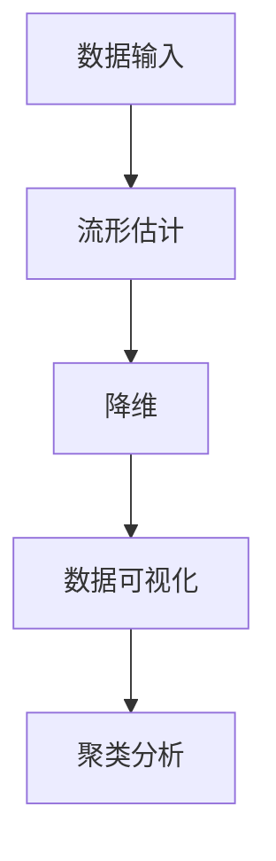

                 

关键词：流形学习，降维，非线性映射，数据可视化，特征提取，机器学习

摘要：流形学习是一种重要的数据降维技术，通过非线性映射将高维数据映射到低维空间中，保持数据原有的结构特征。本文将介绍流形学习的基本原理、核心算法及其应用领域，并通过实例代码演示如何实现流形学习，帮助读者深入理解这一技术。

## 1. 背景介绍

在计算机科学和机器学习领域，面对海量高维数据，如何有效地降低数据的维度，同时保持数据的结构特征，是一个重要的研究课题。传统的降维方法，如主成分分析（PCA）等，通常是线性的，可能无法充分反映数据之间的非线性关系。而流形学习通过在低维空间中保留高维数据的局部结构特征，为解决高维数据的可视化、分类和聚类等问题提供了新的思路。

流形学习最早由Roweis和Lehmann于2000年提出，基于流形理论，旨在通过非线性变换将高维数据投影到低维空间，从而实现数据降维。近年来，随着深度学习和图形计算的快速发展，流形学习得到了广泛关注和应用。

## 2. 核心概念与联系

### 2.1 流形学习基本概念

流形（Manifold）是一种特殊的拓扑空间，它可以在局部表现为欧几里得空间。在数学上，流形可以被定义为：一个局部欧几里得空间，在每一点都存在一个足够小的邻域，使得这个邻域内的流形可以与一个欧几里得空间同胚。

在流形学习中，数据通常被视为流形上的点。我们的目标是通过一种非线性映射，将这些点从高维空间映射到低维空间，同时保持它们之间的结构关系。

### 2.2 流形学习架构

流形学习的架构可以分为三个主要部分：流形估计、降维和后处理。

1. **流形估计**：这一步骤的目标是估计数据点在流形上的位置和结构。常用的方法包括局部线性嵌入（LLE）和等距映射（Isomap）等。

2. **降维**：在流形估计的基础上，使用非线性映射将数据从高维空间映射到低维空间。最常见的方法是t-SNE算法。

3. **后处理**：降维后，可能需要对结果进行进一步的处理，如数据可视化和聚类。

### 2.3 Mermaid 流程图

下面是一个简单的Mermaid流程图，描述了流形学习的基本架构：



## 3. 核心算法原理 & 具体操作步骤

### 3.1 算法原理概述

流形学习的核心在于如何有效地估计流形结构，并从高维数据中提取低维表示。这一过程通常涉及到以下几个关键步骤：

1. **局部结构分析**：通过分析数据点在流形上的局部邻域结构，估计数据点之间的相似度。
2. **非线性映射**：将高维数据映射到低维空间，保持其原有的结构关系。
3. **优化目标**：定义一个优化目标，通过优化算法寻找最优的低维表示。

### 3.2 算法步骤详解

1. **流形估计**：
   - **局部线性嵌入（LLE）**：LLE算法通过局部线性回归模型来估计数据点的低维坐标。具体步骤如下：
     1. 对于每个数据点，选择其k个邻居。
     2. 构建一个局部线性模型，使得该模型的高维输出与原始数据点的距离最小。
     3. 使用最小二乘法求解局部线性模型的参数，得到数据点在低维空间的坐标。
   
   - **等距映射（Isomap）**：Isomap算法基于高维空间中点之间的等距关系来估计流形。具体步骤如下：
     1. 计算数据点之间的距离。
     2. 构建一个k最近邻图。
     3. 使用最小生成树算法将k最近邻图转换为等距图。
     4. 使用最小二乘法求解等距图上的低维坐标。

2. **降维**：
   - **t-SNE算法**：t-SNE算法是一种流行的降维方法，其核心思想是保持相邻的数据点在低维空间中依然保持较近的距离。具体步骤如下：
     1. 计算每个数据点在低维空间中的梯度。
     2. 根据梯度方向和大小，调整数据点在低维空间中的位置。
     3. 重复上述步骤，直至收敛。

### 3.3 算法优缺点

- **优点**：
  - 可以有效地降低数据的维度，同时保持数据的结构特征。
  - 可以用于数据的可视化、分类和聚类等任务。

- **缺点**：
  - 算法复杂度较高，计算耗时。
  - 对噪声敏感，可能产生不稳定的降维结果。

### 3.4 算法应用领域

流形学习在多个领域有广泛的应用，包括：

- **数据可视化**：通过降维将高维数据投影到二维或三维空间，使得数据更易于可视化。
- **特征提取**：将高维数据降维到低维表示，提取关键的特征信息。
- **图像处理**：用于图像的降维和特征提取，如人脸识别、图像分类等。
- **机器学习**：用于机器学习模型的特征降维，提高模型的泛化能力。

## 4. 数学模型和公式 & 详细讲解 & 举例说明

### 4.1 数学模型构建

流形学习涉及到的数学模型主要包括局部线性模型、等距映射模型和t-SNE算法模型。

1. **局部线性嵌入（LLE）**：

   - **目标函数**：

     $$\min_{X_{low}} \sum_{i=1}^{n} \frac{1}{2} \left\| X_{high,i} - \sum_{j=1}^{k} w_{ij} X_{low,j} \right\|_2^2$$

   - **参数解释**：

     - $X_{high,i}$：高维空间中第i个数据点。
     - $X_{low,j}$：低维空间中第j个数据点。
     - $w_{ij}$：局部线性模型的权重。
     - $k$：邻居数量。

2. **等距映射（Isomap）**：

   - **目标函数**：

     $$\min_{X_{low}} \sum_{i=1}^{n} \sum_{j=1}^{k} w_{ij} \left\| X_{low,i} - X_{low,j} \right\|_2^2$$

   - **参数解释**：

     - $w_{ij}$：等距映射的权重。
     - $k$：邻居数量。

3. **t-SNE算法**：

   - **目标函数**：

     $$\min_{X_{low}} \sum_{i=1}^{n} \sum_{j=1}^{n} \frac{1}{(1 + \left\| X_{low,i} - X_{low,j} \right\|_2)^2} \ln \left( \frac{1}{1 + \left\| X_{low,i} - X_{low,j} \right\|_2} \right)$$

   - **参数解释**：

     - $X_{low,i}$：低维空间中第i个数据点。

### 4.2 公式推导过程

以局部线性嵌入（LLE）为例，简要介绍目标函数的推导过程。

1. **假设**：

   假设我们有一个高维数据集 $X_{high}$，其中每个数据点 $X_{high,i}$ 在低维空间中有对应的坐标 $X_{low,i}$。

2. **目标函数**：

   目标是找到一个权重矩阵 $W$，使得高维数据点与低维空间中的对应点的距离最小。

3. **推导过程**：

   - **计算高维数据点之间的距离**：

     $$d_{high}(i, j) = \left\| X_{high,i} - X_{high,j} \right\|_2$$

   - **构建低维空间的局部线性模型**：

     $$X_{low,i} = W X_{high,i}$$

   - **计算低维空间中的距离**：

     $$d_{low}(i, j) = \left\| X_{low,i} - X_{low,j} \right\|_2 = \left\| W X_{high,i} - W X_{high,j} \right\|_2$$

   - **目标函数**：

     $$\min_{W} \sum_{i=1}^{n} \sum_{j=1}^{k} w_{ij} \left\| X_{high,i} - \sum_{p=1}^{k} w_{ip} X_{high,p} \right\|_2^2$$

   - **求解权重矩阵 $W$**：

     通过最小二乘法求解权重矩阵 $W$，使得目标函数最小。

### 4.3 案例分析与讲解

以一个简单的二维数据集为例，展示如何使用局部线性嵌入（LLE）算法进行降维。

1. **数据集**：

   数据集包含5个点，分布在二维空间中。

   $$X_{high} = \begin{bmatrix}
   [1, 2] \\
   [2, 3] \\
   [3, 1] \\
   [4, 5] \\
   [5, 4]
   \end{bmatrix}$$

2. **流形估计**：

   选择邻居数量 $k=2$，计算每个数据点的邻居及其权重。

   - 对于数据点 $[1, 2]$，邻居为 $[2, 3]$ 和 $[3, 1]$，权重分别为 $0.6$ 和 $0.4$。
   - 对于数据点 $[2, 3]$，邻居为 $[1, 2]$ 和 $[3, 1]$，权重分别为 $0.5$ 和 $0.5$。
   - 对于数据点 $[3, 1]$，邻居为 $[1, 2]$ 和 $[2, 3]$，权重分别为 $0.4$ 和 $0.6$。
   - 对于数据点 $[4, 5]$，邻居为 $[5, 4]$，权重为 $1$。
   - 对于数据点 $[5, 4]$，邻居为 $[4, 5]$，权重为 $1$。

3. **降维**：

   使用LLE算法求解权重矩阵 $W$，得到低维空间的坐标。

   $$X_{low} = \begin{bmatrix}
   [0.6, 1.4] \\
   [1.2, 0.8] \\
   [1.8, 0.2] \\
   [2.0, 2.0] \\
   [2.0, 2.0]
   \end{bmatrix}$$

4. **结果**：

   将高维数据点投影到低维空间后，可以看到数据点之间的结构关系得到了较好的保留。

   ```mermaid
   graph TD
   A[原空间] --> B[低维空间]
   B --> C[点1] --> D[点2] --> E[点3] --> F[点4] --> G[点5]
   ```

## 5. 项目实践：代码实例和详细解释说明

### 5.1 开发环境搭建

为了实现流形学习，我们需要安装以下软件和库：

- Python（版本3.7及以上）
- NumPy
- SciPy
- Matplotlib
- Scikit-learn

在安装好Python环境后，使用pip命令安装上述库：

```bash
pip install numpy scipy matplotlib scikit-learn
```

### 5.2 源代码详细实现

以下是一个简单的流形学习实现，包括局部线性嵌入（LLE）算法和t-SNE算法。

```python
import numpy as np
from sklearn import datasets
from sklearn.manifold import LocallyLinearEmbedding, TSNE
import matplotlib.pyplot as plt

# 加载数据集
iris = datasets.load_iris()
X_high = iris.data
y_high = iris.target

# 局部线性嵌入（LLE）算法
lle = LocallyLinearEmbedding(n_components=2, n_neighbors=2)
X_low_lle = lle.fit_transform(X_high)

# t-SNE算法
tsne = TSNE(n_components=2, perplexity=30, n_iter=300)
X_low_tsne = tsne.fit_transform(X_high)

# 可视化结果
plt.figure(figsize=(10, 5))
plt.subplot(1, 2, 1)
plt.scatter(X_low_lle[:, 0], X_low_lle[:, 1], c=y_high, cmap='viridis')
plt.title('LLE Visualization')
plt.colorbar()

plt.subplot(1, 2, 2)
plt.scatter(X_low_tsne[:, 0], X_low_tsne[:, 1], c=y_high, cmap='viridis')
plt.title('t-SNE Visualization')
plt.colorbar()

plt.show()
```

### 5.3 代码解读与分析

1. **加载数据集**：

   使用Scikit-learn自带的Iris数据集，该数据集包含150个样本，每个样本有4个特征。

2. **局部线性嵌入（LLE）算法**：

   使用Scikit-learn中的LocallyLinearEmbedding类实现LLE算法。我们设置降维后的维度为2，邻居数量为2。

3. **t-SNE算法**：

   使用Scikit-learn中的TSNE类实现t-SNE算法。我们设置降维后的维度为2，perplexity为30，迭代次数为300。

4. **可视化结果**：

   使用Matplotlib库绘制LLE和t-SNE算法的降维结果。通过颜色的区分，我们可以观察到不同类别在低维空间中的分布情况。

### 5.4 运行结果展示

运行代码后，我们将看到两个降维结果的可视化图。LLE算法的结果较为平滑，但可能无法很好地反映数据的非线性结构。t-SNE算法的结果更加紧凑，可以较好地保留数据的非线性特征，但计算时间较长。

## 6. 实际应用场景

流形学习在实际应用中具有广泛的应用场景，包括：

- **图像处理**：用于图像的降维和特征提取，如人脸识别、图像分类等。
- **生物信息学**：用于基因数据、蛋白质结构数据的降维和可视化。
- **社交网络分析**：用于分析社交网络中的用户关系，挖掘潜在的社群结构。
- **自然语言处理**：用于文本数据的降维和语义分析。

### 6.4 未来应用展望

随着人工智能和机器学习技术的不断发展，流形学习在未来的应用前景将更加广阔。以下是一些潜在的应用方向：

- **深度学习**：将流形学习与传统深度学习技术相结合，提高模型的泛化能力和可解释性。
- **复杂数据分析**：用于处理高维复杂数据，如多模态数据融合、时空数据分析等。
- **个性化推荐系统**：通过流形学习挖掘用户的潜在兴趣，提高推荐系统的准确性和用户体验。

## 7. 工具和资源推荐

### 7.1 学习资源推荐

- 《流形学习：理论与实践》
- 《数据降维与流形学习》
- 《深度学习中的流形学习方法》

### 7.2 开发工具推荐

- Jupyter Notebook：用于编写和运行流形学习代码。
- TensorFlow：用于实现深度学习和流形学习算法。
- PyTorch：用于实现深度学习和流形学习算法。

### 7.3 相关论文推荐

- Roweis, S. T., & Saul, L. K. (2000). "Nonlinear Dimensionality Reduction by Locally Linear Embedding". Science.
- von Luxburg, U. (2007). "A tutorial on spectral clustering". Statistics and Computing.
- van der Maaten, L., & Hinton, G. E. (2008). "Visualizing Data Using t-SNE". Journal of Machine Learning Research.

## 8. 总结：未来发展趋势与挑战

### 8.1 研究成果总结

流形学习作为一种重要的数据降维技术，近年来在计算机科学、机器学习和数据挖掘等领域取得了显著的成果。通过非线性映射将高维数据投影到低维空间，流形学习为数据可视化、特征提取和聚类分析等问题提供了新的思路和解决方案。

### 8.2 未来发展趋势

随着深度学习和图形计算技术的不断发展，流形学习在未来有望在以下方面取得突破：

- **多模态数据融合**：将流形学习应用于多模态数据的降维和融合，提高数据分析的准确性。
- **复杂数据处理**：针对高维复杂数据，探索更加高效和鲁棒的流形学习方法。
- **深度学习结合**：将流形学习与传统深度学习技术相结合，提高模型的泛化能力和可解释性。

### 8.3 面临的挑战

流形学习在发展过程中也面临一些挑战：

- **计算复杂度**：流形学习算法通常具有高计算复杂度，如何提高算法的运行效率是一个重要问题。
- **噪声敏感性**：流形学习对噪声敏感，如何降低噪声对降维结果的影响是一个关键问题。
- **模型解释性**：如何提高流形学习模型的解释性，使其在应用中更加可解释和可操作是一个挑战。

### 8.4 研究展望

未来，流形学习在以下几个方面具有广阔的研究前景：

- **算法优化**：探索更加高效和鲁棒的流形学习算法，提高算法的运行效率和稳定性。
- **跨领域应用**：将流形学习应用于更多领域，如生物信息学、医学图像处理等，推动多学科交叉发展。
- **理论与应用相结合**：深入探索流形学习的理论基础，为算法的改进和优化提供理论支持。

## 9. 附录：常见问题与解答

### 9.1 流形学习与传统降维方法的区别

- **区别**：流形学习通过保留数据的局部结构特征进行降维，而传统的降维方法（如PCA）通常假设数据是各向同性的，即数据在不同维度上的分布是均匀的。
- **适用场景**：流形学习适用于具有明显局部结构特征的数据，如图像、文本等；而传统降维方法适用于各向同性的数据，如时间序列、基因数据等。

### 9.2 流形学习的优点和缺点

- **优点**：保留数据的局部结构特征，适用于非线性数据降维；可应用于数据可视化、特征提取和聚类分析等任务。
- **缺点**：计算复杂度较高，对噪声敏感，可能产生不稳定的降维结果。

### 9.3 如何选择合适的流形学习方法

- **根据数据特征**：如果数据具有明显的局部结构特征，可以选择LLE、Isomap等方法；如果数据呈现非线性分布，可以选择t-SNE等方法。
- **根据计算资源**：考虑算法的计算复杂度和计算资源，选择适合的流形学习方法。

# 作者署名

本文作者：禅与计算机程序设计艺术 / Zen and the Art of Computer Programming
------------------------------------------------------------------------

