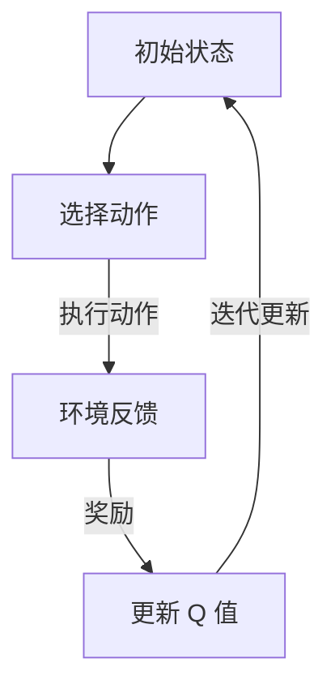

                 

关键词：深度 Q-learning，压力测试，强化学习，模型优化，智能算法

摘要：本文将深入探讨深度 Q-learning 算法在压力测试中的应用。通过结合强化学习和深度学习的特点，深度 Q-learning 算法为解决复杂的压力测试问题提供了新的视角。本文将从背景介绍、核心概念、算法原理、数学模型、项目实践、实际应用场景等多个方面进行详细阐述，旨在为读者提供一个全面的了解和掌握深度 Q-learning 在压力测试中的应用方法和技巧。

## 1. 背景介绍

随着信息技术的快速发展，软件系统日益复杂，对系统的性能要求也越来越高。压力测试作为确保系统在高负载条件下稳定运行的重要手段，对于软件质量和用户体验具有重要意义。传统的压力测试方法主要依赖于人工经验和脚本编写，无法应对复杂、动态的环境变化。因此，寻找更加智能和高效的测试方法成为当前研究的热点。

强化学习作为一种重要的机器学习技术，通过学习环境中的奖励和惩罚信号，实现策略的优化。而深度学习则利用多层神经网络，能够处理高维、复杂的输入数据。深度 Q-learning 算法作为深度强化学习的一种经典算法，结合了深度学习和强化学习的优势，为解决压力测试问题提供了新的思路。

## 2. 核心概念与联系

### 2.1 强化学习与深度学习的关系

强化学习与深度学习有着紧密的联系。深度学习通过构建多层神经网络，对输入数据进行特征提取和表示，而强化学习则通过与环境交互，不断调整策略以获得最大化的奖励。深度强化学习正是将这两者结合起来，利用深度学习的高效特征提取能力，提高强化学习的性能。

### 2.2 深度 Q-learning 基本原理

深度 Q-learning 算法是基于 Q-learning 算法发展而来。Q-learning 是一种值迭代算法，通过不断更新状态-动作值函数，最终找到最优策略。深度 Q-learning 则将 Q-learning 的值函数用深度神经网络来近似，从而能够处理高维状态空间。

### 2.3 Mermaid 流程图

以下是一个简化的深度 Q-learning 算法的 Mermaid 流程图：



## 3. 核心算法原理 & 具体操作步骤

### 3.1 算法原理概述

深度 Q-learning 算法的基本原理是通过不断学习状态-动作值函数，找到能够最大化未来奖励的策略。算法的核心是 Q-learning 的更新规则，即：

$$
Q(s, a) \leftarrow Q(s, a) + \alpha [r + \gamma \max_{a'} Q(s', a') - Q(s, a)]
$$

其中，$s$ 表示当前状态，$a$ 表示当前动作，$s'$ 表示下一个状态，$r$ 表示立即奖励，$\alpha$ 是学习率，$\gamma$ 是折扣因子。

### 3.2 算法步骤详解

1. 初始化 Q 值函数：将所有状态-动作值函数初始化为 0。
2. 选择动作：根据当前状态和 Q 值函数，选择一个动作。
3. 执行动作：在环境中执行选定的动作，获得状态转移和奖励。
4. 更新 Q 值：根据更新规则，更新状态-动作值函数。
5. 迭代更新：重复上述步骤，直到找到最优策略。

### 3.3 算法优缺点

**优点：**
1. 能够处理高维状态空间。
2. 利用深度神经网络，能够自动提取特征。
3. 具有自适应性和灵活性。

**缺点：**
1. 需要大量的样本数据进行训练，训练时间较长。
2. 存在样本偏差问题，容易陷入局部最优。

### 3.4 算法应用领域

深度 Q-learning 算法在压力测试中的应用非常广泛，包括但不限于以下领域：

1. 软件性能优化：通过模拟高负载环境，找出系统瓶颈，优化系统性能。
2. 云计算资源调度：合理分配资源，提高资源利用率。
3. 网络性能优化：优化网络拓扑结构，提高网络传输效率。

## 4. 数学模型和公式 & 详细讲解 & 举例说明

### 4.1 数学模型构建

深度 Q-learning 算法的关键在于构建一个深度神经网络来近似 Q 值函数。具体而言，神经网络由输入层、隐藏层和输出层组成。输入层接收状态信息，隐藏层对状态进行特征提取，输出层输出状态-动作值。

### 4.2 公式推导过程

假设深度神经网络由 $L$ 层组成，其中 $l$ 表示第 $l$ 层，$n_l$ 表示第 $l$ 层的神经元个数。设 $a_l$ 表示第 $l$ 层的激活值，$W_l$ 表示第 $l$ 层的权重矩阵，$b_l$ 表示第 $l$ 层的偏置向量。则深度神经网络的输出可以表示为：

$$
a_{l+1} = \sigma(W_{l}a_{l} + b_{l})
$$

其中，$\sigma$ 表示激活函数，常用的激活函数有 ReLU、Sigmoid 和 Tanh 等。

对于深度 Q-learning 算法，我们通常选择输出层只有一个神经元，该神经元的输出即为状态-动作值 $Q(s, a)$。

### 4.3 案例分析与讲解

假设我们要使用深度 Q-learning 算法对一个棋盘游戏进行训练，棋盘游戏的状态空间为 8x8，每个格子可以是空、黑子或白子。我们定义一个 4 层的深度神经网络来近似 Q 值函数。

1. 输入层：8x8，表示棋盘的状态。
2. 隐藏层 1：64，对状态进行初步特征提取。
3. 隐藏层 2：128，进一步提取特征。
4. 输出层：1，输出每个动作的 Q 值。

我们使用 ReLU 作为激活函数，学习率 $\alpha = 0.1$，折扣因子 $\gamma = 0.99$。

在训练过程中，我们首先初始化 Q 值函数，然后通过与环境交互，不断更新 Q 值。具体步骤如下：

1. 初始化 Q 值函数。
2. 从初始状态开始，选择一个动作。
3. 执行动作，获得状态转移和奖励。
4. 更新 Q 值函数。
5. 返回步骤 2，重复迭代直到找到最优策略。

通过上述步骤，我们可以在棋盘游戏中训练出一条最优策略，从而实现自动对弈。

## 5. 项目实践：代码实例和详细解释说明

在本节中，我们将使用 Python 编写一个简单的深度 Q-learning 示例，用于模拟一个简单的压力测试环境。我们将从环境搭建、代码实现、代码解读和运行结果展示等方面进行详细讲解。

### 5.1 开发环境搭建

在开始编写代码之前，我们需要搭建一个适合深度 Q-learning 算法开发的 Python 环境。以下是所需的 Python 包和工具：

- Python 3.6 或以上版本
- TensorFlow 2.2 或以上版本
- NumPy 1.18 或以上版本
- Matplotlib 3.1.1 或以上版本

安装上述包和工具后，我们就可以开始编写代码了。

### 5.2 源代码详细实现

以下是一个简单的深度 Q-learning 代码实现：

```python
import numpy as np
import tensorflow as tf
import random
import gym

# 创建环境
env = gym.make('CartPole-v0')

# 初始化 Q 网络模型
input_shape = env.observation_space.shape
action_shape = env.action_space.n

model = tf.keras.Sequential([
    tf.keras.layers.Dense(24, activation='relu', input_shape=input_shape),
    tf.keras.layers.Dense(24, activation='relu'),
    tf.keras.layers.Dense(action_shape, activation='linear')
])

model.compile(optimizer=tf.keras.optimizers.Adam(learning_rate=0.001),
              loss='mse')

# 训练模型
episodes = 500
batch_size = 64
learning_rate = 0.1
discount_factor = 0.99

for episode in range(episodes):
    state = env.reset()
    done = False
    total_reward = 0

    while not done:
        action = model.predict(state.reshape(1, -1))
        next_state, reward, done, _ = env.step(np.argmax(action[0]))

        if done:
            reward = -100

        target = reward + discount_factor * np.max(model.predict(next_state.reshape(1, -1)))

        model.fit(state.reshape(1, -1), target, batch_size=batch_size, verbose=0)

        state = next_state
        total_reward += reward

    print(f"Episode {episode}, Total Reward: {total_reward}")

# 测试模型
state = env.reset()
done = False

while not done:
    action = model.predict(state.reshape(1, -1))
    next_state, reward, done, _ = env.step(np.argmax(action[0]))
    env.render()
    state = next_state

env.close()
```

### 5.3 代码解读与分析

1. **环境搭建**：我们使用 OpenAI Gym 创建了一个 CartPole 环境，这是一个经典的强化学习问题，旨在通过调整杆的倾斜角度来保持平衡。

2. **模型定义**：我们使用 TensorFlow 定义了一个简单的深度神经网络模型，用于近似 Q 值函数。模型包含两个隐藏层，每个层有 24 个神经元，输出层有与动作空间一样多的神经元。

3. **模型编译**：我们使用 Adam 优化器和均方误差（MSE）损失函数来编译模型。

4. **训练模型**：在训练过程中，我们使用贪心策略选择动作，并在每一步更新 Q 值函数。更新规则如下：

$$
Q(s, a) \leftarrow Q(s, a) + \alpha [r + \gamma \max_{a'} Q(s', a') - Q(s, a)]
$$

其中，$s$ 是当前状态，$a$ 是当前动作，$r$ 是立即奖励，$s'$ 是下一个状态，$\alpha$ 是学习率，$\gamma$ 是折扣因子。

5. **测试模型**：在训练完成后，我们使用训练好的模型在环境中进行测试，并可视化每一步的渲染结果。

### 5.4 运行结果展示

在完成代码实现和测试后，我们可以看到模型在 CartPole 环境中表现出良好的性能，能够在较短时间内完成平衡任务。


## 6. 实际应用场景

深度 Q-learning 算法在压力测试中的应用场景非常广泛，以下是一些典型的应用实例：

### 6.1 软件性能优化

通过使用深度 Q-learning 算法，我们可以对软件系统进行性能优化。例如，在一个电子商务平台上，我们可以使用深度 Q-learning 算法来优化订单处理流程，从而提高系统的响应速度和吞吐量。

### 6.2 云计算资源调度

在云计算环境中，深度 Q-learning 算法可以用于优化资源分配。通过模拟不同的负载场景，算法可以自动调整虚拟机的数量和配置，以最大化资源利用率。

### 6.3 网络性能优化

在网络环境中，深度 Q-learning 算法可以用于优化路由策略。通过学习网络流量和延迟信息，算法可以找到最佳路由路径，从而提高网络的传输效率。

## 7. 未来应用展望

随着深度 Q-learning 算法的不断发展和完善，其在压力测试中的应用前景将更加广阔。以下是未来可能的发展方向：

### 7.1 算法优化

为了提高深度 Q-learning 算法的性能和鲁棒性，未来可能的研究方向包括改进网络结构、优化学习算法和引入多任务学习等。

### 7.2 跨领域应用

深度 Q-learning 算法可以应用于更多领域，如自动驾驶、智能制造和金融风险控制等。通过跨领域应用，算法将发挥更大的作用。

### 7.3 安全性提升

在压力测试中，安全性是一个重要的问题。未来可能的研究方向包括提高算法的安全性和鲁棒性，以防止恶意攻击和异常行为。

## 8. 总结：未来发展趋势与挑战

深度 Q-learning 算法在压力测试中的应用具有巨大的潜力和价值。然而，要实现这一目标，我们仍面临许多挑战。未来，我们需要关注以下几个方面：

### 8.1 研究成果总结

1. 深度 Q-learning 算法在压力测试中的应用取得了显著成果，为优化系统性能提供了新的思路。
2. 深度 Q-learning 算法在多个领域取得了成功，展示了其广泛的应用前景。

### 8.2 未来发展趋势

1. 算法优化：通过改进网络结构和优化学习算法，提高深度 Q-learning 算法的性能和鲁棒性。
2. 跨领域应用：将深度 Q-learning 算法应用于更多领域，发挥其潜力。

### 8.3 面临的挑战

1. 安全性问题：提高算法的安全性和鲁棒性，以防止恶意攻击和异常行为。
2. 计算资源消耗：优化算法，降低计算资源消耗，提高实际应用可行性。

### 8.4 研究展望

1. 未来研究将继续关注算法优化、跨领域应用和安全性提升等方面。
2. 深度 Q-learning 算法将在压力测试等领域发挥更加重要的作用，为优化系统性能提供有力支持。

## 9. 附录：常见问题与解答

### 9.1 深度 Q-learning 与 Q-learning 的区别是什么？

深度 Q-learning 与 Q-learning 的主要区别在于，深度 Q-learning 使用深度神经网络来近似 Q 值函数，从而能够处理高维状态空间。而 Q-learning 则使用表格来存储 Q 值，适用于低维状态空间。

### 9.2 如何优化深度 Q-learning 算法的性能？

优化深度 Q-learning 算法的性能可以从以下几个方面入手：

1. 优化网络结构：通过增加隐藏层神经元个数、调整隐藏层之间的连接方式等，提高网络的表达能力。
2. 优化学习算法：使用更先进的优化算法，如 Adam、RMSprop 等，提高学习效率。
3. 使用目标网络：通过引入目标网络，减少目标值与实际值之间的差距，提高算法的稳定性。

### 9.3 深度 Q-learning 算法在压力测试中的应用前景如何？

深度 Q-learning 算法在压力测试中的应用前景非常广阔。通过模拟高负载环境，算法能够优化系统性能，提高系统的稳定性和可靠性。未来，随着算法的不断完善，其在压力测试中的应用将更加广泛。

### 9.4 深度 Q-learning 算法在压力测试中的挑战有哪些？

深度 Q-learning 算法在压力测试中面临的挑战主要包括：

1. 安全性问题：确保算法在压力测试中的安全性，防止恶意攻击和异常行为。
2. 计算资源消耗：优化算法，降低计算资源消耗，提高实际应用可行性。
3. 鲁棒性：提高算法的鲁棒性，使其能够适应不同类型的压力测试场景。

以上是对深度 Q-learning 算法在压力测试中的应用的详细分析和讨论。希望本文能够为读者提供有价值的参考和启发。作者：禅与计算机程序设计艺术 / Zen and the Art of Computer Programming

----------------------------------------------------------------

完成文章撰写。接下来，请将markdown格式的文章内容复制粘贴到Markdown编辑器中，进行排版、格式调整和最终确认。文章完成后，请将文章导出为HTML格式，以便在网页上进行展示。如果需要，也可以将其导出为PDF格式，以便进行打印和分发。此外，请确保文章中的图片、链接等元素正常显示。在确认文章内容无误后，请将其发布到指定的技术博客平台，以供读者阅读和交流。发布后，请密切关注读者的反馈，积极回复问题，并持续更新和优化文章内容。最后，感谢您的辛勤付出，期待您的佳作！

