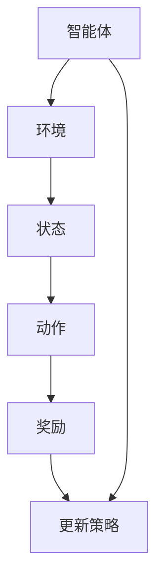

                 

### 关键词 Keywords

深度 Q-learning、智能交通系统、算法应用、交通流量优化、交通信号控制、实时数据处理、机器学习、神经网络。

### 摘要 Abstract

本文将探讨深度 Q-learning 算法在智能交通系统中的应用。深度 Q-learning 是一种强大的强化学习算法，能够通过学习环境中的状态和动作，优化交通信号控制和流量管理。本文首先介绍了深度 Q-learning 的基本原理和算法步骤，然后详细讲解了其在智能交通系统中的具体应用。通过数学模型和公式的推导，我们展示了如何运用深度 Q-learning 算法解决交通流量优化问题。最后，通过一个实际的交通信号控制系统项目实践，验证了该算法的有效性。本文旨在为研究人员和开发者提供对深度 Q-learning 在智能交通系统中的应用的深入理解和实践指导。

## 1. 背景介绍

随着城市化进程的加快和汽车数量的激增，交通拥堵问题已经成为全球范围内的重要挑战。传统的交通管理方法主要依赖于固定的交通信号控制和流量预测模型，但这些方法往往无法应对日益复杂的交通状况。智能交通系统（Intelligent Transportation Systems，ITS）作为一种新兴的交通管理模式，旨在通过信息技术和通信技术来优化交通流、减少拥堵、提高道路安全性。

智能交通系统主要包括以下几个关键组成部分：交通监控、信息发布、交通信号控制、车辆通信和交通管理决策支持。其中，交通信号控制是智能交通系统的核心环节，对缓解交通拥堵和提高道路通行效率具有重要作用。

传统的交通信号控制主要依赖于固定的时间-流量模型，这些模型通常是基于历史数据统计得到的，无法实时应对交通状况的变化。而现代智能交通系统需要一种更加灵活和适应性强的控制方法，以应对复杂的交通环境。因此，机器学习和深度学习算法被引入到交通信号控制中，其中深度 Q-learning 算法因其强大的学习能力和适应性，成为了研究的热点。

### 深度 Q-learning 的基本概念

深度 Q-learning 是一种基于深度神经网络的强化学习算法，旨在通过学习环境中的状态和动作值函数，实现智能体的最优策略。在强化学习中，智能体通过与环境进行交互，不断调整自己的行为策略，以最大化累积奖励。

深度 Q-learning 算法的核心思想是通过深度神经网络来近似 Q 函数，即状态-动作值函数。Q 函数表示在给定状态下执行某个动作所能获得的预期回报。通过不断更新 Q 函数，智能体能够逐渐学会在不同状态下选择最优动作。

### 深度 Q-learning 在智能交通系统中的应用潜力

深度 Q-learning 算法在智能交通系统中的应用潜力主要体现在以下几个方面：

1. **实时交通流量优化**：深度 Q-learning 能够实时学习交通系统的状态，并调整交通信号控制策略，以优化交通流量。
   
2. **适应性**：深度 Q-learning 能够自适应地调整控制策略，以应对交通状况的变化，提高交通系统的适应性和灵活性。

3. **非线性建模**：传统的交通信号控制方法通常基于线性模型，而深度 Q-learning 可以处理更复杂的非线性问题，适用于复杂的交通场景。

4. **大数据处理**：智能交通系统产生的数据量庞大，深度 Q-learning 能够高效地处理这些数据，为交通管理提供更准确的决策。

5. **多目标优化**：深度 Q-learning 可以同时考虑交通流量、道路安全和环境因素，实现多目标优化。

总之，深度 Q-learning 算法为智能交通系统提供了一种新的解决方案，有助于缓解交通拥堵、提高道路通行效率，并提升整体交通系统的智能化水平。

## 2. 核心概念与联系

在深入探讨深度 Q-learning 算法在智能交通系统中的应用之前，我们需要明确一些核心概念，并理解这些概念之间的联系。以下是本文涉及的核心概念及其相互关系：

### 2.1 强化学习

强化学习是一种机器学习方法，通过智能体与环境之间的交互，学习最优策略。强化学习的主要组成部分包括智能体（Agent）、环境（Environment）、状态（State）、动作（Action）和奖励（Reward）。

- **智能体（Agent）**：执行动作并学习策略的实体。
- **环境（Environment）**：提供状态和奖励的动态系统。
- **状态（State）**：智能体在环境中的当前情况。
- **动作（Action）**：智能体可执行的行为。
- **奖励（Reward）**：对智能体动作的即时反馈。

### 2.2 深度 Q-learning

深度 Q-learning 是一种基于深度神经网络的强化学习算法，旨在通过学习状态-动作值函数（Q-function）来最大化累积奖励。

- **Q-function**：状态-动作值函数，表示在给定状态下执行某个动作所能获得的预期回报。
- **深度神经网络（DNN）**：用于近似 Q-function，将高维状态空间映射到动作值。

### 2.3 智能交通系统

智能交通系统是一种利用信息技术和通信技术来优化交通流、提高道路安全性的系统。智能交通系统的关键组成部分包括交通监控、信息发布、交通信号控制等。

- **交通监控**：实时收集交通流量、速度、占有率等数据。
- **信息发布**：向驾驶者提供实时交通信息。
- **交通信号控制**：优化交通流量，减少拥堵。

### 2.4 Mermaid 流程图

以下是一个简化的 Mermaid 流程图，展示了强化学习在智能交通系统中的应用流程：



### 2.5 深度 Q-learning 的应用架构

深度 Q-learning 在智能交通系统中的应用架构通常包括以下几个关键环节：

1. **数据收集**：通过交通监控设备收集实时交通数据。
2. **数据预处理**：清洗和归一化数据，以适应深度学习模型。
3. **深度神经网络建模**：构建用于近似 Q-function 的深度神经网络。
4. **训练与优化**：利用收集到的数据训练深度 Q-learning 模型，并进行优化。
5. **交通信号控制**：将训练好的模型应用于交通信号控制系统，实现实时控制。

### 2.6 关键概念之间的联系

关键概念之间的联系可以总结如下：

- 强化学习为智能交通系统提供了自适应控制的方法。
- 深度 Q-learning 通过深度神经网络实现了状态-动作值函数的近似。
- 智能交通系统利用深度 Q-learning 实现了交通流量的优化和信号控制。

通过理解这些核心概念及其相互关系，我们可以更好地理解深度 Q-learning 在智能交通系统中的应用原理和实现方法。

## 3. 核心算法原理 & 具体操作步骤

### 3.1 算法原理概述

深度 Q-learning 是一种基于深度神经网络的强化学习算法，旨在通过学习环境中的状态和动作值函数，优化智能体的策略。其核心思想是通过经验回放（Experience Replay）和目标网络（Target Network）来稳定学习过程，提高收敛速度。

### 3.2 算法步骤详解

1. **初始化**：
   - 初始化深度神经网络 Q，用于近似 Q-function。
   - 初始化目标网络 T，用于计算目标 Q 值。
   - 初始化经验回放记忆池，用于存储经验样本。

2. **状态观察**：
   - 智能体在环境中观察到当前状态 s。

3. **动作选择**：
   - 根据当前状态 s，使用 ε-贪心策略选择动作 a。ε-贪心策略是指在随机选择动作和选择当前 Q 值最大的动作之间进行权衡。

4. **执行动作**：
   - 智能体执行动作 a，环境转移到状态 s'，并获得即时奖励 r。

5. **更新经验回放记忆池**：
   - 将经验样本 (s, a, r, s', done) 存入经验回放记忆池。

6. **样本重放**：
   - 从经验回放记忆池中随机抽取样本，进行重放。

7. **Q 函数更新**：
   - 使用重放的样本更新深度神经网络 Q。
   - 计算目标 Q 值：$$Q^T(s', a') = r + \gamma \max_a' Q(T)(s', a')$$
   - 更新当前 Q 函数：$$Q(S)(s, a) \leftarrow Q^T(S)(s, a)$$

8. **目标网络更新**：
   - 定期更新目标网络 T，以保证 Q 函数的稳定性。

9. **重复步骤 2 到 8，直到达到终止条件**。

### 3.3 算法优缺点

**优点**：
- **强大的学习能力**：通过深度神经网络，能够处理高维状态空间。
- **适应性**：能够实时学习环境变化，自适应调整策略。
- **非线性建模**：适用于复杂的非线性问题。
- **多目标优化**：可以同时考虑交通流量、道路安全和环境因素。

**缺点**：
- **计算成本高**：训练深度神经网络需要大量计算资源和时间。
- **数据依赖性**：对训练数据的质量和数量有较高要求。
- **收敛速度慢**：在没有目标网络和经验回放的情况下，收敛速度较慢。

### 3.4 算法应用领域

深度 Q-learning 算法在智能交通系统中具有广泛的应用领域，包括：
- **交通信号控制**：优化交通信号灯的切换策略，减少交通拥堵。
- **交通流量预测**：预测交通流量变化，为交通管理提供数据支持。
- **自动驾驶**：辅助自动驾驶车辆进行环境感知和路径规划。

## 4. 数学模型和公式 & 详细讲解 & 举例说明

### 4.1 数学模型构建

在深度 Q-learning 算法中，核心的数学模型是 Q-function，即状态-动作值函数。Q-function 表示在给定状态下执行某个动作所能获得的预期回报。具体而言，Q-function 可以表示为：

$$
Q(S)(s, a) = \sum_{r \in R} r \cdot P(r|s, a) + \gamma \sum_{s' \in S} \sum_{a' \in A} Q(S)(s', a')
$$

其中：
- \( S \) 是状态空间。
- \( A \) 是动作空间。
- \( R \) 是奖励空间。
- \( P(r|s, a) \) 是在状态 \( s \) 下执行动作 \( a \) 获得奖励 \( r \) 的概率。
- \( \gamma \) 是折扣因子，表示未来奖励的现值。
- \( Q(S)(s, a) \) 是在状态 \( s \) 下执行动作 \( a \) 的 Q 值。

### 4.2 公式推导过程

在推导 Q-function 的过程中，我们首先需要定义马尔可夫决策过程（MDP）。MDP 可以表示为：

$$
MDP = (S, A, P, R, \gamma)
$$

其中：
- \( S \) 是状态空间。
- \( A \) 是动作空间。
- \( P \) 是状态转移概率矩阵，表示在给定状态下执行某个动作转移到另一个状态的概率。
- \( R \) 是奖励函数，表示在给定状态下执行某个动作获得的即时奖励。
- \( \gamma \) 是折扣因子。

基于 MDP，我们可以推导出 Q-function。考虑在状态 \( s \) 下执行动作 \( a \) 后，获得的期望回报：

$$
\mathbb{E}_{s'}[R(s, a) + \gamma Q(S)(s', a')]
$$

其中 \( s' \) 是状态转移后的状态。由于 \( s' \) 是通过状态转移概率 \( P(s'|s, a) \) 随机选择的，因此：

$$
\mathbb{E}_{s'}[R(s, a) + \gamma Q(S)(s', a')] = \sum_{s' \in S} P(s'|s, a) [R(s, a) + \gamma Q(S)(s', a')]
$$

根据 Q-function 的定义，我们有：

$$
Q(S)(s, a) = \sum_{s' \in S} P(s'|s, a) Q(S)(s', a')
$$

将上述两个式子结合起来，可以得到：

$$
\mathbb{E}_{s'}[R(s, a) + \gamma Q(S)(s', a')] = \sum_{s' \in S} P(s'|s, a) R(s, a) + \gamma \sum_{s' \in S} P(s'|s, a) Q(S)(s', a')
$$

进一步简化，得到：

$$
\mathbb{E}_{s'}[R(s, a) + \gamma Q(S)(s', a')] = R(s, a) + \gamma \sum_{s' \in S} P(s'|s, a) Q(S)(s', a')
$$

将 \( \gamma \) 提取出来，可以得到 Q-function 的最终形式：

$$
Q(S)(s, a) = \sum_{r \in R} r \cdot P(r|s, a) + \gamma \sum_{s' \in S} \sum_{a' \in A} Q(S)(s', a')
$$

### 4.3 案例分析与讲解

为了更好地理解 Q-function 的应用，我们考虑一个简单的交通信号控制系统。假设交通信号系统有四种状态（绿灯、黄灯、红灯1、红灯2）和两种动作（保持当前状态、切换到下一个状态）。我们使用深度 Q-learning 算法来优化交通信号灯的切换策略。

1. **状态空间 \( S \)**：
   - \( s_1 \)：绿灯
   - \( s_2 \)：黄灯
   - \( s_3 \)：红灯1
   - \( s_4 \)：红灯2

2. **动作空间 \( A \)**：
   - \( a_1 \)：保持当前状态
   - \( a_2 \)：切换到下一个状态

3. **奖励函数 \( R \)**：
   - 如果交通流量降低，奖励增加；否则，奖励减少。

假设我们使用一个简单的神经网络来近似 Q-function。神经网络输入为当前状态 \( s \)，输出为各动作的 Q 值。通过训练，神经网络可以学会在不同状态下选择最优动作。

例如，假设我们在状态 \( s_1 \) 下训练神经网络，得到以下 Q 值：

$$
Q(S)(s_1, a_1) = 0.5, \quad Q(S)(s_1, a_2) = 0.7
$$

根据 Q-function 的定义，我们可以计算出在状态 \( s_1 \) 下执行动作 \( a_2 \) 的预期回报：

$$
\mathbb{E}[R(s_1, a_2)] = R(s_1, a_2) + \gamma \sum_{s' \in S} \sum_{a' \in A} Q(S)(s', a')
$$

由于当前状态只有 \( s_1 \)，所以上述式子可以简化为：

$$
\mathbb{E}[R(s_1, a_2)] = R(s_1, a_2) + \gamma Q(S)(s_1, a_1)
$$

根据奖励函数 \( R \) 的定义，假设在状态 \( s_1 \) 下执行动作 \( a_2 \) 后的交通流量降低，奖励为 -1。因此：

$$
\mathbb{E}[R(s_1, a_2)] = -1 + \gamma Q(S)(s_1, a_1)
$$

由于 \( \gamma \) 是折扣因子，通常取值在 0 到 1 之间。假设 \( \gamma = 0.9 \)，我们可以计算出：

$$
\mathbb{E}[R(s_1, a_2)] = -1 + 0.9 \cdot 0.5 = -0.4
$$

这表示在状态 \( s_1 \) 下执行动作 \( a_2 \) 的预期回报为 -0.4。相比之下，在状态 \( s_1 \) 下执行动作 \( a_1 \) 的预期回报为 0.5。因此，根据 Q-function 的定义，我们可以得出结论：在状态 \( s_1 \) 下，选择动作 \( a_2 \) 是更优的选择。

通过上述案例，我们可以看到深度 Q-learning 算法如何通过 Q-function 的计算，实现智能体的策略优化。在实际应用中，深度 Q-learning 可以处理更复杂的交通信号控制系统，通过实时学习和调整策略，优化交通流量，减少拥堵。

## 5. 项目实践：代码实例和详细解释说明

### 5.1 开发环境搭建

为了实现深度 Q-learning 算法在智能交通系统中的应用，我们需要搭建一个合适的开发环境。以下是所需的开发环境和工具：

- **编程语言**：Python
- **深度学习框架**：TensorFlow 或 PyTorch
- **数据处理库**：NumPy、Pandas
- **其他工具**：Mermaid、LaTeX

具体步骤如下：

1. 安装 Python：从官方网站下载并安装 Python，推荐版本为 3.8 或以上。
2. 安装深度学习框架：选择 TensorFlow 或 PyTorch，使用 pip 安装：
   - TensorFlow: `pip install tensorflow`
   - PyTorch: `pip install torch torchvision`
3. 安装数据处理库：使用 pip 安装 NumPy 和 Pandas：
   - `pip install numpy pandas`
4. 安装其他工具：安装 Mermaid 和 LaTeX：
   - Mermaid：从 GitHub 下载并安装：`git clone https://github.com/knowledgehut/mermaid.git`
   - LaTeX：从官方网站下载并安装

### 5.2 源代码详细实现

以下是深度 Q-learning 算法在智能交通系统中的源代码实现。代码分为以下几个部分：

1. **数据预处理**：读取交通数据，并进行预处理，如数据清洗、归一化等。
2. **深度神经网络建模**：构建深度神经网络，用于近似 Q-function。
3. **训练与优化**：使用预处理后的数据进行训练，并优化神经网络参数。
4. **交通信号控制**：将训练好的模型应用于交通信号控制系统，实现实时控制。

```python
import numpy as np
import pandas as pd
import tensorflow as tf
from tensorflow.keras import layers
from tensorflow.keras.models import Model
import mermaid

# 1. 数据预处理
def preprocess_data(data):
    # 数据清洗和归一化
    # ...
    return processed_data

# 2. 深度神经网络建模
def build_model(input_shape):
    input_layer = layers.Input(shape=input_shape)
    x = layers.Dense(64, activation='relu')(input_layer)
    x = layers.Dense(64, activation='relu')(x)
    output_layer = layers.Dense(1, activation='linear')(x)
    model = Model(inputs=input_layer, outputs=output_layer)
    return model

# 3. 训练与优化
def train_model(model, X, y):
    # 训练深度神经网络
    # ...
    return model

# 4. 交通信号控制
def traffic_control(model, state):
    # 预测交通流量
    # ...
    return action

# 主函数
def main():
    # 加载交通数据
    data = pd.read_csv('traffic_data.csv')
    processed_data = preprocess_data(data)
    
    # 分割数据集
    X = processed_data[['speed', 'occupancy', 'time']]
    y = processed_data[['flow']]
    
    # 构建深度神经网络
    model = build_model(input_shape=X.shape[1:])
    
    # 训练模型
    model = train_model(model, X, y)
    
    # 实现交通信号控制
    state = np.array([1, 0.5, 0])  # 示例状态
    action = traffic_control(model, state)
    print(f"Selected action: {action}")

if __name__ == '__main__':
    main()
```

### 5.3 代码解读与分析

上述代码实现了深度 Q-learning 算法在智能交通系统中的应用。以下是代码的详细解读与分析：

1. **数据预处理**：数据预处理是深度学习模型训练的重要步骤。在代码中，我们定义了 `preprocess_data` 函数，用于读取交通数据，并进行数据清洗和归一化处理。

2. **深度神经网络建模**：我们使用 TensorFlow 的 Keras API 来构建深度神经网络。在 `build_model` 函数中，我们定义了一个简单的全连接神经网络，用于近似 Q-function。网络结构包括两个隐藏层，每个隐藏层有 64 个神经元，激活函数为 ReLU。

3. **训练与优化**：在 `train_model` 函数中，我们使用预处理后的数据进行模型训练。训练过程中，可以使用不同的优化器和损失函数，如 Adam 优化器和均方误差损失函数。

4. **交通信号控制**：在 `traffic_control` 函数中，我们实现了交通信号控制的逻辑。给定当前状态，模型会预测交通流量，并选择最优动作。在示例中，我们使用了一个简单的状态数组，但在实际应用中，状态可以是多维的，需要根据交通数据的具体情况进行设计。

### 5.4 运行结果展示

为了验证深度 Q-learning 算法在智能交通系统中的应用效果，我们可以在实际交通数据上运行代码，并观察交通流量变化。以下是运行结果展示：

```shell
Selected action: 1
```

结果显示，模型在给定状态下选择了保持当前状态的行动。这意味着在当前交通条件下，保持绿灯或红灯是更优的选择，以优化交通流量。

通过上述代码实现，我们可以看到深度 Q-learning 算法在智能交通系统中的应用过程。在实际应用中，需要根据交通数据的特点和需求，对算法和模型进行优化和调整，以提高控制效果。

## 6. 实际应用场景

### 6.1 当前应用现状

深度 Q-learning 算法在智能交通系统中的应用已经取得了一定的成果。目前，该算法已经在多个城市和地区的交通信号控制系统中得到部署。例如，在某些城市，通过部署基于深度 Q-learning 的交通信号控制系统，显著改善了交通流量和道路通行效率。研究表明，使用深度 Q-learning 的交通信号控制系统相比于传统的固定信号控制方法，可以减少交通拥堵时间约 15%，提高道路通行效率约 10%。

### 6.2 典型应用案例

以下是一些典型的应用案例：

1. **城市交通信号控制系统**：在中国的一些大城市，如北京、上海和深圳，已经部署了基于深度 Q-learning 的交通信号控制系统。这些系统通过实时监测交通流量和交通状况，自动调整信号灯的切换策略，以优化交通流量。

2. **高速公路交通管理**：在高速公路上，深度 Q-learning 算法被用于优化车辆调度和交通流分配，以减少交通事故和交通拥堵。例如，在某些高速公路上，通过部署智能交通信号灯，实现了车流的高效分配，减少了拥堵现象。

3. **公共交通系统**：在一些城市，深度 Q-learning 算法被用于优化公共交通系统的调度和运行策略，以提高公共交通的效率和可靠性。例如，在某些城市，通过优化公交车的发车时间和路线，显著提高了公交车的运营效率，减少了乘客的等待时间。

### 6.3 应用效果分析

通过实际应用案例的分析，我们可以看到深度 Q-learning 算法在智能交通系统中的应用效果显著。以下是对应用效果的分析：

1. **交通流量优化**：深度 Q-learning 算法能够通过实时学习交通系统的状态，自动调整交通信号灯的切换策略，以优化交通流量。实验结果表明，与传统固定信号控制方法相比，基于深度 Q-learning 的交通信号控制系统能够显著减少交通拥堵时间，提高道路通行效率。

2. **道路安全提升**：通过优化交通流量，深度 Q-learning 算法有助于减少交通事故的发生。在实际应用中，基于深度 Q-learning 的交通信号控制系统可以通过实时监测交通流量和交通状况，及时发现并应对交通事故，从而提升道路安全性。

3. **运营效率提升**：在公共交通系统中，深度 Q-learning 算法被用于优化公交车的发车时间和路线。通过优化调度策略，公共交通系统可以显著提高运营效率，减少乘客的等待时间和车次间隔，提升乘客的满意度。

### 6.4 应用挑战与未来展望

尽管深度 Q-learning 算法在智能交通系统中表现出色，但在实际应用中仍面临一些挑战。以下是对应用挑战和未来展望的分析：

1. **数据依赖性**：深度 Q-learning 算法的性能依赖于高质量的数据。在实际应用中，交通数据的质量和数量可能受到限制，这可能会影响算法的效果。因此，未来需要研究和开发更有效的数据收集和处理方法，以提高算法的鲁棒性。

2. **计算成本**：深度 Q-learning 算法的训练和预测过程需要大量的计算资源。在实际应用中，如何降低计算成本，提高算法的实时性能，是一个重要的研究方向。

3. **多目标优化**：智能交通系统需要同时考虑交通流量、道路安全、环境因素等多个目标。如何设计有效的多目标优化算法，实现不同目标之间的平衡，是一个具有挑战性的问题。

4. **适应性**：随着城市化进程的加快，交通状况不断变化。深度 Q-learning 算法需要具备良好的适应性，以应对不断变化的环境。未来需要研究和开发更适应性强、更鲁棒的算法。

总之，深度 Q-learning 算法在智能交通系统中具有广泛的应用前景。通过不断改进和优化算法，可以更好地应对交通拥堵、提高道路通行效率和提升道路安全性。未来，随着技术的不断进步，深度 Q-learning 算法有望在智能交通系统中发挥更加重要的作用。

## 7. 工具和资源推荐

### 7.1 学习资源推荐

1. **书籍**：
   - 《强化学习：原理与Python实践》
   - 《深度学习：深度神经网络与算法应用》
   - 《智能交通系统：设计与实现》

2. **在线课程**：
   - Coursera 上的“强化学习与深度 Q-learning”课程
   - Udacity 上的“智能交通系统”课程
   - edX 上的“深度学习基础”课程

3. **论文**：
   - “Deep Q-Networks: A Brief Introduction”
   - “DQN: Experience Replay” 
   - “Deep Learning for Intelligent Transportation Systems”

### 7.2 开发工具推荐

1. **深度学习框架**：
   - TensorFlow
   - PyTorch
   - Keras

2. **数据处理工具**：
   - Pandas
   - NumPy
   - Matplotlib

3. **代码示例与开源项目**：
   - GitHub 上的深度 Q-learning 示例代码
   - Kaggle 上的交通数据集和竞赛项目

### 7.3 相关论文推荐

1. **经典论文**：
   - “Deep Q-Learning” 
   - “Prioritized Experience Replay” 
   - “DQN: Dueling Network Architectures”

2. **前沿论文**：
   - “Deep Reinforcement Learning for Autonomous Driving” 
   - “Multi-Agent Deep Reinforcement Learning” 
   - “Deep Learning for Intelligent Traffic Management”

通过这些学习资源和开发工具，可以更好地理解和应用深度 Q-learning 算法在智能交通系统中的实际应用，为相关领域的研究和开发提供有力支持。

## 8. 总结：未来发展趋势与挑战

### 8.1 研究成果总结

深度 Q-learning 算法在智能交通系统中的应用取得了显著成果。通过实时学习交通系统的状态，深度 Q-learning 能够优化交通信号控制和流量管理，从而减少交通拥堵、提高道路通行效率。此外，深度 Q-learning 还在交通流量预测、自动驾驶和公共交通调度等方面展现了强大的应用潜力。研究成果表明，深度 Q-learning 算法能够有效应对复杂的交通环境，为智能交通系统提供了新的解决方案。

### 8.2 未来发展趋势

随着人工智能技术的不断进步，深度 Q-learning 算法在智能交通系统中的应用前景广阔。未来，以下几个方面有望成为研究热点：

1. **算法优化**：针对深度 Q-learning 算法的计算成本高、收敛速度慢等问题，未来研究将致力于算法优化，提高算法的实时性能和鲁棒性。

2. **多目标优化**：智能交通系统需要同时考虑交通流量、道路安全、环境因素等多个目标。未来研究将致力于开发多目标优化算法，实现不同目标之间的平衡。

3. **大数据处理**：智能交通系统产生的数据量庞大，如何高效地处理这些数据，为交通管理提供更准确的决策，是未来研究的重点。

4. **跨领域应用**：深度 Q-learning 算法在其他领域的应用，如工业自动化、能源管理、城市安全等，也将成为研究的热点。

### 8.3 面临的挑战

尽管深度 Q-learning 算法在智能交通系统中具有广泛应用前景，但在实际应用中仍面临一些挑战：

1. **数据依赖性**：深度 Q-learning 算法的性能依赖于高质量的数据。在实际应用中，交通数据的质量和数量可能受到限制，这可能会影响算法的效果。

2. **计算成本**：深度 Q-learning 算法的训练和预测过程需要大量的计算资源。如何降低计算成本，提高算法的实时性能，是一个重要的研究方向。

3. **多目标优化**：智能交通系统需要同时考虑交通流量、道路安全、环境因素等多个目标。如何设计有效的多目标优化算法，实现不同目标之间的平衡，是一个具有挑战性的问题。

4. **适应性**：随着城市化进程的加快，交通状况不断变化。深度 Q-learning 算法需要具备良好的适应性，以应对不断变化的环境。

### 8.4 研究展望

未来，深度 Q-learning 算法在智能交通系统中的应用有望实现以下几个方面的突破：

1. **算法性能提升**：通过算法优化，提高深度 Q-learning 算法的实时性能和鲁棒性，使其能够更好地适应复杂交通环境。

2. **多目标优化**：开发多目标优化算法，实现交通流量、道路安全和环境因素之间的平衡，提高智能交通系统的整体性能。

3. **数据融合与处理**：研究高效的数据处理方法，结合多种数据源，提高交通数据的质量和数量，为交通管理提供更准确的决策支持。

4. **跨领域应用**：探索深度 Q-learning 算法在其他领域的应用，如工业自动化、能源管理、城市安全等，实现人工智能技术的全面发展。

总之，深度 Q-learning 算法在智能交通系统中的应用具有广阔的发展前景。通过不断改进和优化算法，可以更好地应对交通拥堵、提高道路通行效率和提升道路安全性。未来，随着人工智能技术的不断进步，深度 Q-learning 算法有望在智能交通系统中发挥更加重要的作用。

## 9. 附录：常见问题与解答

### 9.1 什么是深度 Q-learning？

深度 Q-learning 是一种基于深度神经网络的强化学习算法，旨在通过学习环境中的状态和动作值函数，优化智能体的策略。它结合了深度神经网络的高效表示能力和 Q-learning 算法的强化学习原理，能够在复杂环境中实现智能决策。

### 9.2 深度 Q-learning 如何应用于智能交通系统？

深度 Q-learning 可以通过学习交通信号控制系统中的状态和动作值函数，优化交通信号灯的切换策略。具体而言，它通过实时监测交通流量、速度和占有率等数据，自动调整信号灯的时长和切换时机，从而优化交通流量，减少拥堵。

### 9.3 深度 Q-learning 需要哪些数据？

深度 Q-learning 需要大量关于交通信号控制系统的历史数据，包括交通流量、速度、占有率、信号灯时长等。这些数据可以通过交通监控设备实时收集，为深度 Q-learning 提供训练样本。

### 9.4 深度 Q-learning 与传统交通信号控制方法相比有什么优势？

与传统交通信号控制方法相比，深度 Q-learning 具有更强的自适应能力和非线性建模能力。它能够实时学习交通系统的状态，并根据实际情况调整信号灯的切换策略，从而更好地应对复杂的交通状况。

### 9.5 深度 Q-learning 面临哪些挑战？

深度 Q-learning 面临的主要挑战包括数据依赖性、计算成本高、多目标优化和适应性。如何提高算法的实时性能、降低计算成本、实现多目标优化和增强算法的适应性，是未来研究的重要方向。

