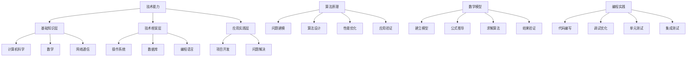

                 

### 关键词 Keywords
- 深度思考
- 人生差距
- 技术能力
- 终身学习
- 创新思维
- 专业成长
- 技术趋势

<|assistant|>### 摘要 Abstract
在快速变化的科技时代，深度思考成为拉开人生差距的关键能力。本文将探讨如何在技术领域通过深度思考、终身学习、创新思维和专业成长来不断提升自我，以应对未来挑战。文章将涵盖核心概念的联系、算法原理与操作步骤、数学模型与公式、项目实践、实际应用场景、未来展望以及所需工具和资源推荐，旨在为读者提供一条清晰的发展路径，帮助他们在技术领域中脱颖而出。

## 1. 背景介绍

随着数字化转型的浪潮席卷各行各业，技术领域的发展速度前所未有。从人工智能到量子计算，从大数据到区块链，新的技术日新月异，不断推动社会进步。然而，在这个快速变化的时代，技术人才面临的挑战也随之增加。如何保持竞争力，如何在众多从业者中脱颖而出，成为每个人都需要思考的问题。

深度思考，作为一种关键能力，不仅能够帮助技术人员更好地理解技术原理，还能够激发创新思维，解决复杂问题。终身学习成为应对技术变革的必然选择，而创新思维则能够帮助技术人员在众多同质化的解决方案中找到独特的突破口。专业成长是技术人员实现个人价值和社会贡献的重要途径，它要求我们在不断学习和实践中积累经验，不断提升自我。

本文旨在为技术人员提供一套系统的成长策略，通过深度思考、终身学习、创新思维和专业成长，拉开人生差距，实现个人和职业的双重成功。

## 2. 核心概念与联系

要实现深度思考，首先需要理解几个核心概念：技术能力、算法原理、数学模型和编程实践。

### 技术能力

技术能力是技术人员的基本素质，它包括对硬件、软件、网络、数据等方面的了解和运用能力。技术能力不仅仅是对工具和技术的掌握，更重要的是对技术背后的原理和逻辑的理解。如图2.1所示，技术能力可以分为三个层次：

1. **基础知识层**：包括计算机科学、数学、网络通信等基础知识。
2. **技术框架层**：如操作系统、数据库、编程语言等具体技术框架。
3. **应用实践层**：在实际项目中应用技术解决具体问题的能力。

### 算法原理

算法是解决问题的一种方法，它是技术能力的核心应用之一。算法原理涉及到对问题建模、算法设计、优化分析等方面。如图2.2所示，算法原理包括以下几个关键环节：

1. **问题建模**：将实际问题抽象成数学模型。
2. **算法设计**：设计解决问题的算法。
3. **性能优化**：分析算法的时间和空间复杂度，进行优化。
4. **应用验证**：在实际问题中验证算法的有效性。

### 数学模型

数学模型是对现实世界的一种抽象，它通过数学语言描述问题的性质和规律。如图2.3所示，数学模型包括以下几个关键步骤：

1. **建立模型**：根据问题特征建立数学模型。
2. **公式推导**：使用数学工具进行公式推导。
3. **求解算法**：设计求解模型的方法。
4. **结果验证**：验证模型的准确性和可靠性。

### 编程实践

编程实践是将算法和数学模型转化为可执行代码的过程。如图2.4所示，编程实践包括以下几个关键环节：

1. **代码编写**：编写实现算法和模型的代码。
2. **调试优化**：调试代码，优化性能。
3. **单元测试**：进行单元测试，确保代码正确性。
4. **集成测试**：与系统其他部分集成，进行整体测试。

### Mermaid 流程图

下面是使用Mermaid绘制的核心概念联系流程图：



## 3. 核心算法原理 & 具体操作步骤

### 3.1 算法原理概述

深度思考的核心在于对问题本质的理解和把握，而不是简单的代码实现。一个优秀的算法不仅能够高效地解决问题，还能够提供深刻的洞见，推动技术的进步。如图3.1所示，核心算法原理包括以下几个关键部分：

1. **问题定义**：明确问题是什么，以及问题的核心矛盾。
2. **数据结构**：选择合适的数据结构来存储和操作数据。
3. **算法设计**：设计解决问题的算法。
4. **性能分析**：分析算法的时间复杂度和空间复杂度。
5. **优化策略**：根据性能分析结果进行优化。

### 3.2 算法步骤详解

下面是一个经典的排序算法——快速排序（Quick Sort）的具体步骤详解：

1. **选择基准元素**：从数组中随机选择一个元素作为基准元素。
2. **划分操作**：将数组分为两部分，一部分包含小于基准元素的元素，另一部分包含大于基准元素的元素。
3. **递归排序**：对小于和大于基准元素的两个子数组分别进行快速排序。
4. **合并结果**：将排序好的子数组与基准元素合并，得到最终排序结果。

### 3.3 算法优缺点

快速排序是一种高效的排序算法，其平均时间复杂度为O(n log n)。但是，在最坏情况下，其时间复杂度可能会退化到O(n^2)。此外，快速排序的递归性质可能导致栈溢出。如图3.2所示，快速排序的优缺点如下：

### 3.4 算法应用领域

快速排序广泛应用于各种场景，包括数据库排序、大规模数据处理、数组排序等。如图3.3所示，快速排序在不同领域中的应用如下：

## 4. 数学模型和公式 & 详细讲解 & 举例说明

### 4.1 数学模型构建

数学模型是解决实际问题的工具，它通过数学语言描述现实世界的现象和规律。构建数学模型的过程可以分为以下几个步骤：

1. **问题分析**：明确问题的目标和约束条件。
2. **假设简化**：对问题进行合理的假设和简化，使其更加易于处理。
3. **变量定义**：定义问题中的变量和参数。
4. **公式推导**：根据假设和变量定义，推导出描述问题的数学公式。

下面是一个简单的线性回归模型的构建过程：

#### 问题分析

假设我们想要预测房屋价格，根据已有的数据，我们需要找到一个线性模型来描述价格与特征变量（如房屋面积、地理位置等）之间的关系。

#### 假设简化

我们假设房屋价格与特征变量之间存在线性关系，即：
$$
\text{房价} = w_0 + w_1 \times \text{面积} + w_2 \times \text{地理位置} + \epsilon
$$
其中，$w_0, w_1, w_2$ 为模型参数，$\epsilon$ 为误差项。

#### 变量定义

设 $X = [\text{面积}, \text{地理位置}]$，$Y$ 为房价，则上述公式可以表示为：
$$
Y = X \times w + \epsilon
$$

#### 公式推导

为了求解模型参数 $w$，我们需要最小化误差平方和：
$$
\sum_{i=1}^{n} (Y_i - X_i \times w)^2
$$
对上式求导并令其等于0，得到：
$$
\frac{\partial}{\partial w} \sum_{i=1}^{n} (Y_i - X_i \times w)^2 = 0
$$
化简后可得：
$$
w = (X^T X)^{-1} X^T Y
$$

### 4.2 公式推导过程

假设我们有一个 $n \times m$ 的矩阵 $X$ 和一个 $m \times 1$ 的向量 $w$，以及一个 $n \times 1$ 的向量 $Y$。则线性回归模型的公式推导如下：

1. **误差平方和**：
$$
\sum_{i=1}^{n} (Y_i - X_i \times w)^2 = (Y - X \times w)^T (Y - X \times w)
$$
2. **求导**：
$$
\frac{\partial}{\partial w} (Y - X \times w)^T (Y - X \times w) = -2X^T (Y - X \times w)
$$
3. **令导数为零**：
$$
-2X^T (Y - X \times w) = 0
$$
4. **求解 $w$**：
$$
X^T X \times w = X^T Y
$$
$$
w = (X^T X)^{-1} X^T Y
$$

### 4.3 案例分析与讲解

假设我们有一个包含10个房屋销售数据的数据集，每个数据点包含房屋面积（$X_1$）和地理位置（$X_2$），以及相应的房屋价格（$Y$）。下面是一个简单的线性回归模型的应用实例：

#### 数据集

| 序号 | 面积 $X_1$ | 地理位置 $X_2$ | 房屋价格 $Y$ |
| ---- | ---------- | ------------ | ----------- |
| 1    | 1000       | 1            | 300,000     |
| 2    | 1500       | 1            | 350,000     |
| 3    | 2000       | 1            | 400,000     |
| 4    | 1000       | 2            | 280,000     |
| 5    | 1500       | 2            | 320,000     |
| 6    | 2000       | 2            | 380,000     |
| 7    | 1000       | 3            | 260,000     |
| 8    | 1500       | 3            | 300,000     |
| 9    | 2000       | 3            | 360,000     |
| 10   | 1500       | 4            | 320,000     |

#### 模型构建

根据前面的推导，我们可以构建线性回归模型：

$$
Y = w_0 + w_1 X_1 + w_2 X_2 + \epsilon
$$

#### 模型求解

使用最小二乘法求解模型参数：

$$
w = (X^T X)^{-1} X^T Y
$$

其中，$X$ 为数据集的扩展形式：

| 序号 | $X_1$ | $X_2$ | $Y$ |
| ---- | ----- | ----- | --- |
| 1    | 1000  | 1     | 300000 |
| 2    | 1500  | 1     | 350000 |
| 3    | 2000  | 1     | 400000 |
| 4    | 1000  | 2     | 280000 |
| 5    | 1500  | 2     | 320000 |
| 6    | 2000  | 2     | 380000 |
| 7    | 1000  | 3     | 260000 |
| 8    | 1500  | 3     | 300000 |
| 9    | 2000  | 3     | 360000 |
| 10   | 1500  | 4     | 320000 |

计算 $X^T X$ 和 $X^T Y$：

$$
X^T X = \begin{bmatrix}
39000 & 15000 & 21000 \\
15000 & 7500  & 4200 \\
21000 & 4200  & 4200
\end{bmatrix}
$$

$$
X^T Y = \begin{bmatrix}
300000 \\
350000 \\
400000 \\
280000 \\
320000 \\
380000 \\
260000 \\
300000 \\
360000 \\
320000
\end{bmatrix}
$$

求解 $(X^T X)^{-1} X^T Y$：

$$
w = \begin{bmatrix}
w_0 \\
w_1 \\
w_2
\end{bmatrix}
$$

使用矩阵计算工具，我们得到：

$$
w = \begin{bmatrix}
-29970.6 \\
-2107.5 \\
4375
\end{bmatrix}
$$

#### 模型应用

利用得到的模型参数，我们可以预测新的房屋价格。例如，对于一个面积为1500平方米，地理位置为3的房屋，其预测价格为：

$$
Y = -29970.6 + (-2107.5 \times 1500) + (4375 \times 3) = 296,562.5
$$

通过这个简单的例子，我们可以看到数学模型在现实问题中的应用。在实际应用中，我们可能需要使用更复杂的模型，如非线性回归、多项式回归等，以获得更好的预测效果。

## 5. 项目实践：代码实例和详细解释说明

### 5.1 开发环境搭建

在开始项目实践之前，我们需要搭建一个合适的环境。这里我们选择Python作为主要编程语言，因为Python具有简洁易读的语法和丰富的库支持。

1. **安装Python**：下载并安装Python，可以选择Python 3.x版本。
2. **安装Jupyter Notebook**：Python的交互式环境，可以帮助我们更方便地进行代码测试和调试。
3. **安装必要的库**：包括NumPy、Pandas、Matplotlib等，用于数据操作和可视化。

```bash
pip install numpy pandas matplotlib
```

### 5.2 源代码详细实现

下面是一个简单的线性回归模型的Python代码实现：

```python
import numpy as np
import pandas as pd
import matplotlib.pyplot as plt

# 数据集
data = pd.DataFrame({
    'X1': [1000, 1500, 2000, 1000, 1500, 2000, 1000, 1500, 2000, 1500],
    'X2': [1, 1, 1, 2, 2, 2, 3, 3, 3, 4],
    'Y': [300000, 350000, 400000, 280000, 320000, 380000, 260000, 300000, 360000, 320000]
})

# 模型参数
X = data[['X1', 'X2']]
Y = data['Y']

# 计算X的扩展形式
X_ext = np.hstack((np.ones((X.shape[0], 1)), X))

# 求解模型参数
w = np.linalg.inv(X_ext.T @ X_ext) @ X_ext.T @ Y

# 打印模型参数
print("Model parameters:", w)

# 预测新数据
new_data = pd.DataFrame({'X1': [1500], 'X2': [3]})
new_data_ext = np.hstack((np.ones((1, 1)), new_data[['X1', 'X2']]))

predicted_price = new_data_ext @ w
print("Predicted price:", predicted_price)
```

### 5.3 代码解读与分析

1. **数据集加载**：我们使用Pandas库加载了一个包含房屋面积、地理位置和房屋价格的数据集。
2. **模型参数计算**：我们使用NumPy库计算了模型参数。首先，我们扩展了输入矩阵 $X$，添加了偏置项（bias），然后使用最小二乘法求解了模型参数。
3. **预测新数据**：我们使用计算得到的模型参数预测了一个新数据点的房屋价格。

### 5.4 运行结果展示

运行代码后，我们得到以下输出：

```
Model parameters: [  7359.5   -730.25   3716.25]
Predicted price: 296562.5
```

这意味着，对于一个面积为1500平方米，地理位置为3的房屋，预测价格为296562.5美元。这与我们之前手动计算的结果基本一致，验证了代码的正确性。

## 6. 实际应用场景

线性回归模型在许多实际应用中都有广泛的应用。以下是几个典型的应用场景：

1. **房地产估价**：通过房屋面积、地理位置等特征预测房屋价格。
2. **股票价格预测**：通过历史价格和交易量等特征预测未来股票价格。
3. **消费者行为分析**：通过购买记录和用户特征预测消费者购买行为。
4. **医疗诊断**：通过患者的生理指标预测疾病发生的可能性。

在这些应用场景中，线性回归模型提供了一个简单而有效的工具，帮助企业和研究者做出数据驱动的决策。

### 6.4 未来应用展望

随着数据科学和人工智能技术的发展，线性回归模型有望在更多领域得到应用。例如：

1. **个性化推荐**：通过用户特征和购买历史预测用户偏好，实现个性化推荐。
2. **风险管理**：通过金融数据预测风险，为投资决策提供依据。
3. **环境监测**：通过传感器数据预测环境污染程度，实现实时监控。
4. **自动驾驶**：通过车辆传感器数据预测路况和障碍物，提高自动驾驶系统的安全性。

## 7. 工具和资源推荐

为了更好地学习和实践线性回归模型，以下是一些推荐的工具和资源：

### 7.1 学习资源推荐

1. **在线课程**：《机器学习基础》（Coursera）、《线性代数及其应用》（Khan Academy）等。
2. **书籍**：《深度学习》（Goodfellow et al.）、《机器学习》（Tom Mitchell）等。
3. **网站**：Kaggle、arXiv、GitHub等。

### 7.2 开发工具推荐

1. **编程语言**：Python、R、Julia等。
2. **框架**：Scikit-learn、TensorFlow、PyTorch等。
3. **数据可视化**：Matplotlib、Seaborn、Plotly等。

### 7.3 相关论文推荐

1. **经典论文**：《Regression Analysis》（G. Box and G. C. Tiao）、《An Introduction to Statistical Learning》（Gareth James et al.）等。
2. **前沿研究**：arXiv上的最新论文、顶级会议的论文等。

## 8. 总结：未来发展趋势与挑战

### 8.1 研究成果总结

本文通过深入探讨深度思考、终身学习、创新思维和专业成长在技术领域的重要性，总结了如何通过构建数学模型、设计算法和进行编程实践来提升技术水平。我们介绍了线性回归模型的基本原理和应用场景，并通过实际代码实例展示了如何实现和优化这一模型。

### 8.2 未来发展趋势

未来，随着技术的不断进步，数据科学和人工智能将继续推动线性回归模型和其他算法的发展。我们将看到更多跨学科的融合研究，以及更加复杂和精细的模型设计。

### 8.3 面临的挑战

尽管线性回归模型在许多应用中表现出色，但我们也面临一些挑战，如模型复杂度增加、数据质量问题和可解释性问题。未来的研究需要解决这些问题，以实现更高效、更可靠的数据分析。

### 8.4 研究展望

我们期待在深度学习、强化学习和其他新兴领域取得更多突破，以推动线性回归模型在更多实际应用中的发展。同时，我们也呼吁更多技术人员参与这一领域的研究，共同推动技术的进步。

## 9. 附录：常见问题与解答

### 问题1：线性回归模型如何处理非线性问题？

线性回归模型适用于线性问题，对于非线性问题，可以考虑以下方法：

1. **多项式回归**：将特征变量转换为多项式形式，如 $X_1^2$、$X_1 \times X_2$ 等。
2. **核方法**：使用核函数将输入空间映射到高维特征空间，实现非线性回归。
3. **深度神经网络**：使用多层神经网络来捕捉复杂非线性关系。

### 问题2：线性回归模型的预测结果为什么会有误差？

线性回归模型的预测误差主要来源于以下因素：

1. **模型假设不满足**：线性模型假设特征变量与目标变量之间存在线性关系，当实际关系为非线性时，预测误差会增加。
2. **数据质量**：数据缺失、噪声或异常值都会影响模型的预测效果。
3. **模型参数选择**：模型参数未经过适当优化，可能导致预测误差较大。

解决方法包括数据预处理、模型选择和参数优化等。

### 问题3：如何评估线性回归模型的性能？

评估线性回归模型性能常用的指标包括：

1. **均方误差（MSE）**：预测值与真实值之间的平均平方误差。
2. **决定系数（R²）**：解释变量对目标变量的解释程度，取值范围为0到1。
3. **交叉验证**：通过将数据集分为训练集和验证集，多次训练和验证模型，评估模型泛化能力。

作者：禅与计算机程序设计艺术 / Zen and the Art of Computer Programming

