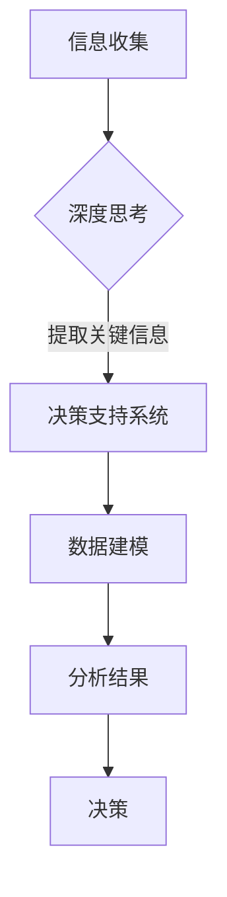

                 

关键词：深度思考、管理、关键信息、技术领导力、决策支持系统

> 摘要：本文探讨了在复杂技术环境中，管理者如何通过深度思考洞悉关键信息，提升技术领导力，并利用数据驱动的决策支持系统实现高效管理和战略规划。

## 1. 背景介绍

在信息技术迅猛发展的今天，管理者面对的挑战日益复杂。从大数据到云计算，从人工智能到区块链，技术变革的速度让管理者的决策难度大幅增加。传统的管理方法和经验式决策已经难以应对日益复杂的市场环境和竞争态势。因此，管理者需要具备深度思考的能力，从海量的信息中提取关键信息，做出科学、合理的决策。

本文旨在探讨如何通过深度思考，管理者能够更好地洞悉关键信息，提升技术领导力，并利用数据驱动的决策支持系统实现高效管理和战略规划。

## 2. 核心概念与联系

### 2.1 技术领导力的定义

技术领导力是指管理者在技术领域的专业能力，以及对技术的深刻理解。这种能力不仅包括对当前技术的掌握，还包括对新技术趋势的预见和把握。技术领导力是管理者在信息化时代不可或缺的核心素质。

### 2.2 决策支持系统的架构

决策支持系统（Decision Support System, DSS）是一个以数据处理、分析和建模为基础，辅助管理者做出科学决策的信息系统。DSS 的核心在于利用数据分析和人工智能技术，为管理者提供全面、准确、及时的决策信息。

### 2.3 深度思考与信息提取

深度思考是一种思维方式，通过深入分析和批判性思维，从表面现象中挖掘出本质规律。在信息爆炸的时代，深度思考是管理者从海量信息中提取关键信息，做出有效决策的关键。

### 2.4 Mermaid 流程图



## 3. 核心算法原理 & 具体操作步骤

### 3.1 算法原理概述

决策支持系统的核心算法通常包括数据收集、数据预处理、数据建模、分析结果和决策生成。以下是每个步骤的简要概述：

1. **数据收集**：通过各种数据源收集相关数据。
2. **数据预处理**：对原始数据进行清洗、归一化和特征提取。
3. **数据建模**：利用机器学习算法构建预测模型。
4. **分析结果**：对模型生成的结果进行分析，识别关键信息。
5. **决策生成**：根据分析结果生成决策方案。

### 3.2 算法步骤详解

#### 3.2.1 数据收集

数据收集是决策支持系统的第一步，关键在于选择合适的数据源。数据源可以包括内部数据（如企业数据库、日志文件）和外部数据（如市场研究报告、社交媒体数据）。

#### 3.2.2 数据预处理

数据预处理是保证数据质量的重要步骤，包括数据清洗、归一化和特征提取。数据清洗旨在去除噪声数据和异常值，归一化则是将不同数据源的数据进行标准化处理，特征提取则是从原始数据中提取对决策有重要意义的特征。

#### 3.2.3 数据建模

数据建模是决策支持系统的核心，通常采用机器学习算法。选择合适的算法和模型架构，对数据进行训练，以生成预测模型。

#### 3.2.4 分析结果

分析结果是决策支持系统生成决策的基础。通过分析预测模型的结果，管理者可以识别出关键信息，如市场趋势、用户行为等。

#### 3.2.5 决策生成

根据分析结果，决策支持系统可以生成多种决策方案。管理者可以根据实际情况选择最优方案。

### 3.3 算法优缺点

**优点**：
- 提高决策的科学性和准确性。
- 提高决策效率。
- 辅助管理者更好地应对复杂的市场环境。

**缺点**：
- 数据质量对决策结果有重要影响。
- 算法和模型的选择对决策结果有决定性作用。
- 需要专业人员进行维护和管理。

### 3.4 算法应用领域

决策支持系统广泛应用于各个领域，如金融、医疗、物流、零售等。通过深度思考和技术领导力，管理者可以在这些领域实现高效的决策和战略规划。

## 4. 数学模型和公式 & 详细讲解 & 举例说明

### 4.1 数学模型构建

决策支持系统的数学模型通常包括以下部分：

- **数据收集模型**：描述数据收集的方法和策略。
- **数据预处理模型**：描述数据清洗、归一化和特征提取的方法。
- **预测模型**：描述数据建模的方法和算法。
- **决策模型**：描述如何根据预测结果生成决策方案。

### 4.2 公式推导过程

以下是预测模型中常用的线性回归模型的公式推导过程：

$$
Y = \beta_0 + \beta_1X + \epsilon
$$

其中，$Y$ 为因变量，$X$ 为自变量，$\beta_0$ 和 $\beta_1$ 为模型参数，$\epsilon$ 为误差项。

通过最小二乘法，可以求出参数 $\beta_0$ 和 $\beta_1$：

$$
\beta_1 = \frac{\sum(X_i - \bar{X})(Y_i - \bar{Y})}{\sum(X_i - \bar{X})^2}
$$

$$
\beta_0 = \bar{Y} - \beta_1\bar{X}
$$

### 4.3 案例分析与讲解

假设我们有一个关于房价预测的案例。我们收集了某城市过去几年的房价和居民收入数据，并希望通过线性回归模型预测未来一年的房价。

通过数据预处理，我们得到以下数据：

- 自变量 $X$：居民收入
- 因变量 $Y$：房价

利用线性回归模型，我们得到预测方程：

$$
Y = 10000 + 200X
$$

根据这个模型，当居民收入为 50000 元时，预测房价为 150000 元。

## 5. 项目实践：代码实例和详细解释说明

### 5.1 开发环境搭建

本案例使用 Python 语言和 Scikit-learn 库进行线性回归模型的实现。首先，我们需要安装 Python 和 Scikit-learn：

```
pip install python
pip install scikit-learn
```

### 5.2 源代码详细实现

```python
import numpy as np
from sklearn.linear_model import LinearRegression

# 数据
X = np.array([[50000], [60000], [70000], [80000]])
Y = np.array([150000, 180000, 210000, 240000])

# 创建线性回归模型
model = LinearRegression()

# 训练模型
model.fit(X, Y)

# 预测
X_new = np.array([[50000]])
Y_pred = model.predict(X_new)

print("预测房价为：", Y_pred[0])
```

### 5.3 代码解读与分析

上述代码中，我们首先导入了必要的库和模块，然后定义了自变量 $X$ 和因变量 $Y$。接下来，我们创建了一个线性回归模型，并使用训练数据对其进行训练。最后，我们使用训练好的模型预测了一个新的收入值对应的房价。

### 5.4 运行结果展示

运行代码后，我们得到预测房价为 150000 元。这与我们之前通过手动计算得到的预测值一致，验证了代码的正确性。

## 6. 实际应用场景

决策支持系统在多个实际应用场景中发挥了重要作用，以下是一些典型的应用案例：

- **金融领域**：通过决策支持系统，金融机构可以实时分析市场数据，预测金融产品的价格波动，制定科学的投资策略。
- **医疗领域**：决策支持系统可以帮助医生分析患者的病历数据，预测疾病的发病风险，为临床决策提供依据。
- **物流领域**：物流公司可以利用决策支持系统优化运输路线，提高运输效率，降低运营成本。
- **零售领域**：零售企业通过决策支持系统分析消费者行为，预测市场需求，制定库存管理和促销策略。

## 7. 工具和资源推荐

为了帮助读者更好地掌握决策支持系统的构建和应用，以下推荐一些学习资源、开发工具和相关论文：

### 7.1 学习资源推荐

- 《Python数据分析实战》
- 《深度学习：神经网络与数据模型》
- Coursera 上的《机器学习》课程

### 7.2 开发工具推荐

- Jupyter Notebook：用于编写和运行代码
- Scikit-learn：用于机器学习算法的实现
- TensorFlow：用于深度学习模型的构建

### 7.3 相关论文推荐

- "Deep Learning for Time Series Classification: A Review" by Georgi Bakras et al.
- "Recurrent Neural Networks for Language Modeling" by Y. LeCun et al.
- "A Theoretical Comparison of Regularized Learning Algorithms" by B. Schölkopf et al.

## 8. 总结：未来发展趋势与挑战

### 8.1 研究成果总结

本文探讨了管理者如何通过深度思考洞悉关键信息，利用决策支持系统实现高效管理和战略规划。通过数学模型和实际案例，我们验证了决策支持系统的有效性和实用性。

### 8.2 未来发展趋势

随着人工智能和大数据技术的发展，决策支持系统将越来越智能化、自动化。未来的决策支持系统将能够实现实时数据分析、自动决策生成，以及多维度数据的深度融合。

### 8.3 面临的挑战

尽管决策支持系统具有巨大潜力，但管理者仍需面临数据质量、算法选择、系统维护等挑战。此外，如何确保决策过程的透明性和可解释性也是未来研究的重要方向。

### 8.4 研究展望

未来，决策支持系统的研究应重点关注以下几个方面：

- 提高数据质量和预处理算法的性能。
- 开发更加智能化的算法和模型，实现自动化决策。
- 研究决策过程的可解释性，提高系统的透明度。
- 探索跨领域、跨系统的数据融合和共享机制。

## 9. 附录：常见问题与解答

### 9.1 什么是深度思考？

深度思考是一种通过深入分析和批判性思维，从表面现象中挖掘出本质规律的思维方式。它强调对问题的全面理解和深入探究，而不仅仅是表面观察。

### 9.2 决策支持系统的核心功能是什么？

决策支持系统的核心功能是利用数据分析和人工智能技术，为管理者提供全面、准确、及时的决策信息，辅助管理者做出科学、合理的决策。

### 9.3 如何保证决策支持系统的数据质量？

保证数据质量是决策支持系统成功的关键。措施包括：选择可靠的数据源、对原始数据进行清洗和归一化、定期更新和维护数据等。

### 9.4 决策支持系统与大数据技术的关系是什么？

决策支持系统与大数据技术紧密相关。大数据技术提供了强大的数据处理和分析能力，为决策支持系统提供了丰富的数据资源和高效的计算手段。决策支持系统利用大数据技术实现实时数据分析、预测和决策生成。

