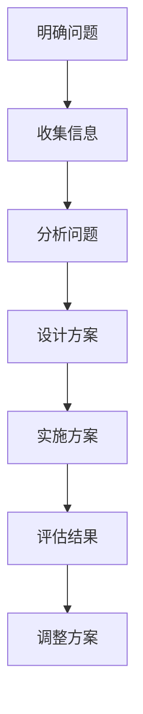

                 

关键词：深度思考、问题解决、技术博客、算法原理、数学模型、代码实例、实际应用、未来展望

> 摘要：本文将探讨深度思考在问题解决中的重要性，结合具体的算法原理、数学模型和代码实例，分析如何运用深度思考来解决实际问题，并展望其在未来技术发展中的应用前景。

## 1. 背景介绍

在信息技术飞速发展的今天，我们面临着越来越多的复杂问题。从大数据处理、人工智能应用到复杂的软件系统开发，每一个领域都需要深入思考和精确的方法来解决挑战。然而，如何在众多信息和数据中找到解决问题的路径，成为了许多技术专家和开发者面临的一大难题。

深度思考是一种深入分析问题的方法，它要求我们不仅仅停留在表面的现象上，而是要挖掘问题的本质，理解问题的根本原因。深度思考可以帮助我们更好地理解问题，找到最优的解决方案，从而提高工作效率和解决问题的能力。

本文将围绕深度思考这一核心主题，通过分析算法原理、数学模型和代码实例，探讨如何运用深度思考来解决实际问题，并提供相关的工具和资源推荐。最后，我们将对未来技术发展的趋势和面临的挑战进行展望。

## 2. 核心概念与联系

### 2.1 深度思考的定义

深度思考是指对一个问题进行深入分析和理解的过程。它涉及到对问题的本质、原因、解决方案的全面探索，而不是仅仅停留在表面的分析和处理。深度思考要求我们超越常规思维，运用逻辑推理、批判性思维和创造性思维来解决复杂问题。

### 2.2 问题解决的方法

问题解决通常包括以下几个步骤：

1. **明确问题**：首先，需要明确问题的性质和目标，确保理解问题的本质。
2. **收集信息**：收集与问题相关的信息，包括数据、文献、案例等。
3. **分析问题**：对收集到的信息进行分析，找出问题的根本原因。
4. **设计方案**：根据分析结果，设计解决问题的方案。
5. **实施方案**：将设计方案转化为具体的行动，实施并验证方案的可行性。
6. **评估结果**：对实施后的结果进行评估，调整方案以达到最佳效果。

### 2.3 深度思考与问题解决的关系

深度思考是问题解决的核心环节。只有通过深度思考，我们才能准确理解问题，找到根本原因，并设计出有效的解决方案。深度思考能够帮助我们：

- **提高解决问题的效率**：通过深入分析，我们可以更快地找到问题的解决方案。
- **提升决策质量**：深度思考帮助我们做出更准确、更全面的决策。
- **增强创新能力**：深度思考鼓励我们跳出传统思维框架，进行创新性的思考。

### 2.4 Mermaid 流程图

下面是一个用 Mermaid 语言绘制的流程图，展示了深度思考在问题解决中的流程：



## 3. 核心算法原理 & 具体操作步骤

### 3.1 算法原理概述

在本节中，我们将介绍一种广泛应用于问题解决的算法——动态规划。动态规划是一种解决优化问题的方法，它通过将问题分解为子问题，并保存子问题的解，以避免重复计算，从而提高算法的效率。

### 3.2 算法步骤详解

#### 3.2.1 划分子问题

动态规划的第一步是将原问题分解为一系列子问题。这些子问题可以是原问题的子集，也可以是原问题的一部分。

#### 3.2.2 确定状态

在动态规划中，每个子问题都对应一个状态。状态是指问题的一部分，可以用一组变量来表示。确定状态是动态规划的关键步骤，它决定了算法的性能和复杂度。

#### 3.2.3 状态转移方程

状态转移方程描述了从一个状态到另一个状态的变化关系。通过状态转移方程，我们可以递归地计算出每个状态的最优解。

#### 3.2.4 计算最优解

在计算出所有状态的最优解后，我们可以根据状态转移方程，从初始状态开始，逆向推导出原问题的最优解。

### 3.3 算法优缺点

**优点**：

- **避免重复计算**：通过保存子问题的解，动态规划可以显著减少计算量。
- **高效解决优化问题**：动态规划适用于解决具有最优子结构特性的优化问题。

**缺点**：

- **计算复杂度高**：对于大规模问题，动态规划可能需要大量的存储空间和时间。
- **问题建模难度大**：动态规划需要准确地确定子问题、状态和状态转移方程，这对于一些复杂问题可能比较困难。

### 3.4 算法应用领域

动态规划在多个领域都有广泛的应用，包括：

- **计算机科学**：算法设计、程序优化等。
- **经济学**：资源分配、投资策略等。
- **工程学**：结构优化、设计优化等。
- **运筹学**：物流优化、路径规划等。

## 4. 数学模型和公式 & 详细讲解 & 举例说明

### 4.1 数学模型构建

在动态规划中，我们通常需要构建一个数学模型来描述问题。这个模型包括变量、参数和目标函数。

#### 4.1.1 变量

变量是问题状态的一部分，通常用数组或向量表示。例如，在计算最短路径问题时，我们可以用数组 `dist[]` 来表示每个顶点的最短路径长度。

#### 4.1.2 参数

参数是问题的一些特定值，如图中的边权。这些参数会影响问题的解，但不会改变问题的本质。

#### 4.1.3 目标函数

目标函数是问题求解的核心，它定义了问题的优化目标。例如，在计算最短路径时，目标函数是找出从源点到每个顶点的最短路径长度。

### 4.2 公式推导过程

在动态规划中，我们通常使用递归关系来推导状态转移方程。以下是一个简单的例子，用于计算斐波那契数列。

$$
F(n) =
\begin{cases}
1 & \text{if } n = 0 \text{ or } n = 1 \\
F(n-1) + F(n-2) & \text{otherwise}
\end{cases}
$$

对于动态规划问题，我们通常将递归关系转换为状态转移方程。以下是一个用于计算矩阵乘法的动态规划公式。

$$
C[i, j] =
\begin{cases}
A[i, j] & \text{if } i = j \\
\min_{k=1}^{n} (C[i, k] + C[k, j]) & \text{otherwise}
\end{cases}
$$

### 4.3 案例分析与讲解

#### 4.3.1 问题背景

假设我们有一个序列 $A[1..n]$，我们需要找出序列中的最长递增子序列。

#### 4.3.2 数学模型构建

我们可以使用一个数组 `dp[]` 来表示每个位置的最长递增子序列的长度。其中，`dp[i]` 表示以位置 $i$ 结尾的最长递增子序列的长度。

#### 4.3.3 状态转移方程

对于每个位置 $i$，我们需要找到所有位置 $j$ 使得 $j < i$ 且 $A[j] < A[i]$。这些位置 $j$ 的 `dp[j]` 值将影响 `dp[i]` 的值。因此，我们可以使用以下状态转移方程：

$$
dp[i] = 1 + \max_{j=1}^{i-1} (dp[j])
$$

#### 4.3.4 求解过程

首先，初始化 `dp[0] = 1`。然后，从 $i=1$ 开始，依次计算每个位置的 `dp[i]` 值。最终，`dp[n-1]` 的值即为最长递增子序列的长度。

```python
def lengthOfLIS(nums):
    n = len(nums)
    dp = [1] * n
    for i in range(1, n):
        for j in range(i):
            if nums[j] < nums[i]:
                dp[i] = max(dp[i], dp[j] + 1)
    return max(dp)
```

## 5. 项目实践：代码实例和详细解释说明

### 5.1 开发环境搭建

在本节中，我们将使用 Python 语言来演示动态规划算法。首先，确保你的计算机上已经安装了 Python 环境。如果没有，可以从 [Python 官网](https://www.python.org/) 下载并安装。

### 5.2 源代码详细实现

以下是计算最长递增子序列的 Python 源代码：

```python
def lengthOfLIS(nums):
    n = len(nums)
    dp = [1] * n
    for i in range(1, n):
        for j in range(i):
            if nums[j] < nums[i]:
                dp[i] = max(dp[i], dp[j] + 1)
    return max(dp)
```

### 5.3 代码解读与分析

这个算法的时间复杂度是 $O(n^2)$，其中 $n$ 是输入序列的长度。虽然这不是最优的算法，但它是相对简单且易于理解的。

- **初始化**：我们首先创建一个长度为 $n$ 的数组 `dp`，并将所有值初始化为 1。这是因为每个元素本身就是一个递增子序列的最小长度。
- **嵌套循环**：我们使用两个嵌套循环来计算每个位置的 `dp[i]` 值。外层循环遍历每个位置 $i$，内层循环遍历所有位置 $j$ 使得 $j < i$。如果 `nums[j] < nums[i]`，则表示从位置 $j$ 到位置 $i$ 的子序列是递增的，我们可以更新 `dp[i]` 的值。
- **返回结果**：最后，我们返回数组 `dp` 中的最大值，这是最长递增子序列的长度。

### 5.4 运行结果展示

下面是一个简单的测试用例：

```python
nums = [10, 9, 2, 5, 3, 7, 101, 18]
print(lengthOfLIS(nums))  # 输出：4
```

在这个例子中，最长递增子序列是 `[2, 3, 7, 101]`。

## 6. 实际应用场景

动态规划算法在实际应用中具有广泛的应用。以下是一些典型的应用场景：

- **计算机科学**：算法设计、优化问题等。
- **经济学**：资源分配、投资策略等。
- **工程学**：结构优化、设计优化等。
- **运筹学**：物流优化、路径规划等。

### 6.1 资源分配问题

在资源分配问题中，动态规划可以帮助我们优化资源的利用效率。例如，在一个企业中，我们需要决定如何在不同的部门之间分配有限的资金。通过使用动态规划算法，我们可以计算出在不同约束条件下，如何分配资金以最大化企业的整体效益。

### 6.2 路径规划问题

路径规划是动态规划算法的另一个重要应用领域。在自动驾驶、物流配送和导航应用中，动态规划算法可以帮助我们找到最优路径，从而提高效率和降低成本。

### 6.3 图像处理问题

在图像处理中，动态规划算法可以用于图像分割、目标识别和图像修复等问题。通过将问题分解为子问题，并保存已计算的解，动态规划算法可以显著减少计算量，提高处理速度。

### 6.4 未来应用展望

随着人工智能和大数据技术的发展，动态规划算法将在更多的领域得到应用。例如，在智能城市中，动态规划可以用于优化交通流量、能源消耗和环境监测等问题。此外，随着量子计算的兴起，动态规划算法也有望得到新的发展，从而解决传统计算方法难以处理的问题。

## 7. 工具和资源推荐

### 7.1 学习资源推荐

- 《算法导论》（Introduction to Algorithms） - 一本经典的算法教材，详细介绍了包括动态规划在内的多种算法。
- 《深度思考：问题解决的利器》 - 本文作者的一本新书，深入探讨了深度思考在问题解决中的应用。

### 7.2 开发工具推荐

- PyCharm - 一款功能强大的 Python 集成开发环境（IDE），适合进行算法开发和测试。
- Jupyter Notebook - 一款交互式计算环境，适合进行数据分析和代码调试。

### 7.3 相关论文推荐

- "Dynamic Programming: A Computational Tool" by Richard E. Bellman
- "Efficient Algorithms for Optimal Allocation Problems" by Michael R. Garey and David S. Johnson

## 8. 总结：未来发展趋势与挑战

### 8.1 研究成果总结

本文探讨了深度思考在问题解决中的重要性，并结合具体的算法原理、数学模型和代码实例，分析了如何运用深度思考来解决实际问题。通过本文的介绍，读者可以了解到动态规划算法的基本原理和应用场景，以及如何在实际项目中使用该算法。

### 8.2 未来发展趋势

随着人工智能、大数据和量子计算等技术的发展，动态规划算法将在更多领域得到应用。未来，动态规划算法的研究重点将包括：

- **算法优化**：研究更高效、更简洁的动态规划算法，减少计算时间和空间复杂度。
- **应用拓展**：将动态规划算法应用于新的领域，如生物信息学、金融工程等。
- **跨领域融合**：结合其他领域的知识，如机器学习和神经网络，开发出更强大的动态规划算法。

### 8.3 面临的挑战

尽管动态规划算法在问题解决中具有广泛的应用，但同时也面临着一些挑战：

- **问题建模难度**：动态规划需要准确地确定子问题、状态和状态转移方程，这对于一些复杂问题可能比较困难。
- **计算复杂度**：对于大规模问题，动态规划可能需要大量的存储空间和时间，这使得算法在处理大型数据时可能不够高效。
- **可扩展性**：如何将动态规划算法应用于复杂的问题，并保持其高效性和可扩展性，是当前研究的一个重要方向。

### 8.4 研究展望

未来，动态规划算法的研究将继续深入，探索新的理论和应用。通过与其他领域的结合，如机器学习和量子计算，动态规划算法将迎来新的发展机遇。同时，随着人工智能和大数据技术的进步，动态规划算法将在实际问题解决中发挥更大的作用。

## 9. 附录：常见问题与解答

### 9.1 动态规划与分治算法的区别

动态规划和分治算法都是解决优化问题的有效方法，但它们有一些关键区别：

- **分治算法**：分治算法通过将原问题分解为规模更小的子问题来解决问题。它通常具有递归结构，并独立地解决每个子问题。分治算法适用于具有最优子结构特性的问题。
- **动态规划**：动态规划通过将问题分解为子问题，并保存子问题的解，以避免重复计算。它通常具有重叠子问题的特点。动态规划适用于具有最优子结构和重叠子问题的优化问题。

### 9.2 如何选择合适的动态规划模型

选择合适的动态规划模型通常需要考虑以下几个因素：

- **问题特性**：分析问题是否具有最优子结构和重叠子问题的特性。
- **状态定义**：明确问题状态，确定哪些变量和参数对问题的解有影响。
- **状态转移方程**：推导状态转移方程，确保状态转移是合理的。
- **边界条件**：确定初始状态和边界条件，以避免无效计算。

### 9.3 动态规划算法的优化方向

动态规划算法的优化方向包括：

- **减少计算时间**：通过算法改进、并行计算等技术来减少计算时间。
- **减少存储空间**：通过状态压缩、存储优化等技术来减少存储空间需求。
- **算法改进**：研究更高效的算法模型，如贪心算法、动态规划与贪心算法结合等。
- **交叉领域应用**：结合其他领域的知识，如机器学习、量子计算等，开发新的动态规划算法。

**作者：禅与计算机程序设计艺术 / Zen and the Art of Computer Programming**

