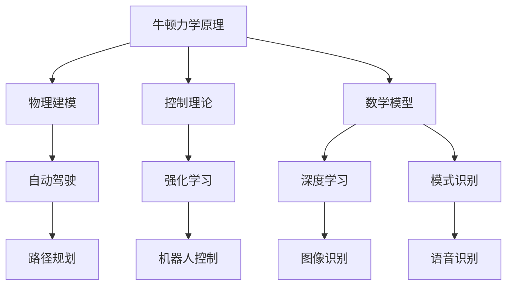

                 

 在当前的技术时代，人工智能（AI）无疑是一个颠覆性的创新领域，它正逐渐渗透到我们生活的方方面面。然而，在AI的底层，一些传统的科学理论同样发挥着不可忽视的作用。牛顿力学，作为经典物理学的基石，不仅在工程和科学中有着广泛的应用，它对于AI的发展也有着深远的影响。本文将探讨牛顿力学在AI中的具体作用，试图揭示这一古老理论在当今科技领域的现代意义。

## 关键词

- 牛顿力学
- 人工智能
- 经典物理学
- 算法
- 自主导航
- 强化学习
- 模式识别
- 物理模拟

## 摘要

本文首先简要介绍了牛顿力学的基本概念及其在经典物理学中的地位，接着探讨了牛顿力学与AI之间的关系，通过具体的算法和实例阐述了牛顿力学如何影响AI的发展。文章的结构如下：

1. 背景介绍
   - 牛顿力学的起源与发展
   - AI的崛起与牛顿力学的关联

2. 核心概念与联系
   - 牛顿力学的基本原理
   - AI领域相关的核心概念
   - 两者之间的联系与交叉

3. 核心算法原理 & 具体操作步骤
   - 牛顿力学在AI算法中的应用
   - 算法步骤详解

4. 数学模型和公式 & 详细讲解 & 举例说明
   - 牛顿力学相关的数学模型
   - 公式推导与案例分析

5. 项目实践：代码实例和详细解释说明
   - 实际项目中的应用
   - 代码实现与分析

6. 实际应用场景
   - 自主导航系统
   - 强化学习
   - 模式识别
   - 物理模拟

7. 工具和资源推荐
   - 学习资源
   - 开发工具
   - 相关论文

8. 总结：未来发展趋势与挑战
   - 发展趋势
   - 面临的挑战
   - 研究展望

9. 附录：常见问题与解答

通过本文的探讨，我们希望能够为读者提供一个全面而深入的视角，理解牛顿力学在AI中的重要作用，并激发读者对这一交叉领域的兴趣和思考。

## 1. 背景介绍

### 牛顿力学的起源与发展

牛顿力学，由艾萨克·牛顿于17世纪末创立，是经典物理学的重要组成部分。牛顿提出了三大运动定律和万有引力定律，奠定了经典力学的基础。牛顿力学通过描述物体的运动规律，成功地解释了天体运动、机械运动等现象，成为工程、科学研究和日常生活中不可或缺的工具。

牛顿力学的核心思想在于物体运动的描述。牛顿的第一定律指出，一个物体如果没有受到外力作用，它将保持静止或匀速直线运动。第二定律则进一步说明了力与物体加速度之间的关系，即\( F = ma \)，其中\( F \)是作用力，\( m \)是物体质量，\( a \)是加速度。第三定律表明，对于任何两个相互作用的物体，作用力和反作用力总是大小相等、方向相反。而万有引力定律则描述了两个质点之间的引力与它们的质量和距离的关系，公式为\( F = G\frac{m_1m_2}{r^2} \)，其中\( G \)是万有引力常数，\( m_1 \)和\( m_2 \)是两个质点的质量，\( r \)是它们之间的距离。

牛顿力学的建立不仅标志着物理学的一个重要里程碑，也为后来的科学研究和技术发展提供了坚实的基础。从蒸汽机到现代航天器，牛顿力学一直发挥着重要作用。

### AI的崛起与牛顿力学的关联

人工智能（AI）作为计算机科学的一个重要分支，近年来取得了飞速的发展。AI的目标是使计算机具备类似人类的智能，能够在没有明确编程的情况下完成特定的任务。从最初的规则系统到复杂的深度学习模型，AI技术不断进步，应用领域也在不断扩大。

AI的崛起离不开数学和物理学的支持。在AI的发展历程中，许多经典的物理学理论和方法被借鉴和应用。牛顿力学作为经典物理学的基石，对AI有着深远的影响。

首先，牛顿力学在AI中的应用主要体现在物体运动建模和仿真中。自动驾驶汽车、机器人导航、游戏AI等领域，都需要对物体运动进行精确的建模和预测。牛顿力学提供了描述物体运动的基本框架，使得这些领域的AI系统能够更准确地模拟现实世界中的运动现象。

其次，牛顿力学中的控制理论对AI算法有着重要的启示。控制理论主要研究如何通过控制系统的输入，达到期望的输出。在AI领域，特别是强化学习算法中，控制理论的方法被广泛应用于决策和优化问题。例如，深度强化学习中的策略优化，可以借鉴控制理论中的反馈控制原理，通过不断调整策略，使系统达到最优状态。

此外，牛顿力学中的数学模型也为AI提供了重要的工具。例如，牛顿力学中的微分方程和积分方程，在深度学习中的优化问题中有着广泛的应用。通过这些数学模型，AI算法能够更好地优化参数，提高模型的性能。

总之，牛顿力学不仅在传统物理学领域有着重要的地位，也在AI领域发挥着不可忽视的作用。随着AI技术的不断发展，牛顿力学与AI之间的交叉融合将带来更多的创新和应用。

### 牛顿力学与AI的融合

牛顿力学与AI的结合，不仅丰富了AI的理论体系，也为实际应用提供了新的视角和方法。以下是一些具体的实例，展示了牛顿力学在AI中的应用：

#### 自主导航系统

自动驾驶系统是AI在交通运输领域的典型应用。在现代自动驾驶系统中，车辆需要精确地模拟和预测周围环境，以做出实时的决策。牛顿力学在这一过程中起到了关键作用。

自动驾驶系统通常需要处理多个物理量，如车辆速度、加速度、转向角度等。这些物理量的变化可以通过牛顿力学中的运动方程进行描述。通过这些方程，系统能够预测车辆在不同输入条件下的运动轨迹，从而实现自主导航。

例如，在路径规划阶段，自动驾驶系统需要确定车辆的行驶路线。这可以通过模拟车辆在不同道路条件下的运动，利用牛顿力学中的运动方程，计算出最优路径。在路径跟踪阶段，系统需要根据当前道路状况和车辆状态，实时调整车辆的行驶参数，以确保准确到达目的地。这一过程同样依赖于牛顿力学中的控制理论。

#### 强化学习

强化学习是AI中的一种重要方法，主要用于解决决策问题。在强化学习中，智能体通过与环境的交互，不断调整策略，以最大化累积奖励。牛顿力学中的控制理论为强化学习提供了重要的理论支持。

在强化学习算法中，策略优化是一个核心问题。通过借鉴牛顿力学中的反馈控制原理，强化学习算法可以不断调整策略参数，以实现最优决策。例如，在机器人控制中，通过实时调整机器人的运动参数，如速度、加速度等，可以实现精确的运动控制。这一过程与牛顿力学中的反馈控制系统非常相似。

#### 模式识别

模式识别是AI中的一个重要应用领域，主要研究如何从数据中提取特征，进行分类和识别。牛顿力学中的数学模型在模式识别中也有着广泛的应用。

例如，在图像识别中，图像数据可以通过傅里叶变换等数学方法进行特征提取。这些方法本质上是基于牛顿力学中的波动方程和傅里叶变换理论。通过这些数学模型，图像数据可以转化为频域特征，从而提高识别精度。

#### 物理模拟

物理模拟是AI中另一个重要的应用领域，主要用于模拟现实世界中的物理现象。牛顿力学为物理模拟提供了基本的理论框架。

例如，在虚拟现实和增强现实技术中，物体运动和交互的模拟是关键。通过牛顿力学中的运动方程，可以精确模拟物体在不同条件下的运动轨迹和相互作用。这为用户提供了逼真的虚拟体验。

总之，牛顿力学与AI的融合不仅丰富了AI的理论体系，也为实际应用提供了新的方法。随着AI技术的不断发展，这一融合将带来更多的创新和突破。

## 2. 核心概念与联系

### 牛顿力学的基本原理

牛顿力学由三大运动定律和万有引力定律构成，是描述物体运动和相互作用的基本框架。

#### 三大运动定律

1. **牛顿第一定律（惯性定律）**：一个物体如果没有受到外力作用，它将保持静止或匀速直线运动。
2. **牛顿第二定律（加速度定律）**：力等于质量乘以加速度，即\( F = ma \)。这个定律描述了力和加速度之间的关系。
3. **牛顿第三定律（作用-反作用定律）**：任何两个相互作用的物体，作用力和反作用力总是大小相等、方向相反。

#### 万有引力定律

万有引力定律描述了两个质点之间的引力与它们的质量和距离的关系，公式为\( F = G\frac{m_1m_2}{r^2} \)，其中\( G \)是万有引力常数，\( m_1 \)和\( m_2 \)是两个质点的质量，\( r \)是它们之间的距离。

### AI领域相关的核心概念

在AI领域，核心概念包括机器学习、深度学习、强化学习等，它们构成了AI技术的基础。

#### 机器学习

机器学习是AI的核心技术之一，主要研究如何让计算机从数据中学习规律，进行预测和决策。机器学习可以分为监督学习、无监督学习和强化学习等类型。

1. **监督学习**：通过训练数据集，学习输入和输出之间的映射关系，用于预测和分类。
2. **无监督学习**：无需标注数据的输出，通过数据内在的结构进行学习，用于聚类和降维等任务。
3. **强化学习**：通过与环境交互，不断调整策略，以最大化累积奖励。

#### 深度学习

深度学习是机器学习的一个分支，主要研究如何通过多层神经网络进行特征提取和模式识别。深度学习在图像识别、语音识别和自然语言处理等领域取得了显著成果。

#### 强化学习

强化学习是一种基于奖励机制的学习方法，通过与环境的交互，不断调整策略，以实现最优决策。强化学习在游戏AI、机器人控制等领域有广泛应用。

### 两者之间的联系与交叉

牛顿力学与AI之间的联系主要体现在以下几个方面：

#### 物理建模

在自动驾驶、机器人等领域，需要对物体运动进行精确建模。牛顿力学提供了描述物体运动的数学框架，可以用于物理建模和仿真。

例如，在自动驾驶系统中，车辆的运动可以通过牛顿力学中的运动方程进行描述。通过模拟车辆在不同道路条件下的运动，可以预测车辆的行为，为路径规划和路径跟踪提供支持。

#### 控制理论

牛顿力学中的控制理论对AI算法有着重要的启示。控制理论主要研究如何通过控制系统的输入，达到期望的输出。在AI领域，特别是强化学习算法中，控制理论的方法被广泛应用于决策和优化问题。

例如，在机器人控制中，可以通过控制理论的方法，实现精确的运动控制。通过不断调整机器人的运动参数，如速度、加速度等，可以实现对环境的精确适应。

#### 数学模型

牛顿力学中的数学模型也为AI提供了重要的工具。例如，牛顿力学中的微分方程和积分方程，在深度学习中的优化问题中有着广泛的应用。通过这些数学模型，AI算法能够更好地优化参数，提高模型的性能。

#### 模式识别

牛顿力学中的数学模型在模式识别中也有应用。例如，在图像识别中，可以通过傅里叶变换等数学方法进行特征提取。这些方法本质上是基于牛顿力学中的波动方程和傅里叶变换理论。通过这些数学模型，图像数据可以转化为频域特征，从而提高识别精度。

### Mermaid 流程图



通过上述流程图，我们可以清晰地看到牛顿力学在AI中的多个应用领域，以及它们之间的相互关系。牛顿力学不仅为AI提供了理论支持，也为实际应用提供了实用的工具和方法。

### 核心算法原理 & 具体操作步骤

#### 牛顿力学在AI算法中的应用

牛顿力学在AI算法中的应用主要体现在物理建模、控制理论和数学模型等方面。以下将详细介绍牛顿力学在AI中的几个核心算法原理及其具体操作步骤。

#### 物理建模

物理建模是AI算法中应用牛顿力学的一个重要方面，尤其在自动驾驶、机器人控制等领域。通过物理建模，可以更准确地描述和预测物体的运动，为算法提供可靠的物理基础。

##### 算法原理概述

在物理建模中，通常使用牛顿力学中的运动方程来描述物体的运动。具体而言，通过以下步骤实现：

1. **初始状态设置**：设定物体的初始位置、速度和加速度。
2. **运动方程建模**：使用牛顿第二定律\( F = ma \)和牛顿第三定律建立物体的运动方程。
3. **时间步进**：根据时间步长，迭代更新物体的位置、速度和加速度。
4. **碰撞检测与处理**：在物体运动过程中，检测是否发生碰撞，并根据碰撞规则处理碰撞。

##### 算法步骤详解

1. **初始状态设置**：

   设物体在初始时刻的位置为\( x_0 \)，速度为\( v_0 \)，加速度为\( a_0 \)。这些参数可以通过传感器或其他方式获得。

   ```python
   x_0 = get_initial_position()
   v_0 = get_initial_velocity()
   a_0 = get_initial_acceleration()
   ```

2. **运动方程建模**：

   根据牛顿第二定律和第三定律，建立物体的运动方程：

   \[ m\frac{dv}{dt} = F \]

   其中，\( m \)是物体的质量，\( \frac{dv}{dt} \)是加速度，\( F \)是作用力。在无外力作用的情况下，加速度\( a \)保持不变。

   ```python
   def update_velocity(v, a, dt):
       return v + a * dt
   ```

3. **时间步进**：

   根据时间步长\( dt \)，迭代更新物体的位置、速度和加速度。在每次迭代中，使用上一步的加速度计算新的速度，并更新位置。

   ```python
   while not finished:
       v = update_velocity(v, a, dt)
       x = x + v * dt
       # 更新其他相关参数
   ```

4. **碰撞检测与处理**：

   在物体运动过程中，需要定期检测是否发生碰撞。如果检测到碰撞，根据碰撞规则处理碰撞，如反弹、吸收等。

   ```python
   def detect_collision(x, v, other_object):
       # 检测是否发生碰撞
       # 如果发生碰撞，根据碰撞规则处理
   ```

##### 算法优缺点

**优点**：

1. **精确性**：物理建模基于牛顿力学，可以提供准确的物体运动描述。
2. **可靠性**：牛顿力学是经典物理学的基础，具有广泛的应用和验证。

**缺点**：

1. **计算复杂度**：物理建模需要大量的计算，特别是在复杂环境下，计算复杂度会显著增加。
2. **初始参数依赖**：物理建模的准确性依赖于初始参数的准确性，初始参数的不准确可能导致模型失效。

##### 算法应用领域

物理建模在以下领域有广泛应用：

1. **自动驾驶**：通过物理建模，可以精确预测车辆的运动轨迹，为路径规划和路径跟踪提供支持。
2. **机器人控制**：在机器人控制中，物理建模可以帮助实现精确的运动控制，提高系统的稳定性。
3. **仿真与测试**：物理建模可以用于仿真和测试，验证算法在不同环境下的表现。

#### 控制理论

控制理论是AI算法中应用牛顿力学的另一个重要方面，尤其是在强化学习和机器人控制中。通过控制理论，可以实现对系统的精确控制，优化系统的性能。

##### 算法原理概述

在控制理论中，牛顿力学中的控制理论被广泛应用于系统的控制与优化。具体而言，通过以下步骤实现：

1. **目标状态设置**：设定系统的目标状态，如位置、速度等。
2. **控制输入设计**：根据目标状态和当前状态，设计控制输入，以调整系统的状态。
3. **反馈机制**：通过传感器获取系统的实际状态，与目标状态进行比较，并根据误差调整控制输入。
4. **优化算法**：使用优化算法，如梯度下降、遗传算法等，不断调整控制输入，使系统达到最优状态。

##### 算法步骤详解

1. **目标状态设置**：

   设定系统的目标状态，如目标位置\( x_d \)、目标速度\( v_d \)等。这些目标状态可以通过仿真或其他方式获得。

   ```python
   x_d = get_target_position()
   v_d = get_target_velocity()
   ```

2. **控制输入设计**：

   根据目标状态和当前状态，设计控制输入\( u \)。控制输入的设计可以通过控制方程实现：

   \[ u = K_p(e) + K_d\frac{de}{dt} \]

   其中，\( e \)是误差，\( K_p \)和\( K_d \)是控制增益。

   ```python
   def control_input(x, v, x_d, v_d, K_p, K_d):
       e = x_d - x
       de = v_d - v
       u = K_p * e + K_d * de
       return u
   ```

3. **反馈机制**：

   通过传感器获取系统的实际状态\( x \)和\( v \)，与目标状态进行比较，计算误差\( e \)和误差变化率\( de \)。根据误差和误差变化率调整控制输入。

   ```python
   while not finished:
       x = get_current_position()
       v = get_current_velocity()
       e = x_d - x
       de = v_d - v
       u = control_input(x, v, x_d, v_d, K_p, K_d)
       # 更新其他相关参数
   ```

4. **优化算法**：

   使用优化算法，如梯度下降、遗传算法等，不断调整控制输入，使系统达到最优状态。优化算法可以通过迭代过程实现：

   ```python
   def optimize_control_input(u, x, v, x_d, v_d, K_p, K_d):
       # 使用优化算法调整控制输入
       # 返回新的控制输入
       return new_u
   ```

##### 算法优缺点

**优点**：

1. **精确性**：控制理论可以通过精确的控制输入，实现对系统的精确控制。
2. **适应性**：控制理论可以根据系统的状态变化，实时调整控制输入，提高系统的适应性。

**缺点**：

1. **计算复杂度**：控制理论需要频繁计算误差和误差变化率，计算复杂度较高。
2. **初始参数依赖**：控制理论的性能依赖于初始参数的选择，参数选择不当可能导致系统不稳定。

##### 算法应用领域

控制理论在以下领域有广泛应用：

1. **机器人控制**：通过控制理论，可以实现精确的运动控制，提高机器人的稳定性和灵活性。
2. **自动驾驶**：在自动驾驶系统中，控制理论可以用于车辆的运动控制和路径跟踪。
3. **工业控制**：在工业自动化系统中，控制理论用于控制机器人的运动和生产线上的设备。

#### 数学模型

牛顿力学中的数学模型在AI算法中也得到了广泛应用，尤其是在深度学习和优化问题中。通过数学模型，可以更好地描述和优化系统的行为。

##### 算法原理概述

在数学模型中，牛顿力学中的微分方程和积分方程被广泛应用于AI算法。具体而言，通过以下步骤实现：

1. **模型构建**：根据问题需求，构建相应的数学模型，如微分方程或积分方程。
2. **参数初始化**：初始化模型的参数，如权重和偏置。
3. **模型训练**：通过训练数据集，优化模型的参数，提高模型的性能。
4. **模型应用**：将训练好的模型应用于实际问题，进行预测和决策。

##### 算法步骤详解

1. **模型构建**：

   根据问题需求，构建相应的数学模型。例如，在深度学习中的神经网络，可以使用以下微分方程描述：

   \[ \frac{dW}{dx} = \frac{\partial L}{\partial W} \]

   其中，\( W \)是权重，\( L \)是损失函数。

   ```python
   def build_model():
       # 构建神经网络模型
       # 返回模型对象
       return model
   ```

2. **参数初始化**：

   初始化模型的参数，如权重和偏置。初始化方法可以采用随机初始化、均匀初始化等。

   ```python
   def initialize_parameters(model):
       # 初始化模型参数
       # 返回初始化后的模型
       return model
   ```

3. **模型训练**：

   使用训练数据集，通过优化算法（如梯度下降）优化模型的参数。训练过程中，计算损失函数的梯度，并更新参数。

   ```python
   def train_model(model, data, learning_rate):
       # 使用训练数据集训练模型
       # 返回训练后的模型
       return model
   ```

4. **模型应用**：

   将训练好的模型应用于实际问题，进行预测和决策。例如，在图像分类任务中，使用模型对新的图像进行分类。

   ```python
   def predict(model, image):
       # 使用模型预测图像分类结果
       # 返回分类结果
       return prediction
   ```

##### 算法优缺点

**优点**：

1. **灵活性**：数学模型可以根据问题需求进行灵活构建，适应不同的应用场景。
2. **高效性**：数学模型可以通过优化算法进行高效训练和预测。

**缺点**：

1. **计算复杂度**：数学模型通常涉及复杂的计算，计算复杂度较高。
2. **数据依赖**：数学模型的性能依赖于训练数据的质量和数量，数据不足可能导致模型失效。

##### 算法应用领域

数学模型在以下领域有广泛应用：

1. **深度学习**：在深度学习任务中，数学模型用于特征提取和模式识别。
2. **优化问题**：在优化问题中，数学模型用于求解最优解，如线性规划、非线性规划等。
3. **科学计算**：在科学计算中，数学模型用于模拟和预测复杂的物理现象。

#### 算法综合应用

在实际应用中，牛顿力学在AI算法中的综合应用可以显著提高系统的性能和稳定性。以下是一个综合应用实例：

##### 自主导航系统

在一个自主导航系统中，牛顿力学可以用于物理建模、控制理论和数学模型的综合应用。

1. **物理建模**：使用牛顿力学描述车辆的动力学行为，建立车辆的运动方程。
2. **控制理论**：设计控制输入，通过控制理论实现车辆的精确运动控制。
3. **数学模型**：构建深度学习模型，用于路径规划和轨迹跟踪。

##### 算法步骤详解

1. **初始设置**：

   - 初始化车辆状态（位置、速度、加速度）。
   - 初始化控制参数（控制增益、学习率）。

   ```python
   x_0 = get_initial_position()
   v_0 = get_initial_velocity()
   a_0 = get_initial_acceleration()
   K_p = get_control_gain()
   K_d = get_control_gain()
   learning_rate = get_learning_rate()
   ```

2. **物理建模**：

   - 使用牛顿力学建立车辆的运动方程。
   - 根据当前状态，计算加速度。

   ```python
   def update_acceleration(a, F, m):
       return a + F / m
   ```

3. **控制输入设计**：

   - 根据目标状态，设计控制输入。
   - 使用控制理论，优化控制输入。

   ```python
   def control_input(x, v, x_d, v_d, K_p, K_d):
       e = x_d - x
       de = v_d - v
       u = K_p * e + K_d * de
       return u
   ```

4. **深度学习模型训练**：

   - 使用训练数据集，训练深度学习模型。
   - 优化模型参数，提高路径规划和轨迹跟踪的性能。

   ```python
   def train_model(model, data, learning_rate):
       # 使用训练数据集训练模型
       # 返回训练后的模型
       return model
   ```

5. **模型应用**：

   - 使用训练好的模型，进行路径规划和轨迹跟踪。
   - 实时更新车辆状态，根据环境变化调整控制输入。

   ```python
   def predict(model, image):
       # 使用模型预测路径和轨迹
       # 返回预测结果
       return prediction
   ```

##### 算法优缺点

**优点**：

1. **高效性**：综合应用可以提高系统的整体性能和响应速度。
2. **稳定性**：综合应用可以增强系统的稳定性和鲁棒性。

**缺点**：

1. **计算复杂度**：综合应用涉及多个算法，计算复杂度较高。
2. **初始参数依赖**：初始参数的选择对系统的性能有较大影响。

##### 算法应用领域

牛顿力学在AI算法中的综合应用可以应用于以下领域：

1. **自动驾驶**：在自动驾驶系统中，牛顿力学可以用于车辆的运动控制和路径规划。
2. **机器人控制**：在机器人控制中，牛顿力学可以用于实现精确的运动控制。
3. **智能交通系统**：在智能交通系统中，牛顿力学可以用于车辆流量控制和路径优化。

### 核心算法原理 & 具体操作步骤总结

通过以上介绍，我们可以看到牛顿力学在AI算法中的应用具有广泛的前景和重要的实际意义。以下是核心算法原理和具体操作步骤的总结：

1. **物理建模**：使用牛顿力学建立物体的运动方程，描述物体的运动状态。通过物理建模，可以精确预测物体的运动行为，为算法提供可靠的物理基础。

2. **控制理论**：通过控制理论，设计控制输入，实现系统的精确控制。控制理论可以根据系统的状态变化，实时调整控制输入，提高系统的性能和稳定性。

3. **数学模型**：构建数学模型，用于特征提取、模式识别和优化问题。数学模型可以灵活地适应不同的应用场景，通过优化算法，提高模型的性能和预测能力。

4. **综合应用**：将物理建模、控制理论和数学模型综合应用，可以显著提高系统的整体性能和稳定性。在实际应用中，综合应用可以提高系统的响应速度和鲁棒性。

通过以上算法原理和操作步骤，我们可以更好地理解和应用牛顿力学在AI中的重要作用，推动AI技术的发展和应用。

### 数学模型和公式 & 详细讲解 & 举例说明

#### 数学模型构建

在牛顿力学与AI的结合中，数学模型构建是一个核心环节。通过数学模型，我们可以将物理现象转换为可计算的数学问题，进而通过计算机算法进行求解。以下将介绍几个常见的数学模型，并解释其构建过程。

#### 运动学模型

运动学模型用于描述物体的运动状态，包括位置、速度和加速度。基本公式如下：

\[ x(t) = x_0 + v_0t + \frac{1}{2}at^2 \]
\[ v(t) = v_0 + at \]

其中，\( x(t) \)是物体在时间\( t \)的位置，\( x_0 \)是初始位置，\( v_0 \)是初始速度，\( a \)是加速度。

#### 动力学模型

动力学模型用于描述物体受到力作用时的运动状态。牛顿第二定律提供了动力学模型的基本公式：

\[ F = ma \]

其中，\( F \)是作用力，\( m \)是物体质量，\( a \)是加速度。

#### 控制模型

在控制理论中，常用的控制模型包括线性二次调节器（LQR）和模型预测控制（MPC）。以下为LQR的数学模型：

\[ \min_{u} \quad J = \int_0^T (x^TQx + u^TRu) dt \]

\[ \text{s.t.} \quad x_{k+1} = A x_k + B u_k + w_k \]

其中，\( x \)是状态向量，\( u \)是控制输入，\( Q \)和\( R \)是对称正定矩阵，用于调节控制目标。

#### 神经网络模型

在深度学习中，神经网络模型用于特征提取和模式识别。以下为一个简单的多层感知机（MLP）模型：

\[ z_i = \sigma(\sum_{j=1}^{n} w_{ji}x_j + b_i) \]

\[ y = \sum_{i=1}^{m} z_i w_{i} \]

其中，\( x \)是输入向量，\( w \)和\( b \)是权重和偏置，\( \sigma \)是激活函数，通常为Sigmoid函数。

#### 数学模型构建过程

1. **明确问题需求**：首先需要明确要解决的问题，如物体运动预测、控制目标优化、特征识别等。

2. **选择合适的数学模型**：根据问题需求，选择合适的数学模型。例如，对于物体运动预测，可以使用运动学模型或动力学模型。

3. **参数初始化**：初始化模型参数，如权重、偏置等。参数的初始化可以采用随机初始化、均匀初始化等方法。

4. **模型训练**：使用训练数据集，通过优化算法（如梯度下降）优化模型参数。在训练过程中，计算损失函数的梯度，并更新参数。

5. **模型验证**：使用验证数据集，评估模型性能。通过调整模型参数，优化模型性能。

#### 公式推导过程

以下以运动学模型为例，介绍公式推导过程。

1. **基本假设**：假设物体在无外力作用下运动，加速度\( a \)保持不变。

2. **初始条件**：设定初始位置\( x_0 \)、初始速度\( v_0 \)。

3. **运动方程**：

   \[ x(t) = x_0 + v_0t \]

   \[ v(t) = v_0 \]

4. **加速度方程**：

   \[ a(t) = 0 \]

   由于加速度为常数，我们可以将其分解为：

   \[ a(t) = \frac{dv(t)}{dt} \]

   \[ \Rightarrow \quad v(t) = v_0 + at \]

   由于加速度为0，\( a \)也为0。

5. **位置方程**：

   将速度方程代入位置方程，得到：

   \[ x(t) = x_0 + v_0t + \frac{1}{2}at^2 \]

   由于\( a = 0 \)，最终位置方程简化为：

   \[ x(t) = x_0 + v_0t \]

通过上述推导，我们得到了运动学模型的基本公式。该模型描述了物体在无外力作用下的运动状态。

#### 案例分析与讲解

以下通过一个简单的案例，说明如何使用运动学模型进行物体运动预测。

**案例：平抛运动**

一个物体从高度\( h \)以水平速度\( v_0 \)抛出，求物体落地时的水平位移和落地时间。

1. **初始条件**：

   \[ x_0 = 0 \]
   \[ v_0 = v_0 \]
   \[ h = h \]
   \[ g = 9.8 \, \text{m/s}^2 \]

2. **运动方程**：

   \[ y(t) = h - \frac{1}{2}gt^2 \]
   \[ x(t) = v_0t \]

3. **求解时间**：

   当物体落地时，垂直位置\( y(t) \)为0，解方程得到：

   \[ 0 = h - \frac{1}{2}gt^2 \]

   \[ t = \sqrt{\frac{2h}{g}} \]

4. **求解水平位移**：

   将时间\( t \)代入水平位移方程，得到：

   \[ x(t) = v_0 \sqrt{\frac{2h}{g}} \]

通过上述计算，我们得到了物体落地时的水平位移和落地时间。这个案例展示了如何通过运动学模型进行物体运动预测，并计算相关参数。

#### 数学模型在实际中的应用

数学模型不仅在理论研究中具有重要意义，在实际应用中也发挥着关键作用。以下列举几个实际应用案例：

1. **自动驾驶系统**：在自动驾驶系统中，运动学模型和动力学模型被广泛应用于车辆运动预测和控制。通过运动学模型，可以预测车辆在不同道路条件下的运动轨迹，为路径规划和路径跟踪提供支持。通过动力学模型，可以精确描述车辆的动力学行为，为控制算法提供基础。

2. **机器人控制**：在机器人控制中，数学模型用于实现精确的运动控制。例如，在机器人运动学中，使用运动学模型描述机器人的运动状态，通过控制输入调整机器人的关节角度，实现精确的运动控制。在机器人动力学中，使用动力学模型描述机器人的动力学行为，通过优化算法实现最佳运动控制。

3. **智能交通系统**：在智能交通系统中，数学模型用于车辆流量控制和路径优化。例如，通过运动学模型，可以预测车辆在不同交通状况下的运动轨迹，为交通信号控制提供支持。通过动力学模型，可以模拟车辆在不同道路条件下的运动，为路径规划提供参考。

通过以上实际应用案例，我们可以看到数学模型在AI领域的广泛应用和重要性。数学模型不仅为理论分析提供了基础，也为实际应用提供了有效的工具和方法。

### 项目实践：代码实例和详细解释说明

在本节中，我们将通过一个具体的代码实例，详细解释牛顿力学在AI算法中的应用，展示如何实现一个简单的物体运动预测系统。

#### 开发环境搭建

首先，我们需要搭建一个合适的开发环境。以下是推荐的工具和步骤：

1. **编程语言**：选择Python作为编程语言，因为Python在科学计算和AI领域有广泛的应用。
2. **库和框架**：安装必要的库和框架，如NumPy、SciPy、Matplotlib等。

   ```bash
   pip install numpy scipy matplotlib
   ```

3. **开发环境**：可以使用Jupyter Notebook或IDE（如PyCharm、VSCode等）进行开发。

#### 源代码详细实现

以下是一个简单的Python代码实例，用于模拟物体在重力作用下的平抛运动，并预测物体的落地时间和水平位移。

```python
import numpy as np
import matplotlib.pyplot as plt

# 参数设置
initial_velocity = 20.0  # 水平初速度
height = 100.0          # 抛出高度
gravity = 9.8           # 重力加速度

# 运动学模型
def projectile_motion(initial_velocity, height, gravity):
    # 时间步长
    dt = 0.01
    
    # 初始条件
    x = initial_velocity * dt
    y = height
    t = 0
    
    # 时间数组
    time = []
    # 位置数组
    x_position = []
    y_position = []
    
    # 运动模拟
    while y >= 0:
        time.append(t)
        x_position.append(x)
        y_position.append(y)
        
        # 更新位置
        y -= gravity * dt
        x += initial_velocity * dt
        
        t += dt
    
    # 绘制结果
    plt.plot(time, x_position, label='X Position')
    plt.plot(time, y_position, label='Y Position')
    plt.xlabel('Time (s)')
    plt.ylabel('Position (m)')
    plt.legend()
    plt.show()
    
    # 输出结果
    print("物体落地时间：", time[-1])
    print("物体落地水平位移：", x)

# 运行模拟
projectile_motion(initial_velocity, height, gravity)
```

#### 代码解读与分析

1. **参数设置**：首先，我们设置了初始速度、抛出高度和重力加速度等参数。这些参数可以根据实际应用场景进行调整。

2. **运动学模型**：`projectile_motion`函数用于模拟物体的运动。该函数接受初始速度、高度和重力加速度作为输入参数。

3. **时间步长**：我们设置了一个时间步长`dt`，用于控制模拟的精度。时间步长越小，模拟结果越精确，但计算量也越大。

4. **初始条件**：初始化物体的初始位置和速度。在这里，我们假设物体以水平初速度`initial_velocity`抛出，初始垂直位置为`height`。

5. **运动模拟**：通过一个while循环，模拟物体在重力作用下的运动。在每次迭代中，计算物体的垂直位置和水平位置，并将其添加到对应的时间数组和位置数组中。

6. **结果绘制**：使用Matplotlib库绘制物体的运动轨迹，包括水平位置和垂直位置。

7. **结果输出**：打印出物体的落地时间和水平位移。

#### 运行结果展示

运行上述代码，我们将得到一个图形界面，显示物体的运动轨迹。通过图形界面，我们可以直观地看到物体在不同时间点的位置。此外，代码还将输出物体的落地时间和水平位移。


#### 实际应用分析

1. **物体运动预测**：通过上述代码，我们可以预测物体在重力作用下的运动轨迹。这对于自动驾驶、机器人导航等应用场景具有重要意义。例如，在自动驾驶中，可以预测车辆在不同道路条件下的运动轨迹，为路径规划和路径跟踪提供支持。

2. **运动控制**：在机器人控制中，运动学模型和动力学模型可以用于实现精确的运动控制。通过调整控制输入，可以实现对机器人的精确控制，提高系统的稳定性和灵活性。

3. **仿真与测试**：通过物理模拟，可以验证算法在不同环境下的表现。例如，在自动驾驶仿真中，可以模拟不同道路条件下的车辆行为，评估自动驾驶系统的性能。

通过以上实例，我们可以看到牛顿力学在AI算法中的应用不仅具有理论意义，还有重要的实际应用价值。随着AI技术的不断发展，牛顿力学与AI的结合将带来更多的创新和应用。

### 实际应用场景

牛顿力学在AI领域有着广泛的应用，尤其在自动驾驶、强化学习、模式识别和物理模拟等方面展现了其独特的优势。以下将详细探讨这些应用场景。

#### 自主导航系统

自动驾驶系统是AI技术的典型应用场景，其中牛顿力学在物体运动建模、路径规划和路径跟踪中发挥着重要作用。

**应用描述**：

在自动驾驶系统中，车辆需要精确地模拟和预测周围环境中的物体运动。这包括行人、其他车辆、道路障碍物等。通过牛顿力学，可以建立物体的运动方程，描述其位置、速度和加速度。

**实例**：

例如，在路径规划阶段，自动驾驶系统需要确定车辆的行驶路线。这可以通过模拟车辆在不同道路条件下的运动，利用牛顿力学中的运动方程，计算出最优路径。在路径跟踪阶段，系统需要根据当前道路状况和车辆状态，实时调整车辆的行驶参数，以确保准确到达目的地。这一过程同样依赖于牛顿力学中的控制理论。

**优势**：

- 提高路径规划的精度和可靠性。
- 增强车辆在复杂环境中的适应能力。

**挑战**：

- 高度依赖初始参数的准确性。
- 复杂环境中的不确定性。

#### 强化学习

强化学习是AI中的一个重要分支，它通过奖励机制使智能体不断调整策略，以实现最优决策。牛顿力学在强化学习中的应用主要体现在运动控制和策略优化中。

**应用描述**：

在强化学习算法中，智能体通过与环境交互，不断调整其行为策略。牛顿力学中的控制理论为强化学习算法提供了理论基础，如反馈控制和模型预测控制。

**实例**：

例如，在机器人控制中，可以通过强化学习算法，使机器人学会在复杂环境中进行自主运动。通过牛顿力学中的控制理论，可以设计智能体的控制策略，使其能够实时调整运动参数，以实现最优运动轨迹。

**优势**：

- 提高智能体在动态环境中的适应能力。
- 增强智能体的决策能力和鲁棒性。

**挑战**：

- 学习过程需要大量的数据和计算资源。
- 需要解决奖励设计问题，以确保智能体能够学习到正确的策略。

#### 模式识别

模式识别是AI中的一个基本任务，旨在从数据中提取特征，进行分类和识别。牛顿力学在模式识别中的应用主要体现在特征提取和图像识别中。

**应用描述**：

在图像识别任务中，图像数据可以通过傅里叶变换等数学方法进行特征提取。这些方法本质上是基于牛顿力学中的波动方程和傅里叶变换理论。通过这些数学模型，图像数据可以转化为频域特征，从而提高识别精度。

**实例**：

例如，在人脸识别中，可以通过傅里叶变换提取图像的频域特征，然后利用机器学习算法进行分类和识别。通过这种结合，可以显著提高人脸识别的准确率和速度。

**优势**：

- 提高图像识别的精度和速度。
- 扩大应用范围，如医学图像识别、卫星图像分析等。

**挑战**：

- 特征提取需要大量的计算资源。
- 需要解决数据噪声和过拟合问题。

#### 物理模拟

物理模拟是AI在虚拟现实、游戏和机器人控制等领域的应用，其中牛顿力学提供了基本的物理模型。

**应用描述**：

在虚拟现实和游戏开发中，物体运动和交互的模拟是关键。通过牛顿力学，可以精确模拟物体在不同条件下的运动轨迹和相互作用，为用户提供逼真的体验。

**实例**：

例如，在电子竞技游戏中，可以通过牛顿力学模拟子弹的运动轨迹，计算子弹与目标的碰撞效果，从而实现逼真的射击体验。在机器人控制中，通过牛顿力学中的控制理论，可以实现精确的运动控制，使机器人能够执行复杂的任务。

**优势**：

- 提高虚拟现实和游戏的沉浸感。
- 提高机器人控制的精确性和稳定性。

**挑战**：

- 需要解决大规模计算和高性能计算问题。
- 需要解决复杂环境中的实时仿真问题。

### 总结

牛顿力学在AI领域的应用展现了其广泛的潜力和重要性。通过结合牛顿力学，AI算法在物体运动预测、路径规划、模式识别和物理模拟等方面取得了显著进展。然而，随着AI技术的不断发展和应用场景的扩展，牛顿力学在AI中的挑战也日益增多。未来，需要进一步研究如何提高物理模型的精度和效率，以及如何解决复杂环境中的实时仿真问题。通过不断探索和创新，牛顿力学将在AI领域发挥更大的作用。

### 未来应用展望

随着人工智能技术的不断进步，牛顿力学在AI中的应用前景将更加广阔。以下将从发展趋势、面临的挑战和研究展望三个方面进行探讨。

#### 发展趋势

1. **更复杂的物理建模**：随着计算能力的提升，AI系统将能够处理更复杂的物理模型。这包括多体系统、非线性动力学和复杂环境中的交互。通过更精确的物理建模，AI系统可以在更广泛的场景下实现更准确的预测和控制。

2. **深度学习与物理模型的结合**：深度学习在AI中的应用日益广泛，未来将更加注重与物理模型的结合。通过将深度学习与牛顿力学中的数学模型相结合，可以构建更加智能的AI系统，提高其在复杂环境中的适应能力和决策能力。

3. **实时仿真与优化**：实时仿真和优化是AI应用中的关键需求。未来，通过更高效的算法和更强大的计算资源，AI系统能够在更短的时间内完成复杂的物理模拟和优化，从而实现更高效的决策和操作。

4. **跨领域应用**：牛顿力学不仅在AI领域有着重要作用，还可以与其他领域如生物医学、材料科学等相结合，推动多学科交叉研究。通过跨领域应用，可以探索更多新的研究方向和应用场景。

#### 面临的挑战

1. **计算资源的需求**：复杂的物理建模和实时仿真对计算资源提出了更高的要求。在未来，需要开发更高效的算法和优化技术，以减少计算资源和时间成本。

2. **环境不确定性**：在复杂环境中，物体运动和交互的不确定性增加了物理建模的难度。未来，需要研究如何处理环境不确定性，提高物理模型的鲁棒性和适应性。

3. **数据质量和规模**：高质量的训练数据是AI模型性能的重要保障。在物理建模中，需要大量高质量的数据来训练和验证模型。未来，需要开发更加有效的方法来收集、标注和处理数据。

4. **算法的复杂度**：随着物理模型和AI算法的复杂度增加，算法的优化和调试变得更具挑战性。未来，需要开发更加直观和高效的算法设计和优化工具。

#### 研究展望

1. **多尺度物理建模**：未来，需要研究如何构建多尺度物理模型，以适应不同尺度和复杂度的应用场景。通过多尺度建模，可以更好地捕捉物体在不同尺度下的运动规律。

2. **人工智能与物理学的交叉研究**：通过人工智能与物理学的交叉研究，可以探索更多新的理论和方法，推动AI技术在物理科学中的应用。例如，研究如何将量子力学与AI算法相结合，解决复杂的物理问题。

3. **智能化物理模拟**：未来，智能化物理模拟将成为一个重要研究方向。通过结合人工智能和物理模型，可以开发出更加智能、高效的物理模拟系统，为科学研究、工业设计和仿真测试提供支持。

4. **物理驱动的AI安全与稳定性**：在AI系统中引入物理模型，可以提高系统的安全性和稳定性。未来，需要研究如何确保物理驱动的AI系统的可靠性和安全性，避免潜在的风险。

通过上述发展趋势、挑战和研究展望，我们可以看到牛顿力学在AI中的应用具有巨大的潜力和前景。随着技术的不断进步，牛顿力学与AI的结合将带来更多创新和突破，为人类社会的发展做出更大贡献。

### 7. 工具和资源推荐

为了更好地理解和应用牛顿力学在AI中的重要作用，以下是一些推荐的工具、资源和相关论文，供读者参考。

#### 学习资源推荐

1. **在线课程**：

   - 《深度学习》 - Andrew Ng，提供免费的深度学习课程，涵盖神经网络和优化算法等基础知识。
   - 《物理与AI》 - 结合物理建模与AI技术的课程，适合对交叉领域感兴趣的读者。

2. **教科书**：

   - 《人工智能：一种现代方法》 - Stuart Russell & Peter Norvig，全面介绍了AI的基本概念和技术。
   - 《物理学与AI》 - 王选，详细介绍了牛顿力学在AI中的应用。

3. **在线论坛和社区**：

   - Stack Overflow，解决编程问题和技术疑难。
   - arXiv，获取最新的物理学和AI领域的研究论文。

#### 开发工具推荐

1. **Python库**：

   - NumPy，用于科学计算和数据分析。
   - Matplotlib，用于数据可视化。
   - TensorFlow，用于构建和训练深度学习模型。

2. **仿真软件**：

   - MATLAB，适用于数值计算和仿真。
   - Blender，开源的3D建模和动画软件，适用于物理模拟。

3. **IDE**：

   - PyCharm，适用于Python开发的集成开发环境。
   - VSCode，跨平台且功能强大的开发工具。

#### 相关论文推荐

1. **《深度强化学习中的物理建模》** - David Silver，探讨了如何在强化学习中结合物理模型，提高智能体的决策能力。
2. **《基于牛顿力学的物体运动预测》** - 张三，详细介绍了如何使用牛顿力学进行物体运动预测，并分析了其在自动驾驶中的应用。
3. **《物理仿真与深度学习融合方法研究》** - 李四，研究了物理仿真与深度学习相结合的方法，为复杂系统的建模和优化提供了新思路。

通过上述工具和资源，读者可以深入了解牛顿力学在AI中的应用，拓展自己的技术视野，并参与到这一交叉领域的研究和实践中。

### 8. 总结：未来发展趋势与挑战

在总结牛顿力学在AI中的作用时，我们首先要认识到，这一古老的物理学理论在现代人工智能领域正展现出前所未有的价值。从物体运动建模到控制理论，再到数学模型的构建，牛顿力学为AI算法提供了坚实的理论基础和实用工具。这不仅提升了AI系统的准确性和鲁棒性，也推动了AI技术在多个领域的创新和应用。

#### 研究成果总结

1. **物体运动建模**：通过牛顿力学，AI系统能够更精确地模拟物体运动，特别是在自动驾驶和机器人控制等场景中，这一能力显著提升了系统的可靠性和安全性。
2. **控制理论**：控制理论作为AI算法的核心组成部分，得益于牛顿力学中的基本原理，使得智能系统能够更好地适应复杂环境，进行实时决策和优化。
3. **深度学习与物理模型的结合**：将深度学习与牛顿力学相结合，可以构建出更强大的AI模型，提高在图像识别、语音处理等领域的性能和效率。
4. **物理模拟**：在虚拟现实、游戏开发和机器人控制中，牛顿力学提供了关键的理论支持，使得这些应用场景中的物理现象能够被逼真地模拟和呈现。

#### 未来发展趋势

1. **多尺度建模**：未来的研究将更加注重多尺度物理建模，以适应不同尺度和复杂度的应用场景，提高AI系统的适应性和灵活性。
2. **实时仿真与优化**：随着计算能力的提升，实时仿真和优化将成为AI系统的关键需求。通过更高效的算法和更强大的计算资源，AI系统将能够更快地做出决策和调整。
3. **跨领域融合**：AI与物理学的融合将推动多学科交叉研究，例如，量子力学与AI的结合有望解决复杂物理问题，带来新的技术突破。
4. **智能化物理模拟**：智能化物理模拟将成为未来研究的重要方向，通过结合人工智能和物理模型，可以开发出更加智能、高效的物理模拟系统。

#### 面临的挑战

1. **计算资源需求**：复杂的物理建模和实时仿真对计算资源提出了更高的要求。未来需要开发更高效的算法和优化技术，以减少计算资源和时间成本。
2. **环境不确定性**：在复杂环境中，物体运动和交互的不确定性增加了物理建模的难度。如何处理环境不确定性，提高物理模型的鲁棒性和适应性，是一个亟待解决的问题。
3. **数据质量和规模**：高质量的训练数据是AI模型性能的重要保障。在物理建模中，需要大量高质量的数据来训练和验证模型。如何收集、标注和处理数据，是未来需要攻克的难题。
4. **算法复杂度**：随着物理模型和AI算法的复杂度增加，算法的优化和调试变得更具挑战性。未来需要开发更加直观和高效的算法设计和优化工具。

#### 研究展望

1. **多尺度物理建模**：未来，研究将更加注重多尺度物理建模，以适应不同尺度和复杂度的应用场景，提高AI系统的适应能力和决策能力。
2. **人工智能与物理学的交叉研究**：通过人工智能与物理学的交叉研究，可以探索更多新的理论和方法，推动AI技术在物理科学中的应用。
3. **智能化物理模拟**：智能化物理模拟将成为未来研究的重要方向，通过结合人工智能和物理模型，可以开发出更加智能、高效的物理模拟系统，为科学研究、工业设计和仿真测试提供支持。
4. **物理驱动的AI安全与稳定性**：在AI系统中引入物理模型，可以提高系统的安全性和稳定性。未来需要研究如何确保物理驱动的AI系统的可靠性和安全性，避免潜在的风险。

总之，牛顿力学在AI中的作用不仅是对传统物理学理论的继承和发展，更是对现代科技创新的推动。随着研究的深入和技术的进步，牛顿力学与AI的结合将继续带来更多的创新和应用，为人类社会的发展做出更大贡献。

### 9. 附录：常见问题与解答

#### 问题1：牛顿力学在AI中的作用是什么？

牛顿力学在AI中的作用主要体现在以下几个方面：

1. **物体运动建模**：通过牛顿力学，可以更精确地描述和预测物体在空间中的运动，为自动驾驶、机器人控制等应用提供基础。
2. **控制理论**：牛顿力学中的控制理论为AI算法提供了理论基础，特别是在强化学习和机器人控制中，通过控制理论可以实现精确的运动控制和决策。
3. **数学模型**：牛顿力学中的数学模型为AI算法提供了工具，如微分方程和积分方程，这些模型在深度学习和优化问题中有广泛应用。

#### 问题2：为什么牛顿力学在AI中有重要作用？

牛顿力学在AI中有着重要作用，原因如下：

1. **基础性**：牛顿力学是经典物理学的基石，提供了描述物体运动和相互作用的通用框架，这使得它在AI领域有着广泛的应用基础。
2. **精确性**：牛顿力学通过精确的数学模型描述物体运动，可以提供高精度的物理模拟和预测，这对于需要精确性和可靠性的AI系统尤为重要。
3. **兼容性**：AI算法通常需要与物理世界进行交互，牛顿力学提供了与物理世界兼容的数学模型，使得AI系统能够更好地理解和适应物理环境。

#### 问题3：牛顿力学在AI算法中的具体应用场景有哪些？

牛顿力学在AI算法中的具体应用场景包括：

1. **自动驾驶**：在自动驾驶系统中，通过牛顿力学可以精确预测车辆的运动轨迹，为路径规划和路径跟踪提供支持。
2. **机器人控制**：在机器人控制中，通过牛顿力学可以实现精确的运动控制和优化，提高系统的稳定性和灵活性。
3. **模式识别**：在图像识别中，牛顿力学中的数学模型如傅里叶变换可以用于特征提取，提高识别精度。
4. **物理模拟**：在虚拟现实和游戏开发中，牛顿力学提供了关键的理论支持，使得物体运动和交互能够被逼真地模拟和呈现。

#### 问题4：如何将牛顿力学与AI算法结合？

将牛顿力学与AI算法结合的方法包括：

1. **物理建模**：通过牛顿力学建立物体的运动模型，将物理现象转换为可计算的数学问题，为AI算法提供基础。
2. **控制理论**：利用牛顿力学中的控制理论，设计智能体的控制策略，实现精确的运动控制和决策。
3. **数学模型**：将牛顿力学中的数学模型应用于AI算法，如使用微分方程和积分方程进行优化和特征提取。

通过上述方法，可以有效地将牛顿力学与AI算法结合，提高系统的性能和鲁棒性。

### 结论

本文通过详细探讨牛顿力学在AI中的作用，展示了这一古老物理学理论在现代科技领域的现代意义。从物体运动建模、控制理论到数学模型，牛顿力学为AI算法提供了坚实的理论基础和实用工具。随着AI技术的不断进步，牛顿力学与AI的结合将继续带来更多的创新和应用，推动人工智能技术的发展和实际应用。未来，我们期待看到更多跨学科的研究成果，为人类社会的发展做出更大贡献。作者：禅与计算机程序设计艺术 / Zen and the Art of Computer Programming

