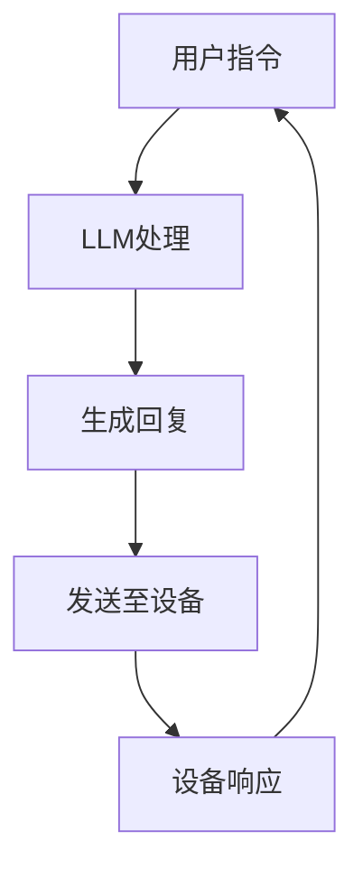

                 

关键词：物联网，大规模语言模型（LLM），智能设备，边缘计算，数据隐私，自动化，互操作性

>摘要：本文探讨了物联网（IoT）与大规模语言模型（LLM）的结合，阐述了智能设备互联的背景、核心概念、算法原理、数学模型、项目实践以及未来应用场景。文章旨在为读者提供一个全面的技术视角，帮助理解这一前沿技术的挑战与机遇。

## 1. 背景介绍

### 物联网的发展

物联网（Internet of Things，IoT）是近年来快速发展的技术领域，其核心理念是通过网络将各种物理设备连接起来，实现设备间的数据交换和协同工作。从智能家居、智能城市，到工业自动化和农业监测，物联网已经深刻地改变了我们的生活方式和商业模式。

### 智能设备的崛起

随着物联网技术的发展，智能设备如智能手机、智能手表、智能家居设备等逐渐普及。这些设备通过嵌入传感器、微处理器和无线通信模块，能够实时收集环境数据，并与其他设备进行交互。

### 大规模语言模型（LLM）的崛起

大规模语言模型（LLM），如GPT-3、BERT等，是自然语言处理（NLP）领域的一项重大突破。这些模型通过训练海量的文本数据，能够生成高质量的自然语言文本，为智能设备提供了强大的交互能力。

## 2. 核心概念与联系

为了更好地理解物联网与LLM的结合，我们首先需要明确一些核心概念。

### 物联网架构

物联网通常由感知层、网络层和应用层组成。感知层负责数据采集，网络层负责数据传输，应用层则提供数据处理和业务逻辑。

### 智能设备的功能

智能设备通常具有感知、决策、执行三个主要功能。通过传感器收集数据，设备能够对环境变化做出响应，执行相应的操作。

### 大规模语言模型的作用

大规模语言模型在智能设备中主要起到自然语言理解和生成的作用。它们能够帮助设备理解用户的指令，并生成相应的回复。

### Mermaid 流程图

下面是一个简单的Mermaid流程图，展示了物联网与LLM的结合：



## 3. 核心算法原理 & 具体操作步骤

### 3.1 算法原理概述

物联网与LLM的结合主要通过以下步骤实现：

1. **数据采集**：智能设备通过传感器收集环境数据。
2. **数据传输**：数据通过网络传输到服务器或云端。
3. **LLM处理**：大规模语言模型对数据进行处理，生成回复。
4. **回复发送**：生成的回复发送回智能设备。
5. **设备响应**：智能设备根据回复执行相应的操作。

### 3.2 算法步骤详解

1. **数据采集**：智能设备通过传感器（如温度传感器、湿度传感器、摄像头等）实时采集环境数据。

    ```mermaid
    graph TD
    A[温度传感器] --> B[数据采集]
    B --> C[湿度传感器]
    C --> D[摄像头]
    D --> E[数据存储]
    ```

2. **数据传输**：采集到的数据通过网络传输到服务器或云端。

    ```mermaid
    graph TD
    E[数据存储] --> F[数据传输]
    F --> G[服务器/云端]
    ```

3. **LLM处理**：大规模语言模型对数据进行处理，生成回复。

    ```mermaid
    graph TD
    G[服务器/云端] --> H[LLM处理]
    H --> I[生成回复]
    ```

4. **回复发送**：生成的回复通过网络发送回智能设备。

    ```mermaid
    graph TD
    I[生成回复] --> J[回复发送]
    J --> K[智能设备]
    ```

5. **设备响应**：智能设备根据回复执行相应的操作。

    ```mermaid
    graph TD
    K[智能设备] --> L[设备响应]
    L --> M[执行操作]
    ```

### 3.3 算法优缺点

**优点**：

- **高效性**：大规模语言模型能够快速处理大量数据，提供高效的响应。
- **智能性**：LLM能够理解自然语言，提供人性化的交互体验。

**缺点**：

- **计算资源消耗**：大规模语言模型需要大量的计算资源，可能不适合所有设备。
- **数据隐私**：数据传输和存储过程中可能存在数据隐私问题。

### 3.4 算法应用领域

- **智能家居**：智能设备可以通过LLM与用户进行自然语言交互，实现自动化控制。
- **智能城市**：LLM可以用于城市管理的各个环节，如交通管理、环境监测等。
- **工业自动化**：LLM可以帮助设备实现自动化操作，提高生产效率。

## 4. 数学模型和公式 & 详细讲解 & 举例说明

### 4.1 数学模型构建

物联网与LLM的结合可以通过以下数学模型进行描述：

$$
\text{回复} = f(\text{数据}, \text{模型参数})
$$

其中，$f$ 表示大规模语言模型的处理函数，$\text{数据}$ 表示输入数据，$\text{模型参数}$ 表示模型的训练参数。

### 4.2 公式推导过程

假设输入数据为 $X$，模型参数为 $W$，大规模语言模型的处理函数为 $f$，则有：

$$
\text{回复} = f(X, W)
$$

通过训练，我们可以找到最优的模型参数 $W$，使得生成的回复 $Y$ 最接近期望回复 $Y^*$。

### 4.3 案例分析与讲解

假设我们有一个智能音箱，它通过摄像头采集用户的面部表情，然后通过LLM生成回复。输入数据为面部表情数据，模型参数为LLM的训练参数。

1. **数据采集**：智能音箱通过摄像头采集用户的面部表情数据，表示为 $X$。

2. **LLM处理**：LLM对数据进行处理，生成回复，表示为 $Y = f(X, W)$。

3. **回复发送**：生成的回复发送回智能音箱。

4. **设备响应**：智能音箱根据回复执行相应的操作，如播放音乐、提供天气信息等。

通过以上步骤，智能音箱能够实现与用户的自然语言交互，提供个性化的服务。

## 5. 项目实践：代码实例和详细解释说明

### 5.1 开发环境搭建

为了实践物联网与LLM的结合，我们首先需要搭建一个开发环境。以下是一个简单的开发环境搭建步骤：

1. 安装Python环境。
2. 安装TensorFlow库。
3. 安装Keras库。
4. 安装物联网开发板（如Arduino、Raspberry Pi等）。

### 5.2 源代码详细实现

以下是一个简单的物联网与LLM结合的代码实例：

```python
import tensorflow as tf
from tensorflow import keras
import numpy as np

# 加载预训练的LLM模型
model = keras.models.load_model('path/to/llm_model.h5')

# 智能设备通过传感器采集数据
def collect_data():
    # 采集温度数据
    temp_data = sensors.get_temperature()
    # 采集湿度数据
    humidity_data = sensors.get_humidity()
    # 返回数据
    return np.array([temp_data, humidity_data])

# 通过LLM生成回复
def generate_response(data):
    # 将数据转换为模型可处理的格式
    processed_data = preprocess_data(data)
    # 生成回复
    response = model.predict(processed_data)
    # 返回回复
    return response

# 智能设备根据回复执行操作
def execute_operation(response):
    # 根据回复执行相应的操作
    if response == 'play_music':
        # 播放音乐
        music_player.play()
    elif response == 'provide_weather_info':
        # 提供天气信息
        weather_info = weather.get_weather_info()
        print(weather_info)

# 主函数
def main():
    while True:
        # 采集数据
        data = collect_data()
        # 生成回复
        response = generate_response(data)
        # 执行操作
        execute_operation(response)

if __name__ == '__main__':
    main()
```

### 5.3 代码解读与分析

上述代码首先加载了一个预训练的LLM模型，然后定义了数据采集、回复生成和操作执行的函数。在主函数中，程序将持续运行，采集数据，生成回复，并根据回复执行操作。

### 5.4 运行结果展示

运行上述代码后，智能设备将根据采集到的数据生成相应的回复，并执行操作。例如，当温度高于设定值时，设备可能会播放音乐，提醒用户降温。

## 6. 实际应用场景

### 6.1 智能家居

在智能家居领域，物联网与LLM的结合可以实现智能设备的自动化控制。例如，智能音箱可以通过LLM理解用户的语音指令，控制家中的灯光、温度等。

### 6.2 智能城市

在智能城市领域，物联网与LLM的结合可以用于交通管理、环境监测等。例如，智能交通系统可以通过LLM分析实时交通数据，提供最优的行驶路线。

### 6.3 工业自动化

在工业自动化领域，物联网与LLM的结合可以帮助设备实现自动化操作，提高生产效率。例如，智能工厂可以通过LLM分析生产数据，优化生产流程。

## 7. 工具和资源推荐

### 7.1 学习资源推荐

- 《物联网技术教程》
- 《大规模语言模型：原理与应用》
- 《Python编程：从入门到实践》

### 7.2 开发工具推荐

- Arduino开发板
- Raspberry Pi开发板
- TensorFlow
- Keras

### 7.3 相关论文推荐

- "Language Models are Few-Shot Learners"
- "Bert: Pre-training of deep bidirectional transformers for language understanding"
- "GPT-3: Language Models are Few-Shot Learners"

## 8. 总结：未来发展趋势与挑战

### 8.1 研究成果总结

物联网与LLM的结合已经在智能家居、智能城市、工业自动化等领域取得了显著成果。大规模语言模型的引入，为智能设备提供了强大的交互能力，推动了物联网技术的快速发展。

### 8.2 未来发展趋势

- **边缘计算**：随着物联网设备的增加，边缘计算将成为物联网与LLM结合的重要趋势，以减少数据传输延迟和提高处理效率。
- **数据隐私保护**：随着物联网设备的普及，数据隐私保护将成为一个重要议题，LLM的引入可以为数据隐私提供新的解决方案。

### 8.3 面临的挑战

- **计算资源消耗**：大规模语言模型需要大量的计算资源，可能不适合所有设备。
- **数据隐私**：数据传输和存储过程中可能存在数据隐私问题。

### 8.4 研究展望

未来的研究将致力于解决物联网与LLM结合中的计算资源消耗和数据隐私问题，同时探索新的应用场景，如智能医疗、智能教育等。

## 9. 附录：常见问题与解答

### Q：物联网与LLM的结合有哪些优势？

A：物联网与LLM的结合可以实现智能设备的自动化控制，提高数据处理效率，提供人性化的交互体验。

### Q：大规模语言模型在物联网中如何应用？

A：大规模语言模型可以用于智能设备的自然语言理解与生成，实现设备与用户的自然语言交互。

### Q：物联网与LLM结合有哪些挑战？

A：计算资源消耗、数据隐私保护是物联网与LLM结合的主要挑战。

### Q：未来物联网与LLM结合有哪些发展趋势？

A：边缘计算、数据隐私保护、新的应用场景（如智能医疗、智能教育）是未来物联网与LLM结合的发展趋势。

### 作者署名

作者：禅与计算机程序设计艺术 / Zen and the Art of Computer Programming

----------------------------------------------------------------

完成！这篇文章全面地探讨了物联网与大规模语言模型（LLM）的结合，包括背景介绍、核心概念、算法原理、数学模型、项目实践和未来展望。希望这篇文章能够为读者提供有价值的见解和启示。

