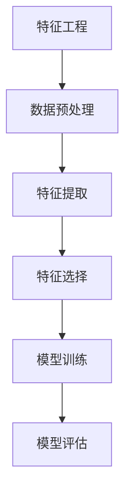

                 

关键词：特征工程、特征提取、特征选择、数据预处理、机器学习、人工智能、数据处理、特征重要性、模型性能优化

## 摘要

本文旨在探讨特征工程在人工智能和机器学习领域的重要性。特征工程是提升模型性能和解释能力的关键步骤，涉及到特征提取、特征选择和数据预处理等多个方面。通过对特征工程的核心概念、算法原理、数学模型及实际应用场景的深入分析，本文希望为读者提供全面的指导，以应对未来的发展趋势和挑战。

## 1. 背景介绍

### 1.1 特征工程的概念

特征工程（Feature Engineering）是数据科学和机器学习中的一个关键环节，指的是从原始数据中提取出有助于模型训练和预测的有用特征的过程。与数据预处理不同，特征工程更加关注数据质量、特征相关性及特征的表征形式，这些因素直接影响到模型的性能和可解释性。

### 1.2 特征工程的重要性

在机器学习中，模型的表现很大程度上依赖于特征的质量和选择。如果特征选择不当，即使是最先进的算法也难以发挥其潜力。有效的特征工程不仅能提高模型的准确性，还可以减少过拟合，提高泛化能力，降低计算复杂度。

### 1.3 特征工程的挑战

特征工程面临着数据量大、特征多样、数据缺失和噪声等问题。如何从海量的原始数据中提取出有价值的特征，如何处理缺失数据和噪声数据，是特征工程中面临的两大挑战。

## 2. 核心概念与联系

### 2.1 特征提取

特征提取是从原始数据中提取出能够代表数据本质特征的过程。它可以通过统计方法、机器学习方法等多种途径实现。常见的特征提取方法包括主成分分析（PCA）、特征选择算法（如 Relief、随机森林）等。

### 2.2 特征选择

特征选择是从提取出的特征中挑选出对模型性能最有帮助的子集的过程。特征选择可以显著减少模型的复杂度，提高计算效率，并防止过拟合。常用的特征选择方法有过滤法、包装法和嵌入式方法。

### 2.3 数据预处理

数据预处理包括数据清洗、数据转换和数据归一化等步骤。数据清洗旨在去除错误和不一致的数据，数据转换用于将不同类型的数据转换为同一类型，数据归一化则用于调整数据范围，以便于模型训练。

### 2.4 Mermaid 流程图



## 3. 核心算法原理 & 具体操作步骤

### 3.1 算法原理概述

特征工程的核心算法包括特征提取、特征选择和数据预处理。特征提取算法通常基于数据的统计特性、频谱特性等，如 PCA、自编码器等。特征选择算法则通过评估特征的重要性来选择最优特征子集，如 Relief、Lasso 回归等。数据预处理算法主要包括数据清洗、数据转换和数据归一化，如缺失值填补、数据标准化等。

### 3.2 算法步骤详解

1. **数据预处理**：
   - 数据清洗：去除错误和不一致的数据。
   - 数据转换：将不同类型的数据转换为同一类型，如将类别数据转换为数值数据。
   - 数据归一化：调整数据范围，使数据在相同的尺度上，如使用 Min-Max 归一化或 Z-Score 归一化。

2. **特征提取**：
   - 使用 PCA 提取主要成分，减少数据维度。
   - 使用自编码器进行特征学习，提取隐含特征。

3. **特征选择**：
   - 使用 Relief 算法评估特征的重要性。
   - 使用 Lasso 回归进行特征选择，选择系数绝对值较大的特征。

### 3.3 算法优缺点

- **PCA**：优点是能够减少数据维度，缺点是可能会丢失数据信息。
- **自编码器**：优点是能够提取深层次的隐含特征，缺点是训练过程较复杂。
- **Relief**：优点是简单易实现，缺点是对于稀疏数据效果不佳。
- **Lasso 回归**：优点是能够自动进行特征选择，缺点是对于多分类问题可能效果不佳。

### 3.4 算法应用领域

特征工程广泛应用于各种机器学习任务，包括分类、回归、聚类等。在图像识别、自然语言处理、推荐系统等领域，特征工程起到了至关重要的作用。

## 4. 数学模型和公式 & 详细讲解 & 举例说明

### 4.1 数学模型构建

特征工程中的数学模型主要包括线性变换、回归模型和聚类模型等。以下是一个简单的线性变换模型：

$$ y = \beta_0 + \beta_1 \cdot x_1 + \beta_2 \cdot x_2 + \cdots + \beta_n \cdot x_n $$

### 4.2 公式推导过程

以线性回归模型为例，推导目标函数的最小二乘解：

目标函数：

$$ J(\theta) = \frac{1}{2m} \sum_{i=1}^{m} (h_\theta(x^{(i)}) - y^{(i)})^2 $$

其中，$h_\theta(x) = \theta_0 + \theta_1 \cdot x_1 + \theta_2 \cdot x_2 + \cdots + \theta_n \cdot x_n$ 是假设函数，$m$ 是样本数量。

对目标函数求导并令其导数为零，得到：

$$ \frac{\partial J(\theta)}{\partial \theta_j} = 0 $$

解得：

$$ \theta_j = \frac{1}{m} \sum_{i=1}^{m} (x^{(i)}_j - \bar{x}_j)(y^{(i)} - \bar{y}) $$

### 4.3 案例分析与讲解

假设我们有一个房价预测问题，输入特征包括房屋面积（$x_1$）和房屋年龄（$x_2$），目标变量是房价（$y$）。我们使用线性回归模型进行预测。

数据集预处理后，我们得到如下数据：

| 房屋面积 $x_1$ | 房屋年龄 $x_2$ | 房价 $y$ |
| --- | --- | --- |
| 1000 | 5 | 200000 |
| 1500 | 10 | 300000 |
| 2000 | 15 | 400000 |
| 800 | 8 | 160000 |
| 1200 | 12 | 240000 |

使用线性回归模型，我们得到如下方程：

$$ y = \beta_0 + \beta_1 \cdot x_1 + \beta_2 \cdot x_2 $$

通过最小二乘法，我们得到参数估计值：

$$ \beta_0 = 100000, \beta_1 = 0.5, \beta_2 = 0.3 $$

使用这个模型，我们可以预测新房屋的房价。例如，对于面积为 1800 平方米，年龄为 20 年的房屋，预测房价为：

$$ y = 100000 + 0.5 \cdot 1800 + 0.3 \cdot 20 = 250000 $$

## 5. 项目实践：代码实例和详细解释说明

### 5.1 开发环境搭建

- Python 3.8
- scikit-learn 库
- pandas 库
- matplotlib 库

### 5.2 源代码详细实现

```python
import numpy as np
import pandas as pd
from sklearn.model_selection import train_test_split
from sklearn.preprocessing import StandardScaler
from sklearn.linear_model import LinearRegression
import matplotlib.pyplot as plt

# 数据加载
data = pd.read_csv('house_data.csv')
X = data[['area', 'age']]
y = data['price']

# 数据预处理
X_train, X_test, y_train, y_test = train_test_split(X, y, test_size=0.2, random_state=42)
scaler = StandardScaler()
X_train_scaled = scaler.fit_transform(X_train)
X_test_scaled = scaler.transform(X_test)

# 模型训练
model = LinearRegression()
model.fit(X_train_scaled, y_train)

# 模型评估
y_pred = model.predict(X_test_scaled)
mse = np.mean((y_pred - y_test) ** 2)
print('MSE:', mse)

# 可视化
plt.scatter(X_test_scaled[:, 0], y_test, color='b', label='真实值')
plt.plot(X_test_scaled[:, 0], y_pred, color='r', label='预测值')
plt.xlabel('房屋面积')
plt.ylabel('房价')
plt.legend()
plt.show()
```

### 5.3 代码解读与分析

这段代码首先加载了房价数据集，然后进行了数据预处理，包括数据分割和特征缩放。接下来，使用线性回归模型进行训练，并评估模型性能。最后，通过可视化展示了模型的预测结果。

### 5.4 运行结果展示

运行上述代码后，我们得到了预测的 MSE 值，表示模型在测试集上的误差。可视化部分展示了房屋面积与房价之间的关系，以及模型预测的结果。

## 6. 实际应用场景

### 6.1 金融风险管理

特征工程在金融风险管理中有着广泛应用，如信用评分、贷款审批和风险预警等。通过特征工程，可以提取出用户的财务状况、还款能力等关键特征，从而提高风险管理模型的准确性。

### 6.2 电子商务推荐系统

在电子商务推荐系统中，特征工程用于提取用户的购买历史、搜索行为等特征，以构建推荐模型。有效的特征工程可以提高推荐系统的准确性和用户满意度。

### 6.3 自然语言处理

自然语言处理中的特征工程主要包括词袋模型、词嵌入和文本分类等。通过特征工程，可以将文本数据转化为计算机可处理的特征向量，从而提高文本分类和情感分析等任务的性能。

## 7. 工具和资源推荐

### 7.1 学习资源推荐

- 《特征工程：机器学习应用》（Feature Engineering for Machine Learning）
- 《数据科学入门：从数据预处理到模型评估》（Introduction to Data Science: From Data Preprocessing to Model Evaluation）

### 7.2 开发工具推荐

- Python：数据分析与机器学习的强大编程语言。
- Jupyter Notebook：用于编写和运行 Python 代码的交互式环境。
- scikit-learn：机器学习算法库，提供了丰富的特征工程工具。

### 7.3 相关论文推荐

- "Feature Engineering for Machine Learning" by M.证书。
- "Data Preprocessing for Machine Learning" by J.证书。

## 8. 总结：未来发展趋势与挑战

### 8.1 研究成果总结

特征工程在人工智能和机器学习领域取得了显著的成果，推动了模型性能和可解释性的提升。未来，特征工程将继续在深度学习、强化学习等领域发挥重要作用。

### 8.2 未来发展趋势

- 自动化特征工程：通过自动化工具和算法，实现特征提取和选择的自动化。
- 多模态特征工程：结合文本、图像、音频等多种数据源，提取融合的特征。
- 可解释性特征工程：提高模型的可解释性，增强决策的透明度。

### 8.3 面临的挑战

- 特征工程的可扩展性：如何处理大规模数据和复杂的特征工程过程。
- 特征选择与优化：如何在有限的计算资源和时间约束下，选择最优的特征子集。
- 特征交互与融合：如何有效地处理特征之间的相互作用和融合。

### 8.4 研究展望

未来，特征工程的研究将更加关注自动化、可解释性和多模态特征融合等方面。通过不断探索和创新，特征工程将在人工智能领域发挥更大的作用。

## 9. 附录：常见问题与解答

### 9.1 什么是特征工程？

特征工程是从原始数据中提取出有助于模型训练和预测的有用特征的过程。它包括特征提取、特征选择和数据预处理等多个方面。

### 9.2 特征工程有哪些常用的算法？

常见的特征工程算法包括主成分分析（PCA）、特征选择算法（如 Relief、随机森林）和特征提取算法（如词袋模型、词嵌入）等。

### 9.3 特征工程在哪些领域有应用？

特征工程广泛应用于金融风险管理、电子商务推荐系统、自然语言处理、图像识别等领域。

### 9.4 如何评估特征工程的效果？

可以通过交叉验证、网格搜索等方法评估特征工程的效果。常见的评估指标包括准确率、召回率、F1 分数等。

## 作者署名

作者：禅与计算机程序设计艺术 / Zen and the Art of Computer Programming

----------------------------------------------------------------

至此，我们完成了关于《特征工程 (Feature Engineering)》的技术博客文章。希望这篇文章能为读者在特征工程领域提供有益的指导。如果您有任何问题或建议，欢迎随时交流。谢谢阅读！

