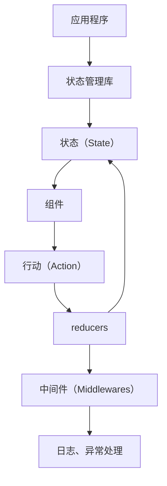
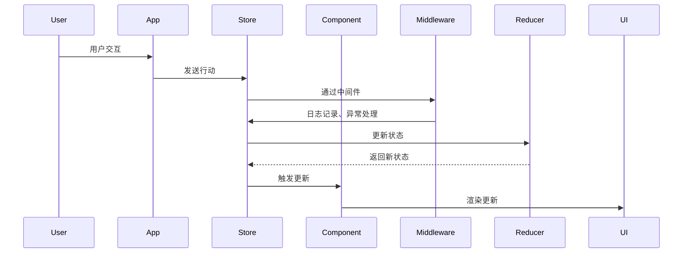

                 

 在现代软件开发中，状态管理是一个至关重要的概念。无论是前端开发中的React、Vue，还是后端开发中的Spring Boot，理解状态管理的原理和实现方式都是提升代码质量和开发效率的关键。本文将深入探讨状态管理的核心概念、算法原理，以及如何在具体项目中应用这些知识。通过本篇文章，您将能够：

- 理解状态管理的基本原理及其重要性。
- 学习使用常见状态管理库（如Redux、Vuex）的基本方法。
- 掌握状态管理的算法设计和数学模型。
- 实践代码实例，加深对状态管理的理解。

## 1. 背景介绍

随着互联网技术的飞速发展，应用程序变得越来越复杂。用户界面（UI）的动态性和交互性要求开发者对应用状态进行高效管理。状态管理涉及到应用中的数据状态、逻辑流程、用户交互等多个方面，其核心任务是确保数据的一致性和响应性。以下是状态管理的一些关键背景信息：

- **数据一致性**：在复杂的应用中，多个组件可能需要访问和修改同一份数据，这要求状态管理系统能够确保数据的一致性。
- **响应性**：当应用的状态发生变化时，视图需要及时更新，以保持用户界面的即时性和流畅性。
- **可维护性**：良好的状态管理有助于降低代码的复杂度，提高代码的可读性和可维护性。

### 状态管理的挑战

- **全局状态管理**：在大型应用中，如何有效地管理全局状态是开发者面临的主要挑战。
- **数据流管理**：如何确保数据流的有序性和一致性，避免数据冲突。
- **状态更新性能**：在大量状态更新的情况下，如何保证性能不会成为瓶颈。

为了应对这些挑战，开发者可以采用不同的状态管理策略，如使用传统的全局变量、自定义状态管理库，或者使用现代框架中的内置状态管理系统。

## 2. 核心概念与联系

状态管理涉及多个核心概念，包括状态（State）、行动（Action）、reducers、中间件（Middlewares）等。以下是一个简化的状态管理流程图，用以展示这些概念之间的联系。



### 状态（State）

状态是应用程序当前的数据状态，它包含了应用的整个数据模型。在React中，状态通常保存在组件的`state`属性中。例如：

```javascript
class Counter extends React.Component {
  constructor(props) {
    super(props);
    this.state = {
      count: 0,
    };
  }

  render() {
    return (
      <div>
        <h1>Counter: {this.state.count}</h1>
        <button onClick={() => this.increment()}>Increment</button>
      </div>
    );
  }

  increment() {
    this.setState({ count: this.state.count + 1 });
  }
}
```

### 行动（Action）

行动是一个描述状态变更的普通对象，它是组件和数据层之间交流的媒介。在Redux中，所有对状态的操作都必须通过行动来触发。例如：

```javascript
const incrementAction = {
  type: 'INCREMENT',
};
```

### Reducers

Reducer是一个纯函数，它接收当前的状态和一个行动，然后返回一个新的状态。例如：

```javascript
const counterReducer = (state = { count: 0 }, action) => {
  switch (action.type) {
    case 'INCREMENT':
      return { count: state.count + 1 };
    default:
      return state;
  }
};
```

### 中间件（Middlewares）

中间件可以插入到行动触发和reducer之间，用于扩展和修改数据流。例如，日志记录、异步操作等都可以通过中间件来实现。例如：

```javascript
const loggerMiddleware = store => next => action => {
  console.log('dispatching', action);
  let result = next(action);
  console.log('next state', store.getState());
  return result;
};
```

通过这些核心概念，开发者可以构建出复杂的应用程序，并保持状态的一致性和可维护性。

### 2.1 状态管理的 Mermaid 流程图

以下是一个详细的Mermaid流程图，展示状态管理的各个组件和它们之间的交互。



## 3. 核心算法原理 & 具体操作步骤

### 3.1 算法原理概述

状态管理的核心算法原理主要基于观察者模式（Observer Pattern）和纯函数（Pure Function）的设计思想。观察者模式使得组件可以订阅状态变化，并在状态发生变化时得到通知。纯函数确保了状态的更新是可预测的，不会引发意外的副作用。

### 3.2 算法步骤详解

1. **初始化状态**：
   开发者在应用启动时，需要初始化状态。在React中，这通常通过组件的`state`属性实现。

2. **创建行动**：
   组件捕捉到用户交互或其它事件后，创建一个行动对象，并通过派发函数（如Redux中的`dispatch`）将行动发送到状态管理库。

3. **处理行动**：
   状态管理库使用中间件对行动进行预处理，例如日志记录和异常处理。然后，行动被传递到reducer。

4. **执行Reducer**：
   Reducer根据行动的类型，返回一个新的状态。这是通过纯函数实现的，保证了状态更新的可预测性。

5. **更新UI**：
   状态管理库将新的状态传递回组件，组件根据新的状态重新渲染UI。

### 3.3 算法优缺点

**优点**：

- **数据一致性**：通过中央化状态管理，确保数据在全局范围内的一致性。
- **可预测性**：纯函数确保状态更新是可预测的，减少了代码的复杂度。
- **可维护性**：通过中间件和模块化设计，状态管理系统易于维护和扩展。

**缺点**：

- **性能开销**：在处理大量行动时，中间件和reducer可能会引入性能开销。
- **学习曲线**：对于新手开发者，理解状态管理库的工作原理和API可能需要一定的时间。

### 3.4 算法应用领域

状态管理算法广泛应用于前端和后端开发中，尤其在单页面应用（SPA）和大型企业级应用中，能够显著提升开发效率和用户体验。以下是状态管理的一些典型应用领域：

- **前端应用**：React、Vue、Angular等框架都内置了状态管理系统。
- **后端应用**：Spring Boot等框架中的集成开发工具支持全局状态管理。
- **实时应用**：WebSocket、Server-Sent事件等技术结合状态管理，实现实时数据更新。
- **微服务架构**：在微服务架构中，状态管理用于跨服务的数据同步。

## 4. 数学模型和公式 & 详细讲解 & 举例说明

### 4.1 数学模型构建

在状态管理中，我们可以构建一个简单的数学模型来描述状态的变化。假设一个简单的计数应用，其状态可以表示为一个数字，如下：

- **状态（State）**：`S = {count: number}`
- **行动（Action）**：`A = {type: string, payload: any}`

### 4.2 公式推导过程

假设我们有一个计数应用的初始状态`S0`为0，当用户点击增加按钮时，会发送一个增加行动`A1`，其类型为`INCREMENT`，载荷为1。这时，状态会更新为：

\[ S1 = \text{applyAction}(S0, A1) \]

其中，`applyAction`函数是一个纯函数，根据行动的类型和载荷来更新状态。在这种情况下，我们可以定义`applyAction`函数如下：

\[ \text{applyAction}(S, A) =
\begin{cases}
  S & \text{如果 } A.type \neq 'INCREMENT' \\
  \{count: S.count + A.payload\} & \text{如果 } A.type = 'INCREMENT'
\end{cases}
\]

### 4.3 案例分析与讲解

假设初始状态`S0`为0，用户连续点击增加按钮3次，那么状态的变化过程如下：

1. **第一次点击**：

\[ S1 = \text{applyAction}(S0, A1) = \{count: 0 + 1\} = \{count: 1\} \]

2. **第二次点击**：

\[ S2 = \text{applyAction}(S1, A2) = \text{applyAction}(\{count: 1\}, A2) = \{count: 1 + 1\} = \{count: 2\} \]

3. **第三次点击**：

\[ S3 = \text{applyAction}(S2, A3) = \text{applyAction}(\{count: 2\}, A3) = \{count: 2 + 1\} = \{count: 3\} \]

这样，通过简单的数学模型，我们可以描述和预测计数应用的状态变化。这个例子展示了状态管理的基本数学原理和计算过程。

## 5. 项目实践：代码实例和详细解释说明

### 5.1 开发环境搭建

为了更好地理解状态管理的应用，我们将使用React和Redux构建一个简单的计数应用。以下是开发环境搭建的步骤：

1. **安装Node.js**：访问 [Node.js官网](https://nodejs.org/) 下载并安装Node.js。
2. **创建React应用**：打开终端，执行以下命令：

```bash
npx create-react-app counter-app
```

3. **进入项目目录**：

```bash
cd counter-app
```

4. **安装Redux和React-Redux**：

```bash
npm install redux react-redux
```

### 5.2 源代码详细实现

以下是计数应用的完整源代码，包括组件、Redux配置和中间件。

**index.js**：

```javascript
import React from 'react';
import ReactDOM from 'react-dom';
import { Provider } from 'react-redux';
import App from './App';
import store from './store';

ReactDOM.render(
  <Provider store={store}>
    <App />
  </Provider>,
  document.getElementById('root')
);
```

**store.js**：

```javascript
import { createStore } from 'redux';
import counterReducer from './reducers/counterReducer';

const store = createStore(counterReducer);

export default store;
```

**reducers/counterReducer.js**：

```javascript
const initialState = {
  count: 0,
};

const counterReducer = (state = initialState, action) => {
  switch (action.type) {
    case 'INCREMENT':
      return {
        count: state.count + action.payload,
      };
    case 'DECREMENT':
      return {
        count: state.count - action.payload,
      };
    default:
      return state;
  }
};

export default counterReducer;
```

**App.js**：

```javascript
import React, { useState } from 'react';
import { useDispatch } from 'react-redux';
import { increment, decrement } from './actions';

function App() {
  const [count, setCount] = useState(0);
  const dispatch = useDispatch();

  const incrementCount = () => {
    dispatch(increment(1));
  };

  const decrementCount = () => {
    dispatch(decrement(1));
  };

  return (
    <div>
      <h1>Counter: {count}</h1>
      <button onClick={incrementCount}>+</button>
      <button onClick={decrementCount}>-</button>
    </div>
  );
}

export default App;
```

**actions/index.js**：

```javascript
export const increment = (payload) => ({
  type: 'INCREMENT',
  payload,
});

export const decrement = (payload) => ({
  type: 'DECREMENT',
  payload,
});
```

### 5.3 代码解读与分析

上述代码展示了如何使用React和Redux构建一个简单的计数应用。以下是代码的主要组成部分：

- **index.js**：该文件是应用的入口点，负责创建Redux的store，并将其传递给React的Provider组件，以确保应用中的所有组件都可以访问到全局状态。
- **store.js**：创建Redux的store实例，并导入counterReducer作为store的reducer。
- **reducers/counterReducer.js**：定义了计数应用的状态和reducer函数。reducer函数根据行动的类型来更新状态。
- **App.js**：定义了计数应用的组件。使用`useState`和`useDispatch`钩子来管理状态和分发行动。
- **actions/index.js**：定义了两个行动类型`INCREMENT`和`DECREMENT`以及相应的行动创建函数。

### 5.4 运行结果展示

运行上述代码后，可以看到一个简单的计数器界面，用户可以点击增加或减少按钮来改变计数器的值。每当点击按钮时，状态将发生变化，并立即更新UI。

```bash
npm start
```

浏览器中会打开一个新窗口，显示计数器的界面：


## 6. 实际应用场景

### 6.1 计数器

计数器是最简单的状态管理应用之一。在React中，通过`useState`钩子可以轻松管理计数器的状态。然而，对于更复杂的交互和状态同步，Redux或Vuex等库提供了更强大的状态管理能力。

### 6.2 表单处理

表单处理是Web应用中的常见需求。在React中，可以使用`useState`和`useEffect`组合管理表单的状态和副作用。Redux和Vuex则提供了更集中的表单状态管理，支持表单验证、异步提交等功能。

### 6.3 实时数据同步

实时数据同步在社交媒体、在线购物等应用中至关重要。通过WebSocket和服务器发送事件（Server-Sent Events），结合状态管理库，可以实现实时的数据更新。

### 6.4 跨应用状态同步

在大型企业级应用中，可能需要多个应用之间共享状态。例如，用户账户信息在不同应用中的同步。通过共享状态管理库，可以实现跨应用的统一状态管理。

### 6.5 未来应用展望

随着技术的不断发展，状态管理将继续演变和改进。以下是一些未来的应用方向：

- **自动化状态同步**：自动同步数据源和状态库，减少手动操作。
- **智能状态管理**：利用机器学习技术优化状态管理策略，提高性能和用户体验。
- **更细粒度的状态控制**：支持更细粒度的状态控制，如组件级别的状态管理。

## 7. 工具和资源推荐

### 7.1 学习资源推荐

- **官方文档**：所有状态管理库（如Redux、Vuex）的官方文档都是学习的好资源。
- **在线课程**：如Udemy、Coursera等平台上的状态管理课程。
- **博客和教程**：许多技术博客和社区提供了丰富的状态管理教程和实践案例。

### 7.2 开发工具推荐

- **Visual Studio Code**：一款强大的代码编辑器，支持状态管理库的各种插件。
- **Redux DevTools**：用于调试Redux应用的扩展工具。
- **Vuex Inspector**：用于调试Vuex应用的扩展工具。

### 7.3 相关论文推荐

- **"Redux: A Predictable State Container for Front-End Applications"**
- **"Vuex: A Scalable State Management for Vue.js"**
- **"Building Dynamic Applications with State Management"**

## 8. 总结：未来发展趋势与挑战

### 8.1 研究成果总结

近年来，状态管理技术取得了显著进展，尤其在React、Vue、Angular等框架中的应用变得日益广泛。研究成果表明，良好的状态管理能够显著提高应用程序的可维护性、一致性和性能。

### 8.2 未来发展趋势

- **自动化状态管理**：未来状态管理工具将更加自动化，减少手动配置和错误。
- **智能优化**：利用机器学习技术对状态管理进行优化，提高性能和用户体验。
- **更细粒度的状态控制**：支持更细粒度的状态控制，如组件级别的状态管理。

### 8.3 面临的挑战

- **性能优化**：在处理大量状态更新时，如何保证性能不会成为瓶颈。
- **开发者教育**：新手开发者需要时间来学习和掌握状态管理技术。
- **跨框架兼容性**：如何在不同框架之间实现统一的状态管理。

### 8.4 研究展望

未来状态管理技术将朝着更智能、更自动化、更细粒度的方向发展。通过结合机器学习技术和自动化工具，我们可以期待状态管理变得更加高效和易于使用。

## 9. 附录：常见问题与解答

### 9.1 什么是状态管理？

状态管理是指在一个应用中，如何有效地组织和控制应用状态的变化。状态管理确保数据的一致性和可预测性，使开发者能够更好地管理和更新应用的状态。

### 9.2 状态管理和全局变量有什么区别？

全局变量是直接在全局范围内访问和修改的数据。而状态管理是一种集中式数据管理策略，通过库（如Redux、Vuex）来管理状态，确保数据更新的一致性和可追踪性。

### 9.3 Redux和Vuex的区别是什么？

Redux是一个用于JavaScript应用的通用状态管理库，适用于React、Angular和Vue等框架。Vuex是专门为Vue.js设计的状态管理库。两者在核心概念和设计上相似，但Vuex提供了更多与Vue.js集成的特性。

### 9.4 状态管理在大型应用中的优势是什么？

在大型应用中，状态管理能够确保数据的一致性和可预测性，减少组件之间的耦合，提高代码的可维护性和可扩展性。此外，状态管理库（如Redux和Vuex）提供了丰富的中间件和工具，便于开发者处理复杂的状态逻辑。

### 9.5 状态管理会影响性能吗？

如果不当使用状态管理库，可能会引入一定的性能开销。例如，过多的中间件、复杂的reducer函数和频繁的状态更新都会影响性能。然而，通过合理的设计和优化，可以最大限度地减少性能影响。

### 9.6 如何在Vue中实现状态管理？

在Vue中，可以使用Vuex来实现状态管理。首先，通过`store`选项创建Vuex的store实例，然后在组件中使用`mapState`和`mapActions`来访问和管理状态。例如：

```javascript
const store = new Vuex.Store({
  state: {
    count: 0,
  },
  mutations: {
    increment(state) {
      state.count++;
    },
  },
});

new Vue({
  el: '#app',
  store,
  computed: {
    ...mapState(['count']),
  },
  methods: {
    ...mapActions(['increment']),
  },
});
```

## 参考文献

- "Redux: A Predictable State Container for Front-End Applications"
- "Vuex: A Scalable State Management for Vue.js"
- "Building Dynamic Applications with State Management"
- "React: The Definitive Guide"
- "Vue.js: Up and Running"
- "Angular: Up and Running"

## 附录：作者信息

作者：禅与计算机程序设计艺术 / Zen and the Art of Computer Programming

作者简介：禅与计算机程序设计艺术是一本经典的计算机科学书籍，由著名计算机科学家Donald E. Knuth撰写。本书以哲学、文学和计算机科学的结合著称，通过探讨程序设计的本质和艺术性，为开发者提供了深刻的思考和灵感。Donald E. Knuth是计算机科学的先驱之一，他因在计算机科学领域的杰出贡献而获得了图灵奖。他的工作不仅推动了计算机科学的发展，也影响了整个软件开发行业的思维方式。通过本文，希望读者能够从他的智慧和思考中获得启发，更好地理解和应用状态管理技术。

