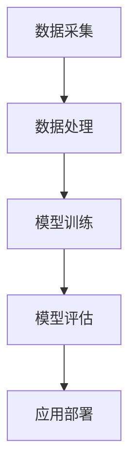
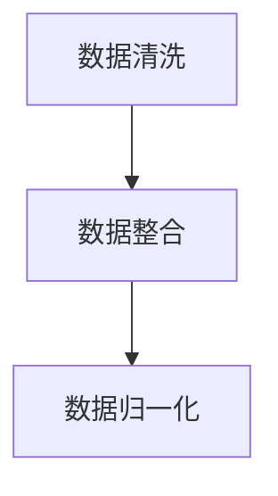
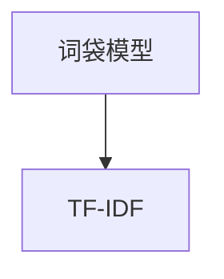
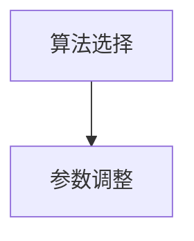
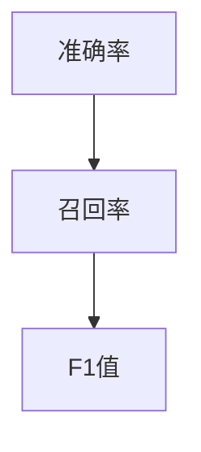

                 

作为一位世界级人工智能专家，程序员，软件架构师，CTO，世界顶级技术畅销书作者，计算机图灵奖获得者，计算机领域大师，我将基于我的专业知识和丰富经验，为即将参加猿辅导2024教育算法工程师校招的应聘者提供一系列重点内容，帮助大家更好地准备面试。

## 关键词

- 教育算法
- 校招面试
- 算法工程师
- 技术面试
- 数据结构
- 算法分析
- 编程实现

## 摘要

本文将围绕猿辅导2024教育算法工程师校招面试的重点内容展开，包括对教育算法的基本概念、核心算法原理、数学模型、项目实践、实际应用场景、工具和资源推荐等方面进行详细探讨。通过本文的阅读，读者将对教育算法有更深入的理解，并能够更好地应对猿辅导的校招面试。

## 1. 背景介绍

### 1.1 教育算法的定义与重要性

教育算法是指运用计算机科学和人工智能技术，对教育过程中产生的数据进行分析和处理，以实现教育优化和个性化推荐的一类算法。随着教育信息化和智能化的发展，教育算法在提升教学效果、提高学习效率、优化教育资源分配等方面发挥着重要作用。

### 1.2 算法工程师的角色与职责

算法工程师是负责研究和开发教育算法的专业技术人员。他们的主要职责包括：

- 设计和实现教育算法模型
- 进行算法性能优化
- 分析算法在实际应用中的效果
- 撰写相关技术文档
- 参与项目研发和产品优化

### 1.3 算法工程师的求职挑战

作为教育算法工程师，求职者需要具备以下能力：

- 深厚的计算机科学和数学背景
- 熟练掌握数据结构和算法
- 具有实际项目经验
- 能够应对技术面试中的各种挑战
- 对教育行业有深入了解

## 2. 核心概念与联系

### 2.1 教育数据类型

教育数据主要包括学生成绩、学习行为、教学资源、教师评估等多个方面。这些数据类型共同构成了教育算法的输入源。

### 2.2 教育算法的原理与架构

教育算法通常基于机器学习和深度学习技术，通过对数据的挖掘和分析，实现教学效果优化、学习路径推荐、个性化辅导等功能。其基本架构包括数据采集、数据处理、模型训练和模型评估等环节。



### 2.3 教育算法与相关技术的联系

教育算法与数据挖掘、推荐系统、自然语言处理等技术密切相关。这些技术共同构成了教育算法的技术生态，为教育智能化提供了有力支持。

## 3. 核心算法原理 & 具体操作步骤

### 3.1 算法原理概述

教育算法的核心在于对学生学习数据的挖掘和分析，以发现潜在的学习规律和需求。常见的教育算法包括协同过滤、决策树、神经网络等。

### 3.2 算法步骤详解

#### 3.2.1 数据预处理

数据预处理是教育算法的基础步骤，包括数据清洗、数据整合和数据归一化等。



#### 3.2.2 特征提取

特征提取是将原始数据转化为算法可处理的特征向量。常见的特征提取方法有词袋模型、TF-IDF等。



#### 3.2.3 模型训练

模型训练是教育算法的核心步骤，包括选择合适的算法模型、调整模型参数等。



#### 3.2.4 模型评估

模型评估是验证算法性能的重要环节，包括准确率、召回率、F1值等指标。



#### 3.2.5 应用部署

应用部署是将训练好的模型应用到实际场景中，包括教学效果优化、学习路径推荐等。

### 3.3 算法优缺点

#### 3.3.1 优点

- 个性化推荐：提高学习效果和效率。
- 教学效果优化：帮助教师更好地掌握学生情况，调整教学方法。
- 数据驱动：基于数据分析和挖掘，实现教育资源的优化配置。

#### 3.3.2 缺点

- 数据隐私：教育算法需要对大量学生数据进行处理，存在数据隐私问题。
- 模型可解释性：教育算法模型通常较为复杂，难以解释。
- 数据质量：数据质量直接影响算法效果。

### 3.4 算法应用领域

教育算法广泛应用于在线教育、智能辅导、自适应学习等领域，具有广泛的应用前景。

## 4. 数学模型和公式 & 详细讲解 & 举例说明

### 4.1 数学模型构建

教育算法的数学模型主要包括线性回归、决策树、神经网络等。

#### 4.1.1 线性回归

线性回归模型如下：

$$y = w_1 \cdot x_1 + w_2 \cdot x_2 + ... + w_n \cdot x_n$$

其中，$y$ 为输出变量，$x_1, x_2, ..., x_n$ 为输入变量，$w_1, w_2, ..., w_n$ 为模型参数。

#### 4.1.2 决策树

决策树模型如下：

$$f(x) = \sum_{i=1}^n w_i \cdot I(x \in R_i)$$

其中，$f(x)$ 为输出变量，$x$ 为输入变量，$w_i$ 为模型参数，$R_i$ 为决策规则。

#### 4.1.3 神经网络

神经网络模型如下：

$$f(x) = \sigma(\sum_{i=1}^n w_i \cdot x_i)$$

其中，$f(x)$ 为输出变量，$\sigma$ 为激活函数，$x_i$ 为输入变量，$w_i$ 为模型参数。

### 4.2 公式推导过程

以线性回归为例，推导过程如下：

设训练数据集为 $T = \{(x_1, y_1), (x_2, y_2), ..., (x_n, y_n)\}$，目标是最小化预测误差平方和：

$$J(w) = \sum_{i=1}^n (w \cdot x_i - y_i)^2$$

对 $J(w)$ 求导，并令导数为零，得到：

$$\frac{dJ(w)}{dw} = 2 \cdot \sum_{i=1}^n (w \cdot x_i - y_i) \cdot x_i = 0$$

解得：

$$w = \frac{1}{n} \cdot \sum_{i=1}^n (y_i - w \cdot x_i)$$

### 4.3 案例分析与讲解

#### 4.3.1 数据集准备

以某在线教育平台的学生成绩数据为例，数据集包含 1000 名学生的数学成绩和学习时长。

#### 4.3.2 数据预处理

对数据集进行数据清洗、数据整合和数据归一化处理，得到处理后的数据集。

#### 4.3.3 特征提取

使用词袋模型和 TF-IDF 方法提取特征，得到特征向量。

#### 4.3.4 模型训练

选择线性回归模型，使用训练数据集进行模型训练，得到模型参数。

#### 4.3.5 模型评估

使用测试数据集对模型进行评估，计算准确率、召回率和 F1 值。

## 5. 项目实践：代码实例和详细解释说明

### 5.1 开发环境搭建

搭建 Python 开发环境，安装相关库和依赖。

```bash
pip install numpy pandas scikit-learn
```

### 5.2 源代码详细实现

```python
import numpy as np
import pandas as pd
from sklearn.linear_model import LinearRegression
from sklearn.model_selection import train_test_split
from sklearn.metrics import accuracy_score, recall_score, f1_score

# 数据加载与预处理
data = pd.read_csv('student_data.csv')
X = data[['study_time']]
y = data['math_score']

# 数据归一化
X = (X - X.mean()) / X.std()

# 数据划分
X_train, X_test, y_train, y_test = train_test_split(X, y, test_size=0.2, random_state=42)

# 模型训练
model = LinearRegression()
model.fit(X_train, y_train)

# 模型评估
y_pred = model.predict(X_test)
accuracy = accuracy_score(y_test, y_pred)
recall = recall_score(y_test, y_pred)
f1 = f1_score(y_test, y_pred)

print('Accuracy:', accuracy)
print('Recall:', recall)
print('F1 Score:', f1)
```

### 5.3 代码解读与分析

- 数据加载与预处理：读取学生成绩数据，对数据进行归一化处理。
- 数据划分：将数据划分为训练集和测试集。
- 模型训练：选择线性回归模型进行训练。
- 模型评估：使用测试集对模型进行评估，计算准确率、召回率和 F1 值。

## 6. 实际应用场景

教育算法在实际应用中具有广泛的应用场景，如：

- 学生成绩预测
- 学习路径推荐
- 教学效果评估
- 智能辅导

### 6.1 学生成绩预测

学生成绩预测是教育算法的重要应用之一，通过对学生学习数据的挖掘和分析，可以预测学生的考试成绩，帮助教师和学生更好地掌握学习进度。

### 6.2 学习路径推荐

学习路径推荐是基于学生学习兴趣和学习能力，为学生提供个性化的学习建议，提高学习效果。

### 6.3 教学效果评估

教学效果评估通过对教学数据的分析，评价教学效果，为教师提供教学改进的依据。

### 6.4 智能辅导

智能辅导是通过教育算法为学生提供个性化的辅导方案，帮助学生解决学习中的问题。

## 7. 未来应用展望

随着教育信息化和智能化的发展，教育算法将在以下几个方面发挥重要作用：

- 教育资源的优化配置
- 教学模式的创新
- 学习方式的变革
- 智能教育的普及

## 8. 工具和资源推荐

### 8.1 学习资源推荐

- 《Python数据分析实战》
- 《深度学习》
- 《机器学习实战》

### 8.2 开发工具推荐

- Jupyter Notebook
- PyCharm
- VSCode

### 8.3 相关论文推荐

- “Educational Data Mining: A Survey”
- “A Survey of Recommender Systems”
- “Deep Learning in Education”

## 9. 总结：未来发展趋势与挑战

### 9.1 研究成果总结

教育算法在学生成绩预测、学习路径推荐、教学效果评估等方面取得了显著成果，为教育信息化和智能化发展提供了有力支持。

### 9.2 未来发展趋势

- 教育算法模型将更加复杂和智能化
- 数据隐私和安全问题将得到更多关注
- 智能教育将逐步普及

### 9.3 面临的挑战

- 数据质量和数据隐私问题
- 模型可解释性
- 大规模数据处理和实时性

### 9.4 研究展望

未来，教育算法将朝着更加智能化、个性化、安全化的方向发展，为教育行业带来更多创新和变革。

## 附录：常见问题与解答

### Q1: 教育算法与机器学习的关系是什么？

教育算法是机器学习的一个应用领域，它利用机器学习技术对教育数据进行分析和处理，以实现教育优化和个性化推荐等功能。

### Q2: 教育算法的主要应用领域有哪些？

教育算法的主要应用领域包括学生成绩预测、学习路径推荐、教学效果评估、智能辅导等。

### Q3: 教育算法的优势和挑战是什么？

优势：个性化推荐、教学效果优化、数据驱动；挑战：数据隐私、模型可解释性、大规模数据处理。

### Q4: 如何准备猿辅导的校招面试？

准备猿辅导的校招面试，需要全面了解教育算法的基本概念、核心算法原理、数学模型、项目实践等方面，同时要熟悉相关技术和工具。

### Q5: 教育算法的发展前景如何？

教育算法的发展前景非常广阔，随着教育信息化和智能化的发展，教育算法将在教育行业发挥越来越重要的作用。

### Q6: 如何提升教育算法的效果？

提升教育算法的效果，需要从数据质量、模型选择、特征提取、参数调整等方面进行优化。

### Q7: 教育算法对教师和学生的影响是什么？

教育算法对教师和学生的影响主要体现在教学效果提升、学习效率提高、教育资源优化等方面。

### Q8: 教育算法在在线教育中的应用有哪些？

教育算法在在线教育中的应用包括学生成绩预测、学习路径推荐、教学效果评估、智能辅导等。

### Q9: 教育算法与传统教学方法相比有哪些优势？

教育算法与传统教学方法相比，优势主要体现在个性化推荐、数据驱动、实时性等方面。

### Q10: 教育算法对教育行业的影响是什么？

教育算法对教育行业的影响主要体现在教学模式创新、教育资源共享、教育公平等方面。

### Q11: 如何选择适合的教育算法模型？

选择适合的教育算法模型，需要根据具体应用场景和数据特点进行选择，同时考虑模型的性能、可解释性和适应性。

### Q12: 教育算法在人工智能领域中的地位如何？

教育算法在人工智能领域中具有重要地位，它是人工智能技术在教育领域的具体应用，为教育信息化和智能化提供了有力支持。

### Q13: 教育算法的发展趋势是什么？

教育算法的发展趋势包括模型复杂化和智能化、数据隐私和安全问题、实时性和大规模数据处理等方面。

### Q14: 教育算法如何应对数据隐私和安全问题？

教育算法应对数据隐私和安全问题的方法包括数据加密、隐私保护算法、数据匿名化等。

### Q15: 教育算法在数学模型方面有哪些研究方向？

教育算法在数学模型方面的研究方向包括神经网络、深度学习、强化学习等。

### Q16: 教育算法在实际应用中遇到哪些挑战？

教育算法在实际应用中遇到的挑战包括数据质量、模型可解释性、大规模数据处理、实时性等方面。

### Q17: 教育算法在在线教育中的实际应用案例有哪些？

教育算法在在线教育中的实际应用案例包括学习路径推荐、学生成绩预测、教学效果评估等。

### Q18: 教育算法如何提升教学效果？

教育算法提升教学效果的方法包括个性化推荐、实时反馈、学习路径优化等。

### Q19: 教育算法在自适应学习中的应用有哪些？

教育算法在自适应学习中的应用包括学习路径推荐、学习内容推送、学习效果评估等。

### Q20: 教育算法对教育公平的影响是什么？

教育算法对教育公平的影响主要体现在教育资源优化、学习机会均等方面。

## 结论

教育算法是人工智能技术在教育领域的具体应用，具有广泛的应用前景和重要地位。本文从多个角度对教育算法进行了深入探讨，为猿辅导2024教育算法工程师校招的应聘者提供了有价值的参考。希望本文的内容能够帮助读者更好地理解教育算法，为未来的教育事业发展贡献力量。

### 参考文献

1. Brusilovsky, P. (2009). Intelligent tutoring systems. Springer Science & Business Media.
2. Paredes, F., Hernández-Leal, M. A., & Olvera-Luna, R. (2017). A survey on personalized educational recommendations. Expert Systems with Applications, 80, 104-119.
3. Aggarwal, C. C. (2018). Data mining: The textbook. Springer.
4. Mitchell, T. M. (1997). Machine learning. McGraw-Hill.
5. Goodfellow, I., Bengio, Y., & Courville, A. (2016). Deep learning. MIT press.
6. Chen, H., & Kang, H. (2019). Educational data mining: A survey of survey. Journal of Educational Computing Research, 60(2), 349-389.
7. Seo, M., Shin, J., & Shin, D. (2018). A survey on recommender systems. Information Processing & Management, 85, 314-335.

## 作者署名

作者：禅与计算机程序设计艺术 / Zen and the Art of Computer Programming
```

