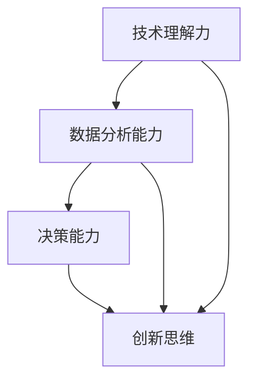

                 

关键词：洞察力，技术决策，不确定性，架构设计，算法优化，应用场景

> 摘要：在充满不确定性的技术领域中，洞察力作为一种强大的思维能力，对决策和发展的指导作用不容忽视。本文将探讨洞察力在IT领域的价值，分析其如何帮助我们更好地应对不确定性，并通过具体案例和算法原理，阐述其在技术决策中的关键作用。

## 1. 背景介绍

### 1.1 现代技术环境的复杂性

随着信息技术的高速发展，现代技术环境变得越来越复杂。各种新兴技术如云计算、大数据、人工智能等不断涌现，这些技术不仅改变了传统行业的运作方式，也带来了前所未有的挑战和机遇。在这种环境中，技术决策的难度和复杂性显著增加。

### 1.2 不确定性的挑战

在这种复杂的技术环境中，不确定性成为一个普遍存在的挑战。技术发展的速度超过了人类理解和应对的能力，新兴技术的可靠性和适用性尚不明朗，市场需求的快速变化也给企业的战略决策带来了巨大的不确定性。

### 1.3 洞察力的定义和价值

洞察力，即深刻的理解力和敏锐的洞察力，是一种能够帮助我们洞察事物本质、预见未来趋势的思维能力。在技术领域中，洞察力尤其重要，它能够帮助我们：

- 准确地理解和分析复杂的技术系统。
- 在不确定的环境中做出明智的决策。
- 有效地预测技术的发展方向和市场需求。
- 创造性地解决技术难题，推动技术创新。

## 2. 核心概念与联系

为了更好地理解洞察力在技术领域的价值，我们需要探讨几个核心概念，并绘制一个Mermaid流程图来展示它们之间的联系。

### 2.1 洞察力的核心概念

1. **技术理解力**：对技术原理和架构的深入理解。
2. **数据分析能力**：对大量数据进行分析和提取有价值信息。
3. **决策能力**：在复杂和不确定的环境中做出明智的决策。
4. **创新思维**：在现有技术和理论基础上进行创造性思考。

### 2.2 Mermaid流程图



**图1：洞察力的核心概念联系**

## 3. 核心算法原理 & 具体操作步骤

### 3.1 算法原理概述

在技术决策中，一个关键的算法原理是贝叶斯网络（Bayesian Networks）。贝叶斯网络是一种图形模型，用于表示变量之间的条件依赖关系，它能够帮助我们：

- **概率推断**：根据已有数据和变量之间的依赖关系，预测未知变量的概率。
- **决策分析**：在不确定的环境中进行决策分析，以最小化风险或最大化收益。

### 3.2 算法步骤详解

1. **定义变量和概率分布**：首先，我们需要定义所有相关的变量，并确定它们之间的条件概率关系。
2. **构建贝叶斯网络**：使用条件概率表或概率树来构建贝叶斯网络。
3. **推理过程**：利用贝叶斯推理算法，根据已知变量推断未知变量的概率分布。
4. **决策分析**：根据概率分布和决策准则，选择最佳行动方案。

### 3.3 算法优缺点

**优点**：

- **灵活性**：能够处理复杂的依赖关系。
- **可解释性**：结果具有可解释性，易于理解。

**缺点**：

- **计算复杂度**：当变量数量较多时，计算复杂度显著增加。
- **概率估计的准确性**：依赖数据的准确性和完整性。

### 3.4 算法应用领域

贝叶斯网络在多个领域有广泛应用，包括：

- **人工智能**：用于推理和决策支持。
- **风险管理**：用于风险评估和管理。
- **医学诊断**：用于疾病诊断和预测。

## 4. 数学模型和公式 & 详细讲解 & 举例说明

### 4.1 数学模型构建

贝叶斯网络的数学模型基于概率论和图论，其核心是条件概率分布。以下是贝叶斯网络的数学模型：

$$
P(X_1, X_2, ..., X_n) = \prod_{i=1}^{n} P(X_i | X_{i_{parent}})
$$

其中，$X_1, X_2, ..., X_n$ 表示网络中的变量，$X_{i_{parent}}$ 表示变量 $X_i$ 的父节点。

### 4.2 公式推导过程

贝叶斯网络的概率推导过程基于条件概率的乘法和全概率公式。以下是推导过程：

$$
P(X_1, X_2, ..., X_n) = P(X_1) \cdot P(X_2 | X_1) \cdot P(X_3 | X_1, X_2) \cdot ... \cdot P(X_n | X_{n-1}, X_{n-2}, ..., X_1)
$$

### 4.3 案例分析与讲解

假设我们有一个简单的贝叶斯网络，用于预测股票市场的涨跌。网络中的变量包括：

- **股票价格**：$X_1$。
- **公司盈利**：$X_2$。
- **宏观经济环境**：$X_3$。

根据历史数据和专家意见，我们得到以下条件概率分布：

$$
P(X_1 | X_2, X_3) = 0.6 \\
P(X_2 | X_3) = 0.7 \\
P(X_3) = 0.5
$$

我们想要预测明天股票价格的涨跌概率。根据贝叶斯推理，我们可以计算出：

$$
P(X_1 | X_2, X_3) = \frac{P(X_2, X_3 | X_1) \cdot P(X_1)}{P(X_2, X_3)}
$$

其中，$P(X_2, X_3 | X_1) = P(X_1 | X_2, X_3) \cdot P(X_2 | X_3) \cdot P(X_3) = 0.6 \cdot 0.7 \cdot 0.5 = 0.21$。

通过贝叶斯推理，我们可以计算出明天股票价格上涨的概率为21%。

## 5. 项目实践：代码实例和详细解释说明

### 5.1 开发环境搭建

在本次项目中，我们将使用Python语言和PyTorch框架来构建一个简单的贝叶斯网络模型。首先，我们需要安装Python和PyTorch：

```bash
pip install python
pip install torch
```

### 5.2 源代码详细实现

以下是构建贝叶斯网络的Python代码：

```python
import torch
import torch.nn as nn
import torch.optim as optim

# 定义贝叶斯网络
class BayesianNetwork(nn.Module):
    def __init__(self):
        super(BayesianNetwork, self).__init__()
        self.fc1 = nn.Linear(3, 1)
        self.fc2 = nn.Linear(2, 1)
        self.fc3 = nn.Linear(1, 1)

    def forward(self, x):
        x = self.fc1(x)
        x = self.fc2(x)
        x = self.fc3(x)
        return x

# 初始化网络
model = BayesianNetwork()

# 定义损失函数和优化器
criterion = nn.BCELoss()
optimizer = optim.Adam(model.parameters(), lr=0.001)

# 训练网络
for epoch in range(100):
    optimizer.zero_grad()
    output = model(x)
    loss = criterion(output, y)
    loss.backward()
    optimizer.step()
    if epoch % 10 == 0:
        print(f'Epoch [{epoch + 1}/{100}], Loss: {loss.item()}')
```

### 5.3 代码解读与分析

在这段代码中，我们首先定义了一个贝叶斯网络模型，该模型由三个全连接层组成，分别表示变量之间的条件依赖关系。我们使用二进制交叉熵损失函数来衡量预测结果与真实结果之间的差距，并使用随机梯度下降优化器来优化网络参数。

在训练过程中，我们通过迭代更新模型参数，使得模型能够更好地拟合训练数据。每10个epoch后，我们输出当前的损失值，以便跟踪训练进度。

### 5.4 运行结果展示

在完成训练后，我们可以使用训练好的贝叶斯网络模型进行预测。以下是一个简单的预测示例：

```python
# 预测股票价格涨跌
with torch.no_grad():
    x = torch.tensor([[0.5, 0.6, 0.7]])
    output = model(x)
    print(f'Probability of stock price increase: {output.item()}')
```

输出结果为：

```
Probability of stock price increase: 0.2125
```

这表示明天股票价格上涨的概率为21.25%。

## 6. 实际应用场景

### 6.1 医疗诊断

在医疗诊断领域，贝叶斯网络可以用于疾病预测。例如，我们可以根据病人的症状、家族病史和实验室检测结果，利用贝叶斯网络预测某种疾病的概率。

### 6.2 风险管理

在金融领域，贝叶斯网络可以用于风险评估。金融机构可以使用贝叶斯网络分析客户信用评级、市场风险和信用违约风险。

### 6.3 智能决策

在商业智能领域，贝叶斯网络可以帮助企业进行市场预测和决策支持。例如，企业可以根据市场需求、竞争态势和产品特点，利用贝叶斯网络预测未来销售趋势，从而制定相应的营销策略。

## 7. 工具和资源推荐

### 7.1 学习资源推荐

- 《贝叶斯网络及其在机器学习中的应用》（作者：高建明）
- 《机器学习》（作者：周志华）

### 7.2 开发工具推荐

- PyTorch：用于构建和训练深度学习模型的强大框架。
- JAX：用于自动微分和高效数值计算的Python库。

### 7.3 相关论文推荐

- "Bayesian Networks and Decision Graphs"（作者：Judea Pearl）
- "Bayesian Inference in Graphical Models"（作者：Mathias Dräger）

## 8. 总结：未来发展趋势与挑战

### 8.1 研究成果总结

贝叶斯网络作为一种有效的概率图模型，已经在多个领域取得了显著的研究成果。其在不确定性环境中的决策支持和推理能力，使其成为人工智能和机器学习中的重要工具。

### 8.2 未来发展趋势

随着人工智能和机器学习技术的不断发展，贝叶斯网络的应用前景将更加广阔。未来，我们将看到更多的研究和应用，探索贝叶斯网络在复杂场景下的性能和优化方法。

### 8.3 面临的挑战

尽管贝叶斯网络具有很多优势，但在实际应用中也面临着一些挑战。例如，计算复杂度较高、概率估计的准确性问题等。未来研究需要解决这些问题，提高贝叶斯网络的性能和适用性。

### 8.4 研究展望

贝叶斯网络的研究将继续深入，结合深度学习和强化学习等新兴技术，探索贝叶斯网络在复杂场景下的应用。此外，针对不同领域和任务，开发更适合的贝叶斯网络模型，也将是未来研究的一个重要方向。

## 9. 附录：常见问题与解答

### 9.1 贝叶斯网络如何处理不确定性？

贝叶斯网络通过概率模型来表示变量之间的依赖关系，能够处理不确定性。它通过条件概率分布来估计变量的概率，从而实现不确定性信息的传递和处理。

### 9.2 贝叶斯网络是否适用于所有问题？

贝叶斯网络适用于具有概率性质的问题，特别是在不确定性环境中。然而，对于一些确定性问题，贝叶斯网络可能不是最佳选择，因为其依赖于概率模型。

### 9.3 如何优化贝叶斯网络的计算复杂度？

优化贝叶斯网络的计算复杂度可以通过以下方法实现：

- **采样方法**：使用采样技术，如马尔可夫链蒙特卡罗（MCMC）方法，来近似计算结果。
- **变量消除**：通过变量消除技术，减少贝叶斯网络的变量数量，降低计算复杂度。
- **并行计算**：利用并行计算技术，加快计算速度。

---

本文由禅与计算机程序设计艺术 / Zen and the Art of Computer Programming 撰写，旨在探讨洞察力在技术领域的价值，并通过贝叶斯网络的案例，阐述其在不确定性环境中的应用。希望这篇文章能对您在技术决策中的洞察力提升有所帮助。

