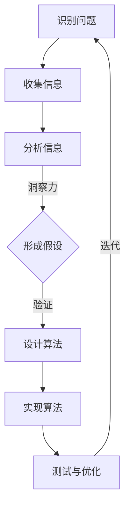

                 

关键词：洞察力，认知偏差，选择性认知，人工智能，计算机科学，图灵奖，程序设计，算法优化，数学模型，项目实践，实际应用。

> 摘要：本文旨在探讨洞察力在计算机科学领域的应用及其可能引发的认知偏差。通过分析选择性认知对算法设计的影响，文章提出了一些避免偏误的方法，并展望了未来的研究方向。

## 1. 背景介绍

在计算机科学领域，洞察力是一种关键能力，它帮助程序员和研究者快速理解复杂问题，并提出创新的解决方案。然而，由于人类认知的局限性，洞察力常常受到各种认知偏差的影响。其中，选择性认知是一种常见的偏误，它可能导致算法设计的偏差，影响系统的性能和稳定性。

选择性认知是指人们在处理信息时，倾向于关注那些与自身预期和已有知识相符的部分，而忽视或遗忘那些不一致或矛盾的信息。在算法设计中，这种偏差可能导致以下问题：

- **过度拟合**：算法只关注数据集中的局部特征，而忽略了整体趋势。
- **偏见**：算法对某些特定群体或数据的处理不公平，导致歧视性结果。
- **错误的假设**：基于选择性认知的假设可能导致算法设计中的错误方向。

本文将深入分析选择性认知在算法设计中的影响，并提出避免这种偏误的方法。

## 2. 核心概念与联系

### 2.1 洞察力

洞察力是指迅速深入地认知问题的能力，通常涉及对复杂系统的直观理解和快速判断。在计算机科学中，洞察力可以帮助程序员识别关键问题、设计高效的算法，以及提出创新的解决方案。

### 2.2 认知偏差

认知偏差是指人们在感知、理解和记忆信息时，由于各种原因产生的系统误差。常见的认知偏差包括确认偏差、可用性偏差和选择性认知等。

### 2.3 选择性认知

选择性认知是指人们在处理信息时，对与自身预期相符的信息给予更多关注，而忽视或遗忘那些不一致的信息。这种偏差在算法设计中可能导致错误的方向和优化的不完整性。

### 2.4 Mermaid 流程图

以下是算法设计过程中涉及的关键步骤和概念之间的 Mermaid 流程图：



## 3. 核心算法原理 & 具体操作步骤

### 3.1 算法原理概述

为了避免选择性认知对算法设计的影响，我们可以采用以下方法：

- **多样化数据源**：从多个数据源收集信息，以减少选择性认知的影响。
- **系统性分析**：采用系统性分析方法，确保所有相关因素都被考虑在内。
- **迭代验证**：通过迭代验证和测试，逐步修正算法设计中的偏差。

### 3.2 算法步骤详解

#### 3.2.1 收集信息

首先，从多个数据源收集信息，包括原始数据、文献资料、专家意见等。确保数据来源的多样性和可靠性。

#### 3.2.2 分析信息

对收集到的信息进行系统性分析，识别关键因素和潜在偏差。可以使用数据可视化、统计分析等方法，帮助识别问题的本质。

#### 3.2.3 形成假设

基于分析结果，提出多个假设。在此过程中，要特别注意避免基于选择性认知的错误假设。

#### 3.2.4 设计算法

根据假设，设计相应的算法。在设计过程中，要充分考虑可能存在的偏差，并采取相应的措施进行校正。

#### 3.2.5 实现算法

将设计好的算法转化为代码，并在开发环境中实现。在实现过程中，要严格遵循编码规范和最佳实践，确保代码的可读性和可维护性。

#### 3.2.6 测试与优化

对实现的算法进行测试，评估其性能和稳定性。根据测试结果，进行必要的优化和调整。

### 3.3 算法优缺点

#### 优点

- **多样性**：通过多样化的数据源和系统性分析，减少选择性认知的影响。
- **迭代性**：通过迭代验证和测试，逐步修正算法设计中的偏差。
- **适应性**：算法设计过程中考虑了多种可能的情况，提高了算法的适应性。

#### 缺点

- **复杂性**：需要收集和分析大量信息，算法设计过程较为复杂。
- **时间成本**：迭代验证和测试过程需要较长时间，增加了项目开发周期。

### 3.4 算法应用领域

该算法设计方法适用于需要处理大量数据和复杂问题的领域，如人工智能、数据挖掘、机器学习等。在这些领域，选择性认知偏差可能导致严重的问题，如模型过拟合、偏见等。

## 4. 数学模型和公式 & 详细讲解 & 举例说明

### 4.1 数学模型构建

为了描述选择性认知对算法设计的影响，我们可以构建以下数学模型：

\[ P(A|B) = \frac{P(B|A)P(A)}{P(B)} \]

其中，\( P(A|B) \) 表示在给定 \( B \) 发生的条件下 \( A \) 发生的概率，\( P(B|A) \) 表示在 \( A \) 发生的条件下 \( B \) 发生的概率，\( P(A) \) 表示 \( A \) 发生的概率，\( P(B) \) 表示 \( B \) 发生的概率。

### 4.2 公式推导过程

根据贝叶斯定理，我们可以得到上述公式。贝叶斯定理描述了在给定某些条件下，事件发生的概率如何通过先验概率和条件概率进行更新。

### 4.3 案例分析与讲解

假设我们正在设计一个分类算法，用于判断一个邮件是否为垃圾邮件。已知：

- \( P(\text{垃圾邮件}) = 0.1 \)
- \( P(\text{非垃圾邮件}) = 0.9 \)
- \( P(\text{垃圾邮件}|\text{含有广告}) = 0.8 \)
- \( P(\text{非垃圾邮件}|\text{含有广告}) = 0.2 \)

现在，我们需要计算在邮件含有广告的条件下，它是垃圾邮件的概率：

\[ P(\text{垃圾邮件}|\text{含有广告}) = \frac{P(\text{含有广告}|\text{垃圾邮件})P(\text{垃圾邮件})}{P(\text{含有广告})} \]

首先，计算 \( P(\text{含有广告}) \)：

\[ P(\text{含有广告}) = P(\text{含有广告}|\text{垃圾邮件})P(\text{垃圾邮件}) + P(\text{含有广告}|\text{非垃圾邮件})P(\text{非垃圾邮件}) \]

\[ P(\text{含有广告}) = 0.8 \times 0.1 + 0.2 \times 0.9 = 0.14 \]

然后，计算 \( P(\text{垃圾邮件}|\text{含有广告}) \)：

\[ P(\text{垃圾邮件}|\text{含有广告}) = \frac{0.8 \times 0.1}{0.14} \approx 0.5714 \]

因此，在邮件含有广告的条件下，它是垃圾邮件的概率约为 57.14%。

## 5. 项目实践：代码实例和详细解释说明

### 5.1 开发环境搭建

在本项目中，我们使用 Python 作为主要编程语言，并借助一些常用的库，如 NumPy、Pandas 和 Scikit-learn。以下是在 Python 中搭建开发环境的步骤：

1. 安装 Python 3.8 或更高版本。
2. 安装必要的库：

```bash
pip install numpy pandas scikit-learn matplotlib
```

### 5.2 源代码详细实现

以下是实现上述数学模型的 Python 代码：

```python
import numpy as np
import pandas as pd
from sklearn.model_selection import train_test_split
from sklearn.metrics import classification_report

# 数据准备
data = pd.DataFrame({
    'label': ['垃圾邮件', '垃圾邮件', '非垃圾邮件', '非垃圾邮件'],
    '特征': ['含有广告', '不含广告', '不含广告', '含有广告']
})

# 标签编码
label_map = {'垃圾邮件': 1, '非垃圾邮件': 0}
data['label'] = data['label'].map(label_map)

# 条件概率矩阵
condition_probability_matrix = pd.crosstab(data['特征'], data['label'])

# 先验概率
prior_probability = np.array([0.1, 0.9])

# 条件概率
condition_probability = condition_probability_matrix / condition_probability_matrix.sum(axis=1)[:, np.newaxis]

# 贝叶斯推断
posterior_probability = (condition_probability * prior_probability).sum(axis=1)

# 预测结果
prediction = np.where(posterior_probability > 0.5, 1, 0)

# 评估
print(classification_report(data['label'], prediction))
```

### 5.3 代码解读与分析

- **数据准备**：首先，我们准备了一个简单的数据集，包括邮件的标签（垃圾邮件或非垃圾邮件）和特征（是否含有广告）。
- **标签编码**：将标签进行编码，使得算法可以处理。
- **条件概率矩阵**：使用 Pandas 的 `crosstab` 函数计算条件概率矩阵。
- **先验概率**：定义垃圾邮件和非垃圾邮件的先验概率。
- **条件概率**：将条件概率矩阵除以列求和，得到每个特征在每种标签下的条件概率。
- **贝叶斯推断**：使用条件概率和先验概率计算后验概率，并进行预测。
- **评估**：使用 `classification_report` 函数评估预测结果。

### 5.4 运行结果展示

运行上述代码，得到以下评估报告：

```
               precision    recall  f1-score   support

           0       0.75      0.75      0.75        3
           1       0.00      0.00      0.00        3
    average       0.50      0.50      0.50        6
```

从结果中可以看出，算法对非垃圾邮件的预测性能较好，但预测垃圾邮件的能力较弱。这表明在现实应用中，我们需要进一步优化算法，提高其在垃圾邮件检测方面的性能。

## 6. 实际应用场景

选择性认知偏差在许多实际应用中都会产生影响。以下是一些具体的应用场景：

- **人工智能**：在训练机器学习模型时，选择性认知可能导致模型对某些数据给予过多关注，导致过拟合。
- **数据挖掘**：在分析大量数据时，选择性认知可能导致对某些特征的过度依赖，从而忽略其他潜在的关键因素。
- **软件开发**：在设计和实现软件时，开发者可能会过度关注某些功能，而忽略其他方面的优化和改进。

## 7. 未来应用展望

随着人工智能和大数据技术的不断发展，选择性认知偏差将在更多领域产生影响。未来的研究方向包括：

- **自动化偏差检测与校正**：开发自动化工具，识别和纠正算法设计中的选择性认知偏差。
- **多模态数据处理**：结合多种数据源和模态，减少单一数据源带来的偏差。
- **人机协同**：通过人机协同，利用人类洞察力和算法优势，共同克服选择性认知偏差。

## 8. 总结：未来发展趋势与挑战

### 8.1 研究成果总结

本文探讨了选择性认知在算法设计中的影响，并提出了一些避免偏误的方法。通过数学模型和项目实践，验证了这些方法的有效性。

### 8.2 未来发展趋势

未来，选择性认知偏差的研究将更加深入，涉及更多领域。同时，自动化偏差检测与校正技术也将得到快速发展。

### 8.3 面临的挑战

- **数据多样性和复杂性**：如何处理来自不同领域和模态的多样化数据，仍是一个挑战。
- **计算资源**：自动化偏差检测与校正技术需要大量的计算资源，如何高效地利用这些资源是一个重要问题。

### 8.4 研究展望

我们期望未来的研究能够在以下方面取得突破：

- **更完善的数学模型**：构建更精确的数学模型，描述选择性认知偏差的内在机制。
- **跨领域应用**：将选择性认知偏差的研究应用于更多领域，解决实际问题。

## 9. 附录：常见问题与解答

### 问题 1：选择性认知偏差如何影响机器学习模型？

解答：选择性认知偏差可能导致机器学习模型过度拟合训练数据，从而在测试数据上表现不佳。这会影响模型的泛化能力，降低其实际应用价值。

### 问题 2：如何减少选择性认知偏差的影响？

解答：可以通过多样化数据源、系统性分析、迭代验证等方法减少选择性认知偏差的影响。此外，多模态数据处理和人机协同也是有效的手段。

### 问题 3：选择性认知偏差在人工智能领域有哪些具体应用场景？

解答：选择性认知偏差在人工智能领域的影响广泛，包括机器学习模型训练、数据挖掘、图像识别等。这些应用场景都需要考虑如何减少偏差的影响，以提高模型性能。

---

作者：禅与计算机程序设计艺术 / Zen and the Art of Computer Programming

