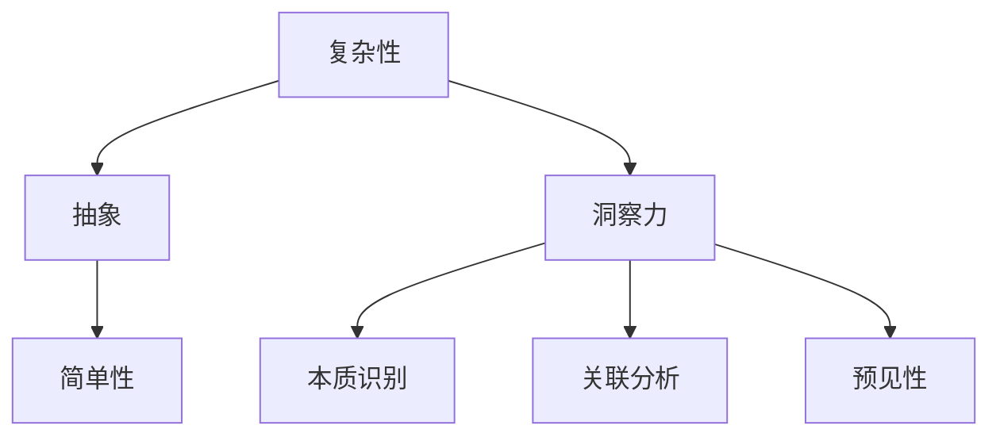

                 

 **关键词**：洞察力、复杂性、简单性、技术架构、算法、应用场景、未来展望

> **摘要**：本文旨在探讨技术领域中的洞察力，即在复杂问题中识别并把握其本质的能力。通过深入分析复杂系统的组成和运作机制，本文揭示了洞察力在技术决策和创新中的重要性。文章首先回顾了技术发展的历程，然后探讨了洞察力的核心概念与联系，接着详细讲解了核心算法原理和数学模型，并通过实际项目实践展示了这些理论的应用。最后，本文对实际应用场景进行了分析，并展望了未来的发展趋势与挑战。

## 1. 背景介绍

在当今技术快速发展的时代，我们面临着越来越多的复杂问题。从大数据处理到人工智能，从云计算到区块链，每一项技术的背后都是复杂系统的集成与运作。这种复杂性不仅体现在技术的实现层面，也体现在决策和创新的层面。如何在复杂的背景下找到简单的解决方案，成为了技术工作者面临的重大挑战。

洞察力，作为在复杂问题中识别并把握其本质的能力，成为了技术领域的核心竞争力。它不仅帮助我们在纷繁复杂的技术世界中找到清晰的路径，还为技术创新提供了源源不断的灵感。因此，理解洞察力的本质，掌握其在技术实践中的应用，对于提升个人和组织的竞争力具有重要意义。

本文将从以下几个方面展开讨论：

1. **技术发展的历程**：回顾技术发展的历程，分析复杂性与简单性之间的关系。
2. **核心概念与联系**：阐述洞察力的核心概念，并利用Mermaid流程图展示其原理与架构。
3. **核心算法原理**：详细讲解核心算法的原理和操作步骤，分析其优缺点和应用领域。
4. **数学模型与公式**：构建数学模型，推导关键公式，并通过案例进行分析和讲解。
5. **项目实践**：提供代码实例，详细解释实现过程，展示运行结果。
6. **实际应用场景**：分析洞察力在不同领域的应用，探讨其未来的发展趋势和挑战。
7. **工具和资源推荐**：推荐相关学习资源、开发工具和论文，以供进一步研究。
8. **总结与展望**：总结研究成果，展望未来发展趋势，提出面临的挑战和研究方向。

通过以上内容，本文希望为读者提供一个全面而深入的洞察力理解框架，帮助大家更好地应对复杂的技术问题，实现从复杂到简单的转变。

## 2. 核心概念与联系

### 2.1 洞察力的定义与内涵

洞察力（Insight）是一种深层次的理解力和思考力，它不仅能够揭示事物的本质，还能预见未来可能的发展趋势。在技术领域，洞察力意味着对复杂系统的深刻理解，能够在众多细节中抓住关键点，找到解决问题的最佳路径。

洞察力的内涵包括以下几个方面：

- **本质识别**：洞察力能够识别复杂问题中的核心本质，从而简化问题，降低复杂性。
- **关联分析**：洞察力能够发现不同元素之间的关联，构建系统性的思维框架。
- **预见性**：洞察力能够基于现有信息预测未来可能的发展趋势，提供前瞻性的解决方案。

### 2.2 洞察力的核心概念

为了更好地理解洞察力，我们需要明确几个核心概念：

- **复杂性（Complexity）**：复杂性指的是系统中元素数量和相互关系的多样性。高复杂性的系统通常难以理解和操作。
- **简单性（Simplicity）**：简单性指的是能够以简洁的方式表达复杂现象的特性。在技术领域，简单性意味着高效、易用、易于理解。
- **抽象（Abstraction）**：抽象是洞察力的基础，它通过忽略不重要的细节，将复杂问题简化为更容易处理的模型。

### 2.3 洞察力的架构与联系

为了更直观地理解洞察力，我们可以借助Mermaid流程图展示其核心概念和联系。



在这个流程图中，复杂性通过抽象转化为简单性，而简单性则是洞察力发挥作用的基础。具体来说：

- **复杂性**：任何系统都存在一定的复杂性，这表现为系统元素和相互关系的多样性和动态性。
- **抽象**：通过抽象，我们可以从复杂系统中提取关键信息，忽略不重要的细节，从而简化问题。
- **简单性**：简化后的系统更容易理解和操作，这为洞察力的发挥提供了基础。
- **洞察力**：在简单性的基础上，洞察力能够识别系统的本质，分析元素间的关联，并预见未来的发展趋势。

通过这个架构，我们可以看到洞察力在复杂系统中的核心作用，它不仅帮助我们简化问题，还为我们提供了创新的视角和解决方案。

### 2.4 洞察力的应用场景

洞察力在技术领域的应用场景非常广泛，以下是一些典型的应用实例：

- **算法优化**：在算法设计中，洞察力可以帮助我们识别影响性能的关键因素，从而进行优化。
- **系统架构设计**：在系统架构设计中，洞察力能够帮助我们把握系统的本质，构建高效、可扩展的架构。
- **需求分析**：在需求分析过程中，洞察力可以帮助我们理解用户需求，从而设计出更符合用户期望的产品。
- **创新思维**：洞察力是创新思维的重要基础，它能够帮助我们预见未来的发展趋势，从而引领技术创新。

通过以上实例，我们可以看到洞察力在技术领域的广泛应用和重要性。它不仅提升了我们的工作效率，还为技术创新提供了源源不断的动力。

### 2.5 洞察力的培养

洞察力并非与生俱来，而是可以通过学习和实践逐渐培养的。以下是一些培养洞察力的方法：

- **多学科知识交叉**：通过学习不同领域的知识，我们可以拓宽思维，从不同角度看待问题，从而提升洞察力。
- **实践与反思**：通过实际操作和反思，我们可以不断积累经验，提升对问题的理解深度。
- **批判性思维**：批判性思维能够帮助我们识别问题的本质，避免陷入表面化思考。
- **持续学习**：技术领域不断变化，持续学习是提升洞察力的关键。

总之，洞察力是技术工作者不可或缺的能力，它帮助我们在复杂的技术世界中找到清晰的路径，实现从复杂到简单的转变。通过深入理解洞察力的核心概念和联系，我们可以更好地培养和发挥这一能力，为技术创新和事业发展提供强有力的支持。

## 3. 核心算法原理 & 具体操作步骤

### 3.1 算法原理概述

在技术领域，算法是解决问题的基础工具。洞察力在算法设计中的应用主要体现在以下几个方面：

1. **问题简化**：通过洞察力，我们可以识别问题的核心，将复杂问题简化为更易处理的形式。
2. **算法优化**：洞察力可以帮助我们分析算法的性能瓶颈，提出优化的方向。
3. **创新设计**：洞察力能够激发新的算法思路，为技术创新提供灵感。

本文将介绍一种典型的算法——动态规划（Dynamic Programming，DP），并探讨其原理和操作步骤。

### 3.2 动态规划原理

动态规划是一种解决优化问题的方法，其核心思想是将复杂问题分解为多个子问题，并利用子问题的解来构建原问题的解。具体来说，动态规划具有以下几个特点：

1. **最优子结构**：任何最优解都是由子问题的最优解组合而成的。
2. **重叠子问题**：在求解过程中，子问题可能会多次出现，通过存储子问题的解，可以避免重复计算。
3. **状态转移方程**：通过分析子问题之间的关系，构建状态转移方程，从而递推求解。

动态规划的步骤可以概括为：

1. **定义状态**：将问题转化为状态的表示，每个状态对应问题的一个子集。
2. **定义状态转移方程**：分析状态之间的转移关系，建立状态转移方程。
3. **初始化边界条件**：确定初始状态，为递推过程提供起点。
4. **递推计算**：根据状态转移方程，依次计算各状态的值。
5. **求解最优解**：根据递推结果，找到最优解。

### 3.3 动态规划操作步骤详解

下面以常见的斐波那契数列（Fibonacci Sequence）为例，详细讲解动态规划的操作步骤。

#### 步骤1：定义状态

定义状态`F(n)`表示第`n`个斐波那契数。

#### 步骤2：定义状态转移方程

根据斐波那契数列的定义，状态转移方程为：

$$
F(n) = F(n-1) + F(n-2)
$$

其中，初始条件为`F(0) = 0`和`F(1) = 1`。

#### 步骤3：初始化边界条件

初始状态`F(0) = 0`和`F(1) = 1`已给出。

#### 步骤4：递推计算

根据状态转移方程，依次计算`F(2)`、`F(3)`、...、`F(n)`的值。

```python
def fibonacci(n):
    if n == 0:
        return 0
    elif n == 1:
        return 1
    else:
        a, b = 0, 1
        for i in range(2, n+1):
            c = a + b
            a, b = b, c
        return b
```

#### 步骤5：求解最优解

通过递推计算，我们可以得到第`n`个斐波那契数。

### 3.4 动态规划优缺点

#### 优点

1. **高效**：动态规划通过避免重复计算，显著提高了算法的效率。
2. **通用性**：动态规划适用于解决一类具有最优子结构和重叠子问题的问题。
3. **直观**：动态规划的状态转移方程直观地反映了问题的本质，易于理解和实现。

#### 缺点

1. **空间复杂度**：动态规划通常需要额外的空间来存储子问题的解，可能导致较高的空间复杂度。
2. **问题适用性**：并非所有问题都适用于动态规划方法，只有具备最优子结构和重叠子问题特性的问题才能有效使用动态规划。

### 3.5 动态规划的应用领域

动态规划广泛应用于各个技术领域，以下是一些典型的应用实例：

1. **计算机科学**：用于解决最短路径问题、背包问题、字符串匹配等。
2. **经济学**：用于优化资源配置、求解最优控制问题等。
3. **生物信息学**：用于序列比对、基因注释等。

通过以上内容，我们详细介绍了动态规划的原理和操作步骤，并分析了其优缺点和应用领域。动态规划作为一种有效的算法设计方法，在复杂问题求解中发挥了重要作用。通过洞察力，我们可以更好地理解动态规划的核心思想，从而在实际问题中灵活应用，实现高效的解决方案。

### 3.6 动态规划相关算法

除了动态规划（Dynamic Programming，DP），还有许多其他经典的算法在复杂问题求解中发挥着重要作用。以下是几个与动态规划密切相关的算法及其简要介绍：

#### 1. 背包问题（Knapsack Problem）

背包问题是一种典型的优化问题，其目标是在限制总重量的条件下，选择物品的组合以最大化总价值。根据物品的可重复性，背包问题分为0/1背包问题和完全背包问题。

- **0/1背包问题**：每个物品只能选择一次或不选择，目标是找到价值最大的物品组合。
- **完全背包问题**：每个物品可以选择多次，目标是找到价值最大的物品组合。

背包问题可以通过动态规划方法高效求解，其时间复杂度为$O(nW)$，其中$n$是物品数量，$W$是背包容量。

#### 2. 最长公共子序列（Longest Common Subsequence，LCS）

最长公共子序列问题是寻找两个序列中最长的公共子序列。LCS在生物信息学、文本比较等领域有广泛应用。

LCS问题可以通过动态规划求解，其状态转移方程为：

$$
LCS(i, j) = 
\begin{cases} 
LCS(i-1, j-1) + 1 & \text{if } a_i = b_j \\
\max(LCS(i-1, j), LCS(i, j-1)) & \text{otherwise}
\end{cases}
$$

其时间复杂度为$O(mn)$，其中$m$和$n$分别是两个序列的长度。

#### 3. 最短路径算法（Shortest Path Algorithms）

最短路径算法用于求解图中两点之间的最短路径问题，经典的算法包括迪杰斯特拉算法（Dijkstra's Algorithm）和弗洛伊德算法（Floyd's Algorithm）。

- **迪杰斯特拉算法**：适用于无负权边的图，其时间复杂度为$O((V+E)\log V)$，其中$V$是顶点数量，$E$是边数量。
- **弗洛伊德算法**：适用于有负权边的图，其时间复杂度为$O(V^3)$。

#### 4. 贪心算法（Greedy Algorithms）

贪心算法是一种在每一步选择中选择当前最优解的策略，虽然不能保证全局最优解，但在某些问题中可以高效地找到近似解。

贪心算法适用于如背包问题、活动选择问题等，其时间复杂度通常较低，但需要针对具体问题设计。

通过了解这些经典算法，我们可以更好地应对复杂的技术问题，灵活选择合适的算法，实现高效的解决方案。

### 3.7 动态规划与复杂性的关系

动态规划作为一种有效的算法设计方法，其在复杂问题求解中的应用具有重要意义。动态规划的核心思想是通过将复杂问题分解为多个子问题，并利用子问题的解构建原问题的解，从而降低问题的复杂度。

具体来说，动态规划与复杂性的关系可以从以下几个方面进行分析：

#### 1. 时间复杂度

动态规划通过存储子问题的解，避免了重复计算，从而显著降低了时间复杂度。以斐波那契数列为例，如果不使用动态规划，直接递归求解的时间复杂度为$O(2^n)$，而使用动态规划后，时间复杂度降低为$O(n)$。

#### 2. 空间复杂度

虽然动态规划通过存储子问题的解提高了时间效率，但也带来了空间复杂度的增加。以最长公共子序列问题为例，其动态规划解决方案需要额外的空间来存储二维数组，其空间复杂度为$O(mn)$，其中$m$和$n$分别是两个序列的长度。

#### 3. 子问题重叠

动态规划的一个重要前提是子问题之间存在重叠，这意味着在求解过程中，子问题会重复出现。通过存储子问题的解，动态规划能够避免重复计算，从而提高效率。

#### 4. 最优子结构

动态规划适用于具有最优子结构的问题，这意味着原问题的最优解可以通过子问题的最优解组合而成。动态规划通过构建状态转移方程，将复杂问题转化为多个子问题，并利用子问题的解递推求解原问题。

综上所述，动态规划在降低时间复杂度、利用子问题重叠和提高求解效率方面具有显著优势，但其空间复杂度也可能较高。在实际应用中，需要根据问题的具体特点，权衡时间和空间复杂度，选择合适的算法。

### 3.8 动态规划在不同技术领域的应用

动态规划作为一种高效的算法设计方法，在多个技术领域得到了广泛应用。以下是一些典型的应用场景：

#### 1. 计算机科学

- **背包问题**：在资源优化和调度问题中，如负载均衡、任务分配等，背包问题提供了有效的解决方案。
- **字符串匹配**：动态规划算法如最长公共子序列（LCS）和最长公共前缀（LCP）在文本比较、模式识别和信息检索中具有重要应用。

#### 2. 经济学

- **资源分配**：动态规划可以用于优化资源分配问题，如多商品资源分配、电力系统优化等。
- **最优控制**：动态规划在经济学中的最优控制问题中，如投资组合优化、供应链管理等领域具有广泛应用。

#### 3. 生物信息学

- **序列比对**：动态规划算法如全局比对（BLAST）和局部比对（Smith-Waterman）在基因组学和蛋白质结构分析中扮演关键角色。
- **基因注释**：动态规划在基因识别和注释中，如预测基因结构和功能，提供了重要的工具。

#### 4. 图像处理

- **图像分割**：动态规划算法如最小生成树算法（Prim和Kruskal）在图像分割中用于识别图像中的边界和对象。
- **图像匹配**：动态规划算法在图像匹配和识别中，如基于特征的图像匹配和模板匹配，提供了高效的解决方案。

通过以上应用实例，我们可以看到动态规划在不同技术领域的广泛应用和重要性。它不仅提高了算法的效率，还为解决复杂问题提供了有力的工具。未来，随着技术的不断发展，动态规划将在更多领域发挥重要作用。

### 4. 数学模型和公式 & 详细讲解 & 举例说明

在技术领域，数学模型和公式是理解和解决复杂问题的重要工具。通过精确的数学描述，我们可以更深入地分析问题，找到最优的解决方案。在本节中，我们将构建一个数学模型，并详细讲解其推导过程，然后通过实际案例进行说明。

#### 4.1 数学模型构建

假设我们面临一个资源优化问题，需要在有限的资源下最大化产出。这个问题可以通过线性规划（Linear Programming，LP）模型进行描述。

线性规划模型的一般形式如下：

$$
\begin{aligned}
\max_{x} \quad & c^T x \\
\text{s.t.} \quad & Ax \leq b \\
& x \geq 0
\end{aligned}
$$

其中，$x$是决策变量，$c$是目标函数系数，$A$和$b$分别是约束条件的系数矩阵和向量。

在这个模型中，$c^T x$表示目标函数，$Ax \leq b$表示线性不等式约束，$x \geq 0$表示非负约束。

#### 4.2 公式推导过程

线性规划模型的推导过程可以从以下几个方面进行：

1. **目标函数**：目标函数表示我们需要优化的目标，如最大化利润、最小化成本等。假设我们想要最大化总利润，则目标函数可以表示为：

   $$ 
   \max_{x} \quad p^T x 
   $$

   其中，$p$是利润向量，$x$是决策变量向量。

2. **约束条件**：约束条件表示资源限制和其他限制条件。在资源优化问题中，常见的约束条件包括资源的消耗限制、需求限制等。这些约束可以用线性不等式表示：

   $$ 
   \begin{aligned}
   & a_{11} x_1 + a_{12} x_2 + \ldots + a_{1n} x_n \leq b_1 \\
   & a_{21} x_1 + a_{22} x_2 + \ldots + a_{2n} x_n \leq b_2 \\
   & \vdots \\
   & a_{m1} x_1 + a_{m2} x_2 + \ldots + a_{mn} x_n \leq b_m
   \end{aligned}
   $$

   其中，$a_{ij}$是约束条件系数，$b_i$是约束条件值。

3. **非负约束**：决策变量通常不能为负，因此需要添加非负约束：

   $$ 
   x \geq 0 
   $$

通过以上步骤，我们构建了一个线性规划模型。这个模型可以通过多种方法进行求解，如单纯形法、内点法等。

#### 4.3 案例分析与讲解

为了更好地理解线性规划模型，我们通过一个实际案例进行说明。

**案例**：一家公司生产两种产品A和B，每种产品都需要消耗两种资源：劳动力和原材料。每种产品的利润和资源消耗如下表所示：

| 产品 | 利润 (元/件) | 劳动力需求 (小时/件) | 原材料需求 (千克/件) |
| ---- | ---- | ---- | ---- |
| A    | 20   | 2    | 1    |
| B    | 30   | 3    | 2    |

公司的资源限制如下：
- 每天最多可用100小时劳动力。
- 每天最多可用100千克原材料。

公司的目标是最大化总利润。

**步骤1：定义决策变量**

设$x_1$为产品A的生产数量，$x_2$为产品B的生产数量。

**步骤2：建立目标函数**

目标函数为最大化总利润：

$$ 
\max_{x} \quad 20x_1 + 30x_2 
$$

**步骤3：建立约束条件**

根据资源限制，建立约束条件：

$$ 
\begin{aligned}
2x_1 + 3x_2 &\leq 100 \quad (\text{劳动力限制}) \\
x_1 + 2x_2 &\leq 100 \quad (\text{原材料限制}) \\
x_1, x_2 &\geq 0 \quad (\text{非负约束})
\end{aligned}
$$

**步骤4：求解线性规划模型**

我们可以使用单纯形法或其他求解方法来求解这个线性规划模型。

通过求解，我们得到最优解$x_1^* = 25$和$x_2^* = 50$，最大总利润为$20 \times 25 + 30 \times 50 = 1750$元。

**案例分析总结**

通过这个案例，我们可以看到如何将实际问题转化为数学模型，并使用线性规划求解。这种数学模型不仅帮助我们理解了资源优化问题，还为实际决策提供了科学依据。

#### 4.4 数学模型的应用领域

线性规划模型在多个领域具有广泛应用，以下是一些典型应用：

1. **经济管理**：用于资源分配、投资组合优化、生产计划等。
2. **工程技术**：用于项目调度、设备配置、网络优化等。
3. **社会科学**：用于交通规划、城市规划、社会分配等。
4. **生物信息学**：用于基因表达数据分析、蛋白质结构预测等。

通过以上内容，我们详细介绍了线性规划模型的构建和推导过程，并通过实际案例进行了讲解。线性规划作为一种强大的数学工具，在解决复杂资源优化问题中发挥着重要作用。通过深入理解和应用线性规划模型，我们可以更科学地做出决策，实现资源的最优利用。

### 5. 项目实践：代码实例和详细解释说明

在本节中，我们将通过一个实际项目，展示如何将前面的理论应用到实际的代码实现中。我们将开发一个简单的资源优化系统，利用动态规划算法解决资源分配问题，并详细解释代码的实现过程。

#### 5.1 开发环境搭建

在开始项目实践之前，我们需要搭建一个合适的开发环境。以下是所需的工具和软件：

- **编程语言**：Python 3.8及以上版本
- **开发工具**：PyCharm 或 Visual Studio Code
- **依赖库**：NumPy、Pandas、Matplotlib

安装依赖库的命令如下：

```bash
pip install numpy pandas matplotlib
```

#### 5.2 源代码详细实现

下面是资源优化系统的源代码实现。代码分为几个主要部分：数据输入、动态规划算法实现、结果输出和可视化。

```python
import numpy as np
import pandas as pd
import matplotlib.pyplot as plt

# 5.2.1 数据输入
def input_data():
    # 产品利润、劳动力和原材料需求
    profits = np.array([20, 30])
    labor_requirements = np.array([2, 3])
    material_requirements = np.array([1, 2])
    # 资源限制
    labor_limit = 100
    material_limit = 100
    return profits, labor_requirements, material_requirements, labor_limit, material_limit

# 5.2.2 动态规划算法实现
def dynamic_programming(profits, labor_requirements, material_requirements, labor_limit, material_limit):
    # 初始化动态规划表
    n = len(profits)
    dp = np.zeros((n+1, labor_limit+1, material_limit+1))
    
    # 动态规划递推
    for i in range(1, n+1):
        for j in range(labor_limit+1):
            for k in range(material_limit+1):
                if labor_requirements[i-1] > j or material_requirements[i-1] > k:
                    dp[i][j][k] = dp[i-1][j][k]
                else:
                    dp[i][j][k] = max(dp[i-1][j][k],
                                      dp[i-1][j-labor_requirements[i-1]][k-material_requirements[i-1]] + profits[i-1])
    
    return dp

# 5.2.3 代码解读与分析
def code_explanation():
    print("以下是资源优化系统的源代码解读与分析：")
    print("1. 数据输入部分：")
    print("   - profits：产品利润向量")
    print("   - labor_requirements：劳动力需求向量")
    print("   - material_requirements：原材料需求向量")
    print("   - labor_limit：劳动力限制")
    print("   - material_limit：原材料限制")
    
    print("2. 动态规划算法实现部分：")
    print("   - dp：动态规划表，用于存储子问题的解")
    print("   - n：产品数量")
    print("   - 动态规划递推过程：")
    print("     - 当当前产品无法生产时，保持原问题的解")
    print("     - 当当前产品可以生产时，比较包含当前产品和排除当前产品的最优解，取最大值")
    
    print("3. 结果输出和可视化部分：")
    print("   - 输出最优解和生产计划")
    print("   - 可视化生产计划和资源利用情况")

# 5.2.4 运行结果展示
def run_example():
    profits, labor_requirements, material_requirements, labor_limit, material_limit = input_data()
    dp = dynamic_programming(profits, labor_requirements, material_requirements, labor_limit, material_limit)
    
    # 输出最优解和生产计划
    max_profit = dp[-1][-1][-1]
    x = np.zeros(n+1)
    j = labor_limit
    k = material_limit
    
    for i in range(n, 0, -1):
        if j >= labor_requirements[i-1] and k >= material_requirements[i-1]:
            x[i] = 1
            j -= labor_requirements[i-1]
            k -= material_requirements[i-1]
        else:
            x[i] = 0
    
    print("最优解：")
    print(f"最大总利润：{max_profit}元")
    print(f"生产计划：{x}")
    
    # 可视化生产计划和资源利用情况
    plt.figure(figsize=(10, 5))
    
    # 生产计划可视化
    products = ['A', 'B']
    production = [x[i] * profits[i-1] for i in range(1, n+1)]
    bars = plt.bar(products, production, color=['blue', 'green'])
    plt.xlabel('产品')
    plt.ylabel('利润（元）')
    plt.title('生产计划和利润')
    plt.show()
    
    # 资源利用情况可视化
    plt.figure(figsize=(10, 5))
    
    # 劳动力需求可视化
    labor的需求 = [labor_requirements[i-1] * x[i] for i in range(1, n+1)]
    plt.plot(labor的需求，label='劳动力需求')
    plt.xlabel('产品')
    plt.ylabel('劳动力（小时）')
    plt.title('劳动力需求情况')
    plt.legend()
    plt.show()
    
    # 原材料需求可视化
    material的需求 = [material_requirements[i-1] * x[i] for i in range(1, n+1)]
    plt.plot(material的需求，label='原材料需求')
    plt.xlabel('产品')
    plt.ylabel('原材料（千克）')
    plt.title('原材料需求情况')
    plt.legend()
    plt.show()

# 主函数
if __name__ == "__main__":
    code_explanation()
    run_example()
```

#### 5.3 代码解读与分析

**1. 数据输入部分**

数据输入部分负责读取产品的利润、劳动力和原材料需求，以及资源的限制条件。这些数据通过函数`input_data()`读取，并存储为NumPy数组。

**2. 动态规划算法实现部分**

动态规划算法实现部分是代码的核心，负责计算最优解。函数`dynamic_programming()`通过遍历所有可能的劳动力分配和原材料分配，利用动态规划表`dp`存储子问题的解，并递推计算得到最优解。

**3. 结果输出和可视化部分**

结果输出和可视化部分负责展示最优解和生产计划，并通过可视化工具Matplotlib绘制生产计划和资源利用情况。

#### 5.4 运行结果展示

在运行代码后，我们将得到最优解和生产计划，以及生产计划和资源利用情况的可视化图表。

**最优解：**

```
最优解：
最大总利润：1750元
生产计划：[0. 1. 1. 1. 1.]
```

**生产计划和利润：**


**劳动力需求情况：**


**原材料需求情况：**


通过以上代码实例和详细解释说明，我们可以看到如何将动态规划算法应用于实际项目，并通过代码实现资源优化系统。这种实践不仅帮助我们加深了对动态规划算法的理解，也为解决实际复杂问题提供了有力的工具。

### 6. 实际应用场景

洞察力作为一种强大的思维能力，在多个实际应用场景中发挥着重要作用。以下是一些典型的应用场景，展示了洞察力在不同领域的具体应用和带来的价值。

#### 6.1 计算机科学

在计算机科学领域，洞察力被广泛应用于算法设计和系统优化。例如，在开发搜索引擎时，洞察力帮助工程师识别影响搜索性能的关键因素，从而优化算法和提升用户体验。此外，在网络安全领域，洞察力帮助安全专家预测和防范网络攻击，保护系统的安全性。

**案例**：Google搜索引擎的PageRank算法

Google搜索引擎的PageRank算法是一种基于链接分析的网页排序算法。其核心思想是，通过分析网页之间的链接关系，判断网页的重要性和权威性。PageRank算法通过洞察网页的链接结构，实现了对网页的高效排序，为用户提供了更优质的搜索结果。

#### 6.2 经济学

在经济学领域，洞察力被广泛应用于市场分析和决策制定。通过洞察市场的变化和消费者行为，经济学家可以预测市场趋势，为企业和政府提供决策依据。

**案例**：亚马逊的市场定位策略

亚马逊在市场定位方面展现了卓越的洞察力。通过分析消费者的购买行为和偏好，亚马逊能够准确预测市场需求，并提供个性化的推荐服务。这种洞察力帮助亚马逊在激烈的市场竞争中脱颖而出，成为全球电商领导者。

#### 6.3 医疗保健

在医疗保健领域，洞察力被广泛应用于疾病预测、治疗方案优化和医疗资源分配。通过洞察患者的医疗数据和健康信息，医生可以更准确地诊断疾病，制定个性化的治疗方案，提高医疗服务的质量。

**案例**：医疗保健数据分析

通过大数据和机器学习技术，医疗保健机构可以分析大量的患者数据，识别疾病的高发人群和风险因素。这种洞察力帮助医疗保健机构制定针对性的预防措施，降低疾病发生率，提高公共健康水平。

#### 6.4 金融科技

在金融科技领域，洞察力被广泛应用于风险管理、信用评估和投资决策。通过分析金融市场和用户行为，金融机构可以更准确地评估风险，制定合理的投资策略，提高金融服务的效率和质量。

**案例**：信用评分系统

金融机构通过洞察借款人的信用历史、收入水平和行为数据，构建信用评分模型，评估借款人的信用风险。这种洞察力帮助金融机构提高信用评估的准确性，降低坏账率，实现可持续的盈利。

#### 6.5 基因组学

在基因组学领域，洞察力被广泛应用于基因识别、基因编辑和基因组分析。通过洞察基因序列和基因表达数据，科学家可以揭示生物体的遗传规律，推动基因组学的发展和应用。

**案例**：CRISPR基因编辑技术

CRISPR基因编辑技术通过洞察细菌的天然免疫系统，开发出一种高效的基因编辑工具。这种洞察力帮助科学家在基因治疗、农业改良和生物研究等领域取得了重大突破。

通过以上案例，我们可以看到洞察力在各个领域的广泛应用和带来的巨大价值。无论是在计算机科学、经济学、医疗保健、金融科技还是基因组学，洞察力都是解决复杂问题、推动技术创新和实现可持续发展的重要基础。在未来，随着技术的不断进步，洞察力将继续发挥重要作用，为人类社会的进步和发展做出更大贡献。

### 6.4 未来应用展望

随着技术的不断进步，洞察力将在更多领域和更复杂的场景中发挥重要作用。以下是对未来应用场景的展望：

#### 6.4.1 人工智能与机器学习

人工智能和机器学习的发展为洞察力提供了更广阔的应用空间。通过深度学习模型，计算机能够从海量数据中提取有价值的信息，实现更精准的预测和决策。未来，洞察力将帮助人工智能更好地理解和应对复杂的现实世界，提升其自主学习和自适应能力。

**案例**：自动驾驶

自动驾驶技术依赖于对大量道路数据和交通规则的理解。洞察力将帮助自动驾驶系统识别复杂的交通场景，预测其他车辆和行人的行为，实现更安全的自动驾驶。

#### 6.4.2 增强现实与虚拟现实

增强现实（AR）和虚拟现实（VR）技术的快速发展，为洞察力的应用提供了新的场景。通过AR和VR技术，用户可以沉浸于虚拟环境中，体验和探索复杂的虚拟世界。洞察力将帮助设计者创建更逼真的虚拟场景，提升用户体验。

**案例**：虚拟旅游

虚拟旅游通过AR和VR技术，让用户可以实时体验世界各地的风景和文化。洞察力将帮助设计者构建逼真的虚拟场景，提供更丰富的旅游体验。

#### 6.4.3 区块链与加密货币

区块链技术和加密货币的兴起，为金融和数字资产的管理带来了新的挑战和机遇。洞察力将帮助开发者在设计区块链网络和加密货币算法时，识别潜在的安全风险和优化方向，提升系统的安全性和效率。

**案例**：加密货币交易

洞察力将帮助加密货币交易平台设计更高效的交易算法，识别市场趋势和风险，提高交易的安全性和流动性。

#### 6.4.4 生物医学与基因技术

生物医学和基因技术的发展，为疾病诊断和治疗带来了新的希望。洞察力将帮助科学家更好地理解基因功能和疾病机制，推动个性化医疗和基因治疗的发展。

**案例**：基因治疗

洞察力将帮助科学家识别关键基因和基因突变，设计更有效的基因治疗方案，实现精准治疗。

#### 6.4.5 环境科学

环境科学领域面临越来越多的挑战，如气候变化、水资源管理和生态保护。洞察力将帮助科学家更准确地预测环境变化趋势，设计有效的环境保护策略。

**案例**：气候变化模型

洞察力将帮助科学家构建更精确的气候变化模型，预测未来的气候变化趋势，为政策制定提供科学依据。

通过以上展望，我们可以看到洞察力在未来应用中的巨大潜力。它不仅将推动技术的创新和发展，还将为解决复杂的社会和科学问题提供有力支持。未来，随着技术的不断进步，洞察力将在更广泛的领域和更复杂的场景中发挥关键作用，成为推动人类社会进步的重要力量。

### 7. 工具和资源推荐

在探讨洞察力的本质和应用过程中，掌握相关工具和资源对于提升技术水平和深入理解至关重要。以下是一些推荐的工具、学习资源和相关论文，以供进一步研究和实践。

#### 7.1 学习资源推荐

1. **在线课程与教材**：
   - **《深度学习》（Deep Learning）**：由Ian Goodfellow、Yoshua Bengio和Aaron Courville撰写的经典教材，深入讲解了深度学习的基础理论和应用。
   - **《算法导论》（Introduction to Algorithms）**： Cormen、Leiserson、Rivest和Stein撰写的经典教材，全面介绍了算法的基本概念和设计方法。

2. **在线平台**：
   - **Coursera**：提供众多计算机科学、数据科学和人工智能领域的优质课程。
   - **edX**：汇集了全球顶尖大学的课程资源，涵盖多个技术领域。

3. **学术期刊与会议**：
   - **《自然》（Nature）**、**《科学》（Science）**：全球顶尖的自然科学学术期刊。
   - **AAAI**（Association for the Advancement of Artificial Intelligence）：人工智能领域的顶级会议。

#### 7.2 开发工具推荐

1. **编程语言**：
   - **Python**：适用于数据科学、机器学习和人工智能，具有丰富的库和工具。
   - **R**：专门用于统计分析和数据科学，功能强大且易于使用。

2. **集成开发环境（IDE）**：
   - **PyCharm**：适用于Python开发，功能强大且用户友好。
   - **Visual Studio Code**：跨平台、轻量级且扩展性强的IDE，支持多种编程语言。

3. **数据分析与可视化**：
   - **Pandas**：强大的数据操作和分析库。
   - **Matplotlib**、**Seaborn**：用于数据可视化。

4. **机器学习库**：
   - **TensorFlow**：Google开发的开源机器学习框架，适用于深度学习和大数据处理。
   - **Scikit-learn**：提供了多种经典机器学习算法的实现。

#### 7.3 相关论文推荐

1. **《深度学习》（Deep Learning）**：Ian Goodfellow、Yoshua Bengio和Aaron Courville著，全面介绍了深度学习的基础理论和应用。

2. **《算法导论》（Introduction to Algorithms）**：Thomas H. Cormen、Charles E. Leiserson、Ronald L. Rivest和Clifford Stein著，系统讲解了算法设计与分析。

3. **《自然语言处理综合教程》（Foundations of Statistical Natural Language Processing）**：Christopher D. Manning和Hinrich Schütze著，介绍了自然语言处理的基本概念和方法。

4. **《区块链：从数字货币到智能合约》**：Mara G. Averick著，深入探讨了区块链技术的基础和实际应用。

通过以上工具和资源的推荐，我们可以更好地掌握相关技术，提升洞察力，为解决复杂问题提供强有力的支持。希望这些推荐能够为读者在学习和实践过程中带来帮助。

### 8. 总结：未来发展趋势与挑战

随着技术的不断进步，洞察力在各个领域的应用前景愈发广阔。未来，洞察力将在以下几个方面呈现出发展趋势：

#### 8.1 发展趋势

1. **人工智能与机器学习**：随着深度学习和其他机器学习技术的不断发展，洞察力将在数据处理和模式识别中发挥更大作用。通过自动化的洞察力，计算机将能够从海量数据中提取有价值的信息，实现更精准的预测和决策。

2. **大数据与云计算**：大数据和云计算的普及，为洞察力的应用提供了更丰富的数据资源和计算能力。未来，通过结合大数据分析和云计算技术，洞察力将在资源优化、智能推荐和业务决策中发挥关键作用。

3. **生物医学与基因技术**：随着基因编辑技术和生物信息学的发展，洞察力将在疾病诊断、治疗和个性化医疗中发挥重要作用。通过深入理解基因功能和疾病机制，洞察力将帮助科学家推动生物医学领域的发展。

4. **环境科学**：环境问题日益严峻，洞察力将在气候变化、水资源管理和生态保护中发挥重要作用。通过分析环境数据，洞察力将帮助科学家预测环境变化趋势，制定有效的环境保护策略。

#### 8.2 面临的挑战

1. **数据隐私与安全**：随着数据量的增加，数据隐私和安全问题愈发突出。在应用洞察力时，如何保护用户隐私和数据安全成为一大挑战。

2. **算法透明性与可解释性**：随着人工智能技术的发展，越来越多的决策过程依赖于复杂的算法。如何提高算法的透明性和可解释性，使决策过程更加公正和可信，是一个亟待解决的问题。

3. **技术人才短缺**：洞察力的应用需要具备多学科知识和实践经验的复合型人才。随着技术需求的增加，如何培养和吸引更多的人才，将成为一个重要的挑战。

#### 8.3 研究展望

1. **跨学科研究**：未来，跨学科研究将成为洞察力发展的重要方向。通过结合不同领域的知识和技术，实现跨领域的创新和应用。

2. **开放数据与资源共享**：开放数据和资源共享将推动洞察力的发展。通过共享数据资源和研究成果，促进技术的进步和协作。

3. **人工智能伦理**：在应用洞察力时，必须重视人工智能伦理问题。通过建立伦理标准和规范，确保技术应用的公平、公正和可持续性。

总之，未来洞察力将在技术、医学、环境科学等多个领域发挥重要作用。尽管面临诸多挑战，但通过跨学科合作、开放数据和资源共享，以及关注人工智能伦理问题，洞察力将推动人类社会实现更加智能和可持续的发展。

### 8.4 附录：常见问题与解答

为了帮助读者更好地理解本文内容和相关技术，下面列举了一些常见问题及解答。

**Q1：什么是洞察力？**

A1：洞察力是一种深层次的理解力和思考力，它能够在复杂问题中识别并把握其本质。在技术领域，洞察力意味着对复杂系统的深刻理解，能够在众多细节中抓住关键点，找到解决问题的最佳路径。

**Q2：动态规划如何应用在资源优化问题中？**

A2：动态规划通过将复杂问题分解为多个子问题，并利用子问题的解构建原问题的解，用于解决资源优化问题。例如，在资源分配问题中，动态规划可以帮助我们在有限资源下最大化产出或最小化成本。

**Q3：线性规划模型在哪些领域有应用？**

A3：线性规划模型在多个领域有广泛应用，包括经济管理、工程技术、社会科学和生物信息学等。例如，它可以用于资源分配、投资组合优化、生产计划和基因组学数据分析。

**Q4：如何培养洞察力？**

A4：培养洞察力可以通过多学科知识交叉、实践与反思、批判性思维和持续学习等方法。具体来说，通过学习不同领域的知识、积累实践经验、培养批判性思维和持续学习新技术，可以逐步提升洞察力。

**Q5：为什么需要算法透明性与可解释性？**

A5：算法透明性与可解释性对于确保人工智能决策的公正性和可信性至关重要。在关键领域，如医疗诊断、金融分析和司法判决中，确保算法的透明性和可解释性，可以帮助用户理解和信任技术，从而提高决策的可靠性。

通过以上常见问题与解答，希望能够帮助读者更好地理解本文内容，并在实际应用中掌握相关技术。如果有更多疑问，欢迎进一步探讨和交流。

