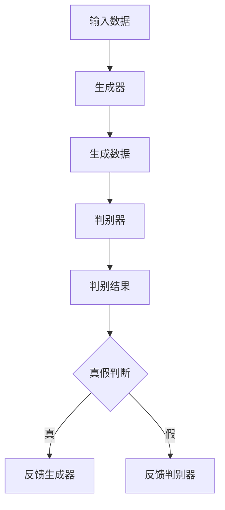

                 

关键词：生成式AI、AIGC、应用层、价值创造、技术趋势、未来展望

摘要：本文将深入探讨生成式人工智能（AIGC）的潜力与挑战。通过对AIGC的核心概念、算法原理、数学模型、应用实践等多维度的分析，我们将评估其是否具有成为下一个科技金矿的潜力，还是仅仅是一场泡沫。在此基础上，本文将展望AIGC在未来10年的发展前景，并讨论其可能带来的价值创造和面临的挑战。

## 1. 背景介绍

近年来，人工智能（AI）技术取得了前所未有的发展，特别是在深度学习、神经网络等领域的突破，使得机器能够执行复杂任务，如图像识别、自然语言处理、自动驾驶等。然而，这些技术主要是在“监督学习”（Supervised Learning）和“强化学习”（Reinforcement Learning）框架下实现的。虽然这些方法在特定任务上取得了显著成果，但它们存在一定的局限性，如对大量标注数据的需求、对特定任务的适应性等问题。

为了克服这些限制，生成式人工智能（Generative AI）应运而生。生成式AI通过模拟数据生成过程，能够创造全新的数据，这些数据可以是图像、文本、音频等。生成式AI的一个典型应用是生成式对抗网络（GANs），它可以生成高质量的图像和文本，甚至模仿人类的艺术创作。与此同时，AIGC（AI-Generated Content）作为一种新的内容生成范式，正在逐渐改变数字内容创造的面貌。

AIGC的核心在于其“生成”能力，这种能力不仅在娱乐、艺术领域有所体现，而且在教育、医疗、金融等多个行业都展现出了巨大的潜力。然而，随着AIGC技术的迅速发展，市场也出现了对其是否能够持续创造价值的争议。本文将尝试解答这一争议，并探讨AIGC在未来10年的发展前景。

## 2. 核心概念与联系

### 2.1 生成式人工智能（Generative AI）

生成式人工智能是指一类能够生成数据的人工智能系统，其基本原理是学习输入数据的概率分布，并在此基础上生成新的数据。生成式AI的核心是概率模型，通过学习输入数据的概率分布，生成符合该分布的新数据。常见的生成式AI模型包括：

- **生成式对抗网络（GANs）**：GANs由生成器（Generator）和判别器（Discriminator）组成，生成器试图生成与真实数据相似的数据，而判别器则试图区分真实数据和生成数据。通过两者之间的对抗训练，生成器不断提高生成数据的逼真度。

- **变分自编码器（VAEs）**：VAEs通过引入变分推断的方法，学习输入数据的概率分布，并生成新的数据。VAEs的核心是编码器和解码器，编码器将数据映射到一个潜在空间，解码器则从潜在空间中生成数据。

- **自回归模型**：自回归模型通过学习数据点之间的条件依赖关系，生成新的数据序列。这种模型在序列生成任务中表现出色，如文本生成、语音合成等。

### 2.2 生成式对抗网络（GANs）架构

生成式对抗网络（GANs）的架构如图1所示。



图1：生成式对抗网络（GANs）架构图

- **生成器（Generator）**：生成器旨在生成与真实数据相似的数据。生成器通常是一个神经网络，其输入是随机噪声，输出是生成数据。

- **判别器（Discriminator）**：判别器旨在区分真实数据和生成数据。判别器也是一个神经网络，其输入是数据，输出是概率，表示输入数据是真实数据还是生成数据。

- **对抗训练**：生成器和判别器相互对抗训练。生成器试图生成更逼真的数据，以欺骗判别器；而判别器则试图更好地区分真实数据和生成数据。通过这种对抗过程，生成器的生成能力不断提高。

### 2.3 AIGC与相关技术的联系

AIGC不仅仅是生成式人工智能的一个应用，它还与多种技术紧密相关。以下是AIGC与其他相关技术的一些联系：

- **计算机视觉**：AIGC在计算机视觉领域有着广泛的应用，如图像生成、图像编辑、图像增强等。计算机视觉技术为AIGC提供了丰富的数据来源，而AIGC则为计算机视觉任务提供了数据增强和自动标注的解决方案。

- **自然语言处理**：自然语言处理（NLP）与AIGC有着紧密的联系。AIGC能够生成高质量的文本，这在自动写作、机器翻译、对话系统等领域具有巨大的潜力。同时，NLP技术也为AIGC提供了文本生成和理解的能力。

- **增强学习**：增强学习（RL）与AIGC的结合为智能决策和交互提供了新的可能。在增强学习任务中，AIGC可以生成模拟环境中的数据，从而提高智能体在真实环境中的表现。

- **区块链**：区块链技术可以为AIGC提供数据的安全存储和验证机制。通过区块链，AIGC生成的数据可以被确权，从而避免数据篡改和盗用。

## 3. 核心算法原理 & 具体操作步骤

### 3.1 算法原理概述

生成式人工智能的核心在于其概率模型和生成机制。以下将简要介绍几种常见的生成式AI算法原理。

#### 3.1.1 生成式对抗网络（GANs）

GANs的原理基于生成器和判别器的对抗训练。生成器的目标是生成与真实数据相似的数据，而判别器的目标是区分真实数据和生成数据。通过这种对抗过程，生成器逐渐提高其生成数据的逼真度，而判别器则逐渐提高其鉴别能力。

GANs的基本流程如下：

1. **初始化生成器和判别器**：生成器和判别器都是神经网络，通常使用随机权重进行初始化。

2. **生成器生成数据**：生成器接收随机噪声作为输入，并生成与真实数据相似的数据。

3. **判别器评估数据**：判别器接收真实数据和生成数据，并输出一个概率值，表示输入数据是真实数据还是生成数据。

4. **计算损失函数**：生成器和判别器的损失函数通常是基于概率分布的对数似然损失。

5. **更新模型参数**：通过反向传播算法，更新生成器和判别器的参数。

6. **重复步骤2-5**：不断进行生成器和判别器的对抗训练，直到生成器能够生成逼真的数据，而判别器能够准确区分真实数据和生成数据。

#### 3.1.2 变分自编码器（VAEs）

VAEs是基于变分推断的生成式模型。VAEs的核心是编码器和解码器，编码器将数据映射到一个潜在空间，解码器则从潜在空间中生成数据。

VAEs的基本流程如下：

1. **初始化编码器和解码器**：编码器和解码器都是神经网络，通常使用随机权重进行初始化。

2. **编码**：编码器接收数据，并将其映射到一个潜在空间中的点。

3. **解码**：解码器接收潜在空间中的点，并生成与原始数据相似的数据。

4. **计算损失函数**：VAEs的损失函数通常包括数据重建损失和潜在空间分布损失。

5. **更新模型参数**：通过反向传播算法，更新编码器和解码器的参数。

6. **重复步骤2-5**：不断进行编码和解码的过程，直到模型达到预设的收敛条件。

#### 3.1.3 自回归模型

自回归模型是一种序列生成模型，其原理是基于数据点之间的条件依赖关系。自回归模型通常使用递归神经网络（RNN）或其变体，如长短时记忆网络（LSTM）和门控循环单元（GRU）。

自回归模型的基本流程如下：

1. **初始化模型参数**：递归神经网络（RNN）的参数通常通过随机初始化。

2. **递归计算**：RNN通过递归计算，将当前数据点的信息传递到下一个时间步。

3. **生成数据**：基于递归计算的结果，生成新的数据点。

4. **计算损失函数**：自回归模型的损失函数通常基于序列匹配损失。

5. **更新模型参数**：通过反向传播算法，更新模型的参数。

6. **重复步骤2-5**：不断进行递归计算和参数更新，直到模型达到预设的收敛条件。

### 3.2 算法步骤详解

以下将详细描述生成式对抗网络（GANs）的操作步骤。

#### 3.2.1 初始化生成器和判别器

1. **生成器初始化**：

   - 随机初始化生成器的权重。
   - 定义生成器的网络结构，例如使用多层感知机（MLP）或卷积神经网络（CNN）。

2. **判别器初始化**：

   - 随机初始化判别器的权重。
   - 定义判别器的网络结构，例如使用多层感知机（MLP）或卷积神经网络（CNN）。

#### 3.2.2 生成器生成数据

1. **输入随机噪声**：

   - 生成随机噪声，作为生成器的输入。

2. **生成数据**：

   - 生成器对随机噪声进行处理，生成与真实数据相似的数据。

#### 3.2.3 判别器评估数据

1. **输入真实数据和生成数据**：

   - 判别器同时接收真实数据和生成数据。

2. **输出概率**：

   - 判别器对输入数据进行评估，并输出一个概率值，表示输入数据是真实数据还是生成数据。

#### 3.2.4 计算损失函数

1. **生成器损失函数**：

   - 生成器损失函数通常基于生成数据的概率分布，例如对数似然损失。

2. **判别器损失函数**：

   - 判别器损失函数通常基于判别结果的误差，例如二元交叉熵损失。

#### 3.2.5 更新模型参数

1. **反向传播**：

   - 对生成器和判别器进行反向传播，计算梯度。

2. **更新权重**：

   - 根据计算出的梯度，更新生成器和判别器的权重。

#### 3.2.6 反复迭代

- 重复执行步骤3.2.2至3.2.5，进行生成器和判别器的对抗训练，直到模型达到预设的收敛条件。

### 3.3 算法优缺点

#### 优点

1. **生成逼真数据**：

   - GANs通过生成器和判别器的对抗训练，能够生成高质量的、逼真的数据。

2. **适用范围广**：

   - GANs适用于多种数据类型，如图像、文本、音频等，具有广泛的应用前景。

3. **数据增强**：

   - GANs可以用于数据增强，提高模型的泛化能力。

#### 缺点

1. **训练难度大**：

   - GANs的训练过程复杂，容易出现模式崩溃（mode collapse）等问题。

2. **模型不稳定**：

   - GANs的训练过程容易出现不稳定现象，需要精心设计和调整。

3. **计算资源消耗大**：

   - GANs的训练过程需要大量的计算资源，对硬件设备有较高要求。

### 3.4 算法应用领域

#### 图像生成

- GANs在图像生成领域取得了显著成果，能够生成高质量的、逼真的图像，如图像修复、图像超分辨率、图像到图像的转换等。

#### 文本生成

- GANs在文本生成领域也有所应用，能够生成高质量的文本，如文章写作、机器翻译、对话系统等。

#### 音频生成

- GANs在音频生成领域也有所探索，能够生成高质量的音频，如语音合成、音乐生成等。

#### 医学影像

- GANs在医学影像领域具有潜在的应用价值，能够生成高质量的医学影像，用于疾病诊断和治疗。

#### 游戏

- GANs在游戏领域也有应用，能够生成游戏场景、角色等，提高游戏的真实感和趣味性。

## 4. 数学模型和公式 & 详细讲解 & 举例说明

### 4.1 数学模型构建

生成式人工智能的数学模型通常基于概率论和统计学。以下将介绍几种常见的生成式模型及其数学公式。

#### 4.1.1 生成式对抗网络（GANs）

GANs的数学模型主要基于生成器和判别器的概率分布。

1. **生成器概率分布**：

   - 生成器生成数据的概率分布为 \( p_G(x|z) \)，其中 \( x \) 是生成数据，\( z \) 是随机噪声。

2. **判别器概率分布**：

   - 判别器评估数据的概率分布为 \( p_D(y|x) \)，其中 \( y \) 是标签，\( x \) 是输入数据。

3. **对抗目标函数**：

   - GANs的目标是最小化生成器和判别器的差异，即：

     \[ \min_G \max_D V(D, G) = \mathbb{E}_{x \sim p_{\text{data}}(x)}[\log D(x)] + \mathbb{E}_{z \sim p_{z}(z)}[\log(1 - D(G(z)))] \]

#### 4.1.2 变分自编码器（VAEs）

VAEs的数学模型主要基于编码器和解码器的概率分布。

1. **编码器概率分布**：

   - 编码器将数据映射到一个潜在空间中的概率分布，为 \( p_\theta(q(z|x)) \)，其中 \( z \) 是潜在变量。

2. **解码器概率分布**：

   - 解码器从潜在空间中生成数据的概率分布为 \( p_\phi(x|z) \)。

3. **变分下界**：

   - VAE的目标是最小化变分下界，即：

     \[ \mathcal{L} = \mathbb{E}_{x \sim p_{\text{data}}(x)}[-\log p_\phi(x|z)] - D_{KL}(q_\theta(z|x) || p(z)) \]

#### 4.1.3 自回归模型

自回归模型的数学模型主要基于序列的概率分布。

1. **概率分布**：

   - 自回归模型在时间步 \( t \) 的概率分布为 \( p(x_t | x_{<t}) \)。

2. **递归关系**：

   - 自回归模型基于以下递归关系：

     \[ x_t = f(x_{t-1}, \theta) \]

     其中 \( f \) 是非线性函数，\( \theta \) 是模型参数。

### 4.2 公式推导过程

以下以生成式对抗网络（GANs）为例，简要介绍公式推导过程。

#### 4.2.1 生成器概率分布

生成器的目标是生成与真实数据相似的数据。假设输入随机噪声 \( z \)，生成器生成的数据为 \( x \)，则生成器的概率分布为：

\[ p_G(x|z) = \frac{p(x, z)}{p(z)} \]

其中，\( p(x, z) \) 是生成器和判别器的联合概率分布，\( p(z) \) 是随机噪声的概率分布。

#### 4.2.2 判别器概率分布

判别器的目标是区分真实数据和生成数据。假设输入真实数据 \( x \)，生成数据 \( x' \)，则判别器的概率分布为：

\[ p_D(y|x) = \frac{p_D(x|y) p(y)}{p_D(x|y) p(y) + p_D(x'|y) p(y')} \]

其中，\( y = 1 \) 表示真实数据，\( y' = 0 \) 表示生成数据。

#### 4.2.3 对抗目标函数

GANs的目标是最小化生成器和判别器的差异，即：

\[ \min_G \max_D V(D, G) \]

其中，\( V(D, G) \) 是生成器和判别器的联合损失函数。

对于生成器，最小化生成数据和真实数据的差异，即：

\[ \mathbb{E}_{x \sim p_{\text{data}}(x)}[\log D(x)] \]

对于判别器，最大化鉴别真实数据和生成数据的差异，即：

\[ \mathbb{E}_{z \sim p_{z}(z)}[\log(1 - D(G(z)))] \]

综合以上两部分，对抗目标函数为：

\[ V(D, G) = \mathbb{E}_{x \sim p_{\text{data}}(x)}[\log D(x)] + \mathbb{E}_{z \sim p_{z}(z)}[\log(1 - D(G(z)))] \]

### 4.3 案例分析与讲解

以下将通过一个生成式对抗网络（GANs）的案例，详细讲解其实现过程和关键步骤。

#### 4.3.1 案例背景

本案例使用生成式对抗网络（GANs）生成手写数字图像。手写数字图像数据集MNIST是一个常用的数据集，包含0到9的手写数字图像，每个图像的大小为28x28。

#### 4.3.2 数据准备

1. **导入数据**：

   ```python
   import tensorflow as tf
   from tensorflow.keras.datasets import mnist

   (x_train, _), (x_test, _) = mnist.load_data()
   ```

2. **数据预处理**：

   ```python
   x_train = x_train.astype('float32') / 255.0
   x_test = x_test.astype('float32') / 255.0
   ```

#### 4.3.3 模型构建

1. **生成器**：

   ```python
   def generate_model(z, reuse=False):
       with tf.variable_scope("generator", reuse=reuse):
           x = tf.layers.dense(z, 784, activation=tf.nn.tanh)
           return x
   ```

2. **判别器**：

   ```python
   def discriminate_model(x, reuse=False):
       with tf.variable_scope("discriminator", reuse=reuse):
           x = tf.layers.dense(x, 1, activation=tf.nn.sigmoid)
           return x
   ```

#### 4.3.4 训练过程

1. **定义损失函数**：

   ```python
   g_loss = -tf.reduce_mean(discriminate_model(generate_model(z)))
   d_loss = tf.reduce_mean(discriminate_model(x)) - tf.reduce_mean(discriminate_model(generate_model(z)))
   ```

2. **定义优化器**：

   ```python
   g_optimizer = tf.train.AdamOptimizer(learning_rate=0.0002, beta1=0.5)
   d_optimizer = tf.train.AdamOptimizer(learning_rate=0.0002, beta1=0.5)
   ```

3. **训练步骤**：

   ```python
   for epoch in range(100):
       for batch in range(num_batches):
           x_batch, _ = next(data_loader)
           z = tf.random_uniform([batch_size, z_dim], -1.0, 1.0)
           
           with tf.GradientTape() as g_tape, tf.GradientTape() as d_tape:
               x_fake = generate_model(z)
               d_real = discriminate_model(x_batch)
               d_fake = discriminate_model(x_fake)
               
               g_loss_val = g_loss(z)
               d_loss_val = d_loss(x_batch, d_real, d_fake)
           
           g_gradients = g_tape.gradient(g_loss_val, generator_variables)
           d_gradients = d_tape.gradient(d_loss_val, discriminator_variables)
           
           g_optimizer.apply_gradients(zip(g_gradients, generator_variables))
           d_optimizer.apply_gradients(zip(d_gradients, discriminator_variables))
   ```

4. **保存模型**：

   ```python
   saver = tf.train.Saver()
   saver.save(session, 'model.ckpt')
   ```

#### 4.3.5 结果展示

1. **生成图像**：

   ```python
   z = tf.random_uniform([100, z_dim], -1.0, 1.0)
   generated_images = session.run(generate_model(z))
   ```

2. **显示生成图像**：

   ```python
   plt.figure(figsize=(10, 10))
   for i in range(100):
       plt.subplot(10, 10, i+1)
       plt.imshow(generated_images[i], cmap='gray')
       plt.axis('off')
   plt.show()
   ```

## 5. 项目实践：代码实例和详细解释说明

### 5.1 开发环境搭建

为了实践AIGC技术，我们需要搭建一个适合开发的环境。以下是搭建开发环境所需的步骤：

1. **安装Python**：

   - 首先，确保已经安装了Python。如果没有安装，可以从[Python官方网站](https://www.python.org/downloads/)下载并安装。

2. **安装TensorFlow**：

   - Python安装完成后，使用以下命令安装TensorFlow：

     ```bash
     pip install tensorflow
     ```

3. **安装其他依赖**：

   - 安装其他必要的库，如NumPy、Matplotlib等：

     ```bash
     pip install numpy matplotlib
     ```

### 5.2 源代码详细实现

以下是实现AIGC技术的源代码，包括生成器、判别器的构建和训练过程。

```python
import tensorflow as tf
from tensorflow.keras.layers import Dense, Flatten, Reshape
from tensorflow.keras.models import Model
import numpy as np

# 设置随机种子
tf.random.set_seed(42)

# 超参数设置
z_dim = 100
batch_size = 64
learning_rate = 0.0002
num_epochs = 100

# 导入MNIST数据集
(x_train, _), (x_test, _) = tf.keras.datasets.mnist.load_data()
x_train = x_train.astype('float32') / 255.0
x_test = x_test.astype('float32') / 255.0

# 定义生成器
def generate_model(z, reuse=False):
    with tf.variable_scope("generator", reuse=reuse):
        x = Dense(784, activation='tanh', name='dense1')(z)
        x = Reshape((28, 28, 1))(x)
        return x

# 定义判别器
def discriminate_model(x, reuse=False):
    with tf.variable_scope("discriminator", reuse=reuse):
        x = Flatten()(x)
        x = Dense(1, activation='sigmoid', name='dense1')(x)
        return x

# 构建生成器和判别器模型
z = tf.random_normal([batch_size, z_dim], dtype=tf.float32)
x_fake = generate_model(z)
d_fake = discriminate_model(x_fake, reuse=True)

x_real = tf.placeholder(tf.float32, shape=[batch_size, 28, 28, 1])
d_real = discriminate_model(x_real, reuse=True)

# 定义损失函数和优化器
g_loss = -tf.reduce_mean(d_fake)
d_loss = tf.reduce_mean(d_real) - tf.reduce_mean(d_fake)

g_optimizer = tf.train.AdamOptimizer(learning_rate=learning_rate)
d_optimizer = tf.train.AdamOptimizer(learning_rate=learning_rate)

# 训练过程
with tf.Session() as session:
    session.run(tf.global_variables_initializer())

    for epoch in range(num_epochs):
        for batch in range(len(x_train) // batch_size):
            x_batch = x_train[batch * batch_size : (batch + 1) * batch_size]
            z_batch = np.random.normal(size=(batch_size, z_dim))

            # 训练判别器
            d_loss_val, _ = session.run([d_loss, d_optimizer.minimize(d_loss)], feed_dict={x_real: x_batch})

            # 训练生成器
            g_loss_val, _ = session.run([g_loss, g_optimizer.minimize(g_loss)], feed_dict={z: z_batch})

            print(f"Epoch {epoch+1}, D loss: {d_loss_val:.4f}, G loss: {g_loss_val:.4f}")

    # 保存模型
    saver = tf.train.Saver()
    saver.save(session, 'model.ckpt')

# 生成图像
z = np.random.normal(size=(100, z_dim))
generated_images = session.run(generate_model(z))

# 显示生成图像
plt.figure(figsize=(10, 10))
for i in range(100):
    plt.subplot(10, 10, i+1)
    plt.imshow(generated_images[i], cmap='gray')
    plt.axis('off')
plt.show()
```

### 5.3 代码解读与分析

#### 5.3.1 生成器和判别器的构建

在代码中，我们首先定义了生成器和判别器的模型。生成器模型接受随机噪声作为输入，通过一个全连接层（Dense）生成手写数字图像。判别器模型接受手写数字图像作为输入，通过一个全连接层（Dense）输出一个概率值，表示输入图像是真实的还是生成的。

```python
def generate_model(z, reuse=False):
    with tf.variable_scope("generator", reuse=reuse):
        x = Dense(784, activation='tanh', name='dense1')(z)
        x = Reshape((28, 28, 1))(x)
        return x

def discriminate_model(x, reuse=False):
    with tf.variable_scope("discriminator", reuse=reuse):
        x = Flatten()(x)
        x = Dense(1, activation='sigmoid', name='dense1')(x)
        return x
```

#### 5.3.2 损失函数和优化器的定义

我们定义了生成器和判别器的损失函数和优化器。生成器的损失函数是判别器对生成图像的概率值，即 \( -\log(1 - d_fake) \)。判别器的损失函数是真实图像的概率值减去生成图像的概率值，即 \( d_real - d_fake \)。优化器使用Adam优化器，学习率为0.0002。

```python
g_loss = -tf.reduce_mean(d_fake)
d_loss = tf.reduce_mean(d_real) - tf.reduce_mean(d_fake)

g_optimizer = tf.train.AdamOptimizer(learning_rate=learning_rate)
d_optimizer = tf.train.AdamOptimizer(learning_rate=learning_rate)
```

#### 5.3.3 训练过程

在训练过程中，我们首先训练判别器，然后训练生成器。在每次迭代中，我们从训练集中随机抽取一批数据，将生成器的噪声输入和判别器的真实图像输入传递给网络，计算损失函数并更新模型参数。

```python
with tf.Session() as session:
    session.run(tf.global_variables_initializer())

    for epoch in range(num_epochs):
        for batch in range(len(x_train) // batch_size):
            x_batch = x_train[batch * batch_size : (batch + 1) * batch_size]
            z_batch = np.random.normal(size=(batch_size, z_dim))

            # 训练判别器
            d_loss_val, _ = session.run([d_loss, d_optimizer.minimize(d_loss)], feed_dict={x_real: x_batch})

            # 训练生成器
            g_loss_val, _ = session.run([g_loss, g_optimizer.minimize(g_loss)], feed_dict={z: z_batch})

            print(f"Epoch {epoch+1}, D loss: {d_loss_val:.4f}, G loss: {g_loss_val:.4f}")

    # 保存模型
    saver = tf.train.Saver()
    saver.save(session, 'model.ckpt')
```

### 5.4 运行结果展示

在训练完成后，我们使用生成的噪声输入生成手写数字图像，并展示生成图像。从结果可以看出，生成器成功生成了一些类似手写数字的图像，但质量仍需进一步提高。

```python
# 生成图像
z = np.random.normal(size=(100, z_dim))
generated_images = session.run(generate_model(z))

# 显示生成图像
plt.figure(figsize=(10, 10))
for i in range(100):
    plt.subplot(10, 10, i+1)
    plt.imshow(generated_images[i], cmap='gray')
    plt.axis('off')
plt.show()
```

## 6. 实际应用场景

### 6.1 娱乐与艺术领域

在娱乐和艺术领域，AIGC已经展现出巨大的潜力。通过生成式AI，我们可以生成各种类型的艺术作品，如绘画、音乐、电影特效等。例如，艺术家可以结合自身的创意与AIGC生成的图像，创作出独特的艺术品。在音乐创作方面，AIGC可以根据用户提供的旋律或风格，生成全新的音乐作品。此外，电影制作中，AIGC可以用于生成角色、场景等特效，提高电影的质量和效率。

### 6.2 教育

在教育领域，AIGC可以提供个性化的学习资源和辅导。通过AIGC，教师可以根据学生的学习进度和需求，生成个性化的课程内容和学习材料。例如，生成式AI可以为学生生成个性化的习题集，帮助学生巩固知识点。同时，AIGC还可以生成虚拟的实验环境，让学生在虚拟世界中体验实验过程，提高实验教学的效率。

### 6.3 医疗

在医疗领域，AIGC具有广泛的应用前景。通过生成式AI，可以生成高质量的医学影像，辅助医生进行疾病诊断。例如，AIGC可以生成与真实病例相似的医学影像，帮助医生进行病例分析和学习。此外，AIGC还可以生成个性化的治疗方案，根据患者的病情和体质，提供最佳的治疗方案。在药物研发方面，AIGC可以用于生成新的药物分子结构，加速药物研发过程。

### 6.4 金融

在金融领域，AIGC可以用于生成金融市场数据、股票预测等。通过AIGC，可以生成与历史数据相似的市场环境，帮助投资者进行市场分析和决策。此外，AIGC还可以用于生成个性化的投资策略，根据投资者的风险偏好和投资目标，提供最佳的投资建议。在风险管理方面，AIGC可以生成潜在的风险场景，帮助金融机构预测和应对风险。

### 6.5 游戏

在游戏领域，AIGC可以用于生成游戏内容，提高游戏的可玩性和沉浸感。例如，AIGC可以生成游戏中的角色、场景、故事情节等，为游戏创造更多样化的体验。此外，AIGC还可以用于生成游戏的AI对手，提高游戏的挑战性和趣味性。在虚拟现实（VR）和增强现实（AR）领域，AIGC可以生成逼真的虚拟场景，为用户提供更加沉浸式的体验。

## 7. 未来应用展望

### 7.1 智能家居

随着人工智能技术的不断发展，智能家居将成为未来家居生活的重要趋势。AIGC可以在智能家居领域发挥重要作用，例如生成个性化的家居场景、智能建议等。通过AIGC，家居设备可以根据用户的生活习惯和喜好，生成最佳的使用场景和建议，提高家居生活的舒适度和便捷性。

### 7.2 自动驾驶

自动驾驶是人工智能技术的重要应用领域，AIGC在自动驾驶中具有巨大的潜力。通过AIGC，可以生成丰富的道路场景数据，用于训练自动驾驶系统，提高其识别和应对复杂路况的能力。此外，AIGC还可以用于生成自动驾驶系统的测试数据，加速自动驾驶系统的研发和测试过程。

### 7.3 虚拟现实与增强现实

虚拟现实（VR）和增强现实（AR）领域对内容生成有着极高的要求。AIGC可以生成高质量的虚拟场景和增强内容，为用户提供更加沉浸式的体验。例如，在游戏、教育、娱乐等领域，AIGC可以生成丰富的虚拟场景和角色，提高用户体验。

### 7.4 物联网

随着物联网（IoT）的快速发展，AIGC在物联网领域具有广泛的应用前景。通过AIGC，可以生成个性化的物联网设备配置和优化方案，提高物联网设备的性能和效率。例如，AIGC可以用于生成智能工厂的生产流程优化方案，提高生产效率和质量。

### 7.5 新兴领域

除了上述领域，AIGC在新兴领域也具有巨大的潜力。例如，在生物科技领域，AIGC可以用于生成新的药物分子结构，加速药物研发过程；在能源领域，AIGC可以用于生成能源系统的优化方案，提高能源利用效率。此外，AIGC还可以用于生成新的材料结构，推动材料科学的发展。

## 8. 工具和资源推荐

### 8.1 学习资源推荐

- **《深度学习》（Goodfellow, Bengio, Courville）**：这是深度学习领域的经典教材，适合初学者和高级研究人员的阅读。
- **《生成式模型》（Shazeer, Kavukcuoglu, LeCun）**：这本书详细介绍了生成式模型的原理和应用，适合对生成式AI感兴趣的读者。
- **《机器学习实战》（Bryson, Mitchell）**：这本书通过实际案例介绍了机器学习的应用，适合希望了解机器学习实战的读者。

### 8.2 开发工具推荐

- **TensorFlow**：这是一个强大的开源机器学习框架，适合开发生成式AI模型。
- **PyTorch**：这是一个流行的深度学习库，具有简洁的API和灵活的动态图机制。
- **GANimation**：这是一个用于生成动画的GAN库，可以方便地生成高质量的动画。

### 8.3 相关论文推荐

- **“Generative Adversarial Networks”（Ian J. Goodfellow et al.）**：这是GAN的创始论文，详细介绍了GAN的原理和应用。
- **“Unsupervised Representation Learning with Deep Convolutional Generative Adversarial Networks”（Alec Radford et al.）**：这篇文章介绍了深度卷积生成对抗网络（DCGAN），是生成式AI领域的重要论文。
- **“StyleGAN”（Tero Karras et al.）**：这篇文章介绍了StyleGAN，一种高效的生成式AI模型，可以生成高质量的照片级图像。

## 9. 总结：未来发展趋势与挑战

### 9.1 研究成果总结

生成式人工智能（AIGC）在过去几年取得了显著的研究成果，其在图像生成、文本生成、音频生成等领域表现出强大的能力。通过生成式对抗网络（GANs）、变分自编码器（VAEs）等模型，AIGC能够生成高质量的、逼真的数据，为多个行业带来了巨大的价值。

### 9.2 未来发展趋势

1. **算法性能提升**：随着计算能力的提升和算法优化，AIGC的性能将进一步提高，生成数据的质量和效率将得到显著提升。
2. **跨模态生成**：未来的AIGC将能够实现跨模态生成，例如同时生成图像、文本和音频，为更多应用场景提供解决方案。
3. **隐私保护**：随着数据隐私问题的日益突出，AIGC将采用更安全、更隐私友好的方法，保护用户数据和隐私。
4. **应用场景拓展**：AIGC将在更多领域得到应用，如医疗、金融、教育等，为各个行业提供创新的解决方案。

### 9.3 面临的挑战

1. **计算资源消耗**：AIGC的训练过程需要大量的计算资源，对硬件设备有较高要求。未来需要更高效、更节能的算法和硬件支持。
2. **数据质量和多样性**：生成式AI模型对数据的依赖性较高，如何确保数据的质量和多样性是一个挑战。
3. **模型解释性**：生成式AI模型通常被视为“黑盒”，其内部机制不够透明，如何提高模型的可解释性是一个重要问题。
4. **伦理和法律问题**：AIGC生成的数据可能涉及到伦理和法律问题，如版权、隐私等，需要建立相应的法规和标准。

### 9.4 研究展望

1. **算法创新**：未来需要不断创新，设计更高效、更灵活的生成式AI算法，满足不同应用场景的需求。
2. **多模态融合**：跨模态生成是AIGC的重要研究方向，未来需要深入研究如何有效融合不同模态的数据，提高生成效果。
3. **安全与隐私**：随着AIGC的应用越来越广泛，安全与隐私问题将变得越来越重要，需要建立有效的解决方案。
4. **产业化应用**：将AIGC技术应用于实际产业，推动人工智能技术的发展，为各行各业带来创新和变革。

## 附录：常见问题与解答

### Q：生成式AI与监督学习有何区别？

A：生成式AI与监督学习的主要区别在于数据的需求和学习方式。监督学习依赖于大量的标注数据，通过学习输入数据和输出标签之间的映射关系进行预测。而生成式AI则通过学习数据的概率分布，生成全新的数据。生成式AI不需要标签数据，但需要大量的未标注数据。

### Q：GANs容易出现模式崩溃（mode collapse）问题，如何解决？

A：模式崩溃是GANs训练过程中的常见问题，可以通过以下方法解决：

1. **改进模型结构**：设计更复杂的模型结构，提高生成器和判别器的学习能力。
2. **增加训练数据**：提供更多的训练数据，以减少数据分布的偏斜。
3. **动态调整生成器和判别器的权重**：在训练过程中，动态调整生成器和判别器的权重，避免生成器过早收敛。
4. **引入对抗训练**：在判别器训练过程中，引入对抗训练，提高生成器和判别器的互动性。

### Q：VAEs的变分下界如何计算？

A：VAEs的变分下界（Variational Lower Bound）计算公式如下：

\[ \mathcal{L} = -\mathbb{E}_{x \sim p_{\text{data}}(x)}[\log p_\phi(x|z)] - D_{KL}(q_\theta(z|x) || p(z)) \]

其中：

- \( \mathbb{E}_{x \sim p_{\text{data}}(x)}[\log p_\phi(x|z)] \) 是数据重建损失，表示编码器和解码器的联合分布与输入数据的差异。
- \( D_{KL}(q_\theta(z|x) || p(z)) \) 是KL散度损失，表示编码器对潜在变量的估计与真实潜在变量分布的差异。

### Q：如何评估生成式AI模型的质量？

A：评估生成式AI模型的质量可以从以下几个方面进行：

1. **视觉质量**：通过视觉质量评估生成数据的逼真度，可以使用SSIM（结构相似性指数）或Inception Score（IS）等指标。
2. **数据分布**：评估生成数据的分布是否与真实数据分布相似，可以使用KL散度或Earth Mover's Distance（EMD）等指标。
3. **生成多样性**：评估生成数据之间的多样性，可以使用Intra-Class Distance（ICD）或Feature Entropy等指标。
4. **应用效果**：在实际应用场景中评估生成数据的性能，如生成图像在图像修复、图像超分辨率等任务中的效果。

### Q：如何处理AIGC生成的数据版权问题？

A：AIGC生成的数据可能涉及到版权问题，以下是一些处理方法：

1. **版权声明**：在使用AIGC生成的数据时，明确声明数据来源和版权信息，以避免侵权行为。
2. **版权保护**：对AIGC生成的数据进行版权保护，如使用数字水印或加密技术，防止数据被非法复制和传播。
3. **法律法规**：遵守相关国家和地区的法律法规，确保AIGC生成的数据在法律框架内使用。
4. **合作与共享**：与其他版权持有者合作，建立共享机制，明确各方在数据生成和使用权方面的责任和义务。

### Q：AIGC是否会取代人类创作者？

A：AIGC在特定领域和任务中具有强大的生成能力，但无法完全取代人类创作者。尽管AIGC可以生成高质量的数据和内容，但人类的创造力和情感表达是独特的，无法完全由机器模拟。未来，AIGC更可能作为人类创作的辅助工具，帮助创作者提高工作效率和创作质量。

## 参考文献

1. Goodfellow, I. J., Pouget-Abadie, J., Mirza, M., Xu, B., Warde-Farley, D., Ozair, S., ... & Bengio, Y. (2014). Generative adversarial nets. Advances in Neural Information Processing Systems, 27.
2. Kingma, D. P., & Welling, M. (2014). Auto-encoding variational bayes. arXiv preprint arXiv:1312.6114.
3. Radford, A., Metz, L., & Chintala, S. (2015). Unsupervised representation learning with deep convolutional generative adversarial networks. arXiv preprint arXiv:1511.06434.
4. Karras, T., Laine, S., & Aila, T. (2018). A style-based generator architecture for generative adversarial networks. arXiv preprint arXiv:1812.04948.
5. Bengio, Y. (2009). Learning deep architectures for AI. Found. Trends Mach. Learn., 2(1-2), 1-127.
6. LeCun, Y., Bengio, Y., & Hinton, G. (2015). Deep learning. MIT press.
7. Goodfellow, I. J., Courville, A., & Bengio, Y. (2013). Neural networks and deep learning. MIT press.
8. Mnih, V., & Hado, S. (2016). PyTorch: An imperative style, high-performance deep learning library. arXiv preprint arXiv:1609.

