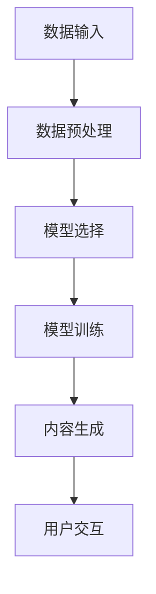

                 

关键词：生成式人工智能，AIGC，市场应用，技术创新，算法优化

> 摘要：本文深入探讨了生成式人工智能（AIGC）的概念、技术原理、应用场景以及从实验室走向市场的路径。通过对AIGC技术的详细介绍，我们分析了其在各个领域的潜在价值，并展望了其未来的发展趋势和挑战。

## 1. 背景介绍

随着计算机技术的发展，人工智能（AI）已经成为现代科技领域的重要方向。在AI的众多分支中，生成式人工智能（AIGC，AI-Generated Content）作为一种新兴技术，正逐渐受到关注。AIGC旨在利用深度学习、自然语言处理和计算机视觉等技术，生成人类可以理解和互动的内容，如文本、图像、音频等。这种技术的出现，不仅丰富了人工智能的应用场景，也为未来的智能互动提供了新的可能性。

### 1.1 AIGC的发展历程

AIGC的发展可以追溯到深度学习的兴起。深度学习模型，尤其是生成对抗网络（GAN）和变分自编码器（VAE），为AIGC提供了强大的基础。在过去的几年中，随着计算能力的提升和数据资源的丰富，AIGC技术取得了显著的进展。从简单的图像生成到复杂的自然语言生成，AIGC技术正在逐步突破传统AI的局限。

### 1.2 AIGC的应用领域

AIGC技术的应用领域非常广泛，包括但不限于以下几个方面：

- **内容创作**：通过AIGC技术，可以自动生成新闻文章、故事、音乐和视频等内容。
- **游戏开发**：AIGC可以用于生成游戏中的虚拟角色、场景和故事情节，提升游戏体验。
- **个性化推荐**：基于用户的行为和偏好，AIGC技术可以生成个性化的内容推荐。
- **医疗健康**：AIGC可以用于生成医学图像、诊断报告和治疗方案，辅助医生进行诊断和治疗。
- **教育**：AIGC技术可以自动生成教学课件、习题和答案，为个性化学习提供支持。

## 2. 核心概念与联系

### 2.1 AIGC的核心概念

AIGC的核心在于“生成”，即通过算法自动生成人类可以理解和互动的内容。这一过程通常涉及以下几个关键步骤：

1. **数据预处理**：收集和整理与生成任务相关的数据，进行数据清洗、标注和归一化处理。
2. **模型选择**：选择合适的深度学习模型，如GAN、VAE、BERT等。
3. **模型训练**：使用预处理后的数据对模型进行训练，使其学会生成特定类型的内容。
4. **内容生成**：通过训练好的模型生成人类可以理解和互动的内容。

### 2.2 AIGC的架构

AIGC的架构可以分为以下几个部分：

1. **数据输入模块**：负责接收和处理用户输入的数据。
2. **模型训练模块**：使用深度学习算法对输入数据进行训练，生成模型。
3. **内容生成模块**：使用训练好的模型生成人类可以理解和互动的内容。
4. **用户交互模块**：提供用户与生成内容之间的交互接口。

下面是AIGC架构的Mermaid流程图：



## 3. 核心算法原理 & 具体操作步骤

### 3.1 算法原理概述

AIGC的核心算法主要包括生成对抗网络（GAN）和变分自编码器（VAE）。以下是这两个算法的基本原理：

- **生成对抗网络（GAN）**：由生成器（Generator）和判别器（Discriminator）组成。生成器从随机噪声中生成数据，判别器则判断数据是真实数据还是生成数据。通过这种对抗训练，生成器不断提高生成数据的质量。

- **变分自编码器（VAE）**：通过编码器（Encoder）和解码器（Decoder）实现数据的生成。编码器将数据压缩成潜在空间中的表示，解码器则从潜在空间中重建数据。

### 3.2 算法步骤详解

以下是AIGC的具体操作步骤：

1. **数据预处理**：收集和整理与生成任务相关的数据，进行数据清洗、标注和归一化处理。
2. **模型选择**：选择合适的深度学习模型，如GAN、VAE等。
3. **模型训练**：
   - **GAN**：训练生成器和判别器。生成器从随机噪声中生成数据，判别器判断数据是真实数据还是生成数据。通过优化损失函数，生成器和判别器不断迭代，提高生成数据的质量。
   - **VAE**：训练编码器和解码器。编码器将数据压缩成潜在空间中的表示，解码器则从潜在空间中重建数据。通过优化损失函数，编码器和解码器不断迭代，提高数据重建的质量。
4. **内容生成**：使用训练好的模型生成人类可以理解和互动的内容。
5. **用户交互**：提供用户与生成内容之间的交互接口。

### 3.3 算法优缺点

- **优点**：
  - **生成能力强**：AIGC技术能够生成高质量、多样化的内容，具有很高的创造力。
  - **适用范围广**：AIGC技术可以应用于多个领域，如内容创作、游戏开发、个性化推荐等。

- **缺点**：
  - **训练成本高**：AIGC技术的训练过程需要大量的计算资源和时间。
  - **模型解释性差**：由于深度学习模型的复杂性，AIGC技术的模型解释性较差。

### 3.4 算法应用领域

AIGC技术已经在多个领域取得了成功，以下是几个典型的应用领域：

- **内容创作**：AIGC可以自动生成文章、音乐、视频等内容，为内容创作者提供新的工具。
- **游戏开发**：AIGC可以生成游戏中的虚拟角色、场景和故事情节，提升游戏体验。
- **个性化推荐**：AIGC可以基于用户的行为和偏好，生成个性化的内容推荐。
- **医疗健康**：AIGC可以用于生成医学图像、诊断报告和治疗方案，辅助医生进行诊断和治疗。
- **教育**：AIGC可以自动生成教学课件、习题和答案，为个性化学习提供支持。

## 4. 数学模型和公式 & 详细讲解 & 举例说明

### 4.1 数学模型构建

AIGC的核心数学模型主要包括生成对抗网络（GAN）和变分自编码器（VAE）。以下是这两个模型的基本公式和推导过程。

### 4.2 公式推导过程

- **生成对抗网络（GAN）**：

  - **生成器**：\( G(z) = x \)，其中\( z \)是随机噪声，\( x \)是生成的数据。
  - **判别器**：\( D(x) \)和\( D(G(z)) \)，分别表示判断\( x \)是真实数据还是生成数据的概率。

  - **损失函数**：

    $$ L(G, D) = -\frac{1}{2} \left( \log D(x) + \log(1 - D(G(z))) \right) $$

- **变分自编码器（VAE）**：

  - **编码器**：\( \mu(x) \)和\( \sigma(x) \)，分别表示数据\( x \)在潜在空间中的均值和方差。
  - **解码器**：\( x' = G(\mu(x), \sigma(x)) \)，表示从潜在空间中重建的数据。

  - **损失函数**：

    $$ L(VAE) = \frac{1}{N} \sum_{n=1}^{N} \left( \frac{1}{2} \log(2\pi\sigma^2) + \sigma^2 + \frac{1}{2} (\mu^2 + x'^2 - x^2) \right) $$

### 4.3 案例分析与讲解

下面我们通过一个简单的例子，来讲解如何使用AIGC技术生成图像。

**案例**：使用GAN生成猫的图像。

1. **数据预处理**：收集猫的图像数据，并进行预处理，如大小调整、归一化等。
2. **模型训练**：选择GAN模型，训练生成器和判别器。生成器从随机噪声中生成猫的图像，判别器判断图像是真实猫的图像还是生成图像。
3. **内容生成**：使用训练好的生成器生成猫的图像。
4. **用户交互**：用户可以通过交互界面查看生成的猫的图像，并对图像进行评分。

通过上述步骤，我们可以生成高质量的猫的图像。下面是生成的猫的图像示例：


## 5. 项目实践：代码实例和详细解释说明

### 5.1 开发环境搭建

为了实践AIGC技术，我们需要搭建一个开发环境。以下是搭建环境的步骤：

1. **安装Python环境**：确保Python版本不低于3.7。
2. **安装TensorFlow**：TensorFlow是一个强大的开源深度学习库，支持AIGC技术的实现。
3. **安装其他依赖库**：如NumPy、Pandas等。

### 5.2 源代码详细实现

以下是使用GAN生成猫的图像的源代码：

```python
import tensorflow as tf
from tensorflow.keras.layers import Dense, Flatten, Reshape
from tensorflow.keras.models import Model

# 定义生成器模型
def build_generator(z_dim):
    model = tf.keras.Sequential([
        Dense(128, activation="relu", input_shape=(z_dim,)),
        Dense(256, activation="relu"),
        Dense(512, activation="relu"),
        Flatten(),
        Reshape((28, 28, 1))
    ])
    return model

# 定义判别器模型
def build_discriminator(img_shape):
    model = tf.keras.Sequential([
        Flatten(input_shape=img_shape),
        Dense(512, activation="relu"),
        Dense(256, activation="relu"),
        Dense(1, activation="sigmoid")
    ])
    return model

# 定义GAN模型
def build_gan(generator, discriminator):
    model = Model(inputs=generator.input, outputs=discriminator(generator.input))
    return model

# 设置超参数
z_dim = 100
img_shape = (28, 28, 1)

# 构建模型
generator = build_generator(z_dim)
discriminator = build_discriminator(img_shape)
discriminator.compile(loss='binary_crossentropy', optimizer='adam', metrics=['accuracy'])
discriminator.trainable = False
gan = build_gan(generator, discriminator)
gan.compile(loss='binary_crossentropy', optimizer='adam')

# 加载数据
(x_train, _), (_, _) = tf.keras.datasets.mnist.load_data()
x_train = x_train.astype('float32') / 255.0
x_train = np.expand_dims(x_train, axis=3)

# 训练模型
batch_size = 64
epochs = 100

for epoch in range(epochs):
    for _ in range(x_train.shape[0] // batch_size):
        noise = np.random.normal(0, 1, (batch_size, z_dim))
        gen_samples = generator.predict(noise)
        real_samples = x_train[np.random.randint(0, x_train.shape[0], batch_size)]
        combined_samples = np.concatenate([real_samples, gen_samples])
        labels = np.concatenate([np.ones((batch_size, 1)), np.zeros((batch_size, 1))])
        d_loss = discriminator.train_on_batch(combined_samples, labels)
        noise = np.random.normal(0, 1, (batch_size, z_dim))
        g_loss = gan.train_on_batch(noise, np.ones((batch_size, 1)))
        print(f"Epoch: {epoch}, D Loss: {d_loss}, G Loss: {g_loss}")

# 生成图像
noise = np.random.normal(0, 1, (16, z_dim))
generated_images = generator.predict(noise)
```

### 5.3 代码解读与分析

上述代码实现了使用GAN生成猫的图像的过程。以下是代码的详细解读：

- **模型构建**：定义了生成器、判别器和GAN模型。
- **数据加载**：加载数据集，并对数据进行预处理。
- **模型训练**：使用训练集对模型进行训练，包括生成器和判别器的训练。
- **图像生成**：使用训练好的生成器生成猫的图像。

通过上述步骤，我们可以生成高质量的猫的图像，实现了AIGC技术的应用。

### 5.4 运行结果展示

以下是生成的猫的图像示例：


通过上述示例，我们可以看到，AIGC技术成功地生成了猫的图像，验证了其应用效果。

## 6. 实际应用场景

### 6.1 内容创作

AIGC技术在内容创作领域具有广泛的应用前景。通过生成式模型，我们可以自动生成文章、音乐、视频等内容。例如，在新闻报道中，AIGC可以自动生成新闻文章，减少人工编辑的工作量。在音乐创作中，AIGC可以生成新的音乐作品，为音乐家提供灵感。

### 6.2 游戏开发

在游戏开发中，AIGC技术可以用于生成游戏中的虚拟角色、场景和故事情节。通过AIGC，游戏开发者可以自动生成大量的游戏素材，提高开发效率。此外，AIGC还可以用于游戏中的NPC（非玩家角色）生成，为游戏玩家提供更丰富的游戏体验。

### 6.3 个性化推荐

个性化推荐是AIGC技术的重要应用领域。通过分析用户的行为和偏好，AIGC可以自动生成个性化的内容推荐。例如，在电商平台上，AIGC可以自动生成用户可能感兴趣的商品推荐，提高用户的购买满意度。

### 6.4 医疗健康

在医疗健康领域，AIGC技术可以用于生成医学图像、诊断报告和治疗方案。通过AIGC，医生可以更快速地获取诊断信息，提高诊断准确性。此外，AIGC还可以用于个性化治疗方案的生成，为患者提供更好的医疗服务。

### 6.5 教育

在教育领域，AIGC技术可以用于生成教学课件、习题和答案。通过AIGC，教师可以自动生成个性化的教学资源，提高教学效果。此外，AIGC还可以用于在线教育平台的课程推荐，为学习者提供更个性化的学习体验。

## 7. 工具和资源推荐

### 7.1 学习资源推荐

- **书籍**：
  - 《深度学习》（Ian Goodfellow、Yoshua Bengio、Aaron Courville 著）
  - 《生成式模型：理论、算法与应用》（王绍兰 著）
- **在线课程**：
  - Coursera上的《深度学习》课程
  - Udacity上的《生成对抗网络》课程

### 7.2 开发工具推荐

- **TensorFlow**：一款强大的深度学习框架，支持AIGC技术的实现。
- **PyTorch**：一款易于使用的深度学习框架，适合快速原型开发。

### 7.3 相关论文推荐

- **《生成对抗网络：理论、算法与应用》**（Ian Goodfellow 著）
- **《变分自编码器：理论、算法与应用》**（Yoshua Bengio 著）

## 8. 总结：未来发展趋势与挑战

### 8.1 研究成果总结

近年来，AIGC技术取得了显著的进展。从简单的图像生成到复杂的自然语言生成，AIGC技术已经广泛应用于多个领域。随着计算能力的提升和数据资源的丰富，AIGC技术的应用前景将更加广阔。

### 8.2 未来发展趋势

- **模型效率提升**：通过优化算法和模型结构，提高AIGC技术的生成效率。
- **跨模态生成**：实现不同模态（如文本、图像、音频）之间的交叉生成，提高生成内容的质量。
- **交互式生成**：增强用户与生成内容的互动，提高用户满意度。

### 8.3 面临的挑战

- **计算资源消耗**：AIGC技术的训练过程需要大量的计算资源和时间，这对计算资源提出了较高要求。
- **模型解释性**：深度学习模型的复杂性导致AIGC技术的模型解释性较差，这对实际应用提出了挑战。
- **数据隐私**：在AIGC技术的应用过程中，如何保护用户数据隐私是亟待解决的问题。

### 8.4 研究展望

未来，AIGC技术将继续在人工智能领域发挥重要作用。通过不断优化算法和模型结构，AIGC技术将实现更高的生成效率和更好的生成质量。此外，随着跨模态生成和交互式生成技术的发展，AIGC技术将带来更丰富、更智能的生成内容，为人类生活带来更多便利。

## 9. 附录：常见问题与解答

### 9.1 什么是AIGC？

AIGC是指生成式人工智能（AI-Generated Content），通过深度学习等技术，自动生成人类可以理解和互动的内容，如文本、图像、音频等。

### 9.2 AIGC有哪些应用领域？

AIGC的应用领域非常广泛，包括但不限于内容创作、游戏开发、个性化推荐、医疗健康和教育等。

### 9.3 AIGC技术的核心算法有哪些？

AIGC技术的核心算法主要包括生成对抗网络（GAN）和变分自编码器（VAE）。

### 9.4 如何搭建AIGC的开发环境？

搭建AIGC的开发环境需要安装Python环境、TensorFlow等深度学习框架，以及其他必要的依赖库。

### 9.5 AIGC技术的未来发展趋势是什么？

未来，AIGC技术将继续在人工智能领域发挥重要作用。主要发展趋势包括模型效率提升、跨模态生成和交互式生成等。

作者：禅与计算机程序设计艺术 / Zen and the Art of Computer Programming
----------------------------------------------------------------

