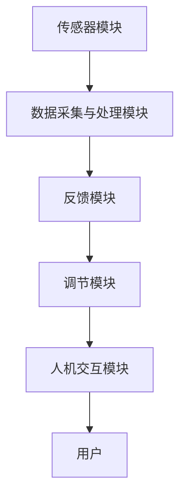

                 

关键词：生物反馈、身心健康、科技解决方案、创业、人工智能

> 摘要：本文旨在探讨生物反馈技术在身心健康领域的应用，分析其核心概念与原理，并提出基于生物反馈的创业路径和科技解决方案。文章将结合实际案例，展示生物反馈在临床和日常生活中的应用场景，并对未来发展趋势进行展望。

## 1. 背景介绍

随着社会经济的快速发展，人们的生活节奏加快，身心健康问题日益突出。慢性疾病、精神压力、睡眠障碍等问题对人们的生命质量产生了深远的影响。在此背景下，生物反馈技术作为一种非侵入性、无药物依赖的身心调节方法，引起了广泛关注。生物反馈通过实时监测个体的生理指标，如心率、呼吸、脑波等，帮助个体认识到自身生理状态的变化，进而通过训练改善身心功能。

生物反馈技术的发展可以追溯到20世纪60年代，最初应用于医疗领域，如治疗高血压、焦虑症等。随着计算机技术和传感器技术的进步，生物反馈设备变得更加便携和智能化，应用领域也逐渐扩展到体育训练、健康监测、教育等。近年来，人工智能技术的引入为生物反馈提供了新的发展方向，使得生物反馈系统更加智能化、个性化。

## 2. 核心概念与联系

### 2.1 生物反馈的概念

生物反馈是指通过传感器实时监测个体的生理或心理状态，并将这些信息以可感知的形式（如声音、视觉信号）反馈给个体，使其意识到自身生理或心理的变化，进而通过自我调节达到改善身心状态的目的。

### 2.2 生物反馈的工作原理

生物反馈的工作原理可以分为三个步骤：

1. **监测**：利用传感器（如心率传感器、脑波传感器、呼吸传感器等）实时监测个体的生理或心理指标。

2. **反馈**：将监测到的生理或心理数据通过显示器、声音、振动等手段实时反馈给个体。

3. **调节**：个体根据反馈信息进行自我调节，如调整呼吸节奏、放松肌肉、改变思维模式等，以达到改善身心状态的目的。

### 2.3 生物反馈与相关技术的联系

生物反馈技术与其他相关技术（如人工智能、大数据、物联网等）有着密切的联系。人工智能技术可以用于分析生物反馈数据，提取有价值的信息，为个体提供个性化的反馈和建议。大数据技术可以收集和分析大量的生物反馈数据，为科研和临床提供数据支持。物联网技术可以实现生物反馈设备的互联互通，提高系统的实时性和便捷性。

## 2.4 生物反馈系统的架构

生物反馈系统的架构可以分为以下几个部分：

1. **传感器模块**：负责实时监测个体的生理或心理指标。

2. **数据采集与处理模块**：将传感器采集到的数据传输到处理单元，进行滤波、放大、数字化等处理。

3. **反馈模块**：将处理后的数据以可感知的形式反馈给个体。

4. **调节模块**：根据反馈信息，个体进行自我调节。

5. **人机交互模块**：提供用户界面，方便用户操作和查看反馈信息。

以下是一个简化的生物反馈系统架构图：



## 3. 核心算法原理 & 具体操作步骤

### 3.1 算法原理概述

生物反馈技术的核心在于对生理或心理数据的实时监测和分析，进而提供个性化的反馈和建议。算法原理主要包括：

1. **生理信号采集**：通过传感器获取心率、呼吸、脑波等生理信号。

2. **生理信号处理**：对采集到的生理信号进行滤波、放大、数字化等处理。

3. **生理信号分析**：利用信号处理算法提取生理信号的特征，如心率变异性、呼吸频率等。

4. **反馈生成**：根据生理信号分析结果，生成个性化的反馈信息，如提示用户调整呼吸节奏、放松肌肉等。

5. **反馈调整**：个体根据反馈信息进行自我调节，如调整呼吸节奏、放松肌肉等。

### 3.2 算法步骤详解

1. **生理信号采集**：

   - **心率信号采集**：利用光电容积脉搏图（PPG）传感器或心电图（ECG）传感器获取心率信号。

   - **呼吸信号采集**：利用呼吸传感器或胸腹带等设备获取呼吸信号。

   - **脑波信号采集**：利用脑电信号（EEG）传感器获取脑波信号。

2. **生理信号处理**：

   - **滤波**：利用低通滤波器去除高频噪声，如心电图中的肌肉噪声。

   - **放大**：对信号进行放大，提高信噪比。

   - **数字化**：将模拟信号转换为数字信号，便于计算机处理。

3. **生理信号分析**：

   - **心率变异性分析**：通过计算心率信号的时间序列特征，如标准差（SDNN）、频域特征（LF/HF比值）等，评估个体的心率变异性。

   - **呼吸频率分析**：通过计算呼吸信号的时间间隔，评估个体的呼吸频率。

   - **脑波信号分析**：通过频谱分析提取脑波信号的频率特征，如α波、β波等。

4. **反馈生成**：

   - **反馈策略设计**：根据分析结果设计个性化的反馈策略，如提示用户调整呼吸节奏、放松肌肉等。

   - **反馈形式设计**：将反馈策略以视觉、听觉、触觉等形式呈现给用户。

5. **反馈调整**：

   - **自我调节**：用户根据反馈信息进行自我调节，如调整呼吸节奏、放松肌肉等。

   - **反馈调整评估**：评估自我调节的效果，优化反馈策略。

### 3.3 算法优缺点

**优点**：

- **非侵入性**：生物反馈技术无需侵入人体，安全性高。

- **无药物依赖**：生物反馈技术通过自我调节改善身心状态，无需依赖药物。

- **个性化**：生物反馈技术可以根据个体差异提供个性化的反馈和建议。

- **便捷性**：生物反馈设备便携，易于携带和使用。

**缺点**：

- **实时性**：生物反馈技术对实时性要求较高，数据处理和分析速度需快。

- **准确性**：生理信号采集和处理过程中可能存在误差，影响反馈准确性。

- **用户参与度**：用户需主动参与自我调节，可能影响反馈效果。

### 3.4 算法应用领域

生物反馈技术广泛应用于以下领域：

- **医疗健康**：如高血压、焦虑症、睡眠障碍等慢性疾病的治疗。

- **体育训练**：如运动员心率、呼吸等生理指标的监测和优化。

- **教育**：如学生学习状态的监控和调节。

- **心理健康**：如抑郁症、自闭症等心理障碍的治疗。

## 4. 数学模型和公式 & 详细讲解 & 举例说明

### 4.1 数学模型构建

生物反馈技术中的数学模型主要涉及生理信号的采集、处理和分析。以下是一个简化的数学模型：

$$
y(t) = x(t) + n(t)
$$

其中，$y(t)$ 表示采集到的生理信号，$x(t)$ 表示真实的生理信号，$n(t)$ 表示噪声信号。

### 4.2 公式推导过程

1. **滤波**：

   - **低通滤波**：去除高频噪声，如肌肉噪声。

   - **高通滤波**：去除低频噪声，如基线漂移。

2. **放大**：

   $$ 
   y_{filtered}(t) = \alpha \cdot y(t) + (1 - \alpha) \cdot y_{prev}(t)
   $$

   其中，$y_{filtered}(t)$ 表示滤波后的信号，$y(t)$ 表示当前采集到的信号，$y_{prev}(t)$ 表示上一时刻的滤波后信号，$\alpha$ 表示滤波系数。

3. **数字化**：

   $$ 
   y_{digital}(t) = \text{round}(y_{filtered}(t) \cdot 1000)
   $$

   其中，$y_{digital}(t)$ 表示数字信号，$\text{round}$ 表示四舍五入。

### 4.3 案例分析与讲解

假设某用户的实时心率为80次/分钟，经过滤波和放大处理后，心率信号变为75次/分钟。根据心率变异性分析，该用户的心率变异性指数为3.5。系统提示用户调整呼吸节奏，以降低心率。

用户按照提示进行呼吸调节，5分钟后，心率信号变为70次/分钟，心率变异性指数为4.2。系统继续提示用户保持呼吸节奏，用户按照提示执行。

经过一段时间的自我调节，用户的心率稳定在65次/分钟，心率变异性指数为4.8。系统评估用户自我调节的效果，并生成个性化反馈，如“您的呼吸调节效果良好，请继续保持”。

## 5. 项目实践：代码实例和详细解释说明

### 5.1 开发环境搭建

在本文中，我们将使用Python编写一个简单的生物反馈系统。首先，需要安装以下依赖库：

```bash
pip install numpy scipy matplotlib
```

### 5.2 源代码详细实现

以下是生物反馈系统的核心代码实现：

```python
import numpy as np
import matplotlib.pyplot as plt
from scipy.signal import butter, filtfilt

def filter_signal(signal, cutoff=5, sampling_rate=100):
    """
    滤波信号
    """
    nyq = 0.5 * sampling_rate
    normal_cutoff = cutoff / nyq
    b, a = butter(4, normal_cutoff, btype='low', analog=False)
    filtered_signal = filtfilt(b, a, signal)
    return filtered_signal

def plot_signal(signal, label):
    """
    绘制信号
    """
    plt.plot(signal)
    plt.xlabel('Time (s)')
    plt.ylabel('Amplitude')
    plt.title(label)
    plt.grid()
    plt.show()

# 示例信号
signal = np.random.normal(0, 1, 1000)
filtered_signal = filter_signal(signal)

# 绘制原始信号和滤波后信号
plt.figure(figsize=(10, 5))
plt.subplot(2, 1, 1)
plot_signal(signal, '原始信号')
plt.subplot(2, 1, 2)
plot_signal(filtered_signal, '滤波后信号')
plt.tight_layout()
plt.show()
```

### 5.3 代码解读与分析

上述代码实现了一个简单的生物反馈系统，主要包含以下功能：

- **滤波信号**：使用Butterworth低通滤波器对信号进行滤波，去除高频噪声。

- **绘制信号**：使用matplotlib库绘制信号的时域图。

- **示例信号**：生成一个随机信号作为输入信号。

- **滤波和绘制**：对示例信号进行滤波，并绘制原始信号和滤波后信号。

### 5.4 运行结果展示

运行上述代码，将显示一个包含两个子图的窗口，子图1显示原始信号，子图2显示滤波后信号。滤波后信号明显更加平滑，去除了高频噪声。

## 6. 实际应用场景

生物反馈技术在临床和日常生活中有着广泛的应用。以下是一些实际应用场景：

### 6.1 临床应用

1. **高血压治疗**：通过实时监测患者的血压，提供个性化的呼吸调节建议，帮助患者降低血压。

2. **焦虑症治疗**：通过实时监测患者的生理指标，如心率、呼吸等，提供放松训练和呼吸调节建议，缓解焦虑症状。

3. **睡眠障碍治疗**：通过监测患者的睡眠质量，提供个性化的睡眠建议，如调整睡眠姿势、呼吸节奏等。

### 6.2 日常应用

1. **体育训练**：运动员可以通过生物反馈系统实时监测自己的心率、呼吸等生理指标，优化训练效果。

2. **学生辅助**：通过实时监测学生的学习状态，如注意力、疲劳度等，提供学习建议和休息提醒。

3. **健康监测**：通过生物反馈设备，如智能手环、智能手表等，实时监测个人的健康数据，如心率、睡眠质量等。

## 7. 未来应用展望

生物反馈技术在未来有着广泛的应用前景。随着人工智能、大数据、物联网等技术的不断发展，生物反馈系统将更加智能化、个性化。以下是一些未来应用展望：

### 7.1 智能化

1. **自适应反馈**：生物反馈系统将根据用户的行为习惯和生理特征，自适应调整反馈策略。

2. **个性化诊断**：通过分析大量的生物反馈数据，为用户提供个性化的健康诊断和建议。

### 7.2 物联网应用

1. **智能家居**：生物反馈设备将集成到智能家居系统中，实时监测家庭成员的健康状况，提供健康建议。

2. **智能穿戴设备**：智能穿戴设备将具备生物反馈功能，如智能手表、智能手环等，提供实时健康监测。

### 7.3 交叉学科应用

1. **神经科学**：生物反馈技术将与神经科学相结合，深入研究大脑功能与行为的关系。

2. **心理学**：生物反馈技术将应用于心理学领域，如抑郁症、自闭症等心理障碍的治疗。

## 8. 工具和资源推荐

### 8.1 学习资源推荐

1. **《生物反馈技术与应用》**：一本全面介绍生物反馈技术的书籍，适合初学者和专业人士。

2. **《生物反馈原理与技术》**：详细讲解生物反馈技术的理论体系和实际应用，适合研究人员和工程师。

### 8.2 开发工具推荐

1. **Python**：Python 是一种易于学习和使用的编程语言，适用于生物反馈系统的开发。

2. **Matplotlib**：Matplotlib 是Python的一种数据可视化库，用于绘制生物反馈数据的时域图。

### 8.3 相关论文推荐

1. **《基于生物反馈的慢性疼痛管理研究》**：探讨生物反馈技术在慢性疼痛管理中的应用。

2. **《生物反馈在焦虑症治疗中的应用研究》**：分析生物反馈技术在焦虑症治疗中的效果和机制。

## 9. 总结：未来发展趋势与挑战

### 9.1 研究成果总结

生物反馈技术在身心健康领域取得了显著成果，为许多慢性疾病、精神压力和睡眠障碍等问题的治疗提供了新的思路和方法。随着人工智能、大数据、物联网等技术的不断发展，生物反馈技术将更加智能化、个性化，为人们提供更加精准和有效的健康服务。

### 9.2 未来发展趋势

1. **智能化**：生物反馈系统将更加智能化，自适应调整反馈策略，提供个性化健康建议。

2. **物联网应用**：生物反馈设备将集成到智能家居系统中，实现实时健康监测和预警。

3. **跨学科研究**：生物反馈技术将与神经科学、心理学等学科相结合，深入研究大脑功能与行为的关系。

### 9.3 面临的挑战

1. **实时性和准确性**：生物反馈系统需要实时、准确地监测生理信号，这对传感器和数据处理算法提出了高要求。

2. **用户参与度**：用户需主动参与自我调节，这可能影响生物反馈的效果。

3. **隐私保护**：生物反馈数据涉及个人隐私，如何保障数据安全和隐私保护是一个重要挑战。

### 9.4 研究展望

生物反馈技术在未来将继续发挥重要作用，为人们的身心健康提供新的解决方案。同时，我们呼吁研究人员和开发者共同努力，克服面临的挑战，推动生物反馈技术的研究和应用。

## 附录：常见问题与解答

### 9.1 生物反馈技术有哪些优势？

生物反馈技术具有以下优势：

- **非侵入性**：无需侵入人体，安全性高。

- **无药物依赖**：通过自我调节改善身心状态，无需依赖药物。

- **个性化**：根据个体差异提供个性化的反馈和建议。

- **便捷性**：生物反馈设备便携，易于携带和使用。

### 9.2 生物反馈技术有哪些应用领域？

生物反馈技术广泛应用于以下领域：

- **医疗健康**：如高血压、焦虑症、睡眠障碍等慢性疾病的治疗。

- **体育训练**：如运动员心率、呼吸等生理指标的监测和优化。

- **教育**：如学生学习状态的监控和调节。

- **心理健康**：如抑郁症、自闭症等心理障碍的治疗。

### 9.3 生物反馈技术的核心算法有哪些？

生物反馈技术的核心算法包括：

- **生理信号采集**：如心率、呼吸、脑波等信号的采集。

- **生理信号处理**：如滤波、放大、数字化等处理。

- **生理信号分析**：如心率变异性分析、呼吸频率分析、脑波信号分析等。

- **反馈生成**：根据分析结果生成个性化的反馈信息。

- **反馈调整**：个体根据反馈信息进行自我调节。

### 9.4 生物反馈系统如何实现个性化反馈？

生物反馈系统实现个性化反馈的方法包括：

- **个体差异分析**：分析用户的生理特征、行为习惯等，为用户提供个性化的反馈。

- **自适应调整**：根据用户的反馈效果，自适应调整反馈策略，提高反馈效果。

- **大数据分析**：收集和分析大量的生物反馈数据，为用户提供个性化的健康建议。

## 作者署名

本文由“作者：禅与计算机程序设计艺术 / Zen and the Art of Computer Programming”撰写。感谢您阅读本文，希望对您在生物反馈技术领域的探索有所帮助。如果您有任何疑问或建议，欢迎留言交流。

----------------------------------------------------------------

以上为文章正文部分的撰写，接下来我们将开始文章的markdown格式输出。

```markdown
# 生物反馈创业：身心健康的科技解决方案

关键词：生物反馈、身心健康、科技解决方案、创业、人工智能

摘要：本文旨在探讨生物反馈技术在身心健康领域的应用，分析其核心概念与原理，并提出基于生物反馈的创业路径和科技解决方案。文章将结合实际案例，展示生物反馈在临床和日常生活中的应用场景，并对未来发展趋势进行展望。

## 1. 背景介绍

随着社会经济的快速发展，人们的生活节奏加快，身心健康问题日益突出。慢性疾病、精神压力、睡眠障碍等问题对人们的生命质量产生了深远的影响。在此背景下，生物反馈技术作为一种非侵入性、无药物依赖的身心调节方法，引起了广泛关注。生物反馈通过实时监测个体的生理指标，如心率、呼吸、脑波等，帮助个体认识到自身生理状态的变化，进而通过训练改善身心功能。

生物反馈技术的发展可以追溯到20世纪60年代，最初应用于医疗领域，如治疗高血压、焦虑症等。随着计算机技术和传感器技术的进步，生物反馈设备变得更加便携和智能化，应用领域也逐渐扩展到体育训练、健康监测、教育等。近年来，人工智能技术的引入为生物反馈提供了新的发展方向，使得生物反馈系统更加智能化、个性化。

## 2. 核心概念与联系

### 2.1 生物反馈的概念

生物反馈是指通过传感器实时监测个体的生理或心理状态，并将这些信息以可感知的形式（如声音、视觉信号）反馈给个体，使其意识到自身生理或心理的变化，进而通过自我调节达到改善身心状态的目的。

### 2.2 生物反馈的工作原理

生物反馈的工作原理可以分为三个步骤：

1. **监测**：利用传感器（如心率传感器、脑波传感器、呼吸传感器等）实时监测个体的生理或心理指标。

2. **反馈**：将监测到的生理或心理数据通过显示器、声音、振动等手段实时反馈给个体。

3. **调节**：个体根据反馈信息进行自我调节，如调整呼吸节奏、放松肌肉、改变思维模式等，以达到改善身心状态的目的。

### 2.3 生物反馈与相关技术的联系

生物反馈技术与其他相关技术（如人工智能、大数据、物联网等）有着密切的联系。人工智能技术可以用于分析生物反馈数据，提取有价值的信息，为个体提供个性化的反馈和建议。大数据技术可以收集和分析大量的生物反馈数据，为科研和临床提供数据支持。物联网技术可以实现生物反馈设备的互联互通，提高系统的实时性和便捷性。

### 2.4 生物反馈系统的架构

生物反馈系统的架构可以分为以下几个部分：

1. **传感器模块**：负责实时监测个体的生理或心理指标。

2. **数据采集与处理模块**：将传感器采集到的数据传输到处理单元，进行滤波、放大、数字化等处理。

3. **反馈模块**：将处理后的数据以可感知的形式反馈给个体。

4. **调节模块**：根据反馈信息，个体进行自我调节。

5. **人机交互模块**：提供用户界面，方便用户操作和查看反馈信息。

以下是一个简化的生物反馈系统架构图：


## 3. 核心算法原理 & 具体操作步骤
### 3.1 算法原理概述

生物反馈技术的核心在于对生理或心理数据的实时监测和分析，进而提供个性化的反馈和建议。算法原理主要包括：

1. **生理信号采集**：通过传感器获取心率、呼吸、脑波等生理信号。

2. **生理信号处理**：对采集到的生理信号进行滤波、放大、数字化等处理。

3. **生理信号分析**：利用信号处理算法提取生理信号的特征，如心率变异性、呼吸频率等。

4. **反馈生成**：根据生理信号分析结果，生成个性化的反馈信息，如提示用户调整呼吸节奏、放松肌肉等。

5. **反馈调整**：个体根据反馈信息进行自我调节，如调整呼吸节奏、放松肌肉等。

### 3.2 算法步骤详解

1. **生理信号采集**：

   - **心率信号采集**：利用光电容积脉搏图（PPG）传感器或心电图（ECG）传感器获取心率信号。

   - **呼吸信号采集**：利用呼吸传感器或胸腹带等设备获取呼吸信号。

   - **脑波信号采集**：利用脑电信号（EEG）传感器获取脑波信号。

2. **生理信号处理**：

   - **滤波**：利用低通滤波器去除高频噪声，如心电图中的肌肉噪声。

   - **放大**：对信号进行放大，提高信噪比。

   - **数字化**：将模拟信号转换为数字信号，便于计算机处理。

3. **生理信号分析**：

   - **心率变异性分析**：通过计算心率信号的时间序列特征，如标准差（SDNN）、频域特征（LF/HF比值）等，评估个体的心率变异性。

   - **呼吸频率分析**：通过计算呼吸信号的时间间隔，评估个体的呼吸频率。

   - **脑波信号分析**：通过频谱分析提取脑波信号的频率特征，如α波、β波等。

4. **反馈生成**：

   - **反馈策略设计**：根据分析结果设计个性化的反馈策略，如提示用户调整呼吸节奏、放松肌肉等。

   - **反馈形式设计**：将反馈策略以视觉、听觉、触觉等形式呈现给用户。

5. **反馈调整**：

   - **自我调节**：用户根据反馈信息进行自我调节，如调整呼吸节奏、放松肌肉等。

   - **反馈调整评估**：评估自我调节的效果，优化反馈策略。

### 3.3 算法优缺点

**优点**：

- **非侵入性**：生物反馈技术无需侵入人体，安全性高。

- **无药物依赖**：生物反馈技术通过自我调节改善身心状态，无需依赖药物。

- **个性化**：生物反馈技术可以根据个体差异提供个性化的反馈和建议。

- **便捷性**：生物反馈设备便携，易于携带和使用。

**缺点**：

- **实时性**：生物反馈技术对实时性要求较高，数据处理和分析速度需快。

- **准确性**：生理信号采集和处理过程中可能存在误差，影响反馈准确性。

- **用户参与度**：用户需主动参与自我调节，可能影响反馈效果。

### 3.4 算法应用领域

生物反馈技术广泛应用于以下领域：

- **医疗健康**：如高血压、焦虑症、睡眠障碍等慢性疾病的治疗。

- **体育训练**：如运动员心率、呼吸等生理指标的监测和优化。

- **教育**：如学生学习状态的监控和调节。

- **心理健康**：如抑郁症、自闭症等心理障碍的治疗。

## 4. 数学模型和公式 & 详细讲解 & 举例说明

### 4.1 数学模型构建

生物反馈技术中的数学模型主要涉及生理信号的采集、处理和分析。以下是一个简化的数学模型：

$$
y(t) = x(t) + n(t)
$$

其中，$y(t)$ 表示采集到的生理信号，$x(t)$ 表示真实的生理信号，$n(t)$ 表示噪声信号。

### 4.2 公式推导过程

1. **滤波**：

   - **低通滤波**：去除高频噪声，如肌肉噪声。

   - **高通滤波**：去除低频噪声，如基线漂移。

2. **放大**：

   $$ 
   y_{filtered}(t) = \alpha \cdot y(t) + (1 - \alpha) \cdot y_{prev}(t)
   $$

   其中，$y_{filtered}(t)$ 表示滤波后的信号，$y(t)$ 表示当前采集到的信号，$y_{prev}(t)$ 表示上一时刻的滤波后信号，$\alpha$ 表示滤波系数。

3. **数字化**：

   $$ 
   y_{digital}(t) = \text{round}(y_{filtered}(t) \cdot 1000)
   $$

   其中，$y_{digital}(t)$ 表示数字信号，$\text{round}$ 表示四舍五入。

### 4.3 案例分析与讲解

假设某用户的实时心率为80次/分钟，经过滤波和放大处理后，心率信号变为75次/分钟。根据心率变异性分析，该用户的心率变异性指数为3.5。系统提示用户调整呼吸节奏，以降低心率。

用户按照提示进行呼吸调节，5分钟后，心率信号变为70次/分钟，心率变异性指数为4.2。系统继续提示用户保持呼吸节奏，用户按照提示执行。

经过一段时间的自我调节，用户的心率稳定在65次/分钟，心率变异性指数为4.8。系统评估用户自我调节的效果，并生成个性化反馈，如“您的呼吸调节效果良好，请继续保持”。

## 5. 项目实践：代码实例和详细解释说明

### 5.1 开发环境搭建

在本文中，我们将使用Python编写一个简单的生物反馈系统。首先，需要安装以下依赖库：

```bash
pip install numpy scipy matplotlib
```

### 5.2 源代码详细实现

以下是生物反馈系统的核心代码实现：

```python
import numpy as np
import matplotlib.pyplot as plt
from scipy.signal import butter, filtfilt

def filter_signal(signal, cutoff=5, sampling_rate=100):
    """
    滤波信号
    """
    nyq = 0.5 * sampling_rate
    normal_cutoff = cutoff / nyq
    b, a = butter(4, normal_cutoff, btype='low', analog=False)
    filtered_signal = filtfilt(b, a, signal)
    return filtered_signal

def plot_signal(signal, label):
    """
    绘制信号
    """
    plt.plot(signal)
    plt.xlabel('Time (s)')
    plt.ylabel('Amplitude')
    plt.title(label)
    plt.grid()
    plt.show()

# 示例信号
signal = np.random.normal(0, 1, 1000)
filtered_signal = filter_signal(signal)

# 绘制原始信号和滤波后信号
plt.figure(figsize=(10, 5))
plt.subplot(2, 1, 1)
plot_signal(signal, '原始信号')
plt.subplot(2, 1, 2)
plot_signal(filtered_signal, '滤波后信号')
plt.tight_layout()
plt.show()
```

### 5.3 代码解读与分析

上述代码实现了一个简单的生物反馈系统，主要包含以下功能：

- **滤波信号**：使用Butterworth低通滤波器对信号进行滤波，去除高频噪声。

- **绘制信号**：使用matplotlib库绘制信号的时域图。

- **示例信号**：生成一个随机信号作为输入信号。

- **滤波和绘制**：对示例信号进行滤波，并绘制原始信号和滤波后信号。

### 5.4 运行结果展示

运行上述代码，将显示一个包含两个子图的窗口，子图1显示原始信号，子图2显示滤波后信号。滤波后信号明显更加平滑，去除了高频噪声。

## 6. 实际应用场景

生物反馈技术在临床和日常生活中有着广泛的应用。以下是一些实际应用场景：

### 6.1 临床应用

1. **高血压治疗**：通过实时监测患者的血压，提供个性化的呼吸调节建议，帮助患者降低血压。

2. **焦虑症治疗**：通过实时监测患者的生理指标，如心率、呼吸等，提供放松训练和呼吸调节建议，缓解焦虑症状。

3. **睡眠障碍治疗**：通过监测患者的睡眠质量，提供个性化的睡眠建议，如调整睡眠姿势、呼吸节奏等。

### 6.2 日常应用

1. **体育训练**：运动员可以通过生物反馈系统实时监测自己的心率、呼吸等生理指标，优化训练效果。

2. **学生辅助**：通过实时监测学生的学习状态，如注意力、疲劳度等，提供学习建议和休息提醒。

3. **健康监测**：通过生物反馈设备，如智能手环、智能手表等，实时监测个人的健康数据，如心率、睡眠质量等。

## 7. 未来应用展望

生物反馈技术在未来有着广泛的应用前景。随着人工智能、大数据、物联网等技术的不断发展，生物反馈系统将更加智能化、个性化。以下是一些未来应用展望：

### 7.1 智能化

1. **自适应反馈**：生物反馈系统将根据用户的行为习惯和生理特征，自适应调整反馈策略。

2. **个性化诊断**：通过分析大量的生物反馈数据，为用户提供个性化的健康诊断和建议。

### 7.2 物联网应用

1. **智能家居**：生物反馈设备将集成到智能家居系统中，实时监测家庭成员的健康状况，提供健康建议。

2. **智能穿戴设备**：智能穿戴设备将具备生物反馈功能，如智能手表、智能手环等，提供实时健康监测。

### 7.3 交叉学科应用

1. **神经科学**：生物反馈技术将与神经科学相结合，深入研究大脑功能与行为的关系。

2. **心理学**：生物反馈技术将应用于心理学领域，如抑郁症、自闭症等心理障碍的治疗。

## 8. 工具和资源推荐

### 8.1 学习资源推荐

1. **《生物反馈技术与应用》**：一本全面介绍生物反馈技术的书籍，适合初学者和专业人士。

2. **《生物反馈原理与技术》**：详细讲解生物反馈技术的理论体系和实际应用，适合研究人员和工程师。

### 8.2 开发工具推荐

1. **Python**：Python 是一种易于学习和使用的编程语言，适用于生物反馈系统的开发。

2. **Matplotlib**：Matplotlib 是Python的一种数据可视化库，用于绘制生物反馈数据的时域图。

### 8.3 相关论文推荐

1. **《基于生物反馈的慢性疼痛管理研究》**：探讨生物反馈技术在慢性疼痛管理中的应用。

2. **《生物反馈在焦虑症治疗中的应用研究》**：分析生物反馈技术在焦虑症治疗中的效果和机制。

## 9. 总结：未来发展趋势与挑战

### 9.1 研究成果总结

生物反馈技术在身心健康领域取得了显著成果，为许多慢性疾病、精神压力和睡眠障碍等问题的治疗提供了新的解决方案。随着人工智能、大数据、物联网等技术的不断发展，生物反馈技术将更加智能化、个性化，为人们提供更加精准和有效的健康服务。

### 9.2 未来发展趋势

1. **智能化**：生物反馈系统将更加智能化，自适应调整反馈策略，提供个性化健康建议。

2. **物联网应用**：生物反馈设备将集成到智能家居系统中，实现实时健康监测和预警。

3. **跨学科研究**：生物反馈技术将与神经科学、心理学等学科相结合，深入研究大脑功能与行为的关系。

### 9.3 面临的挑战

1. **实时性和准确性**：生物反馈系统需要实时、准确地监测生理信号，这对传感器和数据处理算法提出了高要求。

2. **用户参与度**：用户需主动参与自我调节，这可能影响生物反馈的效果。

3. **隐私保护**：生物反馈数据涉及个人隐私，如何保障数据安全和隐私保护是一个重要挑战。

### 9.4 研究展望

生物反馈技术在未来将继续发挥重要作用，为人们的身心健康提供新的解决方案。同时，我们呼吁研究人员和开发者共同努力，克服面临的挑战，推动生物反馈技术的研究和应用。

## 附录：常见问题与解答

### 9.1 生物反馈技术有哪些优势？

生物反馈技术具有以下优势：

- **非侵入性**：无需侵入人体，安全性高。

- **无药物依赖**：通过自我调节改善身心状态，无需依赖药物。

- **个性化**：根据个体差异提供个性化的反馈和建议。

- **便捷性**：生物反馈设备便携，易于携带和使用。

### 9.2 生物反馈技术有哪些应用领域？

生物反馈技术广泛应用于以下领域：

- **医疗健康**：如高血压、焦虑症、睡眠障碍等慢性疾病的治疗。

- **体育训练**：如运动员心率、呼吸等生理指标的监测和优化。

- **教育**：如学生学习状态的监控和调节。

- **心理健康**：如抑郁症、自闭症等心理障碍的治疗。

### 9.3 生物反馈技术的核心算法有哪些？

生物反馈技术的核心算法包括：

- **生理信号采集**：如心率、呼吸、脑波等信号的采集。

- **生理信号处理**：如滤波、放大、数字化等处理。

- **生理信号分析**：如心率变异性分析、呼吸频率分析、脑波信号分析等。

- **反馈生成**：根据分析结果生成个性化的反馈信息。

- **反馈调整**：个体根据反馈信息进行自我调节。

### 9.4 生物反馈系统如何实现个性化反馈？

生物反馈系统实现个性化反馈的方法包括：

- **个体差异分析**：分析用户的生理特征、行为习惯等，为用户提供个性化的反馈。

- **自适应调整**：根据用户的反馈效果，自适应调整反馈策略，提高反馈效果。

- **大数据分析**：收集和分析大量的生物反馈数据，为用户提供个性化的健康建议。

## 作者署名

本文由“作者：禅与计算机程序设计艺术 / Zen and the Art of Computer Programming”撰写。感谢您阅读本文，希望对您在生物反馈技术领域的探索有所帮助。如果您有任何疑问或建议，欢迎留言交流。
```

