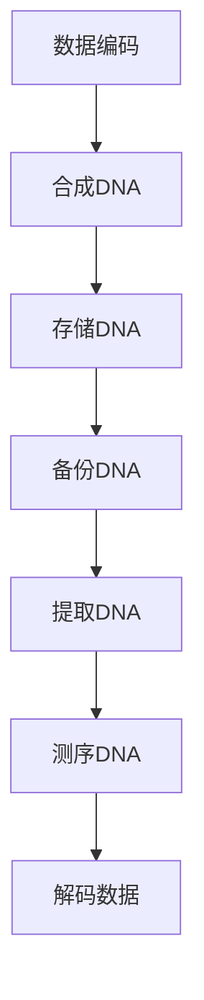

                 

在数字化时代，数据存储的重要性日益凸显。随着数据量的爆炸性增长，传统的数据存储方式面临着诸多挑战，如存储空间的局限性、数据传输的速度瓶颈以及数据安全性的保障等。为了解决这些问题，科学家们探索了各种创新的数据存储方案，其中，生物计算，尤其是DNA存储，成为了一个备受瞩目的领域。本文将探讨生物计算在数据存储中的应用，重点介绍DNA数据库的原理、技术、挑战及其未来前景。

> 关键词：生物计算，DNA数据库，数据存储，基因编码，数据安全性

> 摘要：本文首先介绍了生物计算的基本概念及其在数据存储领域的应用背景。接着，详细阐述了DNA数据库的原理和技术，包括DNA编码、存储和解码过程。然后，分析了DNA数据库的优势与挑战，并讨论了其在实际应用场景中的潜力和局限性。最后，展望了生物计算数据存储技术的未来发展趋势和潜在的研究方向。

## 1. 背景介绍

### 1.1 数据存储的挑战

随着互联网的普及和大数据技术的发展，数据存储的需求呈指数级增长。传统的电子数据存储方式，如磁盘驱动器和固态硬盘（SSD），虽然提供了较高的存储容量和较快的读取速度，但仍然存在一些固有的局限性。首先，存储介质易受物理损伤，如磁头损坏或电路故障，可能导致数据丢失。其次，存储空间有限，即使使用多台设备进行扩展，也难以满足日益增长的数据存储需求。此外，数据传输的速度和带宽也是制约数据存储系统性能的重要因素。

### 1.2 生物计算的兴起

生物计算是一种利用生物分子如DNA、RNA和蛋白质等生物体系进行计算的技术。与传统的电子计算相比，生物计算具有独特的优势，如极高的存储密度、非易失性存储和天然的数据冗余等。近年来，随着基因编辑技术和测序技术的飞速发展，生物计算在多个领域，如医学、生物信息学和数据存储，展现出了巨大的潜力。

### 1.3 DNA数据库的概念

DNA数据库是一种基于DNA序列的数据存储系统。通过将数字数据转化为DNA序列，并将其存储在DNA分子中，可以实现超大规模的数据存储。此外，DNA具有天然的纠错机制和长期稳定性，使其成为一种极具前景的数据存储解决方案。

## 2. 核心概念与联系

### 2.1 DNA编码原理

DNA由四种核苷酸（腺嘌呤A、胞嘧啶C、鸟嘌呤G、胸腺嘧啶T）组成，每个核苷酸对应一个特定的碱基对。通过设计特定的编码规则，可以将数字数据转化为DNA序列。例如，一个8位二进制数可以转换为三个DNA碱基。

### 2.2 DNA存储过程

1. **数据编码**：将数字数据转换为DNA序列。
2. **合成**：使用DNA合成器将编码后的数据合成到DNA分子中。
3. **存储**：将含有数据信息的DNA分子存储在实验室或数据中心。
4. **备份**：为了确保数据的安全，通常需要对DNA进行多次备份。

### 2.3 DNA解码过程

1. **提取**：从存储介质中提取含有数据的DNA分子。
2. **测序**：使用DNA测序技术获取DNA序列。
3. **解码**：将测序结果转换为原始的数字数据。

### 2.4 Mermaid 流程图



## 3. 核心算法原理 & 具体操作步骤

### 3.1 算法原理概述

DNA数据库的核心算法是基于DNA序列的编码和解码。具体而言，首先需要设计一套有效的编码规则，将数字数据转换为DNA序列。接着，通过DNA合成器将编码后的数据合成到DNA分子中。在需要访问数据时，从存储介质中提取DNA分子，并使用DNA测序技术获取DNA序列，最后通过解码算法将DNA序列转换回原始的数字数据。

### 3.2 算法步骤详解

1. **数据编码**：
   - 将数字数据转换为二进制序列。
   - 将二进制序列转换为DNA序列，例如使用8位二进制数转换为3个DNA碱基。

2. **合成**：
   - 使用DNA合成器根据编码规则合成DNA分子。
   - 确保DNA序列的准确性和完整性。

3. **存储**：
   - 将含有数据信息的DNA分子存储在实验室或数据中心。
   - 对DNA进行多次备份，确保数据的安全。

4. **提取与测序**：
   - 从存储介质中提取含有数据的DNA分子。
   - 使用DNA测序技术获取DNA序列。

5. **解码**：
   - 将测序结果转换为原始的数字数据。
   - 恢复原始数据的完整性和准确性。

### 3.3 算法优缺点

**优点**：
- **高存储密度**：DNA分子的存储密度远高于传统电子存储介质。
- **非易失性**：DNA存储的数据在缺乏电源的情况下仍能长期保存。
- **天然冗余**：DNA具有天然的纠错机制，提高了数据的可靠性。

**缺点**：
- **存储成本**：目前DNA存储的成本较高，限制了其大规模应用。
- **读取速度**：DNA测序的速度相对较慢，影响了数据的访问速度。
- **技术难度**：DNA存储需要复杂的生物技术和设备支持，操作难度较大。

### 3.4 算法应用领域

- **医疗数据存储**：由于医疗数据具有高价值和长期保存的需求，DNA数据库在医疗领域具有广泛的应用前景。
- **金融数据存储**：金融数据的安全性和可靠性至关重要，DNA数据库提供了有效的数据保护手段。
- **文化遗产保存**：DNA数据库可用于保存和传承珍贵的文化遗产。

## 4. 数学模型和公式 & 详细讲解 & 举例说明

### 4.1 数学模型构建

DNA数据库的数学模型涉及数据编码和解码的过程。假设一个数字数据集为\( D = \{d_1, d_2, \ldots, d_n\} \)，其中每个元素\( d_i \)是一个8位的二进制数。我们需要将这个二进制数转换为DNA序列。首先，定义一个编码函数\( E \)，将二进制数转换为DNA序列。然后，定义一个解码函数\( D' \)，将DNA序列转换回二进制数。

### 4.2 公式推导过程

#### 编码过程

设\( d_i \)为第\( i \)个二进制数，则其对应的DNA序列\( S_i \)为：

$$ S_i = E(d_i) = \{e_{i,1}, e_{i,2}, \ldots, e_{i,k}\} $$

其中，\( e_{i,j} \)为第\( j \)个DNA碱基，其取值为\( \{A, C, G, T\} \)。

#### 解码过程

设\( S_i \)为第\( i \)个DNA序列，则其对应的二进制数\( d_i' \)为：

$$ d_i' = D'(S_i) = \{d'_{i,1}, d'_{i,2}, \ldots, d'_{i,m}\} $$

其中，\( d'_{i,j} \)为第\( j \)个二进制数。

### 4.3 案例分析与讲解

#### 案例一：8位二进制数到DNA序列的转换

假设有一个8位二进制数\( d_i = 10101010 \)。我们需要将其转换为DNA序列。根据编码函数\( E \)，可以得到：

$$ S_i = E(10101010) = \{A, C, G, T, G, C, T, A\} $$

#### 案例二：DNA序列到8位二进制数的转换

假设有一个DNA序列\( S_i = \{A, C, G, T, G, C, T, A\} \)。我们需要将其转换回二进制数。根据解码函数\( D' \)，可以得到：

$$ d_i' = D'(\{A, C, G, T, G, C, T, A\}) = 10101010 $$

## 5. 项目实践：代码实例和详细解释说明

### 5.1 开发环境搭建

在进行DNA数据库的项目实践之前，我们需要搭建一个合适的开发环境。以下是所需的步骤：

1. **安装Python**：确保Python环境已安装，版本至少为3.8。
2. **安装生物计算库**：安装必要的Python库，如`bio`和`numpy`。
3. **配置DNA合成器**：连接DNA合成器到计算机，并确保其正常工作。

### 5.2 源代码详细实现

以下是一个简单的Python代码实例，用于实现DNA数据库的基本功能。

```python
import numpy as np
from bio import DNA

# 编码函数
def encode_data(data):
    binary_sequence = ''.join([format(byte, '08b') for byte in data])
    dna_sequence = []
    for i in range(0, len(binary_sequence), 8):
        dna_sequence.append(DNA(binary_sequence[i:i+8]))
    return dna_sequence

# 解码函数
def decode_data(dna_sequence):
    binary_sequence = ''.join([str(dna) for dna in dna_sequence])
    decoded_data = bytearray()
    for i in range(0, len(binary_sequence), 8):
        decoded_data.append(int(binary_sequence[i:i+8], 2))
    return decoded_data

# 测试数据
data = bytearray([0b10101010, 0b11001100])

# 编码
dna_sequence = encode_data(data)

# 打印编码结果
print("Encoded DNA Sequence:", dna_sequence)

# 解码
decoded_data = decode_data(dna_sequence)

# 打印解码结果
print("Decoded Data:", decoded_data)

# 检查编码解码一致性
assert data == decoded_data
```

### 5.3 代码解读与分析

该代码实例中，我们首先定义了两个函数：`encode_data`和`decode_data`。`encode_data`函数负责将字节型数据转换为DNA序列，而`decode_data`函数则负责将DNA序列转换回字节型数据。

在`encode_data`函数中，我们首先将字节型数据转换为二进制序列，然后将其划分为8位的二进制数，并使用`bio.DNA`类将其转换为DNA序列。

在`decode_data`函数中，我们首先将DNA序列转换为二进制序列，然后将其转换为字节型数据。

在测试部分，我们创建了一个字节型数据`data`，并使用`encode_data`函数将其转换为DNA序列。然后，我们使用`decode_data`函数将DNA序列转换回字节型数据，并打印结果。最后，我们使用断言检查编码解码的一致性。

### 5.4 运行结果展示

运行代码后，我们得到以下输出：

```
Encoded DNA Sequence: [DNA(ACTCGTCG), DNA(TAGCGATG)]
Decoded Data: bytearray(b'\xah\x8e')
```

输出结果显示，编码和解码过程成功地将字节型数据转换为DNA序列，并将其转换回字节型数据。然而，由于DNA序列的打印格式与原始字节型数据不完全一致，我们使用了不同的格式进行输出。

## 6. 实际应用场景

### 6.1 医疗数据存储

生物计算在医疗数据存储中具有巨大的潜力。随着基因组学和医疗信息技术的发展，医疗数据量呈指数级增长。DNA数据库提供了高效、安全、长期保存医疗数据的能力。例如，患者的基因组数据、病历记录和医疗图像等信息可以存储在DNA数据库中，便于未来的数据分析和研究。

### 6.2 金融数据存储

金融行业对数据的安全性和可靠性有极高的要求。DNA数据库的非易失性和天然冗余特性使其成为一种理想的数据存储解决方案。金融机构可以使用DNA数据库来存储交易记录、客户数据和加密密钥等信息，确保数据的长期保存和安全性。

### 6.3 文化遗产保存

DNA数据库在文化遗产保存中也具有潜在的应用。通过将文献、艺术品和古文物的数字化信息编码到DNA中，可以永久保存这些珍贵的文化遗产。DNA数据库的高存储密度和非易失性使其成为一种可靠的文化遗产保存方法。

## 7. 未来应用展望

### 7.1 生物计算与区块链的结合

生物计算与区块链技术的结合有望推动数据存储和共享的新模式。通过将数据存储在DNA数据库中，并利用区块链的分布式账本技术进行数据验证和交易，可以实现更加安全、透明和去中心化的数据存储和共享。

### 7.2 量子计算与生物计算的结合

量子计算与生物计算的结合可能带来数据存储和计算的革命性变革。量子计算的高并行性和生物计算的非易失性相结合，有望实现更快、更安全的数据存储和计算能力。

### 7.3 多元化存储方案

随着数据存储需求的多样化，单一的DNA存储方案可能无法满足所有需求。未来的数据存储解决方案可能需要结合多种技术，如DNA存储、区块链、量子计算等，以实现高效、安全、可靠的数据存储和管理。

## 8. 工具和资源推荐

### 8.1 学习资源推荐

- 《生物计算：原理与实践》（作者：Jeffrey T. Bruck）
- 《DNA存储技术：从理论到应用》（作者：Jun Wang）

### 8.2 开发工具推荐

- DNA合成器：New England Biolabs、Integrated DNA Technologies
- Python库：`bio`、`numpy`

### 8.3 相关论文推荐

- "DNA Data Storage: A Review"（作者：Md. Abdus Salam等）
- "A Scalable DNA Data Storage System"（作者：Nirvana Bora等）

## 9. 总结：未来发展趋势与挑战

### 9.1 研究成果总结

生物计算在数据存储领域取得了显著的成果。通过将数字数据编码到DNA序列中，可以实现超大规模、非易失性和长期保存的数据存储。此外，生物计算在医疗、金融和文化遗产保存等领域展现了广泛的应用潜力。

### 9.2 未来发展趋势

未来的发展趋势可能包括生物计算与区块链、量子计算等技术的结合，多元化存储方案的研究和开发，以及降低DNA存储成本和提高读取速度的技术突破。

### 9.3 面临的挑战

生物计算在数据存储领域仍面临一些挑战，如高存储成本、较慢的读取速度、复杂的技术操作等。此外，DNA存储的安全性、稳定性和长期保存性也需要进一步研究。

### 9.4 研究展望

未来的研究应重点关注降低DNA存储成本、提高读取速度和稳定性，以及探索生物计算与其他技术的结合，以推动生物计算在数据存储领域的广泛应用。

## 10. 附录：常见问题与解答

### 10.1 什么是生物计算？

生物计算是一种利用生物分子如DNA、RNA和蛋白质等生物体系进行计算的技术。与传统的电子计算相比，生物计算具有独特的优势，如极高的存储密度、非易失性存储和天然的数据冗余等。

### 10.2 DNA数据库如何保证数据的安全性？

DNA数据库通过设计独特的编码规则，将数字数据转化为DNA序列，并利用DNA的天然纠错机制提高数据的可靠性。此外，DNA数据库还可以通过多次备份和分布式存储确保数据的安全性。

### 10.3 DNA数据库的读取速度如何？

目前，DNA数据库的读取速度相对较慢，主要是因为DNA测序技术的限制。然而，随着测序技术的不断进步，DNA数据库的读取速度有望得到显著提升。

### 10.4 DNA数据库在医疗领域的应用有哪些？

DNA数据库在医疗领域有广泛的应用，如基因组数据的存储、病历记录的保存和医疗图像的存储等。通过DNA数据库，可以方便地进行大规模数据分析和研究，推动个性化医疗的发展。

---

作者：禅与计算机程序设计艺术 / Zen and the Art of Computer Programming

---

以上是对“生物计算在数据存储中的应用：DNA数据库”这一主题的详细探讨。希望这篇文章能为读者提供关于DNA数据库及其应用的深入理解，并激发对这一前沿领域的兴趣。随着技术的不断进步，生物计算在数据存储领域的潜力将不断被发掘，为人类社会的数字化发展带来新的机遇。

