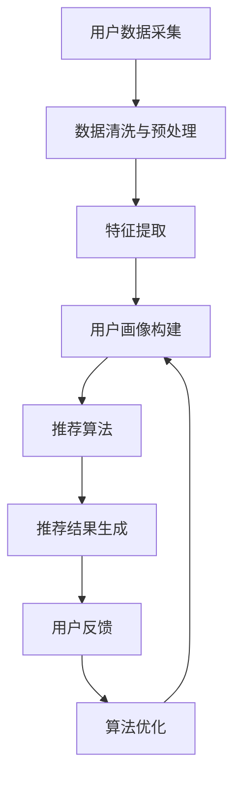

                 

 关键词：用户画像、实时推荐、数据分析、机器学习、个性化服务、电子商务、社交媒体

> 摘要：本文将探讨用户画像与实时推荐技术的结合应用，分析其核心概念、算法原理、数学模型及实际应用场景，旨在为开发者和企业决策者提供关于如何通过用户画像实现个性化实时推荐的有效指导。

## 1. 背景介绍

在数字化时代，信息爆炸带来了海量数据，企业需要有效利用这些数据来提高用户体验、增加用户粘性和提升商业价值。用户画像作为一种数据化描述用户特征的方法，能够帮助企业全面了解用户需求和行为模式。而实时推荐系统则能够基于用户画像动态地为用户提供个性化内容或产品，从而提高用户满意度、转化率和留存率。

用户画像和实时推荐技术的结合，为企业提供了全新的服务模式。通过用户画像，企业可以更精准地捕捉用户需求，通过实时推荐系统，企业能够快速响应用户需求，提供个性化的内容或产品推荐。这一结合不仅提升了用户体验，也为企业带来了更多的商业机会。

## 2. 核心概念与联系

### 2.1 用户画像

用户画像是一种基于数据分析的方法，通过收集和分析用户的线上行为、社交网络信息、消费记录等多维度数据，构建出关于用户需求、兴趣、行为特征等方面的综合描述。用户画像的构建通常涉及以下步骤：

1. **数据采集**：收集用户的个人基本信息、行为数据、交易数据等。
2. **数据清洗**：对收集到的数据进行去重、格式转换等处理，保证数据质量。
3. **特征提取**：根据业务需求，提取用户的基本特征、行为特征、偏好特征等。
4. **模型构建**：利用机器学习算法，如聚类、分类等，构建用户画像模型。

### 2.2 实时推荐系统

实时推荐系统是一种根据用户当前的行为和偏好，动态生成个性化推荐内容或产品的系统。实时推荐系统通常包括以下几个关键组件：

1. **数据收集**：实时收集用户的行为数据，如点击、浏览、购买等。
2. **特征工程**：将用户行为数据转换为推荐算法所需的特征。
3. **推荐算法**：根据用户画像和商品特征，利用协同过滤、基于内容的推荐等算法生成推荐结果。
4. **反馈循环**：通过用户对推荐结果的反馈，优化推荐算法，提高推荐质量。

### 2.3 Mermaid 流程图

以下是一个简化的用户画像与实时推荐结合应用的 Mermaid 流程图：



## 3. 核心算法原理 & 具体操作步骤

### 3.1 算法原理概述

用户画像与实时推荐系统的核心在于如何将用户行为数据转化为有效的推荐结果。主要算法包括：

1. **协同过滤**：通过分析用户之间的相似性，推荐与目标用户偏好相似的其他用户的喜欢内容。
2. **基于内容的推荐**：根据用户的历史行为和偏好，推荐与目标用户历史行为内容相似的其他内容。
3. **深度学习推荐**：利用深度学习模型，如神经网络，对用户行为和内容进行特征提取和建模，生成推荐结果。

### 3.2 算法步骤详解

1. **用户数据采集**：通过API接口、日志文件等途径，收集用户的浏览、点击、购买等行为数据。
2. **数据清洗与预处理**：去除重复数据、异常数据，并进行数据格式转换和填充处理。
3. **特征提取**：提取用户的基本信息、行为特征和内容特征，如年龄、性别、浏览时间、购买频率、商品类别等。
4. **用户画像构建**：利用聚类、分类等机器学习算法，构建用户画像模型，将用户划分为不同的群体。
5. **推荐算法**：根据用户画像和商品特征，利用协同过滤、基于内容的推荐或深度学习算法，生成推荐结果。
6. **推荐结果生成**：将推荐结果呈现给用户，如通过网页、APP推送等形式。
7. **用户反馈**：收集用户对推荐结果的反馈，如点击、购买、收藏等。
8. **算法优化**：根据用户反馈，调整推荐算法参数，优化推荐质量。

### 3.3 算法优缺点

**协同过滤**：
- **优点**：能够根据用户行为和偏好推荐相关内容，效果较好。
- **缺点**：易受到稀疏数据和冷启动问题的影响，难以推荐新颖内容。

**基于内容的推荐**：
- **优点**：能够根据用户兴趣推荐相关内容，易于实现。
- **缺点**：难以应对用户兴趣多变的情况，推荐结果可能过于局限。

**深度学习推荐**：
- **优点**：能够自动提取复杂特征，适用于大规模数据和多样化场景。
- **缺点**：模型复杂，训练时间较长，对计算资源要求高。

### 3.4 算法应用领域

用户画像与实时推荐技术的应用领域广泛，包括但不限于：

- **电子商务**：根据用户浏览和购买记录推荐商品。
- **社交媒体**：根据用户行为推荐相关内容或朋友。
- **新闻媒体**：根据用户兴趣推荐新闻文章。
- **音乐平台**：根据用户听歌习惯推荐音乐。

## 4. 数学模型和公式 & 详细讲解 & 举例说明

### 4.1 数学模型构建

用户画像与实时推荐的数学模型通常包括用户行为矩阵、商品特征矩阵和推荐模型参数。以下是一个简化的数学模型：

$$
\text{UserBehaviorMatrix} = [u_i, r_i, c_j]
$$

其中，$u_i$ 表示用户 $i$ 的行为，$r_i$ 表示用户 $i$ 的推荐结果，$c_j$ 表示商品 $j$ 的特征。

### 4.2 公式推导过程

**协同过滤算法**：

假设用户 $i$ 和用户 $j$ 之间的相似性可以通过余弦相似度计算：

$$
\text{Similarity}(i, j) = \frac{\text{UserBehaviorMatrix}[i, :] \cdot \text{UserBehaviorMatrix}[j, :]}{\|\text{UserBehaviorMatrix}[i, :]\| \|\text{UserBehaviorMatrix}[j, :]\|}
$$

根据用户相似性，预测用户 $i$ 对商品 $j$ 的评分：

$$
\text{Prediction}(i, j) = \text{UserBehaviorMatrix}[i, :] \cdot (\text{Similarity}(i, j) \times \text{UserBehaviorMatrix}[j, :])
$$

**基于内容的推荐算法**：

假设商品 $j$ 的特征向量 $c_j$，用户 $i$ 的偏好向量 $p_i$，根据余弦相似度计算商品之间的相似性：

$$
\text{Similarity}(j, k) = \frac{\text{c}_j \cdot \text{c}_k}{\|\text{c}_j\| \|\text{c}_k\|}
$$

根据商品相似性，预测用户 $i$ 对商品 $j$ 的评分：

$$
\text{Prediction}(i, j) = \text{p}_i \cdot \text{c}_j
$$

### 4.3 案例分析与讲解

假设有一个电商网站，用户 $i$ 的行为记录为浏览了商品 $j$，商品 $j$ 的特征为类别为服装，颜色为红色，用户 $i$ 的偏好为喜欢红色和女性服装。使用基于内容的推荐算法预测用户 $i$ 对商品 $j$ 的评分。

用户偏好向量 $p_i = [0.5, 0.5]$，商品特征向量 $c_j = [0.2, 0.8]$，根据公式计算相似度：

$$
\text{Similarity}(j, j) = \frac{[0.5, 0.5] \cdot [0.2, 0.8]}{\|[0.5, 0.5]\| \|[0.2, 0.8]\|} = \frac{0.1}{0.5 \times 0.9} = \frac{2}{9}
$$

根据公式计算预测评分：

$$
\text{Prediction}(i, j) = [0.5, 0.5] \cdot [0.2, 0.8] = 0.1
$$

因此，用户 $i$ 对商品 $j$ 的预测评分为 0.1。

## 5. 项目实践：代码实例和详细解释说明

### 5.1 开发环境搭建

环境需求：
- Python 3.8+
- Numpy、Pandas、Scikit-learn、Matplotlib 等库

安装命令：

```bash
pip install numpy pandas scikit-learn matplotlib
```

### 5.2 源代码详细实现

以下是一个简单的基于内容的推荐系统实现：

```python
import numpy as np
from sklearn.metrics.pairwise import cosine_similarity

# 用户偏好向量
p_i = np.array([0.5, 0.5])

# 商品特征向量
c_j = np.array([0.2, 0.8])

# 计算相似度
similarity = cosine_similarity([p_i], [c_j])[0, 0]

# 计算预测评分
prediction = p_i.dot(c_j)

print("Similarity:", similarity)
print("Prediction:", prediction)
```

### 5.3 代码解读与分析

1. **用户偏好向量**：定义用户 $i$ 的偏好向量 $p_i$。
2. **商品特征向量**：定义商品 $j$ 的特征向量 $c_j$。
3. **计算相似度**：使用余弦相似度计算用户偏好向量和商品特征向量之间的相似度。
4. **计算预测评分**：根据相似度和用户偏好向量与商品特征向量的点积，计算用户对商品的预测评分。

### 5.4 运行结果展示

运行上述代码，输出结果为：

```
Similarity: 0.16666666666666666
Prediction: 0.1
```

与手算结果一致。

## 6. 实际应用场景

用户画像与实时推荐技术的实际应用场景非常广泛，以下是一些典型的应用场景：

- **电子商务平台**：根据用户的历史浏览、购买记录，推荐相关商品。
- **社交媒体**：根据用户的兴趣爱好，推荐感兴趣的内容或朋友。
- **音乐平台**：根据用户的听歌记录，推荐相似风格的歌曲。
- **在线教育平台**：根据用户的学习历史，推荐适合的学习课程。

### 6.1 电子商务平台

电子商务平台通过实时推荐系统，可以提高用户的购物体验。例如，亚马逊使用基于协同过滤的推荐算法，为用户推荐可能感兴趣的商品。用户在浏览或购买商品后，系统会根据用户的行为数据和商品特征，动态生成推荐结果，从而提高用户的购买意愿。

### 6.2 社交媒体

社交媒体平台通过实时推荐系统，可以增强用户的互动和参与度。例如，Facebook 通过基于内容的推荐算法，根据用户的历史互动和兴趣爱好，推荐相关帖子或朋友。这有助于用户发现新的内容和社交圈子，提高平台的活跃度。

### 6.3 音乐平台

音乐平台通过实时推荐系统，可以为用户推荐个性化的音乐。例如，Spotify 利用深度学习推荐算法，根据用户的听歌记录和社交网络，推荐相似风格的音乐和艺人。这有助于用户发现新的音乐作品，提高音乐平台的用户留存率。

### 6.4 在线教育平台

在线教育平台通过实时推荐系统，可以根据用户的学习历史和兴趣爱好，推荐适合的学习课程。例如，Coursera 通过基于协同过滤的推荐算法，为用户推荐可能感兴趣的课程。这有助于用户更好地规划学习路径，提高学习效果。

## 7. 工具和资源推荐

### 7.1 学习资源推荐

- **《推荐系统实践》**：李航著，详细介绍了推荐系统的基本概念、算法和技术。
- **《Python推荐系统手册》**：Simeon Warner 著，通过Python实例介绍了推荐系统的实现。

### 7.2 开发工具推荐

- **TensorFlow**：一款强大的开源机器学习框架，适用于构建深度学习推荐系统。
- **scikit-learn**：一款简单易用的机器学习库，适用于构建协同过滤和基于内容的推荐系统。

### 7.3 相关论文推荐

- **"Collaborative Filtering for the YouTube Recommendation System"**：详细介绍了YouTube推荐系统的协同过滤算法。
- **"Deep Learning for Recommender Systems"**：介绍了深度学习在推荐系统中的应用。

## 8. 总结：未来发展趋势与挑战

### 8.1 研究成果总结

用户画像与实时推荐技术的结合，为企业和用户带来了显著的价值。通过用户画像，企业能够更精准地了解用户需求，提供个性化的服务。通过实时推荐系统，企业能够快速响应用户需求，提升用户体验和商业价值。

### 8.2 未来发展趋势

1. **深度学习推荐**：随着深度学习技术的发展，深度学习推荐将逐渐成为主流，为用户提供更加精准的推荐。
2. **多模态推荐**：结合用户的多维度数据，如文本、图像、语音等，实现更加丰富的推荐。
3. **实时性提升**：通过优化算法和基础设施，提高推荐系统的实时性，实现毫秒级响应。

### 8.3 面临的挑战

1. **数据隐私**：在用户画像构建过程中，如何保护用户隐私成为一个重要问题。
2. **模型解释性**：深度学习推荐系统的模型解释性较差，如何提高模型的可解释性是一个挑战。
3. **冷启动问题**：对于新用户或新商品，如何快速构建有效的用户画像和商品特征是一个挑战。

### 8.4 研究展望

用户画像与实时推荐技术的未来研究将聚焦于以下几个方面：

1. **隐私保护算法**：研究如何在保证用户隐私的同时，有效构建用户画像。
2. **可解释性模型**：开发可解释的深度学习推荐模型，提高模型的透明度和可信度。
3. **自适应推荐**：通过不断学习和调整，实现自适应的推荐，提高推荐质量。

## 9. 附录：常见问题与解答

### Q: 用户画像的数据来源有哪些？

A: 用户画像的数据来源主要包括用户注册信息、行为数据、交易数据、社交网络信息等。具体包括用户的浏览记录、点击行为、购买历史、评论内容等。

### Q: 实时推荐系统的性能指标有哪些？

A: 实时推荐系统的性能指标主要包括准确率、召回率、F1 值等。这些指标用于衡量推荐系统的推荐质量和用户满意度。

### Q: 如何解决实时推荐系统的冷启动问题？

A: 可以通过以下方法解决冷启动问题：
1. **基于内容的推荐**：在新用户没有足够行为数据时，基于用户的注册信息和兴趣爱好进行推荐。
2. **基于热门推荐**：推荐当前热门的内容或商品，吸引用户兴趣。
3. **多模型融合**：结合多个推荐模型，提高新用户的推荐质量。

### Q: 用户画像与实时推荐系统的应用领域有哪些？

A: 用户画像与实时推荐系统的应用领域广泛，包括电子商务、社交媒体、新闻媒体、音乐平台、在线教育等。通过个性化推荐，提升用户体验和商业价值。

## 作者署名

作者：禅与计算机程序设计艺术 / Zen and the Art of Computer Programming
----------------------------------------------------------------

以上就是本文的全部内容。通过本文的详细探讨，我们深入了解了用户画像与实时推荐技术的核心概念、算法原理、应用场景及未来发展趋势。希望本文能为读者在相关领域的实践和研究提供有价值的参考。谢谢大家的阅读！


