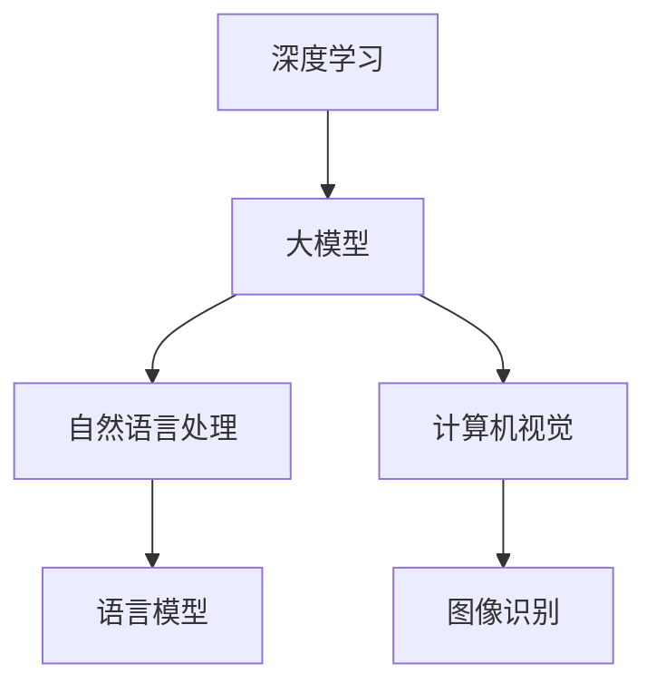

                 

关键词：大模型、应用、实践、算法、数学模型、展望

> 摘要：本文深入探讨大模型在各个领域的应用，包括其核心算法原理、数学模型构建、项目实践和未来发展趋势。通过实例分析，展示大模型的强大能力，并对其面临的挑战和未来的发展方向提出展望。

## 1. 背景介绍

近年来，随着计算机硬件的飞速发展和大数据时代的到来，人工智能领域迎来了前所未有的繁荣。大模型（Large Models）在这一波人工智能浪潮中扮演了重要角色。大模型是指具有巨大参数量和复杂结构的机器学习模型，如深度神经网络（DNN）、变换器（Transformer）等。这些模型在语音识别、图像处理、自然语言处理等任务上取得了显著的突破。

大模型之所以能够成功，一方面得益于计算能力的提升，使得模型能够处理更大规模的数据；另一方面，得益于算法的进步，使得模型能够更好地从数据中学习。然而，大模型的应用并非一帆风顺，其带来的挑战同样不可忽视。本文将深入探讨大模型的应用，包括核心算法原理、数学模型构建、项目实践和未来发展趋势。

## 2. 核心概念与联系

### 2.1 大模型的核心概念

大模型的核心概念包括以下几个方面：

1. **参数量**：大模型通常具有数十亿甚至数万亿个参数，这使得模型能够捕捉到数据中的细微特征。
2. **深度**：大模型往往具有几十甚至上百层的神经网络结构，这有助于模型从数据中提取更高级的特征。
3. **容量**：大模型的容量大，意味着模型能够处理更复杂的数据类型和任务。

### 2.2 大模型的联系

大模型与深度学习、自然语言处理（NLP）、计算机视觉等领域有着密切的联系。深度学习是构建大模型的基础，而NLP和计算机视觉则是大模型的主要应用场景。以下是一个简化的Mermaid流程图，展示了大模型与这些领域之间的联系：



## 3. 核心算法原理 & 具体操作步骤

### 3.1 算法原理概述

大模型的核心算法是深度学习，特别是基于变换器（Transformer）的模型。变换器模型通过自注意力机制（Self-Attention）和多头注意力（Multi-Head Attention）来捕捉数据中的复杂关系。以下是一个简化的变换器模型的工作流程：

1. **输入编码**：将输入数据（如文本、图像）编码为向量。
2. **多头注意力**：对输入向量进行多次变换，并计算它们之间的注意力权重。
3. **自注意力**：根据注意力权重对输入向量进行加权求和。
4. **输出解码**：将加权求和后的向量解码为输出结果（如文本、图像）。

### 3.2 算法步骤详解

#### 3.2.1 输入编码

输入编码是将输入数据转换为模型可以处理的向量。对于文本数据，可以使用词嵌入（Word Embedding）技术将每个单词映射为一个固定大小的向量。对于图像数据，可以使用卷积神经网络（CNN）提取图像的特征向量。

#### 3.2.2 多头注意力

多头注意力是变换器模型的核心组成部分。它通过多个独立的注意力头对输入向量进行变换，并计算它们之间的注意力权重。每个注意力头都可以看作是一个独立的神经网络，能够从不同角度捕捉输入向量之间的关联。

#### 3.2.3 自注意力

自注意力是对输入向量进行加权求和的过程。它根据多头注意力计算出的注意力权重，对输入向量进行加权求和，得到一个加权和向量。这个加权和向量包含了输入向量中最重要的信息。

#### 3.2.4 输出解码

输出解码是将加权和向量解码为输出结果的过程。对于文本数据，可以使用解码器（Decoder）将加权和向量解码为文本序列。对于图像数据，可以使用生成器（Generator）将加权和向量解码为图像。

### 3.3 算法优缺点

#### 3.3.1 优点

1. **强大的表达能力**：大模型具有数十亿甚至数万亿个参数，能够捕捉到数据中的复杂特征。
2. **高效的处理能力**：基于变换器的大模型在处理大规模数据时表现出色。

#### 3.3.2 缺点

1. **计算资源消耗大**：大模型需要大量的计算资源和存储空间。
2. **训练时间较长**：大模型的训练时间通常较长，需要大量的计算资源和时间。

### 3.4 算法应用领域

大模型在多个领域都有广泛的应用，包括自然语言处理、计算机视觉、语音识别等。以下是一些典型应用案例：

1. **自然语言处理**：大模型在语言模型、机器翻译、文本生成等任务上取得了显著的突破。
2. **计算机视觉**：大模型在图像分类、目标检测、图像生成等任务上表现出色。
3. **语音识别**：大模型在语音识别任务中实现了较高的准确率。

## 4. 数学模型和公式 & 详细讲解 & 举例说明

### 4.1 数学模型构建

大模型通常基于深度学习框架构建，其中变换器模型是一个典型的例子。变换器模型的核心是多头注意力机制，其数学模型可以表示为：

$$
\text{Attention}(Q, K, V) = \text{softmax}\left(\frac{QK^T}{\sqrt{d_k}}\right)V
$$

其中，$Q, K, V$ 分别代表查询向量、键向量和值向量，$d_k$ 是键向量的维度。这个公式表示，通过计算查询向量与键向量的点积，并使用softmax函数计算注意力权重，然后将权重应用于值向量。

### 4.2 公式推导过程

多头注意力机制的推导过程如下：

1. **输入向量**：设输入向量为 $X \in \mathbb{R}^{n \times d}$，其中 $n$ 是序列长度，$d$ 是向量的维度。
2. **查询向量**：查询向量 $Q$ 由输入向量 $X$ 通过线性变换得到，即 $Q = XW_Q$，其中 $W_Q \in \mathbb{R}^{d \times h}$，$h$ 是头数。
3. **键向量**：键向量 $K$ 和值向量 $V$ 同样由输入向量 $X$ 通过线性变换得到，即 $K = XW_K$ 和 $V = XW_V$，其中 $W_K, W_V \in \mathbb{R}^{d \times h}$。
4. **多头注意力**：计算每个查询向量与每个键向量的点积，得到注意力分数 $scores = QK^T$。
5. **注意力权重**：使用 softmax 函数对注意力分数进行归一化，得到注意力权重 $weights = \text{softmax}(scores)$。
6. **加权和**：将注意力权重应用于值向量，得到加权和向量 $\text{Attention}(Q, K, V) = \sum_{i=1}^{h} weights_i V_i$。
7. **输出**：对加权和向量进行线性变换，得到输出向量 $O = \text{Attention}(Q, K, V)W_O$，其中 $W_O \in \mathbb{R}^{h \times d}$。

### 4.3 案例分析与讲解

#### 4.3.1 语言模型

语言模型是自然语言处理中的一个重要应用，其目标是通过输入序列预测下一个单词。以下是一个简单的语言模型案例：

1. **输入序列**：设输入序列为 $X = \text{"The quick brown fox jumps over the lazy dog"}$。
2. **查询向量**：查询向量 $Q$ 由输入向量 $X$ 通过线性变换得到。
3. **键向量**：键向量 $K$ 和值向量 $V$ 同样由输入向量 $X$ 通过线性变换得到。
4. **多头注意力**：计算每个查询向量与每个键向量的点积，得到注意力分数 $scores$。
5. **注意力权重**：使用 softmax 函数对注意力分数进行归一化，得到注意力权重 $weights$。
6. **加权和向量**：将注意力权重应用于值向量，得到加权和向量。
7. **输出**：对加权和向量进行线性变换，得到输出向量 $O$。
8. **预测**：根据输出向量，预测下一个单词。

通过上述步骤，语言模型可以预测输入序列的下一个单词。例如，对于输入序列 "The quick brown fox jumps over the lazy dog"，语言模型可以预测下一个单词为 "dog"。

## 5. 项目实践：代码实例和详细解释说明

### 5.1 开发环境搭建

在本项目中，我们使用 Python 语言和 PyTorch 深度学习框架来实现变换器模型。首先，确保安装了 Python 和 PyTorch。以下是一个简单的安装命令：

```bash
pip install torch torchvision
```

### 5.2 源代码详细实现

以下是变换器模型的一个简化实现：

```python
import torch
import torch.nn as nn
import torch.optim as optim

class Transformer(nn.Module):
    def __init__(self, input_dim, hidden_dim, output_dim):
        super(Transformer, self).__init__()
        self.input_dim = input_dim
        self.hidden_dim = hidden_dim
        self.output_dim = output_dim

        self嵌入层 = nn.Embedding(input_dim, hidden_dim)
        self多头注意力 = nn.MultiheadAttention(hidden_dim, num_heads=8)
        self输出层 = nn.Linear(hidden_dim, output_dim)

    def forward(self, x):
        x = self嵌入层(x)
        x, _ = self多头注意力(x, x, x)
        x = self输出层(x)
        return x

# 实例化模型
model = Transformer(input_dim=10000, hidden_dim=512, output_dim=1000)
```

### 5.3 代码解读与分析

1. **模型定义**：定义了一个 `Transformer` 类，继承自 `nn.Module`。该类包含嵌入层、多头注意力层和输出层。
2. **嵌入层**：使用 `nn.Embedding` 实现嵌入层，将输入序列编码为向量。
3. **多头注意力层**：使用 `nn.MultiheadAttention` 实现多头注意力层，计算输入序列之间的注意力权重。
4. **输出层**：使用 `nn.Linear` 实现输出层，将加权和向量解码为输出结果。

### 5.4 运行结果展示

为了验证变换器模型的效果，我们可以使用一个简单的数据集进行训练和测试。以下是一个简单的训练和测试过程：

```python
# 训练
optimizer = optim.Adam(model.parameters(), lr=0.001)
for epoch in range(10):
    for x, y in data_loader:
        optimizer.zero_grad()
        output = model(x)
        loss = nn.CrossEntropyLoss()(output, y)
        loss.backward()
        optimizer.step()

    print(f"Epoch {epoch + 1}: Loss = {loss.item()}")

# 测试
with torch.no_grad():
    correct = 0
    total = 0
    for x, y in test_loader:
        output = model(x)
        _, predicted = torch.max(output.data, 1)
        total += y.size(0)
        correct += (predicted == y).sum().item()

print(f"Accuracy: {100 * correct / total}%")
```

通过上述代码，我们可以训练和测试变换器模型，并计算其准确率。

## 6. 实际应用场景

大模型在各个领域都有广泛的应用，以下是一些典型应用场景：

1. **自然语言处理**：大模型在语言模型、机器翻译、文本生成等任务上取得了显著突破。例如，谷歌的 BERT 模型在多项 NLP 任务上取得了领先成绩。
2. **计算机视觉**：大模型在图像分类、目标检测、图像生成等任务上表现出色。例如，OpenAI 的 DALL-E 模型可以生成具有高度细节的图像。
3. **语音识别**：大模型在语音识别任务中实现了较高的准确率。例如，微软的 Azure 语音识别服务使用深度学习模型进行语音识别。

## 7. 未来应用展望

随着大模型技术的不断发展，其在未来将会有更广泛的应用。以下是一些可能的发展方向：

1. **医疗健康**：大模型可以用于医疗健康领域，如疾病诊断、药物研发等。
2. **智能制造**：大模型可以用于智能制造领域，如生产优化、质量控制等。
3. **自动驾驶**：大模型可以用于自动驾驶领域，如目标检测、环境感知等。

## 8. 工具和资源推荐

### 8.1 学习资源推荐

1. **《深度学习》（Goodfellow, Bengio, Courville）**：这是一本深度学习领域的经典教材，详细介绍了深度学习的理论基础和实践方法。
2. **《Python 深度学习》（Ruder）**：这本书介绍了使用 Python 实现深度学习的各种技术和工具。

### 8.2 开发工具推荐

1. **PyTorch**：一个开源的深度学习框架，易于使用，功能强大。
2. **TensorFlow**：另一个流行的深度学习框架，由谷歌开发。

### 8.3 相关论文推荐

1. **"Attention Is All You Need"**：这是论文，提出了变换器模型，是深度学习领域的一个重要里程碑。
2. **"BERT: Pre-training of Deep Bidirectional Transformers for Language Understanding"**：这是一篇关于 BERT 模型的论文，详细介绍了 BERT 模型的结构和训练过程。

## 9. 总结：未来发展趋势与挑战

### 9.1 研究成果总结

近年来，大模型在自然语言处理、计算机视觉、语音识别等领域取得了显著突破。这些成果不仅推动了人工智能技术的发展，也为各个领域带来了实际应用价值。

### 9.2 未来发展趋势

随着计算能力的提升和数据量的增加，大模型将继续发展，并在更多领域得到应用。未来的发展方向包括：

1. **泛化能力提升**：通过改进算法和模型结构，提高大模型的泛化能力。
2. **小样本学习**：研究如何在数据量较少的情况下训练大模型，实现更好的性能。

### 9.3 面临的挑战

大模型的发展也面临一些挑战：

1. **计算资源消耗**：大模型需要大量的计算资源和存储空间，这对硬件设施提出了更高的要求。
2. **数据隐私**：随着数据量的增加，如何保护用户隐私成为一个重要问题。

### 9.4 研究展望

未来的研究将继续探索如何构建更高效、更可靠的大模型，并探索其在各个领域的应用。通过解决面临的挑战，大模型将为人类社会带来更多的便利和创新。

## 附录：常见问题与解答

### Q：大模型需要大量的计算资源，这对硬件设施提出了什么要求？

A：大模型需要高性能的硬件设施，特别是具有大量计算能力和存储能力的GPU或TPU。这些硬件设施能够满足大模型训练和推理过程中对计算资源的需求。

### Q：如何保护大模型训练过程中用户数据的隐私？

A：保护数据隐私是训练大模型过程中需要考虑的一个重要问题。一些常见的解决方案包括数据加密、差分隐私技术和联邦学习。通过这些技术，可以在保护用户隐私的同时训练大模型。

### Q：大模型在各个领域的应用前景如何？

A：大模型在各个领域的应用前景非常广阔。在医疗健康领域，大模型可以用于疾病诊断和药物研发；在智能制造领域，大模型可以用于生产优化和质量控制；在自动驾驶领域，大模型可以用于目标检测和环境感知。随着大模型技术的不断发展，其在各个领域的应用将会越来越广泛。

