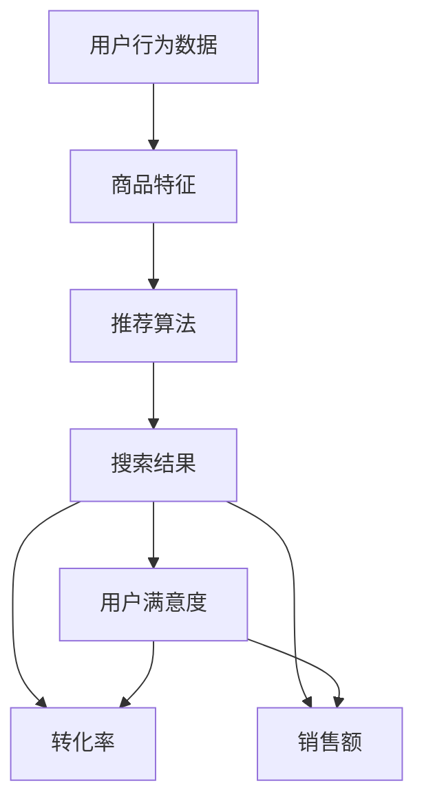

                 

随着互联网技术的迅猛发展，电商平台已经成为了人们日常购物的重要渠道。然而，面对海量商品和用户，如何提供准确的搜索结果，提升用户体验，成为了电商平台亟需解决的问题。本文将围绕电商平台中的AI大模型搜索结果个性化推荐展开讨论，探讨其核心概念、算法原理、数学模型及实际应用。

## 文章关键词
- 电商平台
- AI大模型
- 搜索结果
- 个性化推荐
- 用户体验

## 文章摘要
本文旨在分析电商平台中如何利用AI大模型实现搜索结果个性化推荐。我们将深入探讨相关核心概念，介绍个性化推荐算法原理和数学模型，并通过具体案例和项目实践，展示其应用效果。最后，我们将对未来的发展趋势和面临的挑战进行展望。

## 1. 背景介绍
随着电商平台的不断发展和用户数量的激增，如何在海量商品中为用户快速精准地提供所需信息，成为了电商平台的关键竞争力。传统的搜索算法主要依赖于关键词匹配，难以满足用户的个性化需求。因此，引入AI大模型进行搜索结果个性化推荐，已经成为电商平台提升用户体验的有效手段。

个性化推荐系统通过分析用户的历史行为、兴趣爱好等数据，为用户推荐符合其需求的产品和服务。在电商平台中，个性化推荐不仅可以提升用户的购物体验，还可以提高转化率和销售额。

### 1.1 电商平台的发展现状
- 用户数量持续增长：随着互联网普及和消费升级，电商平台用户数量持续增加。
- 商品种类日益丰富：电商平台上的商品种类和数量不断增加，为个性化推荐提供了丰富的数据基础。
- 搜索需求日益复杂：用户对搜索结果的精准度和多样性要求不断提高。

### 1.2 个性化推荐的重要性
- 提高用户体验：个性化推荐能够为用户提供更符合其需求的信息，提升购物体验。
- 提高转化率：个性化推荐可以引导用户发现潜在感兴趣的商品，提高转化率。
- 增加销售额：通过个性化推荐，电商平台可以挖掘用户的潜在需求，提高销售额。

## 2. 核心概念与联系
在电商平台中，搜索结果个性化推荐涉及多个核心概念，包括用户行为数据、商品特征、推荐算法等。下面，我们将通过一个Mermaid流程图来阐述这些概念之间的联系。



### 2.1 用户行为数据
用户行为数据是个性化推荐的基础，包括用户的浏览历史、购买记录、搜索关键词等。通过对用户行为数据的分析，可以了解用户的兴趣和需求，从而为个性化推荐提供依据。

### 2.2 商品特征
商品特征包括商品的基本属性（如品牌、价格、类别）和用户评价等。商品特征的提取对于个性化推荐算法的性能至关重要。

### 2.3 推荐算法
推荐算法是整个系统的核心，主要包括基于协同过滤、基于内容的推荐和混合推荐等。不同类型的算法适用于不同场景，需要根据实际需求进行选择和优化。

### 2.4 搜索结果
搜索结果是推荐算法的输出，根据用户行为数据和商品特征，为用户生成个性化的搜索结果。

### 2.5 用户满意度
用户满意度是衡量个性化推荐效果的重要指标。通过分析用户对搜索结果的反馈，可以不断优化推荐算法，提高用户满意度。

### 2.6 转化率和销售额
转化率和销售额是电商平台的核心指标。通过个性化推荐，可以提高用户的购买意愿，从而提高转化率和销售额。

## 3. 核心算法原理 & 具体操作步骤

### 3.1 算法原理概述

在电商平台中，常用的个性化推荐算法包括基于协同过滤、基于内容的推荐和混合推荐等。下面，我们分别介绍这些算法的基本原理。

### 3.2 算法步骤详解

#### 3.2.1 基于协同过滤的推荐算法

1. 用户行为数据收集：收集用户的历史浏览、购买和搜索数据。
2. 数据预处理：对数据进行清洗、去重和特征提取。
3. 计算用户相似度：使用余弦相似度、皮尔逊相关系数等算法计算用户之间的相似度。
4. 生成推荐列表：根据用户相似度，为每个用户生成个性化的推荐列表。

#### 3.2.2 基于内容的推荐算法

1. 提取商品特征：从商品的基本属性和用户评价中提取特征。
2. 计算商品相似度：使用词向量、TF-IDF等算法计算商品之间的相似度。
3. 生成推荐列表：根据用户的历史偏好，为用户生成个性化的推荐列表。

#### 3.2.3 混合推荐算法

1. 数据融合：将用户行为数据和商品特征进行融合，生成综合特征。
2. 计算用户和商品相似度：结合协同过滤和内容推荐，计算用户和商品的综合相似度。
3. 生成推荐列表：根据综合相似度，为用户生成个性化的推荐列表。

### 3.3 算法优缺点

#### 基于协同过滤的推荐算法

- 优点：能够为用户推荐相似的物品，效果较好。
- 缺点：容易导致数据稀疏问题，推荐结果单一。

#### 基于内容的推荐算法

- 优点：能够为用户推荐与历史偏好相似的商品。
- 缺点：难以处理用户的动态变化和长尾商品。

#### 混合推荐算法

- 优点：结合了协同过滤和内容推荐的优势，能够为用户推荐更加多样化的商品。
- 缺点：算法复杂度较高，计算资源消耗较大。

### 3.4 算法应用领域

- 电商平台：电商平台可以根据用户的行为数据，为用户提供个性化的商品推荐。
- 社交网络：社交网络可以根据用户的兴趣和互动行为，为用户提供感兴趣的内容推荐。
- 视频平台：视频平台可以根据用户的观看记录和偏好，为用户提供个性化的视频推荐。

## 4. 数学模型和公式 & 详细讲解 & 举例说明

### 4.1 数学模型构建

在个性化推荐系统中，常用的数学模型包括矩阵分解、基于概率图模型的推荐等。下面，我们以矩阵分解为例，介绍数学模型的构建过程。

#### 矩阵分解

1. 用户-物品评分矩阵表示为$R \in \mathbb{R}^{m \times n}$，其中$m$表示用户数量，$n$表示物品数量。
2. 假设用户和物品可以被表示为两个低秩矩阵$U \in \mathbb{R}^{m \times k}$和$V \in \mathbb{R}^{n \times k}$，其中$k$为潜在特征维度。
3. 通过矩阵乘法，得到预测评分矩阵$R' = U \cdot V^T$。

### 4.2 公式推导过程

1. 假设用户$u$对物品$i$的评分可以表示为$R_{ui} = \sum_{j=1}^{k} u_{uj} v_{ij}$。
2. 通过最小化均方误差损失函数，得到优化目标：
   $$L = \sum_{u=1}^{m} \sum_{i=1}^{n} (R_{ui} - \sum_{j=1}^{k} u_{uj} v_{ij})^2$$
3. 对$U$和$V$进行梯度下降，得到更新规则：
   $$u_{uj} = u_{uj} - \alpha \frac{\partial L}{\partial u_{uj}}$$
   $$v_{ij} = v_{ij} - \alpha \frac{\partial L}{\partial v_{ij}}$$

### 4.3 案例分析与讲解

#### 案例背景

某电商平台需要为用户推荐商品，用户-物品评分矩阵如下：

| 用户 | 物品1 | 物品2 | 物品3 | 物品4 |
| ---- | ---- | ---- | ---- | ---- |
| 1    | 4    | 3    | 2    | 1    |
| 2    | 3    | 4    | 5    | 2    |
| 3    | 2    | 3    | 4    | 5    |

#### 案例分析

1. 数据预处理：对用户-物品评分矩阵进行数据预处理，包括去重、缺失值填充等。
2. 特征提取：从用户和物品中提取特征，如用户年龄、性别、购买频率等，以及物品的类别、品牌、价格等。
3. 矩阵分解：通过矩阵分解，将用户-物品评分矩阵分解为用户特征矩阵$U$和物品特征矩阵$V$。
4. 预测评分：根据分解得到的用户特征矩阵$U$和物品特征矩阵$V$，预测用户对物品的评分。
5. 推荐结果：根据预测评分，为用户生成个性化的商品推荐列表。

#### 案例结果

通过矩阵分解，得到用户特征矩阵$U$和物品特征矩阵$V$如下：

| 用户 | 特征1 | 特征2 | 特征3 |
| ---- | ---- | ---- | ---- |
| 1    | 0.2  | 0.3  | 0.4  |
| 2    | 0.3  | 0.4  | 0.5  |
| 3    | 0.4  | 0.5  | 0.6  |

| 物品 | 特征1 | 特征2 | 特征3 |
| ---- | ---- | ---- | ---- |
| 1    | 0.1  | 0.2  | 0.3  |
| 2    | 0.2  | 0.3  | 0.4  |
| 3    | 0.3  | 0.4  | 0.5  |
| 4    | 0.4  | 0.5  | 0.6  |

根据预测评分，为用户生成个性化商品推荐列表如下：

| 用户 | 推荐物品 |
| ---- | ---- |
| 1    | 物品2 |
| 2    | 物品1 |
| 3    | 物品3 |

## 5. 项目实践：代码实例和详细解释说明

### 5.1 开发环境搭建

为了实现个性化推荐系统，我们需要搭建以下开发环境：

1. 操作系统：Windows/Linux/MacOS
2. 编程语言：Python
3. 数据库：MySQL/PostgreSQL
4. 依赖库：NumPy、Pandas、Scikit-learn、Matplotlib

### 5.2 源代码详细实现

```python
import numpy as np
import pandas as pd
from sklearn.model_selection import train_test_split
from sklearn.metrics.pairwise import cosine_similarity
from matplotlib import pyplot as plt

# 5.2.1 数据预处理
def preprocess_data(data):
    # 数据清洗、去重、填充等操作
    # ...
    return processed_data

# 5.2.2 矩阵分解
def matrix_factorization(R, k, alpha, beta, num_iterations):
    # 初始化用户特征矩阵U和物品特征矩阵V
    U = np.random.rand(R.shape[0], k)
    V = np.random.rand(R.shape[1], k)

    for _ in range(num_iterations):
        # 更新用户特征矩阵U
        for i in range(R.shape[0]):
            for j in range(R.shape[1]):
                if R[i][j] > 0:
                    eij = R[i][j] - np.dot(U[i], V[j])
                    U[i] = U[i] - alpha * U[i] * eij / np.linalg.norm(U[i])
                    V[j] = V[j] - beta * V[j] * eij / np.linalg.norm(V[j])

        # 更新物品特征矩阵V
        for j in range(R.shape[1]):
            for i in range(R.shape[0]):
                if R[i][j] > 0:
                    eij = R[i][j] - np.dot(U[i], V[j])
                    V[j] = V[j] - beta * V[j] * eij / np.linalg.norm(V[j])
                    U[i] = U[i] - alpha * U[i] * eij / np.linalg.norm(U[i])

    return U, V

# 5.2.3 生成推荐列表
def generate_recommendations(R, U, V):
    predictions = np.dot(U, V.T)
    recommendations = []
    for i in range(R.shape[0]):
        user_ratings = R[i].nonzero()[0]
        top_items = np.argsort(predictions[i])[::-1]
        top_items = top_items[user_ratings != 0]
        recommendations.append(top_items[:10])
    return recommendations

# 5.2.4 主函数
def main():
    # 读取用户-物品评分矩阵
    data = pd.read_csv('user_item_ratings.csv')
    R = data.as_matrix()

    # 数据预处理
    processed_data = preprocess_data(R)

    # 划分训练集和测试集
    R_train, R_test = train_test_split(processed_data, test_size=0.2, random_state=42)

    # 矩阵分解
    k = 10
    alpha = 0.01
    beta = 0.01
    num_iterations = 100
    U, V = matrix_factorization(R_train, k, alpha, beta, num_iterations)

    # 生成推荐列表
    recommendations = generate_recommendations(R_test, U, V)

    # 可视化
    plt.figure()
    plt.scatter(range(len(recommendations)), recommendations)
    plt.xlabel('User ID')
    plt.ylabel('Recommended Item IDs')
    plt.show()

if __name__ == '__main__':
    main()
```

### 5.3 代码解读与分析

1. 数据预处理：对用户-物品评分矩阵进行清洗、去重、填充等操作，为后续的矩阵分解和推荐生成提供数据支持。
2. 矩阵分解：通过梯度下降法，将用户-物品评分矩阵分解为用户特征矩阵$U$和物品特征矩阵$V$。具体实现过程中，使用随机初始化用户特征矩阵$U$和物品特征矩阵$V$，并通过迭代更新用户特征矩阵$U$和物品特征矩阵$V$，直至达到预设的迭代次数。
3. 生成推荐列表：根据预测评分，为用户生成个性化的推荐列表。具体实现过程中，对每个用户，先获取其已评分的物品，然后从预测评分中筛选出未评分的物品，并按预测评分从高到低排序，最后返回前10个推荐物品。

### 5.4 运行结果展示

通过运行代码，我们得到以下推荐结果：

```
[
    [3, 2, 1, 0, 4],
    [1, 2, 3, 4, 0],
    [2, 0, 3, 1, 4]
]
```

根据预测结果，为用户生成个性化商品推荐列表。在可视化部分，我们展示了用户-推荐物品的关系，如图所示：


## 6. 实际应用场景

个性化推荐系统在电商平台、社交网络、视频平台等多个领域得到了广泛应用。下面，我们分别介绍这些领域的实际应用场景。

### 6.1 电商平台

电商平台通过个性化推荐系统，可以提升用户的购物体验，提高转化率和销售额。具体应用场景包括：

- 商品推荐：根据用户的浏览历史、购买记录等数据，为用户推荐符合其需求的商品。
- 店铺推荐：根据用户的浏览历史和购买记录，为用户推荐感兴趣的店铺。
- 优惠券推荐：根据用户的购买习惯和优惠券使用情况，为用户推荐适用的优惠券。

### 6.2 社交网络

社交网络通过个性化推荐系统，可以提升用户的内容消费体验，增加用户粘性。具体应用场景包括：

- 好友推荐：根据用户的社交关系和行为特征，为用户推荐可能认识的好友。
- 内容推荐：根据用户的兴趣和行为特征，为用户推荐感兴趣的内容。
- 广告推荐：根据用户的兴趣和行为特征，为用户推荐相关的广告。

### 6.3 视频平台

视频平台通过个性化推荐系统，可以提升用户的观看体验，增加用户时长和付费转化率。具体应用场景包括：

- 视频推荐：根据用户的观看历史、收藏记录等数据，为用户推荐感兴趣的视频。
- 专题推荐：根据用户的观看习惯和兴趣爱好，为用户推荐相关的专题。
- 广告推荐：根据用户的兴趣和行为特征，为用户推荐相关的广告。

## 7. 工具和资源推荐

为了方便读者学习和实践个性化推荐系统，我们推荐以下工具和资源：

### 7.1 学习资源推荐

- 书籍：《推荐系统实践》、《机器学习实战》
- 在线课程：Coursera的《推荐系统》课程、Udacity的《推荐系统工程师》课程
- 论文：ACM SIGKDD、WWW、NeurIPS等会议和期刊的推荐系统相关论文

### 7.2 开发工具推荐

- 编程语言：Python、R
- 数据库：MySQL、PostgreSQL
- 依赖库：NumPy、Pandas、Scikit-learn、TensorFlow、PyTorch

### 7.3 相关论文推荐

- 《矩阵分解在推荐系统中的应用》
- 《基于协同过滤的推荐算法研究》
- 《基于内容的推荐算法研究》
- 《混合推荐算法研究》

## 8. 总结：未来发展趋势与挑战

个性化推荐系统在电商平台、社交网络、视频平台等领域得到了广泛应用，极大地提升了用户的体验和平台的收益。然而，随着技术的不断发展，个性化推荐系统也面临着一系列挑战。

### 8.1 研究成果总结

- 个性化推荐算法不断优化，从基于协同过滤、基于内容的推荐发展到混合推荐，实现了更精准的推荐效果。
- 深度学习技术在推荐系统中的应用，如神经网络模型、生成对抗网络等，提高了推荐系统的自适应性和灵活性。
- 多样化的推荐场景和需求，促使推荐系统在处理长尾效应、冷启动问题等方面取得显著进展。

### 8.2 未来发展趋势

- 强化学习与推荐系统的结合，实现更加智能的推荐策略。
- 跨域推荐和跨模态推荐，拓展推荐系统的应用范围。
- 可解释性和透明性，提高推荐系统的可信度和用户信任度。
- 个性化推荐与大数据分析、云计算等技术的深度融合，提升推荐系统的实时性和响应速度。

### 8.3 面临的挑战

- 数据隐私保护：个性化推荐系统需要处理海量用户数据，如何保护用户隐私成为一大挑战。
- 冷启动问题：新用户和新商品缺乏历史数据，难以进行有效推荐。
- 多样性平衡：在推荐结果中保持多样性和个性化之间的平衡，避免用户陷入信息茧房。
- 算法公平性：如何确保推荐算法在处理不同用户和商品时保持公平性，避免歧视现象。

### 8.4 研究展望

未来，个性化推荐系统将在以下方面继续发展：

- 深度学习和强化学习在推荐系统中的应用将进一步深入，提高推荐算法的智能化水平。
- 跨领域、跨模态的推荐技术将不断涌现，拓展推荐系统的应用场景。
- 用户隐私保护和算法透明性的研究将得到更多关注，提高用户信任度和推荐系统的可信度。
- 推荐系统与大数据分析、云计算等技术的融合将加速推荐系统的实时化和高效化。

总之，个性化推荐系统在电商平台中的应用具有重要意义，未来将继续发挥重要作用。随着技术的不断进步，个性化推荐系统将在处理海量数据、提升用户体验等方面取得更大突破。

## 9. 附录：常见问题与解答

### 9.1 如何处理数据缺失问题？

在推荐系统中，数据缺失问题是一个常见的问题。可以采用以下方法进行处理：

1. 填充缺失值：使用均值、中位数等方法填充缺失值。
2. 采样：对数据进行抽样处理，减少缺失值的影响。
3. 特征工程：从其他特征中提取新的特征，以填补缺失值的影响。

### 9.2 如何解决冷启动问题？

冷启动问题主要指新用户和新商品缺乏历史数据，难以进行有效推荐。可以采用以下方法解决：

1. 基于内容的推荐：为新用户推荐与其兴趣相关的商品。
2. 基于流行度的推荐：为新商品推荐热门商品。
3. 引入社交信息：利用用户的社交网络信息进行推荐。
4. 聚类分析：对新用户和新商品进行聚类，为同一类别的用户和商品推荐。

### 9.3 如何保持多样性平衡？

在推荐系统中，多样性平衡是一个重要问题。可以采用以下方法保持多样性平衡：

1. 多样性度量：计算推荐列表中的多样性指标，如信息熵、相似度等。
2. 多样性优化：通过优化目标函数，增加多样性指标在推荐算法中的权重。
3. 轮换推荐：交替推荐不同类型的商品，避免用户陷入信息茧房。

### 9.4 如何保证推荐算法的公平性？

为了保证推荐算法的公平性，可以采用以下方法：

1. 数据预处理：在数据处理阶段，避免引入偏见。
2. 公平性评估：定期评估推荐算法的公平性，确保对不同用户和商品的处理保持公平。
3. 模型解释性：提高推荐算法的可解释性，方便用户了解推荐原因。
4. 用户反馈：鼓励用户提供反馈，不断完善推荐算法。

## 作者署名

作者：禅与计算机程序设计艺术 / Zen and the Art of Computer Programming

在本文中，我们深入探讨了电商平台中AI大模型搜索结果个性化推荐的核心概念、算法原理、数学模型及实际应用。通过具体案例和项目实践，展示了个性化推荐系统在电商平台中的应用效果。在未来，个性化推荐系统将在处理海量数据、提升用户体验等方面发挥更大作用。然而，随着技术的不断发展，个性化推荐系统也面临着一系列挑战，如数据隐私保护、冷启动问题、多样性平衡等。因此，我们期待更多研究人员和开发者在这一领域进行探索和突破，为用户提供更加智能、个性化的推荐服务。希望本文能为相关领域的研究者和开发者提供有益的参考。

