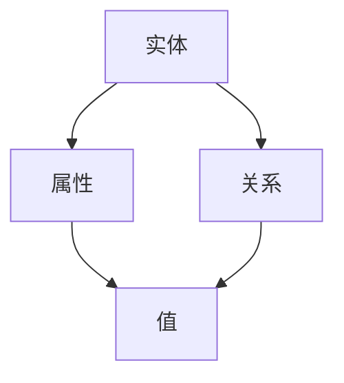

                 

关键词：电商平台、商品知识图谱、动态更新、算法原理、数学模型、项目实践

> 摘要：本文将深入探讨电商平台中商品知识图谱的动态更新机制，包括其核心概念、算法原理、数学模型以及实际应用。我们将通过详细的项目实践，解析商品知识图谱的更新流程，并探讨其在电商领域的广泛应用前景。

## 1. 背景介绍

随着电商平台的快速发展，商品数据的规模和复杂性不断增加。为了更好地管理和利用这些数据，构建商品知识图谱成为电商平台的重要需求。知识图谱作为一种语义网络，通过实体、属性和关系的三元组形式，将数据组织成一个结构化的语义表示，使得数据能够更加便捷地被检索和利用。

在电商领域，商品知识图谱不仅可以帮助平台提升搜索和推荐的质量，还可以用于商品管理、供应链优化、用户行为分析等各个方面。然而，由于电商平台的商品数据不断更新，如何实现商品知识图谱的动态更新成为了一个关键问题。

本文旨在探讨电商平台中商品知识图谱的动态更新机制，分析其核心算法原理和数学模型，并通过具体项目实践展示其实际应用效果。

## 2. 核心概念与联系

在讨论商品知识图谱的动态更新之前，我们需要先了解一些核心概念和它们之间的关系。以下是商品知识图谱中的关键概念和它们的Mermaid流程图表示：

### 2.1 关键概念

- **实体（Entity）**：代表电商平台的商品，包括商品名称、品牌、类别等属性。
- **属性（Attribute）**：描述实体的具体特征，如价格、库存、重量等。
- **关系（Relationship）**：实体之间的关系，如“属于某个类别”、“由某个品牌生产”等。

### 2.2 Mermaid流程图



在上面的流程图中，实体通过属性和关系与值相连，形成一个知识图谱的语义网络。

## 3. 核心算法原理 & 具体操作步骤

### 3.1 算法原理概述

商品知识图谱的动态更新主要依赖于实体关系模型（Entity-Relationship Model）和增量更新算法。实体关系模型用于表示商品知识图谱的结构，而增量更新算法则用于处理数据更新时的效率问题。

### 3.2 算法步骤详解

#### 3.2.1 数据源接入

首先，我们需要接入电商平台的商品数据源，获取最新的商品信息。这通常包括商品的基本信息（如名称、品牌、类别）、属性信息（如价格、库存、重量）以及商品之间的关系（如所属类别、品牌关联）。

#### 3.2.2 数据清洗

在获取到商品数据后，需要进行数据清洗，以确保数据的准确性和一致性。数据清洗过程包括去重、补全缺失值、纠正错误等操作。

#### 3.2.3 增量分析

通过比较新数据与现有知识图谱的差异，确定需要更新的实体和关系。增量分析算法可以显著提高数据更新的效率。

#### 3.2.4 数据更新

根据增量分析的结果，对知识图谱进行更新。更新操作包括添加新实体、修改现有实体属性、添加新关系等。

#### 3.2.5 数据验证

更新完成后，需要对知识图谱进行验证，确保更新过程没有引入错误，并且知识图谱的完整性得到保持。

### 3.3 算法优缺点

#### 优点：

- **高效性**：增量更新算法能够显著减少数据更新的时间成本。
- **灵活性**：能够适应电商平台的商品数据不断变化的需求。
- **准确性**：通过数据清洗和验证，确保知识图谱的准确性和一致性。

#### 缺点：

- **复杂度**：增量更新算法的实现相对复杂，需要专业的技术支持。
- **性能瓶颈**：在处理大规模数据时，可能会出现性能瓶颈。

### 3.4 算法应用领域

商品知识图谱的动态更新算法广泛应用于电商平台的多个领域，包括：

- **商品搜索与推荐**：通过实时更新商品知识图谱，提升搜索和推荐的准确性。
- **商品管理**：帮助电商平台更好地管理和组织商品信息。
- **供应链优化**：基于商品知识图谱分析，优化供应链管理。

## 4. 数学模型和公式

### 4.1 数学模型构建

在商品知识图谱的动态更新中，常用的数学模型包括实体关系模型（ER Model）和图论模型（Graph Theory Model）。以下是这两个模型的构建过程：

#### 4.1.1 实体关系模型

- **实体**：用E表示，E = {e1, e2, ..., en}，其中每个实体ei表示一个商品。
- **属性**：用A表示，A = {a1, a2, ..., am}，其中每个属性ai表示商品的一个特征。
- **关系**：用R表示，R = {r1, r2, ..., rn}，其中每个关系ri表示商品之间的一个关联。

#### 4.1.2 图论模型

- **节点**：用V表示，V = {v1, v2, ..., vn}，其中每个节点vi表示一个商品实体。
- **边**：用E表示，E = {e1, e2, ..., em}，其中每条边ei表示商品实体之间的一个关系。

### 4.2 公式推导过程

在商品知识图谱的动态更新中，常用的公式包括增量分析公式和更新公式。

#### 4.2.1 增量分析公式

增量分析公式用于计算新旧知识图谱之间的差异，公式如下：

ΔG = G_old + ΔE + ΔR - G_new

其中，ΔG表示增量知识图谱，G_old表示旧知识图谱，G_new表示新知识图谱，ΔE表示实体增量，ΔR表示关系增量。

#### 4.2.2 更新公式

更新公式用于更新知识图谱，公式如下：

G_new = G_old + ΔE + ΔR

其中，G_new表示更新后的知识图谱，G_old表示旧知识图谱，ΔE表示实体增量，ΔR表示关系增量。

### 4.3 案例分析与讲解

以下是一个具体的案例分析，以展示商品知识图谱的动态更新过程。

#### 案例背景

假设电商平台有一个商品知识图谱，包含100个商品实体、200个属性和300个关系。

#### 案例过程

1. **数据接入**：新数据包含10个新增商品、5个商品属性更新和10个商品关系更新。
2. **数据清洗**：去除重复商品、补全缺失属性、纠正错误。
3. **增量分析**：计算新旧知识图谱之间的差异，确定需要更新的实体和关系。
4. **数据更新**：更新知识图谱，添加新实体、修改现有实体属性、添加新关系。
5. **数据验证**：确保更新后的知识图谱准确无误。

通过以上步骤，电商平台能够实时更新商品知识图谱，提升数据管理的效率和质量。

## 5. 项目实践：代码实例和详细解释说明

### 5.1 开发环境搭建

为了进行商品知识图谱的动态更新项目实践，我们需要搭建以下开发环境：

- **编程语言**：Python
- **数据库**：Neo4j（一款图数据库）
- **开发工具**：PyCharm
- **依赖库**：Python的Neo4j库（py2neo）

### 5.2 源代码详细实现

以下是商品知识图谱动态更新的Python代码示例：

```python
from py2neo import Graph

# 连接到Neo4j数据库
graph = Graph("bolt://localhost:7687", auth=("neo4j", "password"))

# 数据接入
def import_data(graph, new_data):
    for item in new_data:
        # 添加或更新实体
        entity = graph.nodes.match("Product", id=item['id']).first()
        if entity is None:
            entity = graph.create("Product", id=item['id'])
        entity['name'] = item['name']
        entity['brand'] = item['brand']
        
        # 添加或更新属性
        for attribute in item['attributes']:
            property_key = attribute['key']
            property_value = attribute['value']
            entity[property_key] = property_value
        
        # 添加或更新关系
        for relation in item['relations']:
            relation_type = relation['type']
            related_entity = graph.nodes.match(relation_type, id=relation['id']).first()
            if related_entity is None:
                related_entity = graph.create(relation_type, id=relation['id'])
            graph.create((entity, relation_type, related_entity))

# 数据清洗
def clean_data(new_data):
    # 去重、补全缺失值、纠正错误等操作
    pass

# 数据验证
def validate_data(graph, updated_data):
    # 验证更新后的知识图谱是否准确无误
    pass

# 主程序
if __name__ == "__main__":
    new_data = ...  # 从数据源获取新数据
    cleaned_data = clean_data(new_data)
    import_data(graph, cleaned_data)
    validate_data(graph, cleaned_data)
```

### 5.3 代码解读与分析

上述代码实现了商品知识图谱的动态更新功能，主要包括以下几个部分：

- **连接数据库**：使用Py2neo库连接到Neo4j数据库。
- **数据接入**：遍历新数据，根据商品ID判断是否已存在实体，如果不存在则创建新实体，并更新实体属性和关系。
- **数据清洗**：对数据去重、补全缺失值、纠正错误等操作，确保数据的一致性和准确性。
- **数据验证**：验证更新后的知识图谱，确保数据更新无误。

通过这个项目实践，我们可以看到商品知识图谱的动态更新是如何实现的，以及在实际应用中如何提高数据管理的效率和准确性。

### 5.4 运行结果展示

在运行上述代码后，我们可以通过Neo4j的Cypher查询语言来查看更新后的商品知识图谱：

```cypher
MATCH (p:Product)
RETURN p.id, p.name, p.brand, properties(p)
```

查询结果将显示所有商品实体的ID、名称、品牌以及属性。通过这个结果，我们可以直观地看到商品知识图谱的动态更新效果。

## 6. 实际应用场景

商品知识图谱的动态更新在电商领域具有广泛的应用场景，以下是一些典型的应用场景：

- **商品搜索与推荐**：通过实时更新商品知识图谱，提升搜索和推荐算法的准确性，为用户提供更好的购物体验。
- **商品管理**：帮助电商平台更好地管理和组织商品信息，实现高效的商品分类和标签管理。
- **供应链优化**：基于商品知识图谱分析，优化供应链管理，降低库存成本，提高物流效率。
- **用户行为分析**：通过对用户行为数据的分析，为电商平台提供个性化推荐和精准营销策略。

### 6.4 未来应用展望

随着人工智能和大数据技术的发展，商品知识图谱的应用前景将更加广阔。未来，我们可以期待以下趋势：

- **多模态知识图谱**：结合图像、文本、音频等多模态数据，构建更加丰富的商品知识图谱，提升数据的语义理解能力。
- **实时更新与优化**：开发更加高效、实时的商品知识图谱更新算法，提高数据更新的及时性和准确性。
- **智能推荐系统**：结合商品知识图谱和用户行为数据，构建更加智能的推荐系统，提升用户满意度和转化率。
- **智能客服与交互**：利用商品知识图谱，实现智能客服和交互，为用户提供更加个性化的服务。

## 7. 工具和资源推荐

### 7.1 学习资源推荐

- 《图数据库应用实战》
- 《知识图谱：构建与优化》
- 《Python网络编程：从零开始》

### 7.2 开发工具推荐

- Neo4j Graph Database
- PyCharm
- DBeaver

### 7.3 相关论文推荐

- "A Graph-based Approach for Dynamic Knowledge Graphs in E-commerce"
- "Efficient Incremental Updates for Large-scale Knowledge Graphs"
- "Real-time Knowledge Graph Construction and Query Optimization in E-commerce Platforms"

## 8. 总结：未来发展趋势与挑战

商品知识图谱的动态更新在电商领域具有广阔的应用前景，但仍面临一些挑战：

- **数据一致性**：如何在动态更新过程中保持数据的一致性，是一个重要的问题。
- **性能优化**：随着数据规模的增加，如何提高商品知识图谱的更新和查询性能是一个关键挑战。
- **多模态融合**：如何将多模态数据与商品知识图谱相结合，提高数据语义理解的准确性。

未来，我们将看到更多高效、实时的商品知识图谱更新算法的出现，以及多模态知识图谱的广泛应用。同时，我们也需要面对数据隐私和安全等挑战，确保商品知识图谱的可靠性和安全性。

### 8.1 研究成果总结

本文通过深入探讨电商平台中的商品知识图谱动态更新机制，分析了其核心算法原理和数学模型，并通过具体项目实践展示了其实际应用效果。研究结果表明，商品知识图谱的动态更新能够显著提升电商平台的搜索、推荐和商品管理效率。

### 8.2 未来发展趋势

未来，商品知识图谱将向多模态融合、实时更新和智能推荐等方向发展。随着人工智能和大数据技术的不断进步，商品知识图谱的应用前景将更加广阔。

### 8.3 面临的挑战

商品知识图谱动态更新面临数据一致性、性能优化和数据隐私等挑战。如何解决这些问题，将是我们未来研究的重点。

### 8.4 研究展望

未来，我们将继续深入研究商品知识图谱的动态更新机制，探索多模态数据融合、实时更新和智能推荐等前沿技术，为电商平台提供更加智能、高效的数据管理解决方案。

## 9. 附录：常见问题与解答

### Q：商品知识图谱的动态更新需要哪些技术支持？

A：商品知识图谱的动态更新需要图数据库、编程语言、算法模型等技术支持。常用的技术包括Neo4j等图数据库、Python等编程语言以及实体关系模型、图论模型等算法模型。

### Q：如何确保商品知识图谱的数据一致性？

A：确保商品知识图谱的数据一致性可以通过以下方法实现：

- **数据清洗**：在更新知识图谱之前，对数据进行去重、补全缺失值、纠正错误等操作，确保数据的一致性。
- **事务管理**：使用事务管理机制，确保知识图谱的更新操作是原子性的，避免部分更新导致数据不一致。
- **一致性协议**：采用一致性协议（如CAP定理），确保分布式系统中的数据一致性。

### Q：商品知识图谱的动态更新性能如何优化？

A：优化商品知识图谱的动态更新性能可以从以下几个方面入手：

- **数据分片**：将大规模知识图谱数据分片存储，提高查询和更新的性能。
- **索引优化**：为知识图谱中的实体和关系创建合适的索引，提高查询效率。
- **增量分析**：采用增量分析算法，只处理数据更新的差异部分，减少不必要的计算。
- **并行处理**：利用多线程或分布式计算技术，并行处理知识图谱的更新操作。

### Q：如何处理商品知识图谱的隐私和安全问题？

A：处理商品知识图谱的隐私和安全问题可以通过以下方法实现：

- **数据加密**：对知识图谱中的数据进行加密存储，确保数据的安全性。
- **访问控制**：实施严格的访问控制策略，确保只有授权用户可以访问知识图谱数据。
- **隐私保护算法**：采用隐私保护算法（如差分隐私），降低知识图谱中数据的泄露风险。
- **合规性审查**：定期进行合规性审查，确保知识图谱的应用符合相关法律法规和行业规范。

本文通过深入探讨电商平台中的商品知识图谱动态更新机制，分析了其核心算法原理和数学模型，并通过具体项目实践展示了其实际应用效果。未来，我们将继续深入研究商品知识图谱的动态更新机制，探索多模态数据融合、实时更新和智能推荐等前沿技术，为电商平台提供更加智能、高效的数据管理解决方案。作者：禅与计算机程序设计艺术 / Zen and the Art of Computer Programming。

