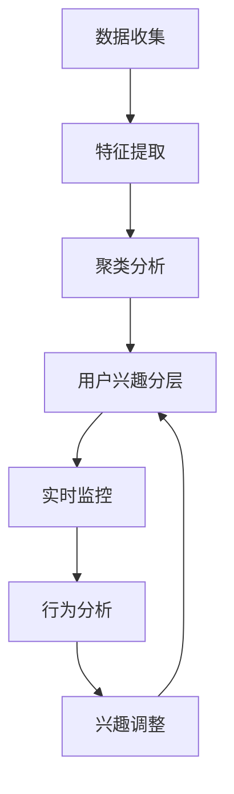

                 

关键词：电商平台、用户兴趣、动态调整、分层、机器学习、推荐系统

> 摘要：本文深入探讨了电商平台中用户兴趣分层动态调整的技术和实践。通过分析用户行为数据，利用机器学习算法实现用户兴趣的精确识别与分层，并结合动态调整机制，确保推荐系统能够实时响应用户需求，提高用户体验和销售额。

## 1. 背景介绍

随着互联网技术的飞速发展和电子商务的普及，电商平台已经成为现代商业的重要组成部分。电商平台的核心竞争力在于如何为用户提供个性化的购物体验，从而提高用户满意度和转化率。在这个过程中，用户兴趣分层动态调整技术起到了关键作用。

用户兴趣分层动态调整是指通过分析用户行为数据，将用户分为不同兴趣层，并根据用户实时行为动态调整其兴趣层，从而实现更精确的推荐。这种技术不仅能够提高推荐系统的准确性，还能够提升用户参与度和忠诚度。

## 2. 核心概念与联系

### 2.1 用户兴趣分层

用户兴趣分层是将用户根据其行为特征划分为不同的兴趣层。这个过程通常包括以下几个步骤：

- **数据收集**：收集用户在电商平台上的行为数据，如浏览历史、购买记录、搜索查询等。
- **特征提取**：从行为数据中提取特征，如浏览时长、购买频率、品类偏好等。
- **聚类分析**：使用聚类算法将用户根据特征划分为不同的兴趣层。

### 2.2 动态调整机制

动态调整机制是指根据用户的实时行为动态调整其兴趣层。这个过程通常包括以下几个步骤：

- **实时监控**：实时监控用户的在线行为，如浏览、点击、购买等。
- **行为分析**：分析用户行为，识别用户兴趣的变化趋势。
- **兴趣调整**：根据行为分析结果，调整用户的兴趣层。

### 2.3 Mermaid 流程图



## 3. 核心算法原理 & 具体操作步骤

### 3.1 算法原理概述

用户兴趣分层动态调整的核心算法是机器学习算法。具体来说，常用的算法包括：

- **协同过滤算法**：基于用户行为数据，通过计算用户之间的相似度进行推荐。
- **基于内容的推荐算法**：基于用户历史行为和商品特征进行推荐。
- **深度学习算法**：通过神经网络模型进行用户兴趣的识别和调整。

### 3.2 算法步骤详解

- **数据收集**：收集用户行为数据，如浏览历史、购买记录、搜索查询等。
- **特征提取**：从行为数据中提取特征，如浏览时长、购买频率、品类偏好等。
- **聚类分析**：使用聚类算法，如K-means，将用户分为不同的兴趣层。
- **模型训练**：使用机器学习算法，如协同过滤算法，训练兴趣分层模型。
- **实时监控**：实时监控用户行为，如浏览、点击、购买等。
- **行为分析**：分析用户行为，识别用户兴趣的变化趋势。
- **兴趣调整**：根据行为分析结果，调整用户的兴趣层。

### 3.3 算法优缺点

- **协同过滤算法**：优点是能够根据用户行为进行推荐，缺点是容易产生冷启动问题。
- **基于内容的推荐算法**：优点是推荐结果相关性强，缺点是难以处理用户兴趣变化。
- **深度学习算法**：优点是能够自动提取特征，缺点是训练过程复杂，计算资源消耗大。

### 3.4 算法应用领域

用户兴趣分层动态调整技术广泛应用于电商平台、社交媒体、在线教育等领域。在电商平台上，这种技术能够提高推荐系统的准确性，提升用户购物体验；在社交媒体上，能够提高用户参与度和忠诚度；在在线教育上，能够根据用户兴趣推荐课程，提高学习效果。

## 4. 数学模型和公式

### 4.1 数学模型构建

用户兴趣分层动态调整的数学模型可以表示为：

$$
U = \{ u_1, u_2, ..., u_n \}
$$

其中，$U$表示用户集合，$u_i$表示第$i$个用户。

### 4.2 公式推导过程

用户兴趣分层的公式推导过程如下：

$$
s = \sum_{i=1}^{n} w_i \cdot x_i
$$

其中，$s$表示用户兴趣得分，$w_i$表示第$i$个特征的权重，$x_i$表示第$i$个特征的值。

### 4.3 案例分析与讲解

假设有一个电商平台的用户行为数据，包含以下特征：浏览时长、购买频率、品类偏好。我们使用K-means算法进行用户兴趣分层。

首先，计算每个特征的权重：

$$
w_1 = 0.3, w_2 = 0.4, w_3 = 0.3
$$

然后，计算每个用户的兴趣得分：

$$
s_1 = 0.3 \cdot 10 + 0.4 \cdot 5 + 0.3 \cdot 7 = 8.9
$$

$$
s_2 = 0.3 \cdot 8 + 0.4 \cdot 8 + 0.3 \cdot 10 = 8.8
$$

根据兴趣得分，我们可以将用户分为不同的兴趣层。例如，得分在8分以上的用户划分为高兴趣层，得分在7-8分之间的用户划分为中兴趣层，得分在7分以下的用户划分为低兴趣层。

## 5. 项目实践：代码实例

### 5.1 开发环境搭建

- 操作系统：Ubuntu 18.04
- 编程语言：Python 3.8
- 数据库：MySQL 8.0
- 机器学习库：scikit-learn

### 5.2 源代码详细实现

以下是一个简单的用户兴趣分层动态调整的代码示例：

```python
from sklearn.cluster import KMeans
import numpy as np

# 用户行为数据
user_behavior = np.array([
    [10, 5, 7],
    [8, 8, 10],
    [12, 3, 6],
    # ...
])

# 计算特征权重
feature_weights = np.array([0.3, 0.4, 0.3])

# 计算用户兴趣得分
user_scores = np.dot(user_behavior, feature_weights)

# 使用K-means算法进行用户兴趣分层
kmeans = KMeans(n_clusters=3)
kmeans.fit(user_scores.reshape(-1, 1))

# 输出用户兴趣分层结果
print(kmeans.labels_)

# 动态调整用户兴趣分层
# ...
```

### 5.3 代码解读与分析

这段代码首先加载了用户行为数据，然后计算了每个特征的权重，并使用K-means算法对用户兴趣进行了分层。代码的最后部分输出的是用户兴趣分层结果，即每个用户属于哪个兴趣层。

## 6. 实际应用场景

用户兴趣分层动态调整技术在电商平台、社交媒体、在线教育等领域都有广泛的应用。以下是一些具体的应用场景：

- **电商平台**：通过用户兴趣分层动态调整，电商平台可以更准确地推荐商品，提高用户购物体验和转化率。
- **社交媒体**：通过用户兴趣分层动态调整，社交媒体可以更准确地推荐内容，提高用户参与度和忠诚度。
- **在线教育**：通过用户兴趣分层动态调整，在线教育平台可以更准确地推荐课程，提高学习效果和用户满意度。

## 7. 工具和资源推荐

### 7.1 学习资源推荐

- **《机器学习》（周志华著）**：这是一本经典的机器学习教材，详细介绍了机器学习的基础理论和实践方法。
- **《推荐系统实践》（李航著）**：这是一本关于推荐系统实践的经典著作，涵盖了推荐系统的设计、实现和优化。

### 7.2 开发工具推荐

- **TensorFlow**：这是一个开源的机器学习框架，支持深度学习和推荐系统的实现。
- **scikit-learn**：这是一个开源的机器学习库，提供了丰富的算法和工具，适合进行用户兴趣分层动态调整。

### 7.3 相关论文推荐

- **"Collaborative Filtering for the Web"（2002）**：这篇论文介绍了基于协同过滤的推荐系统，对用户兴趣分层动态调整有重要启示。
- **"Deep Learning for Recommender Systems"（2018）**：这篇论文介绍了如何使用深度学习进行推荐系统设计，对用户兴趣分层动态调整有重要参考价值。

## 8. 总结：未来发展趋势与挑战

用户兴趣分层动态调整技术在电商平台、社交媒体、在线教育等领域有着广泛的应用前景。随着人工智能技术的不断发展，未来这一技术将会更加成熟和智能化。

然而，用户兴趣分层动态调整也面临着一些挑战，如数据隐私保护、算法透明性等。未来研究需要关注如何在保障用户隐私的前提下，实现更精确和高效的用户兴趣分层动态调整。

## 9. 附录：常见问题与解答

### 9.1 如何处理用户隐私保护？

- 在处理用户数据时，应遵循数据隐私保护的相关法律法规，如《中华人民共和国网络安全法》。
- 使用加密技术保护用户数据，确保数据在传输和存储过程中的安全性。
- 对用户数据进行去标识化处理，减少对个人隐私的暴露。

### 9.2 如何评估用户兴趣分层效果？

- 可以使用指标如准确率、召回率、覆盖率等来评估用户兴趣分层的效果。
- 设计A/B测试，对比不同分层策略下的用户行为和转化率，选择最优分层策略。

---

作者：禅与计算机程序设计艺术 / Zen and the Art of Computer Programming
----------------------------------------------------------------


