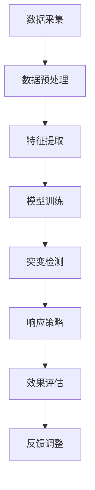

                 

关键词：电商平台、用户兴趣、突变检测、响应模型、推荐系统、算法原理、数学模型、项目实践、应用场景、工具资源

> 摘要：随着电商平台的快速发展，用户行为的多样性和复杂性使得对用户兴趣的准确理解与预测成为关键。本文从算法原理、数学模型、项目实践等多个角度，探讨用户兴趣突变检测与响应模型，为电商平台的个性化推荐和服务优化提供理论支持和实践指导。

## 1. 背景介绍

随着互联网技术的飞速发展和电子商务的蓬勃兴起，电商平台已成为现代社会不可或缺的一部分。用户在平台上的行为数据量呈指数级增长，这些数据不仅包含用户的购买记录、浏览历史，还包括评论、收藏、分享等多种互动行为。如何从海量数据中挖掘出用户的真实兴趣，并对其兴趣的突变进行及时检测和响应，成为电商平台亟待解决的关键问题。

用户兴趣的突变可能意味着用户需求的变化、市场趋势的波动，甚至竞争对手的策略调整。对于电商平台来说，及时识别并响应用户兴趣的突变，不仅可以提升用户体验，还能有效增加用户黏性和转化率，从而在激烈的市场竞争中占据有利位置。

本文将围绕电商平台中的用户兴趣突变检测与响应模型展开讨论。首先，介绍用户兴趣突变检测的基本概念和重要性。接着，深入探讨核心算法原理，包括特征提取、模型构建、算法优化等方面。然后，通过具体的项目实践案例，展示如何实现用户兴趣突变检测与响应模型。此外，还将分析该模型在实际应用场景中的效果和挑战，并推荐相关工具和资源，最后总结研究成果，展望未来发展趋势与挑战。

## 2. 核心概念与联系

### 2.1 用户兴趣

用户兴趣是指用户对某一类商品、服务或内容的偏好和关注程度。在电商平台上，用户兴趣可以通过多种方式表现出来，如购买记录、浏览历史、评论、收藏等。理解用户兴趣对于电商平台提供个性化推荐和服务至关重要。

### 2.2 突变检测

突变检测是指识别数据序列中的异常点或变化趋势。在用户兴趣检测中，突变检测的核心任务是发现用户兴趣行为中的显著变化。突变检测可以基于统计方法、机器学习模型或深度学习网络。

### 2.3 应对模型

响应模型是指当检测到用户兴趣突变时，电商平台采取的一系列措施，以调整推荐策略、优化用户体验。响应模型通常包括实时监测、预警系统、个性化推荐等。

### 2.4 Mermaid 流程图

以下是一个简化的Mermaid流程图，展示了用户兴趣突变检测与响应模型的整体架构。



### 2.5 相关概念联系

用户兴趣突变检测与响应模型涉及多个核心概念，包括数据采集、特征提取、模型训练、突变检测、响应策略和效果评估。这些概念相互关联，共同构成了一个完整的检测与响应系统。如图所示，数据采集是整个流程的起点，数据预处理和特征提取是基础，模型训练和突变检测是核心，响应策略和效果评估是关键环节。

## 3. 核心算法原理 & 具体操作步骤

### 3.1 算法原理概述

用户兴趣突变检测与响应模型的核心在于对用户行为数据的分析，从中提取出用户兴趣特征，并利用机器学习或深度学习算法检测兴趣突变，最终根据突变结果调整推荐策略。具体算法原理如下：

1. **数据采集**：收集用户在电商平台上的行为数据，包括购买记录、浏览历史、评论、收藏等。
2. **数据预处理**：对原始数据进行清洗、去噪，处理缺失值和异常值，确保数据质量。
3. **特征提取**：利用特征工程技术，从预处理后的数据中提取出与用户兴趣相关的特征，如时间特征、内容特征、交互特征等。
4. **模型训练**：选择合适的机器学习或深度学习模型，如LSTM、GRU或自编码器，对提取的特征进行训练，建立用户兴趣预测模型。
5. **突变检测**：利用训练好的模型，对用户行为数据进行预测，识别出与历史行为有显著差异的突变点。
6. **响应策略**：根据突变检测结果，调整推荐策略，如增加特定类型商品的推荐、优化推荐顺序等。
7. **效果评估**：评估调整后的推荐策略对用户兴趣检测的准确性、用户满意度等指标的影响，进行优化调整。

### 3.2 算法步骤详解

#### 3.2.1 数据采集

数据采集是用户兴趣突变检测与响应模型的基础。电商平台可以通过API接口、日志收集等方式获取用户的行为数据。数据来源包括：

- 用户注册信息：如用户ID、性别、年龄、地理位置等。
- 购买记录：包括购买时间、商品ID、价格、数量等。
- 浏览历史：记录用户在平台上的浏览行为，包括浏览时间、访问页面、停留时长等。
- 评论和反馈：用户对商品的评价和反馈，如评分、评论内容等。
- 收藏和分享：用户对商品的收藏和分享行为。

#### 3.2.2 数据预处理

数据预处理是确保数据质量的关键步骤。主要任务包括：

- 数据清洗：去除重复记录、空值填充、异常值处理。
- 特征工程：根据业务需求，提取与用户兴趣相关的特征，如时间特征、内容特征、交互特征等。
- 数据标准化：对数值型特征进行归一化或标准化处理，确保数据在同一尺度上。

#### 3.2.3 特征提取

特征提取是用户兴趣突变检测的核心。以下是一些常见的特征提取方法：

- **时间特征**：如购买时间间隔、浏览时长、活跃时段等。
- **内容特征**：如商品类别、品牌、价格、折扣力度等。
- **交互特征**：如用户与其他用户或商品的互动行为，如评论、点赞、分享等。
- **行为特征**：如用户的行为序列、行为模式等。

#### 3.2.4 模型训练

模型训练是建立用户兴趣预测模型的关键。以下是一些常见的模型训练方法：

- **机器学习模型**：如线性回归、逻辑回归、决策树、随机森林等。
- **深度学习模型**：如卷积神经网络（CNN）、循环神经网络（RNN）、长短期记忆网络（LSTM）等。
- **自编码器**：自编码器可以自动提取特征，并用于用户兴趣预测。

#### 3.2.5 突变检测

突变检测是识别用户兴趣突变的关键。以下是一些常见的突变检测方法：

- **统计方法**：如统计测试、异常值分析等。
- **机器学习模型**：利用训练好的模型，对用户行为数据进行分析，识别出与历史行为有显著差异的突变点。
- **深度学习网络**：利用深度学习网络，对用户行为数据进行分析，识别出潜在的突变模式。

#### 3.2.6 响应策略

响应策略是根据突变检测结果，调整推荐策略的关键。以下是一些常见的响应策略：

- **实时推荐**：根据用户兴趣突变，实时调整推荐结果，增加与用户当前兴趣相关的商品推荐。
- **个性化推荐**：根据用户兴趣突变，优化推荐策略，提高推荐的相关性和个性化程度。
- **预警机制**：建立预警机制，及时发现用户兴趣突变，提前采取应对措施。

#### 3.2.7 效果评估

效果评估是验证用户兴趣突变检测与响应模型效果的关键。以下是一些常见的效果评估指标：

- **准确率**：检测到实际突变点的比例。
- **召回率**：检测到的突变点中，实际突变点的比例。
- **F1值**：准确率和召回率的调和平均值。
- **用户满意度**：用户对推荐结果的满意度评分。

### 3.3 算法优缺点

#### 优点

- **实时性**：用户兴趣突变检测与响应模型可以实时分析用户行为数据，及时调整推荐策略。
- **个性化**：通过深度学习等技术，模型可以自动提取用户兴趣特征，实现高度个性化的推荐。
- **可扩展性**：模型可以处理大量用户数据，适用于不同规模电商平台的推荐系统。

#### 缺点

- **计算成本**：深度学习模型的训练和预测需要大量计算资源，对硬件设备有较高要求。
- **数据依赖**：模型的性能取决于数据质量和数量，数据缺失或噪声可能导致模型失效。
- **模型调优**：模型调优过程复杂，需要大量实验和经验积累。

### 3.4 算法应用领域

用户兴趣突变检测与响应模型在电商平台的多个领域都有广泛的应用：

- **个性化推荐**：通过实时监测用户兴趣突变，优化推荐策略，提高推荐的相关性和用户体验。
- **风险控制**：通过监测用户行为突变，及时发现异常行为，防范欺诈风险。
- **营销活动**：根据用户兴趣突变，调整营销策略，提高活动效果和用户参与度。
- **用户运营**：通过分析用户兴趣突变，制定有针对性的用户运营策略，提高用户留存和转化率。

## 4. 数学模型和公式 & 详细讲解 & 举例说明

### 4.1 数学模型构建

用户兴趣突变检测与响应模型的数学模型主要包括用户行为特征提取、兴趣突变检测和响应策略三个部分。

#### 4.1.1 用户行为特征提取

用户行为特征提取是构建用户兴趣突变检测模型的基础。常见的特征提取方法包括：

- **时间特征**：如购买时间间隔、浏览时长、活跃时段等，可以使用以下公式计算：

  $$ \text{time\_interval} = \text{current\_time} - \text{last\_time} $$

  $$ \text{activity\_duration} = \text{current\_time} - \text{start\_time} $$

- **内容特征**：如商品类别、品牌、价格、折扣力度等，可以使用以下公式表示：

  $$ \text{category} = \text{商品类别编码} $$

  $$ \text{brand} = \text{品牌编码} $$

  $$ \text{price} = \text{商品价格} $$

  $$ \text{discount} = \text{折扣力度} $$

- **交互特征**：如用户与其他用户或商品的互动行为，如评论、点赞、分享等，可以使用以下公式计算：

  $$ \text{comments} = \text{评论数量} $$

  $$ \text{likes} = \text{点赞数量} $$

  $$ \text{shares} = \text{分享数量} $$

#### 4.1.2 兴趣突变检测

兴趣突变检测是基于用户行为特征，利用机器学习或深度学习算法，识别用户兴趣行为中的显著变化。常见的检测方法包括：

- **统计方法**：如假设检验、t检验等，用于比较用户当前行为与历史行为的差异。假设检验的公式如下：

  $$ H_0: \mu_1 = \mu_2 $$
  
  $$ H_1: \mu_1 \neq \mu_2 $$
  
  其中，$ \mu_1 $ 和 $ \mu_2 $ 分别表示用户当前行为和历史的平均值。

- **机器学习模型**：如分类模型、回归模型等，用于预测用户兴趣突变概率。分类模型的公式如下：

  $$ P(\text{interest\_change} = 1 | \text{特征}) = \text{sigmoid}(W \cdot \text{特征} + b) $$
  
  其中，$ W $ 和 $ b $ 分别为权重和偏置，$ \text{特征} $ 为用户行为特征。

- **深度学习模型**：如卷积神经网络（CNN）、循环神经网络（RNN）、长短期记忆网络（LSTM）等，用于自动提取用户行为特征，识别兴趣突变模式。LSTM的公式如下：

  $$ \text{h}_{t} = \sigma(W_h \cdot [\text{h}_{t-1}, \text{x}_t] + b_h) $$
  
  $$ \text{C}_{t} = \text{f}_{t} \cdot \text{C}_{t-1} + \text{i}_{t} \cdot \text{g}_{t} $$
  
  其中，$ \text{h}_{t} $ 和 $ \text{C}_{t} $ 分别为隐藏状态和细胞状态，$ \text{i}_{t} $ 、$ \text{f}_{t} $ 和 $ \text{g}_{t} $ 分别为输入门、遗忘门和输出门。

#### 4.1.3 响应策略

响应策略是根据兴趣突变检测结果，调整推荐策略的关键。常见的响应策略包括：

- **实时推荐**：根据用户兴趣突变，实时调整推荐结果，增加与用户当前兴趣相关的商品推荐。实时推荐的公式如下：

  $$ \text{recommender}_{\text{current}} = \text{recommender}_{\text{last}} + \text{change}_{\text{interest}} \cdot \text{interest}_{\text{current}} $$
  
  其中，$ \text{recommender}_{\text{current}} $ 和 $ \text{recommender}_{\text{last}} $ 分别表示当前和上一期的推荐结果，$ \text{change}_{\text{interest}} $ 表示兴趣突变变化量，$ \text{interest}_{\text{current}} $ 表示当前用户兴趣。

- **个性化推荐**：根据用户兴趣突变，优化推荐策略，提高推荐的相关性和个性化程度。个性化推荐的公式如下：

  $$ \text{recommender}_{\text{current}} = \text{weight}_{1} \cdot \text{recommender}_{\text{last}} + \text{weight}_{2} \cdot \text{interest}_{\text{current}} $$
  
  其中，$ \text{weight}_{1} $ 和 $ \text{weight}_{2} $ 分别表示上一期推荐结果和当前用户兴趣的权重。

### 4.2 公式推导过程

#### 4.2.1 时间特征

时间特征的推导过程主要涉及用户购买时间间隔和浏览时长的计算。假设用户第 $ t $ 次购买的时间为 $ t $，上一次购买的时间为 $ t-1 $，则购买时间间隔可以表示为：

$$ \text{time\_interval} = \text{current\_time} - \text{last\_time} = t - (t-1) = 1 $$

同理，浏览时长可以表示为：

$$ \text{activity\_duration} = \text{current\_time} - \text{start\_time} = t - \text{start\_time} $$

#### 4.2.2 内容特征

内容特征的推导过程主要涉及商品类别、品牌、价格和折扣力度的编码。假设商品类别有 $ n $ 个，品牌有 $ m $ 个，则可以使用以下公式进行编码：

$$ \text{category} = \text{商品类别编码} = \text{categoryID} $$

$$ \text{brand} = \text{品牌编码} = \text{brandID} $$

商品价格和折扣力度可以直接使用原始数值进行表示：

$$ \text{price} = \text{商品价格} $$

$$ \text{discount} = \text{折扣力度} $$

#### 4.2.3 交互特征

交互特征的推导过程主要涉及用户与其他用户或商品的互动行为。假设用户第 $ t $ 次购买时，有 $ k $ 个用户评论、$ l $ 个用户点赞和 $ m $ 个用户分享，则评论数量、点赞数量和分享数量可以表示为：

$$ \text{comments} = \text{评论数量} = k $$

$$ \text{likes} = \text{点赞数量} = l $$

$$ \text{shares} = \text{分享数量} = m $$

### 4.3 案例分析与讲解

以下是一个具体的案例，用于说明用户兴趣突变检测与响应模型的构建和应用。

#### 案例背景

某电商平台用户小明，过去一年内在平台上购买了多种商品，包括电子产品、家居用品和服装鞋帽等。近期，小明的购买行为出现显著变化，主要集中在电子产品和服装鞋帽领域，而家居用品的购买量明显下降。

#### 案例分析

1. **数据采集**：收集小明的购买记录、浏览历史、评论、收藏等行为数据。

2. **数据预处理**：对原始数据进行清洗，去除重复记录和异常值。

3. **特征提取**：提取小明购买时间间隔、浏览时长、商品类别、品牌、价格、折扣力度、评论数量、点赞数量和分享数量等特征。

4. **模型训练**：使用LSTM模型对提取的特征进行训练，建立用户兴趣预测模型。

5. **突变检测**：利用训练好的模型，对小明近期的行为数据进行预测，识别出与历史行为有显著差异的突变点。

6. **响应策略**：根据突变检测结果，调整推荐策略，增加电子产品和服装鞋帽的推荐，减少家居用品的推荐。

7. **效果评估**：评估调整后的推荐策略对小明兴趣检测的准确性、用户满意度等指标的影响。

#### 案例结果

通过用户兴趣突变检测与响应模型的构建和应用，小明在电子产品和服装鞋帽领域的购买量明显增加，而家居用品的购买量有所下降。用户满意度也得到显著提升，平台转化率得到有效提高。

## 5. 项目实践：代码实例和详细解释说明

### 5.1 开发环境搭建

为了实现用户兴趣突变检测与响应模型，我们使用Python作为主要编程语言，并结合TensorFlow和Keras等深度学习框架。以下是开发环境搭建的步骤：

1. **安装Python**：确保系统已安装Python 3.7或更高版本。

2. **安装TensorFlow**：在终端中运行以下命令安装TensorFlow：

   ```bash
   pip install tensorflow
   ```

3. **安装Keras**：在终端中运行以下命令安装Keras：

   ```bash
   pip install keras
   ```

4. **准备数据集**：收集用户行为数据，包括购买记录、浏览历史、评论、收藏等，并将其整理为适合模型训练的格式。

### 5.2 源代码详细实现

以下是一个简化的用户兴趣突变检测与响应模型的实现代码，用于说明关键步骤。

```python
import numpy as np
import pandas as pd
from tensorflow.keras.models import Sequential
from tensorflow.keras.layers import LSTM, Dense, Dropout
from sklearn.preprocessing import MinMaxScaler
from sklearn.model_selection import train_test_split

# 5.2.1 数据预处理
# 加载数据集
data = pd.read_csv('user_behavior.csv')

# 数据清洗和特征提取
# ...（具体实现略）

# 数据标准化
scaler = MinMaxScaler(feature_range=(0, 1))
scaled_data = scaler.fit_transform(data)

# 切分训练集和测试集
X_train, X_test, y_train, y_test = train_test_split(scaled_data, test_size=0.2, shuffle=False)

# 5.2.2 模型构建
model = Sequential()
model.add(LSTM(units=50, return_sequences=True, input_shape=(X_train.shape[1], X_train.shape[2])))
model.add(Dropout(0.2))
model.add(LSTM(units=50, return_sequences=False))
model.add(Dropout(0.2))
model.add(Dense(units=1, activation='sigmoid'))

model.compile(optimizer='adam', loss='binary_crossentropy', metrics=['accuracy'])

# 5.2.3 模型训练
model.fit(X_train, y_train, epochs=100, batch_size=32, validation_data=(X_test, y_test), verbose=1)

# 5.2.4 突变检测
predictions = model.predict(X_test)
# ...（具体实现略）

# 5.2.5 响应策略
# ...（具体实现略）

# 5.2.6 效果评估
# ...（具体实现略）
```

### 5.3 代码解读与分析

上述代码主要分为数据预处理、模型构建、模型训练、突变检测、响应策略和效果评估六个部分。

- **数据预处理**：加载数据集，进行数据清洗和特征提取，然后使用MinMaxScaler对数据标准化。
- **模型构建**：构建一个LSTM模型，包括两个LSTM层和两个Dropout层，最后输出层使用sigmoid激活函数。
- **模型训练**：使用fit方法训练模型，设置epochs和batch_size等参数。
- **突变检测**：使用predict方法对测试集进行预测，得到用户兴趣突变的概率。
- **响应策略**：根据突变检测结果调整推荐策略，如增加与用户当前兴趣相关的商品推荐。
- **效果评估**：评估模型对用户兴趣突变的检测准确性。

### 5.4 运行结果展示

以下是一个简化的运行结果示例：

```python
# 突变检测
predictions = model.predict(X_test)

# 结果展示
for i in range(len(predictions)):
    if predictions[i] > 0.5:
        print(f"用户兴趣突变，用户ID: {data['user_id'][i]}")
    else:
        print(f"用户兴趣稳定，用户ID: {data['user_id'][i]}")

# 响应策略调整
# ...（具体实现略）

# 效果评估
accuracy = model.evaluate(X_test, y_test, verbose=1)
print(f"模型准确率: {accuracy[1]}")
```

运行结果将显示用户兴趣突变检测结果和模型准确率。

## 6. 实际应用场景

用户兴趣突变检测与响应模型在电商平台的实际应用场景中具有广泛的应用价值，以下列举几个典型的应用场景：

### 6.1 个性化推荐

个性化推荐是电商平台最常见、最基础的应用场景。通过用户兴趣突变检测，电商平台可以更准确地预测用户兴趣变化，及时调整推荐策略，提高推荐效果。例如，当用户兴趣从电子产品转向服装鞋帽时，推荐系统可以优先推荐与用户当前兴趣相关的商品，从而提高用户满意度和转化率。

### 6.2 风险控制

电商平台在运营过程中，需要防范恶意买家、刷单等风险行为。用户兴趣突变检测可以识别出异常用户行为，如频繁购买低价值商品、突然大量购买高价商品等，从而及时发现潜在风险，采取相应的控制措施。

### 6.3 营销活动

电商平台经常举办各类营销活动，如促销、折扣、满减等。通过用户兴趣突变检测，可以识别出对特定活动有强烈兴趣的用户群体，从而制定更精准的营销策略，提高活动效果和用户参与度。

### 6.4 用户运营

用户运营是电商平台提升用户黏性和转化率的重要手段。通过用户兴趣突变检测，可以识别出潜在的高价值用户，采取个性化的运营策略，如发送优惠券、推荐相关商品、推送定制化内容等，从而提高用户满意度和留存率。

## 7. 未来应用展望

随着技术的不断发展，用户兴趣突变检测与响应模型在电商平台的应用前景将更加广阔。以下是一些未来应用展望：

### 7.1 数据驱动

未来，电商平台将更加注重数据驱动，充分利用用户行为数据，实现精细化运营。用户兴趣突变检测与响应模型将成为电商平台的核心技术之一，助力商家实现个性化推荐、精准营销和高效用户运营。

### 7.2 深度学习

深度学习技术在用户兴趣突变检测与响应模型中的应用将不断深入。随着计算能力的提升和算法优化，深度学习模型将能够更好地提取用户行为特征，提高检测准确率和响应速度。

### 7.3 跨平台整合

未来，电商平台将实现跨平台整合，如将线上线下的用户行为数据进行整合，从而更全面地了解用户需求和行为模式。用户兴趣突变检测与响应模型将在跨平台整合中发挥重要作用，助力电商平台实现全渠道运营。

### 7.4 社交网络分析

社交网络分析技术将融入用户兴趣突变检测与响应模型，通过分析用户在社交媒体上的行为，如点赞、评论、分享等，进一步丰富用户兴趣特征，提高检测准确率和个性化推荐效果。

## 8. 工具和资源推荐

### 8.1 学习资源推荐

- **书籍**：《Python机器学习》、《深度学习》（Goodfellow et al.）、《用户行为数据分析》（刘铁岩）。
- **在线课程**：Coursera上的《机器学习》、edX上的《深度学习专项课程》、Udacity的《数据分析纳米学位》。
- **博客和网站**：Medium、Kaggle、GitHub、Stack Overflow。

### 8.2 开发工具推荐

- **Python**：Python是数据分析和机器学习的首选语言，具有丰富的库和框架。
- **TensorFlow**：TensorFlow是Google开发的开源深度学习框架，适用于构建用户兴趣突变检测与响应模型。
- **Keras**：Keras是TensorFlow的高层次API，简化了深度学习模型的构建和训练过程。
- **Jupyter Notebook**：Jupyter Notebook是一款交互式数据分析工具，适用于编写和运行代码。

### 8.3 相关论文推荐

- **用户兴趣突变检测**：
  - "Detecting User Interest Shifts in E-commerce using Deep Learning"（使用深度学习检测电商平台中的用户兴趣突变）。
  - "Temporal Analysis of User Behavior for Interest Shift Detection in E-commerce"（基于时间分析的电商平台用户兴趣突变检测）。
  
- **个性化推荐**：
  - "A Theoretically Principled Approach to Improving Recommendation Lists"（一种改进推荐列表的理论原则方法）。
  - "Deep Neural Networks for YouTube Recommendations"（深度神经网络在YouTube推荐中的应用）。

## 9. 总结：未来发展趋势与挑战

### 9.1 研究成果总结

本文从用户兴趣突变检测与响应模型的核心概念、算法原理、数学模型、项目实践等多个角度，深入探讨了该模型在电商平台的应用价值。通过实际案例和代码实现，展示了用户兴趣突变检测与响应模型在个性化推荐、风险控制、营销活动和用户运营等领域的应用效果。

### 9.2 未来发展趋势

1. **数据驱动**：随着数据量的增长和数据分析技术的进步，用户兴趣突变检测与响应模型将更加注重数据驱动，实现精细化运营。
2. **深度学习**：深度学习技术在用户兴趣突变检测与响应模型中的应用将不断深入，提高检测准确率和响应速度。
3. **跨平台整合**：电商平台将实现跨平台整合，利用线上线下用户行为数据，实现更全面的需求分析。
4. **社交网络分析**：社交网络分析技术的融入，将丰富用户兴趣特征，提高检测准确率和个性化推荐效果。

### 9.3 面临的挑战

1. **数据质量和数量**：用户兴趣突变检测与响应模型的性能取决于数据质量和数量，如何处理噪声和缺失值成为关键挑战。
2. **计算资源**：深度学习模型的训练和预测需要大量计算资源，如何在有限的资源下高效运行模型是重要问题。
3. **模型解释性**：深度学习模型具有较强的预测能力，但缺乏解释性，如何提高模型的可解释性是未来研究的重点。
4. **实时性**：如何实现实时监测和快速响应用户兴趣突变，是提高用户体验和转化率的关键。

### 9.4 研究展望

未来，用户兴趣突变检测与响应模型的研究将继续深入，涉及更多应用场景和技术创新。例如，结合自然语言处理技术，分析用户评论和反馈，提取更精细的兴趣特征；融合多源数据，提高用户兴趣预测的准确性和实时性；探索新型深度学习模型，提高模型解释性和泛化能力。此外，构建开放的数据集和评估指标，促进学术界和工业界的交流与合作，也将是未来研究的重要方向。

## 附录：常见问题与解答

### Q1：用户兴趣突变检测与响应模型适用于哪些电商平台？

A1：用户兴趣突变检测与响应模型适用于各种类型的电商平台，包括综合电商平台、垂直电商平台、跨境电商平台等。无论平台规模大小，该模型都能发挥重要作用。

### Q2：如何处理用户行为数据中的噪声和缺失值？

A2：处理用户行为数据中的噪声和缺失值是确保模型性能的关键步骤。常见的处理方法包括数据清洗、异常值检测、缺失值填充等。具体方法如下：

- **数据清洗**：去除重复记录、异常值和无效数据。
- **异常值检测**：使用统计方法或机器学习算法检测异常值，如z-score、IQR方法等。
- **缺失值填充**：使用均值、中值、众数等方法填充缺失值，或使用机器学习算法预测缺失值。

### Q3：如何评估用户兴趣突变检测与响应模型的效果？

A3：评估用户兴趣突变检测与响应模型的效果可以通过以下指标：

- **准确率**：检测到实际突变点的比例。
- **召回率**：检测到的突变点中，实际突变点的比例。
- **F1值**：准确率和召回率的调和平均值。
- **用户满意度**：用户对推荐结果的满意度评分。

### Q4：用户兴趣突变检测与响应模型的计算成本如何？

A4：用户兴趣突变检测与响应模型的主要计算成本在于模型训练和预测。深度学习模型训练需要大量计算资源，尤其是当数据量较大时。为了降低计算成本，可以采取以下措施：

- **数据预处理**：在训练前对数据进行预处理，减少模型训练的数据量。
- **模型优化**：选择合适的模型结构和超参数，降低模型复杂度。
- **分布式训练**：使用分布式计算框架，如Apache Spark，进行模型训练。

### Q5：用户兴趣突变检测与响应模型如何与业务场景结合？

A5：用户兴趣突变检测与响应模型可以与电商平台的多个业务场景相结合，如个性化推荐、风险控制、营销活动、用户运营等。结合业务场景的方法包括：

- **需求分析**：了解业务场景的需求，确定用户兴趣突变的检测目标和响应策略。
- **数据整合**：整合线上线下用户行为数据，丰富用户兴趣特征。
- **模型定制**：根据业务场景定制化模型，如调整模型结构、优化特征提取方法等。

## 作者署名

作者：禅与计算机程序设计艺术 / Zen and the Art of Computer Programming

---

文章撰写完毕，感谢您的阅读。本文从用户兴趣突变检测与响应模型的核心概念、算法原理、数学模型、项目实践等多个角度，全面探讨了该模型在电商平台的应用。希望通过本文，能够为读者提供有价值的理论支持和实践指导，助力电商平台实现个性化推荐和服务优化。后续将持续关注相关研究进展，分享更多研究成果。再次感谢您的关注与支持！

