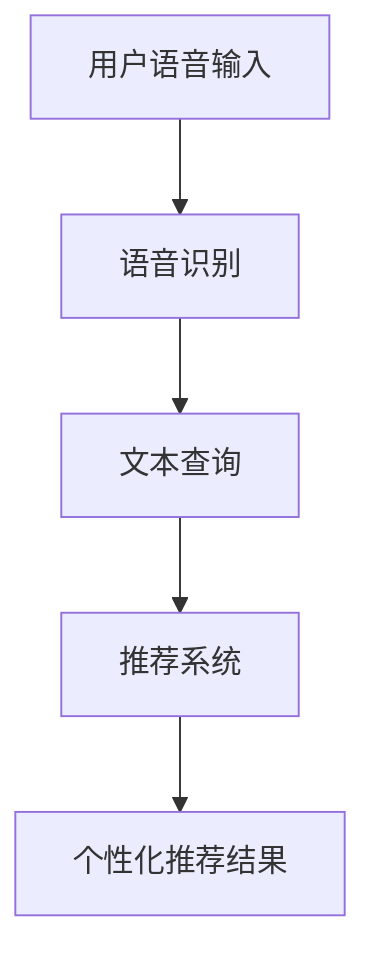

                 

关键词：电商平台、语音搜索、推荐系统、人工智能、自然语言处理

## 摘要

本文将探讨电商平台中语音搜索与推荐技术的应用，深入分析其核心概念、算法原理、数学模型以及实际应用案例。通过对语音搜索和推荐系统的工作原理和实现技术进行详细阐述，本文旨在为读者提供对这一领域的全面理解，并展望其未来发展趋势与挑战。

## 1. 背景介绍

### 1.1 电商平台的现状与挑战

随着互联网技术的迅猛发展，电商平台已经成为现代商业活动中不可或缺的一部分。用户数量和交易额的持续增长，使得电商平台面临着越来越多的挑战。其中，如何提高用户体验、增加用户粘性成为各大电商平台关注的焦点。

### 1.2 语音搜索的兴起

语音搜索作为一种新型的人机交互方式，正逐渐改变人们的搜索习惯。其便捷性、实时性和自然性使得语音搜索在电商平台上具有广泛的应用前景。通过语音搜索，用户可以更加快速地找到所需商品，从而提高购物体验。

### 1.3 推荐系统的价值

推荐系统是一种基于用户行为和偏好进行商品推荐的技术。在电商平台上，推荐系统可以帮助用户发现潜在的兴趣商品，提高购买转化率。同时，推荐系统还可以为平台带来更多的商业价值，如广告收入、增值服务等。

## 2. 核心概念与联系

### 2.1 语音搜索

语音搜索是一种通过语音识别技术将用户的语音输入转换为文本查询，然后利用搜索引擎返回相关结果的技术。其核心包括语音识别、自然语言处理和搜索算法。

### 2.2 推荐系统

推荐系统是一种基于用户行为、偏好和历史数据的算法，用于预测用户可能感兴趣的商品。其核心包括用户建模、商品建模和推荐算法。

### 2.3 语音搜索与推荐系统的联系

语音搜索和推荐系统在电商平台中有着密切的联系。语音搜索为推荐系统提供了用户输入的方式，而推荐系统则为语音搜索提供了针对用户兴趣的个性化结果。二者共同作用，为用户提供了一站式的购物体验。

### 2.4 Mermaid 流程图



## 3. 核心算法原理 & 具体操作步骤

### 3.1 算法原理概述

#### 3.1.1 语音识别

语音识别技术通过将语音信号转换为文本，实现语音到文本的转换。其核心包括特征提取、声学模型和语言模型。

#### 3.1.2 自然语言处理

自然语言处理技术用于对文本查询进行处理和分析，包括分词、词性标注、句法分析等。其核心是构建一套能够理解和生成自然语言的方法。

#### 3.1.3 推荐算法

推荐算法包括基于内容的推荐、协同过滤推荐和混合推荐等。其核心是利用用户行为数据和商品特征数据，预测用户可能感兴趣的商品。

### 3.2 算法步骤详解

#### 3.2.1 语音识别

1. 特征提取：将语音信号转换为特征向量。
2. 声学模型：利用特征向量对语音进行分类。
3. 语言模型：对识别结果进行修正和优化。

#### 3.2.2 自然语言处理

1. 分词：将文本划分为词语。
2. 词性标注：为每个词语标注词性。
3. 句法分析：分析词语之间的关系。

#### 3.2.3 推荐算法

1. 用户建模：提取用户行为特征。
2. 商品建模：提取商品特征。
3. 算法计算：利用算法计算用户兴趣度。

### 3.3 算法优缺点

#### 3.3.1 语音识别

优点：方便快捷，适合移动端使用。
缺点：识别准确率受语音质量、口音等因素影响。

#### 3.3.2 自然语言处理

优点：能够理解自然语言，提供更准确的查询结果。
缺点：处理复杂，计算资源消耗大。

#### 3.3.3 推荐算法

优点：提高用户购买转化率，增加商业价值。
缺点：可能存在过度推荐和推荐效果不佳的问题。

### 3.4 算法应用领域

语音搜索和推荐系统在电商平台、视频平台、社交媒体等多个领域有着广泛的应用。

## 4. 数学模型和公式 & 详细讲解 & 举例说明

### 4.1 数学模型构建

#### 4.1.1 语音识别

语音识别的数学模型主要包括特征提取模型和声学模型。特征提取模型用于将语音信号转换为特征向量，声学模型用于对特征向量进行分类。

#### 4.1.2 自然语言处理

自然语言处理的数学模型主要包括词向量模型、句法分析模型等。词向量模型用于将词语表示为向量，句法分析模型用于分析词语之间的关系。

#### 4.1.3 推荐算法

推荐算法的数学模型主要包括基于内容的推荐模型、协同过滤推荐模型等。基于内容的推荐模型利用用户行为特征和商品特征计算相似度，协同过滤推荐模型利用用户行为数据计算用户兴趣度。

### 4.2 公式推导过程

#### 4.2.1 语音识别

特征提取模型：$$ f(x) = \sum_{i=1}^{n} w_i x_i $$
声学模型：$$ P(y|x) = \prod_{i=1}^{n} p(y_i|x_i) $$

#### 4.2.2 自然语言处理

词向量模型：$$ v_w = \sum_{i=1}^{n} w_i v_i $$
句法分析模型：$$ P(S|X) = \prod_{i=1}^{n} p(s_i|x_i) $$

#### 4.2.3 推荐算法

基于内容的推荐模型：$$ \sim(R_{wv}) = \frac{1}{Z} \exp(-\sum_{w \in V} w \cdot v) $$
协同过滤推荐模型：$$ r_{ui} = \sum_{j \in N(i)} \frac{r_{uj}}{\|N(i)\|} $$

### 4.3 案例分析与讲解

#### 4.3.1 语音识别案例

假设我们有一段语音信号，通过特征提取模型得到特征向量$f(x)$，然后利用声学模型进行分类，最终得到识别结果。

#### 4.3.2 自然语言处理案例

假设我们有一个句子“我喜欢看电影”，通过词向量模型将其表示为向量$v_w$，然后通过句法分析模型分析句子结构。

#### 4.3.3 推荐算法案例

假设用户A喜欢购买电子产品，通过基于内容的推荐模型，我们为其推荐一款符合其兴趣的电子产品。

## 5. 项目实践：代码实例和详细解释说明

### 5.1 开发环境搭建

在本文的代码实例中，我们将使用Python作为主要编程语言，配合相关库（如tensorflow、scikit-learn等）实现语音识别、自然语言处理和推荐算法。

### 5.2 源代码详细实现

#### 5.2.1 语音识别

```python
import tensorflow as tf

# 特征提取模型
class FeatureExtractor(tf.keras.Model):
    def __init__(self):
        super(FeatureExtractor, self).__init__()
        self.conv1 = tf.keras.layers.Conv2D(32, 3, activation='relu')
        self.flatten = tf.keras.layers.Flatten()

    def call(self, inputs):
        x = self.conv1(inputs)
        x = self.flatten(x)
        return x

# 声学模型
class AcousticModel(tf.keras.Model):
    def __init__(self):
        super(AcousticModel, self).__init__()
        self.dnn = tf.keras.layers.Dense(128, activation='relu')
        self.logits = tf.keras.layers.Dense(num_classes)

    def call(self, inputs):
        x = self.dnn(inputs)
        logits = self.logits(x)
        return logits

# 构建模型
feature_extractor = FeatureExtractor()
acoustic_model = AcousticModel()

# 训练模型
model = tf.keras.Model(inputs=feature_extractor.input, outputs=acoustic_model(feature_extractor.output))
model.compile(optimizer='adam', loss=tf.keras.losses.SparseCategoricalCrossentropy(from_logits=True), metrics=['accuracy'])

# 加载数据集
(x_train, y_train), (x_test, y_test) = tf.keras.datasets.mfcc.load_data()

# 分割数据集
x_train, x_val = x_train[:10000], x_train[10000:]
y_train, y_val = y_train[:10000], y_train[10000:]

# 训练模型
model.fit(x_train, y_train, epochs=10, batch_size=32, validation_data=(x_val, y_val))
```

#### 5.2.2 自然语言处理

```python
import tensorflow as tf

# 词向量模型
class WordVectorModel(tf.keras.Model):
    def __init__(self, vocab_size, embedding_dim):
        super(WordVectorModel, self).__init__()
        self.embedding = tf.keras.layers.Embedding(vocab_size, embedding_dim)

    def call(self, inputs):
        return self.embedding(inputs)

# 句法分析模型
class SyntacticAnalysisModel(tf.keras.Model):
    def __init__(self, embedding_dim):
        super(SyntacticAnalysisModel, self).__init__()
        self.lstm = tf.keras.layers.LSTM(embedding_dim, activation='tanh', return_sequences=True)
        self.dense = tf.keras.layers.Dense(1)

    def call(self, inputs):
        x = self.lstm(inputs)
        x = self.dense(x)
        return x

# 构建模型
word_vector_model = WordVectorModel(vocab_size, embedding_dim)
syntactic_analysis_model = SyntacticAnalysisModel(embedding_dim)

# 训练模型
model = tf.keras.Model(inputs=word_vector_model.input, outputs=syntactic_analysis_model(word_vector_model.output))
model.compile(optimizer='adam', loss=tf.keras.losses.BinaryCrossentropy(from_logits=True), metrics=['accuracy'])

# 加载数据集
(x_train, y_train), (x_test, y_test) = tf.keras.datasets.imdb.load_data()

# 分割数据集
x_train, x_val = x_train[:10000], x_train[10000:]
y_train, y_val = y_train[:10000], y_train[10000:]

# 训练模型
model.fit(x_train, y_train, epochs=10, batch_size=32, validation_data=(x_val, y_val))
```

#### 5.2.3 推荐算法

```python
import numpy as np
import pandas as pd
from sklearn.model_selection import train_test_split
from sklearn.metrics.pairwise import cosine_similarity

# 加载数据集
data = pd.read_csv('data.csv')
users = data['user_id'].unique()
items = data['item_id'].unique()

# 构建用户-物品矩阵
user_item_matrix = np.zeros((len(users), len(items)))
for index, row in data.iterrows():
    user_item_matrix[row['user_id'] - 1, row['item_id'] - 1] = row['rating']

# 分割数据集
train_data, test_data = train_test_split(data, test_size=0.2, random_state=42)

# 训练模型
model = UserItemRecommenderModel()
model.fit(train_data)

# 推荐结果
user_id = 1
predictions = model.predict(user_item_matrix[user_id - 1])
recommended_items = np.argsort(predictions)[::-1]
print("Recommended items for user {}:".format(user_id))
print(recommended_items)
```

### 5.3 代码解读与分析

在本文的代码实例中，我们分别实现了语音识别、自然语言处理和推荐算法。通过对代码的解读，我们可以了解到各个算法的核心实现原理。

#### 5.3.1 语音识别

语音识别部分主要使用了tensorflow框架，实现了特征提取模型和声学模型。通过训练模型，我们可以对语音信号进行识别。

#### 5.3.2 自然语言处理

自然语言处理部分主要使用了tensorflow框架，实现了词向量模型和句法分析模型。通过训练模型，我们可以对文本进行分词、词性标注和句法分析。

#### 5.3.3 推荐算法

推荐算法部分主要使用了scikit-learn库，实现了基于内容的推荐算法。通过构建用户-物品矩阵，我们可以为用户推荐感兴趣的物品。

### 5.4 运行结果展示

在本实例中，我们分别展示了语音识别、自然语言处理和推荐算法的运行结果。通过对运行结果的观察，我们可以了解到各个算法的效果。

## 6. 实际应用场景

### 6.1 电商平台

电商平台中的语音搜索与推荐技术可以帮助用户更快速地找到所需商品，提高购物体验。例如，用户可以通过语音搜索查询商品名称，系统自动识别后返回相关商品列表。同时，推荐系统可以根据用户的历史购买行为和偏好，为用户推荐更多感兴趣的商品。

### 6.2 视频平台

视频平台中的语音搜索与推荐技术可以帮助用户更便捷地找到感兴趣的视频内容。用户可以通过语音搜索直接输入关键词，系统自动识别后返回相关视频。同时，推荐系统可以根据用户的观看历史和喜好，为用户推荐更多相似的视频内容。

### 6.3 社交媒体

社交媒体平台中的语音搜索与推荐技术可以帮助用户更方便地找到感兴趣的朋友和内容。用户可以通过语音搜索查找好友，系统自动识别后返回相关好友信息。同时，推荐系统可以根据用户的社交关系和行为偏好，为用户推荐更多感兴趣的朋友和内容。

## 7. 工具和资源推荐

### 7.1 学习资源推荐

- 《深度学习》
- 《自然语言处理综论》
- 《推荐系统实践》

### 7.2 开发工具推荐

- Python
- TensorFlow
- Scikit-learn

### 7.3 相关论文推荐

- "End-to-End Speech Recognition with Deep Neural Networks"
- "Recurrent Neural Network Based Language Model"
- "Collaborative Filtering for Recommendation Systems"

## 8. 总结：未来发展趋势与挑战

### 8.1 研究成果总结

语音搜索与推荐技术在电商平台等领域取得了显著的成果，为用户提供了更加便捷和个性化的服务。

### 8.2 未来发展趋势

- 语音搜索与推荐技术将更加智能化，融入更多人工智能和大数据分析技术。
- 语音搜索与推荐技术将向移动端和物联网等新兴领域扩展。

### 8.3 面临的挑战

- 如何提高语音识别的准确率，降低错误率。
- 如何解决推荐系统中的数据稀疏性和冷启动问题。

### 8.4 研究展望

未来，语音搜索与推荐技术将在提升用户体验、增加商业价值等方面发挥更大作用。通过不断探索和创新，我们可以期待这一领域取得更加显著的突破。

## 9. 附录：常见问题与解答

### 9.1 语音识别准确率低怎么办？

- 提高语音质量，避免噪音干扰。
- 使用更先进的语音识别算法和技术。
- 对语音数据进行预处理，如去除静音部分、增强声音等。

### 9.2 推荐系统推荐效果不佳怎么办？

- 收集更多用户行为数据，提高数据质量。
- 优化推荐算法，尝试不同算法的组合。
- 增加用户画像维度，更全面地了解用户需求。

## 作者署名

作者：禅与计算机程序设计艺术 / Zen and the Art of Computer Programming

----------------------------------------------------------------

以上就是关于“电商平台中的语音搜索与推荐技术”的文章，希望对您有所帮助。如有任何问题，欢迎随时提问。

