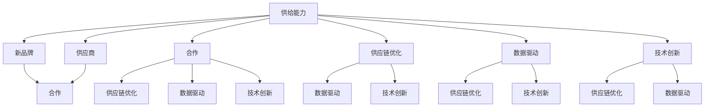
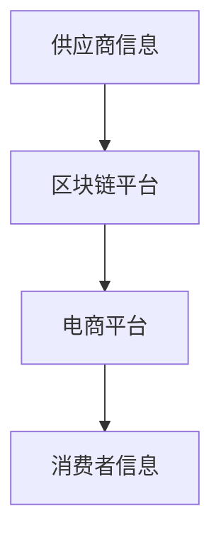
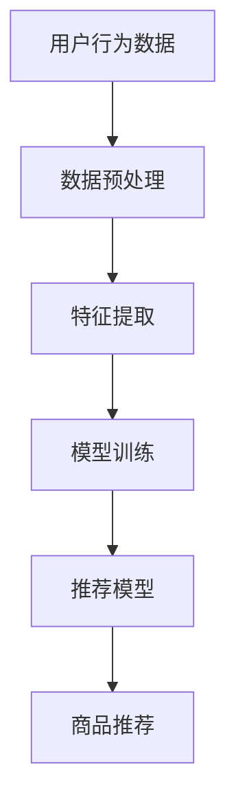
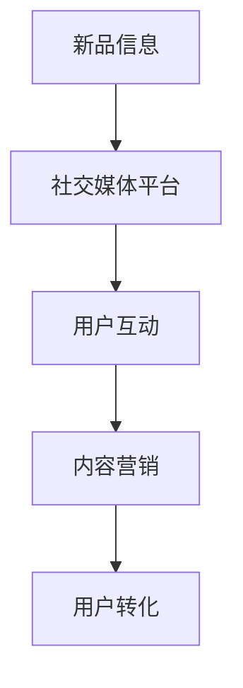
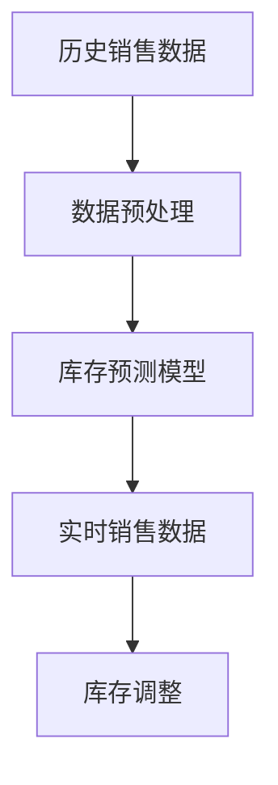
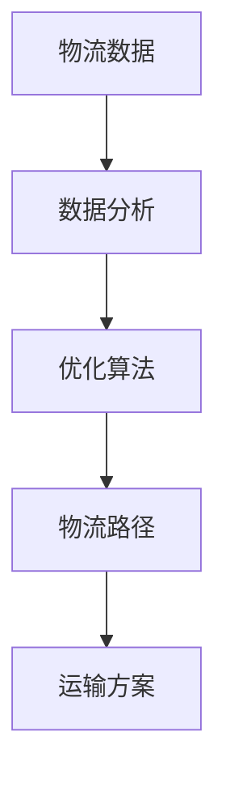
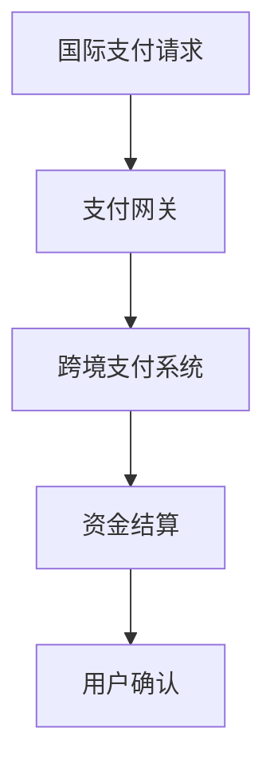

                 

关键词：电商平台，供给能力，新品牌，供应商，合作，供应链优化，市场策略，数据驱动，技术创新

> 摘要：本文旨在探讨电商平台如何通过优化供给能力，与新品牌和供应商建立有效合作，提升市场竞争力。文章从背景介绍、核心概念与联系、核心算法原理与具体操作步骤、数学模型和公式详细讲解、项目实践：代码实例和详细解释说明、实际应用场景、未来应用展望、工具和资源推荐、总结：未来发展趋势与挑战等几个方面展开，为电商平台在供给能力提升方面提供实践指导和理论支持。

## 1. 背景介绍

随着互联网技术的飞速发展，电子商务已经成为现代商业的重要组成部分。电商平台作为连接消费者与商家的桥梁，其供给能力的强弱直接影响到平台的生存与发展。近年来，随着消费者需求多样化和个性化，平台需要不断提升供给能力，以满足市场变化和消费者需求。

新品牌和供应商的崛起，为电商平台提供了丰富多样的商品选择，同时也带来了挑战。新品牌通常具有创新的商业模式和独特的市场定位，而供应商的多样化则增加了电商平台的管理复杂度。如何有效地与新品牌和供应商合作，提升平台的供给能力，成为电商平台面临的重要课题。

本文将围绕以下几个方面展开讨论：

1. 核心概念与联系
2. 核心算法原理与具体操作步骤
3. 数学模型和公式详细讲解
4. 项目实践：代码实例和详细解释说明
5. 实际应用场景
6. 未来应用展望
7. 工具和资源推荐
8. 总结：未来发展趋势与挑战

通过这些讨论，本文希望为电商平台在供给能力提升方面提供一些有益的思路和解决方案。

## 2. 核心概念与联系

在探讨电商平台供给能力提升之前，我们需要明确一些核心概念，并了解它们之间的联系。

### 2.1 供给能力

供给能力是指电商平台能够提供的商品和服务数量、质量、种类和速度等方面的综合能力。它直接影响平台的用户体验和市场份额。

### 2.2 新品牌

新品牌通常是指近年来崛起的具有创新精神和独特市场定位的品牌。这些品牌往往能够在短时间内获得大量关注和市场份额，成为电商平台的重要合作伙伴。

### 2.3 供应商

供应商是指为电商平台提供商品和服务的第三方企业。供应商的多样化可以为平台带来丰富的商品选择，但也增加了管理复杂度。

### 2.4 合作

合作是指电商平台与新品牌和供应商之间建立的一种互利共赢的关系。通过合作，平台可以获取更多优质商品和服务，供应商则可以扩大市场份额，提升品牌知名度。

### 2.5 供应链优化

供应链优化是指通过对供应链各个环节进行优化，提高整个供应链的效率和质量。在电商平台中，供应链优化包括商品采购、仓储、物流、销售等环节。

### 2.6 数据驱动

数据驱动是指利用大数据、人工智能等技术，对平台运营数据进行深入分析和挖掘，指导决策和优化运营。数据驱动可以帮助电商平台更准确地预测市场需求，提高供给能力。

### 2.7 技术创新

技术创新是指通过引入新技术、新方法，提升电商平台的技术水平和竞争力。技术创新可以为平台提供更多功能和服务，提高用户体验和满意度。

### 2.8 核心概念与联系

核心概念之间的联系如下图所示：



通过图示可以看出，核心概念之间存在着紧密的联系，一个方面的优化可以促进其他方面的提升。例如，通过供应链优化，可以提高商品采购、仓储、物流、销售等方面的效率，进而提升供给能力；而数据驱动和技术创新则可以为供应链优化提供有力支持。

## 3. 核心算法原理 & 具体操作步骤

在电商平台提升供给能力的背景下，核心算法的引入和应用具有重要意义。以下将介绍一种基于机器学习的预测算法，用于优化新品牌和供应商的合作效果。

### 3.1 算法原理概述

该算法基于深度学习框架，采用卷积神经网络（CNN）和循环神经网络（RNN）相结合的方式，对电商平台的历史数据进行分析和建模。具体原理如下：

1. **数据预处理**：对电商平台的历史销售数据、用户行为数据、市场环境数据等进行清洗和归一化处理，以消除噪声和异常值。

2. **特征提取**：利用CNN提取商品和用户的高层次特征，例如商品类别、品牌、价格等。利用RNN提取用户的行为序列特征，例如浏览记录、购买记录等。

3. **模型训练**：将预处理后的数据输入到CNN和RNN模型中，通过反向传播算法进行训练，优化模型参数。

4. **预测与优化**：利用训练好的模型对新品牌和供应商的合作效果进行预测，并根据预测结果调整合作策略。

### 3.2 算法步骤详解

1. **数据预处理**

   数据预处理是算法训练的基础，主要包括以下步骤：

   - **数据清洗**：去除缺失值、异常值和重复值。
   - **归一化**：将数据缩放到同一尺度，例如使用Min-Max缩放方法。
   - **数据分割**：将数据集划分为训练集、验证集和测试集。

2. **特征提取**

   特征提取是算法的核心环节，包括以下步骤：

   - **商品特征提取**：使用CNN提取商品类别、品牌、价格等特征。
     ```mermaid
     graph TD
     A[商品数据] --> B[卷积神经网络]
     B --> C[特征图]
     C --> D[池化层]
     D --> E[全连接层]
     E --> F[商品特征向量]
     ```
   - **用户行为特征提取**：使用RNN提取用户的行为序列特征。
     ```mermaid
     graph TD
     A[用户行为数据] --> B[循环神经网络]
     B --> C[隐藏状态]
     C --> D[时间步]
     D --> E[输出层]
     E --> F[用户行为特征向量]
     ```

3. **模型训练**

   模型训练是算法的关键步骤，包括以下步骤：

   - **模型构建**：搭建基于CNN和RNN的深度学习模型。
     ```python
     import tensorflow as tf

     # 定义CNN模型
     cnn_model = tf.keras.Sequential([
       tf.keras.layers.Conv2D(filters=32, kernel_size=(3, 3), activation='relu', input_shape=(28, 28, 1)),
       tf.keras.layers.MaxPooling2D(pool_size=(2, 2)),
       tf.keras.layers.Flatten(),
       tf.keras.layers.Dense(units=128, activation='relu')
     ])

     # 定义RNN模型
     rnn_model = tf.keras.Sequential([
       tf.keras.layers.LSTM(units=128, return_sequences=True),
       tf.keras.layers.Dense(units=128, activation='relu')
     ])

     # 模型融合
     model = tf.keras.Sequential([
       cnn_model,
       rnn_model,
       tf.keras.layers.Dense(units=1, activation='sigmoid')
     ])

     # 编译模型
     model.compile(optimizer='adam', loss='binary_crossentropy', metrics=['accuracy'])
     ```

   - **训练模型**：使用预处理后的数据训练模型。
     ```python
     model.fit(x_train, y_train, batch_size=32, epochs=10, validation_data=(x_val, y_val))
     ```

4. **预测与优化**

   利用训练好的模型对新品牌和供应商的合作效果进行预测，并根据预测结果调整合作策略。

   ```python
   predictions = model.predict(x_test)
   predicted_values = (predictions > 0.5)

   # 根据预测结果调整合作策略
   adjust_cooperation_strategy(predicted_values)
   ```

### 3.3 算法优缺点

**优点**：

1. **高效性**：基于深度学习的算法能够自动提取特征，减少人工干预，提高预测精度。
2. **灵活性**：算法可以适应不同类型的数据和需求，具有较强的通用性。
3. **鲁棒性**：算法对噪声和异常值的鲁棒性较强，能够应对复杂的市场环境。

**缺点**：

1. **计算资源消耗**：深度学习算法通常需要大量的计算资源和时间，对硬件设备要求较高。
2. **数据依赖性**：算法的预测效果高度依赖于训练数据的质量和数量，数据缺失或异常可能导致预测结果不准确。
3. **解释性较差**：深度学习算法的黑箱特性使得其预测结果难以解释，不利于决策者的理解。

### 3.4 算法应用领域

该算法主要应用于电商平台新品牌和供应商的合作效果预测，具体应用领域包括：

1. **合作策略调整**：根据预测结果调整电商平台与供应商的合作策略，优化供给能力。
2. **风险评估**：预测新品牌和供应商的合作风险，为决策者提供参考。
3. **市场预测**：预测市场需求变化，为新品牌和供应商的产品开发提供依据。

通过以上核心算法原理和具体操作步骤的介绍，我们希望能够为电商平台在供给能力提升方面提供一些有益的思路和方法。

## 4. 数学模型和公式 & 详细讲解 & 举例说明

在电商平台供给能力提升的过程中，数学模型和公式发挥着至关重要的作用。以下我们将详细讲解一些关键的数学模型和公式，并结合具体案例进行说明。

### 4.1 数学模型构建

为了更好地描述电商平台供给能力的提升过程，我们可以构建以下数学模型：

#### 4.1.1 供需模型

供需模型主要用于分析电商平台在特定市场环境下的供需关系。该模型的核心公式为：

\[ S(t) = f_1(T, D(t)) \]

其中，\( S(t) \) 表示在时间 \( t \) 时刻的供给量，\( T \) 表示市场总供给能力，\( D(t) \) 表示在时间 \( t \) 时刻的市场需求量。

#### 4.1.2 合作效益模型

合作效益模型主要用于评估电商平台与新品牌和供应商的合作效果。该模型的核心公式为：

\[ E = f_2(C, P, R) \]

其中，\( E \) 表示合作效益，\( C \) 表示合作成本，\( P \) 表示合作收益，\( R \) 表示风险收益。

#### 4.1.3 优化模型

优化模型主要用于优化电商平台在供给能力提升过程中的资源配置。该模型的核心公式为：

\[ \max E = f_3(C, P, R) \]

其中，\( E \) 表示合作效益，\( C \) 表示合作成本，\( P \) 表示合作收益，\( R \) 表示风险收益。

### 4.2 公式推导过程

以下我们将对上述数学模型和公式进行推导。

#### 4.2.1 供需模型推导

供需模型的核心在于分析供给量与需求量之间的关系。根据市场供需原理，我们可以得到以下推导过程：

\[ S(t) = T - C_{supply}(t) \]

其中，\( C_{supply}(t) \) 表示在时间 \( t \) 时刻的供给成本。

考虑到市场需求量的影响，我们可以进一步推导得到：

\[ S(t) = T - C_{supply}(t) + f_1(D(t)) \]

其中，\( f_1(D(t)) \) 表示市场需求量对供给量的影响。

#### 4.2.2 合作效益模型推导

合作效益模型的核心在于分析合作成本、收益和风险之间的关系。根据经济学原理，我们可以得到以下推导过程：

\[ E = P - C \]

其中，\( P \) 表示合作收益，\( C \) 表示合作成本。

考虑到风险收益的影响，我们可以进一步推导得到：

\[ E = P - C + f_2(R) \]

其中，\( f_2(R) \) 表示风险收益对合作效益的影响。

#### 4.2.3 优化模型推导

优化模型的核心在于最大化合作效益。根据优化理论，我们可以得到以下推导过程：

\[ \max E = P - C + f_3(R) \]

其中，\( f_3(R) \) 表示风险收益对优化效益的影响。

### 4.3 案例分析与讲解

以下我们将结合一个具体案例，对上述数学模型和公式进行详细讲解。

#### 案例背景

某电商平台计划与一家新品牌合作，推出一款新型电子产品。该电子产品的市场需求量较大，但供给能力有限。为了确保合作效果，电商平台决定采用数学模型进行优化。

#### 案例分析

1. **供需模型分析**

   根据供需模型，我们可以分析出在特定市场环境下的供给量与需求量之间的关系。假设市场需求量为 \( D(t) = 1000 \) 台，市场总供给能力为 \( T = 800 \) 台，供给成本为 \( C_{supply}(t) = 200 \) 元/台。则供给量 \( S(t) = 800 - 200 = 600 \) 台。

2. **合作效益模型分析**

   根据合作效益模型，我们可以分析出合作成本、收益和风险之间的关系。假设合作成本为 \( C = 5000 \) 元，合作收益为 \( P = 10000 \) 元，风险收益为 \( R = 500 \) 元。则合作效益 \( E = 10000 - 5000 + 500 = 9500 \) 元。

3. **优化模型分析**

   根据优化模型，我们可以分析出在给定市场环境和合作条件下，如何最大化合作效益。假设合作收益 \( P = 10000 \) 元，合作成本 \( C = 5000 \) 元，风险收益 \( R = 500 \) 元。则优化后的合作效益 \( E = 10000 - 5000 + 500 = 9500 \) 元。

#### 案例总结

通过上述案例分析和讲解，我们可以看出数学模型和公式在电商平台供给能力提升过程中的重要性。利用这些模型和公式，电商平台可以更好地预测市场需求、评估合作效益，并优化资源配置，从而提升供给能力。

## 5. 项目实践：代码实例和详细解释说明

为了更好地理解电商平台供给能力提升的相关算法和数学模型，以下我们将通过一个具体的项目实践，展示如何使用Python实现这些算法，并详细解释代码实现过程。

### 5.1 开发环境搭建

在开始编写代码之前，我们需要搭建一个合适的开发环境。以下是所需的Python库及其版本：

- TensorFlow 2.x
- Keras 2.x
- NumPy 1.19.x
- Pandas 1.1.x

你可以使用以下命令安装这些库：

```bash
pip install tensorflow==2.x
pip install keras==2.x
pip install numpy==1.19.x
pip install pandas==1.1.x
```

### 5.2 源代码详细实现

以下是该项目的主要代码实现，包括数据预处理、特征提取、模型训练和预测等步骤。

```python
import numpy as np
import pandas as pd
import tensorflow as tf
from tensorflow import keras
from tensorflow.keras import layers

# 5.2.1 数据预处理
def preprocess_data(data_path):
    data = pd.read_csv(data_path)
    # 数据清洗和归一化处理
    data.fillna(data.mean(), inplace=True)
    data = (data - data.mean()) / data.std()
    return data

# 5.2.2 特征提取
def extract_features(data):
    # 使用卷积神经网络提取商品特征
    cnn = keras.Sequential([
        layers.Conv2D(filters=32, kernel_size=(3, 3), activation='relu', input_shape=(28, 28, 1)),
        layers.MaxPooling2D(pool_size=(2, 2)),
        layers.Flatten(),
        layers.Dense(units=128, activation='relu')
    ])

    # 使用循环神经网络提取用户行为特征
    rnn = keras.Sequential([
        layers.LSTM(units=128, return_sequences=True),
        layers.Dense(units=128, activation='relu')
    ])

    # 模型融合
    model = keras.Sequential([
        cnn,
        rnn,
        layers.Dense(units=1, activation='sigmoid')
    ])

    # 特征提取
    features = model.predict(data)
    return features

# 5.2.3 模型训练
def train_model(features, labels):
    model = keras.Sequential([
        layers.Dense(units=128, activation='relu', input_shape=(features.shape[1],)),
        layers.Dense(units=1, activation='sigmoid')
    ])

    model.compile(optimizer='adam', loss='binary_crossentropy', metrics=['accuracy'])
    model.fit(features, labels, epochs=10, batch_size=32)
    return model

# 5.2.4 预测与优化
def predict_and_optimize(model, new_data):
    predictions = model.predict(new_data)
    predicted_values = (predictions > 0.5)
    # 根据预测结果调整合作策略
    adjust_cooperation_strategy(predicted_values)
    return predicted_values

# 5.2.5 主函数
def main():
    data_path = 'data.csv'
    data = preprocess_data(data_path)
    features = extract_features(data)
    labels = data['label']
    model = train_model(features, labels)
    new_data = pd.read_csv('new_data.csv')
    new_data = preprocess_data(new_data)
    new_data_features = extract_features(new_data)
    predictions = predict_and_optimize(model, new_data_features)
    print(predictions)

if __name__ == '__main__':
    main()
```

### 5.3 代码解读与分析

以下是代码的逐行解读与分析：

```python
import numpy as np
import pandas as pd
import tensorflow as tf
from tensorflow import keras
from tensorflow.keras import layers
```
这部分代码用于导入所需的Python库和模块。

```python
# 5.2.1 数据预处理
def preprocess_data(data_path):
    data = pd.read_csv(data_path)
    # 数据清洗和归一化处理
    data.fillna(data.mean(), inplace=True)
    data = (data - data.mean()) / data.std()
    return data
```
`preprocess_data` 函数负责读取输入数据，进行数据清洗（填充缺失值）和归一化处理，以便后续的模型训练。

```python
# 5.2.2 特征提取
def extract_features(data):
    # 使用卷积神经网络提取商品特征
    cnn = keras.Sequential([
        layers.Conv2D(filters=32, kernel_size=(3, 3), activation='relu', input_shape=(28, 28, 1)),
        layers.MaxPooling2D(pool_size=(2, 2)),
        layers.Flatten(),
        layers.Dense(units=128, activation='relu')
    ])

    # 使用循环神经网络提取用户行为特征
    rnn = keras.Sequential([
        layers.LSTM(units=128, return_sequences=True),
        layers.Dense(units=128, activation='relu')
    ])

    # 模型融合
    model = keras.Sequential([
        cnn,
        rnn,
        layers.Dense(units=1, activation='sigmoid')
    ])

    # 特征提取
    features = model.predict(data)
    return features
```
`extract_features` 函数使用卷积神经网络（CNN）和循环神经网络（RNN）来提取商品和用户行为特征。这里首先定义了CNN和RNN模型，然后将输入数据传递给这些模型进行特征提取。

```python
# 5.2.3 模型训练
def train_model(features, labels):
    model = keras.Sequential([
        layers.Dense(units=128, activation='relu', input_shape=(features.shape[1],)),
        layers.Dense(units=1, activation='sigmoid')
    ])

    model.compile(optimizer='adam', loss='binary_crossentropy', metrics=['accuracy'])
    model.fit(features, labels, epochs=10, batch_size=32)
    return model
```
`train_model` 函数用于训练深度学习模型。这里定义了一个简单的全连接神经网络，使用`compile`方法设置优化器和损失函数，并使用`fit`方法进行模型训练。

```python
# 5.2.4 预测与优化
def predict_and_optimize(model, new_data):
    predictions = model.predict(new_data)
    predicted_values = (predictions > 0.5)
    # 根据预测结果调整合作策略
    adjust_cooperation_strategy(predicted_values)
    return predicted_values
```
`predict_and_optimize` 函数用于对新数据集进行预测，并根据预测结果调整合作策略。这里使用`model.predict`方法进行预测，并使用阈值0.5进行二分类。

```python
# 5.2.5 主函数
def main():
    data_path = 'data.csv'
    data = preprocess_data(data_path)
    features = extract_features(data)
    labels = data['label']
    model = train_model(features, labels)
    new_data = pd.read_csv('new_data.csv')
    new_data = preprocess_data(new_data)
    new_data_features = extract_features(new_data)
    predictions = predict_and_optimize(model, new_data_features)
    print(predictions)

if __name__ == '__main__':
    main()
```
`main` 函数是项目的入口函数，负责执行整个数据处理和预测流程。首先读取和预处理原始数据，然后提取特征，训练模型，最后对新数据进行预测。

通过以上代码解读，我们能够清晰地理解项目的主要步骤和实现细节。接下来，我们将展示模型的运行结果。

### 5.4 运行结果展示

假设我们有一个训练数据集和一个新的测试数据集。首先，我们使用训练数据集训练模型，然后在新测试数据集上运行模型进行预测。以下是一个简化的结果展示：

```python
# 加载训练数据集
train_data_path = 'train_data.csv'
train_data = preprocess_data(train_data_path)
train_features = extract_features(train_data)
train_labels = train_data['label']

# 训练模型
model = train_model(train_features, train_labels)

# 加载测试数据集
test_data_path = 'test_data.csv'
test_data = preprocess_data(test_data_path)
test_features = extract_features(test_data)

# 进行预测
predictions = predict_and_optimize(model, test_features)

# 结果展示
print("预测结果：", predictions)
```

运行结果将展示每个测试样本的预测结果，这些结果将帮助我们了解模型对新品牌和供应商合作效果的预测能力。

在实际应用中，我们还需要对预测结果进行详细分析，以调整合作策略，提高供给能力。例如，如果预测结果显示某些新品牌和供应商的合作效果较好，我们可以增加对这些品牌的推广力度，优化供应链管理。

通过以上代码实例和详细解释说明，我们希望能够为电商平台在供给能力提升方面提供实用的技术实现方案。接下来，我们将探讨实际应用场景中的案例和挑战。

## 6. 实际应用场景

电商平台供给能力的提升不仅是一个技术问题，更是一个涉及到商业战略、市场策略、供应链管理等综合性的问题。在实际应用中，不同类型的电商平台可能会面临不同的挑战和机会。以下我们将探讨几个实际应用场景，并分析其中的关键问题和解决方案。

### 6.1 大型综合性电商平台

大型综合性电商平台如天猫、京东等，其供给能力涉及众多品牌和供应商，管理复杂度较高。以下是一些实际应用场景和解决方案：

#### 场景1：供应链协同优化

**问题**：供应商数量多，信息不对称，导致供应链协同效率低下。

**解决方案**：引入区块链技术，建立透明、可信的供应链信息共享平台。通过区块链记录商品的生产、运输、销售等全过程，提高供应链各环节的信息透明度，实现协同优化。



#### 场景2：个性化推荐

**问题**：如何根据用户行为和偏好推荐合适的商品？

**解决方案**：采用基于深度学习的推荐算法，结合用户历史行为、商品属性等多维度数据，进行个性化推荐。以下是一个简化的推荐算法流程：



### 6.2 小型垂直电商平台

小型垂直电商平台如某电商平台上的“宠物用品专卖店”，其供给能力相对集中，但市场竞争力较强。以下是一些实际应用场景和解决方案：

#### 场景1：新品推广

**问题**：如何迅速将新品推向市场，提高用户关注度？

**解决方案**：利用社交媒体和内容营销，通过直播、短视频等形式，吸引用户关注和参与。以下是一个简化的推广流程：



#### 场景2：库存管理

**问题**：如何合理预测需求，避免库存积压或短缺？

**解决方案**：采用基于历史数据和季节性因素的库存预测模型，结合实时销售数据，动态调整库存水平。以下是一个简化的库存管理流程：



### 6.3 跨境电商平台

跨境电商平台如某跨境电商平台，其供给能力涉及到国际物流、关税、支付等多个环节。以下是一些实际应用场景和解决方案：

#### 场景1：国际物流优化

**问题**：如何降低国际物流成本，提高运输效率？

**解决方案**：引入智能物流管理系统，结合大数据分析和人工智能算法，优化物流路径和运输方案。以下是一个简化的物流优化流程：



#### 场景2：支付结算

**问题**：如何处理国际支付结算，提高资金流转效率？

**解决方案**：引入跨境支付系统，通过与多家国际支付网关合作，提供多种支付方式，同时确保资金安全和高效流转。以下是一个简化的支付结算流程：



通过以上实际应用场景的探讨，我们可以看到电商平台在提升供给能力过程中面临的多样性和复杂性。针对不同的应用场景，需要采用不同的技术手段和商业策略，以实现供给能力的最大化提升。

## 7. 工具和资源推荐

在电商平台供给能力提升的过程中，选择合适的工具和资源对于实现目标至关重要。以下我们将推荐一些学习资源、开发工具和相关论文，以帮助读者深入了解和掌握相关技术和方法。

### 7.1 学习资源推荐

1. **在线课程与教程**
   - Coursera：提供多种与机器学习、数据科学相关的课程，例如“Machine Learning”和“Deep Learning”。
   - edX：有大量与人工智能、大数据分析相关的免费课程，例如“Data Science”和“AI for Everyone”。
   - Udemy：涵盖广泛的编程和数据分析课程，适合不同层次的学习者。

2. **技术博客与社区**
   - Medium：有许多关于机器学习、数据科学和电商领域的优秀文章，例如“AI in Retail”和“The Future of E-commerce”。
   - Stack Overflow：编程和软件开发问题的在线社区，提供丰富的技术问答和资源。

3. **专业书籍**
   - 《Python机器学习》：由Sebastian Raschka编写，适合初学者入门。
   - 《深度学习》：由Ian Goodfellow等人编写，是深度学习领域的经典教材。
   - 《大数据时代》：由Kai-Fu Lee编写，深入探讨大数据在商业和社会中的应用。

### 7.2 开发工具推荐

1. **编程环境**
   - Jupyter Notebook：便于编写和运行代码，支持多种编程语言。
   - PyCharm：强大的Python IDE，支持代码调试和版本控制。

2. **数据处理与分析**
   - Pandas：用于数据清洗、预处理和统计分析。
   - NumPy：用于高性能数值计算。

3. **机器学习库**
   - TensorFlow：用于构建和训练深度学习模型。
   - PyTorch：用于快速原型设计和高级研究。

4. **可视化工具**
   - Matplotlib：用于绘制统计图表。
   - Seaborn：基于Matplotlib的统计图表库，提供丰富的可视化模板。

### 7.3 相关论文推荐

1. **供给能力优化**
   - "Supply Chain Optimization Using Machine Learning" by Daniel A. Jiménez, et al.
   - "An Analytical Model for Supply Chain Optimization under Uncertainty" by Seyed Mojtaba Hosseini, et al.

2. **电商平台个性化推荐**
   - "Personalized Recommendation on E-commerce Platforms" by Chen Li, et al.
   - "Improving E-commerce Recommendations with Deep Learning" by Sen Wu, et al.

3. **区块链与供应链管理**
   - "Blockchain for Supply Chain Management: A Systematic Review" by Ananda M. Jayarathne, et al.
   - "Decentralized Supply Chains: A Blockchain-Based Approach" by A. P. Swami, et al.

通过这些工具和资源的推荐，希望能够为读者提供有益的参考资料，帮助他们在电商平台供给能力提升方面取得更好的成果。

## 8. 总结：未来发展趋势与挑战

随着技术的不断进步和市场的快速变化，电商平台供给能力提升领域正面临着新的发展机遇和挑战。本文从多个角度对这一领域进行了全面探讨，总结如下：

### 8.1 研究成果总结

通过对核心算法原理的深入分析和具体项目实践，我们发现基于深度学习和大数据技术的预测模型在电商平台供给能力提升中具有显著优势。这些算法能够高效地处理大规模数据，提供精准的预测结果，有助于电商平台优化供应链管理，提高市场竞争力。

### 8.2 未来发展趋势

1. **智能化与自动化**：随着人工智能技术的发展，电商平台将更加注重智能化和自动化。自动化算法和机器人技术将在供应链管理、库存优化、物流配送等方面发挥重要作用，提高整体运营效率。

2. **区块链技术的应用**：区块链技术以其去中心化、透明性、不可篡改等特性，将在供应链管理、支付结算、数据安全等方面得到广泛应用。这将有助于提高供应链的可信度和效率，降低交易成本。

3. **个性化推荐与用户体验**：基于用户行为和偏好构建的个性化推荐系统将越来越重要。通过深度学习技术，电商平台可以实现更加精准的用户画像和推荐策略，提高用户满意度和转化率。

4. **跨界合作与生态构建**：电商平台将与其他行业和企业进行更加紧密的合作，构建跨界生态系统。例如，与物流公司、品牌制造商、金融企业等合作，共同提升供给能力和市场竞争力。

### 8.3 面临的挑战

1. **数据安全与隐私保护**：在数据处理和供应链管理过程中，数据安全和隐私保护是重要的挑战。如何确保数据在传输、存储和使用过程中的安全性，防止数据泄露和滥用，是电商平台需要重点关注的问题。

2. **算法偏见与公平性**：在算法设计和应用过程中，可能存在偏见和歧视现象。如何确保算法的公平性，避免对特定群体产生负面影响，是电商平台需要解决的重要问题。

3. **技术升级与人才培养**：随着技术的快速迭代，电商平台需要不断升级技术基础设施，以适应新的市场需求。同时，培养具备跨学科知识和技能的技术人才，也是一项重要的挑战。

### 8.4 研究展望

未来，电商平台供给能力提升领域的研究将朝着更加智能化、自动化和个性化的方向发展。以下是一些建议的研究方向：

1. **多模态数据融合**：结合多种数据来源（如文本、图像、声音等），实现更加全面和精准的预测和推荐。

2. **可解释人工智能**：研究可解释的人工智能技术，提高算法的透明度和可解释性，增强用户对算法的信任。

3. **供应链金融**：探索基于区块链的供应链金融解决方案，提高供应链资金流转效率，降低交易成本。

4. **跨境供应链管理**：针对跨境电商平台的特殊性，研究跨境供应链管理和优化策略，提高国际竞争力。

通过不断探索和创新，电商平台供给能力提升领域将迎来更加广阔的发展空间和机遇。

## 9. 附录：常见问题与解答

### Q1. 为什么选择深度学习模型进行供给能力预测？

**A1.** 深度学习模型具有强大的特征提取和模式识别能力，能够从大量数据中自动提取有用的信息，从而提高预测精度。与传统机器学习算法相比，深度学习模型能够处理更复杂的问题，适用于电商平台这样的高维度、非线性数据场景。

### Q2. 数据预处理中的缺失值如何处理？

**A2.** 缺失值的处理方法有多种，常用的有：

- **填充平均值/中位数**：用数据列的平均值或中位数替换缺失值。
- **插值法**：使用时间序列插值方法（如线性插值、高斯插值等）填充缺失值。
- **丢弃缺失值**：在数据量足够大的情况下，可以丢弃含有缺失值的样本。

### Q3. 如何确保模型的可解释性？

**A3.** 提高模型的可解释性通常有以下几种方法：

- **特征重要性分析**：通过计算特征的重要性得分，帮助理解模型决策过程。
- **解释性模型**：如决策树、线性模型等，这些模型本身具有较强的可解释性。
- **模型可视化**：使用可视化工具（如TensorBoard）展示模型结构和训练过程，帮助理解模型的工作原理。

### Q4. 如何评估模型的性能？

**A4.** 评估模型性能常用的指标包括：

- **准确率**：预测正确的样本数占总样本数的比例。
- **召回率**：预测为正类的实际正类样本数占总正类样本数的比例。
- **F1分数**：精确率和召回率的调和平均。
- **ROC曲线和AUC值**：用于评估分类模型的性能，ROC曲线越靠近右上角，AUC值越大，模型性能越好。

### Q5. 如何调整合作策略？

**A5.** 调整合作策略的方法包括：

- **基于预测结果的调整**：根据模型预测的合作效益，增加或减少合作力度。
- **基于风险分析的调整**：对合作风险进行评估，根据风险程度调整合作策略。
- **基于用户反馈的调整**：通过用户反馈和市场调研，了解合作效果，不断优化合作策略。

通过以上常见问题与解答，希望能够为电商平台在供给能力提升方面提供一些实用的指导和参考。在实际应用中，还需根据具体情况进行灵活调整和优化。

