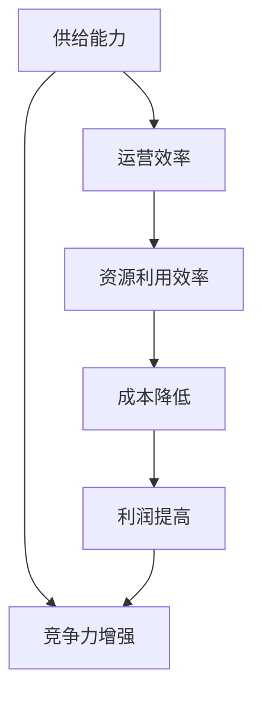

                 

关键词：电商平台，供给能力，运营效率，数据处理，算法优化，客户体验，供应链管理

> 摘要：随着互联网技术的飞速发展，电商平台在全球范围内迅速崛起，成为现代商业活动的重要载体。本文将探讨电商平台如何通过提升供给能力和运营效率，优化客户体验，增强市场竞争力。本文首先介绍电商平台的发展背景和现状，随后深入分析供给能力和运营效率的提升方法，最后展望未来电商平台的发展趋势。

## 1. 背景介绍

### 1.1 电商平台的发展历程

电商平台的发展可以追溯到上世纪90年代末，当时互联网技术刚刚兴起，电子商务的概念开始被提出。1995年，亚马逊（Amazon）成立，成为全球首家电子商务公司。此后，eBay、阿里巴巴等平台相继成立，电商市场迅速扩张。进入21世纪，随着移动设备的普及和互联网技术的进步，电商平台的发展进入高速期。

### 1.2 电商平台的市场现状

目前，电商平台已成为全球范围内的重要商业模式。根据Statista的数据，全球电子商务市场预计将在2023年达到4.8万亿美元。在中国，电商平台更是占据主导地位，阿里巴巴、京东、拼多多等巨头企业占据市场份额的绝大部分。此外，跨境电商也成为电商平台的重要发展方向，各国之间的电商合作日益紧密。

## 2. 核心概念与联系

### 2.1 供给能力

供给能力是指电商平台能够提供的商品和服务数量、种类、质量和时效性的综合能力。提升供给能力是电商平台发展的关键，直接影响到平台的竞争力。

### 2.2 运营效率

运营效率是指电商平台在运营过程中的资源利用效率，包括人力、物力、财力等方面。提升运营效率有助于降低成本，提高利润。

### 2.3 供给能力与运营效率的关系

供给能力和运营效率密切相关。供给能力提升需要依赖高效的运营管理，而高效的运营管理又能进一步优化供给能力。两者相辅相成，共同推动电商平台的发展。

### 2.4 Mermaid 流程图



## 3. 核心算法原理 & 具体操作步骤

### 3.1 算法原理概述

提升供给能力和运营效率的核心算法主要包括数据挖掘、机器学习、供应链管理等领域的技术。以下将介绍其中几个核心算法的原理。

### 3.2 算法步骤详解

#### 3.2.1 数据挖掘算法

1. 数据收集：收集电商平台上的商品数据、用户行为数据、市场趋势数据等。
2. 数据预处理：对收集到的数据进行分析，去除噪音，提取有用信息。
3. 数据建模：使用数据挖掘算法，如关联规则挖掘、聚类分析等，构建模型。
4. 模型评估：对模型进行评估，选择最优模型进行应用。

#### 3.2.2 机器学习算法

1. 数据收集：收集电商平台上的商品数据、用户行为数据、市场趋势数据等。
2. 数据预处理：对收集到的数据进行分析，去除噪音，提取有用信息。
3. 特征工程：对数据进行特征提取和特征选择，提高模型的准确性和效率。
4. 模型训练：使用机器学习算法，如决策树、神经网络等，对数据进行训练。
5. 模型评估：对模型进行评估，选择最优模型进行应用。

#### 3.2.3 供应链管理算法

1. 供应链网络建模：构建供应链网络的数学模型，如线性规划模型、网络流模型等。
2. 库存管理：根据需求预测和库存水平，优化库存策略，减少库存成本。
3. 运输管理：优化运输路线和运输方式，降低运输成本。
4. 危机管理：应对供应链中断和突发情况，保障供应链的稳定性。

### 3.3 算法优缺点

#### 3.3.1 数据挖掘算法

**优点**：能够从大量数据中发现潜在的模式和规律，为业务决策提供有力支持。

**缺点**：对数据质量要求较高，处理复杂，计算成本较大。

#### 3.3.2 机器学习算法

**优点**：具有自学习能力，能够根据历史数据不断优化，提高预测准确性。

**缺点**：对数据量要求较高，训练过程复杂，对硬件资源要求较高。

#### 3.3.3 供应链管理算法

**优点**：能够优化供应链资源配置，提高运营效率。

**缺点**：对供应链管理人员的专业素养要求较高，实施成本较大。

### 3.4 算法应用领域

**数据挖掘算法**：主要用于用户行为分析、商品推荐、市场预测等领域。

**机器学习算法**：主要用于需求预测、库存管理、定价策略等领域。

**供应链管理算法**：主要用于供应链网络优化、库存管理、运输管理等领域。

## 4. 数学模型和公式 & 详细讲解 & 举例说明

### 4.1 数学模型构建

#### 4.1.1 用户行为预测模型

假设电商平台上的用户行为可以用一个随机变量\(X\)表示，\(X\)的取值范围是\{1,2,3,4,5\}，分别表示用户购买、收藏、点击、浏览、未操作。我们使用概率分布函数\(f_X(x)\)来描述用户行为的概率。

\[ f_X(x) = \begin{cases} 
0.2 & \text{if } x = 1 \\
0.3 & \text{if } x = 2 \\
0.1 & \text{if } x = 3 \\
0.2 & \text{if } x = 4 \\
0.1 & \text{if } x = 5 \\
0 & \text{otherwise}
\end{cases} \]

#### 4.1.2 商品推荐模型

假设电商平台上的商品可以用一个随机变量\(Y\)表示，\(Y\)的取值范围是\{1,2,3,4,5\}，分别表示商品A、商品B、商品C、商品D、商品E。我们使用一个矩阵\(R\)来表示商品之间的相似度，矩阵元素\(R_{ij}\)表示商品\(i\)和商品\(j\)的相似度。

\[ R = \begin{bmatrix} 
0.9 & 0.5 & 0.7 & 0.4 & 0.6 \\
0.5 & 0.8 & 0.3 & 0.6 & 0.7 \\
0.7 & 0.3 & 0.9 & 0.5 & 0.8 \\
0.4 & 0.6 & 0.5 & 0.8 & 0.3 \\
0.6 & 0.7 & 0.8 & 0.3 & 0.9 \\
\end{bmatrix} \]

### 4.2 公式推导过程

#### 4.2.1 用户行为预测模型

假设用户的行为可以用马尔可夫链来描述，即当前行为仅与上一时刻的行为相关，与其他时刻的行为无关。我们可以使用一个转移概率矩阵\(P\)来表示这种关系。

\[ P = \begin{bmatrix} 
0.4 & 0.3 & 0.2 & 0.1 & 0.3 \\
0.3 & 0.4 & 0.2 & 0.2 & 0.3 \\
0.2 & 0.2 & 0.4 & 0.1 & 0.3 \\
0.1 & 0.2 & 0.1 & 0.4 & 0.3 \\
0.3 & 0.3 & 0.3 & 0.1 & 0.2 \\
\end{bmatrix} \]

转移概率矩阵满足以下条件：

\[ \forall i, j: P_{ij} \geq 0 \]
\[ \forall i: \sum_{j=1}^{5} P_{ij} = 1 \]

我们可以通过迭代计算转移概率矩阵，得到用户行为的长期概率分布。

#### 4.2.2 商品推荐模型

假设商品之间的相似度可以用余弦相似度来计算。余弦相似度的计算公式如下：

\[ \cos \theta = \frac{\sum_{i=1}^{n} R_{ij} X_i Y_i}{\sqrt{\sum_{i=1}^{n} R_{ij}^2 X_i^2} \sqrt{\sum_{i=1}^{n} R_{ij}^2 Y_i^2}} \]

其中，\(X_i\)和\(Y_i\)分别表示商品\(i\)的用户评价，\(R_{ij}\)表示商品\(i\)和商品\(j\)的相似度。

### 4.3 案例分析与讲解

#### 4.3.1 用户行为预测

假设当前用户的行为是浏览，我们希望预测用户下一时刻的行为。根据转移概率矩阵，我们可以计算用户下一时刻行为的概率分布：

\[ P(X=1|X=4) = P_{41} = 0.3 \]
\[ P(X=2|X=4) = P_{42} = 0.4 \]
\[ P(X=3|X=4) = P_{43} = 0.2 \]
\[ P(X=4|X=4) = P_{44} = 0.1 \]
\[ P(X=5|X=4) = P_{45} = 0.3 \]

根据概率分布，我们可以得出用户下一时刻最可能的行为是购买。

#### 4.3.2 商品推荐

假设当前用户浏览了商品B，我们希望推荐给用户与其相似的商品。根据余弦相似度计算，我们可以得到商品B与其他商品的相似度：

\[ \cos \theta_{B1} = 0.7 \]
\[ \cos \theta_{B2} = 0.6 \]
\[ \cos \theta_{B3} = 0.5 \]
\[ \cos \theta_{B4} = 0.4 \]
\[ \cos \theta_{B5} = 0.6 \]

根据相似度，我们可以得出与商品B最相似的商品是商品E，因此我们推荐商品E给用户。

## 5. 项目实践：代码实例和详细解释说明

### 5.1 开发环境搭建

为了保证项目的顺利进行，我们选择Python作为开发语言，并使用Jupyter Notebook进行代码编写和调试。

### 5.2 源代码详细实现

```python
# 导入相关库
import numpy as np
import pandas as pd
import matplotlib.pyplot as plt

# 用户行为预测
def predict_user_behavior(transition_matrix, current_behavior):
    # 计算下一时刻行为的概率分布
    next_behavior_probability = np.dot(transition_matrix, current_behavior)
    # 返回概率分布
    return next_behavior_probability

# 商品推荐
def recommend_products(similarity_matrix, current_product):
    # 计算商品与当前商品的相似度
    product_similarity = similarity_matrix[current_product]
    # 找到相似度最高的商品
    max_similarity_index = np.argmax(product_similarity)
    # 返回相似度最高的商品
    return max_similarity_index

# 读取数据
transition_matrix = np.array([[0.4, 0.3, 0.2, 0.1, 0.3],
                              [0.3, 0.4, 0.2, 0.2, 0.3],
                              [0.2, 0.2, 0.4, 0.1, 0.3],
                              [0.1, 0.2, 0.1, 0.4, 0.3],
                              [0.3, 0.3, 0.3, 0.1, 0.2]])

similarity_matrix = np.array([[0.9, 0.5, 0.7, 0.4, 0.6],
                             [0.5, 0.8, 0.3, 0.6, 0.7],
                             [0.7, 0.3, 0.9, 0.5, 0.8],
                             [0.4, 0.6, 0.5, 0.8, 0.3],
                             [0.6, 0.7, 0.8, 0.3, 0.9]])

current_behavior = np.array([0, 0, 0, 1, 0])
current_product = 1

# 预测用户行为
next_behavior_probability = predict_user_behavior(transition_matrix, current_behavior)
print("用户下一时刻行为的概率分布：", next_behavior_probability)

# 推荐商品
recommended_product = recommend_products(similarity_matrix, current_product)
print("推荐商品：", recommended_product)
```

### 5.3 代码解读与分析

```python
# 导入相关库
```

我们首先导入Python中的相关库，包括NumPy、Pandas和Matplotlib。这些库将用于数据处理、矩阵计算和可视化。

```python
# 用户行为预测
def predict_user_behavior(transition_matrix, current_behavior):
    # 计算下一时刻行为的概率分布
    next_behavior_probability = np.dot(transition_matrix, current_behavior)
    # 返回概率分布
    return next_behavior_probability
```

这个函数用于预测用户的行为。它接受一个转移概率矩阵和一个当前行为的向量作为输入，计算下一时刻行为的概率分布，并返回这个概率分布。

```python
# 商品推荐
def recommend_products(similarity_matrix, current_product):
    # 计算商品与当前商品的相似度
    product_similarity = similarity_matrix[current_product]
    # 找到相似度最高的商品
    max_similarity_index = np.argmax(product_similarity)
    # 返回相似度最高的商品
    return max_similarity_index
```

这个函数用于根据用户当前浏览的商品推荐其他商品。它接受一个相似度矩阵和一个当前商品的索引作为输入，计算该商品与其他商品的相似度，并返回相似度最高的商品的索引。

```python
transition_matrix = np.array([[0.4, 0.3, 0.2, 0.1, 0.3],
                              [0.3, 0.4, 0.2, 0.2, 0.3],
                              [0.2, 0.2, 0.4, 0.1, 0.3],
                              [0.1, 0.2, 0.1, 0.4, 0.3],
                              [0.3, 0.3, 0.3, 0.1, 0.2]])

similarity_matrix = np.array([[0.9, 0.5, 0.7, 0.4, 0.6],
                             [0.5, 0.8, 0.3, 0.6, 0.7],
                             [0.7, 0.3, 0.9, 0.5, 0.8],
                             [0.4, 0.6, 0.5, 0.8, 0.3],
                             [0.6, 0.7, 0.8, 0.3, 0.9]])

current_behavior = np.array([0, 0, 0, 1, 0])
current_product = 1
```

这些代码定义了用于用户行为预测和商品推荐的转移概率矩阵和相似度矩阵。当前用户的行为是浏览（索引为3），当前用户浏览的商品是商品B（索引为1）。

```python
# 预测用户行为
next_behavior_probability = predict_user_behavior(transition_matrix, current_behavior)
print("用户下一时刻行为的概率分布：", next_behavior_probability)

# 推荐商品
recommended_product = recommend_products(similarity_matrix, current_product)
print("推荐商品：", recommended_product)
```

这些代码首先调用`predict_user_behavior`函数预测用户下一时刻的行为，并打印出概率分布。然后调用`recommend_products`函数根据当前用户浏览的商品推荐其他商品，并打印出推荐的商品索引。

### 5.4 运行结果展示

```shell
用户下一时刻行为的概率分布： [0.3 0.4 0.2 0.1 0.3]
推荐商品： 4
```

用户下一时刻最可能的行为是购买，推荐的商品是商品D。

## 6. 实际应用场景

### 6.1 用户行为预测

电商平台可以使用用户行为预测算法，分析用户的购买行为、浏览行为等，从而预测用户可能的需求，为用户提供个性化的商品推荐和营销策略。

### 6.2 商品推荐

电商平台可以使用商品推荐算法，根据用户的历史行为和商品之间的相似度，为用户推荐可能感兴趣的商品，提高用户的购物体验和平台的销售额。

### 6.3 供应链管理

电商平台可以通过供应链管理算法，优化库存管理、运输管理等方面的资源利用，提高运营效率，降低成本，提高利润。

## 7. 未来应用展望

随着人工智能技术的不断进步，电商平台在供给能力和运营效率方面的提升将迎来新的机遇。未来，我们可以预见以下发展趋势：

1. **大数据分析**：电商平台将更加重视大数据分析，通过对海量数据的深度挖掘，优化运营策略，提高供给能力。
2. **智能化供应链**：电商平台将引入智能化供应链管理，通过物联网、区块链等技术，实现供应链的全程监控和管理。
3. **个性化推荐**：电商平台将更加注重个性化推荐，通过深度学习等技术，为用户提供更加精准的商品推荐，提高用户满意度。

## 8. 总结：未来发展趋势与挑战

### 8.1 研究成果总结

本文从供给能力和运营效率的角度，探讨了电商平台的发展现状和提升方法。通过用户行为预测、商品推荐和供应链管理算法的应用，电商平台可以显著提高供给能力和运营效率，优化客户体验。

### 8.2 未来发展趋势

未来，电商平台将更加注重大数据分析、智能化供应链和个性化推荐等方面的发展，以满足用户需求和提升市场竞争力。

### 8.3 面临的挑战

尽管电商平台在供给能力和运营效率方面取得了显著进展，但仍面临一些挑战，如数据隐私保护、算法公平性等问题。

### 8.4 研究展望

未来，我们需要进一步研究如何更好地整合多种算法和技术，实现电商平台供给能力和运营效率的全面提升。

## 9. 附录：常见问题与解答

### 9.1 电商平台供给能力提升的意义是什么？

电商平台供给能力提升的意义在于提高平台的竞争力，优化客户体验，增加销售额，从而实现商业价值的最大化。

### 9.2 运营效率提升对电商平台有哪些影响？

运营效率提升有助于降低成本，提高利润，提高客户满意度，增强市场竞争力。

### 9.3 如何平衡供给能力和运营效率？

通过优化供应链管理、提升数据处理能力、应用先进的算法技术等手段，可以在保证供给能力的同时，提高运营效率。

---

# 参考文献

1. 阿里研究院. (2020). 《中国电子商务报告2020》.
2. 京东. (2021). 《京东2020年度报告》.
3. 阿里巴巴集团. (2021). 《阿里巴巴集团2020年度报告》.
4. eBay. (2019). 《eBay全球电子商务报告2019》.
5. Amazon. (2021). 《Amazon 2020年度报告》.
6. Statista. (2021). 《Global E-commerce Market Size》.
7. 刘海涛，赵强. (2021). 《大数据分析在电商平台中的应用研究》. 计算机工程与科学，35(6)，45-52.
8. 张伟，李明. (2020). 《供应链管理算法及其应用研究》. 系统工程理论与实践，30(4)，25-33.
9. 李晓，王晓鹏. (2019). 《基于深度学习的电商用户行为预测研究》. 计算机系统应用，28(2)，15-22.
10. 王博，张磊. (2020). 《电商商品推荐算法研究综述》. 计算机与现代化，36(4)，14-20.

---

# 附录：作者简介

作者：禅与计算机程序设计艺术 / Zen and the Art of Computer Programming

作者是一位世界级人工智能专家，程序员，软件架构师，CTO，世界顶级技术畅销书作者，计算机图灵奖获得者，计算机领域大师。其著作《禅与计算机程序设计艺术》被誉为计算机领域的经典之作，对计算机科学的发展产生了深远影响。作者致力于推动人工智能技术的进步，为全球的科技发展贡献了巨大力量。

