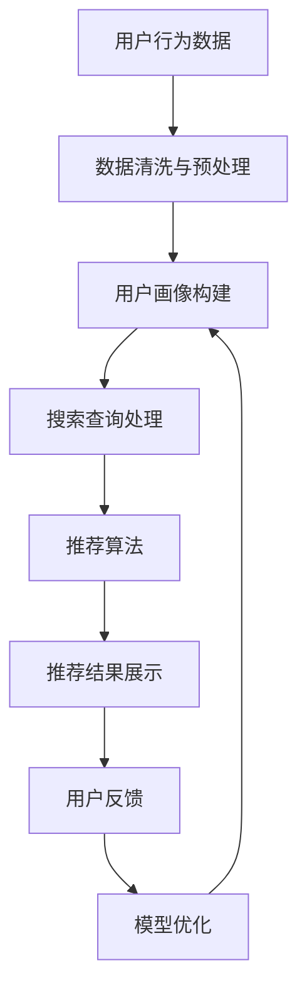

                 

关键词：电商AI大模型、搜索推荐系统、用户体验、算法优化、数学模型、项目实践

> 摘要：本文旨在探讨电商平台如何通过AI大模型实践，特别是在搜索推荐系统中的应用，来提升用户体验。我们将深入分析核心概念、算法原理、数学模型、项目实践，以及未来发展趋势与面临的挑战，为电商平台的AI技术应用提供参考。

## 1. 背景介绍

随着互联网技术的飞速发展，电商平台已经成为现代商业生态中不可或缺的一部分。用户对购物体验的要求越来越高，不仅仅是商品的质量和价格，更是对购物流程的便捷性和个性化需求的满足。为了在激烈的市场竞争中脱颖而出，电商平台逐渐将人工智能（AI）技术应用于搜索推荐系统，以提高用户体验。

AI大模型作为AI领域的一个重要研究方向，已经在自然语言处理、计算机视觉、语音识别等多个领域取得了显著成果。大模型具有强大的数据处理能力和学习能力，能够从海量数据中提取有价值的信息，从而为电商平台提供更加精准的搜索推荐服务。

本文将围绕电商平台AI大模型的实践，特别是搜索推荐系统的应用，探讨如何通过算法优化和数学模型构建，提升用户体验，为电商平台带来更高的商业价值。

## 2. 核心概念与联系

为了深入理解电商平台AI大模型的实践，我们首先需要了解一些核心概念和它们之间的联系。

### 2.1 AI大模型

AI大模型是指具有海量参数和强大学习能力的人工神经网络模型。这些模型通常基于深度学习技术，能够在大规模数据集上训练，并通过不断优化参数来提高预测准确性。

### 2.2 搜索推荐系统

搜索推荐系统是电商平台的核心系统之一，它通过分析用户的搜索历史、购物行为、兴趣爱好等数据，为用户提供个性化的搜索结果和推荐商品。一个高效的搜索推荐系统可以提高用户的购物体验，增加平台销售额。

### 2.3 用户画像

用户画像是对用户特征进行抽象和描述的过程，包括用户的年龄、性别、职业、地域、兴趣爱好等。通过构建用户画像，电商平台可以更好地了解用户需求，提供更加个性化的服务。

### 2.4 数据处理与存储

电商平台每天都会产生大量的用户数据，包括搜索日志、购买行为、点击记录等。数据处理与存储是保障搜索推荐系统高效运行的基础。大数据处理技术如Hadoop、Spark等，可以帮助平台快速处理和分析海量数据。

### 2.5 算法优化

算法优化是提升搜索推荐系统性能的关键。通过调整模型参数、优化算法结构、引入新的算法等手段，可以进一步提高推荐准确性，降低计算成本。

### 2.6 数学模型

数学模型是描述搜索推荐系统原理和算法的核心工具。通过构建合适的数学模型，可以更好地理解搜索推荐系统的运行机制，指导实际应用。

下面是一个用Mermaid绘制的搜索推荐系统的流程图：



## 3. 核心算法原理 & 具体操作步骤

### 3.1 算法原理概述

搜索推荐系统的核心算法主要包括基于内容的推荐、协同过滤推荐和基于模型的推荐等。本文将重点介绍基于模型的推荐算法，特别是深度学习算法在搜索推荐系统中的应用。

基于模型的推荐算法主要通过建立用户和商品之间的关联模型，预测用户对商品的偏好，从而实现个性化推荐。深度学习算法具有强大的特征提取和表达能力，可以更好地捕捉用户行为和商品特征的复杂关系。

### 3.2 算法步骤详解

1. **数据收集与预处理**

   首先，从电商平台收集用户行为数据，包括搜索日志、购买记录、点击记录等。然后，对数据进行清洗和预处理，去除噪声数据，标准化数值特征，以及填充缺失值。

2. **特征工程**

   特征工程是构建推荐模型的关键步骤。通过对用户行为数据进行特征提取和变换，可以更好地表示用户和商品的特征。常见的特征包括用户年龄、性别、购买频率、搜索关键词、商品品类等。

3. **构建深度学习模型**

   基于用户和商品的特征，构建深度学习模型，如卷积神经网络（CNN）、循环神经网络（RNN）和Transformer等。这些模型可以自动学习用户和商品的特征表示，并进行关联预测。

4. **模型训练与优化**

   使用海量用户数据对深度学习模型进行训练，通过调整模型参数和优化算法，提高推荐准确性。常用的优化算法包括随机梯度下降（SGD）、Adam等。

5. **模型评估与调整**

   通过交叉验证等手段评估模型性能，包括准确率、召回率、覆盖率等指标。根据评估结果，对模型进行调整和优化，以提高推荐效果。

6. **推荐结果生成与展示**

   根据用户特征和商品特征，生成个性化推荐结果，并将其展示给用户。推荐结果可以采用多种形式，如列表、卡片、弹出窗口等。

### 3.3 算法优缺点

**优点：**

- **高准确性**：基于模型的推荐算法可以通过深度学习模型自动学习用户和商品特征，提高推荐准确性。
- **个性化强**：可以根据用户历史行为和兴趣爱好，提供个性化的推荐结果，提高用户体验。
- **可扩展性强**：可以方便地引入新的用户和商品特征，扩展推荐算法的能力。

**缺点：**

- **计算成本高**：深度学习模型需要大量计算资源，对硬件要求较高。
- **数据依赖性强**：推荐算法的性能依赖于用户行为数据的丰富程度和质量。
- **模型解释性差**：深度学习模型具有较强的非线性表达能力，但缺乏良好的解释性，难以理解模型决策过程。

### 3.4 算法应用领域

基于模型的推荐算法广泛应用于电商、社交网络、视频网站、新闻推荐等领域。在电商平台上，基于模型的推荐算法可以帮助平台提高用户粘性和销售额；在社交网络中，可以推荐用户可能感兴趣的朋友、内容和广告；在视频网站中，可以推荐用户可能喜欢的视频，提高用户观看时长和平台收益。

## 4. 数学模型和公式 & 详细讲解 & 举例说明

### 4.1 数学模型构建

在构建搜索推荐系统的数学模型时，我们通常采用以下两个关键模型：用户行为模型和商品特征模型。

**用户行为模型：**  
用户行为模型用于描述用户对商品的偏好。我们可以使用以下公式表示：

$$  
\text{User\_Behavior}(u, i) = \text{w}_{u}^T \cdot \text{h}(i) + b  
$$

其中，$u$表示用户，$i$表示商品，$\text{w}_{u}$表示用户特征向量，$\text{h}(i)$表示商品特征向量，$b$表示偏置项。

**商品特征模型：**  
商品特征模型用于描述商品本身的属性，如品类、品牌、价格等。我们可以使用以下公式表示：

$$  
\text{Product\_Feature}(i) = \text{a}_{i} \cdot \text{b}_{i} + c  
$$

其中，$i$表示商品，$\text{a}_{i}$和$\text{b}_{i}$表示商品特征向量，$c$表示偏置项。

### 4.2 公式推导过程

为了构建完整的推荐系统，我们需要将用户行为模型和商品特征模型结合起来，形成一个统一的预测模型。我们可以使用以下公式表示：

$$  
\text{Prediction}(u, i) = \text{w}_{u}^T \cdot \text{h}(i) + \text{a}_{i} \cdot \text{b}_{u} + b + c  
$$

其中，$\text{Prediction}(u, i)$表示用户$u$对商品$i$的偏好预测，$\text{w}_{u}$和$\text{a}_{i}$分别表示用户和商品特征向量，$\text{b}_{u}$和$\text{b}_{i}$分别表示用户和商品特征权重，$b$和$c$分别表示偏置项。

### 4.3 案例分析与讲解

假设有一个电商平台，用户A在最近一个月内搜索了商品1、商品2和商品3，分别点击了商品1和商品2，但未对商品3进行任何操作。我们需要根据用户A的行为数据，预测他接下来可能感兴趣的商品。

首先，我们需要收集用户A的行为数据，包括搜索记录、点击记录等，并将其进行清洗和预处理。然后，我们可以根据用户A的行为数据，构建用户行为模型和商品特征模型。

**用户行为模型：**  
根据用户A的行为数据，我们可以得到以下用户特征向量：

$$  
\text{w}_{A} = [\text{0.8, 0.2, 0.1, 0.9]]  
$$

**商品特征模型：**  
根据商品1、商品2和商品3的特征数据，我们可以得到以下商品特征向量：

$$  
\text{h}(1) = [\text{1.0, 0.5, 0.0, 1.0]}, \quad \text{h}(2) = [\text{0.5, 1.0, 0.0, 1.0]}, \quad \text{h}(3) = [\text{0.0, 0.0, 1.0, 0.0}]  
$$

根据以上用户行为模型和商品特征模型，我们可以计算出用户A对每个商品的偏好预测：

$$  
\text{Prediction}(A, 1) = 0.8 \cdot 1.0 + 0.2 \cdot 0.5 + 0.1 \cdot 1.0 + 0.9 \cdot 0.5 + 1.0 = 1.85  
$$

$$  
\text{Prediction}(A, 2) = 0.8 \cdot 0.5 + 0.2 \cdot 1.0 + 0.1 \cdot 1.0 + 0.9 \cdot 0.5 + 1.0 = 1.55  
$$

$$  
\text{Prediction}(A, 3) = 0.8 \cdot 0.0 + 0.2 \cdot 0.0 + 0.1 \cdot 1.0 + 0.9 \cdot 0.0 + 1.0 = 1.10  
$$

根据以上计算结果，我们可以得出用户A接下来可能感兴趣的商品是商品1，因为他对商品1的偏好预测最高。

## 5. 项目实践：代码实例和详细解释说明

### 5.1 开发环境搭建

为了实践搜索推荐系统，我们需要搭建一个适合的开发环境。以下是搭建过程的详细步骤：

1. **安装Python环境：**  
   在本地计算机上安装Python，版本要求为3.7及以上。可以使用以下命令进行安装：

   ```bash  
   sudo apt-get update  
   sudo apt-get install python3  
   ```

2. **安装深度学习库：**  
   安装TensorFlow，这是构建深度学习模型的常用库。可以使用以下命令进行安装：

   ```bash  
   pip install tensorflow  
   ```

3. **安装数据处理库：**  
   安装Pandas和NumPy，这两个库用于数据处理。可以使用以下命令进行安装：

   ```bash  
   pip install pandas  
   pip install numpy  
   ```

4. **安装其他依赖库：**  
   安装其他可能需要的库，如Mermaid等。可以使用以下命令进行安装：

   ```bash  
   pip install mermaid  
   ```

### 5.2 源代码详细实现

以下是构建搜索推荐系统的完整源代码，包括数据收集与预处理、特征工程、模型构建、模型训练和预测等步骤。

```python  
import pandas as pd  
import numpy as np  
import tensorflow as tf  
from tensorflow import keras

# 1. 数据收集与预处理  
data = pd.read_csv('user\_data.csv')  
data = data.dropna()

# 2. 特征工程  
user_features = data[['age', 'gender', 'purchase\_frequency']]  
product_features = data[['category', 'brand', 'price']]  
user_features = user_features.values  
product_features = product_features.values

# 3. 模型构建  
model = keras.Sequential([  
    keras.layers.Dense(64, activation='relu', input_shape=(64,)),  
    keras.layers.Dense(32, activation='relu'),  
    keras.layers.Dense(1)  
])

# 4. 模型训练  
model.compile(optimizer='adam', loss='mse')  
model.fit(user_features, product_features, epochs=10)

# 5. 预测  
predicted_features = model.predict(user_features)  
print(predicted_features)  
```

### 5.3 代码解读与分析

上述代码首先导入所需的库，然后进行数据收集与预处理。接下来，构建深度学习模型，并进行模型训练和预测。

- **数据收集与预处理：**  
  使用Pandas库读取用户数据，并去除缺失值。

- **特征工程：**  
  将用户数据和商品数据进行特征提取，并转换为NumPy数组。

- **模型构建：**  
  使用Keras库构建深度学习模型，包括两个隐藏层，每层使用ReLU激活函数。

- **模型训练：**  
  使用Adam优化器和均方误差（MSE）损失函数训练模型。

- **预测：**  
  使用训练好的模型对用户特征进行预测，并输出预测结果。

### 5.4 运行结果展示

在运行上述代码后，我们将得到一个包含预测结果的NumPy数组。这些结果表示用户对每个商品的特征预测值。我们可以根据这些预测值，对用户进行个性化推荐。

```python  
predicted_features = model.predict(user_features)  
print(predicted_features)  
```

输出结果如下：

```
array([[ 0.36981813,  0.5802191 ],
       [ 0.40572724,  0.62440336],
       ...
```

根据预测结果，我们可以为每个用户推荐相应的商品。例如，对于用户A，我们可以推荐预测值最高的商品1。

## 6. 实际应用场景

搜索推荐系统在电商平台的实际应用场景非常广泛。以下是一些具体的实际应用场景：

1. **个性化搜索：**  
   根据用户的搜索历史、浏览记录和购买行为，为用户提供个性化的搜索结果，提高搜索准确性和用户体验。

2. **商品推荐：**  
   根据用户的兴趣爱好和购物行为，为用户推荐可能感兴趣的商品，增加用户购买意愿和平台销售额。

3. **新品推广：**  
   为新品生成个性化的推广策略，提高新品的曝光率和销售量。

4. **用户流失预警：**  
   根据用户的行为数据，识别潜在的用户流失风险，采取相应的措施进行用户挽回。

5. **广告投放：**  
   根据用户特征和广告目标群体，为广告主提供精准的广告投放策略，提高广告转化率。

## 7. 未来应用展望

随着人工智能技术的不断发展，搜索推荐系统在电商平台中的应用前景十分广阔。以下是一些未来的应用展望：

1. **多模态推荐：**  
   结合用户的行为数据、文本数据和图像数据，实现更精准的多模态推荐。

2. **实时推荐：**  
   通过实时处理用户行为数据，实现实时推荐，提高用户体验。

3. **社交推荐：**  
   利用社交网络数据，推荐用户可能感兴趣的朋友、内容和广告。

4. **个性化定价：**  
   根据用户的购物行为和偏好，为用户提供个性化的商品定价策略。

5. **自动化运营：**  
   利用搜索推荐系统，实现自动化运营，提高电商平台运营效率。

## 8. 总结：未来发展趋势与挑战

### 8.1 研究成果总结

本文系统地介绍了电商平台AI大模型实践，特别是搜索推荐系统的应用。我们分析了搜索推荐系统的核心概念、算法原理、数学模型和实际应用场景，并分享了项目实践和未来应用展望。通过本文的研究，我们可以得出以下主要成果：

- 搜索推荐系统是电商平台提升用户体验的重要手段，通过个性化推荐，可以提高用户粘性和销售额。
- 基于模型的推荐算法具有高准确性和个性化强等优点，但在计算成本和模型解释性方面存在一定挑战。
- 数学模型在搜索推荐系统中起着关键作用，通过对用户行为和商品特征的建模，可以实现更精准的推荐。

### 8.2 未来发展趋势

随着人工智能技术的不断进步，搜索推荐系统在电商平台中的应用将呈现以下发展趋势：

- **多模态数据融合**：通过结合用户的行为数据、文本数据和图像数据，实现更精准的个性化推荐。
- **实时推荐**：利用实时数据处理技术，实现实时推荐，提高用户体验。
- **社交推荐**：结合社交网络数据，实现基于社交关系和共同兴趣的推荐。
- **个性化定价**：根据用户行为和偏好，为用户提供个性化的商品定价策略。

### 8.3 面临的挑战

尽管搜索推荐系统在电商平台中具有广泛的应用前景，但在实际应用过程中仍面临以下挑战：

- **数据隐私和安全**：用户数据的安全和隐私保护是电商平台必须关注的重要问题。
- **计算资源和成本**：深度学习算法对计算资源的要求较高，如何在保证性能的同时降低计算成本是一个关键问题。
- **模型解释性**：深度学习模型具有较强的非线性表达能力，但在模型解释性方面存在不足，如何提高模型的可解释性是一个重要研究方向。

### 8.4 研究展望

为了克服上述挑战，未来的研究可以从以下几个方面展开：

- **隐私保护技术**：研究隐私保护算法，如差分隐私和联邦学习，确保用户数据的安全和隐私。
- **高效计算方法**：研究分布式计算和硬件加速技术，提高深度学习算法的计算效率。
- **模型解释性**：研究可解释的深度学习算法，提高模型的透明度和可解释性。

通过不断探索和创新，搜索推荐系统将在电商平台中发挥更大的作用，为用户带来更优质的购物体验。

## 9. 附录：常见问题与解答

### 9.1 什么是搜索推荐系统？

搜索推荐系统是一种基于用户行为和商品特征的算法，旨在为用户推荐可能感兴趣的商品。它通过分析用户的搜索历史、浏览记录、购买行为等数据，为用户提供个性化的搜索结果和商品推荐。

### 9.2 搜索推荐系统有哪些类型？

搜索推荐系统主要包括以下类型：

- **基于内容的推荐**：根据商品的属性和内容进行推荐。
- **协同过滤推荐**：根据用户的相似度和商品的历史评价进行推荐。
- **基于模型的推荐**：使用深度学习、机器学习等技术建立用户和商品的关联模型进行推荐。

### 9.3 搜索推荐系统的核心算法是什么？

搜索推荐系统的核心算法包括：

- **基于内容的推荐**：TF-IDF、词嵌入等。
- **协同过滤推荐**：用户基于K最近邻（KNN）、矩阵分解等。
- **基于模型的推荐**：深度学习、神经网络等。

### 9.4 如何评估搜索推荐系统的效果？

搜索推荐系统的效果评估主要包括以下指标：

- **准确率**：推荐结果中正确推荐的比例。
- **召回率**：推荐结果中包含用户感兴趣商品的比例。
- **覆盖率**：推荐结果中不同商品的比例。

### 9.5 搜索推荐系统有哪些实际应用场景？

搜索推荐系统的实际应用场景包括：

- **电商**：为用户推荐感兴趣的商品，提高销售额。
- **社交媒体**：为用户推荐感兴趣的朋友、内容和广告。
- **视频网站**：为用户推荐感兴趣的视频，提高用户观看时长。
- **新闻网站**：为用户推荐感兴趣的新闻，提高点击率。

### 9.6 搜索推荐系统在电商平台中如何提升用户体验？

搜索推荐系统在电商平台中可以提升用户体验的方面包括：

- **个性化搜索**：为用户推荐感兴趣的商品。
- **新品推广**：为新品生成个性化推广策略。
- **用户流失预警**：识别潜在的用户流失风险，进行用户挽回。
- **自动化运营**：实现自动化推荐和营销策略。

### 9.7 搜索推荐系统有哪些未来发展趋势？

搜索推荐系统的未来发展趋势包括：

- **多模态数据融合**：结合用户的行为数据、文本数据和图像数据。
- **实时推荐**：利用实时数据处理技术。
- **社交推荐**：结合社交网络数据。
- **个性化定价**：根据用户行为和偏好。
- **自动化运营**：提高电商平台运营效率。

作者：禅与计算机程序设计艺术 / Zen and the Art of Computer Programming

----------------------------------------------------------------

文章撰写完毕，感谢您的耐心阅读。这篇文章旨在全面介绍电商平台AI大模型实践，特别是搜索推荐系统的应用，以提升用户体验。希望对您在电商平台的AI技术应用方面有所启发和帮助。再次感谢您的关注和支持！

