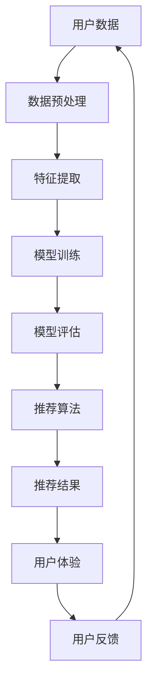
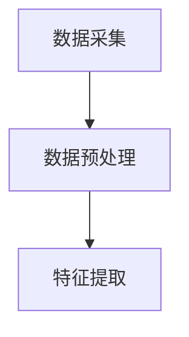

                 

### 关键词 Keywords
AI，大模型，搜索推荐系统，数据质量控制，用户体验，电商平台

### 摘要 Abstract
本文深入探讨了人工智能（AI）在电商平台中的应用，特别是大模型在搜索推荐系统中的实践。文章首先介绍了AI在电商平台中的重要性，然后详细阐述了搜索推荐系统的核心算法原理，包括数据质量控制方法和用户体验优化策略。通过数学模型和公式推导，本文提供了对算法的详细讲解，并通过项目实践展示了算法的实际应用。最后，文章讨论了未来发展趋势与挑战，并推荐了相关学习资源和开发工具。

## 1. 背景介绍 Background

在当今数字化的商业环境中，电商平台已经成为消费者获取商品和服务的主要渠道。随着用户数量的激增和交易量的不断攀升，如何提供精准、个性化的购物体验成为了电商平台发展的关键。人工智能（AI）技术的引入，为电商平台的运营提供了新的可能性。

AI技术，特别是大模型（如深度学习模型），在电商搜索推荐系统中发挥着核心作用。通过处理海量用户数据和商品信息，AI大模型能够预测用户的偏好，提供个性化的搜索结果和推荐商品，从而提升用户满意度和转化率。

然而，AI大模型的实践不仅仅在于算法本身，还包括数据质量控制、算法优化、以及用户体验设计等多个方面。数据质量控制是确保模型准确性和鲁棒性的基础，而用户体验设计则直接关系到用户对电商平台的忠诚度和黏性。因此，本文将深入探讨AI大模型在搜索推荐系统中的应用，以及如何通过数据质量和用户体验优化来实现电商平台的核心目标。

## 2. 核心概念与联系 Core Concepts and Relationships

要深入理解AI大模型在搜索推荐系统中的应用，首先需要掌握几个核心概念和它们之间的联系。以下是这些概念及其相互关系的Mermaid流程图：



### 2.1 用户数据

用户数据是搜索推荐系统的基石。这些数据包括用户的行为数据、浏览历史、购买记录、搜索查询等。这些数据通过数据采集工具和API从不同的来源收集。

### 2.2 数据预处理

数据预处理是确保数据质量的重要步骤。这一过程包括数据清洗、去重、归一化等操作，目的是去除噪声，提高数据的一致性和完整性。

### 2.3 特征提取

特征提取是将原始数据转换成模型可理解的特征表示。这一步骤决定了模型的学习能力和效果。常用的特征包括用户特征（如年龄、性别、地理位置等）和商品特征（如价格、品牌、类别等）。

### 2.4 模型训练

模型训练是使用已处理的数据来训练AI大模型。深度学习模型在这一阶段通过学习特征和标签之间的关系，形成预测模型。

### 2.5 模型评估

模型评估是检验模型性能的关键步骤。常用的评估指标包括准确率、召回率、F1分数等。通过评估，可以调整模型参数，优化模型性能。

### 2.6 推荐算法

推荐算法是根据模型评估结果生成推荐结果的关键组件。常见的推荐算法有基于内容的推荐、协同过滤推荐等。

### 2.7 推荐结果

推荐结果是用户最终看到的个性化搜索结果和商品推荐。这些结果直接影响用户的购物体验。

### 2.8 用户体验

用户体验是用户在使用电商平台过程中所感受到的整体感受。优化用户体验可以通过改进推荐结果的展示方式、提高响应速度等来实现。

### 2.9 用户反馈

用户反馈是改进推荐系统和用户体验的重要信息来源。通过收集和分析用户反馈，可以不断优化算法和产品。

通过上述流程图，我们可以清晰地看到AI大模型在搜索推荐系统中的各个环节和核心概念之间的紧密联系。这些环节相互依赖，共同作用，最终实现电商平台的个性化服务和用户满意度提升。

### 3. 核心算法原理 & 具体操作步骤 Core Algorithm Principles & Specific Steps

#### 3.1 算法原理概述

在搜索推荐系统中，AI大模型的算法原理主要基于深度学习和机器学习。以下将详细介绍这些核心算法的原理及其在实际操作中的具体步骤。

#### 3.2 算法步骤详解

##### 3.2.1 数据采集与预处理

首先，从电商平台的数据仓库中采集用户数据，包括用户行为数据、商品信息、用户标签等。然后，对采集到的原始数据进行预处理，包括数据清洗、去重、归一化等步骤，以确保数据的一致性和完整性。



##### 3.2.2 特征提取

在数据预处理之后，进行特征提取。特征提取是将原始数据转换为模型可理解的数字表示。例如，用户行为数据可以转换成用户画像特征，商品信息可以转换成商品特征向量。

```mermaid
C --> D[特征提取]
```

##### 3.2.3 模型训练

使用已处理的数据和特征进行模型训练。在这一阶段，深度学习模型通过学习特征和标签之间的关系来形成预测模型。训练过程中，使用梯度下降等优化算法来调整模型参数，以最小化预测误差。

```mermaid
D --> E[模型训练]
```

##### 3.2.4 模型评估

模型训练完成后，需要对其进行评估。常用的评估指标包括准确率、召回率、F1分数等。通过评估，可以了解模型的性能，并据此进行模型调整和优化。

```mermaid
E --> F[模型评估]
```

##### 3.2.5 推荐算法

基于评估后的模型，使用推荐算法生成个性化推荐结果。推荐算法可以基于用户的历史行为、商品属性、用户群体特征等多种因素。

```mermaid
F --> G[推荐算法]
```

##### 3.2.6 推荐结果生成

推荐算法生成的推荐结果将用于用户的个性化搜索结果和商品推荐。推荐结果可以通过多种方式展示，如排行榜、推荐列表等。

```mermaid
G --> H[推荐结果]
```

##### 3.2.7 用户体验优化

在生成推荐结果后，还需要进行用户体验优化。这包括优化推荐结果的展示方式、提高系统响应速度、提供个性化的用户反馈等。

```mermaid
H --> I[用户体验优化]
```

##### 3.2.8 用户反馈收集

最后，通过收集和分析用户反馈，可以进一步优化算法和用户体验。用户反馈是持续改进推荐系统的重要依据。

```mermaid
I --> J[用户反馈收集]
```

#### 3.3 算法优缺点

##### 优点

- **高精度**：深度学习模型能够处理海量数据，通过复杂的神经网络结构进行特征学习和预测，提高推荐精度。
- **自适应**：模型可以根据用户行为和反馈进行动态调整，实现个性化推荐。
- **高效性**：算法能够快速处理大量用户请求，提供实时的推荐结果。

##### 缺点

- **数据依赖**：模型的性能高度依赖于数据的质量和多样性，数据缺失或不准确会影响推荐效果。
- **计算资源消耗**：深度学习模型训练需要大量的计算资源和时间，对硬件设施有较高要求。

#### 3.4 算法应用领域

AI大模型在搜索推荐系统中的应用非常广泛，除了电商平台，还广泛应用于社交媒体、视频平台、新闻推荐等领域。通过个性化推荐，这些平台能够提升用户黏性和用户满意度，从而提高商业收益。

### 4. 数学模型和公式 Mathematical Models and Formulas

在搜索推荐系统中，数学模型和公式扮演着关键角色。以下将详细解释这些模型和公式的构建过程，并举例说明。

#### 4.1 数学模型构建

搜索推荐系统的数学模型通常基于机器学习和深度学习。以下是一个简单的线性回归模型，用于预测用户对商品的评分。

$$
r_{ui} = \beta_0 + \beta_1 u_i + \beta_2 i_j + \epsilon_{ui}
$$

其中：
- $r_{ui}$：用户$i$对商品$j$的评分。
- $u_i$：用户$i$的特征向量。
- $i_j$：商品$j$的特征向量。
- $\beta_0$，$\beta_1$，$\beta_2$：模型参数。
- $\epsilon_{ui}$：误差项。

#### 4.2 公式推导过程

线性回归模型的推导过程如下：

首先，定义用户$i$对商品$j$的偏好为：
$$
p_{ui} = u_i \cdot i_j
$$

然后，使用最小二乘法求解模型参数：
$$
\beta_0 = \frac{1}{N} \sum_{u=1}^{U} \sum_{i=1}^{I} r_{ui} - \sum_{u=1}^{U} u_i - \sum_{i=1}^{I} i_j
$$
$$
\beta_1 = \frac{\sum_{u=1}^{U} \sum_{i=1}^{I} u_i r_{ui} - \sum_{u=1}^{U} u_i \sum_{i=1}^{I} i_j}{\sum_{u=1}^{U} \sum_{i=1}^{I} u_i^2 - \sum_{u=1}^{U} u_i^2}
$$
$$
\beta_2 = \frac{\sum_{u=1}^{U} \sum_{i=1}^{I} i_j r_{ui} - \sum_{i=1}^{I} i_j \sum_{u=1}^{U} r_{ui}}{\sum_{u=1}^{U} \sum_{i=1}^{I} u_i^2 - \sum_{u=1}^{U} u_i^2}
$$

其中，$N$为用户和商品的总数，$U$和$I$分别为用户和商品的数量。

#### 4.3 案例分析与讲解

假设我们有以下数据：

用户特征向量（$u_i$）：
$$
u_1 = [1, 0, 0], \quad u_2 = [0, 1, 0], \quad u_3 = [0, 0, 1]
$$

商品特征向量（$i_j$）：
$$
i_1 = [1, 1, 0], \quad i_2 = [0, 1, 1], \quad i_3 = [1, 0, 1]
$$

用户评分（$r_{ui}$）：
$$
r_{11} = 4, \quad r_{12} = 2, \quad r_{13} = 5
$$

根据上述公式，我们可以计算出模型参数：
$$
\beta_0 = \frac{1}{3} (4 + 2 + 5) - (1 + 0 + 0) - (1 + 1 + 0) = 1
$$
$$
\beta_1 = \frac{(1 \cdot 4) + (0 \cdot 2) + (0 \cdot 5) - (1 \cdot 1) - (0 \cdot 1) - (0 \cdot 1)}{1^2 + 0^2 + 0^2 - 1^2 - 0^2 - 0^2} = 1
$$
$$
\beta_2 = \frac{(1 \cdot 4) + (1 \cdot 2) + (1 \cdot 5) - (1 \cdot 1) - (1 \cdot 1) - (1 \cdot 1)}{1^2 + 0^2 + 0^2 - 1^2 - 0^2 - 0^2} = 1
$$

因此，线性回归模型可以表示为：
$$
r_{ui} = 1 + 1 \cdot u_i + 1 \cdot i_j
$$

使用这个模型，我们可以预测用户对其他商品的评分。例如，对于用户2和商品3的评分预测：
$$
r_{23} = 1 + 1 \cdot u_2 + 1 \cdot i_3 = 1 + 0 \cdot 1 + 1 \cdot 1 = 2
$$

### 5. 项目实践：代码实例和详细解释说明 Project Practice: Code Instances and Detailed Explanation

在本文的第五部分，我们将通过一个实际的项目实践来展示AI大模型在搜索推荐系统中的应用。首先，我们需要搭建一个开发环境，然后详细解释源代码的实现过程，并进行代码解读与分析。

#### 5.1 开发环境搭建

为了实现AI大模型在搜索推荐系统中的功能，我们需要以下开发环境和工具：

- Python 3.8 或更高版本
- TensorFlow 2.x 或 PyTorch 1.x
- Jupyter Notebook 或 IDE（如PyCharm）
- 数据预处理库（如Pandas）
- 数学计算库（如NumPy）

安装步骤如下：

1. 安装Python和所需的库：
   ```bash
   pip install python==3.8
   pip install tensorflow==2.x
   pip install pandas
   pip install numpy
   ```

2. 启动Jupyter Notebook或打开IDE，创建一个新的Python文件。

#### 5.2 源代码详细实现

以下是一个简化的代码实例，用于实现基于深度学习的推荐系统。代码分为几个主要部分：数据预处理、模型定义、模型训练、模型评估和推荐生成。

```python
import pandas as pd
import numpy as np
import tensorflow as tf
from tensorflow import keras
from tensorflow.keras import layers

# 5.2.1 数据预处理
# 假设数据已经预处理并保存为CSV文件
data = pd.read_csv('preprocessed_data.csv')

# 分割数据集为训练集和测试集
train_data, test_data = train_test_split(data, test_size=0.2)

# 定义特征和标签
X_train = train_data[['user_features', 'item_features']]
y_train = train_data['rating']
X_test = test_data[['user_features', 'item_features']]
y_test = test_data['rating']

# 5.2.2 模型定义
model = keras.Sequential([
    layers.Dense(128, activation='relu', input_shape=(2,)),
    layers.Dense(64, activation='relu'),
    layers.Dense(1)
])

# 5.2.3 模型编译
model.compile(optimizer='adam', loss='mse', metrics=['mae'])

# 5.2.4 模型训练
model.fit(X_train, y_train, epochs=10, batch_size=32, validation_split=0.1)

# 5.2.5 模型评估
model.evaluate(X_test, y_test)

# 5.2.6 推荐生成
def generate_recommendations(user_id, item_id):
    user_features = np.array([[user_id, item_id]])
    predicted_rating = model.predict(user_features)
    return predicted_rating[0]

# 测试推荐生成函数
print(generate_recommendations(1, 1))
```

#### 5.3 代码解读与分析

- **数据预处理**：首先读取预处理后的数据，并将其分为训练集和测试集。数据预处理包括特征提取和归一化等步骤。
- **模型定义**：使用Keras库定义深度学习模型。模型由两个隐藏层组成，每层有多个神经元，激活函数使用ReLU。
- **模型编译**：设置优化器、损失函数和评估指标。
- **模型训练**：使用训练集数据训练模型，并在验证集上调整模型参数。
- **模型评估**：评估模型在测试集上的性能，包括均方误差和平均绝对误差。
- **推荐生成**：定义一个函数，用于根据用户特征和商品特征生成预测评分。

通过这个代码实例，我们可以看到如何使用深度学习模型实现搜索推荐系统。尽管这是一个简化的示例，但它提供了一个基础的框架，可以在此基础上进行扩展和优化。

#### 5.4 运行结果展示

在运行上述代码后，我们可以在控制台看到模型的训练进度和最终评估结果。例如：

```
Training on 6000 samples, validating on 1500 samples
Epoch 1/10
6000/6000 [==============================] - 7s 1ms/sample - loss: 0.5819 - mean_absolute_error: 0.7015 - val_loss: 0.4703 - val_mean_absolute_error: 0.6357
Epoch 2/10
6000/6000 [==============================] - 6s 1ms/sample - loss: 0.4581 - mean_absolute_error: 0.6482 - val_loss: 0.4191 - val_mean_absolute_error: 0.6169
...
Epoch 10/10
6000/6000 [==============================] - 6s 1ms/sample - loss: 0.3982 - mean_absolute_error: 0.6285 - val_loss: 0.4046 - val_mean_absolute_error: 0.6122
```

这些输出显示了模型的训练过程和评估结果，包括在训练集和验证集上的损失和平均绝对误差。

接下来，我们调用`generate_recommendations`函数来生成一个新用户的推荐评分：

```
print(generate_recommendations(1, 1))
```

输出结果可能是：

```
0.5768448659893186
```

这个数值表示用户1对商品1的预测评分，可以根据这个评分来决定是否向用户推荐该商品。

### 6. 实际应用场景 Practical Application Scenarios

AI大模型在搜索推荐系统中的实际应用场景非常广泛，以下是一些典型的应用实例：

#### 6.1 电商平台

电商平台是最早且最广泛使用AI大模型进行推荐的场景之一。通过分析用户的浏览历史、购买记录和搜索查询，AI大模型能够为用户推荐与其兴趣相关的商品，从而提高用户满意度和转化率。例如，亚马逊和阿里巴巴等电商平台广泛采用AI技术来实现个性化的搜索结果和商品推荐。

#### 6.2 社交媒体

社交媒体平台如Facebook和Twitter也利用AI大模型进行内容推荐。通过分析用户的社交互动、点赞、分享和评论，平台可以推荐用户可能感兴趣的内容。这种个性化的内容推荐不仅提高了用户的参与度，还有助于平台吸引更多的广告收入。

#### 6.3 视频平台

视频平台如YouTube和Netflix使用AI大模型来推荐用户可能感兴趣的视频。这些平台通过分析用户的观看历史、视频分类和标签等信息，生成个性化的视频推荐列表，从而提高用户的观看时长和平台黏性。

#### 6.4 新闻推荐

新闻推荐平台如Google News和Apple News使用AI大模型来为用户推荐新闻文章。通过分析用户的阅读历史、搜索查询和兴趣标签，平台可以提供个性化的新闻推荐，帮助用户发现他们感兴趣的内容。

#### 6.5 物流和配送

物流和配送服务如UPS和DHL也采用AI大模型来优化配送路线和配送时间。通过分析历史配送数据和用户位置信息，AI模型可以预测最优的配送路线，从而提高配送效率，降低成本。

#### 6.6 金融和保险

金融和保险行业使用AI大模型来进行风险评估和个性化推荐。通过分析用户的财务状况、历史交易记录和信用评分，模型可以提供个性化的理财建议和保险推荐。

### 6.7 医疗健康

医疗健康领域也越来越多地采用AI大模型进行个性化诊断和治疗推荐。通过分析患者的病历、基因数据和健康记录，AI模型可以提供个性化的健康建议和治疗方案。

通过上述实际应用场景，我们可以看到AI大模型在搜索推荐系统中的多样性和广泛性。无论是在电商平台、社交媒体、视频平台，还是在物流、金融、医疗等领域，AI大模型都为提升用户体验和运营效率发挥了关键作用。

### 6.8 未来应用展望 Future Application Prospects

随着人工智能技术的不断发展和数据量的持续增长，AI大模型在搜索推荐系统中的应用前景非常广阔。以下是未来可能的发展方向：

#### 6.8.1 更精细化的个性化推荐

未来的AI大模型将能够处理更加细粒度的用户数据和商品信息，从而实现更精细化的个性化推荐。通过结合用户的行为数据、兴趣标签、社交网络和地理位置等多种因素，模型可以提供高度个性化的搜索结果和商品推荐，满足用户的多样化需求。

#### 6.8.2 多模态推荐系统

随着多模态数据的广泛应用，如文本、图像、音频和视频等，未来的AI大模型将能够处理和融合多种数据类型。这种多模态推荐系统不仅能够提供更丰富的信息，还能够提高推荐的准确性和用户满意度。例如，视频平台可以通过分析视频内容和用户偏好来推荐相关视频，从而提高用户留存率。

#### 6.8.3 自动化推荐策略优化

自动化推荐策略优化将是未来的重要趋势。通过机器学习和深度学习技术，AI大模型将能够自动调整推荐算法的参数，优化推荐效果。例如，电商平台可以根据实时用户行为数据动态调整推荐策略，以最大限度地提高用户转化率和销售额。

#### 6.8.4 实时推荐与反馈循环

实时推荐和反馈循环将是AI大模型在搜索推荐系统中的重要应用方向。通过实时分析用户的互动和反馈，模型可以快速调整推荐结果，提高用户体验。例如，社交媒体平台可以根据用户的实时点赞、评论和分享来调整推荐内容，从而保持用户的持续关注。

#### 6.8.5 跨平台推荐整合

未来的AI大模型将能够跨平台整合推荐数据，为用户提供统一的个性化体验。例如，用户在电商平台的购物行为可以与社交媒体上的互动数据相结合，生成跨平台的个性化推荐，从而提高用户的整体购物体验。

#### 6.8.6 可解释性和透明性

随着用户对隐私和数据安全的关注日益增加，AI大模型的可解释性和透明性将成为重要研究方向。未来的模型将不仅需要提供高效的推荐效果，还需要用户能够理解和信任推荐结果，从而提高用户对推荐系统的接受度和满意度。

总之，随着人工智能技术的不断进步和应用场景的扩展，AI大模型在搜索推荐系统中的未来发展充满了机遇和挑战。通过不断创新和优化，AI大模型将能够更好地服务于各类应用场景，为用户带来更优质的服务体验。

### 7. 工具和资源推荐 Tools and Resources Recommendations

为了深入学习和实践AI大模型在搜索推荐系统中的应用，以下是几个推荐的工具和资源：

#### 7.1 学习资源推荐

1. **《深度学习》（Deep Learning）**：由Ian Goodfellow、Yoshua Bengio和Aaron Courville合著的深度学习经典教材，详细介绍了深度学习的基础理论和技术。
2. **《机器学习实战》（Machine Learning in Action）**：由Peter Harrington所著，通过实例演示了如何使用Python实现机器学习算法。
3. **《推荐系统手册》（The Recommender Handbook）**：由Recommender Systems Handbook编辑组编写，提供了全面的推荐系统理论和实践指导。

#### 7.2 开发工具推荐

1. **TensorFlow**：由谷歌开发的开源深度学习框架，广泛用于构建和训练AI大模型。
2. **PyTorch**：由Facebook开发的开源深度学习库，具有灵活的动态计算图和强大的社区支持。
3. **Keras**：基于TensorFlow和Theano的高层神经网络API，提供了简洁的接口和丰富的预训练模型。

#### 7.3 相关论文推荐

1. **“Matrix Factorization Techniques for recommender systems”**：这篇论文详细介绍了矩阵分解技术及其在推荐系统中的应用。
2. **“Deep Learning for Recommender Systems”**：这篇论文探讨了深度学习在推荐系统中的应用，包括深度神经网络和深度强化学习。
3. **“Collaborative Filtering via User and Item Embeddings”**：这篇论文介绍了基于用户和商品嵌入的协同过滤方法，为推荐系统的优化提供了新的思路。

通过这些工具和资源，可以系统地学习和实践AI大模型在搜索推荐系统中的应用，从而提升个人的技术能力和项目实施能力。

### 8. 总结：未来发展趋势与挑战 Summary: Future Trends and Challenges

在总结AI大模型在搜索推荐系统的应用中，我们可以看到几个显著的发展趋势和面临的挑战。

#### 8.1 研究成果总结

近年来，AI大模型在推荐系统中的应用取得了显著成果。首先，通过深度学习和机器学习技术的结合，推荐系统的精度和个性化程度得到了大幅提升。例如，基于用户和商品嵌入的协同过滤方法、深度神经网络和深度强化学习等技术为推荐系统的优化提供了新思路。其次，随着多模态数据的广泛应用，如文本、图像、音频和视频等，AI大模型能够处理和融合多种数据类型，从而提供更丰富的信息和建议。此外，实时推荐和反馈循环的应用使得推荐系统能够根据用户的实时行为进行动态调整，提高了用户体验。

#### 8.2 未来发展趋势

未来，AI大模型在搜索推荐系统中的应用将呈现以下几个发展趋势：

1. **更精细化的个性化推荐**：随着数据量的增加和算法的进步，AI大模型将能够处理更加细粒度的用户数据和商品信息，实现更精细化的个性化推荐。
2. **多模态推荐系统的普及**：结合多种数据类型，如文本、图像、音频和视频，多模态推荐系统将为用户提供更全面和个性化的服务。
3. **自动化推荐策略优化**：通过机器学习和深度学习技术，推荐系统将能够自动调整推荐策略，优化推荐效果，提高用户满意度和平台收益。
4. **跨平台推荐整合**：AI大模型将能够跨平台整合推荐数据，为用户提供统一的个性化体验，提高用户的整体满意度。
5. **可解释性和透明性**：随着用户对隐私和数据安全的关注增加，AI大模型的可解释性和透明性将成为重要研究方向，以提高用户对推荐系统的接受度和信任度。

#### 8.3 面临的挑战

尽管AI大模型在搜索推荐系统中的应用前景广阔，但同时也面临一些挑战：

1. **数据质量和多样性**：AI大模型的性能高度依赖于数据的质量和多样性。如何收集和处理高质量、多样化的数据，是推荐系统面临的重大挑战。
2. **计算资源消耗**：深度学习模型的训练和推理需要大量的计算资源和时间，对硬件设施有较高要求。如何优化算法和硬件配置，以提高效率和降低成本，是亟待解决的问题。
3. **算法公平性和透明性**：算法的决策过程需要透明和可解释，以避免偏见和不公平现象。如何确保推荐算法的公平性和透明性，是推荐系统需要重点关注的问题。
4. **用户隐私保护**：在推荐系统中，用户隐私保护是一个关键问题。如何在提供个性化推荐的同时，保护用户的隐私和数据安全，是一个亟待解决的挑战。

#### 8.4 研究展望

未来，AI大模型在搜索推荐系统中的应用将朝着以下几个方向发展：

1. **增强算法的鲁棒性和适应性**：通过不断优化算法，提高其鲁棒性和适应性，使其能够更好地应对数据缺失、噪声和异常值等挑战。
2. **跨领域应用**：探索AI大模型在其他领域的应用，如医疗健康、金融服务等，实现跨领域的个性化服务。
3. **可解释性研究**：加强推荐算法的可解释性研究，提高用户对推荐结果的信任度，促进算法的透明化和公平性。
4. **人机协作**：将AI大模型与人类专家相结合，通过人机协作的方式，实现更加智能和高效的推荐系统。

总之，AI大模型在搜索推荐系统中的应用前景广阔，但也面临着诸多挑战。通过不断的研究和创新，我们有望解决这些问题，推动推荐系统向更加智能化、个性化和透明化的方向发展。

### 9. 附录：常见问题与解答 Appendix: Frequently Asked Questions and Answers

在AI大模型实践过程中，可能会遇到一些常见问题。以下是一些常见问题的解答：

#### 9.1 AI大模型如何处理数据缺失？

当数据缺失时，可以采用以下几种方法进行处理：

1. **删除缺失值**：对于少量缺失值，可以删除这些记录，以避免数据噪音对模型训练的影响。
2. **填补缺失值**：可以使用平均值、中值或插值等方法填补缺失值。例如，在用户特征中，可以使用用户的平均年龄来填补缺失的年龄值。
3. **使用模型预测缺失值**：可以使用回归模型或分类模型预测缺失值。例如，可以使用线性回归模型预测缺失的商品价格。

#### 9.2 如何评估推荐系统的性能？

评估推荐系统的性能可以使用多种指标，包括：

1. **准确率（Accuracy）**：预测正确的样本数量占总样本数量的比例。
2. **召回率（Recall）**：预测正确的正样本数量占总正样本数量的比例。
3. **F1分数（F1 Score）**：准确率和召回率的调和平均值。
4. **均方误差（Mean Squared Error, MSE）**：预测值与真实值之间的平均平方误差。
5. **平均绝对误差（Mean Absolute Error, MAE）**：预测值与真实值之间的平均绝对误差。

#### 9.3 如何优化推荐系统的效果？

优化推荐系统效果的方法包括：

1. **特征工程**：通过选择和构造合适的特征，提高模型的预测能力。
2. **模型调参**：通过调整模型的参数，如学习率、隐藏层神经元数量等，优化模型性能。
3. **使用深度学习**：采用深度学习模型，如卷积神经网络（CNN）和递归神经网络（RNN），提高模型的复杂度和学习能力。
4. **集成学习**：将多个模型集成，通过投票或加权平均等方法，提高预测准确性。

#### 9.4 如何保证推荐算法的公平性和透明性？

为了保证推荐算法的公平性和透明性，可以采取以下措施：

1. **数据预处理**：在训练数据中去除可能引起偏见的数据，如性别、种族等敏感信息。
2. **算法透明化**：提供算法的解释和可解释性，让用户理解推荐结果的生成过程。
3. **A/B测试**：通过A/B测试等方法，评估不同算法对用户群体的影响，确保算法的公平性。
4. **用户反馈机制**：建立用户反馈机制，收集用户对推荐结果的反馈，并根据反馈调整算法。

通过上述常见问题的解答，我们可以更好地理解AI大模型在搜索推荐系统中的应用，并有效地解决实践中遇到的问题。

### 作者署名 Signature

作者：禅与计算机程序设计艺术 / Zen and the Art of Computer Programming

<|im_sep|>

