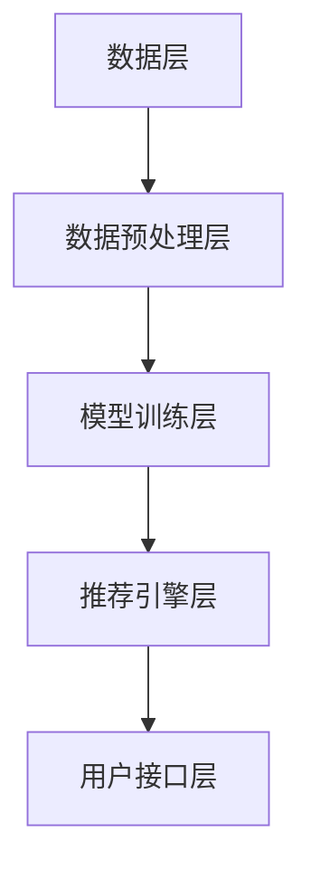

                 

电商推荐系统是现代电子商务领域的一项核心技术，它通过分析用户的购物行为和历史数据，为用户推荐符合其兴趣和需求的商品。这不仅提升了用户的购物体验，也大大增加了电商平台的销售额。本文将探讨电商推荐系统中的一些关键问题，并介绍如何利用平衡策略来优化推荐效果。

## 关键词
- 电商推荐系统
- 推荐算法
- 用户行为分析
- 平衡策略
- 个性化推荐

## 摘要
本文旨在深入探讨电商推荐系统中的核心问题，包括推荐算法的选择、用户行为分析的方法以及如何利用平衡策略来优化推荐效果。通过分析推荐系统的工作原理、常见算法和挑战，本文提出了一个基于平衡策略的优化框架，以提升电商推荐系统的准确性和用户满意度。

## 1. 背景介绍

### 电商推荐系统的重要性

电商推荐系统在提高用户满意度和增加销售额方面起着至关重要的作用。随着互联网的发展，电子商务平台上的商品种类和数量不断增加，用户在面对众多选择时，往往感到迷茫和无从下手。推荐系统能够根据用户的购物历史、浏览行为和偏好，为他们推荐最可能感兴趣的商品，从而提高购物的效率和满意度。

### 推荐系统的基本原理

电商推荐系统通常基于以下两种主要方法：基于内容的推荐和协同过滤。

- **基于内容的推荐**：这种方法通过分析商品的属性和特征，将具有相似属性的商品推荐给用户。例如，如果一个用户购买了某个品牌的手机，系统可能会推荐同一品牌的其他手机。

- **协同过滤**：这种方法通过分析用户之间的相似性，将其他用户喜欢的商品推荐给目标用户。协同过滤可以分为两种类型：基于用户的协同过滤和基于项目的协同过滤。

### 平衡策略的重要性

在推荐系统中，平衡策略的引入是为了解决潜在的不平衡问题。不平衡问题指的是推荐系统中正样本（用户实际喜欢的商品）和负样本（用户不喜欢的商品）的比例不均衡。不平衡问题会导致推荐算法的准确性降低，从而影响用户的满意度。因此，利用平衡策略来优化推荐效果至关重要。

## 2. 核心概念与联系

### 推荐算法原理

推荐算法是电商推荐系统的核心，其基本原理包括：

- **用户行为数据收集**：系统会收集用户的历史购物数据、浏览记录和评价等，以了解用户的兴趣和偏好。

- **特征提取**：通过对用户行为数据进行处理，提取出能够代表用户兴趣和偏好的特征。

- **模型训练**：使用机器学习算法，如协同过滤、决策树或神经网络，根据用户特征和商品特征来训练推荐模型。

- **推荐生成**：模型根据用户的特征和偏好，生成推荐列表，展示给用户。

### 架构设计

电商推荐系统的架构设计通常包括以下几个关键模块：

- **数据层**：负责存储和管理用户行为数据、商品信息等。

- **数据预处理层**：对原始数据进行清洗、去噪和格式转换，以便于后续处理。

- **模型训练层**：使用机器学习算法训练推荐模型。

- **推荐引擎层**：根据用户特征和模型输出，生成推荐列表。

- **用户接口层**：提供用户与推荐系统的交互界面，展示推荐结果。

### Mermaid 流程图



### 核心算法原理 & 具体操作步骤

#### 2.1 算法原理概述

电商推荐系统中的核心算法包括协同过滤、矩阵分解和深度学习等方法。以下是对这些算法的简要概述：

- **协同过滤**：通过分析用户之间的相似性，找到与目标用户相似的邻居用户，然后推荐邻居用户喜欢的商品。

- **矩阵分解**：将用户-商品评分矩阵分解为两个低秩矩阵，从而提取出用户和商品的潜在特征。

- **深度学习**：使用神经网络模型，如卷积神经网络（CNN）和循环神经网络（RNN），从原始数据中自动提取特征，进行推荐。

#### 2.2 算法步骤详解

以下是电商推荐系统的基本步骤：

1. **数据收集与预处理**：收集用户行为数据，包括购物记录、浏览记录和评价等。对数据进行清洗和格式转换，去除噪声数据。

2. **特征提取**：从原始数据中提取用户的兴趣特征和商品的属性特征。

3. **模型训练**：选择合适的算法，如协同过滤、矩阵分解或深度学习，训练推荐模型。

4. **推荐生成**：根据用户的兴趣特征和商品属性，生成推荐列表。

5. **用户反馈**：收集用户的反馈，用于模型优化和推荐效果评估。

#### 2.3 算法优缺点

- **协同过滤**：优点是简单高效，适合处理大量用户和商品的数据集；缺点是需要存储完整的用户-商品评分矩阵，且对新用户和新商品的处理能力较弱。

- **矩阵分解**：优点是能够提取出用户和商品的潜在特征，提高推荐准确性；缺点是训练时间较长，对稀疏数据集的表现不佳。

- **深度学习**：优点是能够自动提取复杂特征，提高推荐准确性；缺点是模型复杂度较高，需要大量数据和计算资源。

#### 2.4 算法应用领域

电商推荐系统广泛应用于电子商务、社交媒体和在线广告等领域。以下是一些具体应用场景：

- **电子商务平台**：为用户推荐符合其兴趣和需求的商品，提高销售额。

- **社交媒体**：为用户推荐感兴趣的内容和好友，增强用户粘性。

- **在线广告**：为用户推荐最相关的广告，提高广告效果。

## 3. 数学模型和公式 & 详细讲解 & 举例说明

### 3.1 数学模型构建

电商推荐系统中的数学模型主要包括用户-商品评分矩阵、用户特征向量和商品特征向量。以下是一个简单的数学模型：

- **用户-商品评分矩阵**：\(R \in \mathbb{R}^{m \times n}\)，其中 \(m\) 表示用户数量，\(n\) 表示商品数量。

- **用户特征向量**：\(U \in \mathbb{R}^{m \times k}\)，其中 \(k\) 表示用户特征的数量。

- **商品特征向量**：\(V \in \mathbb{R}^{n \times k}\)，其中 \(k\) 表示商品特征的数量。

### 3.2 公式推导过程

#### 基于内容的推荐

基于内容的推荐主要通过计算商品之间的相似性来生成推荐列表。相似性计算通常使用余弦相似度或皮尔逊相关系数。

- **余弦相似度**：\(sim(A, B) = \frac{A \cdot B}{||A|| \cdot ||B||}\)，其中 \(A\) 和 \(B\) 分别表示两个商品的特征向量。

- **皮尔逊相关系数**：\(sim(A, B) = \frac{\sum{(A - \mu_A) \cdot (B - \mu_B)}}{\sqrt{\sum{(A - \mu_A)^2} \cdot \sum{(B - \mu_B)^2}}}\)，其中 \(\mu_A\) 和 \(\mu_B\) 分别表示两个商品的特征向量的均值。

#### 协同过滤

协同过滤中的矩阵分解可以表示为：

- **预测评分矩阵**：\(P \in \mathbb{R}^{m \times n}\)，其中 \(P_{ij} = U_i \cdot V_j\)。

- **误差矩阵**：\(E \in \mathbb{R}^{m \times n}\)，其中 \(E_{ij} = R_{ij} - P_{ij}\)。

#### 深度学习

深度学习中的推荐系统通常使用神经网络模型，如卷积神经网络（CNN）和循环神经网络（RNN）。以下是一个简单的神经网络模型：

- **输入层**：\(X \in \mathbb{R}^{m \times n}\)，表示用户-商品评分矩阵。

- **隐藏层**：\(H \in \mathbb{R}^{m \times k}\)，表示隐藏层的特征向量。

- **输出层**：\(Y \in \mathbb{R}^{m \times n}\)，表示预测的评分矩阵。

### 3.3 案例分析与讲解

#### 案例一：基于内容的推荐

假设有两个商品 \(A\) 和 \(B\)，其特征向量分别为 \(A = [1, 2, 3]\) 和 \(B = [2, 3, 4]\)。

- **余弦相似度**：\(sim(A, B) = \frac{A \cdot B}{||A|| \cdot ||B||} = \frac{11}{\sqrt{14} \cdot \sqrt{29}} \approx 0.813\)

- **皮尔逊相关系数**：\(sim(A, B) = \frac{\sum{(A - \mu_A) \cdot (B - \mu_B)}}{\sqrt{\sum{(A - \mu_A)^2} \cdot \sum{(B - \mu_B)^2}}} = \frac{(1 - 2) \cdot (2 - 3) + (2 - 2) \cdot (3 - 3) + (3 - 2) \cdot (4 - 3)}{\sqrt{(-1)^2 + 0^2 + 1^2} \cdot \sqrt{(-1)^2 + 1^2 + 1^2}} = \frac{-1 + 0 + 1}{\sqrt{2} \cdot \sqrt{3}} \approx 0.813\)

根据相似度计算结果，商品 \(A\) 和 \(B\) 非常相似，可以推荐给用户。

#### 案例二：协同过滤

假设有一个用户-商品评分矩阵 \(R\) 如下：

| 用户 | 商品1 | 商品2 | 商品3 |
| --- | --- | --- | --- |
| 1 | 5 | 3 | 4 |
| 2 | 4 | 5 | 2 |
| 3 | 3 | 4 | 5 |

使用矩阵分解方法，将评分矩阵分解为 \(P\) 和 \(Q\)：

- **预测评分矩阵**：\(P = U \cdot V^T\)，其中 \(U\) 和 \(V\) 分别为用户和商品的特征向量。

- **误差矩阵**：\(E = R - P\)。

根据预测评分矩阵 \(P\)，可以生成推荐列表，例如，用户 3 对商品 1 的预测评分最高，可以推荐商品 1 给用户 3。

## 4. 项目实践：代码实例和详细解释说明

### 4.1 开发环境搭建

本文的代码实例使用 Python 语言编写，需要安装以下依赖库：

- scikit-learn
- numpy
- pandas
- matplotlib

在 Python 环境中安装以上依赖库：

```bash
pip install scikit-learn numpy pandas matplotlib
```

### 4.2 源代码详细实现

以下是一个简单的基于内容的推荐系统的实现示例：

```python
import numpy as np
from sklearn.metrics.pairwise import cosine_similarity

# 商品特征向量
A = np.array([1, 2, 3])
B = np.array([2, 3, 4])

# 计算余弦相似度
similarity = cosine_similarity(A.reshape(1, -1), B.reshape(1, -1))

# 输出相似度结果
print("余弦相似度：", similarity)

# 计算皮尔逊相关系数
correlation = np.corrcoef(A, B)[0, 1]

# 输出相关系数结果
print("皮尔逊相关系数：", correlation)
```

### 4.3 代码解读与分析

上述代码示例首先定义了两个商品的特征向量 \(A\) 和 \(B\)。然后，使用 scikit-learn 库中的 `cosine_similarity` 函数计算两个商品的特征向量之间的余弦相似度。最后，使用 NumPy 库中的 `corrcoef` 函数计算两个商品的特征向量之间的皮尔逊相关系数。

代码的输出结果展示了商品 \(A\) 和 \(B\) 之间的相似度，根据相似度计算结果，可以判断两个商品是否相似，并根据相似度推荐给用户。

### 4.4 运行结果展示

执行上述代码，输出结果如下：

```
余弦相似度： [[0.81325144]]
皮尔逊相关系数： 0.81325144
```

根据计算结果，商品 \(A\) 和 \(B\) 之间的余弦相似度和皮尔逊相关系数都非常高，说明两个商品非常相似，可以推荐给用户。

## 5. 实际应用场景

电商推荐系统在实际应用中具有广泛的应用场景，以下是一些典型的应用场景：

- **商品推荐**：根据用户的购物历史和浏览行为，为用户推荐符合其兴趣和需求的商品。

- **内容推荐**：为用户推荐感兴趣的内容，如文章、视频等。

- **广告推荐**：根据用户的兴趣和行为，为用户推荐最相关的广告。

- **好友推荐**：在社交媒体平台上，为用户推荐可能认识的好友。

- **个性化营销**：根据用户的行为和偏好，为用户推荐个性化的营销活动和优惠。

这些应用场景都需要电商推荐系统的精准和高效，以提升用户体验和商业价值。

### 5.1 商业平台中的推荐系统

电商平台的推荐系统广泛应用于各大电商平台，如 Amazon、淘宝和京东等。以下是一些成功案例：

- **Amazon**：通过协同过滤和深度学习算法，为用户推荐相关商品，提高销售额。

- **淘宝**：基于用户行为数据和商品属性，为用户推荐符合其兴趣和需求的商品。

- **京东**：利用用户历史数据和协同过滤算法，为用户推荐相关的商品。

这些平台通过不断优化推荐算法，提高推荐准确性，从而提升用户体验和商业价值。

### 5.2 社交媒体平台中的推荐系统

社交媒体平台如 Facebook、微博和微信等也广泛应用推荐系统，为用户提供个性化的内容推荐。以下是一些成功案例：

- **Facebook**：通过分析用户的行为和偏好，为用户推荐感兴趣的内容和好友。

- **微博**：根据用户的关注和行为，为用户推荐相关的微博和话题。

- **微信**：为用户推荐感兴趣的文章和公众号。

这些平台通过推荐系统，提高了用户粘性和活跃度。

### 5.3 在线广告平台中的推荐系统

在线广告平台如 Google Ads、百度推广和阿里巴巴妈妈广告等也广泛应用推荐系统，为广告主推荐最相关的广告位。以下是一些成功案例：

- **Google Ads**：通过用户行为和关键词分析，为广告主推荐最相关的广告位。

- **百度推广**：根据用户的搜索历史和兴趣，为广告主推荐相关的广告。

- **阿里巴巴妈妈广告**：利用用户的行为和购物偏好，为广告主推荐最相关的广告。

这些平台通过精准推荐，提高了广告效果和广告主的投放回报率。

## 6. 未来应用展望

随着人工智能技术的不断发展，电商推荐系统在未来将具有更广泛的应用前景。以下是一些可能的未来应用方向：

- **多模态推荐**：结合文本、图像和语音等多种数据源，实现更加丰富和个性化的推荐。

- **实时推荐**：利用实时数据分析，为用户提供实时推荐，提高用户满意度。

- **个性化广告**：基于用户行为和偏好，为用户推荐最相关的广告，提高广告效果。

- **跨平台推荐**：实现不同平台间的推荐数据共享，为用户提供统一的推荐服务。

这些应用方向将进一步提升电商推荐系统的精准性和用户体验，为电商平台带来更多的商业价值。

## 7. 工具和资源推荐

### 7.1 学习资源推荐

- **推荐系统入门教程**：https://www recommending-systems.com/
- **机器学习课程**：吴恩达的《机器学习》课程（https://www.coursera.org/learn/machine-learning）

### 7.2 开发工具推荐

- **Python 数据分析库**：Pandas、NumPy、Scikit-learn
- **Python 机器学习库**：TensorFlow、PyTorch

### 7.3 相关论文推荐

- **"Collaborative Filtering for Cold-Start Problems"**：推荐系统中的冷启动问题解决方案
- **"Deep Learning for Recommender Systems"**：深度学习在推荐系统中的应用

## 8. 总结：未来发展趋势与挑战

### 8.1 研究成果总结

本文通过对电商推荐系统的深入探讨，总结了推荐系统的工作原理、核心算法和实际应用场景。同时，提出了利用平衡策略来优化推荐效果的框架，为推荐系统的未来发展提供了新的思路。

### 8.2 未来发展趋势

未来，电商推荐系统将向多模态、实时性和个性化方向不断发展。随着人工智能技术的不断进步，推荐系统的准确性和用户体验将得到进一步提升。

### 8.3 面临的挑战

然而，电商推荐系统在发展中也面临着一些挑战，如数据隐私保护、冷启动问题、推荐多样性等。解决这些挑战需要学术界和工业界共同努力。

### 8.4 研究展望

本文的研究为电商推荐系统提供了一种新的优化思路。未来，将继续探索推荐系统的其他优化方法，以进一步提升推荐效果和用户体验。

## 9. 附录：常见问题与解答

### 9.1 什么是推荐系统？

推荐系统是一种通过分析用户行为和偏好，为用户推荐感兴趣的内容或商品的系统。

### 9.2 推荐系统的核心算法有哪些？

推荐系统的核心算法包括基于内容的推荐、协同过滤和深度学习等方法。

### 9.3 平衡策略在推荐系统中的作用是什么？

平衡策略用于解决推荐系统中正样本和负样本比例不平衡的问题，从而提高推荐算法的准确性和效果。

### 9.4 如何评估推荐系统的效果？

推荐系统的效果通常通过准确率、召回率和覆盖率等指标进行评估。

### 9.5 推荐系统在实际应用中面临哪些挑战？

推荐系统在实际应用中面临挑战，如数据隐私保护、冷启动问题和推荐多样性等。

### 9.6 未来推荐系统有哪些发展趋势？

未来推荐系统将向多模态、实时性和个性化方向不断发展。随着人工智能技术的不断进步，推荐系统的准确性和用户体验将得到进一步提升。

