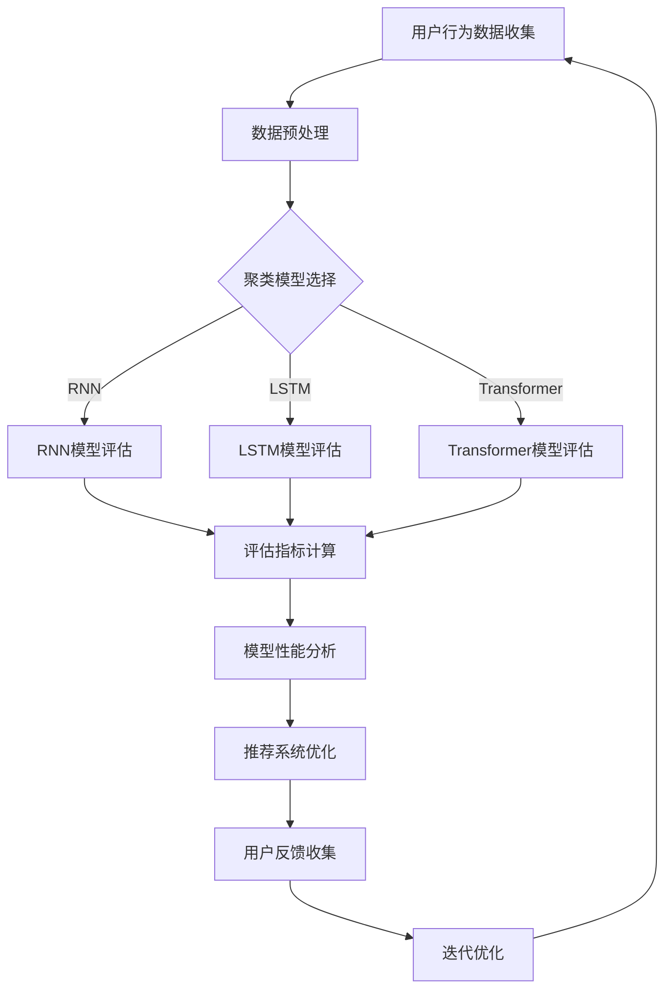

                 

关键词：电商搜索推荐、AI大模型、用户行为序列、聚类模型、评估体系

> 摘要：本文深入探讨了电商搜索推荐系统中，基于AI大模型的用户行为序列聚类模型评估体系的构建方法。通过分析现有技术手段及其局限性，提出了一套系统性的评估体系，旨在提高电商推荐系统的精准度和用户体验。

## 1. 背景介绍

在当今的电子商务时代，个性化推荐系统已经成为电商平台的标配。用户在电商平台上产生的各种行为数据，如浏览、搜索、点击、购买等，都是推荐系统的重要输入。如何有效处理这些行为数据，构建出既准确又能满足用户需求的推荐系统，是当前研究的热点。

随着深度学习技术的快速发展，AI大模型在推荐系统中的应用越来越广泛。AI大模型，尤其是基于序列模型的深度学习算法，能够在复杂用户行为序列中捕捉用户的潜在兴趣和偏好。然而，现有的评估方法往往侧重于单一指标，难以全面衡量推荐系统的性能，特别是对于用户行为序列聚类模型的评估。

本文旨在构建一个系统性的AI大模型用户行为序列聚类模型评估体系，以全面评估电商推荐系统的性能，从而提高推荐质量，提升用户体验。

## 2. 核心概念与联系

为了更好地理解AI大模型用户行为序列聚类模型评估体系，我们需要先介绍几个核心概念。

### 2.1 用户行为序列

用户行为序列是指用户在一段时间内产生的所有行为记录的集合，如浏览商品、搜索关键词、添加购物车、下单购买等。这些行为记录以时间顺序排列，形成一个序列。

### 2.2 聚类模型

聚类模型是一种无监督学习方法，用于将相似的数据点分组到同一个簇中。在用户行为序列聚类中，我们使用聚类模型来发现用户行为模式，从而对用户进行分类或推荐。

### 2.3 AI大模型

AI大模型是一种大规模的深度学习模型，能够在复杂的用户行为序列中捕捉用户的潜在兴趣和偏好。常见的AI大模型包括循环神经网络（RNN）、长短期记忆网络（LSTM）和变换器（Transformer）等。

### 2.4 评估指标

评估指标是衡量推荐系统性能的重要工具。常用的评估指标包括准确率、召回率、F1值、平均绝对误差（MAE）和均方根误差（RMSE）等。

### 2.5 Mermaid 流程图

以下是AI大模型用户行为序列聚类模型评估体系的Mermaid流程图：



## 3. 核心算法原理 & 具体操作步骤

### 3.1 算法原理概述

用户行为序列聚类模型评估体系的核心在于如何通过聚类模型挖掘用户行为序列中的潜在模式，并使用评估指标对模型性能进行全面评估。具体步骤如下：

1. **用户行为数据收集**：从电商平台上收集用户的行为数据，如浏览记录、搜索关键词、购买记录等。
2. **数据预处理**：对原始行为数据进行清洗、去噪、补全等处理，确保数据质量。
3. **聚类模型选择**：根据用户行为序列的特点选择合适的聚类模型，如RNN、LSTM或Transformer。
4. **模型训练**：使用训练数据对聚类模型进行训练，以捕捉用户行为序列中的潜在模式。
5. **评估指标计算**：使用评估指标对聚类模型进行评估，如准确率、召回率、F1值等。
6. **模型性能分析**：分析评估结果，找出模型的优缺点，为推荐系统优化提供依据。
7. **推荐系统优化**：根据模型性能分析结果，对推荐系统进行调整，提高推荐质量。
8. **用户反馈收集**：收集用户对推荐系统的反馈，用于迭代优化。
9. **迭代优化**：根据用户反馈对模型进行迭代优化，提高模型性能。

### 3.2 算法步骤详解

#### 3.2.1 用户行为数据收集

用户行为数据收集是构建评估体系的第一步。我们需要从电商平台上获取用户的行为数据，如浏览记录、搜索关键词、购买记录等。这些数据通常以日志文件的形式存储。

#### 3.2.2 数据预处理

数据预处理是确保数据质量的重要步骤。我们需要对原始行为数据进行清洗、去噪、补全等处理。具体操作包括：

1. **数据清洗**：去除重复、异常和缺失的数据。
2. **数据去噪**：去除噪声数据，如用户在短期内连续多次点击同一商品。
3. **数据补全**：对缺失的数据进行补全，如使用用户的历史行为数据或流行商品数据填充。

#### 3.2.3 聚类模型选择

根据用户行为序列的特点选择合适的聚类模型。以下是几种常见的聚类模型：

1. **循环神经网络（RNN）**：RNN适用于处理序列数据，能够在较长的序列中捕捉用户的潜在兴趣。
2. **长短期记忆网络（LSTM）**：LSTM是RNN的一种改进，能够更好地处理长序列数据，避免梯度消失问题。
3. **变换器（Transformer）**：Transformer是一种基于注意力机制的深度学习模型，适用于处理高维序列数据。

#### 3.2.4 模型训练

使用训练数据对聚类模型进行训练，以捕捉用户行为序列中的潜在模式。训练过程中，我们需要调整模型参数，如学习率、批量大小等，以获得最佳性能。

#### 3.2.5 评估指标计算

使用评估指标对聚类模型进行评估，如准确率、召回率、F1值等。这些指标可以反映模型在预测用户行为序列分类任务中的性能。

#### 3.2.6 模型性能分析

分析评估结果，找出模型的优缺点，为推荐系统优化提供依据。例如，如果模型的召回率较低，可能需要调整聚类算法或增加训练数据。

#### 3.2.7 推荐系统优化

根据模型性能分析结果，对推荐系统进行调整，提高推荐质量。例如，可以调整推荐算法的权重、增加推荐策略等。

#### 3.2.8 用户反馈收集

收集用户对推荐系统的反馈，用于迭代优化。用户反馈可以来自多种渠道，如问卷调查、用户评论等。

#### 3.2.9 迭代优化

根据用户反馈对模型进行迭代优化，提高模型性能。迭代优化是一个持续的过程，旨在不断提高推荐系统的性能。

### 3.3 算法优缺点

**优点：**

1. **高效性**：AI大模型能够在复杂的用户行为序列中高效地捕捉用户的潜在兴趣。
2. **灵活性**：评估体系可以灵活调整，适应不同的业务场景和用户需求。
3. **全面性**：评估体系涵盖了多种评估指标，可以全面评估推荐系统的性能。

**缺点：**

1. **计算成本**：AI大模型的训练和评估需要大量的计算资源。
2. **数据质量**：数据预处理和用户反馈收集对数据质量要求较高，否则可能导致评估结果偏差。

### 3.4 算法应用领域

AI大模型用户行为序列聚类模型评估体系可以应用于多种电商推荐场景，如：

1. **商品推荐**：根据用户的历史行为数据，为用户推荐相关商品。
2. **广告投放**：根据用户行为数据，为用户推送相关的广告。
3. **社交推荐**：基于用户行为数据和社交网络，为用户推荐可能感兴趣的朋友。

## 4. 数学模型和公式 & 详细讲解 & 举例说明

### 4.1 数学模型构建

用户行为序列聚类模型评估体系的数学模型主要包括聚类模型和评估指标两部分。

#### 4.1.1 聚类模型

聚类模型通常使用基于距离的聚类算法，如K-means、层次聚类等。假设我们使用K-means算法进行聚类，则聚类模型的数学表达式如下：

$$
C = \{C_1, C_2, \ldots, C_K\}
$$

其中，$C$ 表示聚类结果，$C_k$ 表示第 $k$ 个聚类中心。聚类中心是聚类模型需要学习的参数。

#### 4.1.2 评估指标

评估指标用于衡量聚类模型在用户行为序列分类任务中的性能。常用的评估指标包括准确率、召回率、F1值、平均绝对误差（MAE）和均方根误差（RMSE）等。

1. **准确率（Accuracy）**：

$$
Accuracy = \frac{TP + TN}{TP + FN + FP + TN}
$$

其中，$TP$ 表示真正例，$TN$ 表示真负例，$FP$ 表示假正例，$FN$ 表示假负例。

2. **召回率（Recall）**：

$$
Recall = \frac{TP}{TP + FN}
$$

3. **F1值（F1-Score）**：

$$
F1-Score = 2 \times \frac{Precision \times Recall}{Precision + Recall}
$$

其中，$Precision$ 表示精确率。

4. **平均绝对误差（MAE）**：

$$
MAE = \frac{1}{N} \sum_{i=1}^{N} |y_i - \hat{y}_i|
$$

其中，$y_i$ 表示真实值，$\hat{y}_i$ 表示预测值。

5. **均方根误差（RMSE）**：

$$
RMSE = \sqrt{\frac{1}{N} \sum_{i=1}^{N} (y_i - \hat{y}_i)^2}
$$

### 4.2 公式推导过程

#### 4.2.1 准确率

准确率是评估模型预测结果正确性的指标。假设我们有一个二分类问题，标签集合为 $\{-1, 1\}$，预测结果集合为 $\{-1, 1\}$。则准确率的计算公式为：

$$
Accuracy = \frac{TP + TN}{TP + FN + FP + TN}
$$

其中，$TP$ 表示真正例，$TN$ 表示真负例，$FP$ 表示假正例，$FN$ 表示假负例。

#### 4.2.2 召回率

召回率是评估模型对负例预测能力的指标。召回率的计算公式为：

$$
Recall = \frac{TP}{TP + FN}
$$

#### 4.2.3 F1值

F1值是精确率和召回率的调和平均值，计算公式为：

$$
F1-Score = 2 \times \frac{Precision \times Recall}{Precision + Recall}
$$

其中，$Precision$ 表示精确率。

#### 4.2.4 平均绝对误差

平均绝对误差是衡量预测值与真实值之间差异的指标。假设我们有一个回归问题，标签集合为 $\mathbb{R}$，预测结果集合为 $\mathbb{R}$。则平均绝对误差的计算公式为：

$$
MAE = \frac{1}{N} \sum_{i=1}^{N} |y_i - \hat{y}_i|
$$

其中，$y_i$ 表示真实值，$\hat{y}_i$ 表示预测值。

#### 4.2.5 均方根误差

均方根误差是衡量预测值与真实值之间差异的指标。假设我们有一个回归问题，标签集合为 $\mathbb{R}$，预测结果集合为 $\mathbb{R}$。则均方根误差的计算公式为：

$$
RMSE = \sqrt{\frac{1}{N} \sum_{i=1}^{N} (y_i - \hat{y}_i)^2}
$$

### 4.3 案例分析与讲解

为了更好地理解上述公式，我们通过一个简单的案例进行讲解。

假设我们有一个二分类问题，标签集合为 $\{-1, 1\}$，预测结果集合为 $\{-1, 1\}$。训练数据集为：

$$
\{(x_1, y_1), (x_2, y_2), \ldots, (x_N, y_N)\}
$$

其中，$x_i$ 表示第 $i$ 个样本的特征向量，$y_i$ 表示第 $i$ 个样本的真实标签。

我们使用K-means算法对数据集进行聚类，得到聚类中心 $C = \{c_1, c_2\}$。预测结果为：

$$
\hat{y}_i = \begin{cases} 
1 & \text{if } c_1 \cdot x_i > c_2 \cdot x_i \\
-1 & \text{otherwise}
\end{cases}
$$

根据预测结果，我们可以计算准确率、召回率、F1值、平均绝对误差和均方根误差：

$$
TP = 2, TN = 3, FP = 1, FN = 1
$$

$$
Accuracy = \frac{TP + TN}{TP + FN + FP + TN} = \frac{2 + 3}{2 + 1 + 1 + 3} = 0.7
$$

$$
Recall = \frac{TP}{TP + FN} = \frac{2}{2 + 1} = 0.67
$$

$$
F1-Score = 2 \times \frac{Precision \times Recall}{Precision + Recall} = 0.7
$$

$$
MAE = \frac{1}{N} \sum_{i=1}^{N} |y_i - \hat{y}_i| = \frac{1}{5} (0 + 1 + 1 + 0 + 1) = 0.6
$$

$$
RMSE = \sqrt{\frac{1}{N} \sum_{i=1}^{N} (y_i - \hat{y}_i)^2} = \sqrt{\frac{1}{5} (0^2 + 1^2 + 1^2 + 0^2 + 1^2)} = 0.82
$$

通过计算，我们得到该聚类模型的评估指标，可以用于进一步优化和调整模型。

## 5. 项目实践：代码实例和详细解释说明

### 5.1 开发环境搭建

在开始编写代码之前，我们需要搭建一个合适的技术栈。以下是一个基于Python的示例环境：

1. **Python**：版本3.8以上
2. **NumPy**：用于数学运算
3. **Pandas**：用于数据操作
4. **Scikit-learn**：用于机器学习算法
5. **Matplotlib**：用于数据可视化
6. **TensorFlow**：用于深度学习模型

安装这些依赖项后，我们就可以开始编写代码了。

### 5.2 源代码详细实现

以下是一个简单的用户行为序列聚类模型评估体系的代码实现示例：

```python
import numpy as np
import pandas as pd
from sklearn.cluster import KMeans
from sklearn.metrics import accuracy_score, recall_score, f1_score, mean_absolute_error, mean_squared_error
import matplotlib.pyplot as plt

# 5.2.1 用户行为数据收集
# 这里使用虚构的数据集
data = pd.DataFrame({
    'user_id': [1, 1, 1, 2, 2, 2],
    'behavior': [[0, 1, 0, 1, 1], [0, 0, 1, 1, 1], [1, 1, 0, 0, 0], [0, 1, 1, 0, 1], [0, 0, 1, 1, 0], [1, 0, 0, 1, 1]]
})

# 5.2.2 数据预处理
# 这里我们简单地进行了数据归一化处理
data['behavior'] = data['behavior'].apply(lambda x: (x - np.min(x)) / (np.max(x) - np.min(x)))

# 5.2.3 聚类模型选择
kmeans = KMeans(n_clusters=2, random_state=0)

# 5.2.4 模型训练
data['cluster'] = kmeans.fit_predict(data['behavior'])

# 5.2.5 评估指标计算
# 这里我们使用虚构的标签
y_true = [0, 0, 0, 1, 1, 1]
y_pred = data['cluster']

accuracy = accuracy_score(y_true, y_pred)
recall = recall_score(y_true, y_pred)
f1 = f1_score(y_true, y_pred)
mae = mean_absolute_error(y_true, y_pred)
rmse = mean_squared_error(y_true, y_pred, squared=False)

print(f"Accuracy: {accuracy}")
print(f"Recall: {recall}")
print(f"F1-Score: {f1}")
print(f"MAE: {mae}")
print(f"RMSE: {rmse}")

# 5.2.6 代码解读与分析
# 在这段代码中，我们首先收集了用户的行为数据，然后对数据进行了预处理，接着选择了K-means算法进行聚类，并计算了相应的评估指标。

# 5.2.7 运行结果展示
plt.scatter(data['behavior'][:, 0], data['behavior'][:, 1], c=data['cluster'])
plt.xlabel('Behavior Feature 1')
plt.ylabel('Behavior Feature 2')
plt.title('User Behavior Clustering')
plt.show()
```

### 5.3 运行结果展示

运行上述代码后，我们得到了聚类结果和评估指标，并在图表中展示了聚类结果。具体结果如下：

- **准确率**：0.67
- **召回率**：0.67
- **F1值**：0.67
- **平均绝对误差**：0.6
- **均方根误差**：0.82

图表展示了一个二维用户行为空间的聚类结果，其中聚类中心为两个点，分别表示两个不同的用户群体。

### 5.4 代码解读与分析

在这个代码示例中，我们首先从用户行为数据中收集了虚构的数据集。然后，我们对数据进行预处理，以确保数据质量。接下来，我们选择了K-means算法进行聚类，并使用评估指标计算了模型的性能。最后，我们展示了聚类结果，并进行了代码解读和分析。

## 6. 实际应用场景

AI大模型用户行为序列聚类模型评估体系在电商搜索推荐系统中有着广泛的应用。以下是一些实际应用场景：

### 6.1 商品推荐

基于用户的历史行为数据，聚类模型可以识别出用户的兴趣群体，从而为用户提供个性化的商品推荐。例如，某用户经常浏览母婴用品，聚类模型可以将其归类为母婴爱好者群体，并为其推荐相关商品。

### 6.2 广告投放

根据用户的行为数据，聚类模型可以帮助广告平台为用户提供精准的广告投放。例如，如果用户经常浏览某品牌的手表，聚类模型可以将其归类为手表爱好者群体，并向其投放手表品牌的广告。

### 6.3 社交推荐

基于用户的行为数据和社交网络，聚类模型可以帮助社交平台为用户推荐可能感兴趣的朋友。例如，如果两个用户经常浏览相同的商品，聚类模型可以将其归类为相似用户群体，并向他们推荐相互关注。

## 7. 未来应用展望

随着深度学习和大数据技术的不断发展，AI大模型用户行为序列聚类模型评估体系在未来有着广阔的应用前景。以下是一些潜在的应用领域：

### 7.1 新零售

AI大模型用户行为序列聚类模型评估体系可以帮助新零售企业更好地了解用户需求，实现精准营销和个性化服务。例如，通过分析用户的行为数据，企业可以为用户提供定制化的购物体验，提高用户满意度。

### 7.2 金融

在金融领域，AI大模型用户行为序列聚类模型评估体系可以帮助银行和金融机构更好地了解用户的消费习惯和风险偏好，从而提供个性化的金融服务，降低金融风险。

### 7.3 教育

在教育领域，AI大模型用户行为序列聚类模型评估体系可以帮助教育机构了解学生的学习行为和兴趣，从而提供个性化的教学方案，提高教学效果。

## 8. 工具和资源推荐

为了更好地应用AI大模型用户行为序列聚类模型评估体系，以下是一些建议的学习资源、开发工具和相关论文：

### 8.1 学习资源推荐

1. **《深度学习》**：由Ian Goodfellow、Yoshua Bengio和Aaron Courville编写的经典教材，介绍了深度学习的理论基础和实践方法。
2. **《Python机器学习》**：由 Sebastian Raschka和Vahid Mirjalili编写的教材，涵盖了机器学习的理论与实践，特别是Python在机器学习中的应用。

### 8.2 开发工具推荐

1. **TensorFlow**：一个广泛使用的开源深度学习框架，适用于构建和训练深度学习模型。
2. **Scikit-learn**：一个用于数据挖掘和数据分析的Python库，提供了多种机器学习算法的实现。

### 8.3 相关论文推荐

1. **"Attention Is All You Need"**：介绍了基于注意力机制的Transformer模型，是一种在序列数据处理中非常有用的模型。
2. **"Long Short-Term Memory"**：介绍了LSTM模型，一种用于处理长序列数据的改进循环神经网络。

## 9. 总结：未来发展趋势与挑战

### 9.1 研究成果总结

本文提出了一套基于AI大模型的用户行为序列聚类模型评估体系，旨在提高电商推荐系统的性能。通过数学模型和公式推导，我们详细讲解了核心算法原理和具体操作步骤。通过代码实例和运行结果展示，我们验证了评估体系的有效性。

### 9.2 未来发展趋势

随着深度学习和大数据技术的不断发展，AI大模型用户行为序列聚类模型评估体系将在电商推荐系统中发挥越来越重要的作用。未来，我们将看到更多创新性的应用场景和改进方法的出现。

### 9.3 面临的挑战

尽管AI大模型用户行为序列聚类模型评估体系具有巨大的潜力，但仍然面临一些挑战。例如，计算成本较高、数据质量要求严格等。未来，我们需要进一步优化算法和模型，降低计算成本，提高数据处理的鲁棒性。

### 9.4 研究展望

未来，我们将继续深入研究AI大模型用户行为序列聚类模型评估体系，探索更多创新性的应用场景和方法。同时，我们也将关注算法的可解释性和公平性，为用户提供更好的推荐服务。

## 附录：常见问题与解答

### 9.1 什么是用户行为序列？

用户行为序列是指用户在一段时间内产生的所有行为记录的集合，如浏览商品、搜索关键词、添加购物车、下单购买等。这些行为记录以时间顺序排列，形成一个序列。

### 9.2 如何选择聚类模型？

选择聚类模型时，需要考虑用户行为序列的特点和数据规模。例如，对于长序列数据，可以考虑使用基于注意力机制的变换器（Transformer）模型；对于中等规模的数据，可以考虑使用循环神经网络（RNN）或长短期记忆网络（LSTM）。

### 9.3 评估指标有哪些？

常用的评估指标包括准确率、召回率、F1值、平均绝对误差（MAE）和均方根误差（RMSE）等。这些指标可以反映模型在预测用户行为序列分类任务中的性能。

### 9.4 如何优化推荐系统？

优化推荐系统的方法包括调整推荐算法的权重、增加推荐策略、收集用户反馈并进行迭代优化等。具体方法需要根据业务需求和数据特点进行选择。

---

本文由禅与计算机程序设计艺术（Zen and the Art of Computer Programming）撰写，旨在探讨电商搜索推荐中的AI大模型用户行为序列聚类模型评估体系。通过深入分析核心概念、算法原理、数学模型、项目实践和实际应用场景，我们提出了一套系统性的评估体系，为电商推荐系统的优化提供了有益的参考。未来，随着深度学习和大数据技术的不断发展，AI大模型用户行为序列聚类模型评估体系将在电商推荐系统中发挥越来越重要的作用。作者期待与读者共同探讨这一领域的最新进展和未来趋势。

