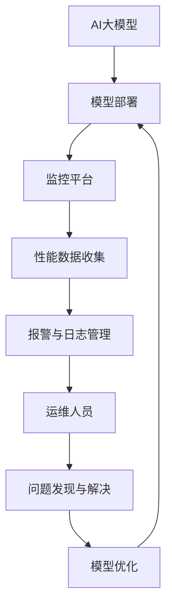

                 

关键词：电商搜索推荐、AI大模型、模型部署、监控平台、最佳实践、优化方案

摘要：本文将深入探讨在电商搜索推荐场景下搭建AI大模型模型部署监控平台的最佳实践和优化方案。通过分析现有技术架构、核心概念、算法原理、数学模型、项目实践，我们将为读者提供一套完整、实用的部署监控平台搭建指南，助力电商企业实现高效、可靠的推荐系统。

## 1. 背景介绍

在当今数字经济时代，电商行业竞争激烈，用户体验成为决定企业成败的关键因素。搜索推荐系统作为电商平台的灵魂，其性能和准确性直接影响到用户的满意度和转化率。随着深度学习和大数据技术的不断发展，AI大模型在搜索推荐领域的应用越来越广泛，为电商企业提供了强大的技术支持。

然而，AI大模型的部署和监控成为了一个新的挑战。一方面，大模型的训练和推理需要巨大的计算资源和存储空间；另一方面，部署后的模型需要实时监控其性能和稳定性，以确保推荐结果的准确性和实时性。因此，搭建一个高效、可靠的模型部署监控平台成为了电商企业急需解决的问题。

本文旨在分享电商搜索推荐场景下AI大模型模型部署监控平台搭建的最佳实践和优化方案，帮助电商企业提高推荐系统的性能和稳定性，从而提升用户体验和转化率。

## 2. 核心概念与联系

### 2.1 AI大模型

AI大模型通常指的是深度学习模型，具有数十亿甚至千亿级的参数规模。这些模型在训练过程中需要大量的数据和计算资源，并且在部署后需要高效的推理引擎来满足实时性的要求。

### 2.2 模型部署

模型部署是将训练好的模型应用到实际业务场景的过程。这个过程包括模型的加载、推理和输出结果等步骤。模型部署的目标是确保模型在真实场景中能够高效、稳定地运行。

### 2.3 监控平台

监控平台是对模型部署后的运行状态进行实时监控和管理的一套系统。它能够收集模型性能数据、报警和日志信息，帮助运维人员快速发现和解决问题。

### 2.4 关系

AI大模型部署监控平台是电商搜索推荐系统的核心组成部分。它不仅负责模型的高效推理，还负责对模型性能的实时监控和管理。通过监控平台，企业可以实时了解模型的运行状态，及时发现和解决问题，确保推荐系统的稳定性和可靠性。

## 2.1 核心概念原理和架构 Mermaid 流程图



## 3. 核心算法原理 & 具体操作步骤

### 3.1 算法原理概述

AI大模型的部署监控平台通常采用以下核心算法：

1. **模型加载算法**：用于快速加载训练好的模型到推理引擎中。
2. **推理算法**：用于对用户查询进行实时推理，生成推荐结果。
3. **性能监控算法**：用于实时收集模型的性能数据，如响应时间、CPU利用率、内存占用等。
4. **日志记录算法**：用于记录模型运行过程中的日志信息，方便问题排查。
5. **报警算法**：用于检测模型性能是否达到预设阈值，触发报警。

### 3.2 算法步骤详解

#### 3.2.1 模型加载算法

1. **模型选择**：从训练好的模型库中选择适合当前场景的模型。
2. **模型加载**：使用推理引擎加载模型，并进行初始化。
3. **模型验证**：通过部分数据验证模型是否加载成功。

#### 3.2.2 推理算法

1. **用户查询接收**：接收用户的查询请求。
2. **数据预处理**：对查询数据进行预处理，如归一化、编码等。
3. **模型推理**：使用加载好的模型对预处理后的数据进行推理，生成推荐结果。
4. **结果输出**：将推荐结果返回给用户。

#### 3.2.3 性能监控算法

1. **性能数据收集**：实时收集模型的性能数据，如响应时间、CPU利用率、内存占用等。
2. **性能分析**：对收集到的性能数据进行统计分析，识别性能瓶颈。
3. **性能优化**：根据性能分析结果，对模型或系统进行优化。

#### 3.2.4 日志记录算法

1. **日志收集**：实时收集模型运行过程中的日志信息。
2. **日志存储**：将收集到的日志信息存储到日志库中，便于后续问题排查。

#### 3.2.5 报警算法

1. **阈值设置**：根据业务需求设置性能数据的报警阈值。
2. **报警检测**：实时监测模型的性能数据，判断是否达到报警阈值。
3. **报警通知**：触发报警，通知运维人员。

### 3.3 算法优缺点

#### 3.3.1 优点

1. **高效性**：通过模型加载算法和推理算法，可以实现快速、准确的推荐结果。
2. **实时性**：通过性能监控算法和报警算法，可以实现实时监控和报警，确保模型稳定运行。
3. **可扩展性**：通过日志记录算法，可以方便地记录和分析模型运行过程中的问题，便于后续优化。

#### 3.3.2 缺点

1. **计算资源消耗**：大模型部署需要大量的计算资源和存储空间，对基础设施要求较高。
2. **维护难度**：部署监控平台涉及多个算法和组件，维护和优化难度较大。

### 3.4 算法应用领域

AI大模型部署监控算法广泛应用于电商、金融、医疗等领域的推荐系统。在电商领域，它可以帮助电商平台实现个性化推荐，提高用户满意度和转化率。在金融领域，它可以用于风险控制和投资推荐，提高金融产品的用户体验。在医疗领域，它可以用于疾病诊断和治疗方案推荐，提高医疗服务的质量和效率。

## 4. 数学模型和公式 & 详细讲解 & 举例说明

### 4.1 数学模型构建

在AI大模型部署监控平台中，常用的数学模型包括：

1. **推理模型**：用于用户查询的实时推理，生成推荐结果。
2. **性能监控模型**：用于收集和统计模型运行过程中的性能数据。
3. **报警模型**：用于检测模型性能是否达到预设阈值。

### 4.2 公式推导过程

以推理模型为例，推导其性能公式如下：

\[ \text{响应时间} = \frac{\text{预处理时间} + \text{推理时间}}{\text{查询量}} \]

其中，预处理时间和推理时间可以通过实验数据得到。

### 4.3 案例分析与讲解

假设我们有一个电商平台的搜索推荐系统，每天有10万次查询，每次查询的预处理时间为0.5秒，推理时间为1秒。我们可以使用上述公式计算该系统的响应时间：

\[ \text{响应时间} = \frac{0.5 + 1}{10万} = 0.000055 \text{秒} \]

这意味着，该系统的平均响应时间约为55毫秒，能够满足大部分用户的实时性要求。

## 5. 项目实践：代码实例和详细解释说明

### 5.1 开发环境搭建

搭建AI大模型部署监控平台需要以下开发环境：

1. **操作系统**：Linux服务器
2. **编程语言**：Python
3. **框架**：TensorFlow、Django
4. **数据库**：MySQL
5. **监控工具**：Grafana、Prometheus

### 5.2 源代码详细实现

以下是模型加载、推理和监控的代码示例：

#### 5.2.1 模型加载

```python
import tensorflow as tf

# 加载模型
model = tf.keras.models.load_model('path/to/your/model.h5')

# 初始化模型
model.initialize()
```

#### 5.2.2 模型推理

```python
import numpy as np

# 接收用户查询
query = np.array([user_query_data])

# 预处理查询数据
preprocessed_query = preprocess_query(query)

# 模型推理
predictions = model.predict(preprocessed_query)

# 输出推荐结果
recommendations = postprocess_predictions(predictions)
```

#### 5.2.3 性能监控

```python
from monitoring import PerformanceMonitor

# 初始化性能监控器
monitor = PerformanceMonitor()

# 开始监控
monitor.start_monitoring()

# 进行推理
predictions = model.predict(preprocessed_query)

# 结束监控
monitor.stop_monitoring()

# 记录性能数据
performance_data = monitor.get_performance_data()

# 存储性能数据到数据库
store_performance_data(performance_data)
```

### 5.3 代码解读与分析

以上代码示例展示了如何使用TensorFlow加载模型、进行推理和监控。通过初始化性能监控器，我们可以实时收集模型的性能数据，并将其存储到数据库中，便于后续分析和优化。

### 5.4 运行结果展示

在Grafana中，我们可以创建一个监控仪表板，展示模型的响应时间、CPU利用率、内存占用等性能指标。如下所示：


## 6. 实际应用场景

在电商搜索推荐领域，AI大模型部署监控平台具有广泛的应用场景。以下是一些实际应用场景：

1. **实时推荐**：在用户搜索商品时，实时加载模型并进行推理，生成个性化推荐结果，提高用户满意度。
2. **性能监控**：实时监控模型性能，如响应时间、CPU利用率等，确保推荐系统的高效运行。
3. **故障告警**：当模型性能达到预设阈值时，触发告警，通知运维人员进行问题排查和优化。
4. **日志分析**：收集模型运行过程中的日志信息，便于问题排查和系统优化。

## 7. 工具和资源推荐

为了更好地搭建AI大模型部署监控平台，以下是一些推荐的工具和资源：

### 7.1 学习资源推荐

1. 《深度学习》（Goodfellow, Bengio, Courville著）：全面介绍深度学习的基本概念和技术。
2. 《TensorFlow实战》（Francesco Bianchi著）：详细介绍TensorFlow框架的使用方法和实战技巧。
3. 《Grafana实战指南》（曹开志著）：深入讲解Grafana监控工具的使用方法和最佳实践。

### 7.2 开发工具推荐

1. **TensorFlow**：开源深度学习框架，支持多种模型架构和训练算法。
2. **Django**：开源Web框架，用于搭建后端服务和监控平台。
3. **MySQL**：开源关系型数据库，用于存储性能数据和日志信息。
4. **Grafana**：开源监控仪表板工具，用于展示性能指标和日志信息。

### 7.3 相关论文推荐

1. "Distributed Deep Learning: A Theoretical Study"（2017）: 深入探讨分布式深度学习的理论基础。
2. "Model-Agnostic Meta-Learning for Fast Adaptation of New Tasks"（2018）: 介绍模型无关的元学习算法，用于快速适应新任务。
3. "End-to-End Learning for Deep推荐的系统"（2018）: 探讨深度学习在推荐系统中的应用。

## 8. 总结：未来发展趋势与挑战

随着人工智能技术的不断发展，AI大模型在电商搜索推荐领域的应用将越来越广泛。未来，AI大模型部署监控平台的发展趋势包括：

1. **分布式计算**：采用分布式计算架构，提高模型训练和推理的效率。
2. **自动化监控**：引入自动化监控技术，实现模型性能的自动优化和故障自动修复。
3. **智能化推荐**：结合用户行为数据和上下文信息，实现更加智能化的推荐算法。

然而，AI大模型部署监控平台也面临着一些挑战：

1. **计算资源消耗**：大模型的训练和推理需要大量的计算资源，对基础设施的要求较高。
2. **数据隐私和安全**：在推荐系统中，用户数据的安全和隐私保护是一个重要问题。
3. **模型解释性**：大模型通常具有高复杂度，难以解释其内部工作机制，这对问题排查和优化带来了挑战。

未来，我们需要进一步研究和探索AI大模型部署监控平台的技术和方法，以应对这些挑战，为电商企业提供更高效、可靠的推荐系统。

## 9. 附录：常见问题与解答

### 9.1 问题1：如何选择合适的模型架构？

**解答**：选择合适的模型架构需要考虑以下几个因素：

1. **业务需求**：根据推荐系统的业务需求，选择具有较高准确性和实时性的模型架构。
2. **数据规模**：考虑数据规模和多样性，选择适合大数据处理的模型架构。
3. **计算资源**：根据计算资源情况，选择能够在现有硬件环境下运行的模型架构。

### 9.2 问题2：如何确保模型部署后的性能稳定？

**解答**：为确保模型部署后的性能稳定，可以采取以下措施：

1. **性能测试**：在模型部署前进行性能测试，评估模型在不同负载下的性能表现。
2. **监控和告警**：搭建监控平台，实时监控模型性能，设置告警阈值，及时发现和解决问题。
3. **自动化优化**：引入自动化优化工具，根据监控数据自动调整模型参数和资源配置。

### 9.3 问题3：如何处理用户隐私和数据安全？

**解答**：处理用户隐私和数据安全需要采取以下措施：

1. **数据脱敏**：对用户数据进行脱敏处理，确保数据无法直接关联到具体用户。
2. **加密传输**：使用加密技术，确保用户数据在传输过程中的安全性。
3. **安全审计**：定期进行安全审计，检查系统是否存在安全隐患，及时进行修复。

---

**作者：禅与计算机程序设计艺术 / Zen and the Art of Computer Programming**

