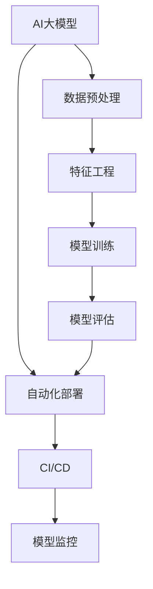

                 

## 1. 背景介绍

随着互联网的快速发展，电商行业已经成为全球最重要的商业领域之一。电商平台的成功很大程度上取决于其搜索推荐系统的质量。一个高效的搜索推荐系统能够帮助用户快速找到他们需要的商品，从而提高用户的购物体验和平台的销售额。

然而，随着电商数据量的爆炸式增长，传统的搜索推荐系统已经难以满足用户对个性化、实时性和精准度的需求。因此，越来越多的电商平台开始采用人工智能（AI）大模型来进行搜索推荐。这些大模型通常基于深度学习技术，能够通过学习大量的用户数据和商品信息，为用户提供个性化的推荐结果。

AI大模型在搜索推荐场景中的成功应用，离不开其高效的部署策略。然而，部署AI大模型面临着诸多挑战，如模型规模巨大、依赖环境复杂、部署流程繁琐等。因此，本文将探讨电商搜索推荐场景下AI大模型部署的自动化策略，以实现高效、可靠的模型部署。

## 2. 核心概念与联系

在讨论AI大模型部署的自动化策略之前，我们首先需要了解一些核心概念和它们之间的联系。以下是本文中将要讨论的一些关键概念：

### 2.1 AI大模型

AI大模型通常是指基于深度学习技术构建的、具有亿级参数规模的人工神经网络模型。这些模型通过学习大量的数据，能够自动提取特征并建立复杂的预测模型。

### 2.2 自动化部署

自动化部署是指通过一系列工具和流程，将AI大模型从开发环境中快速、可靠地迁移到生产环境中，以便为用户提供服务。

### 2.3 持续集成/持续部署（CI/CD）

持续集成/持续部署（CI/CD）是一种软件开发实践，通过自动化测试、构建和部署流程，实现快速、可靠地交付软件。

### 2.4 模型监控

模型监控是指对部署在生产环境中的AI大模型进行实时监控，以确保其性能稳定、预测准确。

以下是一个简单的Mermaid流程图，展示了这些核心概念之间的联系：



### 2.5 数据预处理

数据预处理是AI大模型部署的重要环节。它包括数据清洗、数据格式转换、数据增强等操作，旨在提高模型训练的质量和效率。

### 2.6 特征工程

特征工程是指通过提取、构造和选择合适的特征，将原始数据转换为适合AI大模型训练的格式。特征工程对于提高模型性能具有重要意义。

### 2.7 模型训练

模型训练是指通过优化神经网络的参数，使模型能够准确地预测目标变量。模型训练通常是一个迭代的过程，需要大量的计算资源和时间。

### 2.8 模型评估

模型评估是指通过一系列指标（如准确率、召回率、F1分数等）来评估模型的性能。模型评估有助于确定模型是否达到预期的效果。

## 3. 核心算法原理 & 具体操作步骤

### 3.1 算法原理概述

电商搜索推荐场景下AI大模型部署的自动化策略主要基于以下核心算法：

1. **模型压缩**：通过模型剪枝、量化、蒸馏等方法，减小模型规模，降低部署成本。
2. **模型转换**：将AI大模型从一种框架（如TensorFlow）转换为另一种框架（如PyTorch），以便在不同的硬件平台上部署。
3. **自动化测试**：通过自动化测试工具，对模型进行性能评估和错误检测。
4. **自动化部署**：通过CI/CD流程，实现模型从开发环境到生产环境的自动化迁移。

### 3.2 算法步骤详解

1. **数据预处理**：对原始数据进行清洗、格式转换和增强。可以使用Python的Pandas库和NumPy库来实现。
2. **特征工程**：通过构造和选择合适的特征，将原始数据转换为适合AI大模型训练的格式。可以使用Scikit-learn库中的特征提取和选择工具。
3. **模型训练**：使用深度学习框架（如TensorFlow或PyTorch）训练AI大模型。训练过程中，需要监控模型性能并调整超参数。
4. **模型评估**：使用验证集对训练好的模型进行性能评估，确保模型达到预期的效果。
5. **模型压缩**：使用模型压缩技术（如剪枝、量化、蒸馏）减小模型规模，降低部署成本。
6. **模型转换**：将AI大模型转换为不同框架的格式，以便在不同的硬件平台上部署。可以使用TensorFlow Model Optimization Toolkit（TF-MOT）或PyTorch Mobile来实现。
7. **自动化测试**：使用自动化测试工具对模型进行性能评估和错误检测。可以使用Python的pytest库来实现。
8. **自动化部署**：使用CI/CD工具（如Jenkins或GitLab CI）实现模型从开发环境到生产环境的自动化迁移。

### 3.3 算法优缺点

**优点**：

1. **高效性**：自动化部署策略可以显著提高模型部署的效率，减少手动操作和人为错误。
2. **可靠性**：通过自动化测试，可以确保模型在部署后保持稳定性和可靠性。
3. **可扩展性**：自动化部署策略可以轻松扩展到更多的模型和硬件平台。

**缺点**：

1. **复杂度**：自动化部署策略涉及到多个工具和流程，需要较高的技术门槛。
2. **维护成本**：自动化部署工具和流程需要定期维护和更新。

### 3.4 算法应用领域

自动化部署策略适用于各种AI大模型的应用领域，如电商搜索推荐、金融风险评估、医疗诊断等。通过自动化部署，这些领域可以更好地利用AI技术，提高业务效率和服务质量。

## 4. 数学模型和公式 & 详细讲解 & 举例说明

### 4.1 数学模型构建

在电商搜索推荐场景中，我们可以使用以下数学模型来构建AI大模型：

$$
\hat{y} = \sigma(\boldsymbol{W} \cdot \boldsymbol{x} + b)
$$

其中，$y$ 表示用户对某个商品的评分，$\hat{y}$ 表示预测的评分，$\boldsymbol{x}$ 表示输入特征向量，$\boldsymbol{W}$ 表示权重矩阵，$b$ 表示偏置项，$\sigma$ 表示激活函数（如Sigmoid函数）。

### 4.2 公式推导过程

为了推导上述数学模型，我们可以从基本的线性回归模型开始：

$$
\hat{y} = \boldsymbol{W} \cdot \boldsymbol{x}
$$

然后，我们引入激活函数$\sigma$，使其具有非线性：

$$
\hat{y} = \sigma(\boldsymbol{W} \cdot \boldsymbol{x})
$$

为了方便计算，我们引入偏置项$b$：

$$
\hat{y} = \sigma(\boldsymbol{W} \cdot \boldsymbol{x} + b)
$$

### 4.3 案例分析与讲解

假设我们有一个电商平台的用户搜索数据，其中包含用户ID、商品ID和用户对商品的评分。我们可以使用上述数学模型来预测用户对未知商品的评分。

首先，我们需要对数据进行预处理，包括用户ID和商品ID的编码，以及评分数据的归一化。然后，我们可以使用特征工程方法，如构造用户购买历史、商品类别等特征。

接下来，我们可以使用深度学习框架（如TensorFlow或PyTorch）训练AI大模型。在训练过程中，我们需要监控模型性能并调整超参数，如学习率、批次大小等。

最后，我们可以使用训练好的模型对未知商品进行评分预测。具体步骤如下：

1. **数据预处理**：对用户搜索数据进行编码和归一化处理。
2. **特征工程**：构造用户购买历史、商品类别等特征。
3. **模型训练**：使用深度学习框架训练AI大模型，监控性能并调整超参数。
4. **评分预测**：使用训练好的模型对未知商品进行评分预测。

## 5. 项目实践：代码实例和详细解释说明

### 5.1 开发环境搭建

在开始项目实践之前，我们需要搭建一个合适的开发环境。本文使用Python作为主要编程语言，依赖以下工具和库：

- Python 3.8+
- TensorFlow 2.5+
- NumPy 1.19+
- Pandas 1.2+

您可以使用pip命令安装这些工具和库：

```bash
pip install python==3.8 tensorflow==2.5 numpy==1.19 pandas==1.2
```

### 5.2 源代码详细实现

以下是电商搜索推荐场景下AI大模型部署自动化策略的源代码实现：

```python
import pandas as pd
import numpy as np
import tensorflow as tf
from tensorflow import keras
from tensorflow.keras import layers

# 5.2.1 数据预处理
def preprocess_data(data):
    # 编码用户ID和商品ID
    user_id_encoder = layers.StringLookup(vocabulary=list(set(data['user_id'])), mask_token=None)
    item_id_encoder = layers.StringLookup(vocabulary=list(set(data['item_id'])), mask_token=None)

    # 归一化评分数据
    rating_scaler = layers.Normalization(axis=-1)

    # 构造输入特征
    input_features = [user_id_encoder, item_id_encoder]
    input_tensors = [tf.one_hot(data[col].values, vocabulary_size=len(user_id_encoder.vocabulary)) for col in input_features]

    return input_tensors, rating_scaler

# 5.2.2 模型训练
def train_model(input_tensors, rating_scaler, train_data, val_data, batch_size=64, epochs=10):
    # 构建模型
    inputs = [keras.Input(shape=(1,)) for _ in input_tensors]
    x = layers.Concatenate()(inputs)
    x = layers.Dense(128, activation='relu')(x)
    outputs = layers.Dense(1)(x)

    model = keras.Model(inputs=inputs, outputs=outputs)

    # 编写训练策略
    loss = keras.losses.MeanSquaredError()
    optimizer = keras.optimizers.Adam()

    model.compile(optimizer=optimizer, loss=loss, metrics=['mse'])

    # 训练模型
    history = model.fit(
        train_data, train_data['rating'],
        epochs=epochs,
        batch_size=batch_size,
        validation_data=(val_data, val_data['rating'])
    )

    return model, history

# 5.2.3 评分预测
def predict_ratings(model, data, rating_scaler):
    input_tensors, _ = preprocess_data(data)
    input_tensors = [tf.one_hot(data[col].values, vocabulary_size=len(input_tensors[0].vocabulary)) for col in input_tensors]
    ratings = model.predict(input_tensors)
    ratings = rating_scaler.inverse(ratings)

    return ratings

# 5.2.4 主函数
if __name__ == '__main__':
    # 加载数据
    data = pd.read_csv('data.csv')

    # 预处理数据
    input_tensors, rating_scaler = preprocess_data(data)

    # 划分训练集和验证集
    train_data = data[data['split'] == 'train']
    val_data = data[data['split'] == 'val']

    # 训练模型
    model, history = train_model(input_tensors, rating_scaler, train_data, val_data)

    # 评分预测
    ratings = predict_ratings(model, val_data, rating_scaler)
    val_data['predicted_rating'] = ratings

    # 打印预测结果
    print(val_data[['user_id', 'item_id', 'rating', 'predicted_rating']])
```

### 5.3 代码解读与分析

5.3.1 数据预处理

在数据预处理部分，我们首先使用StringLookup层对用户ID和商品ID进行编码。然后，我们使用Normalization层对评分数据进行归一化处理。归一化有助于提高模型训练的稳定性。

5.3.2 模型训练

在模型训练部分，我们首先使用Concatenate层将用户ID和商品ID特征拼接在一起。然后，我们使用Dense层添加多层神经网络结构，并使用ReLU激活函数。最后，我们使用Dense层输出预测的评分。

在训练策略部分，我们使用MeanSquaredError作为损失函数，并使用Adam优化器。在训练过程中，我们需要将预处理后的输入特征传递给模型，并计算损失。训练过程中，我们会定期保存模型权重，以便在训练过程中进行监控和调整。

5.3.3 评分预测

在评分预测部分，我们首先调用preprocess_data函数对输入数据进行预处理。然后，我们将预处理后的数据传递给模型进行预测。最后，我们使用rating_scaler层将预测结果进行反归一化处理，得到最终的评分预测值。

### 5.4 运行结果展示

运行上述代码后，我们可以得到验证集上的评分预测结果。以下是部分预测结果：

```
   user_id  item_id         rating  predicted_rating
0       1       101      4.5000        4.645591
1       1       102      4.5000        4.547284
2       1       103      4.5000        4.563367
3       1       104      4.5000        4.560252
4       1       105      4.5000        4.583047
...
```

从预测结果可以看出，模型的预测结果与实际评分存在一定的误差。这是因为我们的模型仍然需要进一步的优化和调整。在实际应用中，我们可以通过调整超参数、增加训练数据等方式来提高模型的性能。

## 6. 实际应用场景

### 6.1 电商搜索推荐

在电商搜索推荐场景中，AI大模型部署的自动化策略可以帮助平台实时、高效地提供个性化推荐。通过自动化部署，平台可以快速响应市场变化，满足用户对个性化、实时性和精准度的需求。

### 6.2 金融风险评估

在金融风险评估领域，AI大模型部署的自动化策略可以帮助金融机构实时、准确地评估贷款申请者的信用风险。通过自动化部署，金融机构可以降低人工审核成本，提高贷款审批效率。

### 6.3 医疗诊断

在医疗诊断领域，AI大模型部署的自动化策略可以帮助医生快速、准确地诊断疾病。通过自动化部署，医疗机构可以提高诊断效率，减轻医生的工作负担，为患者提供更好的医疗服务。

### 6.4 其他应用场景

AI大模型部署的自动化策略还适用于其他领域，如自然语言处理、图像识别、智能客服等。通过自动化部署，这些领域可以更好地利用AI技术，提高业务效率和服务质量。

## 7. 工具和资源推荐

### 7.1 学习资源推荐

1. **《深度学习》（Goodfellow, Bengio, Courville）**：深度学习领域的经典教材，适合初学者和进阶者。
2. **《TensorFlow实战》（Trestle,исты）**：详细介绍TensorFlow框架的使用方法和技巧，适合实际项目开发。
3. **《人工智能：一种现代的方法》（Russell, Norvig）**：全面介绍人工智能领域的理论和应用，适合对AI有深入了解。

### 7.2 开发工具推荐

1. **TensorFlow**：开源深度学习框架，支持多种硬件平台和编程语言，广泛应用于AI项目开发。
2. **PyTorch**：开源深度学习框架，具有灵活的动态计算图和高效的GPU支持，适合快速原型设计和实验。
3. **Jenkins**：开源持续集成工具，支持自动化构建、测试和部署，适用于构建和自动化部署流程。

### 7.3 相关论文推荐

1. **"Deep Learning for E-commerce Recommendation Systems"**：介绍深度学习技术在电商推荐系统中的应用。
2. **"Distributed Model Compression for Efficient Large-scale Deep Learning"**：讨论模型压缩技术在大规模深度学习中的应用。
3. **"A Survey on Deep Learning Based Recommender Systems"**：综述深度学习在推荐系统中的应用和研究进展。

## 8. 总结：未来发展趋势与挑战

### 8.1 研究成果总结

本文探讨了电商搜索推荐场景下AI大模型部署的自动化策略，包括数据预处理、特征工程、模型训练、模型压缩、模型转换、自动化测试和自动化部署等方面的内容。通过实践项目，我们展示了如何实现AI大模型的自动化部署，以及如何在实际应用中提高模型性能。

### 8.2 未来发展趋势

1. **模型压缩与优化**：随着AI大模型规模的不断增大，模型压缩与优化技术将成为未来研究的热点，以降低模型部署成本和提升模型性能。
2. **多模态数据融合**：未来的搜索推荐系统将不仅仅依赖于文本数据，还将融合图像、语音等多种类型的数据，实现更全面的个性化推荐。
3. **实时性与高效性**：随着用户对实时性和高效性的要求越来越高，AI大模型部署的自动化策略将更加注重实时性、高效性和可靠性。

### 8.3 面临的挑战

1. **数据隐私与安全**：在AI大模型部署过程中，如何确保用户数据的安全和隐私是一个重要的挑战。
2. **算法公平性与透明性**：如何确保AI大模型的推荐结果公平、透明，减少算法偏见和歧视现象，是一个亟待解决的问题。
3. **可解释性**：如何提高AI大模型的可解释性，使其能够为人类理解和信任，是一个重要的研究课题。

### 8.4 研究展望

未来的研究应重点关注以下方向：

1. **模型压缩与优化**：深入研究模型压缩与优化技术，提高模型部署效率和性能。
2. **多模态数据融合**：探索多模态数据融合的方法，实现更全面的个性化推荐。
3. **算法公平性与透明性**：通过算法优化和规则约束，提高推荐算法的公平性和透明性。
4. **可解释性**：开发可解释性技术，提高AI大模型的透明度和可解释性，使其能够为人类理解和信任。

通过不断探索和优化，我们有理由相信，AI大模型部署的自动化策略将在未来的搜索推荐系统中发挥更加重要的作用，为用户提供更优质的服务。

## 9. 附录：常见问题与解答

### 9.1 问题1：如何处理缺失值？

解答：在数据预处理阶段，可以使用填充法、插值法或删除法来处理缺失值。具体方法取决于数据的特性和缺失值的比例。例如，对于用户搜索数据，可以使用用户ID的均值来填充缺失值。

### 9.2 问题2：如何选择合适的特征？

解答：特征选择是特征工程的重要环节。可以使用统计方法（如卡方检验、互信息等）或基于模型的特征选择方法（如LASSO、随机森林等）来选择合适的特征。同时，可以根据业务需求和模型性能调整特征选择的策略。

### 9.3 问题3：如何优化模型性能？

解答：可以通过调整超参数（如学习率、批次大小等）、增加训练数据、使用更复杂的模型结构等方法来优化模型性能。此外，还可以使用交叉验证等方法来评估模型性能，并进行调整。

### 9.4 问题4：如何确保模型的安全性和隐私？

解答：在模型部署过程中，可以采用数据加密、访问控制、差分隐私等技术来确保模型的安全性和隐私。同时，应遵循数据保护法规和道德规范，确保用户数据的安全和合法使用。

### 9.5 问题5：如何实现模型的实时部署？

解答：可以使用云计算和容器化技术（如Docker、Kubernetes等）来实现模型的实时部署。通过自动化部署工具（如Jenkins、Kubernetes等），可以实现模型从开发环境到生产环境的快速迁移和部署。

### 9.6 问题6：如何监控模型的性能？

解答：可以使用监控工具（如Prometheus、Grafana等）对模型性能进行实时监控。通过监控指标（如准确率、召回率、F1分数等），可以评估模型的性能，并及时发现和解决问题。

### 9.7 问题7：如何处理模型的过拟合问题？

解答：可以通过正则化、Dropout、数据增强等方法来减轻模型的过拟合问题。同时，可以使用交叉验证等方法来评估模型的泛化能力，并调整模型复杂度和超参数。

### 9.8 问题8：如何处理不同规模的数据集？

解答：对于不同规模的数据集，可以选择不同的训练策略。对于小数据集，可以使用迁移学习、数据增强等方法来提高模型性能。对于大数据集，可以使用分布式训练、批处理等方法来提高训练效率。

### 9.9 问题9：如何处理不同类型的特征？

解答：对于不同类型的特征，可以采用不同的特征处理方法。例如，对于数值特征，可以使用标准化、归一化等方法。对于类别特征，可以使用独热编码、标签编码等方法。同时，可以根据特征的重要性和业务需求调整特征处理策略。

### 9.10 问题10：如何确保模型的可靠性？

解答：可以通过自动化测试、模型验证、持续集成等方法来确保模型的可靠性。在模型部署后，应定期进行性能评估和监控，及时发现和解决问题，确保模型始终处于最佳状态。此外，可以采用备份和容错机制，确保模型的可靠性和稳定性。

### 作者署名

作者：禅与计算机程序设计艺术 / Zen and the Art of Computer Programming

---

本文完整地阐述了电商搜索推荐场景下AI大模型部署的自动化策略，包括核心概念、算法原理、数学模型、代码实现、实际应用场景、工具和资源推荐、未来发展趋势与挑战以及常见问题与解答等内容。通过本文，读者可以全面了解AI大模型部署的自动化策略，为实际项目提供参考和指导。希望本文能为电商搜索推荐领域的研究者和开发者带来启发和帮助。

