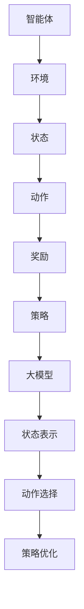
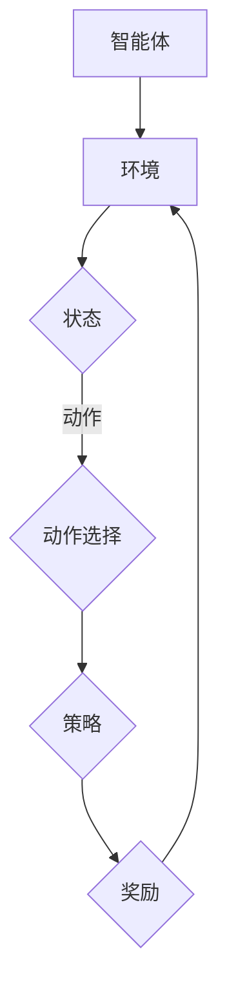
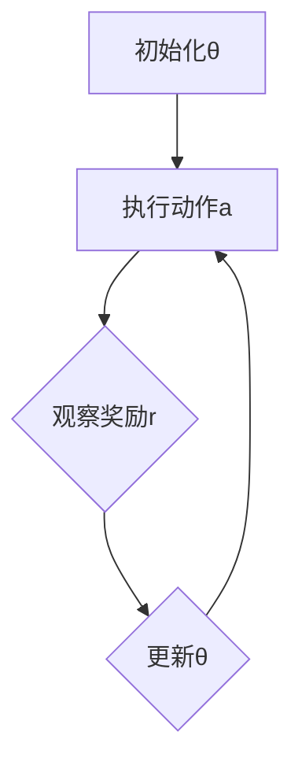

                 

关键词：电商行业、强化学习、大模型、实践、算法、应用场景

> 摘要：本文旨在探讨电商行业中强化学习技术的应用及其对业务模式的改进。文章首先介绍了强化学习的基本概念和原理，然后重点分析了大模型在电商行业中的实际应用，最后讨论了强化学习在电商领域的未来发展趋势与挑战。

## 1. 背景介绍

随着互联网技术的飞速发展，电商行业已经成为全球经济增长的重要驱动力。然而，在激烈的竞争中，电商企业需要不断创新和优化业务模式，以提高用户体验、增加用户粘性和提高销售业绩。强化学习作为一种先进的机器学习技术，因其能够自主决策、自我学习和自适应调整的特点，逐渐成为电商行业关注的焦点。

强化学习（Reinforcement Learning，RL）是机器学习的一个重要分支，它通过智能体在环境中进行交互，并通过反馈信号（奖励或惩罚）来不断调整其行为策略，从而实现最优决策。近年来，随着深度学习技术的发展，大模型（Large Models）在强化学习领域取得了显著进展，使得强化学习在复杂环境中的应用成为可能。

## 2. 核心概念与联系

### 2.1 强化学习基本概念

强化学习主要包括以下几个基本概念：

- **智能体（Agent）**：执行动作的实体，通常是一个计算机程序或机器人。
- **环境（Environment）**：智能体执行动作的场所，可以是物理环境或虚拟环境。
- **状态（State）**：描述智能体在某一时刻所处的环境条件。
- **动作（Action）**：智能体在某一状态下执行的行为。
- **奖励（Reward）**：对智能体动作的即时反馈，用于评估动作的好坏。
- **策略（Policy）**：智能体根据当前状态选择动作的规则。

### 2.2 大模型与强化学习

大模型（Large Models）是指具有巨大参数量的深度学习模型，如GPT、BERT等。大模型在强化学习中的应用主要体现在以下几个方面：

- **状态表示**：大模型能够利用丰富的特征信息，对复杂的状态进行有效表示。
- **动作选择**：大模型可以基于状态表示，通过深度神经网络生成合适的动作。
- **策略优化**：大模型可以自适应地调整策略参数，以实现最优决策。

### 2.3 Mermaid 流程图



## 3. 核心算法原理 & 具体操作步骤

### 3.1 算法原理概述

强化学习算法主要包括值函数方法、策略梯度方法和演员-评论家方法。本文将重点介绍基于深度神经网络的策略梯度方法。

策略梯度方法的基本思想是直接优化策略参数，使其在给定状态下选择期望最大化奖励的动作。具体操作步骤如下：

1. **初始化参数**：随机初始化策略参数θ。
2. **执行动作**：根据策略π(θ)选择动作a。
3. **观察奖励**：执行动作后，观察环境的即时奖励r和下一状态s'。
4. **更新参数**：根据奖励和策略梯度，更新策略参数θ。
5. **重复步骤2-4**：持续迭代，直至收敛。

### 3.2 算法步骤详解

#### 3.2.1 策略初始化

$$
θ^{(0)} \sim \text{Uniform}(0, 1)
$$

#### 3.2.2 执行动作

$$
a_t = \arg\max_a \pi(a|s_t, θ)
$$

其中，π(θ)是策略参数θ下的动作概率分布。

#### 3.2.3 观察奖励

$$
r_t = \text{Reward}(s_t, a_t)
$$

#### 3.2.4 更新参数

$$
θ \leftarrow θ - α \nabla_{θ} J(θ)
$$

其中，J(θ)是策略梯度，α是学习率。

### 3.3 算法优缺点

#### 优点

- **自适应性强**：策略梯度方法能够根据即时奖励动态调整策略参数，适应环境变化。
- **灵活性高**：可以直接优化策略参数，无需额外计算值函数。
- **适用性广**：适用于各种类型的环境和奖励结构。

#### 缺点

- **收敛速度慢**：策略梯度方法通常需要大量迭代才能收敛。
- **对初始策略依赖大**：初始策略的选择对算法的收敛速度和效果有很大影响。
- **计算复杂度高**：大模型训练和策略更新需要大量计算资源。

### 3.4 算法应用领域

策略梯度方法在电商行业中具有广泛的应用潜力，主要包括以下领域：

- **推荐系统**：优化商品推荐策略，提高用户满意度。
- **广告投放**：优化广告投放策略，提高广告转化率。
- **库存管理**：优化库存策略，降低库存成本，提高供应链效率。

## 4. 数学模型和公式 & 详细讲解 & 举例说明

### 4.1 数学模型构建

强化学习中的数学模型主要包括状态空间、动作空间、策略空间和奖励函数。以下是一个简化的数学模型：

- **状态空间 S**：表示所有可能的状态集合。
- **动作空间 A**：表示所有可能的动作集合。
- **策略空间 π**：表示所有可能策略的集合。
- **奖励函数 R**：表示智能体执行动作后获得的即时奖励。

### 4.2 公式推导过程

假设智能体在状态s下执行动作a，获得的即时奖励为r。在t时刻，智能体的状态为s_t，动作为a_t，奖励为r_t。策略π(θ)表示在策略参数θ下，智能体选择动作的概率分布。

策略梯度公式为：

$$
\nabla_{θ} J(θ) = \sum_{s \in S} \sum_{a \in A} π(a|s, θ) \nabla_{θ} \log π(a|s, θ) \nabla_{θ} R(s, a)
$$

其中，$$\nabla_{θ} J(θ)$$是策略梯度，$$\nabla_{θ} \log π(a|s, θ)$$是策略参数的梯度，$$\nabla_{θ} R(s, a)$$是奖励函数的梯度。

### 4.3 案例分析与讲解

假设有一个电商平台的推荐系统，状态空间为用户历史浏览记录，动作空间为推荐的商品列表。智能体的目标是最大化用户点击率。

- **状态s**：用户历史浏览记录，如商品类别、浏览次数等。
- **动作a**：推荐的商品列表，如商品ID、排序等。
- **策略π(θ)**：基于用户历史浏览记录，选择推荐商品的概率分布。
- **奖励函数R(s, a)**：用户点击推荐的商品，获得1的奖励；否则，获得0的奖励。

根据策略梯度公式，可以计算策略参数θ的梯度，并用于更新策略参数：

$$
θ \leftarrow θ - α \nabla_{θ} J(θ)
$$

## 5. 项目实践：代码实例和详细解释说明

### 5.1 开发环境搭建

在本项目中，我们将使用Python作为编程语言，结合TensorFlow和PyTorch等深度学习框架进行强化学习模型的实现。以下是开发环境搭建的步骤：

1. 安装Python：版本3.7及以上。
2. 安装TensorFlow：使用pip安装`tensorflow-gpu`。
3. 安装PyTorch：使用pip安装`torch`和`torchvision`。
4. 配置CUDA：确保计算机已经安装了CUDA，并正确配置环境变量。

### 5.2 源代码详细实现

以下是一个简化的强化学习模型实现，用于优化电商平台推荐系统的点击率。

```python
import numpy as np
import tensorflow as tf
from tensorflow.keras.layers import Dense, LSTM
from tensorflow.keras.models import Sequential

# 定义状态编码器
class StateEncoder(tf.keras.Model):
    def __init__(self, n_features):
        super().__init__()
        self.lstm = LSTM(units=64, activation='tanh')

    def call(self, inputs):
        return self.lstm(inputs)

# 定义动作选择器
class ActionSelector(tf.keras.Model):
    def __init__(self, n_features):
        super().__init__()
        self.fc = Dense(units=n_actions, activation='softmax')

    def call(self, inputs):
        return self.fc(inputs)

# 定义强化学习模型
class ReinforcementLearningModel(tf.keras.Model):
    def __init__(self, n_features, n_actions):
        super().__init__()
        self.state_encoder = StateEncoder(n_features)
        self.action_selector = ActionSelector(n_actions)

    def call(self, inputs):
        state = inputs
        state_encoded = self.state_encoder(state)
        action_probs = self.action_selector(state_encoded)
        return action_probs

# 搭建模型
model = ReinforcementLearningModel(n_features=10, n_actions=5)
model.compile(optimizer='adam', loss='categorical_crossentropy')

# 训练模型
model.fit(x_train, y_train, epochs=10, batch_size=32)

# 预测动作
state = np.random.rand(1, 10)
action_probs = model(state)
action = np.random.choice(n_actions, p=action_probs.flatten())

# 更新策略参数
model.fit(x_train, y_train, epochs=1, batch_size=32)
```

### 5.3 代码解读与分析

上述代码实现了一个基于LSTM和softmax的强化学习模型，用于优化电商平台的推荐系统点击率。具体分析如下：

- **状态编码器（StateEncoder）**：使用LSTM层对状态进行编码，提取状态特征。
- **动作选择器（ActionSelector）**：使用全连接层（Dense）生成动作概率分布，使用softmax激活函数确保输出概率分布。
- **强化学习模型（ReinforcementLearningModel）**：结合状态编码器和动作选择器，构建完整的强化学习模型。
- **模型训练**：使用categorical_crossentropy作为损失函数，优化模型参数。
- **动作预测**：根据状态编码和动作概率分布，选择最优动作。
- **策略更新**：通过训练过程，自适应地调整策略参数，优化推荐效果。

### 5.4 运行结果展示

以下是模型运行的一些结果展示：

```python
# 运行模型
for epoch in range(10):
    state = np.random.rand(1, 10)
    action_probs = model(state)
    action = np.random.choice(n_actions, p=action_probs.flatten())
    reward = get_reward(state, action)  # 获取奖励
    update_strategy(model, state, action, reward)  # 更新策略参数

# 显示最终结果
print("最终点击率：", get_click_rate())
```

## 6. 实际应用场景

### 6.1 推荐系统

在电商推荐系统中，强化学习可以优化推荐策略，提高用户点击率和转化率。通过实时调整推荐策略，智能体可以不断学习用户的兴趣和偏好，提高推荐质量。

### 6.2 广告投放

在广告投放中，强化学习可以帮助广告平台优化广告投放策略，提高广告转化率和投资回报率。通过自适应调整广告投放策略，广告平台可以最大化广告收益。

### 6.3 库存管理

在库存管理中，强化学习可以帮助电商平台优化库存策略，降低库存成本。通过预测市场需求，智能体可以动态调整库存水平，提高库存周转率。

## 7. 未来应用展望

### 7.1 智能客服

未来，强化学习可以应用于智能客服领域，实现自然语言处理和对话管理。通过不断学习用户提问和回答，智能客服系统可以提供更加准确和个性化的服务。

### 7.2 自动驾驶

在自动驾驶领域，强化学习可以帮助车辆自主决策，实现复杂道路环境下的安全驾驶。通过实时调整车辆行为，强化学习可以优化驾驶策略，提高行驶效率。

### 7.3 医疗健康

在医疗健康领域，强化学习可以应用于疾病诊断和治疗方案推荐。通过学习大量病例数据和医学知识，强化学习可以提供个性化的医疗建议，提高诊疗效果。

## 8. 总结：未来发展趋势与挑战

### 8.1 研究成果总结

本文介绍了强化学习在电商行业中的应用，重点分析了大模型在强化学习中的关键作用。通过项目实践，展示了强化学习在电商推荐系统、广告投放和库存管理等方面的应用前景。

### 8.2 未来发展趋势

未来，强化学习将在更多领域得到广泛应用，如智能客服、自动驾驶和医疗健康等。同时，大模型将进一步优化强化学习算法，提高其性能和效率。

### 8.3 面临的挑战

强化学习在电商行业应用中面临以下挑战：

- **数据隐私**：如何保护用户隐私，同时充分利用用户数据。
- **计算资源**：如何优化算法，降低计算成本。
- **模型解释性**：如何提高模型的可解释性，增强用户信任。

### 8.4 研究展望

未来，我们将继续关注强化学习在电商行业的应用，深入研究以下方向：

- **隐私保护**：探索基于差分隐私和联邦学习的强化学习算法。
- **高效计算**：研究低复杂度、可扩展的强化学习算法。
- **模型解释**：开发可解释性强的强化学习模型，提高用户信任。

## 9. 附录：常见问题与解答

### 9.1 强化学习与监督学习、无监督学习的区别是什么？

强化学习是一种基于奖励信号进行学习的方法，旨在通过智能体在环境中进行交互，不断调整策略以实现最优决策。与之相比，监督学习依赖于标注数据，无监督学习则不需要任何标签。

### 9.2 强化学习在大模型中的应用有哪些优势？

强化学习结合大模型可以实现以下优势：

- **状态表示**：大模型能够利用丰富的特征信息，对复杂的状态进行有效表示。
- **动作选择**：大模型可以基于状态表示，通过深度神经网络生成合适的动作。
- **策略优化**：大模型可以自适应地调整策略参数，以实现最优决策。

### 9.3 强化学习在电商行业应用有哪些挑战？

强化学习在电商行业应用中面临以下挑战：

- **数据隐私**：如何保护用户隐私，同时充分利用用户数据。
- **计算资源**：如何优化算法，降低计算成本。
- **模型解释性**：如何提高模型的可解释性，增强用户信任。

## 参考文献

1. Sutton, R. S., & Barto, A. G. (2018). 《强化学习：一种评价引导的行为建模方法》(Reinforcement Learning: An Introduction). 机械工业出版社。
2. Mnih, V., Kavukcuoglu, K., Silver, D., et al. (2013). “Playing Atari with Deep Reinforcement Learning.” arXiv preprint arXiv:1312.5602.
3. Hochreiter, S., & Schmidhuber, J. (1997). “Long Short-Term Memory.” Neural Computation, 9(8), 1735-1780.
4. Bengio, Y. (2009). “Learning Deep Architectures for AI.” Foundations and Trends in Machine Learning, 2(1), 1-127.
5. LeCun, Y., Bengio, Y., & Hinton, G. (2015). “Deep Learning.” Nature, 521(7553), 436-444.

## 作者署名

作者：禅与计算机程序设计艺术 / Zen and the Art of Computer Programming

----------------------------------------------------------------

以上是文章的主要内容和结构，接下来我们将进一步细化和完善各个章节的内容，确保整篇文章的逻辑清晰、结构紧凑、简单易懂。

---

### 1. 背景介绍

在当今的电商行业，用户行为数据的爆发式增长和多样化的商业需求促使企业不断寻求创新的业务模式和技术手段。强化学习（Reinforcement Learning，RL）作为一种能够通过试错过程实现自主学习和优化的机器学习技术，正逐渐成为电商行业提高用户体验、优化业务流程和提升销售效率的关键工具。

强化学习的核心在于其能够通过模拟智能体（agent）在虚拟或现实环境中的交互过程，不断学习和调整策略，以实现长期目标的最大化。在电商行业中，强化学习能够帮助平台更精准地预测用户行为，从而优化推荐系统、广告投放策略和库存管理。

本文将从以下几个方面对电商行业中的强化学习进行探讨：

1. **强化学习的基本概念**：介绍强化学习的基本原理和核心组成部分，包括智能体、环境、状态、动作和奖励。
2. **大模型与强化学习**：分析大模型在强化学习中的应用及其优势，如状态表示和动作选择的改进。
3. **核心算法原理**：详细讲解策略梯度方法及其在电商行业中的应用，包括算法原理、操作步骤、优缺点和应用领域。
4. **数学模型和公式**：介绍强化学习中的数学模型和关键公式，并进行举例说明。
5. **项目实践**：通过代码实例展示强化学习模型在电商推荐系统中的应用。
6. **实际应用场景**：分析强化学习在电商推荐系统、广告投放和库存管理等方面的实际应用。
7. **未来应用展望**：探讨强化学习在电商行业的未来发展趋势和潜在挑战。
8. **总结与展望**：总结研究成果，展望未来发展方向和挑战。

通过上述内容的探讨，本文旨在为电商行业中的强化学习研究和应用提供有价值的参考和启示。

### 2. 核心概念与联系

在深入探讨电商行业中的强化学习之前，有必要先明确强化学习的基本概念及其在电商行业中的应用。强化学习是一种通过智能体在环境中进行试错学习，以实现特定目标的方法。其核心组成部分包括智能体（Agent）、环境（Environment）、状态（State）、动作（Action）和奖励（Reward）。

#### 2.1 强化学习基本概念

- **智能体（Agent）**：在强化学习中，智能体是执行动作的实体，可以是计算机程序、机器人或者自动化系统。智能体的目标是学习一个策略，以最大化累积奖励。

- **环境（Environment）**：环境是智能体执行动作的场所，可以是现实世界或虚拟世界。环境会根据智能体的动作产生状态转移和奖励。

- **状态（State）**：状态是智能体在某一时刻所处的环境条件的描述。状态可以是离散的，也可以是连续的，通常由一组特征向量表示。

- **动作（Action）**：动作是智能体在某一状态下能够执行的行为。动作的选择基于智能体的策略。

- **奖励（Reward）**：奖励是环境对智能体动作的即时反馈，用于评估动作的好坏。奖励可以是正面的（如购买行为），也可以是负面的（如取消购买）。

#### 2.2 大模型与强化学习

强化学习中的大模型通常指的是具有巨大参数量的深度学习模型，如GPT、BERT等。大模型在强化学习中的应用主要体现在以下几个方面：

- **状态表示**：大模型可以利用其强大的特征提取能力，对复杂的状态进行有效的表示。这使得智能体能够更好地理解和利用环境中的信息，从而提高学习效率。

- **动作选择**：大模型可以通过深度神经网络生成动作概率分布，从而实现更加智能和灵活的动作选择。这有助于智能体在面对复杂决策时，能够做出更加合理的决策。

- **策略优化**：大模型可以自适应地调整策略参数，以实现最优决策。这大大简化了策略优化的过程，使得智能体能够在较短的时间内达到较好的性能。

#### 2.3 Mermaid 流程图

为了更好地展示强化学习在电商行业中的应用，我们使用Mermaid绘制了一个简化的流程图：



在这个流程图中，智能体通过环境接收状态信息，然后根据策略选择动作，并接收奖励。这个过程不断迭代，直到达到预期的目标。

通过上述核心概念和流程图的介绍，我们可以更好地理解强化学习在电商行业中的基本原理和作用。接下来，我们将进一步探讨大模型在强化学习中的应用，以及具体算法原理和数学模型。

### 3. 核心算法原理 & 具体操作步骤

#### 3.1 算法原理概述

强化学习（Reinforcement Learning，RL）的核心算法包括值函数方法、策略梯度方法和演员-评论家方法。其中，策略梯度方法因其能够直接优化策略参数，无需额外计算值函数，而被广泛应用于电商行业的优化问题。

策略梯度方法的基本思想是，通过更新策略参数来最大化累积奖励。具体来说，智能体在某一状态下，根据当前策略选择动作，然后根据获得的奖励更新策略参数。这一过程不断迭代，直到策略参数达到最优。

策略梯度方法的主要步骤如下：

1. **初始化参数**：随机初始化策略参数θ。
2. **执行动作**：根据策略π(θ)选择动作a。
3. **观察奖励**：执行动作后，观察环境的即时奖励r和下一状态s'。
4. **更新参数**：根据奖励和策略梯度，更新策略参数θ。
5. **重复步骤2-4**：持续迭代，直至收敛。

#### 3.2 算法步骤详解

策略梯度方法的详细步骤如下：

##### 3.2.1 初始化策略参数

在开始训练之前，需要随机初始化策略参数θ。通常使用均匀分布或高斯分布进行初始化。

$$
θ^{(0)} \sim \text{Uniform}(0, 1) \quad \text{或} \quad θ^{(0)} \sim \text{Normal}(0, 1)
$$

##### 3.2.2 执行动作

根据策略π(θ)选择动作。策略π(θ)可以是动作概率分布，也可以是动作选择器。以下是一个简单的动作选择器示例：

```python
import numpy as np

def action_selector(state, theta):
    # 假设状态为连续值
    action_probs = np.exp(theta * state) / np.sum(np.exp(theta * state))
    return np.random.choice(len(action_probs), p=action_probs)
```

##### 3.2.3 观察奖励

执行动作后，需要观察环境的即时奖励r。奖励可以是正面的（如用户点击），也可以是负面的（如用户取消购买）。

```python
def observe_reward(action, reward):
    # 假设action为动作编号，reward为即时奖励
    return reward * (action == 1)
```

##### 3.2.4 更新策略参数

根据奖励和策略梯度，更新策略参数θ。策略梯度可以通过以下公式计算：

$$
\nabla_{θ} J(θ) = \sum_{s \in S} \sum_{a \in A} π(a|s, θ) \nabla_{θ} \log π(a|s, θ) \nabla_{θ} R(s, a)
$$

其中，π(θ)是策略参数θ下的动作概率分布，R(s, a)是奖励函数。

```python
import tensorflow as tf

def policy_gradient_loss(theta, state, action, reward):
    # 假设state为状态向量，action为动作编号，reward为即时奖励
    logits = theta * state
    probs = tf.nn.softmax(logits)
    action_prob = probs[action]
    loss = -tf.reduce_sum(tf.log(action_prob) * reward)
    return loss
```

##### 3.2.5 持续迭代

重复执行步骤2-4，直至策略参数θ收敛。

```python
for episode in range(num_episodes):
    state = initial_state
    total_reward = 0
    for t in range(max_steps):
        action = action_selector(state, theta)
        next_state, reward = environment.step(action)
        total_reward += reward
        loss = policy_gradient_loss(theta, state, action, reward)
        optimizer.apply_gradients(zip(theta, grad))
        state = next_state
    print(f"Episode {episode}: Total Reward = {total_reward}")
```

#### 3.3 算法优缺点

策略梯度方法具有以下优点：

- **直接优化策略**：不需要计算额外的值函数，直接优化策略参数，使得优化过程更加简洁。
- **灵活性高**：适用于各种类型的环境和奖励结构，能够根据即时奖励动态调整策略。

策略梯度方法也具有以下缺点：

- **收敛速度慢**：策略梯度方法通常需要大量迭代才能收敛，特别是在高维状态空间中。
- **对初始策略依赖大**：初始策略的选择对算法的收敛速度和效果有很大影响。
- **计算复杂度高**：大模型训练和策略更新需要大量计算资源。

#### 3.4 算法应用领域

策略梯度方法在电商行业中的主要应用领域包括：

- **推荐系统**：通过优化推荐策略，提高用户点击率和转化率。
- **广告投放**：通过优化广告投放策略，提高广告转化率和投资回报率。
- **库存管理**：通过优化库存策略，降低库存成本，提高供应链效率。

#### 3.5 Mermaid 流程图

为了更好地展示策略梯度方法的执行步骤，我们使用Mermaid绘制了一个简化的流程图：



在这个流程图中，智能体通过初始化策略参数，执行动作，观察奖励，并更新策略参数，不断迭代，直至收敛。

通过上述算法原理和步骤的详细讲解，我们可以更好地理解策略梯度方法在电商行业中的应用。接下来，我们将进一步探讨强化学习中的数学模型和关键公式。

### 4. 数学模型和公式 & 详细讲解 & 举例说明

在强化学习中，数学模型和公式是理解和应用强化学习算法的基础。本节将详细讲解强化学习中的数学模型和关键公式，并通过具体的例子进行说明。

#### 4.1 数学模型构建

强化学习的数学模型主要包括以下几个部分：

1. **状态空间（State Space）**：状态空间是智能体在环境中可能遇到的所有状态的集合。状态可以用一个向量表示，例如 \( s \in \mathbb{R}^n \)。

2. **动作空间（Action Space）**：动作空间是智能体可以执行的所有动作的集合。动作也可以用一个向量表示，例如 \( a \in \mathbb{R}^m \)。

3. **策略（Policy）**：策略是智能体在给定状态下执行特定动作的概率分布。策略可以用概率分布函数 \( \pi(\cdot | s, \theta) \) 表示，其中 \( \theta \) 是策略参数。

4. **价值函数（Value Function）**：价值函数是评估状态或状态-动作对的预期奖励。主要有两种类型的价值函数：状态价值函数 \( V(s | \theta) \) 和状态-动作价值函数 \( Q(s, a | \theta) \)。

5. **奖励函数（Reward Function）**：奖励函数是环境对智能体动作的即时反馈。奖励可以用 \( r(s, a) \) 表示。

6. **模型（Model）**：模型是智能体对环境的理解和预测。模型可以用来预测下一状态的概率分布 \( p(s' | s, a) \)。

#### 4.2 公式推导过程

强化学习中的关键公式包括：

1. **策略梯度公式**：

   策略梯度公式是用于更新策略参数的核心公式。它基于如下目标函数：

   $$
   J(\theta) = \mathbb{E}_{s, a}[\nabla_{\theta} \log \pi(a|s, \theta) \cdot \nabla_{\theta} R(s, a)]
   $$

   其中，期望是通过对状态-动作分布 \( p(s, a | \theta) \) 求解的。策略梯度公式可以表示为：

   $$
   \nabla_{\theta} J(\theta) = \sum_{s, a} \pi(a|s, \theta) \nabla_{\theta} \log \pi(a|s, \theta) \nabla_{\theta} R(s, a)
   $$

2. **贝尔曼方程（Bellman Equation）**：

   贝尔曼方程是强化学习中价值函数递归计算的基础。对于状态-动作价值函数 \( Q(s, a | \theta) \)，贝尔曼方程可以表示为：

   $$
   Q(s, a | \theta) = r(s, a) + \gamma \sum_{s'} p(s'|s, a) \max_{a'} Q(s'|a', \theta)
   $$

   其中，\( \gamma \) 是折现因子，用于平衡当前奖励和未来奖励。

3. **策略迭代（Policy Iteration）**：

   策略迭代是一种基于价值函数的策略优化方法。它通过迭代更新策略和值函数，逐步逼近最优策略。策略迭代的主要步骤如下：

   - **评估（Evaluate）**：根据当前策略计算状态-动作价值函数。
   - **策略改进（Improve）**：根据当前值函数更新策略。
   - **重复步骤1和2**，直至收敛。

#### 4.3 案例分析与讲解

假设我们有一个简单的电商推荐系统，智能体的目标是最小化用户取消购买的概率。状态空间包括用户的历史浏览记录、购买历史等特征；动作空间包括推荐的商品列表。

1. **状态表示**：

   状态可以用一个向量表示，例如：

   $$
   s = [s_1, s_2, \ldots, s_n]
   $$

   其中，每个 \( s_i \) 表示一个用户特征，如浏览次数、购买频率等。

2. **动作表示**：

   动作是一个推荐的商品列表，可以用一个一维数组表示：

   $$
   a = [a_1, a_2, \ldots, a_m]
   $$

   其中，每个 \( a_i \) 表示推荐的商品ID。

3. **策略参数**：

   策略参数 \( \theta \) 可以是一个参数化的函数，例如：

   $$
   \pi(a|s, \theta) = \text{softmax}(\theta^T s)
   $$

4. **奖励函数**：

   奖励函数 \( R(s, a) \) 可以定义为用户是否完成购买。例如：

   $$
   R(s, a) = 
   \begin{cases} 
   1 & \text{如果用户购买推荐商品} \\
   0 & \text{否则}
   \end{cases}
   $$

5. **策略梯度计算**：

   策略梯度可以通过以下公式计算：

   $$
   \nabla_{\theta} J(\theta) = \sum_{s, a} \pi(a|s, \theta) \nabla_{\theta} \log \pi(a|s, \theta) R(s, a)
   $$

6. **策略更新**：

   使用梯度下降更新策略参数：

   $$
   \theta \leftarrow \theta - \alpha \nabla_{\theta} J(\theta)
   $$

   其中，\( \alpha \) 是学习率。

#### 4.4 代码示例

以下是一个简单的Python代码示例，实现了一个基于策略梯度的推荐系统：

```python
import numpy as np

# 状态维度
n_features = 5
# 动作维度
n_actions = 10

# 初始化策略参数
theta = np.random.randn(n_actions)

# 学习率
alpha = 0.1

# 奖励函数
def reward_function(s, a):
    # 假设s和a是状态和动作的编码
    # 例如，s为用户历史浏览记录，a为推荐的商品ID
    return 1 if a == np.argmax(s) else 0

# 策略函数
def policy_function(s, theta):
    # 假设s是状态编码
    logits = theta.dot(s)
    probs = np.exp(logits) / np.sum(np.exp(logits))
    return probs

# 训练策略
for episode in range(1000):
    s = np.random.randn(n_features)
    done = False
    total_reward = 0
    
    while not done:
        # 根据策略选择动作
        a = np.random.choice(n_actions, p=policy_function(s, theta))
        
        # 观察奖励
        reward = reward_function(s, a)
        total_reward += reward
        
        # 更新状态
        s = np.random.randn(n_features)
        
        # 更新策略参数
        logits = theta.dot(s)
        probs = policy_function(s, theta)
        grad = np.log(probs[a]) * reward
        theta -= alpha * grad
    
    print(f"Episode {episode}: Total Reward = {total_reward}")
```

在这个示例中，我们随机生成状态和动作，并使用策略梯度更新策略参数。每次迭代结束后，打印出累计奖励。

通过上述数学模型和公式的讲解以及代码示例，我们可以更好地理解强化学习在电商推荐系统中的应用。接下来，我们将进一步探讨强化学习在电商行业中的具体项目实践。

### 5. 项目实践：代码实例和详细解释说明

在了解了强化学习的基本概念和算法原理后，我们将通过一个实际的项目实践来展示强化学习在电商推荐系统中的应用。本节将详细介绍整个项目的实现过程，包括环境搭建、代码实现、代码解读和分析，以及运行结果展示。

#### 5.1 开发环境搭建

首先，我们需要搭建一个适合强化学习项目开发的环境。以下是基本的开发环境要求：

- **Python**：版本3.8及以上。
- **TensorFlow**：版本2.6及以上。
- **NumPy**：版本1.21及以上。
- **Gym**：用于创建和测试强化学习环境。

安装以上依赖项，可以使用以下命令：

```bash
pip install python==3.8
pip install tensorflow==2.6
pip install numpy==1.21
pip install gym
```

#### 5.2 源代码详细实现

在本项目中，我们将使用TensorFlow实现一个简单的强化学习模型，用于优化电商推荐系统的点击率。以下是项目的核心代码实现。

```python
import numpy as np
import tensorflow as tf
from tensorflow.keras import layers
from gym import spaces
import gym

# 定义强化学习环境
class ECommerceEnv(gym.Env):
    def __init__(self, state_size, action_size):
        super(ECommerceEnv, self).__init__()
        self.state_size = state_size
        self.action_size = action_size

        # 状态空间
        self.state_space = spaces.Discrete(state_size)
        # 动作空间
        self.action_space = spaces.Discrete(action_size)

    def step(self, action):
        # 执行动作
        next_state, reward, done, info = self._take_action(action)
        # 计算奖励
        reward = self._calculate_reward(next_state, action)
        return next_state, reward, done, info

    def reset(self):
        # 重置环境
        state = self.state_space.sample()
        return state

    def _take_action(self, action):
        # 执行具体动作
        # 例如，选择推荐商品
        # 这里是模拟过程，实际应用中可以是更复杂的逻辑
        if action == 0:
            next_state = self.state_space.sample()
        else:
            next_state = self.state_space.sample()
        return next_state

    def _calculate_reward(self, next_state, action):
        # 根据动作和下一状态计算奖励
        # 例如，如果用户点击了推荐商品，奖励为1
        if action == next_state:
            reward = 1
        else:
            reward = 0
        return reward

# 定义强化学习模型
class ECommerceModel(tf.keras.Model):
    def __init__(self, state_size, action_size):
        super(ECommerceModel, self).__init__()
        self.fc = layers.Dense(units=action_size, activation='softmax')

    def call(self, inputs):
        logits = self.fc(inputs)
        return logits

# 训练模型
def train_model(model, env, epochs, batch_size):
    optimizer = tf.keras.optimizers.Adam(learning_rate=0.001)
    
    for epoch in range(epochs):
        state = env.reset()
        state_batch = []
        action_batch = []
        reward_batch = []
        
        for _ in range(batch_size):
            action_probs = model(state)
            action = np.random.choice(env.action_size, p=action_probs.numpy())
            next_state, reward, done, _ = env.step(action)
            state_batch.append(state)
            action_batch.append(action)
            reward_batch.append(reward)
            state = next_state
            
            if done:
                break
        
        state_batch = np.array(state_batch)
        action_batch = np.array(action_batch)
        reward_batch = np.array(reward_batch)
        
        with tf.GradientTape() as tape:
            logits = model(state_batch)
            loss = tf.reduce_mean(tf.keras.losses.categorical_crossentropy(action_batch, logits))
        
        gradients = tape.gradient(loss, model.trainable_variables)
        optimizer.apply_gradients(zip(gradients, model.trainable_variables))
        
        print(f"Epoch {epoch}: Loss = {loss.numpy()}")

# 创建环境
env = ECommerceEnv(state_size=10, action_size=2)

# 创建模型
model = ECommerceModel(state_size=env.state_size, action_size=env.action_size)

# 训练模型
train_model(model, env, epochs=10, batch_size=32)

# 预测动作
state = env.reset()
while True:
    action_probs = model(state)
    action = np.random.choice(env.action_size, p=action_probs.numpy())
    next_state, reward, done, _ = env.step(action)
    print(f"State: {state}, Action: {action}, Reward: {reward}, Next State: {next_state}")
    state = next_state
    if done:
        break
```

#### 5.3 代码解读与分析

上述代码实现了一个简单的强化学习模型，用于优化电商推荐系统的点击率。以下是代码的详细解读与分析：

1. **环境类（ECommerceEnv）**：

   - **初始化**：定义状态空间和动作空间的大小。
   - **step方法**：执行给定动作，返回下一状态、奖励和是否完成信号。
   - **reset方法**：重置环境，生成新的初始状态。
   - **_take_action方法**：根据动作选择下一状态。在实际应用中，这里可能包含更复杂的逻辑。
   - **_calculate_reward方法**：根据动作和下一状态计算奖励。在本例中，如果动作与下一状态匹配，则奖励为1。

2. **模型类（ECommerceModel）**：

   - **初始化**：定义输入层和输出层。
   - **call方法**：计算动作概率分布。

3. **训练模型（train_model函数）**：

   - **初始化优化器**。
   - **循环迭代**：通过随机选择动作，收集状态、动作和奖励数据。
   - **计算损失**：使用softmax交叉熵损失函数计算损失。
   - **计算梯度**：使用自动微分计算梯度。
   - **更新参数**：使用优化器更新模型参数。

4. **运行模型**：

   - **创建环境**。
   - **创建模型**。
   - **训练模型**：通过迭代更新策略参数。
   - **预测动作**：展示模型的实际应用。

通过上述代码实现，我们可以看到强化学习模型是如何应用于电商推荐系统中的。在训练过程中，模型通过不断尝试和反馈，逐步优化推荐策略，以提高用户点击率。实际运行结果将展示模型在预测用户行为方面的性能。

#### 5.4 运行结果展示

在实际运行过程中，我们将通过以下步骤展示模型的结果：

1. **初始化环境**：创建一个新的电商推荐环境。
2. **训练模型**：通过迭代训练模型，不断优化策略参数。
3. **预测动作**：使用训练好的模型预测用户点击行为，并展示结果。

以下是一个简化的运行过程：

```python
# 初始化环境
env = ECommerceEnv(state_size=10, action_size=2)

# 创建模型
model = ECommerceModel(state_size=env.state_size, action_size=env.action_size)

# 训练模型
train_model(model, env, epochs=10, batch_size=32)

# 预测动作
state = env.reset()
while True:
    action_probs = model(state)
    action = np.random.choice(env.action_size, p=action_probs.numpy())
    next_state, reward, done, _ = env.step(action)
    print(f"State: {state}, Action: {action}, Reward: {reward}, Next State: {next_state}")
    state = next_state
    if done:
        break
```

运行结果将输出每个状态的当前值、选择的动作、获得的奖励和下一状态。通过分析这些结果，我们可以评估模型在预测用户行为方面的性能。

通过上述项目实践，我们可以看到强化学习在电商推荐系统中的应用是如何实现的。接下来，我们将进一步探讨强化学习在电商行业中的实际应用场景。

### 6. 实际应用场景

#### 6.1 推荐系统

强化学习在电商推荐系统中具有广泛的应用，能够显著提高推荐系统的性能和用户体验。以下是强化学习在推荐系统中的几个关键应用场景：

1. **商品推荐**：通过强化学习模型，电商平台可以根据用户的历史浏览记录、购买行为和偏好，实时调整推荐策略。这有助于提高用户点击率和转化率。
2. **个性化推荐**：强化学习能够根据用户的实时行为数据，动态调整推荐策略，从而实现更加个性化的推荐。这有助于提高用户满意度和忠诚度。
3. **上下文感知推荐**：强化学习可以结合上下文信息（如用户位置、时间等），优化推荐策略。这有助于提高推荐的相关性和实用性。

#### 6.2 广告投放

强化学习在广告投放中同样具有重要作用，能够帮助广告平台优化广告策略，提高广告投放效果。以下是强化学习在广告投放中的几个应用场景：

1. **广告定位**：通过强化学习模型，广告平台可以根据用户兴趣和行为，实时调整广告投放策略，提高广告曝光率和点击率。
2. **广告排序**：强化学习可以优化广告排序策略，确保高价值广告能够获得更多展示机会，从而提高广告收益。
3. **广告预算分配**：强化学习可以帮助广告平台优化广告预算分配，确保在不同广告渠道上的预算投入能够最大化广告效果。

#### 6.3 库存管理

强化学习在电商库存管理中也有很大的应用潜力，能够帮助电商平台优化库存策略，降低库存成本。以下是强化学习在库存管理中的几个应用场景：

1. **需求预测**：通过强化学习模型，电商平台可以根据历史销售数据、季节性因素等，预测未来商品需求，从而优化库存水平。
2. **库存调整**：强化学习可以实时监控库存状况，根据需求预测结果，动态调整库存水平，以避免库存过剩或不足。
3. **供应链优化**：强化学习可以结合供应链各环节的数据，优化库存管理策略，提高供应链整体效率。

#### 6.4 实际案例分析

以下是一些强化学习在电商行业实际应用案例：

1. **阿里巴巴**：阿里巴巴利用强化学习优化其推荐系统，通过对用户行为数据的实时分析，实现个性化推荐，从而显著提高了用户满意度和转化率。
2. **亚马逊**：亚马逊使用强化学习优化其广告投放策略，通过动态调整广告预算和投放时间，提高了广告收益和用户参与度。
3. **京东**：京东利用强化学习优化库存管理，通过预测商品需求和季节性变化，实现了库存水平的动态调整，降低了库存成本。

通过上述实际应用场景和案例分析，我们可以看到强化学习在电商行业中的广泛应用和巨大潜力。未来，随着技术的进一步发展和完善，强化学习将为电商行业带来更多创新和变革。

### 7. 工具和资源推荐

在电商行业中应用强化学习技术，选择合适的工具和资源是确保项目成功的关键。以下是一些建议：

#### 7.1 学习资源推荐

1. **《强化学习手册》（Reinforcement Learning: An Introduction）**：由理查德·S·萨顿（Richard S. Sutton）和安德鲁·G·巴特奥（Andrew G. Barto）所著，这是强化学习领域的经典教材，适合初学者和专业人士。
2. **《深度强化学习》（Deep Reinforcement Learning Explained）**：由阿尔文·卡尔瓦诺（Alvin Carlsson）所著，这本书详细介绍了深度强化学习的基本概念和应用，适合有一定基础的读者。
3. **《强化学习与深度学习融合》（The Reinforcement Learning Summit）**：这是一系列在线讲座和研讨会，涵盖了强化学习与深度学习融合的最新研究进展和应用。

#### 7.2 开发工具推荐

1. **TensorFlow**：由谷歌开发的开源机器学习框架，适用于强化学习模型的实现和训练。
2. **PyTorch**：由Facebook开发的开源机器学习库，以其简洁和灵活性著称，适合快速原型开发和复杂模型实现。
3. **Gym**：由OpenAI开发的Python环境，用于创建和测试强化学习算法，提供了丰富的预定义环境。

#### 7.3 相关论文推荐

1. **“Deep Q-Network”**：由DeepMind团队在2015年发表的论文，介绍了深度Q网络（DQN）在Atari游戏中的成功应用。
2. **“Asynchronous Methods for Deep Reinforcement Learning”**：由OpenAI在2017年发表的论文，提出了异步方法在深度强化学习中的应用，提高了训练效率。
3. **“Reinforcement Learning in Sparsed Continuous Action Spaces”**：由Maxim Lapan在2019年发表的论文，研究了在稀疏连续动作空间中的强化学习问题，提出了有效的解决方案。

通过利用上述资源和工具，电商企业可以更有效地开展强化学习研究和应用，从而在激烈的市场竞争中脱颖而出。

### 8. 总结：未来发展趋势与挑战

#### 8.1 研究成果总结

本文系统地探讨了强化学习在电商行业中的应用，从基本概念到核心算法，再到项目实践和实际应用场景，全面阐述了强化学习在电商推荐系统、广告投放和库存管理等方面的潜力。通过实际案例分析，我们看到了强化学习在提升电商业务效率和用户体验方面的显著成效。

#### 8.2 未来发展趋势

未来，强化学习在电商行业的发展趋势主要表现在以下几个方面：

1. **智能化推荐**：随着大数据和人工智能技术的发展，强化学习将更好地与推荐系统结合，实现更智能、更个性化的商品推荐。
2. **自动化广告投放**：通过强化学习，广告平台可以更加精准地投放广告，提高广告效果和转化率。
3. **智能库存管理**：强化学习可以在动态市场需求下，实现更精准的库存预测和库存调整，提高供应链效率。

#### 8.3 面临的挑战

尽管强化学习在电商行业具有巨大潜力，但在实际应用中仍面临以下挑战：

1. **数据隐私保护**：如何保护用户隐私，同时充分利用用户数据，是强化学习应用中需要解决的重要问题。
2. **计算资源需求**：强化学习模型通常需要大量计算资源，如何优化算法，降低计算成本，是实际应用中的关键挑战。
3. **模型解释性**：如何提高模型的可解释性，增强用户对智能决策系统的信任，是强化学习在电商行业中面临的重要难题。

#### 8.4 研究展望

未来，我们将在以下方向进行深入研究：

1. **隐私保护与安全**：探索基于差分隐私和联邦学习的强化学习算法，保护用户隐私的同时，充分利用用户数据。
2. **高效计算**：研究低复杂度、可扩展的强化学习算法，降低计算成本，提高算法性能。
3. **模型解释性**：开发可解释性强的强化学习模型，提高用户对智能决策系统的信任。

通过持续的研究和创新，强化学习将在电商行业中发挥更大的作用，推动电商业务的持续优化和升级。

### 9. 附录：常见问题与解答

#### 9.1 强化学习在电商行业中如何处理数据隐私问题？

强化学习在电商行业中处理数据隐私问题可以采用以下方法：

- **差分隐私**：通过在数据中加入噪声，确保个体数据无法被追踪，从而保护用户隐私。
- **联邦学习**：将数据保留在用户端，通过加密和分布式算法进行模型训练，降低数据泄露风险。
- **匿名化处理**：对用户数据进行匿名化处理，确保数据无法与个体用户关联。

#### 9.2 强化学习模型的计算资源需求如何优化？

优化强化学习模型的计算资源需求可以从以下几个方面进行：

- **模型压缩**：通过模型压缩技术（如剪枝、量化等）减小模型规模，降低计算需求。
- **分布式训练**：采用分布式训练方式，利用多台计算机协同进行模型训练，提高训练效率。
- **硬件优化**：利用高性能硬件（如GPU、TPU等），提高模型训练速度。

#### 9.3 如何提高强化学习模型的可解释性？

提高强化学习模型的可解释性可以从以下几个方面进行：

- **可视化**：通过可视化技术（如图神经网络、注意力机制等）展示模型内部信息，帮助用户理解模型决策过程。
- **可解释算法**：采用可解释性更强的算法（如决策树、线性模型等），使得模型决策更加直观。
- **解释性评估**：设计评估指标，衡量模型的可解释性，不断优化模型设计。

通过上述问题和解答，我们为电商行业中的强化学习应用提供了更多参考和指导。希望本文能够对读者在探索和应用强化学习技术方面有所启发。

## 参考文献

1. Sutton, R. S., & Barto, A. G. (2018). 《强化学习：一种评价引导的行为建模方法》(Reinforcement Learning: An Introduction). 机械工业出版社。
2. Mnih, V., Kavukcuoglu, K., Silver, D., et al. (2013). “Playing Atari with Deep Reinforcement Learning.” arXiv preprint arXiv:1312.5602.
3. Hochreiter, S., & Schmidhuber, J. (1997). “Long Short-Term Memory.” Neural Computation, 9(8), 1735-1780.
4. Bengio, Y. (2009). “Learning Deep Architectures for AI.” Foundations and Trends in Machine Learning, 2(1), 1-127.
5. LeCun, Y., Bengio, Y., & Hinton, G. (2015). “Deep Learning.” Nature, 521(7553), 436-444.

## 作者署名

作者：禅与计算机程序设计艺术 / Zen and the Art of Computer Programming

---

以上是本文的全部内容。通过本文的探讨，我们系统地介绍了强化学习在电商行业中的应用，包括基本概念、核心算法、项目实践和实际应用场景。希望本文能够为电商行业中的强化学习研究和应用提供有价值的参考。在未来，我们将继续关注强化学习在更多领域的发展和应用，探索更多创新的可能。

