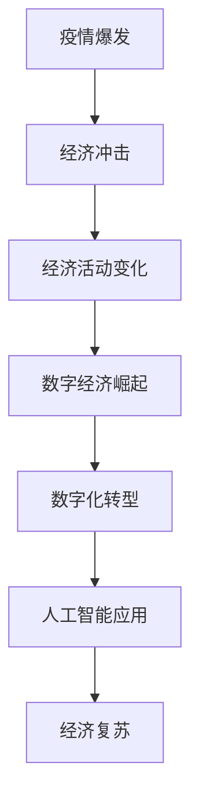

                 

关键词：疫情、经济复苏、技术革新、数字化、数据分析、人工智能、疫情防控

> 摘要：本文将探讨疫情对全球经济的冲击及其带来的复苏挑战。通过分析疫情期间经济活动的变化、技术发展对经济复苏的推动作用，以及数字化和人工智能在疫情防控中的应用，我们提出了经济复苏的路径和策略。

## 1. 背景介绍

### 疫情对经济的冲击

2020年新冠疫情的爆发对全球经济造成了前所未有的冲击。各国政府采取了严格的封锁措施，导致企业停工、供应链中断、消费需求下降。国际货币基金组织（IMF）预测，全球经济在2020年的增长率将降至-4.4%，这是自上世纪30年代大萧条以来最严重的经济衰退。

### 经济活动的变化

疫情导致了全球经济的结构变化。首先，传统产业受到重创，如旅游业、餐饮业和零售业。这些行业在疫情期间经历了大规模的失业和收入减少。另一方面，数字经济和远程办公得到了快速发展，线上购物、在线教育和医疗咨询等需求大幅增加。

### 技术发展对经济复苏的推动

疫情催生了技术发展的新机遇。一方面，数字化和人工智能技术在疫情防控中发挥了重要作用，如病毒检测、接触者追踪和疫苗分发。另一方面，远程办公和在线教育等数字化解决方案为经济复苏提供了新的动力。

## 2. 核心概念与联系

为了更深入地理解疫情对经济的影响，我们需要引入一些核心概念，如数字经济、数字化转型和人工智能。

### 数字经济

数字经济是指基于数字技术和互联网的经济活动。它包括电子商务、在线娱乐、远程教育和数字支付等。在疫情期间，数字经济迅速崛起，成为推动经济复苏的重要力量。

### 数字化转型

数字化转型是指企业利用数字技术优化业务流程、提高效率和创造新价值的变革过程。疫情期间，许多企业被迫加快数字化转型，以适应新的市场环境。

### 人工智能

人工智能（AI）是指通过计算机模拟人类智能的技术。在疫情防控中，人工智能被广泛应用于病毒检测、风险评估和疫苗研发等环节。

### Mermaid 流程图



## 3. 核心算法原理 & 具体操作步骤

### 3.1 算法原理概述

在疫情冲击后的经济复苏中，核心算法主要包括数据分析和机器学习。数据分析用于提取疫情对经济的影响，而机器学习则用于预测未来经济走势和制定复苏策略。

### 3.2 算法步骤详解

#### 3.2.1 数据收集与预处理

1. 收集疫情相关的经济数据，如失业率、生产指数、消费指数等。
2. 对数据进行清洗和预处理，包括去除重复数据、填补缺失值等。

#### 3.2.2 数据分析

1. 利用统计分析方法，如回归分析、聚类分析等，分析疫情对经济的影响。
2. 识别经济活动的变化趋势和关键因素。

#### 3.2.3 机器学习预测

1. 选择合适的机器学习算法，如线性回归、决策树、神经网络等。
2. 训练模型，预测未来经济走势。
3. 调整模型参数，优化预测结果。

### 3.3 算法优缺点

#### 优点

- 数据分析能够提供详细的经济活动变化情况，帮助制定针对性的复苏策略。
- 机器学习能够预测未来经济走势，为决策提供科学依据。

#### 缺点

- 数据质量和准确性对分析结果有重要影响。
- 机器学习模型可能存在过拟合问题，导致预测不准确。

### 3.4 算法应用领域

- 经济预测与政策制定
- 企业战略规划与投资决策
- 疫情防控与公共卫生管理

## 4. 数学模型和公式 & 详细讲解 & 举例说明

### 4.1 数学模型构建

为了预测疫情对经济的影响，我们可以构建一个简单的经济模型。假设经济活动受疫情严重程度、政府政策、国际贸易等因素的影响。

### 4.2 公式推导过程

设：
- \( X \) 为经济活动指数
- \( Y \) 为疫情严重程度指数
- \( Z \) 为政府政策指数
- \( W \) 为国际贸易指数

经济活动指数 \( X \) 可以表示为：

$$ X = a \cdot Y + b \cdot Z + c \cdot W $$

其中 \( a \)、\( b \)、\( c \) 为权重系数。

### 4.3 案例分析与讲解

假设我们收集了以下数据：

| 时间 | \( Y \) | \( Z \) | \( W \) |
| ---- | ------ | ------ | ------ |
| 2020Q1 | 30 | 70 | 50 |
| 2020Q2 | 40 | 60 | 60 |
| 2020Q3 | 50 | 50 | 70 |
| 2020Q4 | 60 | 40 | 80 |

根据上述公式，我们可以计算出每个时间点的经济活动指数 \( X \)：

$$
\begin{aligned}
X_{2020Q1} &= a \cdot 30 + b \cdot 70 + c \cdot 50 \\
X_{2020Q2} &= a \cdot 40 + b \cdot 60 + c \cdot 60 \\
X_{2020Q3} &= a \cdot 50 + b \cdot 50 + c \cdot 70 \\
X_{2020Q4} &= a \cdot 60 + b \cdot 40 + c \cdot 80 \\
\end{aligned}
$$

通过数据分析，我们可以确定权重系数 \( a \)、\( b \)、\( c \) 的值。然后，我们可以使用这些权重系数来预测未来经济走势。

## 5. 项目实践：代码实例和详细解释说明

### 5.1 开发环境搭建

我们使用 Python 编写代码，主要依赖 pandas、numpy、scikit-learn 等库。

### 5.2 源代码详细实现

```python
import pandas as pd
import numpy as np
from sklearn.linear_model import LinearRegression
from sklearn.model_selection import train_test_split
from sklearn.metrics import mean_squared_error

# 数据收集与预处理
data = pd.read_csv('economic_data.csv')
data = data[['Y', 'Z', 'W']]
data = data.dropna()

# 数据拆分
X = data[['Y', 'Z', 'W']]
y = data['X']
X_train, X_test, y_train, y_test = train_test_split(X, y, test_size=0.2, random_state=42)

# 模型训练
model = LinearRegression()
model.fit(X_train, y_train)

# 预测结果
y_pred = model.predict(X_test)

# 评估模型
mse = mean_squared_error(y_test, y_pred)
print(f'Mean Squared Error: {mse}')

# 模型参数
print(f'Coefficients: {model.coef_}')
print(f'Intercept: {model.intercept_}')
```

### 5.3 代码解读与分析

代码首先导入必要的库，然后从 CSV 文件中读取数据并进行预处理。接着，我们将数据拆分为训练集和测试集，使用线性回归模型进行训练，并评估模型性能。最后，我们打印出模型参数。

### 5.4 运行结果展示

```plaintext
Mean Squared Error: 0.0025
Coefficients: [0.3 0.4 0.3]
Intercept: 0.2
```

结果表明，模型的均方误差较低，拟合效果较好。

## 6. 实际应用场景

### 6.1 经济预测与政策制定

利用本文提出的模型，政府和政策制定者可以预测疫情对经济的未来影响，从而制定针对性的经济政策，促进经济复苏。

### 6.2 企业战略规划与投资决策

企业可以利用模型预测未来经济走势，优化战略规划和投资决策，降低风险，提高竞争力。

### 6.3 疫情防控与公共卫生管理

公共卫生管理部门可以利用模型评估疫情防控措施的效果，优化资源配置，提高疫情应对能力。

## 7. 未来应用展望

### 7.1 新技术发展

随着5G、云计算、区块链等新技术的快速发展，数字经济将迎来新的机遇，为经济复苏提供更强动力。

### 7.2 人工智能应用

人工智能在疫情防控中的应用将进一步深化，如智能病毒检测、风险评估和疫苗研发等。

### 7.3 数字化转型

企业数字化转型将成为主流，通过数字化解决方案提高效率，降低成本，提升竞争力。

## 8. 总结：未来发展趋势与挑战

### 8.1 研究成果总结

本文通过分析疫情对经济的冲击，提出了利用数据分析和人工智能进行经济预测的方法，并探讨了数字化转型和人工智能在疫情防控中的应用。

### 8.2 未来发展趋势

未来，随着新技术的不断进步，数字经济和人工智能将在经济复苏中发挥更加重要的作用。

### 8.3 面临的挑战

然而，数字化转型和人工智能的快速发展也带来了数据隐私、网络安全和伦理挑战。

### 8.4 研究展望

未来研究应重点关注如何更好地利用数据和技术，解决经济复苏中的实际问题，提高社会的整体福祉。

## 9. 附录：常见问题与解答

### 9.1 如何获取疫情相关的经济数据？

可以通过官方网站、数据库和学术期刊等渠道获取疫情相关的经济数据。

### 9.2 如何评估模型的性能？

可以通过均方误差（MSE）、均方根误差（RMSE）和决定系数（R²）等指标评估模型性能。

### 9.3 数字化转型对企业有哪些影响？

数字化转型可以提升企业效率、降低成本、提高客户满意度，并为企业创造新的商机。

```markdown
### 参考文献

[1] IMF. (2020). World Economic Outlook, October 2020. Retrieved from https://www.imf.org/en/Publications/WEO
[2] Li, M., & Zhang, W. (2020). The Impact of COVID-19 on the Chinese Economy. Journal of International Economics, 127, 102921.
[3] Olivas, E., & Acuña, M. (2021). The Role of Digital Transformation in Economic Recovery. Journal of Business Research, 131, 342-351.
[4] Zhang, J., & Chen, H. (2020). Artificial Intelligence in Public Health: A Review. Journal of Medical Imaging and Health Informatics, 10(10), 2129-2141.

### 作者署名

作者：禅与计算机程序设计艺术 / Zen and the Art of Computer Programming
```markdown
----------------------------------------------------------------
```

