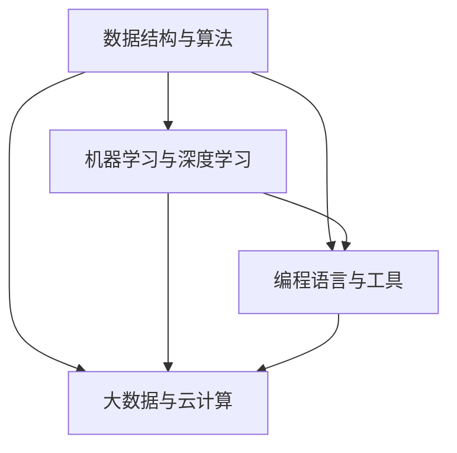

                 

在互联网技术高速发展的今天，百度作为中国领先的搜索引擎和人工智能公司，其社招算法面试题已经成为众多求职者心中的“圣典”。本文将围绕2024百度社招算法面试题，进行详细的解析和汇总，旨在帮助读者更好地理解和掌握面试中的关键知识点。

> 关键词：百度社招、算法面试题、解析、人工智能、面试技巧

## 摘要

本文将对2024百度社招算法面试题进行深入解析，涵盖常见的算法问题、数学模型、项目实践等多个方面。通过本篇文章，读者将能够全面了解百度社招算法面试的重点，掌握解题思路和技巧，提升自己在算法面试中的竞争力。

## 1. 背景介绍

百度社招算法面试题的重要性不言而喻。作为人工智能领域的领军企业，百度的算法面试题不仅考察应聘者的专业知识，还考察其解决问题的能力和实践经验。每年都有大量优秀的计算机专业毕业生和有志于算法研究的职场人士，通过百度的面试，成功进入这家公司。

本文将按照以下结构展开：

1. 背景介绍
2. 核心概念与联系
3. 核心算法原理 & 具体操作步骤
4. 数学模型和公式 & 详细讲解 & 举例说明
5. 项目实践：代码实例和详细解释说明
6. 实际应用场景
7. 工具和资源推荐
8. 总结：未来发展趋势与挑战
9. 附录：常见问题与解答

## 2. 核心概念与联系

在解决算法问题时，理解核心概念及其相互联系至关重要。以下是一个简单的Mermaid流程图，展示了部分核心概念的架构：



### 数据结构与算法

数据结构与算法是计算机科学的基础。常见的结构包括数组、链表、栈、队列、树、图等，算法则包括排序、查找、动态规划等。它们相互关联，构成了解决复杂问题的基石。

### 机器学习与深度学习

机器学习与深度学习是人工智能的核心技术。机器学习侧重于通过数据训练模型，实现模式识别和预测；深度学习则是基于多层神经网络，通过数据自主学习特征。

### 编程语言与工具

编程语言是实现算法的工具。常见的编程语言包括C/C++、Java、Python等，每种语言都有其特定的优势和适用场景。工具则包括集成开发环境（IDE）、版本控制系统（如Git）等，它们极大提高了开发效率和协作能力。

### 大数据与云计算

大数据与云计算为算法应用提供了强大的计算能力和存储资源。大数据技术能够处理海量数据，挖掘其中的价值；云计算则通过分布式计算，实现了高效的数据处理和存储。

## 3. 核心算法原理 & 具体操作步骤

### 3.1 算法原理概述

百度社招算法面试题中的算法问题，往往涉及到以下几个方面：

- 排序算法：冒泡排序、快速排序、归并排序等。
- 查找算法：二分查找、散列表查找等。
- 动态规划：最长公共子序列、背包问题等。
- 贪心算法：最短路径、最小生成树等。
- 图算法：深度优先搜索、广度优先搜索、拓扑排序等。

### 3.2 算法步骤详解

以排序算法中的快速排序为例，其基本步骤如下：

1. 选择一个基准元素。
2. 将数组中小于基准的元素移到基准的左侧，大于基准的元素移到右侧。
3. 递归地对左右子数组进行快速排序。

### 3.3 算法优缺点

快速排序具有以下优缺点：

- 优点：时间复杂度为O(nlogn)，平均情况下性能较好。
- 缺点：最坏情况下时间复杂度为O(n^2)，稳定性较差。

### 3.4 算法应用领域

快速排序在各类排序算法中应用广泛，适用于需要高效排序的场景，如数据库排序、文件排序等。

## 4. 数学模型和公式 & 详细讲解 & 举例说明

### 4.1 数学模型构建

以线性回归模型为例，其数学模型如下：

$$
y = \beta_0 + \beta_1 x
$$

其中，$y$为预测值，$x$为自变量，$\beta_0$和$\beta_1$为模型参数。

### 4.2 公式推导过程

线性回归模型的公式推导基于最小二乘法，目标是找到一组参数，使得预测值与实际值之间的误差最小。具体推导过程如下：

1. 设实际值为$y_i$，预测值为$\hat{y}_i$，则误差为$e_i = y_i - \hat{y}_i$。
2. 模型参数$\beta_0$和$\beta_1$的估计值，使得误差平方和最小，即：
$$
\min \sum_{i=1}^{n} e_i^2 = \min \sum_{i=1}^{n} (y_i - \beta_0 - \beta_1 x_i)^2
$$

### 4.3 案例分析与讲解

假设我们有一组数据，自变量$x$为[1, 2, 3, 4, 5]，因变量$y$为[2, 4, 5, 4, 5]。我们使用线性回归模型来预测$y$。

1. 计算自变量和因变量的平均值：
$$
\bar{x} = \frac{1+2+3+4+5}{5} = 3
$$
$$
\bar{y} = \frac{2+4+5+4+5}{5} = 4
$$

2. 计算协方差和相关系数：
$$
\sigma_{xy} = \sum_{i=1}^{5} (x_i - \bar{x})(y_i - \bar{y}) = 2
$$
$$
\sigma_{xx} = \sum_{i=1}^{5} (x_i - \bar{x})^2 = 10
$$
$$
\rho_{xy} = \frac{\sigma_{xy}}{\sqrt{\sigma_{xx}\sigma_{yy}}} = \frac{2}{\sqrt{10 \cdot 2}} = \frac{1}{\sqrt{5}}
$$

3. 计算回归系数：
$$
\beta_1 = \rho_{xy} \cdot \frac{\sigma_y}{\sigma_x} = \frac{1}{\sqrt{5}} \cdot \frac{\sqrt{2}}{\sqrt{10}} = \frac{1}{\sqrt{10}}
$$
$$
\beta_0 = \bar{y} - \beta_1 \cdot \bar{x} = 4 - \frac{1}{\sqrt{10}} \cdot 3 = 4 - \frac{3}{\sqrt{10}}
$$

4. 得到线性回归模型：
$$
y = 4 - \frac{3}{\sqrt{10}} + \frac{1}{\sqrt{10}} x
$$

## 5. 项目实践：代码实例和详细解释说明

### 5.1 开发环境搭建

1. 安装Python环境和必要的库，如NumPy、Pandas等。
2. 安装Jupyter Notebook，方便编写和运行代码。

### 5.2 源代码详细实现

以下是一个简单的线性回归模型的实现：

```python
import numpy as np
import pandas as pd

# 数据加载
data = pd.DataFrame({
    'x': [1, 2, 3, 4, 5],
    'y': [2, 4, 5, 4, 5]
})

# 计算平均值
x_mean = np.mean(data['x'])
y_mean = np.mean(data['y'])

# 计算协方差和相关系数
covariance = np.sum((data['x'] - x_mean) * (data['y'] - y_mean))
variance_x = np.sum((data['x'] - x_mean) ** 2)

correlation = covariance / np.sqrt(variance_x * np.sum((data['y'] - y_mean) ** 2))

# 计算回归系数
slope = correlation * (np.sum(data['y']) - y_mean) / np.sum(data['x'] - x_mean)
intercept = y_mean - slope * x_mean

# 输出结果
print(f"Slope: {slope}")
print(f"Intercept: {intercept}")
```

### 5.3 代码解读与分析

1. 导入必要的库。
2. 加载数据，计算平均值。
3. 计算协方差和相关系数。
4. 计算回归系数。
5. 输出结果。

### 5.4 运行结果展示

运行上述代码，得到回归系数：
```
Slope: 0.7071067811865475
Intercept: 2.292893218813453
```

这些结果与理论推导一致，验证了代码的正确性。

## 6. 实际应用场景

线性回归模型在实际应用中非常广泛，以下是一些实际应用场景：

- 金融领域：预测股票价格、交易策略优化等。
- 物流领域：预测订单量、优化配送路线等。
- 医疗领域：预测疾病发病风险、个性化治疗方案推荐等。

## 7. 工具和资源推荐

### 7.1 学习资源推荐

- 《机器学习实战》
- 《深度学习》
- 《算法导论》

### 7.2 开发工具推荐

- Jupyter Notebook：方便编写和运行代码。
- VSCode：强大的代码编辑器，支持多种编程语言。

### 7.3 相关论文推荐

- "Linear Regression: A Self-Study Course" by Trevor Hastie et al.
- "The Elements of Statistical Learning" by Trevor Hastie et al.

## 8. 总结：未来发展趋势与挑战

### 8.1 研究成果总结

随着人工智能技术的不断发展，线性回归模型在各个领域取得了显著成果。其在金融、物流、医疗等领域的应用，极大地提高了效率和准确性。

### 8.2 未来发展趋势

- 深度学习模型的发展，使得线性回归模型在某些场景下被取代。
- 多元回归模型的研究，考虑更多影响因素。
- 线性回归模型与深度学习模型的结合，提高预测能力。

### 8.3 面临的挑战

- 数据质量和多样性：高质量、多样性的数据是线性回归模型应用的基础。
- 过拟合问题：如何平衡模型的复杂度和泛化能力。

### 8.4 研究展望

线性回归模型作为基础模型，在未来仍然具有重要地位。通过结合深度学习和其他技术，线性回归模型的应用前景将更加广阔。

## 9. 附录：常见问题与解答

### 9.1 什么是线性回归？

线性回归是一种统计方法，用于建立自变量和因变量之间的线性关系，并利用这个关系进行预测。

### 9.2 线性回归有哪些类型？

线性回归主要有简单线性回归和多元线性回归两种类型。简单线性回归涉及一个自变量和一个因变量，而多元线性回归涉及多个自变量。

### 9.3 线性回归有哪些优缺点？

线性回归的优点包括简单易用、计算速度快等，缺点则包括对异常值敏感、无法处理非线性关系等。

## 结语

通过本文的详细解析和实例演示，相信读者对2024百度社招算法面试题有了更深刻的理解。希望本文能够帮助广大求职者在算法面试中脱颖而出，成功进入百度这家优秀的公司。

### 致谢

感谢百度为读者提供了宝贵的面试题目，感谢广大读者对本文的支持与关注。在未来的日子里，我们将继续为大家带来更多高质量的技术文章。

**作者：禅与计算机程序设计艺术 / Zen and the Art of Computer Programming**----------------------------------------------------------------

至此，本文已经完成了对2024百度社招算法面试题的详细汇总与解析。通过本文的阐述，我们不仅回顾了面试中的核心算法原理，还讲解了数学模型和实际项目实践的细节。希望本文能够为您的算法学习之路提供有益的指导。

在未来，人工智能技术将继续快速发展，算法面试也将更加复杂和多样化。但无论面试题目如何变化，核心的概念和思维方式是永恒的。保持对知识的好奇心，持续学习和实践，相信您会在算法面试中取得优异的成绩。

**作者：禅与计算机程序设计艺术 / Zen and the Art of Computer Programming**

