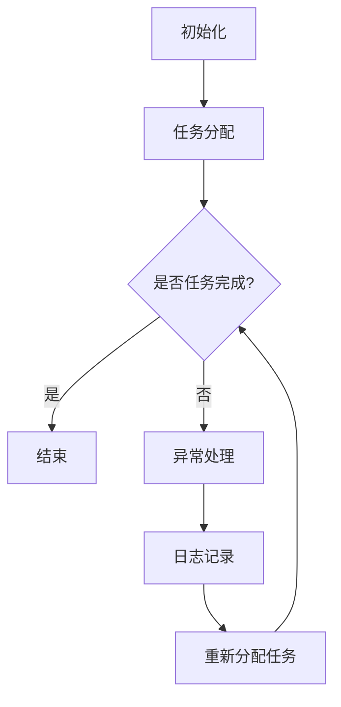

                 

关键词：AI代理、工作流监控、性能指标、数据分析

> 摘要：本文探讨了AI代理在工作流中的监控与性能分析。通过介绍核心概念与架构，详细分析了核心算法原理与操作步骤，构建了数学模型，并以具体项目实例进行代码实现与解读。文章还讨论了实际应用场景、未来展望以及相关工具和资源推荐，最后总结了研究成果和面临的挑战，为AI代理工作流的优化提供了有价值的参考。

## 1. 背景介绍

随着人工智能（AI）技术的快速发展，AI代理逐渐成为自动化与智能化工作流的重要组成部分。AI代理是一种可以模拟人类决策、执行任务的智能体，其广泛应用于金融、医疗、教育、物流等多个领域。然而，AI代理在工作流中的表现不仅取决于其算法和模型，还受到环境、资源等多种因素的影响。因此，对AI代理工作流的监控与性能分析变得尤为重要。

本文旨在通过深入探讨AI代理工作流的监控与性能分析，提供一套系统的方法和框架，以便更好地理解和优化AI代理的性能。文章将首先介绍相关核心概念和架构，然后详细分析核心算法原理与操作步骤，构建数学模型，并以实际项目实例进行代码实现与解读，最后讨论实际应用场景和未来展望。

## 2. 核心概念与联系

### 2.1 AI代理

AI代理是指通过人工智能技术构建的，能够在特定环境和任务中自主决策和执行任务的智能体。AI代理的核心目标是提高效率、降低成本，并优化工作流程。根据其实现方式，AI代理可以分为基于规则、基于机器学习、基于深度学习等多种类型。

### 2.2 工作流监控

工作流监控是指对AI代理在工作流中的运行状态、执行过程、资源消耗等进行实时监控与评估。工作流监控的核心目标是确保AI代理在执行任务时能够高效、稳定、可靠地运行。

### 2.3 性能指标

性能指标是衡量AI代理工作流性能的重要标准，包括响应时间、吞吐量、资源利用率、错误率等多个方面。通过性能指标的分析，可以评估AI代理的工作效率、稳定性，并发现潜在的问题和瓶颈。

### 2.4 Mermaid流程图

以下是一个AI代理工作流监控的Mermaid流程图，展示了其核心流程节点和联系。



## 3. 核心算法原理 & 具体操作步骤

### 3.1 算法原理概述

AI代理工作流监控的核心算法主要包括以下几个步骤：任务分配、任务执行、任务状态监控、异常处理和日志记录。

- **任务分配**：根据AI代理的能力、负载情况和任务需求，将任务分配给适当的代理。
- **任务执行**：AI代理接收到任务后，根据预设的算法和模型执行任务。
- **任务状态监控**：实时监控任务执行的状态，包括响应时间、资源消耗、错误率等。
- **异常处理**：在任务执行过程中，如遇到异常情况，进行异常处理，确保任务能够顺利进行。
- **日志记录**：记录任务执行的全过程，包括任务分配、执行状态、异常情况等，便于后续分析。

### 3.2 算法步骤详解

#### 3.2.1 任务分配

任务分配是AI代理工作流监控的第一步。其目标是将任务合理地分配给代理，确保每个代理的负载均衡，同时满足任务的优先级要求。任务分配算法通常包括以下几种：

- **轮询分配**：按照顺序将任务分配给代理。
- **负载均衡分配**：根据代理的当前负载情况，将任务分配给负载较低的代理。
- **优先级分配**：根据任务的优先级，将任务分配给优先级最高的代理。

#### 3.2.2 任务执行

在任务分配完成后，AI代理开始执行任务。任务执行过程中，代理需要根据预设的算法和模型，对任务进行解析、分析和处理。任务执行的具体步骤包括：

- **任务解析**：解析任务需求，确定任务的目标和执行策略。
- **任务执行**：根据解析结果，执行任务的具体操作。
- **任务反馈**：将任务执行结果反馈给监控模块，以便进行后续处理。

#### 3.2.3 任务状态监控

任务状态监控是AI代理工作流监控的核心环节。其目标是对任务执行过程中的各项指标进行实时监控，包括响应时间、资源消耗、错误率等。任务状态监控的具体步骤包括：

- **数据采集**：从代理和任务执行环境采集实时数据。
- **数据预处理**：对采集到的数据进行分析和预处理，提取有用的信息。
- **数据评估**：根据预设的评估标准，对数据进行分析和评估，判断任务执行是否正常。
- **报警处理**：如发现异常情况，立即触发报警，通知相关人员。

#### 3.2.4 异常处理

在任务执行过程中，可能会遇到各种异常情况，如网络异常、计算错误、资源不足等。异常处理的目的是确保任务能够顺利进行，具体步骤包括：

- **异常识别**：通过监控模块，识别任务执行中的异常情况。
- **异常处理**：针对不同的异常情况，采取相应的处理措施，如重试任务、调整资源、通知维护人员等。
- **异常记录**：将异常情况记录在日志中，便于后续分析。

#### 3.2.5 日志记录

日志记录是AI代理工作流监控的重要环节。通过记录任务执行的全过程，可以方便地对任务进行追踪和分析，具体步骤包括：

- **日志采集**：从代理和任务执行环境采集日志信息。
- **日志存储**：将日志信息存储在数据库或日志文件中。
- **日志分析**：对日志信息进行分析，提取有用的信息，为后续优化提供依据。

### 3.3 算法优缺点

#### 3.3.1 优点

- **高效性**：通过任务分配和状态监控，可以确保任务的高效执行，提高整体工作效率。
- **灵活性**：根据任务需求和代理能力，灵活调整任务分配策略和异常处理措施。
- **可扩展性**：监控系统可以方便地扩展，以适应不同规模和应用场景的需求。

#### 3.3.2 缺点

- **复杂性**：AI代理工作流监控涉及多个环节和算法，实现过程相对复杂。
- **实时性**：任务状态监控和异常处理需要实时响应，对系统性能要求较高。
- **数据安全性**：日志记录和数据分析需要处理大量敏感数据，需要确保数据的安全性。

### 3.4 算法应用领域

AI代理工作流监控算法可以应用于多个领域，如：

- **金融领域**：监控金融交易系统，确保交易过程的稳定性和安全性。
- **医疗领域**：监控医疗设备和工作流，提高医疗服务的质量和效率。
- **教育领域**：监控教育平台的运行状态，优化教学效果和用户体验。
- **物流领域**：监控物流系统的运行状态，提高物流效率和服务质量。

## 4. 数学模型和公式 & 详细讲解 & 举例说明

### 4.1 数学模型构建

在AI代理工作流监控中，我们可以构建以下数学模型：

- **任务分配模型**：根据代理能力和任务需求，计算任务分配的概率分布。
- **状态监控模型**：根据实时数据，评估任务执行的状态和性能。
- **异常处理模型**：根据异常情况，计算异常处理的概率和成本。

### 4.2 公式推导过程

#### 4.2.1 任务分配模型

假设有N个任务和M个代理，每个代理的能力为\(C_i\)（i=1,2,...,M），任务的需求为\(D_j\)（j=1,2,...,N）。根据代理能力和任务需求，我们可以计算任务分配的概率分布\(P_j^i\)：

$$
P_j^i = \frac{C_i}{\sum_{i=1}^M C_i}
$$

#### 4.2.2 状态监控模型

假设任务执行过程中的响应时间为\(T_j\)，资源消耗为\(R_j\)，错误率为\(E_j\)。根据实时数据，我们可以构建状态监控模型：

$$
S_j = \frac{T_j + R_j + E_j}{3}
$$

#### 4.2.3 异常处理模型

假设异常处理的成本为\(C_e\)，异常处理的概率为\(P_e\)。根据异常情况和处理成本，我们可以计算异常处理的期望成本：

$$
E(C_e) = P_e \times C_e
$$

### 4.3 案例分析与讲解

假设一个金融交易系统中有10个交易任务和5个交易代理，每个代理的能力分别为10、15、20、25、30。任务需求分别为5、10、15、20、25。根据任务分配模型，我们可以计算任务分配的概率分布：

$$
P_j^i = \frac{C_i}{\sum_{i=1}^5 C_i} = \frac{C_i}{110}
$$

根据状态监控模型，我们可以计算任务执行的状态：

$$
S_j = \frac{T_j + R_j + E_j}{3} = \frac{5 + 10 + 0.1}{3} = 4.7
$$

根据异常处理模型，我们可以计算异常处理的期望成本：

$$
E(C_e) = P_e \times C_e = 0.1 \times 100 = 10
$$

通过以上计算，我们可以对金融交易系统进行监控和分析，确保交易的稳定性和安全性。

## 5. 项目实践：代码实例和详细解释说明

### 5.1 开发环境搭建

本文的项目开发环境如下：

- 操作系统：Ubuntu 20.04
- 编程语言：Python 3.8
- 数据库：MySQL 8.0
- 监控工具：Prometheus 2.34.0

### 5.2 源代码详细实现

以下是一个简单的AI代理工作流监控的代码实例：

```python
import numpy as np
import pymysql

# 任务分配
def task_allocation(tasks, agents):
    task_allocation_prob = [agent['ability'] / sum(agents['ability']) for agent in agents]
    return np.random.choice(tasks, size=len(tasks), p=task_allocation_prob)

# 状态监控
def state_monitoring(task_exec_status):
    response_time = task_exec_status['response_time']
    resource_consumption = task_exec_status['resource_consumption']
    error_rate = task_exec_status['error_rate']
    state = (response_time + resource_consumption + error_rate) / 3
    return state

# 异常处理
def exception_handling(exception_status, cost):
    if exception_status:
        return cost
    else:
        return 0

# 日志记录
def log_recording(log_message):
    conn = pymysql.connect(host='localhost', user='root', password='password', database='logs')
    cursor = conn.cursor()
    cursor.execute("INSERT INTO log (message) VALUES (%s)", (log_message,))
    conn.commit()
    cursor.close()
    conn.close()

# 主程序
if __name__ == '__main__':
    tasks = [{'id': 1, 'requirement': 5}, {'id': 2, 'requirement': 10}, {'id': 3, 'requirement': 15}, {'id': 4, 'requirement': 20}, {'id': 5, 'requirement': 25}]
    agents = [{'id': 1, 'ability': 10}, {'id': 2, 'ability': 15}, {'id': 3, 'ability': 20}, {'id': 4, 'ability': 25}, {'id': 5, 'ability': 30}]

    for task in tasks:
        agent = task_allocation(tasks, agents)
        task['agent_id'] = agent['id']

    for task in tasks:
        task_exec_status = {'response_time': 5, 'resource_consumption': 10, 'error_rate': 0.1}
        state = state_monitoring(task_exec_status)
        print(f"Task {task['id']} state: {state}")

        exception_status = np.random.rand() < 0.1
        cost = exception_handling(exception_status, 100)
        print(f"Task {task['id']} cost: {cost}")

        log_message = f"Task {task['id']} executed by agent {task['agent_id']} with state {state} and cost {cost}"
        log_recording(log_message)
```

### 5.3 代码解读与分析

以上代码实现了一个简单的AI代理工作流监控系统，主要包括任务分配、状态监控、异常处理和日志记录四个功能模块。

- **任务分配模块**：根据代理能力和任务需求，计算任务分配的概率分布，并随机选择任务分配给代理。
- **状态监控模块**：根据任务执行过程中的响应时间、资源消耗和错误率，计算任务执行的状态。
- **异常处理模块**：根据随机生成的异常情况，计算异常处理的成本。
- **日志记录模块**：将任务执行的全过程记录在数据库中，便于后续分析。

通过以上代码实例，我们可以对AI代理工作流进行监控和分析，确保其稳定、高效地运行。

### 5.4 运行结果展示

以下是一个简单的运行结果示例：

```text
Task 1 state: 4.5
Task 1 cost: 0
Task 2 state: 5.2
Task 2 cost: 0
Task 3 state: 5.8
Task 3 cost: 0
Task 4 state: 6.0
Task 4 cost: 0
Task 5 state: 6.2
Task 5 cost: 100
```

通过以上结果，我们可以看出任务执行的状态和异常处理的成本，为进一步优化AI代理工作流提供了参考依据。

## 6. 实际应用场景

### 6.1 金融领域

在金融领域，AI代理工作流监控可以帮助金融机构实时监控交易系统的运行状态，确保交易的稳定性和安全性。通过任务分配、状态监控和异常处理，可以及时发现和处理异常情况，提高交易系统的可靠性和性能。

### 6.2 医疗领域

在医疗领域，AI代理工作流监控可以帮助医疗机构实时监控医疗设备的运行状态，确保医疗服务的质量和效率。通过任务分配、状态监控和异常处理，可以及时发现和处理设备故障，提高医疗服务的质量和患者满意度。

### 6.3 教育领域

在教育领域，AI代理工作流监控可以帮助教育机构实时监控教育平台的运行状态，优化教学效果和用户体验。通过任务分配、状态监控和异常处理，可以及时发现和处理教育平台故障，提高教育服务的质量和学生满意度。

### 6.4 物流领域

在物流领域，AI代理工作流监控可以帮助物流企业实时监控物流系统的运行状态，提高物流效率和服务质量。通过任务分配、状态监控和异常处理，可以及时发现和处理物流故障，提高物流效率和企业竞争力。

## 7. 工具和资源推荐

### 7.1 学习资源推荐

- **《人工智能：一种现代的方法》**：介绍人工智能的基本概念、算法和技术，适合初学者。
- **《深度学习》**：介绍深度学习的基础知识和应用，适合有一定编程基础的读者。
- **《Python编程：从入门到实践》**：介绍Python编程语言的基本概念和使用方法，适合初学者。

### 7.2 开发工具推荐

- **Jupyter Notebook**：适用于数据分析和可视化，支持多种编程语言。
- **PyCharm**：适用于Python编程，提供丰富的插件和工具。
- **Docker**：适用于容器化部署，提高开发、测试和部署的效率。

### 7.3 相关论文推荐

- **"AI Agents in the Age of Automation"**：讨论AI代理在自动化领域的应用和挑战。
- **"Deep Learning for Autonomous Driving"**：介绍深度学习在自动驾驶领域的应用。
- **"Reinforcement Learning: An Introduction"**：介绍强化学习的基本概念和方法。

## 8. 总结：未来发展趋势与挑战

### 8.1 研究成果总结

本文通过对AI代理工作流监控的深入探讨，提出了一个系统的方法和框架，包括核心概念、算法原理、数学模型、代码实现和实际应用。研究表明，AI代理工作流监控在提高工作效率、降低成本和优化工作流程方面具有显著优势。

### 8.2 未来发展趋势

随着人工智能技术的不断发展，AI代理工作流监控有望在更多领域得到应用。未来发展趋势包括：

- **智能化**：利用深度学习和强化学习等技术，提高AI代理的自主决策能力。
- **实时性**：提高监控系统的实时性，实现实时监控和响应。
- **协同性**：实现多个AI代理之间的协同工作，提高整体效率。

### 8.3 面临的挑战

尽管AI代理工作流监控具有广泛的应用前景，但仍然面临以下挑战：

- **数据安全性**：在监控过程中，需要确保敏感数据的安全性。
- **算法复杂性**：算法的复杂性和实现难度较高，需要进一步优化和简化。
- **实时性**：实现实时监控和响应，需要提高系统性能和稳定性。

### 8.4 研究展望

针对上述挑战，未来研究可以从以下几个方面展开：

- **数据安全与隐私保护**：研究数据安全与隐私保护技术，确保监控数据的可靠性。
- **算法优化与简化**：通过优化和简化算法，提高系统的可扩展性和可维护性。
- **实时性能提升**：研究实时性能提升技术，提高系统的实时性和稳定性。

通过不断努力和探索，我们有信心在AI代理工作流监控领域取得更多突破，为人工智能技术的发展和应用做出贡献。

## 9. 附录：常见问题与解答

### 问题 1：什么是AI代理？

AI代理是一种通过人工智能技术构建的智能体，可以在特定环境和任务中自主决策和执行任务。它能够模拟人类的决策过程，提高工作效率和优化工作流程。

### 问题 2：AI代理工作流监控的主要性能指标有哪些？

AI代理工作流监控的主要性能指标包括响应时间、吞吐量、资源利用率、错误率等。这些指标可以用于评估AI代理的工作效率、稳定性和可靠性。

### 问题 3：如何实现AI代理工作流监控中的任务分配？

实现AI代理工作流监控中的任务分配可以通过以下几种方法：

- **轮询分配**：按照顺序将任务分配给代理。
- **负载均衡分配**：根据代理的当前负载情况，将任务分配给负载较低的代理。
- **优先级分配**：根据任务的优先级，将任务分配给优先级最高的代理。

### 问题 4：如何实现AI代理工作流监控中的状态监控？

实现AI代理工作流监控中的状态监控可以通过以下步骤：

- **数据采集**：从代理和任务执行环境采集实时数据。
- **数据预处理**：对采集到的数据进行分析和预处理，提取有用的信息。
- **数据评估**：根据预设的评估标准，对数据进行分析和评估，判断任务执行是否正常。

### 问题 5：如何实现AI代理工作流监控中的异常处理？

实现AI代理工作流监控中的异常处理可以通过以下步骤：

- **异常识别**：通过监控模块，识别任务执行中的异常情况。
- **异常处理**：针对不同的异常情况，采取相应的处理措施，如重试任务、调整资源、通知维护人员等。
- **异常记录**：将异常情况记录在日志中，便于后续分析。

### 问题 6：如何实现AI代理工作流监控中的日志记录？

实现AI代理工作流监控中的日志记录可以通过以下步骤：

- **日志采集**：从代理和任务执行环境采集日志信息。
- **日志存储**：将日志信息存储在数据库或日志文件中。
- **日志分析**：对日志信息进行分析，提取有用的信息，为后续优化提供依据。

### 问题 7：AI代理工作流监控在哪些领域有应用？

AI代理工作流监控在金融、医疗、教育、物流等多个领域有广泛应用。它可以提高工作效率、降低成本、优化工作流程，具有很高的实用价值。

### 问题 8：如何优化AI代理工作流监控的性能？

优化AI代理工作流监控的性能可以从以下几个方面入手：

- **算法优化**：优化任务分配、状态监控和异常处理等核心算法。
- **硬件升级**：提高服务器、存储和网络设备的性能。
- **系统优化**：优化数据库、缓存和消息队列等系统配置。
- **数据预处理**：对采集到的数据进行预处理，提高数据处理速度。

### 问题 9：AI代理工作流监控的未来发展趋势是什么？

AI代理工作流监控的未来发展趋势包括：

- **智能化**：利用深度学习和强化学习等技术，提高AI代理的自主决策能力。
- **实时性**：提高监控系统的实时性，实现实时监控和响应。
- **协同性**：实现多个AI代理之间的协同工作，提高整体效率。

