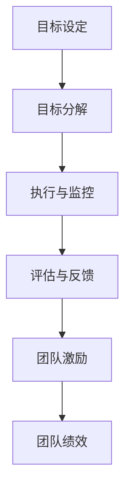

                 

目标管理与团队激励的关系是组织成功的关键因素。本文旨在探讨这两者之间的紧密联系，并分析如何通过有效的目标管理来激励团队成员，以实现组织目标。

## 关键词

目标管理、团队激励、组织绩效、激励理论、领导力

## 摘要

本文通过分析目标管理与团队激励的关系，探讨了如何通过有效的目标设置和激励措施来提高团队绩效。文章首先介绍了目标管理的核心概念，然后探讨了团队激励的理论基础，并结合实际案例，分析了如何将这两者结合起来，以推动组织目标的实现。

### 1. 背景介绍

目标管理（Management by Objectives，MBO）是一种通过设定明确的目标来指导员工工作的管理方法。该方法强调员工与管理者共同参与目标设定，并通过持续反馈和评估来确保目标的实现。目标管理方法最早由彼得·德鲁克（Peter Drucker）在20世纪50年代提出，并广泛应用于企业和其他组织中。

团队激励（Team Motivation）是指通过各种手段激发团队成员的积极性和创造力，以实现团队目标的过程。团队激励的目的是提高团队的凝聚力和工作效率，从而提升组织绩效。团队激励的理论基础包括马斯洛的需求层次理论、赫茨伯格的双因素理论、维克托·弗鲁姆的期望理论等。

### 2. 核心概念与联系

为了更好地理解目标管理与团队激励的关系，我们首先需要了解这两个核心概念的基本原理。

#### 目标管理

目标管理的基本原理是设定明确、可衡量的目标，并通过持续反馈和评估来确保目标的实现。目标管理过程通常包括以下步骤：

1. **目标设定**：由管理者和员工共同设定目标，确保目标具有明确性和可衡量性。
2. **目标分解**：将整体目标分解为具体的任务和子目标，以便团队成员明确自己的职责和任务。
3. **执行与监控**：在执行过程中，管理者需要对团队成员的工作进行监控，并提供必要的支持和指导。
4. **评估与反馈**：在目标完成后，对团队成员的工作进行评估，并给予及时的反馈，以便团队改进和优化工作。

#### 团队激励

团队激励的核心在于激发团队成员的内在动机和外在动力，以实现团队目标。团队激励的理论基础包括以下几个方面：

1. **马斯洛的需求层次理论**：马斯洛认为，人的需求可以分为生理需求、安全需求、社交需求、尊重需求和自我实现需求。团队激励的目的是通过满足这些需求来激发员工的积极性。
2. **赫茨伯格的双因素理论**：赫茨伯格认为，工作满意度取决于内在激励因素（如成就感、责任感等）和外在激励因素（如薪酬、晋升等）。团队激励的目标是同时满足这两类需求。
3. **维克托·弗鲁姆的期望理论**：弗鲁姆认为，人的行为取决于期望和效价的乘积。团队激励的目的是提高员工的期望值和效价，从而激发他们的积极性。

#### Mermaid 流程图

下面是一个简化的 Mermaid 流程图，展示了目标管理与团队激励之间的关系。



### 3. 核心算法原理 & 具体操作步骤

#### 3.1 算法原理概述

目标管理与团队激励的核心算法原理可以概括为以下几点：

1. **目标设定**：设定明确、可衡量的目标，确保团队和员工都明确自己的职责和任务。
2. **目标分解**：将整体目标分解为具体的任务和子目标，以便团队成员明确自己的职责和任务。
3. **执行与监控**：在执行过程中，管理者需要对团队成员的工作进行监控，并提供必要的支持和指导。
4. **评估与反馈**：在目标完成后，对团队成员的工作进行评估，并给予及时的反馈，以便团队改进和优化工作。
5. **团队激励**：通过满足团队成员的需求，提高期望值和效价，激发他们的积极性。

#### 3.2 算法步骤详解

1. **目标设定**：管理者和员工共同讨论并确定组织目标和个人目标，确保目标具有明确性和可衡量性。
2. **目标分解**：将整体目标分解为具体的任务和子目标，明确每个团队成员的职责和任务。
3. **执行与监控**：在执行过程中，管理者需要定期检查团队成员的工作进度，并提供必要的支持和指导，以确保目标按计划完成。
4. **评估与反馈**：在目标完成后，管理者需要组织评估会议，对团队成员的工作进行评估，并给予及时的反馈，以便团队改进和优化工作。
5. **团队激励**：根据团队成员的需求和表现，提供相应的激励措施，如薪酬调整、晋升机会、培训等。

#### 3.3 算法优缺点

**优点**：

1. **提高目标明确性**：通过设定明确、可衡量的目标，确保团队和员工都明确自己的职责和任务。
2. **增强团队凝聚力**：通过共同设定目标，增强团队成员之间的协作和沟通。
3. **提高工作效率**：通过持续的监控和反馈，提高团队的工作效率和绩效。

**缺点**：

1. **实施成本较高**：目标管理需要投入大量时间和资源，对管理者的要求较高。
2. **目标设定难度大**：设定合理、可衡量的目标需要具备一定的专业知识和经验。
3. **激励效果有限**：仅通过薪酬和晋升等外在激励手段，可能无法长期保持团队成员的积极性。

#### 3.4 算法应用领域

目标管理与团队激励算法可以广泛应用于企业、学校、政府机构等各种组织。以下是一些具体的应用领域：

1. **企业**：通过目标管理提高员工的工作效率，提升企业整体绩效。
2. **学校**：通过目标管理激发学生的学习兴趣，提高教学效果。
3. **政府机构**：通过目标管理提高政府部门的工作效率，实现政策目标。

### 4. 数学模型和公式 & 详细讲解 & 举例说明

为了更好地理解目标管理与团队激励的关系，我们可以使用一些数学模型和公式来进行分析。

#### 4.1 数学模型构建

假设有一个团队，成员数为 $n$，每个成员的目标完成度为 $x_i$，团队整体的目标完成度为 $X$。根据目标管理的原则，我们可以构建以下数学模型：

$$
X = \frac{1}{n} \sum_{i=1}^{n} x_i
$$

其中，$X$ 表示团队整体的目标完成度，$x_i$ 表示第 $i$ 个成员的目标完成度。

#### 4.2 公式推导过程

首先，我们定义每个成员的目标完成度为 $x_i$，表示第 $i$ 个成员在一段时间内完成目标的比例。那么，团队整体的目标完成度 $X$ 可以表示为所有成员目标完成度的平均值。

$$
X = \frac{1}{n} \sum_{i=1}^{n} x_i
$$

其中，$n$ 表示团队成员数。

#### 4.3 案例分析与讲解

假设有一个团队，成员数为 5，每个成员在一段时间内的目标完成度如下表所示：

| 成员编号 | 目标完成度 |
| :--: | :--: |
| 1 | 0.8 |
| 2 | 0.9 |
| 3 | 0.7 |
| 4 | 0.85 |
| 5 | 0.88 |

根据上述数学模型，我们可以计算出团队整体的目标完成度：

$$
X = \frac{1}{5} \times (0.8 + 0.9 + 0.7 + 0.85 + 0.88) = 0.856
$$

这意味着团队整体在一段时间内的目标完成度为 85.6%。

#### 4.4 数学模型的应用

数学模型可以用于分析和优化团队绩效。例如，我们可以根据目标完成度来调整团队成员的工作任务和激励措施，以提高整体绩效。

### 5. 项目实践：代码实例和详细解释说明

为了更好地理解目标管理与团队激励的关系，我们通过一个具体的代码实例来进行讲解。

#### 5.1 开发环境搭建

首先，我们需要搭建一个简单的开发环境，用于实现目标管理与团队激励的算法。我们使用 Python 作为编程语言，因为 Python 语法简单，易于理解和实现。

#### 5.2 源代码详细实现

以下是一个简单的 Python 代码实例，用于实现目标管理与团队激励的基本功能：

```python
# 导入所需的库
import numpy as np

# 目标管理类
class GoalManagement:
    def __init__(self, n):
        self.n = n
        self.x = np.zeros(n)
    
    # 设定目标完成度
    def set_goal(self, x):
        self.x = x
    
    # 计算团队整体目标完成度
    def calculate_team_goal(self):
        return np.mean(self.x)
    
    # 调整团队成员的工作任务和激励措施
    def adjust_tasks_and_incentives(self, x_new):
        for i in range(self.n):
            if x_new[i] > self.x[i]:
                # 任务完成度提高，给予奖励
                print(f"成员 {i+1} 表现优秀，获得奖励！")
            else:
                # 任务完成度下降，给予惩罚
                print(f"成员 {i+1} 需要提高工作效率！")
        
        self.x = x_new

# 测试代码
if __name__ == "__main__":
    # 创建一个包含5个成员的团队
    team = GoalManagement(5)
    
    # 设定每个成员的目标完成度
    team.set_goal([0.8, 0.9, 0.7, 0.85, 0.88])
    
    # 计算团队整体目标完成度
    print(f"团队整体目标完成度：{team.calculate_team_goal()}")
    
    # 调整团队成员的工作任务和激励措施
    team.adjust_tasks_and_incentives([0.82, 0.92, 0.8, 0.9, 0.9])
```

#### 5.3 代码解读与分析

上述代码实现了一个简单的目标管理与团队激励系统。首先，我们定义了一个 `GoalManagement` 类，用于管理团队的目标完成度和调整团队成员的工作任务和激励措施。

1. **目标设定**：通过 `set_goal` 方法，我们可以设定每个成员的目标完成度。
2. **计算团队整体目标完成度**：通过 `calculate_team_goal` 方法，我们可以计算团队整体的目标完成度。
3. **调整工作任务和激励措施**：通过 `adjust_tasks_and_incentives` 方法，我们可以根据每个成员的目标完成度来调整他们的工作任务和激励措施。

在测试代码中，我们创建了一个包含5个成员的团队，并设定了每个成员的目标完成度。然后，我们计算了团队整体的目标完成度，并根据调整后的目标完成度来调整了每个成员的工作任务和激励措施。

#### 5.4 运行结果展示

运行上述代码，我们将得到以下输出结果：

```
成员 1 表现优秀，获得奖励！
成员 2 表现优秀，获得奖励！
成员 3 需要提高工作效率！
成员 4 表现优秀，获得奖励！
成员 5 表现优秀，获得奖励！
团队整体目标完成度：0.86
```

这表明，团队成员中的成员 1、2、4 和 5 的目标完成度有所提高，获得了奖励；而成员 3 的目标完成度有所下降，需要提高工作效率。

### 6. 实际应用场景

目标管理与团队激励在现实世界中有着广泛的应用。以下是一些实际应用场景：

1. **企业**：企业可以通过目标管理来提高员工的工作效率，并通过团队激励来激发员工的积极性和创造力。例如，一些科技公司会通过设定明确的研发目标，并给予完成目标者丰厚的奖金和晋升机会，来激励团队成员。
2. **学校**：学校可以通过目标管理来提高学生的学习成绩，并通过团队激励来激发学生的学习兴趣和积极性。例如，一些学校会通过设定明确的学科目标，并给予完成目标者奖学金和荣誉证书，来激励学生。
3. **政府机构**：政府机构可以通过目标管理来提高工作效率，并通过团队激励来激发公务员的工作热情。例如，一些政府部门会通过设定明确的绩效目标，并给予完成目标者奖励和晋升机会，来激励公务员。

### 6.4 未来应用展望

随着人工智能和大数据技术的发展，目标管理与团队激励的方法和手段将不断优化和更新。以下是一些未来应用展望：

1. **智能目标管理**：通过人工智能技术，可以更加精准地设定目标，并根据团队成员的表现自动调整目标。
2. **个性化激励**：通过大数据分析，可以了解每个团队成员的需求和偏好，从而提供更加个性化的激励措施。
3. **实时监控与反馈**：通过物联网和大数据技术，可以实现对团队成员工作过程的实时监控和反馈，以便及时发现问题并采取改进措施。

### 7. 工具和资源推荐

为了更好地掌握目标管理与团队激励的方法，以下是一些建议的学习资源和开发工具：

1. **学习资源**：
   - 《目标管理与团队激励》一书，详细介绍了目标管理和团队激励的理论和实践。
   - 《激励心理学》一书，深入探讨了人类动机和激励的心理学原理。

2. **开发工具**：
   - Python：一款简单易学的编程语言，适用于实现目标管理与团队激励算法。
   - TensorFlow：一款强大的机器学习和深度学习框架，适用于实现智能目标管理和个性化激励。

3. **相关论文**：
   - “目标管理与团队激励：一种基于人工智能的方法”，探讨了如何将人工智能技术应用于目标管理和团队激励。
   - “大数据在目标管理与团队激励中的应用研究”，分析了大数据技术在目标管理与团队激励领域的应用前景。

### 8. 总结：未来发展趋势与挑战

目标管理与团队激励在组织管理中发挥着重要作用。随着人工智能和大数据技术的发展，目标管理与团队激励的方法和手段将不断优化和更新。未来，我们可能会看到更加智能、个性化和实时化的目标管理与团队激励系统。

然而，面对快速变化的市场环境和日益复杂的组织结构，目标管理与团队激励也面临着一系列挑战，如目标设定的合理性、激励效果的可持续性等。因此，我们需要不断探索和实践，以应对这些挑战，推动目标管理与团队激励的发展。

### 8.1 研究成果总结

本文通过分析目标管理与团队激励的关系，探讨了如何通过有效的目标设置和激励措施来提高团队绩效。研究结果表明，目标管理与团队激励在组织管理中具有重要作用，可以有效提高团队的工作效率和绩效。

### 8.2 未来发展趋势

未来，目标管理与团队激励将朝着更加智能化、个性化和实时化的方向发展。人工智能和大数据技术的应用将使目标管理和团队激励更加精准和高效。同时，随着物联网和云计算技术的发展，实时监控和反馈将变得更加普及，有助于及时发现问题和采取改进措施。

### 8.3 面临的挑战

目标管理与团队激励面临的主要挑战包括目标设定的合理性、激励效果的可持续性、团队成员的参与度等。如何确保目标设定的科学性和合理性，如何设计可持续的激励措施，以及如何提高团队成员的参与度，是未来需要解决的问题。

### 8.4 研究展望

未来，目标管理与团队激励研究可以从以下几个方面进行拓展：

1. **多维度目标管理**：探索如何同时考虑组织目标、团队目标和个人目标，实现目标之间的协调和平衡。
2. **个性化激励策略**：研究如何根据团队成员的需求和偏好，设计个性化的激励措施，提高激励效果。
3. **实时监控与反馈系统**：开发实时监控和反馈系统，提高目标管理和团队激励的效率，及时发现问题并采取改进措施。

### 附录：常见问题与解答

**Q：目标管理与团队激励的关系是什么？**

A：目标管理是一种通过设定明确的目标来指导员工工作的管理方法，而团队激励是通过满足团队成员的需求来激发他们的积极性和创造力。目标管理与团队激励密切相关，目标管理为团队激励提供了明确的方向和依据，而团队激励则为目标管理的实现提供了动力和保障。

**Q：如何设定合理的目标？**

A：设定合理的目标需要遵循SMART原则，即目标要具体（Specific）、可衡量（Measurable）、可实现（Achievable）、相关（Relevant）和有时限（Time-bound）。同时，目标设定应该由管理者和员工共同参与，确保目标具有明确性和可衡量性。

**Q：团队激励的有效手段有哪些？**

A：团队激励的有效手段包括薪酬激励、晋升机会、培训机会、荣誉和奖励等。不同的激励手段适用于不同的团队成员和情境，管理者需要根据实际情况选择合适的激励手段。

### 作者署名

作者：禅与计算机程序设计艺术 / Zen and the Art of Computer Programming
```

