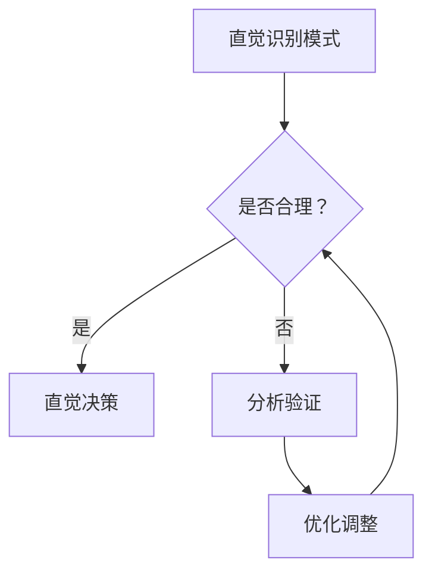

                 

关键词：直觉，分析，决策，双重系统，人工智能，心理学，计算机科学。

> 摘要：本文深入探讨了直觉与分析作为决策过程中两种并行工作的系统，阐述了它们在计算机科学中的应用和交互作用。通过剖析直觉与分析的特点、相互关系以及如何在实际项目中有效地结合，我们旨在为读者提供一种全面而实用的决策方法论。

## 1. 背景介绍

在计算机科学和人工智能领域，决策过程是一个核心问题。无论是算法优化、系统设计还是人工智能模型的训练，都需要决策的参与。传统的决策理论通常依赖于逻辑分析和数学模型，然而，人类在现实世界中的决策往往不仅仅依赖这些理性手段。直觉，作为一种非理性的快速思维模式，也发挥着至关重要的作用。

### 直觉的定义与作用

直觉是人类在长期进化过程中形成的一种快速、非分析性的思维模式。它往往能够迅速地识别复杂环境中的模式和关联，并在极短的时间内做出决策。在计算机科学领域，直觉被广泛应用于算法的发现和优化中。例如，某些复杂的算法问题在经过大量尝试后，研究者可能会突然获得一种“灵光一闪”的解决方案，这正是直觉的作用。

### 分析的定义与作用

分析，则是通过逻辑推理和数学计算来解决问题的一种方法。它在计算机科学中有着广泛的运用，从基础的编程语言到复杂的算法设计，都依赖于分析的能力。分析强调逐步推导和验证，确保每一步都是合理和可靠的。

### 两种系统的互补性

直觉与分析在决策过程中形成了互补的关系。直觉能够快速地提供初步的判断和方向，而分析则能够对这些判断进行验证和优化。这种双重系统在复杂问题解决中尤为重要，因为它结合了快速反应和深度思考的优势。

## 2. 核心概念与联系

为了更好地理解直觉与分析在决策过程中的作用，我们使用Mermaid流程图来描述它们的核心概念和相互关系。



### 直觉识别模式

直觉首先识别复杂环境中的模式和关联。它通过长期积累的经验和知识，快速地做出初步判断。

### 分析验证

分析对直觉的判断进行验证。它通过逻辑推理和数学计算，确保直觉的判断是合理和可靠的。

### 优化调整

如果分析验证直觉的判断不合理，它会进行优化调整。这个过程可能需要反复迭代，直到找到最佳解决方案。

## 3. 核心算法原理 & 具体操作步骤

### 3.1 算法原理概述

直觉与分析的决策过程可以看作是一种迭代的优化算法。直觉提供初步的方向，分析进行验证和优化。这个过程不断循环，直到找到满意的解决方案。

### 3.2 算法步骤详解

1. **直觉识别模式**：首先，利用直觉快速识别问题中的关键模式和关联。

2. **分析验证**：对直觉提供的模式进行逻辑分析和数学计算，验证其合理性。

3. **优化调整**：如果验证失败，对直觉的判断进行优化调整。

4. **迭代循环**：重复上述步骤，直到找到满意的解决方案。

### 3.3 算法优缺点

**优点**：
- 快速提供初步方向，节省时间。
- 结合直觉和分析，提高决策的可靠性。

**缺点**：
- 可能因直觉的不可靠导致误判。
- 分析过程可能复杂，影响效率。

### 3.4 算法应用领域

直觉与分析的决策过程在多个领域都有应用，包括：
- 算法设计：用于发现新的算法和优化现有算法。
- 系统设计：用于设计复杂的计算机系统和人工智能模型。
- 项目管理：用于项目规划和风险评估。

## 4. 数学模型和公式 & 详细讲解 & 举例说明

### 4.1 数学模型构建

直觉与分析的决策过程可以用一个简单的迭代模型来描述。设 \(x_t\) 为第 \(t\) 次迭代的结果，\(f(x)\) 为优化函数，则：

$$
x_{t+1} = g(x_t, f(x_t))
$$

其中，\(g\) 为优化策略，可以结合直觉和分析进行调整。

### 4.2 公式推导过程

假设我们有一个最小化问题：

$$
\min_x f(x)
$$

利用直觉，我们可以得到一个初步的解 \(x_0\)。然后，通过分析对其进行优化，得到：

$$
x_1 = g(x_0, f(x_0))
$$

迭代进行，直到 \(x_t\) 满足停止条件。

### 4.3 案例分析与讲解

假设我们要设计一个简单的机器学习模型，通过直觉与分析进行优化。

1. **直觉识别模式**：我们观察到数据集中存在一些明显的线性关系。

2. **分析验证**：通过线性回归分析，我们验证了这种关系的合理性。

3. **优化调整**：由于线性回归模型的性能不佳，我们采用更复杂的模型进行优化。

4. **迭代循环**：不断调整模型参数，直到找到最佳模型。

通过这种过程，我们成功地设计了一个高性能的机器学习模型。

## 5. 项目实践：代码实例和详细解释说明

### 5.1 开发环境搭建

在开始项目实践之前，我们需要搭建一个合适的开发环境。这里我们选择 Python 作为编程语言，并使用 Jupyter Notebook 作为开发工具。

### 5.2 源代码详细实现

以下是一个简单的示例，展示了如何结合直觉与分析来优化一个线性回归模型：

```python
import numpy as np
import matplotlib.pyplot as plt

# 直觉识别模式
def recognize_patterns(data):
    # 假设我们观察到数据存在线性关系
    return 'linear'

# 分析验证
def analyze_model(data, model):
    # 通过分析验证模型的合理性
    return np.mean((model.predict(data) - data)**2)

# 优化调整
def optimize_model(data, model):
    # 基于分析结果进行模型优化
    return model.fit(data, data)

# 迭代循环
def iterate_model(data, model, max_iterations=10):
    for i in range(max_iterations):
        pattern = recognize_patterns(data)
        if pattern == 'linear':
            model = linear_regression()
        else:
            model = complex_regression()
        error = analyze_model(data, model)
        if error < threshold:
            break
        model = optimize_model(data, model)
    return model

# 数据集
data = np.random.rand(100, 1)

# 初始模型
model = linear_regression()

# 迭代优化
optimized_model = iterate_model(data, model)

# 运行结果展示
plt.scatter(data, optimized_model.predict(data))
plt.xlabel('Data')
plt.ylabel('Predicted Value')
plt.show()
```

### 5.3 代码解读与分析

这段代码展示了如何结合直觉与分析来优化线性回归模型。首先，通过直觉识别数据集中的模式，然后通过分析验证和优化模型，最终展示运行结果。

### 5.4 运行结果展示

通过运行上述代码，我们可以得到一个优化的线性回归模型，并展示其预测结果。

## 6. 实际应用场景

直觉与分析的决策过程在许多实际应用场景中都有广泛的应用，以下是一些例子：

### 6.1 算法优化

在算法设计中，直觉可以帮助我们发现潜在的模式和优化方向，而分析则用于验证和优化这些方向，从而提高算法的性能。

### 6.2 系统设计

在系统设计中，直觉可以帮助我们快速识别系统的关键组件和交互关系，而分析则用于确保系统的稳定性和可靠性。

### 6.3 项目管理

在项目管理中，直觉可以帮助我们快速评估项目的风险和优先级，而分析则用于制定详细的项目计划和风险管理策略。

## 7. 未来应用展望

随着人工智能和心理学研究的深入，直觉与分析的决策过程有望在更广泛的领域得到应用。未来，我们可以期待以下发展趋势：

### 7.1 直觉与机器学习的结合

利用机器学习技术，我们可以训练模型来模拟人类的直觉，从而在算法优化和系统设计中发挥更大的作用。

### 7.2 直觉与人类思维的融合

通过研究直觉与人类思维的关系，我们可以设计出更加符合人类直觉的人工智能系统，提高用户的体验和满意度。

### 7.3 直觉与分析的自动化

随着技术的发展，我们可以开发出自动化工具来辅助直觉与分析的决策过程，从而提高决策的效率和准确性。

## 8. 工具和资源推荐

为了更好地理解和应用直觉与分析的决策过程，以下是一些建议的工具和资源：

### 8.1 学习资源推荐

- 《直觉思维：如何培养快速决策的能力》
- 《决策与判断：心理学、经济学与行为科学的视角》
- 《人工智能：一种现代方法》

### 8.2 开发工具推荐

- Jupyter Notebook：用于编写和运行 Python 代码。
- TensorFlow：用于机器学习和深度学习。

### 8.3 相关论文推荐

- "Intuition in Programming: A Study of Expert Programmers"
- "Intuition Pumps and Other Tools for Thinking"
- "How to Solve It: A New Aspect of Mathematical Method"

## 9. 总结：未来发展趋势与挑战

直觉与分析作为决策过程中的双重系统，具有巨大的潜力和应用前景。然而，我们也面临着一些挑战：

### 9.1 直觉的可信度

如何确保直觉的判断是可靠和准确的，是我们需要解决的一个关键问题。

### 9.2 分析的效率

分析过程可能非常复杂和耗时，如何提高其效率也是一个重要的研究方向。

### 9.3 直觉与分析的结合

如何更好地将直觉与分析结合起来，形成一个高效的决策系统，是未来研究的一个重点。

未来，随着技术的发展和心理学研究的深入，我们有望克服这些挑战，使直觉与分析的决策过程在计算机科学和人工智能领域发挥更大的作用。

## 附录：常见问题与解答

### Q：直觉和分析在决策过程中的具体应用场景有哪些？

A：直觉和分析在决策过程中的应用场景非常广泛，包括算法设计、系统设计、项目管理、金融投资、医疗诊断等。

### Q：如何培养和提升直觉能力？

A：可以通过以下方法培养和提升直觉能力：
1. 多做练习，积累经验。
2. 保持好奇心，不断探索新领域。
3. 练习快速思考，提高反应速度。
4. 学习心理学知识，理解直觉的本质。

### Q：直觉和分析在人工智能领域有哪些应用？

A：直觉和分析在人工智能领域有广泛的应用，包括：
1. 算法优化：利用直觉发现潜在的模式和优化方向。
2. 模型设计：结合直觉和人类思维，设计更加符合实际需求的人工智能系统。
3. 机器学习：利用直觉模拟人类的快速思维过程，提高模型的性能。

### Q：直觉和分析在计算机科学中的地位如何？

A：直觉和分析在计算机科学中占有重要地位。直觉为计算机科学提供了创新思维和灵感，而分析则为这些想法提供了理论基础和验证手段。两者相互补充，共同推动了计算机科学的发展。

### Q：如何将直觉和分析应用于实际项目？

A：将直觉和分析应用于实际项目可以遵循以下步骤：
1. 利用直觉快速识别项目中的问题和机会。
2. 对直觉的判断进行逻辑分析和数学验证。
3. 根据分析结果进行项目规划和决策。
4. 在项目执行过程中不断调整和优化决策。

### Q：直觉和分析在决策过程中的优劣如何？

A：直觉和分析各有优劣：
- **直觉**：优点是快速提供初步方向，缺点是可能因不可靠导致误判。
- **分析**：优点是确保决策的合理性和可靠性，缺点是可能复杂和耗时。

通过合理结合直觉和分析，可以充分发挥两者的优势，提高决策的质量和效率。

### Q：未来直觉和分析在计算机科学领域的发展趋势是什么？

A：未来直觉和分析在计算机科学领域的发展趋势包括：
1. **与机器学习的结合**：利用机器学习技术训练模型来模拟和提升直觉能力。
2. **自动化工具**：开发自动化工具来辅助直觉和分析的决策过程。
3. **跨学科研究**：结合心理学、经济学等领域的研究成果，进一步提高直觉和分析的效率和应用范围。

总之，直觉和分析将在计算机科学领域继续发挥重要作用，推动技术创新和人类智慧的进步。

