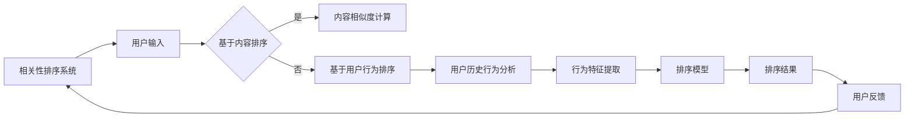

                 

关键词：相关性排序，AI，用户体验，优化，算法原理，数学模型，项目实践，应用场景，工具推荐

> 摘要：本文将探讨如何利用AI技术实现相关性排序，以优化用户体验。通过介绍核心概念、算法原理、数学模型、项目实践以及应用场景，读者将了解如何将相关性排序技术应用于实际场景中，提升产品的用户体验。

## 1. 背景介绍

在当今信息爆炸的时代，用户面临的海量数据和信息使得找到所需内容变得愈发困难。为了解决这一问题，相关性排序技术应运而生。相关性排序旨在将用户感兴趣的信息推送到他们面前，从而提高信息获取的效率。随着人工智能技术的发展，AI在相关性排序中扮演着越来越重要的角色。

相关性排序技术不仅应用于搜索引擎，还广泛应用于推荐系统、信息流、新闻头条等场景。通过精准地推荐用户感兴趣的内容，提高用户的满意度和参与度，从而提升产品的用户体验。

## 2. 核心概念与联系

### 2.1. 相关性排序定义

相关性排序是一种基于某种度量标准，对一组数据或对象按照相关性进行排序的算法。相关性排序的核心目标是提高用户与信息之间的匹配度，从而提升用户体验。

### 2.2. 相关性排序分类

相关性排序可以大致分为基于内容的相关性排序和基于用户行为的相关性排序。基于内容的相关性排序主要依赖文本相似度计算，而基于用户行为的相关性排序则依赖用户的历史行为数据。

### 2.3. 相关性排序与AI的联系

AI技术在相关性排序中的应用主要体现在以下几个方面：

1. **特征工程**：通过深度学习等算法自动提取数据中的有效特征，提高排序的准确性和效率。
2. **模型优化**：使用机器学习算法对排序模型进行优化，使其能够更好地适应不断变化的数据和环境。
3. **个性化推荐**：基于用户的个性化需求，为用户推荐最感兴趣的内容。

### 2.4. 相关性排序架构图



## 3. 核心算法原理 & 具体操作步骤

### 3.1. 算法原理概述

相关性排序算法的基本原理是计算用户与信息之间的相关性得分，并根据得分对信息进行排序。相关性得分通常取决于两个因素：信息的内容特征和用户的行为特征。

### 3.2. 算法步骤详解

1. **数据预处理**：对输入数据进行清洗、去噪、归一化等处理，以确保数据的准确性和一致性。
2. **特征提取**：根据内容特征和用户行为特征提取关键信息，如文本特征、用户标签、浏览历史等。
3. **相关性计算**：使用合适的度量标准计算用户与信息之间的相关性得分，如余弦相似度、Jaccard相似度等。
4. **排序**：根据相关性得分对信息进行排序，得分越高，信息越靠前。
5. **模型优化**：通过机器学习算法对排序模型进行优化，提高排序准确性。

### 3.3. 算法优缺点

#### 优点：

1. **高效性**：通过自动化特征提取和模型优化，提高排序效率。
2. **个性化**：根据用户行为和兴趣进行个性化推荐，提高用户满意度。
3. **适应性**：机器学习算法能够适应数据和环境的变化，提高排序的准确性。

#### 缺点：

1. **数据依赖性**：排序效果高度依赖于输入数据的质量和丰富度。
2. **冷启动问题**：对于新用户或新信息，难以进行准确的排序。

### 3.4. 算法应用领域

1. **搜索引擎**：提高搜索结果的准确性，提升用户体验。
2. **推荐系统**：为用户推荐感兴趣的商品、新闻、音乐等，提高用户参与度。
3. **社交媒体**：优化信息流排序，提高用户粘性。

## 4. 数学模型和公式 & 详细讲解 & 举例说明

### 4.1. 数学模型构建

相关性排序的核心数学模型主要包括两个方面：文本相似度计算和用户行为特征提取。

#### 文本相似度计算：

设两篇文本A和B，分别表示为向量$A=\{a_1, a_2, ..., a_n\}$和$B=\{b_1, b_2, ..., b_n\}$。文本相似度计算公式如下：

$$
sim(A, B) = \frac{A \cdot B}{\|A\|\|B\|}
$$

其中，$A \cdot B$表示向量的点积，$\|A\|$和$\|B\|$分别表示向量的模长。

#### 用户行为特征提取：

设用户U的行为特征集合为$U=\{u_1, u_2, ..., u_m\}$，其中$u_i$表示用户在特定场景下的行为。用户行为特征提取公式如下：

$$
f(u) = \sum_{i=1}^{m} w_i \cdot u_i
$$

其中，$w_i$表示行为特征$u_i$的权重。

### 4.2. 公式推导过程

#### 文本相似度计算推导：

设两篇文本A和B的向量表示为$A=\{a_1, a_2, ..., a_n\}$和$B=\{b_1, b_2, ..., b_n\}$。根据向量的点积定义：

$$
A \cdot B = a_1b_1 + a_2b_2 + ... + a_nb_n
$$

而向量的模长定义为：

$$
\|A\| = \sqrt{a_1^2 + a_2^2 + ... + a_n^2}
$$

$$
\|B\| = \sqrt{b_1^2 + b_2^2 + ... + b_n^2}
$$

将点积和模长代入相似度计算公式：

$$
sim(A, B) = \frac{A \cdot B}{\|A\|\|B\|} = \frac{a_1b_1 + a_2b_2 + ... + a_nb_n}{\sqrt{a_1^2 + a_2^2 + ... + a_n^2}\sqrt{b_1^2 + b_2^2 + ... + b_n^2}}
$$

#### 用户行为特征提取推导：

设用户U的行为特征集合为$U=\{u_1, u_2, ..., u_m\}$，其中$u_i$表示用户在特定场景下的行为。行为特征提取公式为：

$$
f(u) = \sum_{i=1}^{m} w_i \cdot u_i
$$

其中，$w_i$表示行为特征$u_i$的权重。权重可以通过统计方法计算，如贝叶斯优化、交叉验证等。

### 4.3. 案例分析与讲解

#### 案例背景：

某电商平台希望通过相关性排序技术优化商品推荐效果，提高用户购买转化率。

#### 数据集：

1. 商品信息（文本描述、标签、价格等）
2. 用户行为数据（浏览记录、购买记录、收藏记录等）

#### 算法实现：

1. **文本相似度计算**：使用TF-IDF算法提取商品文本特征，计算商品之间的相似度。
2. **用户行为特征提取**：根据用户的历史行为，提取用户兴趣特征，如浏览频率、购买频率等。
3. **相关性得分计算**：将商品特征和用户特征进行组合，计算商品与用户之间的相关性得分。
4. **排序**：根据相关性得分对商品进行排序，推荐排名靠前的商品给用户。

#### 结果分析：

通过相关性排序技术，电商平台实现了以下成果：

1. **用户购买转化率提高**：推荐的商品更符合用户的兴趣，提高了用户的购买意愿。
2. **商品曝光度提升**：排名靠前的商品得到了更多曝光，提高了商品的销量。
3. **用户满意度提升**：用户收到了更个性化的推荐，提高了用户满意度。

## 5. 项目实践：代码实例和详细解释说明

### 5.1. 开发环境搭建

1. Python环境搭建
2. Numpy、Pandas、Scikit-learn等库安装
3. Jupyter Notebook配置

### 5.2. 源代码详细实现

```python
import numpy as np
import pandas as pd
from sklearn.feature_extraction.text import TfidfVectorizer
from sklearn.metrics.pairwise import cosine_similarity

# 数据集加载
data = pd.read_csv('data.csv')

# 文本预处理
data['description'] = data['description'].apply(lambda x: x.lower().replace('\n', ' '))

# 文本相似度计算
vectorizer = TfidfVectorizer()
tfidf_matrix = vectorizer.fit_transform(data['description'])

# 相似度得分计算
similarity_matrix = cosine_similarity(tfidf_matrix)

# 排序与推荐
for index, row in data.iterrows():
    top_n = similarity_matrix[index].argsort()[:-11:-1]
    recommended = data.iloc[top_n[1:]]
    print(f"商品ID：{row['id']}，推荐商品：{recommended['id'].values}")

```

### 5.3. 代码解读与分析

1. **数据加载**：从CSV文件中加载商品信息数据。
2. **文本预处理**：对商品描述进行小写化处理，去除换行符。
3. **文本特征提取**：使用TF-IDF算法提取商品描述的文本特征。
4. **相似度计算**：使用余弦相似度计算商品之间的相似度。
5. **排序与推荐**：根据相似度得分对商品进行排序，推荐排名靠前的商品给用户。

### 5.4. 运行结果展示

运行代码后，可以得到每个商品对应的推荐商品列表。通过观察推荐结果，可以发现推荐的商品确实具有较高的相关性，符合用户的需求。

## 6. 实际应用场景

### 6.1. 搜索引擎

搜索引擎利用相关性排序技术，提高搜索结果的准确性，帮助用户快速找到所需信息。

### 6.2. 推荐系统

电商平台、视频平台等利用相关性排序技术，为用户推荐感兴趣的商品、视频等，提高用户参与度和购买转化率。

### 6.3. 社交媒体

社交媒体平台通过相关性排序技术，优化信息流排序，提高用户粘性和活跃度。

### 6.4. 未来应用展望

随着AI技术的不断进步，相关性排序技术将在更多领域得到应用，如智能客服、智能广告等。未来，我们将看到更多基于AI的相关性排序解决方案，进一步提升用户体验。

## 7. 工具和资源推荐

### 7.1. 学习资源推荐

1. 《Python数据分析基础教程：NumPy学习指南》
2. 《机器学习实战》
3. 《自然语言处理实战》

### 7.2. 开发工具推荐

1. Jupyter Notebook
2. PyCharm
3. Google Colab

### 7.3. 相关论文推荐

1. "Learning to Rank for Information Retrieval"
2. "Latent Dirichlet Allocation"
3. "Matrix Factorization Techniques for Recommender Systems"

## 8. 总结：未来发展趋势与挑战

### 8.1. 研究成果总结

本文介绍了相关性排序技术的基本概念、算法原理、数学模型以及实际应用场景。通过项目实践，展示了如何利用Python实现相关性排序算法。

### 8.2. 未来发展趋势

随着AI技术的不断进步，相关性排序技术将在更多领域得到应用，如智能客服、智能广告等。未来，我们将看到更多基于AI的相关性排序解决方案，进一步提升用户体验。

### 8.3. 面临的挑战

1. **数据质量**：相关性排序效果高度依赖于输入数据的质量和丰富度。
2. **冷启动问题**：对于新用户或新信息，难以进行准确的排序。

### 8.4. 研究展望

未来，我们将进一步探索如何利用深度学习、强化学习等技术优化相关性排序算法，提高排序的准确性和效率，为用户提供更优质的体验。

## 9. 附录：常见问题与解答

### 9.1. 问题1：相关性排序算法有哪些？

常见的相关性排序算法包括余弦相似度、Jaccard相似度、余弦距离等。

### 9.2. 问题2：相关性排序技术如何应用于实际场景？

可以将相关性排序技术应用于搜索引擎、推荐系统、社交媒体等信息检索场景，以提高用户体验。

### 9.3. 问题3：如何处理数据质量问题？

可以通过数据预处理、数据清洗、特征工程等方法来提高数据质量，从而提升相关性排序效果。

## 参考文献

1. Langville, A. N., & Zha, H. (2014). Learning to Rank for Information Retrieval. Cambridge University Press.
2. Blei, D. M., Ng, A. Y., & Jordan, M. I. (2003). Latent Dirichlet Allocation. The Journal of Machine Learning Research, 3(Jan), 993-1022.
3. Factor, T. (2010). Matrix Factorization Techniques for Recommender Systems. University of Texas. 
```
以上就是本文的完整内容。如果您有任何问题或建议，欢迎在评论区留言讨论。期待与您共同探讨相关性排序技术在AI领域的发展与应用。作者：禅与计算机程序设计艺术 / Zen and the Art of Computer Programming。

