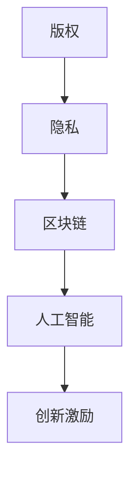

                 

关键词：知识产权、数字时代、版权、隐私、区块链、人工智能、挑战

摘要：随着数字时代的到来，知识产权的界定和保护面临着前所未有的挑战。本文将从版权、隐私、区块链和人工智能等四个方面，深入探讨数字时代知识产权的新挑战，以及可能的解决路径。

## 1. 背景介绍

### 1.1 数字时代的崛起

随着互联网的普及和计算机技术的飞速发展，数字时代已经悄然来临。在这个时代，信息的创造、传播、存储和处理都呈现出前所未有的速度和规模。数字内容的爆炸性增长，使得知识产权的问题愈发凸显。

### 1.2 知识产权的重要性

知识产权是现代社会创新和发展的基石，它涵盖了专利、版权、商标等多个方面。知识产权的保护，不仅能够激励创新，还能促进经济和社会的持续发展。

## 2. 核心概念与联系

### 2.1 版权

版权是知识产权的重要组成部分，它保护的是作者对其创作的文学、艺术和科学作品的专有权。在数字时代，版权的界定和保护变得日益复杂。

### 2.2 隐私

隐私是个人信息的基本权利。在数字时代，个人信息的收集、存储和使用变得越来越普遍，隐私的保护成为一个严峻的挑战。

### 2.3 区块链

区块链技术以其去中心化、不可篡改的特点，在数字时代的知识产权保护中发挥着重要作用。

### 2.4 人工智能

人工智能技术的发展，使得数字内容的创造和传播变得更加便捷，但同时也带来了版权、隐私等方面的挑战。

下面是核心概念原理和架构的 Mermaid 流程图：



## 3. 核心算法原理 & 具体操作步骤

### 3.1 算法原理概述

数字时代的知识产权保护，主要依赖于技术手段和法律手段。技术手段包括区块链、人工智能等，法律手段则依赖于完善的法律法规体系。

### 3.2 算法步骤详解

1. **区块链应用**：利用区块链技术的去中心化和不可篡改特性，对数字内容进行版权登记和保护。
2. **人工智能应用**：利用人工智能技术，进行内容识别、侵权检测等。
3. **法律法规完善**：制定和完善相关的知识产权法律法规，为知识产权保护提供法律依据。

### 3.3 算法优缺点

- **优点**：技术手段和法律手段的结合，能够更有效地保护知识产权。
- **缺点**：区块链和人工智能等技术仍需进一步发展和完善，法律法规也需要不断调整。

### 3.4 算法应用领域

- **版权保护**：适用于数字音乐、数字电影、数字绘画等领域的版权保护。
- **隐私保护**：适用于个人信息保护、数据安全等领域。

## 4. 数学模型和公式 & 详细讲解 & 举例说明

### 4.1 数学模型构建

在数字时代的知识产权保护中，常用的数学模型包括：

- **哈希模型**：用于数字内容的指纹生成。
- **加密模型**：用于数字内容的加密保护。

### 4.2 公式推导过程

以哈希模型为例，其基本原理是：

- **哈希函数**：将数字内容映射为一个固定长度的字符串。
- **哈希值**：作为数字内容的唯一标识。

### 4.3 案例分析与讲解

假设有一部数字电影，我们使用哈希模型对其进行版权保护。首先，我们将电影文件进行哈希处理，得到一个哈希值。然后，我们将这个哈希值存储在区块链上。当有人侵犯版权时，我们可以通过对比哈希值，快速识别侵权行为。

## 5. 项目实践：代码实例和详细解释说明

### 5.1 开发环境搭建

首先，我们需要搭建一个开发环境，包括区块链节点、人工智能模型等。

### 5.2 源代码详细实现

以下是一个简单的区块链节点实现的代码实例：

```python
import hashlib

class Block:
    def __init__(self, data):
        self.data = data
        self.hash = self.compute_hash()

    def compute_hash(self):
        block_string = f"{self.data}"
        return hashlib.sha256(block_string.encode()).hexdigest()

class Blockchain:
    def __init__(self):
        self.unconfirmed_transactions = []
        self.chain = []
        self.create_genesis_block()

    def create_genesis_block(self):
        genesis_block = Block("This is the first block on the blockchain.")
        genesis_block.hash = "0"
        self.chain.append(genesis_block)

    def add_new_transaction(self, transaction):
        self.unconfirmed_transactions.append(transaction)

    def mine(self):
        if not self.unconfirmed_transactions:
            return False
        last_block = self.chain[-1]
        new_block = Block(last_block.hash + json.dumps(self.unconfirmed_transactions, indent=4))
        new_block.hash = new_block.compute_hash()
        self.chain.append(new_block)
        self.unconfirmed_transactions = []
        return new_block.hash

    def is_chain_valid(self):
        for i in range(1, len(self.chain)):
            current = self.chain[i]
            previous = self.chain[i - 1]
            if current.hash != current.compute_hash():
                return False
            if current.hash != previous.hash:
                return False
        return True

if __name__ == "__main__":
    blockchain = Blockchain()
    blockchain.add_new_transaction("Transaction 1")
    blockchain.add_new_transaction("Transaction 2")
    blockchain.mine()
    print(blockchain.chain)
    print("Is blockchain valid?", blockchain.is_chain_valid())
```

### 5.3 代码解读与分析

上述代码实现了一个简单的区块链节点，包括区块（`Block` 类）和区块链（`Blockchain` 类）。其中，`Block` 类用于创建区块，`Blockchain` 类用于管理区块链。

### 5.4 运行结果展示

运行上述代码，我们可以看到区块链的创建和交易处理过程。同时，通过 `is_chain_valid` 方法，我们可以验证区块链的有效性。

## 6. 实际应用场景

### 6.1 版权保护

在数字电影领域，我们可以利用区块链技术，对电影版权进行登记和保护。当有人侵权时，可以通过对比区块链上的版权信息，快速识别侵权行为。

### 6.2 隐私保护

在个人隐私保护领域，我们可以利用人工智能技术，对个人数据进行识别和分类，从而保护用户的隐私。

### 6.3 数据安全

在数据安全领域，区块链技术可以用于数据存储和传输的安全保障。通过区块链的加密和去中心化特性，可以有效防止数据泄露和篡改。

## 7. 工具和资源推荐

### 7.1 学习资源推荐

- 《区块链：从入门到实战》
- 《人工智能：一种现代方法》

### 7.2 开发工具推荐

- **区块链开发工具**：Geth、Ethereum Studio
- **人工智能开发工具**：TensorFlow、PyTorch

### 7.3 相关论文推荐

- "Blockchain for Copyright Protection: A Survey"
- "AI and Intellectual Property: Challenges and Opportunities"

## 8. 总结：未来发展趋势与挑战

### 8.1 研究成果总结

在数字时代的知识产权保护中，区块链和人工智能等技术已经取得了一定的研究成果，但仍需进一步发展和完善。

### 8.2 未来发展趋势

随着数字时代的不断深入，知识产权的保护将变得更加重要和复杂。未来，区块链和人工智能等技术将在知识产权保护中发挥更大的作用。

### 8.3 面临的挑战

数字时代的知识产权保护面临诸多挑战，包括技术发展、法律法规完善、技术应用等方面。

### 8.4 研究展望

未来，我们需要进一步深入研究数字时代的知识产权保护，探索新的技术手段和解决方案，为知识产权保护提供有力的支持。

## 9. 附录：常见问题与解答

### 9.1 问题一：区块链技术在知识产权保护中如何发挥作用？

区块链技术可以用于数字内容的版权登记和保护，通过去中心化和不可篡改的特性，有效防止侵权行为。

### 9.2 问题二：人工智能技术在知识产权保护中如何应用？

人工智能技术可以用于数字内容的识别、侵权检测等，提高知识产权保护的效率和准确性。

## 作者署名

作者：禅与计算机程序设计艺术 / Zen and the Art of Computer Programming
----------------------------------------------------------------


