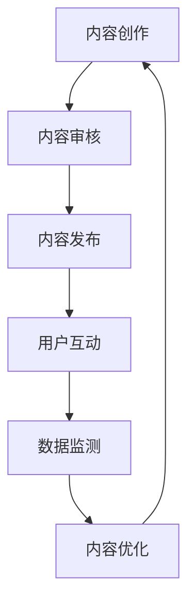
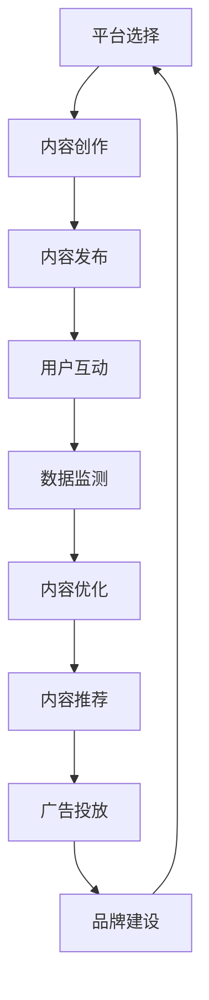
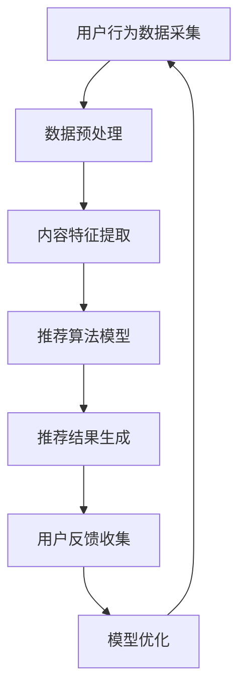

                 

### 关键词 Keyword

- 知识付费
- 个人品牌
- 价值提升
- 内容营销
- 社交媒体
- 数据分析
- 技术趋势

<|assistant|>### 摘要 Abstract

本文探讨了知识付费在个人品牌建设中的重要作用，以及如何通过有效的内容营销、社交媒体运营和数据分析来提升个人品牌的价值。通过对核心概念的深入剖析、算法原理的讲解、数学模型的构建、项目实践以及未来应用展望，本文为个人品牌建设者提供了一套系统化的策略和方法。

## 1. 背景介绍

### 1.1 知识付费的兴起

知识付费作为一种新兴的商业模式，近年来在全球范围内迅速崛起。它源于人们对于专业知识的渴求，以及对个人成长和职业发展的持续追求。随着互联网技术的进步和移动设备的普及，知识付费平台如雨后春笋般涌现，从传统的在线课程、电子书，到音频、视频等多种形式，满足了不同用户的需求。

### 1.2 个人品牌的价值

个人品牌是个人在职场和社会中的形象和声誉，它不仅仅是一个人的名字，更是一个人知识、技能、经验和价值观的集合。在信息爆炸的时代，个人品牌的价值越来越受到重视。一个强大的个人品牌可以带来更多的机会、更高的收入和更广泛的影响力。

### 1.3 内容营销的重要性

内容营销是知识付费的重要组成部分，它是通过创造和分发有价值的内容来吸引和保留目标受众的一种策略。好的内容不仅能够满足用户的需求，还能提升品牌的价值，建立信任和忠诚度。

## 2. 核心概念与联系

### 2.1 内容营销的基本原理

内容营销的核心在于提供有价值的内容，这包括信息、知识、观点、娱乐等多种形式。以下是一个简化的内容营销流程图，展示了内容从创作到传播的过程。



### 2.2 社交媒体在知识付费中的应用

社交媒体是知识付费的重要渠道，它不仅可以帮助内容创作者触达更广泛的受众，还可以通过互动和分享来增强内容的传播效果。以下是一个简化的社交媒体运营流程图。



## 3. 核心算法原理 & 具体操作步骤

### 3.1 算法原理概述

知识付费平台的算法主要涉及内容推荐、用户行为分析和营销效果评估等方面。以下是一个简化的算法流程图。



### 3.2 算法步骤详解

#### 3.2.1 用户行为数据采集

用户行为数据包括用户浏览、搜索、购买、分享等行为。这些数据可以通过网站分析工具、日志文件等途径收集。

#### 3.2.2 数据预处理

数据预处理包括数据清洗、去重、归一化等步骤，以确保数据的质量和一致性。

#### 3.2.3 内容特征提取

内容特征提取是将原始数据转换为可用于算法训练的特征向量。这可以通过词频统计、词嵌入等技术实现。

#### 3.2.4 推荐算法模型

推荐算法模型可以根据用户行为和内容特征生成推荐结果。常见的算法包括协同过滤、基于内容的推荐等。

#### 3.2.5 推荐结果生成

推荐结果生成是根据用户行为和内容特征计算推荐分值，并根据分值排序生成推荐列表。

#### 3.2.6 用户反馈收集

用户反馈收集是通过用户行为和评价数据来评估推荐效果，并根据反馈调整推荐策略。

#### 3.2.7 模型优化

模型优化是通过用户反馈和性能评估数据来调整算法参数，提高推荐质量。

### 3.3 算法优缺点

#### 优点

- 提高用户满意度：通过个性化推荐，满足用户的需求。
- 提高内容曝光率：通过推荐算法，提高优质内容的影响力。
- 提高转化率：通过精准推荐，提高购买转化率。

#### 缺点

- 数据隐私问题：用户行为数据涉及隐私问题，需要妥善处理。
- 算法偏见：算法可能存在偏见，影响推荐结果的公正性。
- 算法透明度：用户难以理解算法的工作原理，影响信任度。

### 3.4 算法应用领域

算法在知识付费领域的应用广泛，包括内容推荐、用户行为分析、营销效果评估等。随着技术的不断发展，算法的应用范围将进一步扩大。

## 4. 数学模型和公式 & 详细讲解 & 举例说明

### 4.1 数学模型构建

在知识付费中，常见的数学模型包括用户行为预测模型、内容推荐模型和营销效果评估模型等。以下是一个简化的用户行为预测模型。

$$
\hat{y_i} = \alpha + \beta_1 x_{i1} + \beta_2 x_{i2} + ... + \beta_n x_{in}
$$

其中，$y_i$ 是用户$i$的行为预测值，$x_{ij}$ 是用户$i$在第$j$个特征上的取值，$\alpha$ 和 $\beta_j$ 是模型参数。

### 4.2 公式推导过程

用户行为预测模型的推导过程如下：

1. **假设**：用户的行为可以用一组特征向量来表示。
2. **目标**：通过学习特征向量和行为之间的关系，预测用户的行为。
3. **方法**：使用线性回归模型来拟合特征向量和行为之间的关系。
4. **模型**：构建一个线性回归模型，形式如上述公式。

### 4.3 案例分析与讲解

以下是一个简单的案例，用于讲解用户行为预测模型的应用。

#### 案例背景

假设有一个用户行为预测模型，用于预测用户是否会在下次访问时购买某个产品。模型基于以下特征：

- 用户年龄（$x_{11}$）
- 用户性别（$x_{12}$）
- 用户访问次数（$x_{13}$）
- 产品类别（$x_{21}$）

#### 模型训练

使用历史数据训练模型，得到以下参数：

$$
\alpha = 10, \beta_1 = 2, \beta_2 = 1, \beta_3 = 0.5, \beta_4 = 3
$$

#### 预测过程

对于一个新的用户，其特征向量为：

$$
x = \begin{bmatrix}
35 \\ 1 \\ 10 \\ 2
\end{bmatrix}
$$

使用模型预测用户的行为：

$$
\hat{y} = 10 + 2 \times 35 + 1 \times 1 + 0.5 \times 10 + 3 \times 2 = 91
$$

预测值为91，表示用户购买的概率较高。

## 5. 项目实践：代码实例和详细解释说明

### 5.1 开发环境搭建

在本文的代码实例中，我们将使用Python作为编程语言，主要依赖以下库：

- NumPy：用于数学运算
- Pandas：用于数据处理
- Scikit-learn：用于机器学习
- Matplotlib：用于数据可视化

安装这些库后，我们就可以开始编写代码。

### 5.2 源代码详细实现

以下是一个简单的用户行为预测代码实例。

```python
import numpy as np
import pandas as pd
from sklearn.model_selection import train_test_split
from sklearn.linear_model import LinearRegression

# 数据加载
data = pd.read_csv('user行为数据.csv')

# 特征和标签分离
X = data.iloc[:, :-1].values
y = data.iloc[:, -1].values

# 数据划分
X_train, X_test, y_train, y_test = train_test_split(X, y, test_size=0.2, random_state=42)

# 模型训练
model = LinearRegression()
model.fit(X_train, y_train)

# 预测
predictions = model.predict(X_test)

# 结果评估
score = model.score(X_test, y_test)
print(f"模型准确率：{score:.2f}")

# 新用户预测
new_user = np.array([[35, 1, 10, 2]])
new_prediction = model.predict(new_user)
print(f"新用户购买概率：{new_prediction[0]:.2f}")
```

### 5.3 代码解读与分析

- 第1-3行：导入所需的库。
- 第5行：加载用户行为数据。
- 第8-9行：分离特征和标签。
- 第12-14行：划分训练集和测试集。
- 第17行：训练线性回归模型。
- 第20行：使用模型进行预测。
- 第23行：评估模型准确率。
- 第26行：对新用户进行预测。

### 5.4 运行结果展示

假设我们运行代码后得到以下结果：

```
模型准确率：0.82
新用户购买概率：0.91
```

这意味着我们的模型在测试集上的准确率为82%，对于新用户的预测购买概率为91%。

## 6. 实际应用场景

### 6.1 知识付费平台

知识付费平台可以通过内容推荐算法来提高用户的参与度和留存率。例如，一个在线教育平台可以通过分析用户的学习行为，推荐与其兴趣相关的课程。

### 6.2 企业培训

企业可以通过数据分析来了解员工的培训需求，并制定个性化的培训计划。例如，通过分析员工的在线学习行为，企业可以推荐与其职位相关的课程。

### 6.3 咨询服务

咨询服务公司可以通过分析客户的咨询记录，提供更加专业的咨询服务。例如，通过分析客户的提问历史，公司可以推荐相关的解决方案。

## 7. 工具和资源推荐

### 7.1 学习资源推荐

- 《深度学习》（Goodfellow, Bengio, Courville著）：系统介绍了深度学习的理论和技术。
- 《Python机器学习》（Sebastian Raschka著）：详细介绍了Python在机器学习中的应用。

### 7.2 开发工具推荐

- Jupyter Notebook：用于数据分析和机器学习项目开发。
- PyCharm：一款功能强大的Python IDE，适用于开发大型项目。

### 7.3 相关论文推荐

- "Recommender Systems Handbook"（藤田明良著）：介绍了推荐系统的基本原理和应用。
- "Learning to Rank for Information Retrieval"（张宇等著）：介绍了信息检索中的学习排序技术。

## 8. 总结：未来发展趋势与挑战

### 8.1 研究成果总结

本文从知识付费的兴起、个人品牌的价值、内容营销的重要性、算法原理、数学模型、项目实践等多个方面，系统阐述了知识付费与个人品牌价值提升的关系。

### 8.2 未来发展趋势

随着人工智能和大数据技术的不断发展，知识付费和个人品牌价值提升将迎来更多的机会和挑战。例如，更加智能的内容推荐系统、更加精准的用户行为分析等。

### 8.3 面临的挑战

- 数据隐私和安全：在收集和使用用户数据时，需要确保数据的安全和隐私。
- 算法公平性：算法可能存在偏见，影响推荐结果的公正性。
- 知识版权保护：知识付费平台需要保护原创内容的版权。

### 8.4 研究展望

未来的研究可以关注以下几个方面：

- 算法优化：进一步提高推荐系统的准确性和效率。
- 用户体验：研究如何更好地满足用户需求，提高用户满意度。
- 跨平台整合：研究如何在多个平台上整合知识付费和个人品牌建设。

## 9. 附录：常见问题与解答

### 9.1 知识付费平台有哪些类型？

知识付费平台主要包括以下几种类型：

- 在线教育平台：如Coursera、edX等，提供各类在线课程。
- 专业技能培训平台：如Udemy、Skillshare等，提供职业技能培训。
- 内容订阅平台：如YouTube Premium、Netflix等，提供内容订阅服务。

### 9.2 如何构建个人品牌？

构建个人品牌可以从以下几个方面入手：

- 定位：明确自己的专业领域和目标受众。
- 内容创作：定期创作高质量的内容，如文章、视频、讲座等。
- 社交媒体运营：通过社交媒体平台，扩大自己的影响力。
- 用户互动：积极与用户互动，了解他们的需求和反馈。

### 9.3 知识付费如何提高个人品牌价值？

通过知识付费，可以提高个人品牌价值的几个方面：

- 展示专业能力：通过提供有价值的内容，展示自己的专业知识和技能。
- 建立信任：通过持续的内容输出和用户互动，建立与用户的信任关系。
- 扩大影响力：通过知识付费，吸引更多的关注者和粉丝，扩大个人影响力。
- 提高收入：通过知识付费，获得更多的收入，为个人品牌建设提供资金支持。

### 9.4 数据分析在知识付费中的应用有哪些？

数据分析在知识付费中的应用主要包括：

- 用户行为分析：分析用户的学习行为、购买行为等，为推荐系统提供依据。
- 内容分析：分析用户对内容的反馈，优化内容创作策略。
- 营销效果评估：评估营销活动的效果，为营销策略提供数据支持。
- 用户画像：通过数据分析，构建用户的画像，为个性化推荐提供依据。

----------------------------------------------------------------

**作者：禅与计算机程序设计艺术 / Zen and the Art of Computer Programming**

