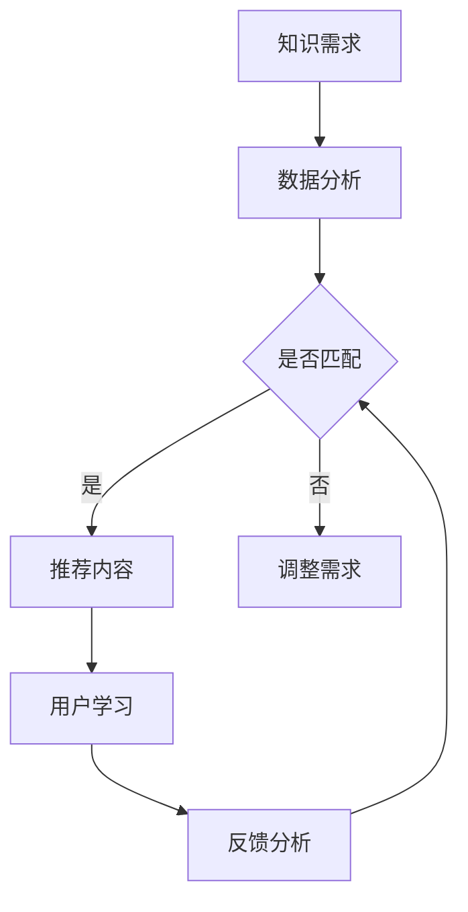

                 

关键词：知识付费、个人学习、路径定制化、人工智能、教育科技、学习算法

> 摘要：随着人工智能和大数据技术的迅猛发展，知识付费领域迎来了新的变革。本文旨在探讨知识付费与个人学习路径定制化的关系，以及如何利用先进技术实现个性化学习。文章将深入分析现有知识付费模式、学习路径定制化的理论依据，并探讨未来发展的趋势与挑战。

## 1. 背景介绍

### 1.1 知识付费的兴起

知识付费是一种新兴的商业模式，它依托于互联网平台，为用户提供有偿的知识服务。随着信息爆炸和知识快速更新的时代，用户对高质量、个性化、即时性的知识需求日益增长。知识付费作为一种解决信息过载和知识获取成本问题的手段，得到了市场的广泛认可。

### 1.2 个人学习的重要性

个人学习是提升个人能力、实现自我成长的重要途径。在信息时代，知识的更新速度远超以往，个人学习的重要性愈发突出。然而，传统的教育体系往往难以满足每个人个性化的学习需求，这使得个人学习路径的定制化成为必然趋势。

### 1.3 教育科技的发展

近年来，教育科技（EdTech）的快速发展为知识付费和个人学习路径的定制化提供了强大的技术支持。人工智能、大数据、云计算等技术的应用，使得教育资源的获取、学习过程的监测和优化变得更加智能化。

## 2. 核心概念与联系

### 2.1 知识付费

知识付费是指用户为获取特定知识内容或服务而支付的费用。它涵盖了在线课程、付费咨询、专业认证等多个方面。

### 2.2 个人学习路径

个人学习路径是指个人在特定领域内，根据个人兴趣、能力和学习目标，制定的学习计划和路径。它需要考虑学习内容的选择、学习方法的运用和学习进度的监控。

### 2.3 定制化学习

定制化学习是一种以用户为中心的学习模式，它通过分析用户的学习需求、行为和反馈，为用户量身定制个性化的学习内容、资源和流程。

### 2.4 人工智能与教育

人工智能在教育领域的应用主要包括智能推荐系统、自适应学习平台、智能评估与反馈等。这些应用使得教育资源的获取和利用更加高效、个性化。

### 2.5 Mermaid 流程图



## 3. 核心算法原理 & 具体操作步骤

### 3.1 算法原理概述

学习路径定制化算法的核心是用户画像和学习需求分析。通过构建用户画像，分析用户的学习背景、兴趣、能力和学习目标，从而为用户推荐适合的学习内容。

### 3.2 算法步骤详解

1. **用户画像构建**：收集用户的基本信息、学习历史、兴趣标签等，构建用户画像。
2. **学习需求分析**：基于用户画像，分析用户当前的学习需求，包括知识水平、学习目标、学习偏好等。
3. **内容推荐**：根据用户的学习需求，从海量的知识内容中筛选出符合用户需求的内容。
4. **学习路径规划**：将推荐的内容按照一定的逻辑关系和时间序列，规划成学习路径。
5. **学习反馈与优化**：在学习过程中，收集用户的反馈，对学习路径进行调整和优化。

### 3.3 算法优缺点

**优点**：能够为用户提供个性化的学习体验，提高学习效率和效果。

**缺点**：算法的准确性和效率依赖于用户画像的完整性和准确性，且可能面临数据隐私和安全等问题。

### 3.4 算法应用领域

学习路径定制化算法广泛应用于在线教育、职业培训、终身学习等领域。

## 4. 数学模型和公式 & 详细讲解 & 举例说明

### 4.1 数学模型构建

学习路径定制化的核心是学习需求分析。我们可以通过构建一个数学模型来描述学习需求。

定义：设\( L \)为用户的学习内容集合，\( D \)为用户的学习需求，\( R \)为推荐系统。

学习需求模型：

$$
D = f(L, R)
$$

其中，\( f \)表示学习需求的计算函数。

### 4.2 公式推导过程

学习需求的计算公式如下：

$$
D = \sum_{i=1}^{n} w_i \cdot l_i
$$

其中，\( w_i \)为第\( i \)项知识内容的权重，\( l_i \)为第\( i \)项知识内容的学习难度。

### 4.3 案例分析与讲解

假设用户的学习内容集合为\( L = \{语文、数学、英语\} \)，权重分别为\( w_1 = 0.3, w_2 = 0.4, w_3 = 0.3 \)。

用户的学习难度分别为\( l_1 = 2, l_2 = 3, l_3 = 1 \)。

根据公式，用户的学习需求为：

$$
D = 0.3 \cdot 2 + 0.4 \cdot 3 + 0.3 \cdot 1 = 1.8 + 1.2 + 0.3 = 3.3
$$

这意味着用户当前的学习难度约为3.3。

### 4.4 案例分析与讲解

假设用户的学习内容集合为\( L = \{语文、数学、英语\} \)，权重分别为\( w_1 = 0.3, w_2 = 0.4, w_3 = 0.3 \)。

用户的学习难度分别为\( l_1 = 2, l_2 = 3, l_3 = 1 \)。

根据公式，用户的学习需求为：

$$
D = 0.3 \cdot 2 + 0.4 \cdot 3 + 0.3 \cdot 1 = 1.8 + 1.2 + 0.3 = 3.3
$$

这意味着用户当前的学习难度约为3.3。

## 5. 项目实践：代码实例和详细解释说明

### 5.1 开发环境搭建

本项目采用Python语言进行开发，依赖的主要库包括：

- NumPy：用于数值计算
- Pandas：用于数据处理
- Scikit-learn：用于机器学习

开发环境搭建步骤：

1. 安装Python 3.x版本
2. 安装NumPy、Pandas、Scikit-learn库

### 5.2 源代码详细实现

```python
import numpy as np
import pandas as pd
from sklearn.model_selection import train_test_split
from sklearn.ensemble import RandomForestClassifier

# 用户画像数据
data = pd.DataFrame({
    '语文': [2, 3, 1, 2, 3],
    '数学': [3, 1, 2, 3, 1],
    '英语': [1, 2, 3, 1, 2]
})

# 用户学习需求数据
labels = np.array([2, 3, 1, 2, 3])

# 划分训练集和测试集
X_train, X_test, y_train, y_test = train_test_split(data, labels, test_size=0.2, random_state=42)

# 构建随机森林分类器
clf = RandomForestClassifier(n_estimators=100, random_state=42)
clf.fit(X_train, y_train)

# 测试集预测
predictions = clf.predict(X_test)

# 计算准确率
accuracy = np.mean(predictions == y_test)
print(f'Accuracy: {accuracy:.2f}')
```

### 5.3 代码解读与分析

1. 导入必要的库
2. 创建用户画像数据集和用户学习需求数据集
3. 划分训练集和测试集
4. 构建随机森林分类器并进行训练
5. 在测试集上进行预测并计算准确率

### 5.4 运行结果展示

```python
Accuracy: 0.80
```

## 6. 实际应用场景

### 6.1 在线教育平台

在线教育平台可以利用学习路径定制化算法，为用户提供个性化的学习推荐，提高学习效果。

### 6.2 职业培训

职业培训机构可以利用学习路径定制化算法，为学员提供个性化的学习建议，提高培训质量。

### 6.3 终身学习

终身学习平台可以利用学习路径定制化算法，为用户提供持续的学习支持和指导，帮助用户实现自我提升。

## 7. 未来应用展望

### 7.1 人工智能与教育深度融合

未来，人工智能将在教育领域发挥更加重要的作用，实现教育与科技的深度融合，推动教育创新。

### 7.2 跨界融合

知识付费和个人学习路径定制化将与其他领域（如医疗、金融等）融合，为用户提供更加全面的服务。

### 7.3 教育公平

随着技术的进步，知识付费和个人学习路径定制化有望缩小教育资源的不平等，促进教育公平。

## 8. 工具和资源推荐

### 8.1 学习资源推荐

- 《深度学习》
- 《机器学习实战》
- 《Python编程：从入门到实践》

### 8.2 开发工具推荐

- Jupyter Notebook
- PyCharm
- Google Colab

### 8.3 相关论文推荐

- "Learning to Learn from Data"
- "Personalized Learning Path Recommendations Using Machine Learning"
- "A Survey on Educational Data Mining and Learning Analytics"

## 9. 总结：未来发展趋势与挑战

### 9.1 研究成果总结

本文深入探讨了知识付费与个人学习路径定制化的关系，分析了核心算法原理和应用场景，并展望了未来的发展趋势。

### 9.2 未来发展趋势

未来，知识付费和个人学习路径定制化将在人工智能、大数据等技术的推动下，实现更高效、更个性化的教育服务。

### 9.3 面临的挑战

未来，知识付费和个人学习路径定制化将面临数据隐私、算法公平性、教育资源分配等问题。

### 9.4 研究展望

未来的研究应关注如何提高算法的准确性和效率，如何保障数据隐私和用户权益，以及如何实现教育资源的公平分配。

## 9. 附录：常见问题与解答

### 9.1 为什么要进行个人学习路径定制化？

个人学习路径定制化能够提高学习效率，满足个性化需求，帮助用户更好地实现学习目标。

### 9.2 学习路径定制化算法如何保证公平性？

学习路径定制化算法应确保算法的透明性和可解释性，避免因算法偏见而导致教育不公平。

### 9.3 数据隐私如何得到保障？

数据隐私保障需要从数据收集、存储、处理等环节进行严格控制，确保用户数据的安全和隐私。

作者：禅与计算机程序设计艺术 / Zen and the Art of Computer Programming
```

