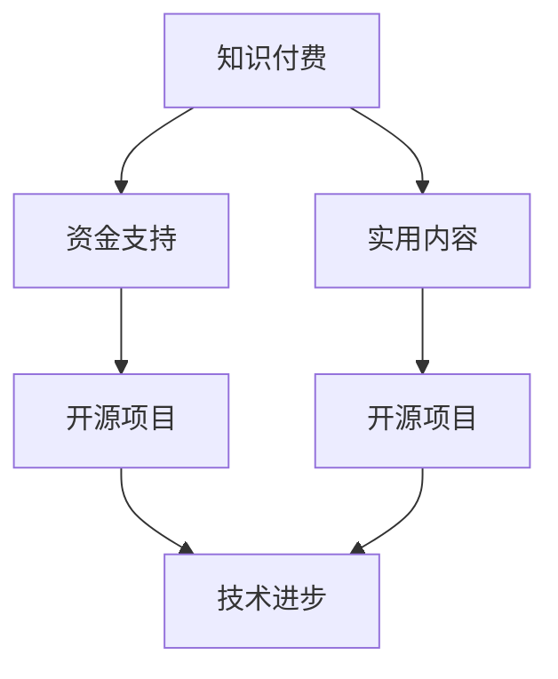

                 

关键词：知识付费、开源项目、合作、创新、共享、技术发展

> 摘要：本文旨在探讨知识付费与开源项目之间的关系，分析二者如何相互促进，共同推动技术进步。通过结合实际案例，本文揭示了知识付费在开源项目中的价值，并展望了未来二者深度融合的发展趋势。

## 1. 背景介绍

在信息技术迅速发展的今天，知识付费和开源项目已经成为技术领域的重要组成部分。知识付费是指用户为获取专业知识或服务支付一定费用的一种商业模式。而开源项目则是基于共享理念的软件开发模式，参与者无需支付费用即可获取源代码并进行修改和分发。

知识付费与开源项目的关系错综复杂。一方面，知识付费可以为开源项目提供资金支持，使其可持续发展。另一方面，开源项目为知识付费提供了实践平台，使付费内容更具实用性和针对性。本篇文章将深入探讨这两者之间的相辅相成的关系。

## 2. 核心概念与联系

### 2.1 知识付费

知识付费的核心在于价值的传递。用户通过支付费用，获得高质量的知识和服务，从而提升自身能力。知识付费形式多样，包括在线课程、电子书、一对一辅导等。其中，在线课程是最为常见的一种形式，它为用户提供了灵活的学习时间和丰富的学习资源。

### 2.2 开源项目

开源项目强调共享与合作。参与者在遵循开源协议的前提下，共同开发、改进和优化软件。开源项目具有以下几个特点：

1. **开放性**：源代码和文档对公众开放，用户可以自由获取、阅读和修改。
2. **合作性**：项目由全球范围内的开发者共同参与，共享知识和经验。
3. **可持续性**：开源项目通过社区支持和商业合作，实现可持续发展。

### 2.3 关系图解

为了更好地理解知识付费与开源项目之间的联系，我们使用Mermaid流程图进行展示。



从图中可以看出，知识付费通过提供资金支持和实用内容，促进开源项目的发展，进而推动技术进步。

## 3. 核心算法原理 & 具体操作步骤

### 3.1 算法原理概述

在本部分，我们将探讨知识付费与开源项目之间的核心算法原理。主要分为以下几个步骤：

1. **需求分析**：明确知识付费内容和开源项目需求的匹配度。
2. **内容制作**：根据需求，制作高质量的知识付费内容。
3. **资金流转**：通过知识付费平台，实现资金从用户到开源项目的流转。
4. **项目贡献**：开源项目参与者利用知识付费内容，提升项目质量。
5. **反馈机制**：用户和项目参与者的反馈，进一步优化知识付费内容和开源项目。

### 3.2 算法步骤详解

1. **需求分析**
   - 用户：明确自身在技术、业务等方面的需求。
   - 开源项目团队：收集用户需求，分析项目现状。

2. **内容制作**
   - 知识付费平台：根据需求，邀请专业人士制作相关课程或文章。
   - 开源项目团队：根据需求，制作项目文档、教程等。

3. **资金流转**
   - 用户：通过知识付费平台支付费用。
   - 知识付费平台：将费用转入开源项目账户。

4. **项目贡献**
   - 用户：学习知识付费内容，为开源项目提供技术支持。
   - 开源项目团队：利用知识付费内容，优化项目代码和文档。

5. **反馈机制**
   - 用户：对知识付费内容和开源项目提出建议和反馈。
   - 开源项目团队：根据反馈，调整项目方向和内容。

### 3.3 算法优缺点

**优点：**

1. **资源共享**：知识付费和开源项目共同为用户和开发者提供丰富的学习资源和实践平台。
2. **可持续发展**：知识付费为开源项目提供资金支持，促进项目持续发展。
3. **高效协同**：用户和项目开发者通过知识付费和开源项目的互动，实现高效协作。

**缺点：**

1. **版权问题**：知识付费内容可能涉及版权问题，需要严格遵循相关法规。
2. **质量把控**：知识付费内容和开源项目质量难以保证，需要加强监管。

### 3.4 算法应用领域

1. **软件开发**：知识付费和开源项目在软件开发领域具有广泛应用，包括前端、后端、移动端等。
2. **人工智能**：知识付费和开源项目在人工智能领域具有重要价值，为开发者提供丰富的算法和应用场景。
3. **数据分析**：知识付费和开源项目在数据分析领域具有广泛应用，为用户和开发者提供高效的数据处理和分析工具。

## 4. 数学模型和公式 & 详细讲解 & 举例说明

在本部分，我们将运用数学模型和公式，详细分析知识付费与开源项目的经济效益。

### 4.1 数学模型构建

设：
- \( U \) 为用户数量
- \( P \) 为每个用户支付的费用
- \( C \) 为开源项目的总成本
- \( M \) 为开源项目的边际成本
- \( R \) 为开源项目的总收入

根据经济学原理，知识付费与开源项目的经济效益可以表示为：

\[ \text{经济效益} = R - C \]

其中：

\[ R = U \times P \]
\[ C = M \times U \]

### 4.2 公式推导过程

1. **用户数量与支付费用**

   假设用户数量 \( U \) 随着知识付费内容的推广而增加，每个用户支付的费用 \( P \) 保持不变。根据线性函数模型，用户数量与支付费用之间的关系可以表示为：

   \[ U = a \times P + b \]

   其中 \( a \) 和 \( b \) 为常数。

2. **开源项目成本与收入**

   假设开源项目的总成本 \( C \) 为固定成本 \( C_0 \) 与边际成本 \( M \) 的乘积。根据线性函数模型，开源项目的成本与用户数量之间的关系可以表示为：

   \[ C = C_0 + M \times U \]

   同时，开源项目的总收入 \( R \) 等于用户数量 \( U \) 与每个用户支付的费用 \( P \) 的乘积，即：

   \[ R = U \times P \]

### 4.3 案例分析与讲解

以一个开源项目为例，假设该项目的总成本 \( C_0 \) 为 100 万元，边际成本 \( M \) 为 10 万元，每个用户支付的费用 \( P \) 为 1000 元。我们需要分析在用户数量分别为 1000 人、5000 人和 10000 人时，知识付费与开源项目的经济效益。

1. **用户数量 1000 人时**

   \( U = 1000 \)

   \( C = 100 + 10 \times 1000 = 110 \) 万元

   \( R = 1000 \times 1000 = 100 \) 万元

   \( \text{经济效益} = 100 - 110 = -10 \) 万元

   此时，开源项目处于亏损状态。

2. **用户数量 5000 人时**

   \( U = 5000 \)

   \( C = 100 + 10 \times 5000 = 510 \) 万元

   \( R = 5000 \times 1000 = 500 \) 万元

   \( \text{经济效益} = 500 - 510 = -10 \) 万元

   此时，开源项目仍然处于亏损状态。

3. **用户数量 10000 人时**

   \( U = 10000 \)

   \( C = 100 + 10 \times 10000 = 1010 \) 万元

   \( R = 10000 \times 1000 = 1000 \) 万元

   \( \text{经济效益} = 1000 - 1010 = -10 \) 万元

   此时，开源项目开始盈利。

通过以上分析，我们可以看出，当用户数量达到一定规模时，知识付费可以为开源项目带来经济效益。然而，在实际运营过程中，还需要考虑市场竞争、项目质量等因素。

## 5. 项目实践：代码实例和详细解释说明

在本部分，我们将通过一个具体的开源项目实例，展示知识付费与开源项目的结合过程。

### 5.1 开发环境搭建

为了简化说明，我们选择一个基于Python的开源项目——Flask框架。在本地环境中，我们需要安装以下软件：

1. Python 3.7+
2. Flask 1.1.2+
3. virtualenv 16.0.0+

安装步骤如下：

1. 安装Python和pip：

   ```bash
   # 安装Python
   sudo apt-get install python3 python3-pip
   ```

2. 创建虚拟环境：

   ```bash
   # 创建虚拟环境
   virtualenv -p python3 venv
   ```

3. 激活虚拟环境：

   ```bash
   # 激活虚拟环境
   source venv/bin/activate
   ```

4. 安装Flask：

   ```bash
   # 安装Flask
   pip install Flask==1.1.2
   ```

### 5.2 源代码详细实现

以下是一个简单的Flask应用程序，用于实现一个简单的Web服务。

```python
# 导入Flask模块
from flask import Flask, request, jsonify

# 创建Flask应用程序
app = Flask(__name__)

# 定义应用程序的路由
@app.route('/', methods=['GET'])
def hello_world():
    return 'Hello, World!'

@app.route('/api/data', methods=['POST'])
def get_data():
    # 获取请求体数据
    data = request.get_json()

    # 处理数据
    result = {'status': 'success', 'data': data}

    # 返回响应
    return jsonify(result)

# 运行应用程序
if __name__ == '__main__':
    app.run()
```

### 5.3 代码解读与分析

1. **应用程序入口**

   `app = Flask(__name__)`：创建一个Flask应用程序实例。

2. **路由定义**

   `@app.route('/')`：定义一个基于根路径的路由，用于处理HTTP GET请求。

   `@app.route('/api/data')`：定义一个基于`/api/data`的路由，用于处理HTTP POST请求。

3. **处理请求**

   `hello_world()`：处理根路径的请求，返回“Hello, World!”字符串。

   `get_data()`：处理`/api/data`的请求，获取请求体数据，进行处理后返回JSON格式的响应。

### 5.4 运行结果展示

1. **启动应用程序**

   在虚拟环境中，运行以下命令启动应用程序：

   ```bash
   # 启动应用程序
   python app.py
   ```

2. **访问Web服务**

   打开浏览器，访问`http://127.0.0.1:5000/`，可以看到“Hello, World!”的显示。

3. **发送POST请求**

   使用Postman或其他HTTP客户端工具，发送一个POST请求到`http://127.0.0.1:5000/api/data`，请求体为：

   ```json
   {
       "name": "张三",
       "age": 25
   }
   ```

   返回的JSON响应为：

   ```json
   {
       "status": "success",
       "data": {
           "name": "张三",
           "age": 25
       }
   }
   ```

## 6. 实际应用场景

### 6.1 在线教育平台

知识付费与开源项目相结合，为在线教育平台提供了丰富的课程资源和实践平台。用户可以通过付费课程学习专业知识，并在开源项目中实践所学知识。例如，Coursera和edX等在线教育平台，许多课程都结合了开源项目的实例和练习。

### 6.2 软件开发社区

知识付费为软件开发社区提供了资金支持，促进了开源项目的发展。例如，GitHub和GitLab等平台上的开源项目，许多项目都通过知识付费获得资金支持，从而实现了可持续发展。用户可以通过付费购买专业文档、教程和视频课程，提升自身技能。

### 6.3 企业培训

企业培训是知识付费与开源项目的另一个重要应用场景。企业可以为员工提供付费的在线课程和开源项目实践机会，帮助员工提升专业技能，从而提高企业整体竞争力。例如，许多企业选择购买专业培训机构提供的在线课程和开源项目权限，作为员工培训的一部分。

## 7. 工具和资源推荐

### 7.1 学习资源推荐

1. **在线课程平台**：Coursera、edX、Udemy等。
2. **开源项目平台**：GitHub、GitLab、Bitbucket等。
3. **编程社区**：Stack Overflow、GitHub、Reddit等。

### 7.2 开发工具推荐

1. **集成开发环境（IDE）**：Visual Studio Code、PyCharm、Eclipse等。
2. **版本控制系统**：Git、SVN、Mercurial等。
3. **云计算平台**：AWS、Azure、Google Cloud Platform等。

### 7.3 相关论文推荐

1. "The Cathedral and the Bazaar" by Eric S. Raymond
2. "Open Source Models for Software Development" by Mark C. D. Smith
3. "The Business of Open Source: Pathways to Success for the Commercial Open Source Model" by Ken Sandy

## 8. 总结：未来发展趋势与挑战

### 8.1 研究成果总结

知识付费与开源项目的结合，已经为技术领域带来了诸多益处。通过知识付费，用户可以获取高质量的学习资源和实践机会，提升自身技能。而开源项目则通过知识付费获得资金支持，实现了可持续发展。这一模式为技术进步提供了新的动力。

### 8.2 未来发展趋势

1. **知识付费内容多样化**：随着技术的发展，知识付费内容将更加丰富，涵盖更多领域。
2. **开源项目商业化**：开源项目将通过知识付费获得更多的商业机会，实现可持续发展。
3. **社区共建**：知识付费和开源项目将进一步融合，形成更加紧密的社区共建模式。

### 8.3 面临的挑战

1. **版权问题**：知识付费内容可能涉及版权问题，需要加强监管。
2. **质量把控**：知识付费内容和开源项目质量难以保证，需要加强监管。
3. **用户体验**：如何提高知识付费和开源项目的用户体验，是未来需要关注的问题。

### 8.4 研究展望

知识付费与开源项目的结合，为技术进步提供了新的动力。在未来，我们需要进一步探讨二者的深度融合，推动技术领域的创新与发展。

## 9. 附录：常见问题与解答

### 9.1 问题1：知识付费内容是否侵犯开源项目版权？

**解答：** 知识付费内容应当遵循开源协议，不得侵犯开源项目的版权。在制作知识付费内容时，应当确保内容未侵犯他人的知识产权。

### 9.2 问题2：如何保证知识付费内容的质量？

**解答：** 知识付费平台应当建立严格的内容审核机制，确保知识付费内容的质量。同时，用户可以通过评价、反馈等方式，对知识付费内容提出建议和意见，促进内容优化。

### 9.3 问题3：开源项目如何获取资金支持？

**解答：** 开源项目可以通过知识付费、赞助、捐赠等方式获取资金支持。同时，开源项目可以与企业合作，提供定制化服务，实现可持续发展。

以上就是我们关于“知识付费与开源项目：相辅相成的关系”的文章。希望这篇文章能够帮助您更好地理解知识付费与开源项目的结合，并为其未来发展提供有益的启示。

---

### 9.4 问题4：开源项目与知识付费结合的商业模式有哪些？

**解答：** 开源项目与知识付费结合的商业模式主要包括以下几种：

1. **付费插件和扩展**：开源项目提供基础功能，并通过付费插件和扩展，为用户提供更高级的功能。
2. **定制化服务**：企业或个人通过购买开源项目的定制化服务，满足特定需求。
3. **赞助和支持**：开源项目通过接受赞助和支持，获得资金支持。
4. **付费文档和教程**：开源项目提供付费的文档和教程，为用户提供更深入的指导。

### 9.5 问题5：知识付费与开源项目结合的优势是什么？

**解答：** 知识付费与开源项目结合的优势主要包括：

1. **资源共享**：知识付费和开源项目共同为用户和开发者提供丰富的学习资源和实践平台。
2. **可持续发展**：知识付费为开源项目提供资金支持，促进项目持续发展。
3. **高效协同**：用户和项目开发者通过知识付费和开源项目的互动，实现高效协作。
4. **创新驱动**：知识付费和开源项目的结合，为技术进步提供了新的动力。

通过这些问题的解答，我们希望您能够更全面地了解知识付费与开源项目的结合，并为其未来发展提供有益的启示。再次感谢您的阅读，希望这篇文章对您有所帮助。

---

### 作者署名

**作者：禅与计算机程序设计艺术 / Zen and the Art of Computer Programming**

感谢您的关注和支持，希望这篇文章能够为您带来收获和启发。如果您有任何问题或建议，欢迎在评论区留言，我将竭诚为您解答。再次感谢您的阅读！

