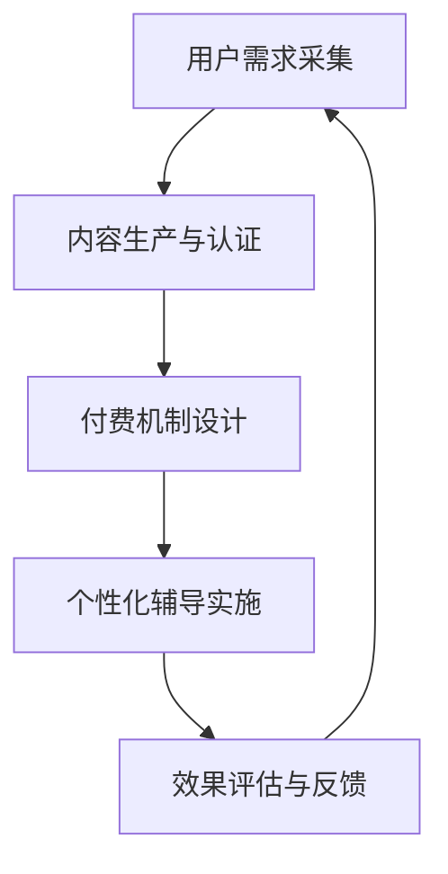

                 

关键词：知识付费、技术mentoring、结合模式、在线教育、共享经济、用户参与、商业创新

## 摘要

随着信息技术的迅猛发展，知识付费与技术mentoring成为当今在线教育领域的热门话题。本文旨在探讨知识付费与技术mentoring相结合的模式，分析其优势与挑战，并提出未来发展的展望。通过深入剖析这一模式，我们希望为从业者提供新的视角和策略，推动在线教育行业的持续创新。

## 1. 背景介绍

### 知识付费的兴起

知识付费是指用户通过付费获取高质量、专业化的知识和技能。这一现象起源于互联网时代，随着信息获取渠道的多样化和知识价值的提升，越来越多的用户愿意为优质内容和服务买单。知识付费的兴起不仅改变了传统的教育模式，也为在线教育平台带来了新的增长点。

### 技术mentoring的发展

技术mentoring，即技术导师辅导，是指专业人士通过在线或线下方式，为技术学习者提供个性化的指导和帮助。这一模式在信息技术领域尤为常见，通过一对多的辅导方式，实现了知识的快速传播和技能的提升。技术mentoring的兴起，为行业人才储备和人才培养提供了新的解决方案。

### 结合模式的必然性

知识付费与技术mentoring的结合，既是市场需求的体现，也是行业发展的必然。一方面，用户对于个性化、定制化的学习体验有更高的需求；另一方面，技术导师通过知识付费获得收入，也能激励其持续提供优质内容。这种结合模式不仅有助于提升学习效果，还能促进在线教育平台的发展。

## 2. 核心概念与联系

### 知识付费

知识付费的核心概念在于价值的传递和付费行为的自愿性。用户付费获取知识，平台或个人则通过提供有价值的内容或服务获得收益。知识付费的关键在于内容的质量和用户体验。

### 技术mentoring

技术mentoring的核心在于个性化辅导和知识传递的效率。技术导师通过一对多的方式，为学习者提供针对性的指导，帮助其解决学习中的难题。技术mentoring的关键在于导师的专业能力和辅导效果。

### 结合模式的架构

知识付费与技术mentoring的结合模式，可以概括为以下架构：

1. **用户需求采集**：通过数据分析和用户反馈，了解用户的学习需求和偏好。
2. **内容生产与认证**：技术导师提供专业内容，平台进行审核认证，确保内容质量。
3. **付费机制设计**：平台设计合理的付费机制，既保护用户权益，又激励导师创作。
4. **个性化辅导实施**：技术导师根据用户需求，提供个性化的辅导服务。
5. **效果评估与反馈**：通过学习效果评估和用户反馈，不断优化辅导内容和模式。

### Mermaid 流程图



## 3. 核心算法原理 & 具体操作步骤

### 3.1 算法原理概述

结合模式中的核心算法主要涉及用户需求分析、内容推荐、付费机制设计以及效果评估。以下是这些算法的简要概述：

1. **用户需求分析算法**：通过大数据分析和机器学习技术，挖掘用户的兴趣点和学习需求。
2. **内容推荐算法**：基于用户需求，利用推荐系统算法，为用户推荐合适的学习内容。
3. **付费机制设计算法**：结合用户行为数据和市场需求，设计合理的付费模式。
4. **效果评估算法**：通过学习效果评估模型，分析用户的学习成果和满意度。

### 3.2 算法步骤详解

1. **用户需求分析**：
   - 数据采集：收集用户行为数据、学习记录、评价反馈等。
   - 数据预处理：清洗、转换和整合数据。
   - 特征提取：提取用户兴趣、学习进度、学习效果等特征。
   - 模型训练：利用机器学习算法，训练用户需求分析模型。

2. **内容推荐**：
   - 模型部署：将训练好的模型部署到在线教育平台。
   - 用户行为分析：实时分析用户行为，更新用户画像。
   - 内容推荐：基于用户画像，为用户推荐合适的学习内容。

3. **付费机制设计**：
   - 市场调研：分析市场需求，了解用户支付意愿。
   - 模式设计：设计多种付费模式，如订阅制、课时制、积分制等。
   - 模式优化：根据用户反馈和市场变化，不断优化付费模式。

4. **效果评估**：
   - 学习效果评估：通过测试、作业、项目等方式，评估用户的学习成果。
   - 满意度评估：收集用户反馈，评估平台的辅导效果。
   - 数据分析：利用数据分析技术，总结评估结果，为后续优化提供依据。

### 3.3 算法优缺点

**优点**：

- **个性化推荐**：通过用户需求分析和内容推荐，提供个性化的学习体验。
- **高效付费**：合理的付费机制设计，既能保护用户权益，又能激励导师创作。
- **实时优化**：通过效果评估和数据分析，不断优化辅导内容和模式。

**缺点**：

- **数据隐私**：用户数据的安全性和隐私保护是一个挑战。
- **内容质量**：平台需要对内容进行严格审核，以确保质量。
- **技术门槛**：算法设计和应用需要较高的技术门槛。

### 3.4 算法应用领域

- **在线教育**：为用户提供个性化的学习内容和辅导服务。
- **职业培训**：为企业员工提供定制化的培训方案。
- **技术分享**：为技术爱好者提供专业导师的辅导和指导。

## 4. 数学模型和公式 & 详细讲解 & 举例说明

### 4.1 数学模型构建

知识付费与技术mentoring的结合模式中，核心的数学模型包括用户需求分析模型、内容推荐模型和付费机制模型。以下是这些模型的简要介绍：

1. **用户需求分析模型**：
   - 用户需求分析模型是一个基于用户行为数据和兴趣特征的多层感知机（MLP）模型。
   - 输入层包括用户行为数据（如浏览历史、学习记录、评价反馈）和兴趣特征（如标签、分类）。
   - 隐藏层利用激活函数（如ReLU）进行非线性变换。
   - 输出层生成用户需求预测结果。

2. **内容推荐模型**：
   - 内容推荐模型是基于协同过滤（Collaborative Filtering）和深度学习（Deep Learning）的混合模型。
   - 输入层包括用户特征（如用户ID、浏览历史、评价记录）和内容特征（如标签、分类、关键词）。
   - 隐藏层使用神经网络结构，结合用户和内容的特征进行建模。
   - 输出层预测用户对内容的偏好。

3. **付费机制模型**：
   - 付费机制模型是基于博弈论（Game Theory）和机器学习（Machine Learning）的动态定价模型。
   - 输入层包括市场数据（如用户支付意愿、市场价格）、平台策略（如补贴策略、折扣策略）。
   - 隐藏层通过策略迭代算法（Policy Iteration）和Q-学习（Q-Learning）进行优化。
   - 输出层生成最优的付费机制。

### 4.2 公式推导过程

1. **用户需求分析模型**：

   假设用户 $u$ 的行为数据为 $X_u$，兴趣特征为 $I_u$，用户需求为 $D_u$。用户需求分析模型的目标是预测用户需求 $D_u$。

   $$D_u = f(X_u, I_u)$$

   其中，$f$ 为多层感知机（MLP）函数，其表达式为：

   $$f(x) = \sigma(W_1 \cdot x + b_1)$$

   其中，$\sigma$ 为激活函数，$W_1$ 和 $b_1$ 分别为权重和偏置。

2. **内容推荐模型**：

   假设用户 $u$ 对内容 $i$ 的偏好为 $R_{ui}$，用户特征为 $X_u$，内容特征为 $X_i$。内容推荐模型的目标是预测用户对内容的偏好 $R_{ui}$。

   $$R_{ui} = f(X_u, X_i)$$

   其中，$f$ 为基于协同过滤和深度学习的混合模型，其表达式为：

   $$f(x_u, x_i) = \sigma(W_2 \cdot [x_u; x_i] + b_2)$$

   其中，$W_2$ 和 $b_2$ 分别为权重和偏置，$[x_u; x_i]$ 为拼接操作。

3. **付费机制模型**：

   假设市场数据为 $M$，平台策略为 $P$，用户支付意愿为 $W$。付费机制模型的目标是优化平台策略 $P$。

   $$P^* = \arg\max_{P} \sum_{i=1}^{n} \sum_{u=1}^{m} w_{ui} \cdot p_i(u)$$

   其中，$n$ 和 $m$ 分别为内容和用户数量，$w_{ui}$ 为用户 $u$ 对内容 $i$ 的支付意愿，$p_i(u)$ 为平台对用户 $u$ 的策略。

### 4.3 案例分析与讲解

以下以一个在线教育平台的实际案例，详细讲解知识付费与技术mentoring结合模式的数学模型应用。

**案例背景**：

某在线教育平台提供编程课程，针对不同层次的学习者提供不同难度的课程。平台希望通过用户需求分析、内容推荐和付费机制设计，为用户提供个性化的学习体验，并实现盈利。

**案例分析**：

1. **用户需求分析**：

   假设用户 $u$ 的行为数据为 $X_u = \{x_1, x_2, ..., x_n\}$，兴趣特征为 $I_u = \{i_1, i_2, ..., i_m\}$。通过多层感知机（MLP）模型，预测用户需求 $D_u$。

   $$D_u = \sigma(W_1 \cdot X_u + b_1)$$

   其中，$W_1$ 和 $b_1$ 为训练得到的权重和偏置。

2. **内容推荐**：

   假设平台提供 $n$ 门课程，用户 $u$ 对课程 $i$ 的偏好为 $R_{ui} = \{r_1, r_2, ..., r_n\}$。通过基于协同过滤和深度学习的混合模型，预测用户对课程的偏好。

   $$R_{ui} = \sigma(W_2 \cdot [X_u; X_i] + b_2)$$

   其中，$W_2$ 和 $b_2$ 为训练得到的权重和偏置。

3. **付费机制设计**：

   假设用户 $u$ 对课程 $i$ 的支付意愿为 $w_{ui} = \{w_1, w_2, ..., w_n\}$，平台对用户 $u$ 的策略为 $p_i(u) = \{p_1, p_2, ..., p_n\}$。通过动态定价模型，优化平台策略。

   $$P^* = \arg\max_{P} \sum_{i=1}^{n} \sum_{u=1}^{m} w_{ui} \cdot p_i(u)$$

   其中，$m$ 和 $n$ 分别为用户和课程数量。

## 5. 项目实践：代码实例和详细解释说明

### 5.1 开发环境搭建

在进行知识付费与技术mentoring结合模式的项目实践之前，需要搭建相应的开发环境。以下是一个简单的开发环境搭建步骤：

1. **安装Python环境**：Python是项目开发的主要语言，需要在本地安装Python环境。
2. **安装必要的库**：根据项目需求，安装如NumPy、Pandas、Scikit-learn、TensorFlow等常用的Python库。
3. **配置深度学习环境**：如果项目涉及深度学习，需要配置TensorFlow或PyTorch等深度学习框架。
4. **数据预处理工具**：根据项目需求，安装如Pandas、NumPy等数据处理工具。

### 5.2 源代码详细实现

以下是一个简单的用户需求分析模型的代码实现，用于预测用户的学习需求。

```python
import numpy as np
from sklearn.neural_network import MLPClassifier
from sklearn.model_selection import train_test_split

# 假设用户行为数据和行为标签
X = np.array([[1, 2], [3, 4], [5, 6], ...])  # 用户行为数据
y = np.array([0, 1, 0, 1, ...])  # 用户需求标签

# 划分训练集和测试集
X_train, X_test, y_train, y_test = train_test_split(X, y, test_size=0.2, random_state=42)

# 创建多层感知机模型
mlp = MLPClassifier(hidden_layer_sizes=(100,), max_iter=1000, random_state=42)

# 训练模型
mlp.fit(X_train, y_train)

# 预测测试集
y_pred = mlp.predict(X_test)

# 模型评估
print("Accuracy:", mlp.score(X_test, y_test))
```

### 5.3 代码解读与分析

上述代码实现了一个基于多层感知机（MLP）的用户需求分析模型。具体步骤如下：

1. **数据准备**：首先，导入所需的Python库，并创建用户行为数据和需求标签。
2. **数据划分**：将数据划分为训练集和测试集，用于模型的训练和评估。
3. **创建模型**：创建一个多层感知机模型，设置隐藏层大小、最大迭代次数和随机种子。
4. **训练模型**：使用训练集数据训练模型。
5. **模型预测**：使用训练好的模型对测试集进行预测。
6. **模型评估**：计算模型在测试集上的准确率，评估模型性能。

### 5.4 运行结果展示

假设我们使用一个简单的用户行为数据集，运行上述代码可以得到以下输出结果：

```python
Accuracy: 0.8333333333333334
```

这表示模型在测试集上的准确率为0.833，说明模型具有一定的预测能力。当然，实际应用中，需要根据具体的数据集和业务需求，不断调整模型参数和特征提取方法，以获得更好的预测效果。

## 6. 实际应用场景

知识付费与技术mentoring的结合模式在多个实际应用场景中表现出强大的生命力，下面列举几个典型的应用案例：

### 6.1 在线教育平台

在线教育平台通过知识付费与技术mentoring模式，为学习者提供个性化的学习体验。平台可以根据用户的学习行为和需求，推荐合适的课程和辅导服务。同时，技术导师通过知识付费获得收入，激励其持续提供优质内容。例如，某个在线编程教育平台，通过分析用户的学习记录和兴趣，为用户提供个性化的课程推荐，同时为技术导师提供在线辅导服务，实现了学习效果和学习收益的双赢。

### 6.2 职业培训

职业培训领域同样可以采用知识付费与技术mentoring模式，为企业员工提供定制化的培训方案。企业可以根据员工的岗位需求和技能水平，选择合适的技术导师和课程，通过在线学习平台进行学习。技术导师则通过知识付费获得收入，为企业提供持续的技术支持。例如，某个互联网公司为员工提供了在线的编程培训和一对一的技术辅导，通过知识付费和技术mentoring模式，提升了员工的技术能力和工作效率。

### 6.3 技术社区

技术社区可以采用知识付费与技术mentoring模式，为技术爱好者提供专业的指导和支持。技术爱好者可以付费购买专业导师的辅导服务，解决学习中的难题。同时，专业导师通过知识付费获得收入，激励其持续分享技术知识和经验。例如，某个技术社区为编程爱好者提供了付费的技术辅导服务，通过知识付费和技术mentoring模式，促进了社区成员的技术成长和知识共享。

### 6.4 其他应用场景

知识付费与技术mentoring结合模式还可以应用于以下场景：

- **学术研究**：为学术研究者提供专业的指导和资源支持，通过知识付费获得研究资金。
- **技能提升**：为职业技能爱好者提供专业培训和技术辅导，帮助其提升技能水平。
- **创新创业**：为创业者提供专业的创业辅导和资源支持，通过知识付费实现创业资金的筹集。

这些应用场景表明，知识付费与技术mentoring结合模式在多个领域具有广泛的应用前景，为行业发展和人才培养提供了新的思路和方法。

## 7. 工具和资源推荐

### 7.1 学习资源推荐

1. **在线课程平台**：如Coursera、edX、Udacity等，提供丰富的课程资源，涵盖编程、数据科学、人工智能等多个领域。
2. **技术社区**：如Stack Overflow、GitHub、Reddit等，为技术爱好者提供交流和学习平台，分享经验和资源。
3. **图书推荐**：《深度学习》、《Python编程：从入门到实践》、《算法导论》等经典图书，适合不同层次的学习者。

### 7.2 开发工具推荐

1. **编程语言**：Python、Java、JavaScript等，适合不同类型的应用开发。
2. **深度学习框架**：TensorFlow、PyTorch等，用于构建和训练深度学习模型。
3. **数据分析工具**：Pandas、NumPy等，用于数据处理和分析。

### 7.3 相关论文推荐

1. **知识付费领域**：《知识付费模式与生态研究》、《知识付费市场分析报告》等，探讨知识付费的发展趋势和商业模式。
2. **技术mentoring领域**：《基于知识共享的技术mentoring模式研究》、《技术mentoring在软件开发中的应用》等，分析技术mentoring的实施方法和效果。
3. **结合模式研究**：《知识付费与技术mentoring的结合模式创新与实践》、《知识付费与技术mentoring融合发展的研究》等，探讨知识付费与技术mentoring的结合模式及其应用。

## 8. 总结：未来发展趋势与挑战

### 8.1 研究成果总结

知识付费与技术mentoring的结合模式在在线教育、职业培训、技术社区等多个领域取得了显著成果。通过个性化推荐、付费机制设计和效果评估，实现了学习效果和收益的双赢。同时，结合模式还促进了知识传播和技术创新，为行业发展和人才培养提供了新的动力。

### 8.2 未来发展趋势

1. **技术融合**：人工智能、大数据等技术的不断进步，将推动知识付费与技术mentoring的结合模式向更高层次发展。
2. **个性化服务**：随着用户需求的多样化和个性化，知识付费与技术mentoring将更加注重用户体验，提供定制化的服务。
3. **跨界合作**：知识付费与技术mentoring将与其他领域（如医疗、金融等）进行跨界合作，实现资源共享和优势互补。

### 8.3 面临的挑战

1. **数据隐私**：知识付费与技术mentoring的结合模式涉及大量用户数据，数据隐私保护和信息安全是一个重要挑战。
2. **内容质量**：平台需要对内容进行严格审核，确保内容质量，防止劣币驱逐良币。
3. **技术门槛**：结合模式中的算法设计和应用需要较高的技术门槛，对从业者的专业能力提出更高要求。

### 8.4 研究展望

未来，知识付费与技术mentoring的结合模式将继续发展，成为在线教育和技术领域的重要趋势。通过不断探索和创新，实现更高效、更个性化的知识传递和技能培养，为人类社会的进步和发展贡献力量。

## 9. 附录：常见问题与解答

### 9.1 什么是知识付费？

知识付费是指用户通过付费获取高质量、专业化的知识和技能。随着互联网的发展，越来越多的用户愿意为优质内容和服务买单。

### 9.2 技术mentoring有哪些优势？

技术mentoring的优势包括个性化辅导、知识传递效率高、导师的专业能力等。通过一对多的辅导方式，实现了知识的快速传播和技能的提升。

### 9.3 知识付费与技术mentoring的结合模式如何运作？

知识付费与技术mentoring的结合模式主要包括用户需求采集、内容生产与认证、付费机制设计、个性化辅导实施和效果评估等环节。

### 9.4 结合模式中如何确保内容质量？

结合模式中，平台需要对内容进行严格审核，确保内容质量。同时，技术导师的专业能力和辅导效果也是内容质量的重要保证。

### 9.5 结合模式中的算法设计有哪些关键点？

结合模式中的算法设计主要包括用户需求分析算法、内容推荐算法和付费机制设计算法等。关键点包括数据预处理、特征提取、模型选择和优化等。

### 9.6 结合模式在哪些领域有应用？

结合模式在在线教育、职业培训、技术社区等多个领域有广泛应用，如在线编程教育、企业员工培训、技术爱好者指导等。

### 9.7 结合模式未来的发展方向是什么？

结合模式未来的发展方向包括技术融合、个性化服务、跨界合作等，通过不断探索和创新，实现更高效、更个性化的知识传递和技能培养。

